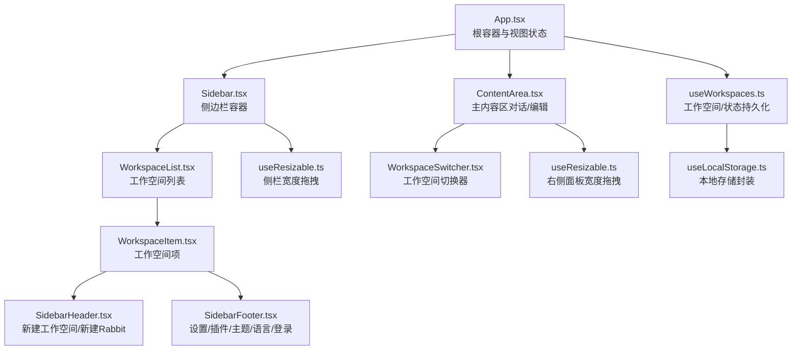
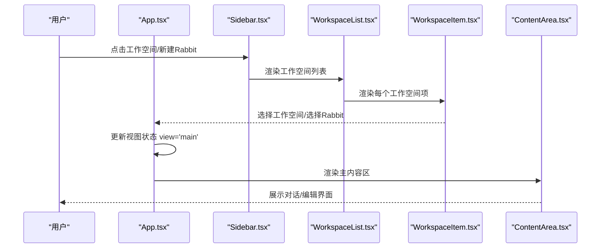
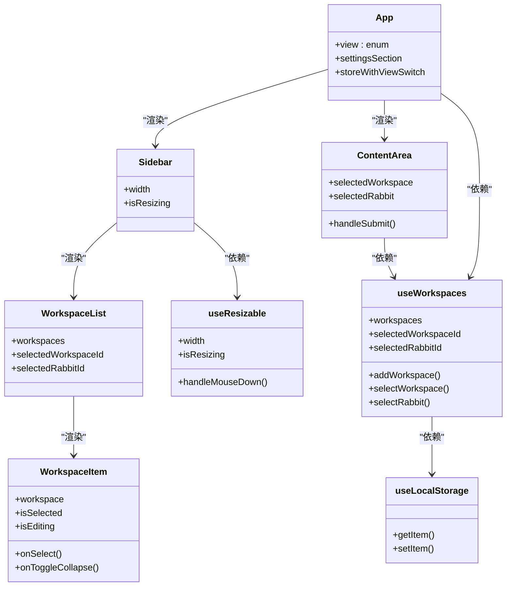

# 路由导航

<cite>
**本文引用的文件**
- [src/App.tsx](file://src/App.tsx)
- [src/main.tsx](file://src/main.tsx)
- [src/components/sidebar/Sidebar.tsx](file://src/components/sidebar/Sidebar.tsx)
- [src/components/sidebar/WorkspaceList.tsx](file://src/components/sidebar/WorkspaceList.tsx)
- [src/components/sidebar/WorkspaceItem.tsx](file://src/components/sidebar/WorkspaceItem.tsx)
- [src/components/sidebar/SidebarHeader.tsx](file://src/components/sidebar/SidebarHeader.tsx)
- [src/components/sidebar/SidebarFooter.tsx](file://src/components/sidebar/SidebarFooter.tsx)
- [src/components/ContentArea.tsx](file://src/components/ContentArea.tsx)
- [src/components/common/WorkspaceSwitcher.tsx](file://src/components/common/WorkspaceSwitcher.tsx)
- [src/hooks/useWorkspaces.ts](file://src/hooks/useWorkspaces.ts)
- [src/hooks/useLocalStorage.ts](file://src/hooks/useLocalStorage.ts)
- [src/hooks/useResizable.ts](file://src/hooks/useResizable.ts)
- [src/types/index.ts](file://src/types/index.ts)
</cite>

## 目录
1. [简介](#简介)
2. [项目结构](#项目结构)
3. [核心组件](#核心组件)
4. [架构总览](#架构总览)
5. [详细组件分析](#详细组件分析)
6. [依赖关系分析](#依赖关系分析)
7. [性能考量](#性能考量)
8. [故障排查指南](#故障排查指南)
9. [结论](#结论)
10. [附录](#附录)

## 简介
本文件面向 RabbitCoding 的“路由导航”体系，系统性阐述其基于 React 的视图切换机制、工作空间与 Rabbit 的导航状态管理、侧边栏导航逻辑、页面懒加载策略、导航状态持久化与历史记录管理，并补充面包屑导航、快捷键支持与导航菜单动态生成的实现要点。同时给出路由扩展指南与导航性能优化建议，帮助开发者在现有架构上安全地演进。

## 项目结构
RabbitCoding 的导航以 App 为根容器，通过一个受控的视图状态驱动主界面布局与内容区切换；侧边栏负责工作空间与 Rabbit 的选择与导航；内容区承载对话与编辑流程；工作空间数据通过自定义 Hook 管理并在本地持久化。

图表来源
- [src/App.tsx:30-104](file://src/App.tsx#L30-L104)
- [src/components/sidebar/Sidebar.tsx:18-45](file://src/components/sidebar/Sidebar.tsx#L18-L45)
- [src/components/sidebar/WorkspaceList.tsx:10-61](file://src/components/sidebar/WorkspaceList.tsx#L10-L61)
- [src/components/sidebar/WorkspaceItem.tsx:38-311](file://src/components/sidebar/WorkspaceItem.tsx#L38-L311)
- [src/components/sidebar/SidebarHeader.tsx:14-161](file://src/components/sidebar/SidebarHeader.tsx#L14-L161)
- [src/components/sidebar/SidebarFooter.tsx:19-422](file://src/components/sidebar/SidebarFooter.tsx#L19-L422)
- [src/components/ContentArea.tsx:31-690](file://src/components/ContentArea.tsx#L31-L690)
- [src/components/common/WorkspaceSwitcher.tsx:12-125](file://src/components/common/WorkspaceSwitcher.tsx#L12-L125)
- [src/hooks/useWorkspaces.ts:28-541](file://src/hooks/useWorkspaces.ts#L28-L541)
- [src/hooks/useLocalStorage.ts:3-27](file://src/hooks/useLocalStorage.ts#L3-L27)
- [src/hooks/useResizable.ts:17-95](file://src/hooks/useResizable.ts#L17-L95)

章节来源
- [src/App.tsx:30-104](file://src/App.tsx#L30-L104)
- [src/main.tsx:1-11](file://src/main.tsx#L1-L11)

## 核心组件
- 视图状态与入口
  - App.tsx 维护顶层视图状态（主界面/设置/插件市场/待办/知识库），并注入工作空间数据与回调，实现点击 Rabbit/Workspace 自动切回主视图。
- 侧边栏与导航
  - Sidebar.tsx 作为容器，组合 SidebarHeader、WorkspaceList、SidebarFooter，支持拖拽调整宽度。
  - WorkspaceList.tsx 基于 useWorkspaces 的状态渲染工作空间列表，支持展开/折叠、编辑、添加 Rabbit 等操作。
  - WorkspaceItem.tsx 负责单个工作空间的渲染与交互，包含 Rabbit 列表、上下文菜单、下拉菜单等。
  - SidebarHeader.tsx 提供新建工作空间与新建 Rabbit 的入口与快捷键提示。
  - SidebarFooter.tsx 提供设置、主题、语言、登录/登出、使用统计等菜单与子菜单。
- 内容区与工作空间切换
  - ContentArea.tsx 是主内容区，根据选中工作空间与 Rabbit 渲染对话与输入区；提供工作空间切换器 WorkspaceSwitcher.tsx。
- 状态与持久化
  - useWorkspaces.ts 提供工作空间与 Rabbit 的增删改查、消息流追加、状态收敛、SQLite/本地回退与双层防抖保存。
  - useLocalStorage.ts 提供本地存储封装，用于主题、模型、代理等轻量状态。
  - useResizable.ts 提供拖拽调整宽度的通用能力，分别应用于侧栏与右侧面板。

章节来源
- [src/App.tsx:30-104](file://src/App.tsx#L30-L104)
- [src/components/sidebar/Sidebar.tsx:18-45](file://src/components/sidebar/Sidebar.tsx#L18-L45)
- [src/components/sidebar/WorkspaceList.tsx:10-61](file://src/components/sidebar/WorkspaceList.tsx#L10-L61)
- [src/components/sidebar/WorkspaceItem.tsx:38-311](file://src/components/sidebar/WorkspaceItem.tsx#L38-L311)
- [src/components/sidebar/SidebarHeader.tsx:14-161](file://src/components/sidebar/SidebarHeader.tsx#L14-L161)
- [src/components/sidebar/SidebarFooter.tsx:19-422](file://src/components/sidebar/SidebarFooter.tsx#L19-L422)
- [src/components/ContentArea.tsx:31-690](file://src/components/ContentArea.tsx#L31-L690)
- [src/components/common/WorkspaceSwitcher.tsx:12-125](file://src/components/common/WorkspaceSwitcher.tsx#L12-L125)
- [src/hooks/useWorkspaces.ts:28-541](file://src/hooks/useWorkspaces.ts#L28-L541)
- [src/hooks/useLocalStorage.ts:3-27](file://src/hooks/useLocalStorage.ts#L3-L27)
- [src/hooks/useResizable.ts:17-95](file://src/hooks/useResizable.ts#L17-L95)

## 架构总览
RabbitCoding 的导航采用“视图状态 + 数据状态 + 本地持久化”的三层控制：
- 视图状态：App.tsx 的 view 控制主界面、设置、插件市场、待办、知识库等视图切换。
- 数据状态：useWorkspaces.ts 管理工作空间与 Rabbit 的选择、编辑、消息流等，提供统一的更新接口。
- 持久化：useLocalStorage.ts 与 SQLite 回退结合，确保用户偏好与选择在重启后恢复。

图表来源
- [src/App.tsx:36-47](file://src/App.tsx#L36-L47)
- [src/components/sidebar/Sidebar.tsx:32-34](file://src/components/sidebar/Sidebar.tsx#L32-L34)
- [src/components/sidebar/WorkspaceList.tsx:30-60](file://src/components/sidebar/WorkspaceList.tsx#L30-L60)
- [src/components/sidebar/WorkspaceItem.tsx:237-251](file://src/components/sidebar/WorkspaceItem.tsx#L237-L251)
- [src/components/ContentArea.tsx:465-471](file://src/components/ContentArea.tsx#L465-L471)

## 详细组件分析

### 视图切换与路由状态
- 视图状态
  - App.tsx 维护 view 与 settingsSection，支持主界面、设置、插件市场、待办、知识库五种视图。
  - 通过 useMemo 包裹 store，将 selectRabbit/selectWorkspace 的回调改写为“先更新选择，再切回主视图”，保证用户点击导航元素后回到主内容区。
- 页面组件懒加载策略
  - 设置页、插件市场页、待办页、知识库页均通过条件渲染在 App.tsx 中按需挂载，属于“按需渲染”而非代码分割的懒加载。若需进一步优化首屏，可在上述页面组件处引入 React.lazy 与 Suspense。
- 导航状态持久化
  - selectedWorkspaceId、selectedRabbitId 通过 useLocalStorage.ts 持久化，重启后自动恢复。
  - useWorkspaces.ts 在 dbReady=true 时采用双层防抖保存（500ms 触发 + 3s 周期），DB 不可用时回退到 localStorage。
- 历史记录管理
  - 代码未实现浏览器历史栈（history.pushState/replaceState）或第三方路由库，导航切换通过组件内部状态驱动，不产生历史记录。若需支持浏览器前进/后退，可引入路由库并在 App.tsx 中以路由参数驱动视图状态。

章节来源
- [src/App.tsx:30-104](file://src/App.tsx#L30-L104)
- [src/hooks/useWorkspaces.ts:28-130](file://src/hooks/useWorkspaces.ts#L28-L130)
- [src/hooks/useLocalStorage.ts:3-27](file://src/hooks/useLocalStorage.ts#L3-L27)

### Sidebar 侧边栏导航逻辑
- 结构与职责
  - Sidebar.tsx 作为容器，集成标题栏、工作空间列表、底部菜单与拖拽手柄。
  - SidebarHeader.tsx 提供新建工作空间与新建 Rabbit 的入口，并在无有效工作空间时回退到首个工作空间。
  - WorkspaceList.tsx 与 WorkspaceItem.tsx 负责工作空间与 Rabbit 的选择、编辑、添加、删除、折叠/展开等交互。
  - SidebarFooter.tsx 提供设置、主题、语言、登录/登出、使用统计等菜单与子菜单。
- 快捷键支持
  - SidebarHeader.tsx 中“新建Rabbit”按钮显示平台快捷键提示（如 macOS 的 ⌘ N 或 Windows 的 Win+N），提升可用性。
- 动态生成菜单
  - SidebarFooter.tsx 的菜单项根据用户登录状态动态生成（登录后显示用户信息与登出项；未登录显示登录入口）。

章节来源
- [src/components/sidebar/Sidebar.tsx:18-45](file://src/components/sidebar/Sidebar.tsx#L18-L45)
- [src/components/sidebar/SidebarHeader.tsx:14-161](file://src/components/sidebar/SidebarHeader.tsx#L14-L161)
- [src/components/sidebar/WorkspaceList.tsx:10-61](file://src/components/sidebar/WorkspaceList.tsx#L10-L61)
- [src/components/sidebar/WorkspaceItem.tsx:38-311](file://src/components/sidebar/WorkspaceItem.tsx#L38-L311)
- [src/components/sidebar/SidebarFooter.tsx:19-422](file://src/components/sidebar/SidebarFooter.tsx#L19-L422)

### WorkspaceList 工作空间切换与路由参数传递
- 工作空间切换
  - WorkspaceList.tsx 通过 onOpenKnowledgeBase 将 workspaceId 传递给父组件，由父组件触发视图切换至知识库。
  - ContentArea.tsx 中的 WorkspaceSwitcher.tsx 提供工作空间切换器，支持搜索与选择。
- 路由参数传递
  - 当前实现通过回调函数传递 workspaceId，未使用 URL 参数。若需支持分享链接或浏览器历史，可在 App.tsx 中引入路由库并通过 location.hash 或 history.pushState 传递参数。

章节来源
- [src/components/sidebar/WorkspaceList.tsx:5-8](file://src/components/sidebar/WorkspaceList.tsx#L5-L8)
- [src/components/sidebar/WorkspaceList.tsx:56](file://src/components/sidebar/WorkspaceList.tsx#L56)
- [src/components/ContentArea.tsx:550-554](file://src/components/ContentArea.tsx#L550-L554)

### 页面组件懒加载策略
- 现状
  - App.tsx 中的设置页、插件市场页、待办页、知识库页采用条件渲染，属于“按需挂载”。未使用 React.lazy 与 Suspense。
- 建议
  - 对大型页面（如设置页、知识库页）引入 React.lazy 与 Suspense，减少首屏 JS 体积，提升首屏渲染性能。
  - 对频繁切换但复用度高的组件（如设置页各子面板）可考虑使用缓存策略（例如 keep-alive）以减少重复渲染。

章节来源
- [src/App.tsx:72-96](file://src/App.tsx#L72-L96)

### 导航状态持久化与历史记录
- 持久化
  - selectedWorkspaceId、selectedRabbitId 通过 useLocalStorage.ts 持久化，重启后恢复。
  - useWorkspaces.ts 在 dbReady=true 时采用双层防抖保存（500ms 触发 + 3s 周期），DB 不可用时回退到 localStorage。
- 历史记录
  - 未实现浏览器历史栈，导航切换不产生历史记录。若需支持前进/后退，建议引入路由库并在 App.tsx 中以路由参数驱动视图状态。

章节来源
- [src/hooks/useLocalStorage.ts:3-27](file://src/hooks/useLocalStorage.ts#L3-L27)
- [src/hooks/useWorkspaces.ts:28-130](file://src/hooks/useWorkspaces.ts#L28-L130)
- [src/App.tsx:30-104](file://src/App.tsx#L30-L104)

### 面包屑导航、快捷键与动态菜单
- 面包屑导航
  - ContentArea.tsx 在标题栏展示了当前 Rabbit 名称与所在工作空间名称，可视为简化的面包屑导航。
- 快捷键支持
  - SidebarHeader.tsx 中“新建Rabbit”按钮显示平台快捷键提示（如 macOS 的 ⌘ N 或 Windows 的 Win+N）。
- 动态菜单
  - SidebarFooter.tsx 根据用户登录状态动态生成菜单项（登录后显示用户信息与登出项；未登录显示登录入口）。

章节来源
- [src/components/ContentArea.tsx:436-444](file://src/components/ContentArea.tsx#L436-L444)
- [src/components/sidebar/SidebarHeader.tsx:76-78](file://src/components/sidebar/SidebarHeader.tsx#L76-L78)
- [src/components/sidebar/SidebarFooter.tsx:140-146](file://src/components/sidebar/SidebarFooter.tsx#L140-L146)

### 导航性能优化建议
- 减少重渲染
  - 使用 useMemo/useCallback 包裹传递给子组件的回调与派生数据，避免不必要的重渲染。
  - 对大型列表（如 WorkspaceList）使用虚拟滚动（例如 react-window）降低 DOM 节点数量。
- 懒加载与缓存
  - 对大型页面引入 React.lazy 与 Suspense；对频繁切换的页面组件使用缓存策略。
- 存储与 IO
  - 保持 useWorkspaces.ts 的双层防抖策略，避免高频写入；对大体量数据分批写入或使用批量事务。
- 拖拽与响应式
  - useResizable.ts 的拖拽计算在 mousemove 中进行，建议在拖拽结束后再写入本地存储，减少频繁 IO。

章节来源
- [src/hooks/useWorkspaces.ts:100-120](file://src/hooks/useWorkspaces.ts#L100-L120)
- [src/hooks/useResizable.ts:56-85](file://src/hooks/useResizable.ts#L56-L85)

## 依赖关系分析

图表来源
- [src/App.tsx:30-104](file://src/App.tsx#L30-L104)
- [src/components/sidebar/Sidebar.tsx:18-45](file://src/components/sidebar/Sidebar.tsx#L18-L45)
- [src/components/sidebar/WorkspaceList.tsx:10-61](file://src/components/sidebar/WorkspaceList.tsx#L10-L61)
- [src/components/sidebar/WorkspaceItem.tsx:38-311](file://src/components/sidebar/WorkspaceItem.tsx#L38-L311)
- [src/components/ContentArea.tsx:31-690](file://src/components/ContentArea.tsx#L31-L690)
- [src/hooks/useWorkspaces.ts:28-541](file://src/hooks/useWorkspaces.ts#L28-L541)
- [src/hooks/useLocalStorage.ts:3-27](file://src/hooks/useLocalStorage.ts#L3-L27)
- [src/hooks/useResizable.ts:17-95](file://src/hooks/useResizable.ts#L17-L95)

章节来源
- [src/App.tsx:30-104](file://src/App.tsx#L30-L104)
- [src/hooks/useWorkspaces.ts:28-541](file://src/hooks/useWorkspaces.ts#L28-L541)

## 性能考量
- 渲染性能
  - 通过 useMemo/useCallback 降低重渲染；对大型列表使用虚拟化；对复杂面板采用懒加载。
- 存储性能
  - 保持双层防抖策略；对大体量数据分批写入；必要时使用批量事务。
- IO 与网络
  - 代理指纹检测与 sidecar 启停需谨慎，避免频繁重启；对 API Key 与代理配置变更进行节流。
- 响应式与拖拽
  - 拖拽过程中避免频繁写入本地存储；拖拽结束后再持久化宽度。

## 故障排查指南
- 数据加载失败
  - useWorkspaces.ts 在首次加载失败时会回退到 localStorage；检查 db_has_data/db_load_all 的调用是否成功。
- 代理配置变更导致 sidecar 重启
  - ensureSidecarAndQuery 中检测代理指纹，若变更会先停止再启动；确认代理配置变更后是否正确重启。
- 本地存储异常
  - useLocalStorage.ts 在 setItem 失败时静默忽略；检查磁盘空间与浏览器隐私模式限制。
- 导航状态未恢复
  - 确认 selectedWorkspaceId/selectedRabbitId 是否存在于当前 workspaces；若不存在，UI 会回退到 null 或首个工作空间。

章节来源
- [src/hooks/useWorkspaces.ts:48-95](file://src/hooks/useWorkspaces.ts#L48-L95)
- [src/components/ContentArea.tsx:144-158](file://src/components/ContentArea.tsx#L144-L158)
- [src/hooks/useLocalStorage.ts:13-23](file://src/hooks/useLocalStorage.ts#L13-L23)
- [src/App.tsx:36-47](file://src/App.tsx#L36-L47)

## 结论
RabbitCoding 的导航体系以 App.tsx 的视图状态为核心，配合 useWorkspaces.ts 的数据状态与 useLocalStorage.ts 的持久化，实现了简洁高效的侧边栏导航与主内容区切换。当前未引入浏览器历史栈或路由库，导航切换通过组件内部状态驱动。若需支持分享链接、浏览器前进/后退与更复杂的路由场景，建议引入路由库并在 App.tsx 中以路由参数驱动视图状态，同时保持现有状态持久化与性能优化策略。

## 附录

### 路由扩展指南
- 引入路由库（如 react-router）
  - 在 App.tsx 中以路由参数驱动 view 与 settingsSection，将 WorkspaceList 的 onOpenKnowledgeBase 改为 navigate('/knowledge-base/:id')。
  - 通过 useLocation/useNavigate 管理路由状态，结合 useWorkspaces 的选择状态实现双向绑定。
- 参数校验与回退
  - 若路由参数指向的工作空间或 Rabbit 不存在，回退到 null 或首个有效项，并重定向到默认路由。
- 历史记录
  - 使用 history.pushState/replaceState 记录导航历史，支持浏览器前进/后退；或在路由库中使用 replace 与 push。

### 导航菜单动态生成
- 用户状态驱动
  - 根据 useAuth 的登录状态动态生成菜单项（登录后显示用户信息与登出项；未登录显示登录入口）。
- 权限与功能开关
  - 可通过配置项控制菜单项的显示与禁用，避免在 UI 中硬编码分支。