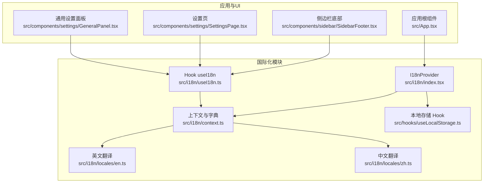
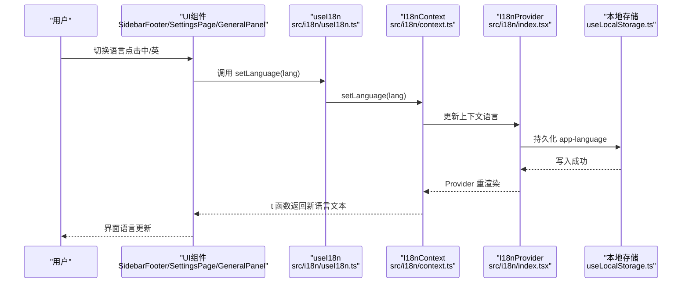
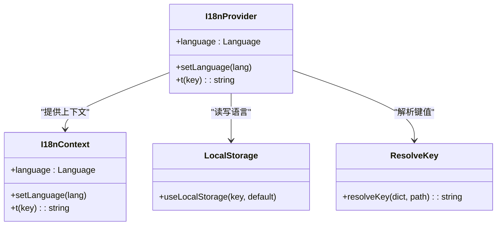
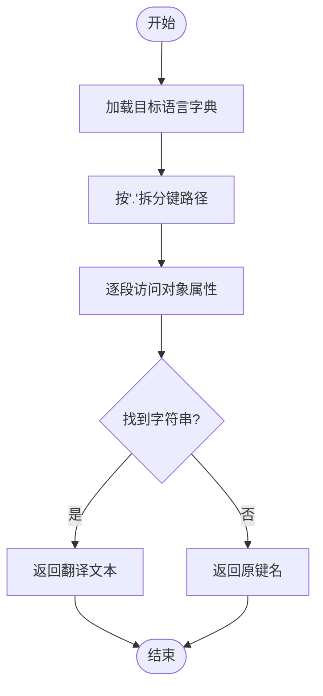
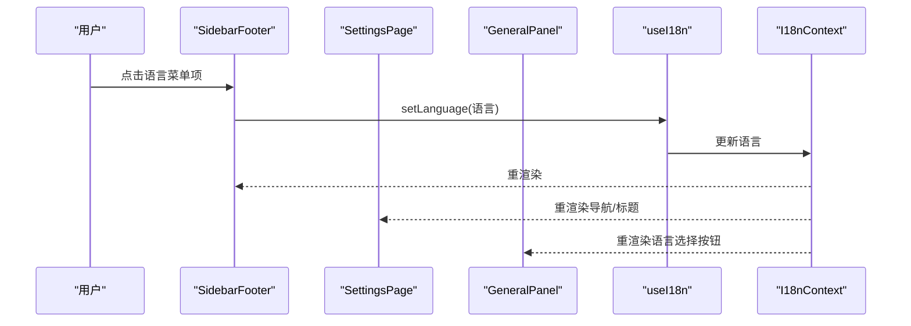
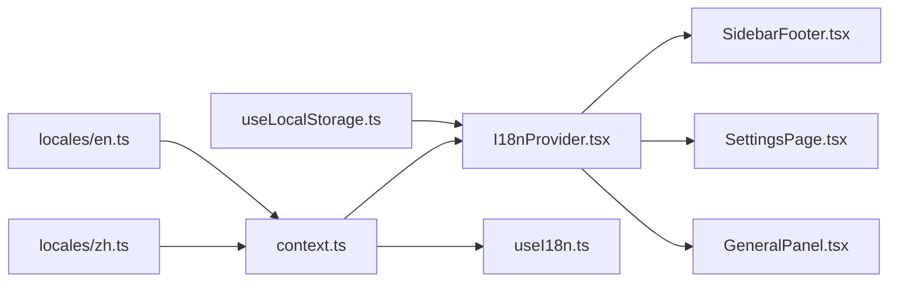

# 国际化支持

<cite>
**本文引用的文件**
- [src/i18n/index.tsx](file://src/i18n/index.tsx)
- [src/i18n/context.ts](file://src/i18n/context.ts)
- [src/i18n/useI18n.ts](file://src/i18n/useI18n.ts)
- [src/i18n/locales/en.ts](file://src/i18n/locales/en.ts)
- [src/i18n/locales/zh.ts](file://src/i18n/locales/zh.ts)
- [src/hooks/useLocalStorage.ts](file://src/hooks/useLocalStorage.ts)
- [src/App.tsx](file://src/App.tsx)
- [src/components/sidebar/SidebarFooter.tsx](file://src/components/sidebar/SidebarFooter.tsx)
- [src/components/settings/SettingsPage.tsx](file://src/components/settings/SettingsPage.tsx)
- [src/components/settings/GeneralPanel.tsx](file://src/components/settings/GeneralPanel.tsx)
- [README.md](file://README.md)
</cite>

## 目录
1. [简介](#简介)
2. [项目结构](#项目结构)
3. [核心组件](#核心组件)
4. [架构总览](#架构总览)
5. [详细组件分析](#详细组件分析)
6. [依赖关系分析](#依赖关系分析)
7. [性能考量](#性能考量)
8. [故障排查指南](#故障排查指南)
9. [结论](#结论)
10. [附录](#附录)

## 简介
本文件面向 RabbitCoding 的国际化（i18n）支持系统，系统性阐述多语言配置、翻译管理机制、本地化实践与最佳实践。内容覆盖：
- i18n 框架设计与使用方式
- 翻译键值管理与动态语言切换
- 文本提取流程、翻译文件组织与质量保障
- 与 UI 组件的集成方式与本地化测试方法
- 性能优化与缓存策略建议

## 项目结构
国际化相关代码集中在 src/i18n 目录，并与应用根组件、侧边栏、设置页等 UI 组件协同工作。

**图表来源**
- [src/i18n/index.tsx](file://src/i18n/index.tsx)
- [src/i18n/context.ts](file://src/i18n/context.ts)
- [src/i18n/useI18n.ts](file://src/i18n/useI18n.ts)
- [src/i18n/locales/en.ts](file://src/i18n/locales/en.ts)
- [src/i18n/locales/zh.ts](file://src/i18n/locales/zh.ts)
- [src/hooks/useLocalStorage.ts](file://src/hooks/useLocalStorage.ts)
- [src/App.tsx](file://src/App.tsx)
- [src/components/sidebar/SidebarFooter.tsx](file://src/components/sidebar/SidebarFooter.tsx)
- [src/components/settings/SettingsPage.tsx](file://src/components/settings/SettingsPage.tsx)
- [src/components/settings/GeneralPanel.tsx](file://src/components/settings/GeneralPanel.tsx)

**章节来源**
- [src/i18n/index.tsx](file://src/i18n/index.tsx)
- [src/i18n/context.ts](file://src/i18n/context.ts)
- [src/i18n/useI18n.ts](file://src/i18n/useI18n.ts)
- [src/i18n/locales/en.ts](file://src/i18n/locales/en.ts)
- [src/i18n/locales/zh.ts](file://src/i18n/locales/zh.ts)
- [src/hooks/useLocalStorage.ts](file://src/hooks/useLocalStorage.ts)
- [src/App.tsx](file://src/App.tsx)
- [src/components/sidebar/SidebarFooter.tsx](file://src/components/sidebar/SidebarFooter.tsx)
- [src/components/settings/SettingsPage.tsx](file://src/components/settings/SettingsPage.tsx)
- [src/components/settings/GeneralPanel.tsx](file://src/components/settings/GeneralPanel.tsx)

## 核心组件
- I18nProvider：提供语言状态与翻译函数，持久化语言选择于本地存储。
- 上下文与字典：集中管理语言枚举、翻译字典、键值解析函数。
- useI18n Hook：消费上下文，暴露语言、切换语言与翻译函数。
- 语言包：英文与中文翻译字典，采用层级键值结构，支持函数式占位替换。
- 本地存储 Hook：封装 localStorage 读写，确保兜底与异常安全。

关键职责与行为：
- 动态语言切换：通过 setLanguage 更新上下文，触发组件重渲染。
- 键值解析：resolveKey 支持“点”式路径访问，非字符串键回退为键名本身。
- 默认语言：首次加载默认为中文，用户切换后持久化。

**章节来源**
- [src/i18n/index.tsx](file://src/i18n/index.tsx)
- [src/i18n/context.ts](file://src/i18n/context.ts)
- [src/i18n/useI18n.ts](file://src/i18n/useI18n.ts)
- [src/i18n/locales/en.ts](file://src/i18n/locales/en.ts)
- [src/i18n/locales/zh.ts](file://src/i18n/locales/zh.ts)
- [src/hooks/useLocalStorage.ts](file://src/hooks/useLocalStorage.ts)

## 架构总览
i18n 架构围绕 React Context 展开，I18nProvider 在应用根部注入语言与翻译能力；各 UI 组件通过 useI18n 获取 t 函数与语言状态，实现统一的本地化渲染。

**图表来源**
- [src/i18n/useI18n.ts](file://src/i18n/useI18n.ts)
- [src/i18n/context.ts](file://src/i18n/context.ts)
- [src/i18n/index.tsx](file://src/i18n/index.tsx)
- [src/hooks/useLocalStorage.ts](file://src/hooks/useLocalStorage.ts)
- [src/components/sidebar/SidebarFooter.tsx](file://src/components/sidebar/SidebarFooter.tsx)
- [src/components/settings/SettingsPage.tsx](file://src/components/settings/SettingsPage.tsx)
- [src/components/settings/GeneralPanel.tsx](file://src/components/settings/GeneralPanel.tsx)

## 详细组件分析

### I18nProvider 与上下文
- 提供语言与翻译函数：language、setLanguage、t。
- 语言持久化：通过 useLocalStorage 读取/写入 app-language。
- 翻译函数：resolveKey 支持“.”分隔的嵌套键访问，若找不到对应字符串则回退为键名。

**图表来源**
- [src/i18n/index.tsx](file://src/i18n/index.tsx)
- [src/i18n/context.ts](file://src/i18n/context.ts)
- [src/hooks/useLocalStorage.ts](file://src/hooks/useLocalStorage.ts)

**章节来源**
- [src/i18n/index.tsx](file://src/i18n/index.tsx)
- [src/i18n/context.ts](file://src/i18n/context.ts)
- [src/hooks/useLocalStorage.ts](file://src/hooks/useLocalStorage.ts)

### 翻译字典与键值管理
- 字典结构：采用嵌套对象，键名为语义化路径（如 settings.nav.general），便于维护与查找。
- 函数式占位：部分字段为函数，支持参数化渲染（如时间单位）。
- 语言包：英文与中文两套字典，保持键名一致，便于对齐与校验。

**图表来源**
- [src/i18n/context.ts](file://src/i18n/context.ts)
- [src/i18n/locales/en.ts](file://src/i18n/locales/en.ts)
- [src/i18n/locales/zh.ts](file://src/i18n/locales/zh.ts)

**章节来源**
- [src/i18n/context.ts](file://src/i18n/context.ts)
- [src/i18n/locales/en.ts](file://src/i18n/locales/en.ts)
- [src/i18n/locales/zh.ts](file://src/i18n/locales/zh.ts)

### UI 集成与动态语言切换
- 侧边栏底部：提供语言子菜单，点击切换语言并关闭菜单。
- 设置页：导航项与标题均通过翻译键渲染，体现动态语言切换效果。
- 通用设置面板：语言选择按钮直接调用 setLanguage，即时生效。

**图表来源**
- [src/components/sidebar/SidebarFooter.tsx](file://src/components/sidebar/SidebarFooter.tsx)
- [src/components/settings/SettingsPage.tsx](file://src/components/settings/SettingsPage.tsx)
- [src/components/settings/GeneralPanel.tsx](file://src/components/settings/GeneralPanel.tsx)
- [src/i18n/useI18n.ts](file://src/i18n/useI18n.ts)
- [src/i18n/context.ts](file://src/i18n/context.ts)

**章节来源**
- [src/components/sidebar/SidebarFooter.tsx](file://src/components/sidebar/SidebarFooter.tsx)
- [src/components/settings/SettingsPage.tsx](file://src/components/settings/SettingsPage.tsx)
- [src/components/settings/GeneralPanel.tsx](file://src/components/settings/GeneralPanel.tsx)
- [src/i18n/useI18n.ts](file://src/i18n/useI18n.ts)
- [src/i18n/context.ts](file://src/i18n/context.ts)

### 文本提取与翻译文件组织
- 提取流程：在开发阶段，UI 中使用翻译键（如 settings.nav.general）；构建时由翻译字典提供对应文案。
- 文件组织：按语言划分文件，键名保持一致，便于对比与校验。
- 质量保障：建议在 CI 中增加键名一致性检查与缺失键告警。

**章节来源**
- [src/i18n/locales/en.ts](file://src/i18n/locales/en.ts)
- [src/i18n/locales/zh.ts](file://src/i18n/locales/zh.ts)
- [src/components/settings/SettingsPage.tsx](file://src/components/settings/SettingsPage.tsx)

## 依赖关系分析
- I18nProvider 依赖 useLocalStorage 实现语言持久化。
- useI18n 依赖 I18nContext 提供的语言与翻译函数。
- UI 组件（SidebarFooter、SettingsPage、GeneralPanel）依赖 useI18n 进行本地化渲染。
- 语言包（en.ts、zh.ts）作为静态资源被上下文引用。

**图表来源**
- [src/hooks/useLocalStorage.ts](file://src/hooks/useLocalStorage.ts)
- [src/i18n/index.tsx](file://src/i18n/index.tsx)
- [src/i18n/context.ts](file://src/i18n/context.ts)
- [src/i18n/useI18n.ts](file://src/i18n/useI18n.ts)
- [src/components/sidebar/SidebarFooter.tsx](file://src/components/sidebar/SidebarFooter.tsx)
- [src/components/settings/SettingsPage.tsx](file://src/components/settings/SettingsPage.tsx)
- [src/components/settings/GeneralPanel.tsx](file://src/components/settings/GeneralPanel.tsx)
- [src/i18n/locales/en.ts](file://src/i18n/locales/en.ts)
- [src/i18n/locales/zh.ts](file://src/i18n/locales/zh.ts)

**章节来源**
- [src/hooks/useLocalStorage.ts](file://src/hooks/useLocalStorage.ts)
- [src/i18n/index.tsx](file://src/i18n/index.tsx)
- [src/i18n/context.ts](file://src/i18n/context.ts)
- [src/i18n/useI18n.ts](file://src/i18n/useI18n.ts)
- [src/components/sidebar/SidebarFooter.tsx](file://src/components/sidebar/SidebarFooter.tsx)
- [src/components/settings/SettingsPage.tsx](file://src/components/settings/SettingsPage.tsx)
- [src/components/settings/GeneralPanel.tsx](file://src/components/settings/GeneralPanel.tsx)
- [src/i18n/locales/en.ts](file://src/i18n/locales/en.ts)
- [src/i18n/locales/zh.ts](file://src/i18n/locales/zh.ts)

## 性能考量
- 渲染性能：翻译函数 t 为纯函数，依赖上下文语言状态；合理使用 useCallback 与 memo 化可减少重渲染。
- 访问性能：resolveKey 为 O(k)（k 为路径段数），嵌套层级建议控制在合理范围。
- 持久化性能：localStorage 写入为同步阻塞，建议避免高频写入；可在用户主动切换后批量写入。
- 缓存策略：当前未实现翻译字典缓存；可在应用层引入字典缓存与懒加载，降低首屏渲染成本。

[本节为通用性能讨论，无需列出具体文件来源]

## 故障排查指南
- useI18n 必须在 I18nProvider 内使用：若未包裹 Provider，useI18n 将抛出错误。
- 语言切换无效：检查本地存储键 app-language 是否被禁用或满载；确认 setLanguage 调用链路。
- 键名缺失：resolveKey 对未找到的键回退为键名本身；建议在 CI 中加入键名一致性检查。
- UI 不更新：确认组件是否订阅了 I18nContext；确保父级 Provider 未被意外拆分。

**章节来源**
- [src/i18n/useI18n.ts](file://src/i18n/useI18n.ts)
- [src/i18n/context.ts](file://src/i18n/context.ts)
- [src/hooks/useLocalStorage.ts](file://src/hooks/useLocalStorage.ts)

## 结论
RabbitCoding 的 i18n 系统以 React Context 为核心，结合本地存储与简洁的键值解析，实现了轻量、可扩展的多语言支持。通过在 UI 组件中统一使用翻译键，配合语言包的清晰组织，系统具备良好的可维护性与扩展性。建议在后续迭代中引入键名校验、字典缓存与更完善的测试流程，进一步提升质量与性能。

[本节为总结性内容，无需列出具体文件来源]

## 附录

### 使用示例与最佳实践
- 在组件中使用翻译键：在 UI 文案处使用 t('settings.nav.general') 等键名。
- 动态语言切换：在设置页或侧边栏底部提供语言选择按钮，调用 setLanguage。
- 键值设计：采用语义化路径，避免硬编码文本；必要时使用函数式占位。
- 本地化测试：在不同语言环境下核对 UI 文案长度与布局；对关键路径进行回归测试。
- 扩展指导：新增语言时，复制现有语言包并按键名逐条翻译；在 context.ts 中注册新语言并在 UI 中暴露选择入口。

**章节来源**
- [src/components/settings/SettingsPage.tsx](file://src/components/settings/SettingsPage.tsx)
- [src/components/sidebar/SidebarFooter.tsx](file://src/components/sidebar/SidebarFooter.tsx)
- [src/components/settings/GeneralPanel.tsx](file://src/components/settings/GeneralPanel.tsx)
- [src/i18n/locales/en.ts](file://src/i18n/locales/en.ts)
- [src/i18n/locales/zh.ts](file://src/i18n/locales/zh.ts)

### 与 UI 组件的集成方式
- 应用根部注入：在 App.tsx 中包裹 I18nProvider，确保全局可用。
- 组件消费：SidebarFooter、SettingsPage、GeneralPanel 等通过 useI18n 获取 t 与语言状态。
- 事件驱动：语言切换通过 setLanguage 触发上下文更新，UI 自动重渲染。

**章节来源**
- [src/App.tsx](file://src/App.tsx)
- [src/i18n/useI18n.ts](file://src/i18n/useI18n.ts)
- [src/components/sidebar/SidebarFooter.tsx](file://src/components/sidebar/SidebarFooter.tsx)
- [src/components/settings/SettingsPage.tsx](file://src/components/settings/SettingsPage.tsx)
- [src/components/settings/GeneralPanel.tsx](file://src/components/settings/GeneralPanel.tsx)

### 本地化测试方法
- 人工测试：在不同语言环境下检查 UI 布局与文案长度，确保不截断。
- 自动化测试：在 CI 中增加键名一致性检查与缺失键告警；对关键页面进行快照对比。
- 行为测试：验证语言切换后，导航、标题、按钮等文案同步更新。

**章节来源**
- [src/i18n/locales/en.ts](file://src/i18n/locales/en.ts)
- [src/i18n/locales/zh.ts](file://src/i18n/locales/zh.ts)
- [src/components/settings/SettingsPage.tsx](file://src/components/settings/SettingsPage.tsx)