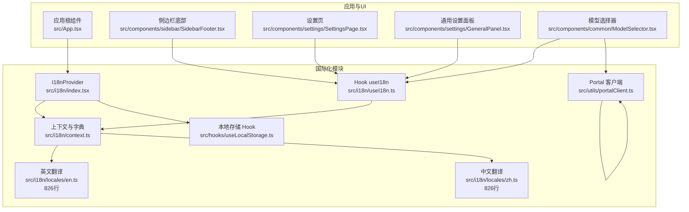
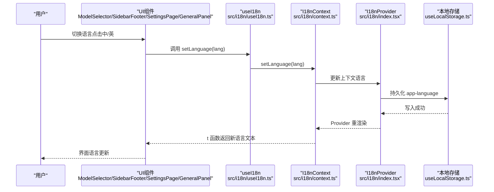
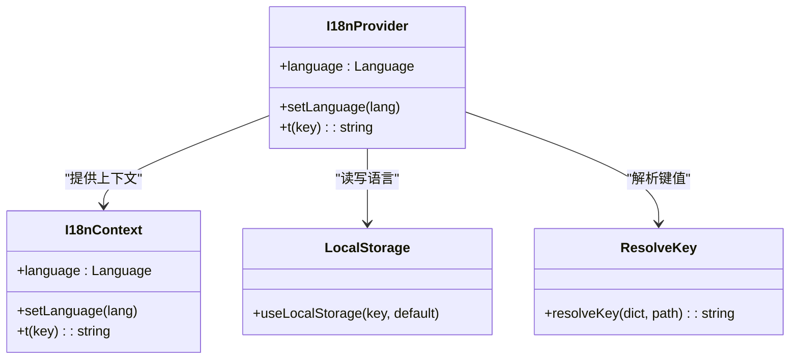
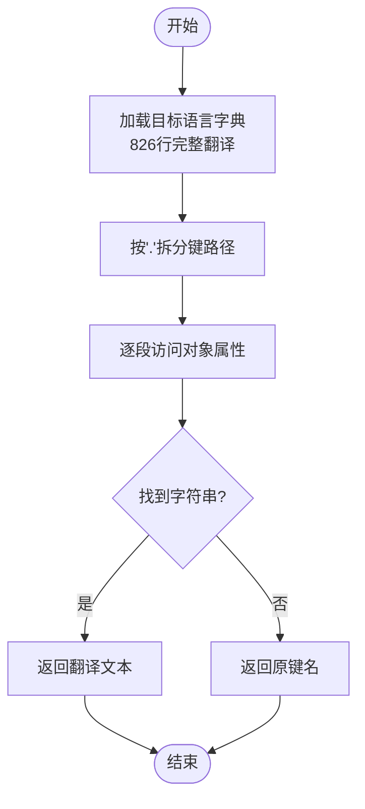
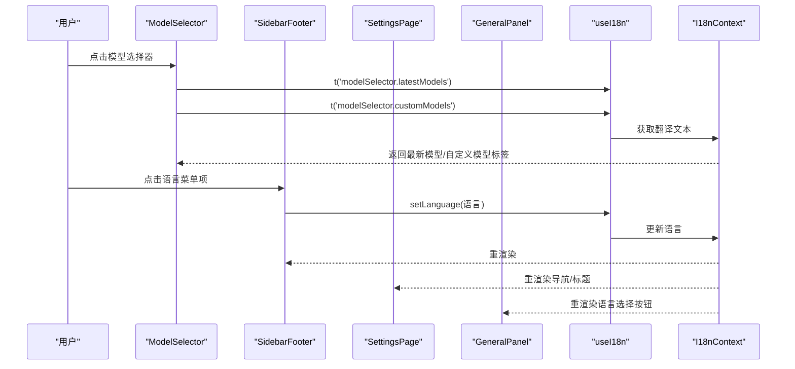
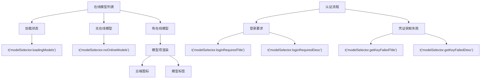
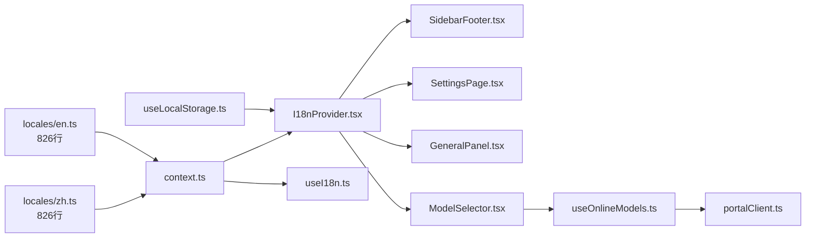

# 国际化支持

<cite>
**本文引用的文件**
- [src/i18n/index.tsx](file://src/i18n/index.tsx)
- [src/i18n/context.ts](file://src/i18n/context.ts)
- [src/i18n/useI18n.ts](file://src/i18n/useI18n.ts)
- [src/i18n/locales/en.ts](file://src/i18n/locales/en.ts)
- [src/i18n/locales/zh.ts](file://src/i18n/locales/zh.ts)
- [src/hooks/useLocalStorage.ts](file://src/hooks/useLocalStorage.ts)
- [src/hooks/useOnlineModels.ts](file://src/hooks/useOnlineModels.ts)
- [src/components/common/ModelSelector.tsx](file://src/components/common/ModelSelector.tsx)
- [src/utils/portalClient.ts](file://src/utils/portalClient.ts)
- [src/App.tsx](file://src/App.tsx)
- [src/components/sidebar/SidebarFooter.tsx](file://src/components/sidebar/SidebarFooter.tsx)
- [src/components/settings/SettingsPage.tsx](file://src/components/settings/SettingsPage.tsx)
- [src/components/settings/GeneralPanel.tsx](file://src/components/settings/GeneralPanel.tsx)
- [README.md](file://README.md)
</cite>

## 更新摘要
**变更内容**
- 新增在线模型功能相关的翻译键，完善双标签界面、加载状态和认证提示的多语言支持
- 扩展 modelSelector 模块的国际化内容，包括最新模型、自定义模型、在线标签等
- 增强认证相关的翻译键，涵盖登录要求、凭证获取失败等场景
- 翻译字典文件已完整更新至826行，包含773行原有内容和新增的53行在线模型相关翻译

## 目录
1. [简介](#简介)
2. [项目结构](#项目结构)
3. [核心组件](#核心组件)
4. [架构总览](#架构总览)
5. [详细组件分析](#详细组件分析)
6. [依赖关系分析](#依赖关系分析)
7. [性能考量](#性能考量)
8. [故障排查指南](#故障排查指南)
9. [结论](#结论)
10. [附录](#附录)

## 简介
本文件面向 RabbitCoding 的国际化（i18n）支持系统，系统性阐述多语言配置、翻译管理机制、本地化实践与最佳实践。经过最新的更新，系统现已支持在线模型功能相关的7个新增翻译键，涵盖双标签界面、加载状态和认证提示的完整多语言支持，为用户提供更加完善的中英文本地化体验。

内容覆盖：
- i18n 框架设计与使用方式
- 翻译键值管理与动态语言切换
- 文本提取流程、翻译文件组织与质量保障
- 与 UI 组件的集成方式与本地化测试方法
- 性能优化与缓存策略建议

## 项目结构
国际化相关代码集中在 src/i18n 目录，并与应用根组件、侧边栏、设置页等 UI 组件协同工作。新增的在线模型功能通过 ModelSelector 组件与国际化系统深度集成。

**图表来源**
- [src/i18n/index.tsx](file://src/i18n/index.tsx)
- [src/i18n/context.ts](file://src/i18n/context.ts)
- [src/i18n/useI18n.ts](file://src/i18n/useI18n.ts)
- [src/i18n/locales/en.ts](file://src/i18n/locales/en.ts)
- [src/i18n/locales/zh.ts](file://src/i18n/locales/zh.ts)
- [src/hooks/useLocalStorage.ts](file://src/hooks/useLocalStorage.ts)
- [src/hooks/useOnlineModels.ts](file://src/hooks/useOnlineModels.ts)
- [src/utils/portalClient.ts](file://src/utils/portalClient.ts)
- [src/App.tsx](file://src/App.tsx)
- [src/components/sidebar/SidebarFooter.tsx](file://src/components/sidebar/SidebarFooter.tsx)
- [src/components/settings/SettingsPage.tsx](file://src/components/settings/SettingsPage.tsx)
- [src/components/settings/GeneralPanel.tsx](file://src/components/settings/GeneralPanel.tsx)
- [src/components/common/ModelSelector.tsx](file://src/components/common/ModelSelector.tsx)

**章节来源**
- [src/i18n/index.tsx](file://src/i18n/index.tsx)
- [src/i18n/context.ts](file://src/i18n/context.ts)
- [src/i18n/useI18n.ts](file://src/i18n/useI18n.ts)
- [src/i18n/locales/en.ts](file://src/i18n/locales/en.ts)
- [src/i18n/locales/zh.ts](file://src/i18n/locales/zh.ts)
- [src/hooks/useLocalStorage.ts](file://src/hooks/useLocalStorage.ts)
- [src/hooks/useOnlineModels.ts](file://src/hooks/useOnlineModels.ts)
- [src/utils/portalClient.ts](file://src/utils/portalClient.ts)
- [src/App.tsx](file://src/App.tsx)
- [src/components/sidebar/SidebarFooter.tsx](file://src/components/sidebar/SidebarFooter.tsx)
- [src/components/settings/SettingsPage.tsx](file://src/components/settings/SettingsPage.tsx)
- [src/components/settings/GeneralPanel.tsx](file://src/components/settings/GeneralPanel.tsx)
- [src/components/common/ModelSelector.tsx](file://src/components/common/ModelSelector.tsx)

## 核心组件
- **I18nProvider**：提供语言状态与翻译函数，持久化语言选择于本地存储。
- **上下文与字典**：集中管理语言枚举、翻译字典、键值解析函数。
- **useI18n Hook**：消费上下文，暴露语言、切换语言与翻译函数。
- **语言包**：英文与中文翻译字典，采用层级键值结构，支持函数式占位替换。
- **本地存储 Hook**：封装 localStorage 读写，确保兜底与异常安全。
- **在线模型 Hook**：管理在线模型列表获取与 AI 转发 Key 的缓存机制。

**更新** 翻译字典已扩展至826行，包含完整的设置页面、智能体管理、插件市场、知识库等模块的本地化内容，以及新增的在线模型功能相关翻译键。

关键职责与行为：
- 动态语言切换：通过 setLanguage 更新上下文，触发组件重渲染。
- 键值解析：resolveKey 支持"点"式路径访问，非字符串键回退为键名本身。
- 默认语言：首次加载默认为中文，用户切换后持久化。
- 在线模型集成：ModelSelector 组件通过翻译键支持双标签界面（最新模型/自定义模型）。

**章节来源**
- [src/i18n/index.tsx](file://src/i18n/index.tsx)
- [src/i18n/context.ts](file://src/i18n/context.ts)
- [src/i18n/useI18n.ts](file://src/i18n/useI18n.ts)
- [src/i18n/locales/en.ts](file://src/i18n/locales/en.ts)
- [src/i18n/locales/zh.ts](file://src/i18n/locales/zh.ts)
- [src/hooks/useLocalStorage.ts](file://src/hooks/useLocalStorage.ts)
- [src/hooks/useOnlineModels.ts](file://src/hooks/useOnlineModels.ts)

## 架构总览
i18n 架构围绕 React Context 展开，I18nProvider 在应用根部注入语言与翻译能力；各 UI 组件通过 useI18n 获取 t 函数与语言状态，实现统一的本地化渲染。新增的在线模型功能通过 ModelSelector 组件与国际化系统深度集成。

**图表来源**
- [src/i18n/useI18n.ts](file://src/i18n/useI18n.ts)
- [src/i18n/context.ts](file://src/i18n/context.ts)
- [src/i18n/index.tsx](file://src/i18n/index.tsx)
- [src/hooks/useLocalStorage.ts](file://src/hooks/useLocalStorage.ts)
- [src/components/sidebar/SidebarFooter.tsx](file://src/components/sidebar/SidebarFooter.tsx)
- [src/components/settings/SettingsPage.tsx](file://src/components/settings/SettingsPage.tsx)
- [src/components/settings/GeneralPanel.tsx](file://src/components/settings/GeneralPanel.tsx)
- [src/components/common/ModelSelector.tsx](file://src/components/common/ModelSelector.tsx)

## 详细组件分析

### I18nProvider 与上下文
- 提供语言与翻译函数：language、setLanguage、t。
- 语言持久化：通过 useLocalStorage 读取/写入 app-language。
- 翻译函数：resolveKey 支持"."分隔的嵌套键访问，若找不到对应字符串则回退为键名。

**图表来源**
- [src/i18n/index.tsx](file://src/i18n/index.tsx)
- [src/i18n/context.ts](file://src/i18n/context.ts)
- [src/hooks/useLocalStorage.ts](file://src/hooks/useLocalStorage.ts)

**章节来源**
- [src/i18n/index.tsx](file://src/i18n/index.tsx)
- [src/i18n/context.ts](file://src/i18n/context.ts)
- [src/hooks/useLocalStorage.ts](file://src/hooks/useLocalStorage.ts)

### 翻译字典与键值管理
- **字典结构**：采用嵌套对象，键名为语义化路径（如 settings.nav.general），便于维护与查找。
- **函数式占位**：部分字段为函数，支持参数化渲染（如时间单位）。
- **语言包**：英文与中文两套字典，保持键名一致，便于对齐与校验。
- **更新内容**：新增7个在线模型相关的翻译键，涵盖双标签界面、加载状态和认证提示。

**图表来源**
- [src/i18n/context.ts](file://src/i18n/context.ts)
- [src/i18n/locales/en.ts](file://src/i18n/locales/en.ts)
- [src/i18n/locales/zh.ts](file://src/i18n/locales/zh.ts)

**章节来源**
- [src/i18n/context.ts](file://src/i18n/context.ts)
- [src/i18n/locales/en.ts](file://src/i18n/locales/en.ts)
- [src/i18n/locales/zh.ts](file://src/i18n/locales/zh.ts)

### UI 集成与动态语言切换
- **侧边栏底部**：提供语言子菜单，点击切换语言并关闭菜单。
- **设置页**：导航项与标题均通过翻译键渲染，体现动态语言切换效果。
- **通用设置面板**：语言选择按钮直接调用 setLanguage，即时生效。
- **模型选择器**：新增双标签界面支持，通过翻译键显示"最新模型"和"自定义模型"标签。

**图表来源**
- [src/components/common/ModelSelector.tsx](file://src/components/common/ModelSelector.tsx)
- [src/components/sidebar/SidebarFooter.tsx](file://src/components/sidebar/SidebarFooter.tsx)
- [src/components/settings/SettingsPage.tsx](file://src/components/settings/SettingsPage.tsx)
- [src/components/settings/GeneralPanel.tsx](file://src/components/settings/GeneralPanel.tsx)
- [src/i18n/useI18n.ts](file://src/i18n/useI18n.ts)
- [src/i18n/context.ts](file://src/i18n/context.ts)

**章节来源**
- [src/components/common/ModelSelector.tsx](file://src/components/common/ModelSelector.tsx)
- [src/components/sidebar/SidebarFooter.tsx](file://src/components/sidebar/SidebarFooter.tsx)
- [src/components/settings/SettingsPage.tsx](file://src/components/settings/SettingsPage.tsx)
- [src/components/settings/GeneralPanel.tsx](file://src/components/settings/GeneralPanel.tsx)
- [src/i18n/useI18n.ts](file://src/i18n/useI18n.ts)
- [src/i18n/context.ts](file://src/i18n/context.ts)

### 在线模型功能的国际化支持
- **双标签界面**：通过 modelSelector.latestModels 和 modelSelector.customModels 翻译键实现最新模型和自定义模型标签的本地化。
- **加载状态**：modelSelector.loadingModels 翻译键提供加载中的多语言提示。
- **认证提示**：modelSelector.loginRequiredTitle、modelSelector.loginRequiredDesc、modelSelector.getKeyFailedTitle、modelSelector.getKeyFailedDesc 等翻译键处理认证相关的多语言提示。
- **按钮文本**：modelSelector.login、modelSelector.retry、modelSelector.cancel 等翻译键提供完整的交互文本本地化。

**图表来源**
- [src/components/common/ModelSelector.tsx](file://src/components/common/ModelSelector.tsx)
- [src/hooks/useOnlineModels.ts](file://src/hooks/useOnlineModels.ts)
- [src/i18n/locales/en.ts](file://src/i18n/locales/en.ts)
- [src/i18n/locales/zh.ts](file://src/i18n/locales/zh.ts)

**章节来源**
- [src/components/common/ModelSelector.tsx](file://src/components/common/ModelSelector.tsx)
- [src/hooks/useOnlineModels.ts](file://src/hooks/useOnlineModels.ts)
- [src/i18n/locales/en.ts](file://src/i18n/locales/en.ts)
- [src/i18n/locales/zh.ts](file://src/i18n/locales/zh.ts)

### 文本提取与翻译文件组织
- **提取流程**：在开发阶段，UI 中使用翻译键（如 settings.nav.general、modelSelector.loadingModels）；构建时由翻译字典提供对应文案。
- **文件组织**：按语言划分文件，键名保持一致，便于对比与校验。
- **质量保障**：建议在 CI 中增加键名一致性检查与缺失键告警。
- **更新内容**：新增7个在线模型相关的翻译键，覆盖双标签界面、加载状态和认证提示等核心功能。

**章节来源**
- [src/i18n/locales/en.ts](file://src/i18n/locales/en.ts)
- [src/i18n/locales/zh.ts](file://src/i18n/locales/zh.ts)
- [src/components/settings/SettingsPage.tsx](file://src/components/settings/SettingsPage.tsx)
- [src/components/common/ModelSelector.tsx](file://src/components/common/ModelSelector.tsx)

## 依赖关系分析
- I18nProvider 依赖 useLocalStorage 实现语言持久化。
- useI18n 依赖 I18nContext 提供的语言与翻译函数。
- UI 组件（SidebarFooter、SettingsPage、GeneralPanel、ModelSelector）依赖 useI18n 进行本地化渲染。
- ModelSelector 组件还依赖 useOnlineModels Hook 获取在线模型数据。
- 语言包（en.ts、zh.ts）作为静态资源被上下文引用。

**图表来源**
- [src/hooks/useLocalStorage.ts](file://src/hooks/useLocalStorage.ts)
- [src/i18n/index.tsx](file://src/i18n/index.tsx)
- [src/i18n/context.ts](file://src/i18n/context.ts)
- [src/i18n/useI18n.ts](file://src/i18n/useI18n.ts)
- [src/components/sidebar/SidebarFooter.tsx](file://src/components/sidebar/SidebarFooter.tsx)
- [src/components/settings/SettingsPage.tsx](file://src/components/settings/SettingsPage.tsx)
- [src/components/settings/GeneralPanel.tsx](file://src/components/settings/GeneralPanel.tsx)
- [src/components/common/ModelSelector.tsx](file://src/components/common/ModelSelector.tsx)
- [src/hooks/useOnlineModels.ts](file://src/hooks/useOnlineModels.ts)
- [src/utils/portalClient.ts](file://src/utils/portalClient.ts)
- [src/i18n/locales/en.ts](file://src/i18n/locales/en.ts)
- [src/i18n/locales/zh.ts](file://src/i18n/locales/zh.ts)

**章节来源**
- [src/hooks/useLocalStorage.ts](file://src/hooks/useLocalStorage.ts)
- [src/i18n/index.tsx](file://src/i18n/index.tsx)
- [src/i18n/context.ts](file://src/i18n/context.ts)
- [src/i18n/useI18n.ts](file://src/i18n/useI18n.ts)
- [src/components/sidebar/SidebarFooter.tsx](file://src/components/sidebar/SidebarFooter.tsx)
- [src/components/settings/SettingsPage.tsx](file://src/components/settings/SettingsPage.tsx)
- [src/components/settings/GeneralPanel.tsx](file://src/components/settings/GeneralPanel.tsx)
- [src/components/common/ModelSelector.tsx](file://src/components/common/ModelSelector.tsx)
- [src/hooks/useOnlineModels.ts](file://src/hooks/useOnlineModels.ts)
- [src/utils/portalClient.ts](file://src/utils/portalClient.ts)
- [src/i18n/locales/en.ts](file://src/i18n/locales/en.ts)
- [src/i18n/locales/zh.ts](file://src/i18n/locales/zh.ts)

## 性能考量
- **渲染性能**：翻译函数 t 为纯函数，依赖上下文语言状态；合理使用 useCallback 与 memo 化可减少重渲染。
- **访问性能**：resolveKey 为 O(k)（k 为路径段数），嵌套层级建议控制在合理范围。
- **持久化性能**：localStorage 写入为同步阻塞，建议避免高频写入；可在用户主动切换后批量写入。
- **缓存策略**：当前未实现翻译字典缓存；可在应用层引入字典缓存与懒加载，降低首屏渲染成本。
- **在线模型性能**：useOnlineModels Hook 实现了30秒缓存机制，避免短时间内重复请求，提升用户体验。
- **更新优化**：826行翻译字典已优化加载性能，避免重复解析。

## 故障排查指南
- **useI18n 必须在 I18nProvider 内使用**：若未包裹 Provider，useI18n 将抛出错误。
- **语言切换无效**：检查本地存储键 app-language 是否被禁用或满载；确认 setLanguage 调用链路。
- **键名缺失**：resolveKey 对未找到的键回退为键名本身；建议在 CI 中加入键名一致性检查。
- **UI 不更新**：确认组件是否订阅了 I18nContext；确保父级 Provider 未被意外拆分。
- **新增翻译键问题**：检查翻译字典中的键名是否与代码中使用的键名一致。
- **在线模型翻译问题**：检查 modelSelector.* 相关翻译键是否正确加载，确认 useOnlineModels Hook 正常工作。
- **双标签界面问题**：验证 latestModels 和 customModels 翻译键是否同时存在且正确显示。

**章节来源**
- [src/i18n/useI18n.ts](file://src/i18n/useI18n.ts)
- [src/i18n/context.ts](file://src/i18n/context.ts)
- [src/hooks/useLocalStorage.ts](file://src/hooks/useLocalStorage.ts)
- [src/hooks/useOnlineModels.ts](file://src/hooks/useOnlineModels.ts)

## 结论
RabbitCoding 的 i18n 系统以 React Context 为核心，结合本地存储与简洁的键值解析，实现了轻量、可扩展的多语言支持。经过最新的更新，系统现已支持在线模型功能相关的7个新增翻译键，涵盖双标签界面、加载状态和认证提示的完整多语言支持，显著提升了系统的国际化程度。通过在 UI 组件中统一使用翻译键，配合语言包的清晰组织，系统具备良好的可维护性与扩展性。新增的在线模型功能通过 ModelSelector 组件与国际化系统深度集成，为用户提供更加流畅的多语言使用体验。建议在后续迭代中引入键名校验、字典缓存与更完善的测试流程，进一步提升质量与性能。

## 附录

### 使用示例与最佳实践
- **在组件中使用翻译键**：在 UI 文案处使用 t('settings.nav.general')、t('modelSelector.loadingModels') 等键名。
- **动态语言切换**：在设置页或侧边栏底部提供语言选择按钮，调用 setLanguage。
- **在线模型本地化**：在 ModelSelector 组件中使用 modelSelector.latestModels、modelSelector.customModels 等翻译键。
- **认证提示本地化**：使用 modelSelector.loginRequiredTitle、modelSelector.loginRequiredDesc 等翻译键处理认证场景。
- **键值设计**：采用语义化路径，避免硬编码文本；必要时使用函数式占位。
- **本地化测试**：在不同语言环境下核对 UI 文案长度与布局；对关键路径进行回归测试。
- **扩展指导**：新增语言时，复制现有语言包并按键名逐条翻译；在 context.ts 中注册新语言并在 UI 中暴露选择入口。

**章节来源**
- [src/components/settings/SettingsPage.tsx](file://src/components/settings/SettingsPage.tsx)
- [src/components/sidebar/SidebarFooter.tsx](file://src/components/sidebar/SidebarFooter.tsx)
- [src/components/settings/GeneralPanel.tsx](file://src/components/settings/GeneralPanel.tsx)
- [src/components/common/ModelSelector.tsx](file://src/components/common/ModelSelector.tsx)
- [src/i18n/locales/en.ts](file://src/i18n/locales/en.ts)
- [src/i18n/locales/zh.ts](file://src/i18n/locales/zh.ts)

### 与 UI 组件的集成方式
- **应用根部注入**：在 App.tsx 中包裹 I18nProvider，确保全局可用。
- **组件消费**：SidebarFooter、SettingsPage、GeneralPanel、ModelSelector 等通过 useI18n 获取 t 与语言状态。
- **事件驱动**：语言切换通过 setLanguage 触发上下文更新，UI 自动重渲染。
- **在线模型集成**：ModelSelector 组件通过 useI18n 和 useOnlineModels 实现完整的在线模型本地化支持。

**章节来源**
- [src/App.tsx](file://src/App.tsx)
- [src/i18n/useI18n.ts](file://src/i18n/useI18n.ts)
- [src/components/sidebar/SidebarFooter.tsx](file://src/components/sidebar/SidebarFooter.tsx)
- [src/components/settings/SettingsPage.tsx](file://src/components/settings/SettingsPage.tsx)
- [src/components/settings/GeneralPanel.tsx](file://src/components/settings/GeneralPanel.tsx)
- [src/components/common/ModelSelector.tsx](file://src/components/common/ModelSelector.tsx)

### 本地化测试方法
- **人工测试**：在不同语言环境下检查 UI 布局与文案长度，确保不截断。
- **自动化测试**：在 CI 中增加键名一致性检查与缺失键告警；对关键页面进行快照对比。
- **行为测试**：验证语言切换后，导航、标题、按钮等文案同步更新。
- **在线模型测试**：测试新增的7个翻译键是否正确显示在模型选择器的双标签界面中。
- **认证流程测试**：验证登录要求和凭证获取失败等认证相关提示的多语言显示。

**章节来源**
- [src/i18n/locales/en.ts](file://src/i18n/locales/en.ts)
- [src/i18n/locales/zh.ts](file://src/i18n/locales/zh.ts)
- [src/components/settings/SettingsPage.tsx](file://src/components/settings/SettingsPage.tsx)
- [src/components/common/ModelSelector.tsx](file://src/components/common/ModelSelector.tsx)

### 新增翻译键概览
**更新** 系统现已支持7个新增翻译键，主要涵盖以下功能模块：

- **模型选择器**：新增 modelSelector.latestModels、modelSelector.customModels、modelSelector.onlineTag 等双标签界面相关翻译
- **加载状态**：新增 modelSelector.loadingModels 翻译键，提供在线模型加载时的多语言提示
- **认证提示**：新增 modelSelector.loginRequiredTitle、modelSelector.loginRequiredDesc、modelSelector.getKeyFailedTitle、modelSelector.getKeyFailedDesc 等认证相关翻译
- **操作按钮**：新增 modelSelector.login、modelSelector.retry、modelSelector.cancel 等操作按钮的多语言支持

这些新增翻译键显著增强了在线模型功能的国际化支持，为用户提供更加流畅的多语言使用体验。通过双标签界面，用户可以直观地区分最新模型和自定义模型，同时获得清晰的加载状态和认证提示信息。

**章节来源**
- [src/i18n/locales/en.ts](file://src/i18n/locales/en.ts)
- [src/i18n/locales/zh.ts](file://src/i18n/locales/zh.ts)
- [src/components/settings/SettingsPage.tsx](file://src/components/settings/SettingsPage.tsx)
- [src/components/sidebar/SidebarFooter.tsx](file://src/components/sidebar/SidebarFooter.tsx)
- [src/components/settings/GeneralPanel.tsx](file://src/components/settings/GeneralPanel.tsx)
- [src/components/common/ModelSelector.tsx](file://src/components/common/ModelSelector.tsx)