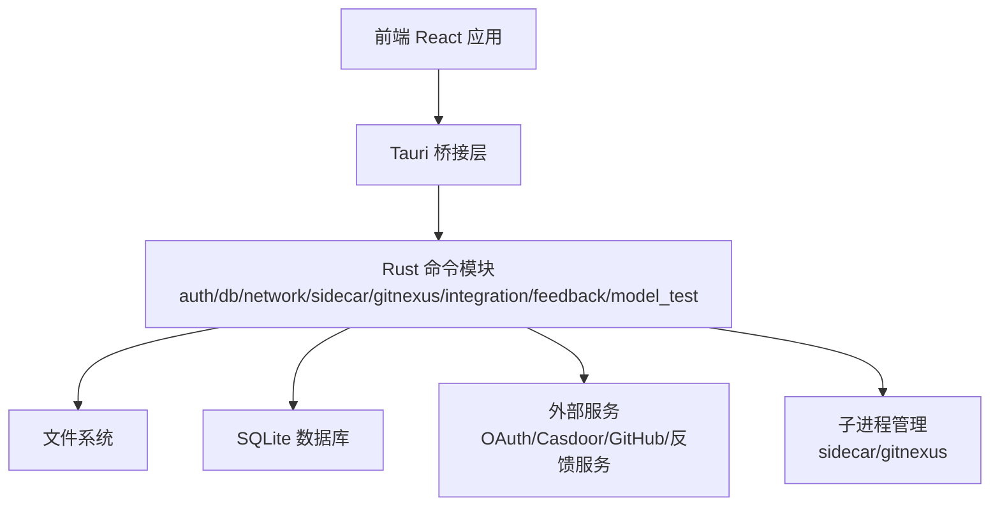
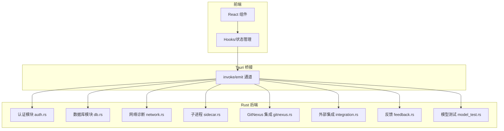
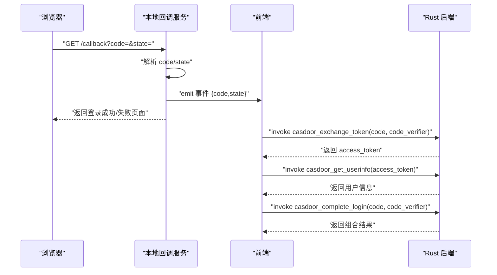
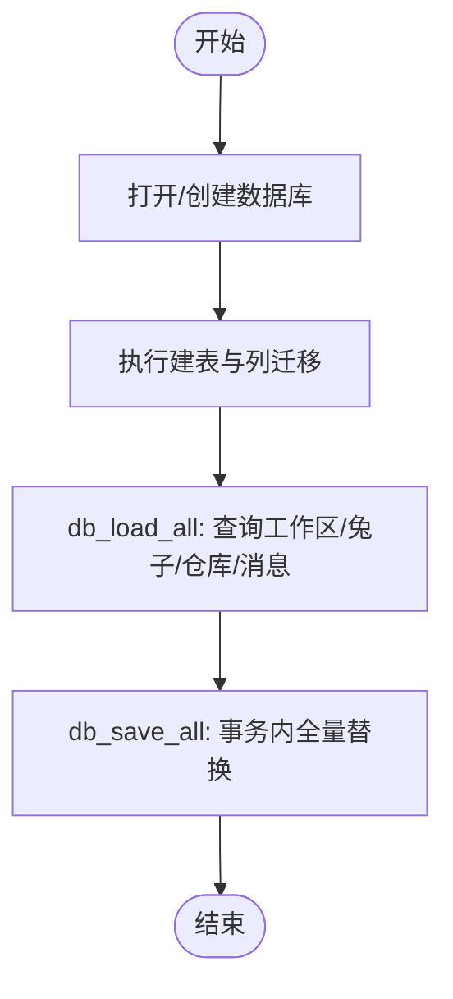
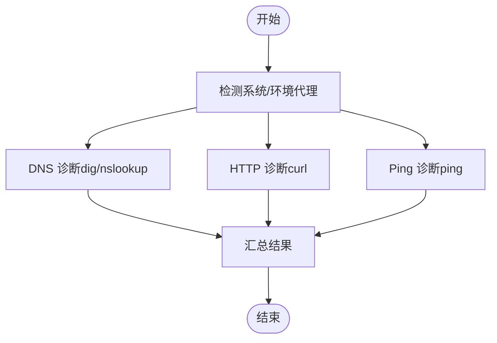
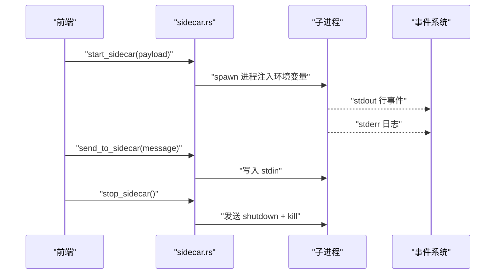
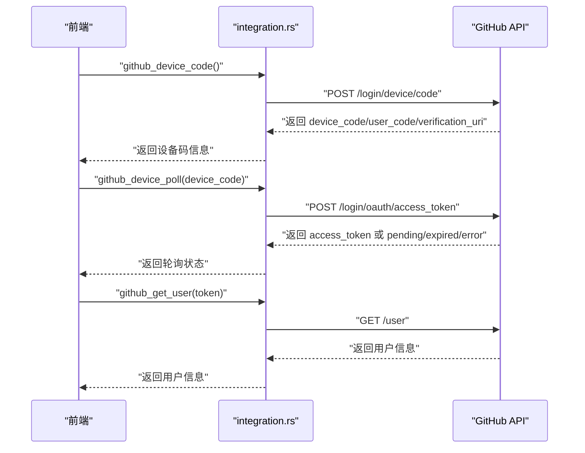
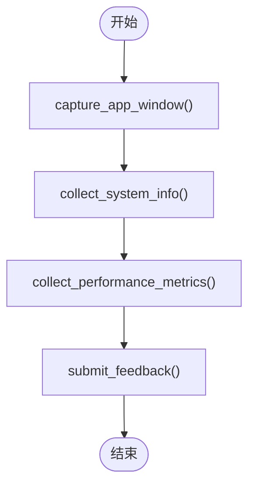
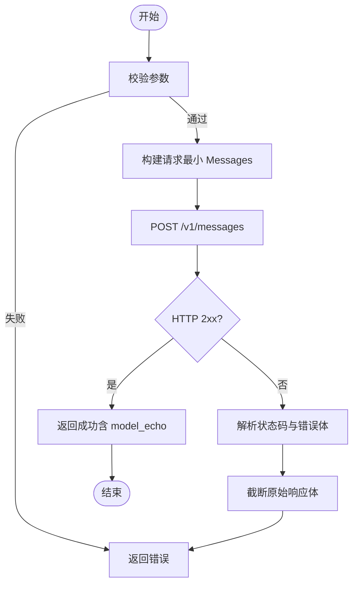
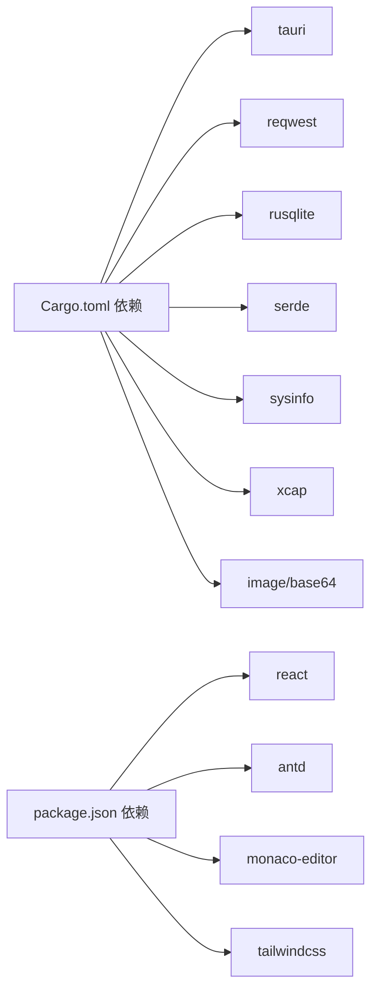

# 威胁防护

<cite>
**本文引用的文件**
- [README.md](file://README.md)
- [package.json](file://package.json)
- [Cargo.toml](file://src-tauri/Cargo.toml)
- [lib.rs](file://src-tauri/src/lib.rs)
- [auth.rs](file://src-tauri/src/auth.rs)
- [db.rs](file://src-tauri/src/db.rs)
- [network.rs](file://src-tauri/src/network.rs)
- [sidecar.rs](file://src-tauri/src/sidecar.rs)
- [gitnexus.rs](file://src-tauri/src/gitnexus.rs)
- [integration.rs](file://src-tauri/src/integration.rs)
- [feedback.rs](file://src-tauri/src/feedback.rs)
- [model_test.rs](file://src-tauri/src/model_test.rs)
</cite>

## 目录
1. [简介](#简介)
2. [项目结构](#项目结构)
3. [核心组件](#核心组件)
4. [架构总览](#架构总览)
5. [详细组件分析](#详细组件分析)
6. [依赖关系分析](#依赖关系分析)
7. [性能考量](#性能考量)
8. [故障排查指南](#故障排查指南)
9. [结论](#结论)
10. [附录](#附录)

## 简介
本文件面向 RabbitCoding 的安全防护，聚焦于应用在本地运行时可能面临的多种安全威胁与防护策略，包括但不限于：
- 前端侧常见 Web 安全（XSS、CSRF、点击劫持）的缓解与边界控制
- 后端侧输入校验与命令注入防护
- 数据库与文件系统访问控制
- 外部集成与凭据管理（OAuth、GitHub Device Flow）
- 异常检测、入侵检测与安全监控机制建议
- 威胁应对策略、应急响应流程与安全事件处理指南

本文件基于代码库的实际实现进行分析，结合 Tauri + Rust + React 技术栈的特点，提出可落地的安全加固方案。

## 项目结构
RabbitCoding 采用 Tauri 客户端 + Rust 后端 + React 前端的混合架构。Rust 后端通过 Tauri 暴露命令接口供前端调用，负责系统交互、外部集成、子进程管理、数据库与文件操作等能力。

图示来源
- [lib.rs:196-390](file://src-tauri/src/lib.rs#L196-L390)
- [auth.rs:118-245](file://src-tauri/src/auth.rs#L118-L245)
- [db.rs:140-161](file://src-tauri/src/db.rs#L140-L161)
- [network.rs:366-375](file://src-tauri/src/network.rs#L366-L375)
- [sidecar.rs:60-214](file://src-tauri/src/sidecar.rs#L60-L214)
- [gitnexus.rs:180-311](file://src-tauri/src/gitnexus.rs#L180-L311)
- [integration.rs:140-230](file://src-tauri/src/integration.rs#L140-L230)
- [feedback.rs:237-281](file://src-tauri/src/feedback.rs#L237-L281)
- [model_test.rs:78-207](file://src-tauri/src/model_test.rs#L78-L207)

章节来源
- [lib.rs:196-390](file://src-tauri/src/lib.rs#L196-L390)
- [Cargo.toml:1-40](file://src-tauri/Cargo.toml#L1-L40)

## 核心组件
- 认证与授权（OAuth/Casdoor）
  - 本地回调服务器、PKCE 流程、令牌交换与用户信息获取
- 数据持久化（SQLite）
  - 本地数据库初始化、迁移、事务性读写
- 网络诊断与代理检测
  - DNS/HTTP/Ping 诊断，系统代理检测
- 子进程与外部工具集成
  - sidecar 进程管理、gitnexus CLI 安装与索引
- 外部集成（GitHub Device Flow）
  - 设备码流程、轮询令牌、用户信息获取
- 反馈与监控
  - 屏幕截图、系统与性能指标采集、反馈提交
- 模型连通性测试
  - Anthropic 兼容端点最小请求验证

章节来源
- [auth.rs:118-245](file://src-tauri/src/auth.rs#L118-L245)
- [db.rs:140-161](file://src-tauri/src/db.rs#L140-L161)
- [network.rs:366-375](file://src-tauri/src/network.rs#L366-L375)
- [sidecar.rs:60-214](file://src-tauri/src/sidecar.rs#L60-L214)
- [gitnexus.rs:180-311](file://src-tauri/src/gitnexus.rs#L180-L311)
- [integration.rs:140-230](file://src-tauri/src/integration.rs#L140-L230)
- [feedback.rs:237-281](file://src-tauri/src/feedback.rs#L237-L281)
- [model_test.rs:78-207](file://src-tauri/src/model_test.rs#L78-L207)

## 架构总览
下图展示了前端、Tauri 桥接与 Rust 后端模块之间的交互关系，以及关键安全控制点：

图示来源
- [lib.rs:344-387](file://src-tauri/src/lib.rs#L344-L387)
- [auth.rs:118-245](file://src-tauri/src/auth.rs#L118-L245)
- [db.rs:392-416](file://src-tauri/src/db.rs#L392-L416)
- [network.rs:366-375](file://src-tauri/src/network.rs#L366-L375)
- [sidecar.rs:60-214](file://src-tauri/src/sidecar.rs#L60-L214)
- [gitnexus.rs:180-311](file://src-tauri/src/gitnexus.rs#L180-L311)
- [integration.rs:140-230](file://src-tauri/src/integration.rs#L140-L230)
- [feedback.rs:237-281](file://src-tauri/src/feedback.rs#L237-L281)
- [model_test.rs:78-207](file://src-tauri/src/model_test.rs#L78-L207)

## 详细组件分析

### 认证与授权（OAuth/Casdoor）
- 本地回调服务器
  - 监听 127.0.0.1:17331，接收浏览器重定向的 code/state，通过 Tauri 事件通知前端
  - 仅处理 /callback 路径，其他路径返回 404
- PKCE 与令牌交换
  - 使用 authorization_code + code_verifier 交换 access_token
  - 获取用户信息并组合返回
- 输入与参数处理
  - 对回调参数进行简单百分号解码，确保 ASCII 范围内的安全处理
- 前端交互
  - 通过组合命令一次性完成令牌交换与用户信息获取，减少往返

图示来源
- [auth.rs:251-350](file://src-tauri/src/auth.rs#L251-L350)
- [auth.rs:118-245](file://src-tauri/src/auth.rs#L118-L245)

章节来源
- [auth.rs:118-245](file://src-tauri/src/auth.rs#L118-L245)
- [auth.rs:251-350](file://src-tauri/src/auth.rs#L251-L350)

### 数据库与文件系统访问（SQLite）
- 数据库初始化与迁移
  - 打开/创建数据库并执行建表与列迁移（幂等）
  - 使用 WAL 模式、外键约束与索引优化
- 事务性读写
  - 全量导入/导出在事务中执行，失败回滚
- 文件系统访问
  - 提供绕过 Tauri fs:scope 的受限读取能力，仅用于 .rabbit 等受控目录
- 安全要点
  - 所有 SQL 使用参数化（rusqlite params），避免拼接
  - 导入前进行 JSON 结构校验与字段映射
  - 读取受限文件时严格限定路径与类型

图示来源
- [db.rs:140-161](file://src-tauri/src/db.rs#L140-L161)
- [db.rs:290-386](file://src-tauri/src/db.rs#L290-L386)

章节来源
- [db.rs:140-161](file://src-tauri/src/db.rs#L140-L161)
- [db.rs:290-386](file://src-tauri/src/db.rs#L290-L386)

### 网络诊断与代理检测
- 诊断目标
  - 预设 DNS/HTTP/Ping 目标与市场链接
- 代理检测
  - 优先读取环境变量，其次系统代理（Windows netsh、macOS/Linux scutil）
- 平台差异
  - Windows 使用 nslookup/dig + short；macOS/Linux 使用 dig +short
  - Ping 参数因平台而异，解析输出格式不同
- 结果封装
  - 统一返回结构，包含代理信息、状态、错误与指标

图示来源
- [network.rs:100-201](file://src-tauri/src/network.rs#L100-L201)
- [network.rs:207-375](file://src-tauri/src/network.rs#L207-L375)
- [network.rs:391-550](file://src-tauri/src/network.rs#L391-L550)
- [network.rs:556-800](file://src-tauri/src/network.rs#L556-L800)

章节来源
- [network.rs:100-201](file://src-tauri/src/network.rs#L100-L201)
- [network.rs:207-375](file://src-tauri/src/network.rs#L207-L375)
- [network.rs:391-550](file://src-tauri/src/network.rs#L391-L550)
- [network.rs:556-800](file://src-tauri/src/network.rs#L556-L800)

### 子进程与外部工具集成（sidecar/gitnexus）
- sidecar
  - 清理遗留环境变量，隔离 Claude Code 配置根目录
  - 动态注入 API Key/Base URL/自定义环境变量
  - 管理 stdout/stderr 线程，事件化推送消息
- gitnexus
  - 内置 Node.js + 私有 npm prefix，避免系统依赖
  - 安装/卸载/检测/索引/列表/组管理/同步，均在后台线程执行并事件化进度
  - 对 docs/repo 目录区分处理，避免误索引到上级 .git

图示来源
- [sidecar.rs:60-214](file://src-tauri/src/sidecar.rs#L60-L214)
- [sidecar.rs:216-279](file://src-tauri/src/sidecar.rs#L216-L279)

章节来源
- [sidecar.rs:60-214](file://src-tauri/src/sidecar.rs#L60-L214)
- [sidecar.rs:216-279](file://src-tauri/src/sidecar.rs#L216-L279)
- [gitnexus.rs:180-311](file://src-tauri/src/gitnexus.rs#L180-L311)
- [gitnexus.rs:381-561](file://src-tauri/src/gitnexus.rs#L381-L561)
- [gitnexus.rs:641-754](file://src-tauri/src/gitnexus.rs#L641-L754)

### 外部集成（GitHub Device Flow）
- 设备码申请、轮询令牌、用户信息获取
- 统一的 HTTP 客户端与错误处理
- 前端通过事件驱动轮询状态

图示来源
- [integration.rs:140-230](file://src-tauri/src/integration.rs#L140-L230)

章节来源
- [integration.rs:140-230](file://src-tauri/src/integration.rs#L140-L230)

### 反馈与监控（屏幕截图、系统/性能指标、反馈提交）
- 屏幕截图：基于 xcap 截取应用窗口，编码为 JPEG 并 Base64
- 系统/性能指标：收集 CPU/内存/WebView 指标
- 反馈提交：POST 到固定 API，解析返回的 ticketId

图示来源
- [feedback.rs:119-158](file://src-tauri/src/feedback.rs#L119-L158)
- [feedback.rs:160-193](file://src-tauri/src/feedback.rs#L160-L193)
- [feedback.rs:195-235](file://src-tauri/src/feedback.rs#L195-L235)
- [feedback.rs:237-281](file://src-tauri/src/feedback.rs#L237-L281)

章节来源
- [feedback.rs:119-158](file://src-tauri/src/feedback.rs#L119-L158)
- [feedback.rs:160-193](file://src-tauri/src/feedback.rs#L160-L193)
- [feedback.rs:195-235](file://src-tauri/src/feedback.rs#L195-L235)
- [feedback.rs:237-281](file://src-tauri/src/feedback.rs#L237-L281)

### 模型连通性测试
- 向 Anthropic 兼容端点发起最小请求，验证 Base URL/API Key/ModelId
- 统一错误分类与友好提示，附带截断的原始响应体

图示来源
- [model_test.rs:78-207](file://src-tauri/src/model_test.rs#L78-L207)

章节来源
- [model_test.rs:78-207](file://src-tauri/src/model_test.rs#L78-L207)

## 依赖关系分析
- Rust 依赖
  - tauri、reqwest、rusqlite、serde、sysinfo、xcap、image、base64 等
- 前端依赖
  - React、Ant Design、Monaco Editor、TailwindCSS 等
- 关键耦合点
  - Tauri 命令注册集中于 lib.rs，各模块通过 #[tauri::command] 暴露接口
  - 外部集成通过统一的 HTTP 客户端封装，便于统一超时与 UA 设置

图示来源
- [Cargo.toml:20-39](file://src-tauri/Cargo.toml#L20-L39)
- [package.json:14-36](file://package.json#L14-L36)

章节来源
- [Cargo.toml:20-39](file://src-tauri/Cargo.toml#L20-L39)
- [package.json:14-36](file://package.json#L14-L36)

## 性能考量
- I/O 与并发
  - 网络诊断与外部工具调用使用 tokio::task::spawn_blocking，避免阻塞主线程
  - 子进程 stdout/stderr 读取使用独立线程，避免阻塞事件循环
- 数据库
  - WAL 模式与索引提升查询性能；事务批量导入降低写放大
- 资源占用
  - 屏幕截图压缩质量参数与 Base64 编码体积控制
  - 代理检测与系统信息采集尽量轻量化

章节来源
- [network.rs:366-375](file://src-tauri/src/network.rs#L366-L375)
- [sidecar.rs:175-208](file://src-tauri/src/sidecar.rs#L175-L208)
- [db.rs:290-305](file://src-tauri/src/db.rs#L290-L305)
- [feedback.rs:140-148](file://src-tauri/src/feedback.rs#L140-L148)

## 故障排查指南
- 认证回调失败
  - 检查本地回调端口是否被占用、防火墙策略
  - 查看回调服务日志与事件是否到达前端
- 数据库异常
  - 关注建表/迁移错误、事务回滚日志
  - 导入失败时检查 JSON 结构与字段映射
- 网络诊断异常
  - 核对系统代理配置、环境变量
  - 平台差异导致的命令不可用（nslookup/dig/ping）
- 子进程问题
  - stdout/stderr 线程提前退出或阻塞
  - 环境变量注入冲突（如遗留 ANTHROPIC_*）
- 外部集成
  - GitHub 设备码轮询状态与错误码含义
  - 网络超时与证书问题
- 反馈提交
  - 服务端返回非 2xx 时解析错误信息与响应体

章节来源
- [auth.rs:251-350](file://src-tauri/src/auth.rs#L251-L350)
- [db.rs:140-161](file://src-tauri/src/db.rs#L140-L161)
- [network.rs:100-201](file://src-tauri/src/network.rs#L100-L201)
- [sidecar.rs:96-150](file://src-tauri/src/sidecar.rs#L96-L150)
- [integration.rs:165-212](file://src-tauri/src/integration.rs#L165-L212)
- [feedback.rs:237-281](file://src-tauri/src/feedback.rs#L237-L281)

## 结论
RabbitCoding 在本地运行场景下，通过 Tauri 桥接与 Rust 后端实现了对敏感操作的可控封装。认证采用本地回调与 PKCE，数据库与文件系统访问受控，外部集成通过统一 HTTP 客户端与严格的错误处理。为进一步强化安全，建议在前端侧补充输入校验与输出编码、在后端侧增强参数白名单与速率限制、完善审计日志与告警机制，并定期进行安全扫描与渗透测试。

## 附录

### 威胁与防护对照表
- XSS 防护
  - 前端渲染与富文本处理需进行输出编码与白名单过滤
  - 避免 innerHTML 直接拼接用户输入
- CSRF 防范
  - 对外部集成与反馈提交接口增加来源校验与速率限制
  - 使用短时效令牌与一次性 token
- 点击劫持防护
  - 通过 CSP 与 X-Frame-Options 限制嵌入
  - 对弹窗与深色模式等交互进行明确提示
- SQL 注入防护
  - 已使用参数化查询与结构化导入，建议持续审查 SQL 构造逻辑
- 命令注入防护
  - 子进程参数严格白名单与转义；sidecar 清理遗留环境变量
- 文件上传安全
  - 本项目未见文件上传功能；若有扩展，需限制 MIME 类型、大小与路径
- 异常检测与入侵检测
  - 建议在认证与外部集成处增加失败次数统计与临时封禁
- 安全监控
  - 记录关键命令调用与外部请求日志，设置阈值告警

章节来源
- [sidecar.rs:96-150](file://src-tauri/src/sidecar.rs#L96-L150)
- [integration.rs:44-82](file://src-tauri/src/integration.rs#L44-L82)
- [feedback.rs:237-281](file://src-tauri/src/feedback.rs#L237-L281)