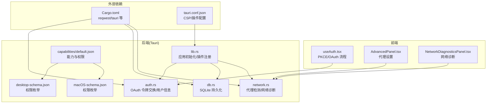
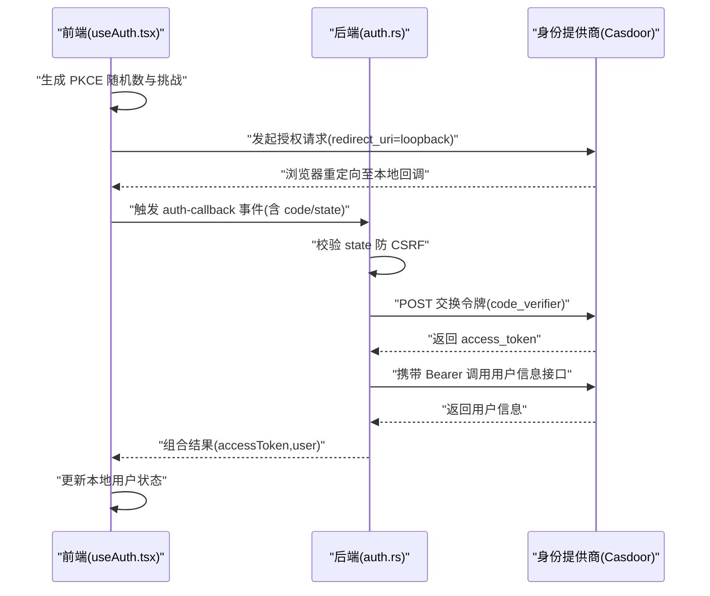
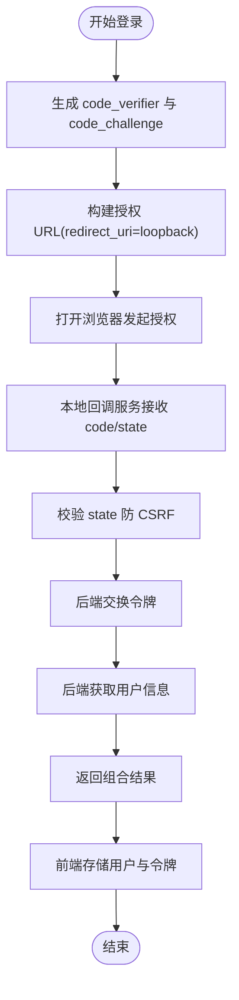
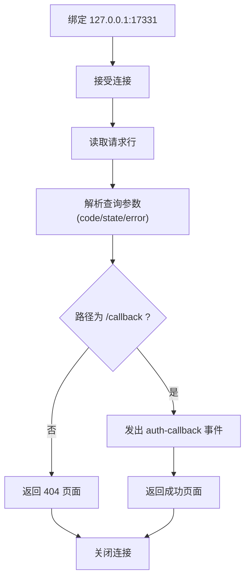
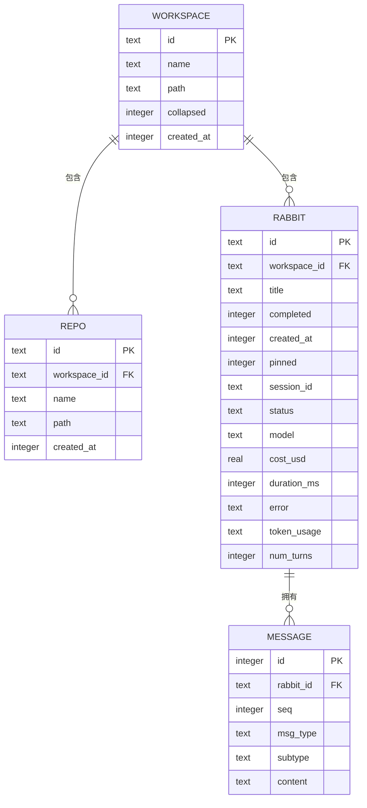
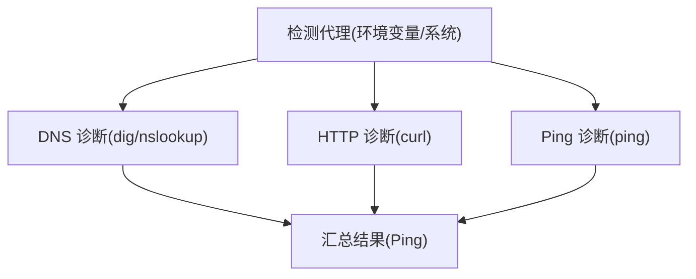
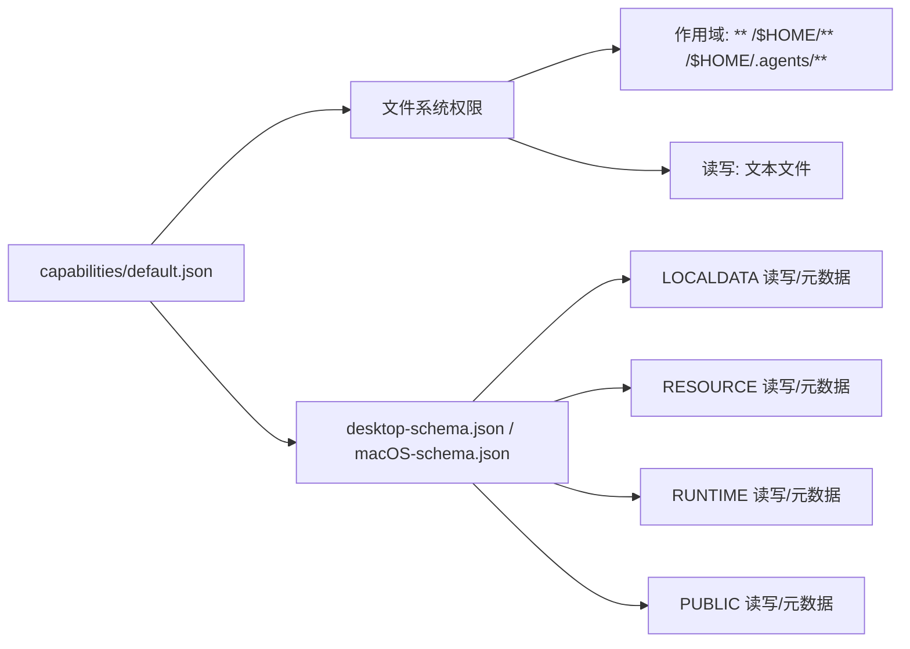
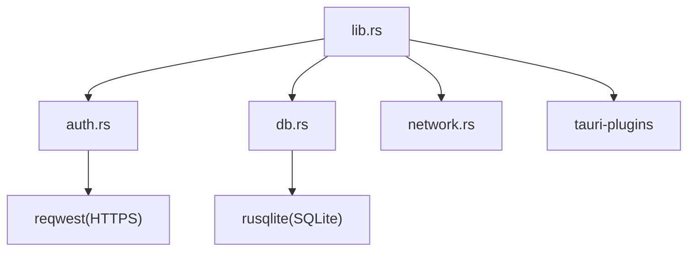

# 安全考虑

<cite>
**本文引用的文件**
- [src-tauri/src/auth.rs](file://src-tauri/src/auth.rs)
- [src/hooks/useAuth.tsx](file://src/hooks/useAuth.tsx)
- [src-tauri/src/lib.rs](file://src-tauri/src/lib.rs)
- [src-tauri/capabilities/default.json](file://src-tauri/capabilities/default.json)
- [src-tauri/gen/schemas/desktop-schema.json](file://src-tauri/gen/schemas/desktop-schema.json)
- [src-tauri/gen/schemas/macOS-schema.json](file://src-tauri/gen/schemas/macOS-schema.json)
- [src-tauri/src/db.rs](file://src-tauri/src/db.rs)
- [src-tauri/src/network.rs](file://src-tauri/src/network.rs)
- [src/utils/proxy.ts](file://src/utils/proxy.ts)
- [src/components/settings/AdvancedPanel.tsx](file://src/components/settings/AdvancedPanel.tsx)
- [src/components/settings/NetworkDiagnosticsPanel.tsx](file://src/components/settings/NetworkDiagnosticsPanel.tsx)
- [src-tauri/Cargo.toml](file://src-tauri/Cargo.toml)
- [src-tauri/tauri.conf.json](file://src-tauri/tauri.conf.json)
</cite>

## 目录
1. [简介](#简介)
2. [项目结构](#项目结构)
3. [核心组件](#核心组件)
4. [架构总览](#架构总览)
5. [详细组件分析](#详细组件分析)
6. [依赖关系分析](#依赖关系分析)
7. [性能考量](#性能考量)
8. [故障排查指南](#故障排查指南)
9. [结论](#结论)
10. [附录](#附录)

## 简介
本文件面向 RabbitCoding 的安全设计与实现，聚焦以下方面：
- 数据安全：本地存储、数据库持久化、敏感信息处理
- 网络安全：OAuth 2.0/PKCE 流程、代理与网络诊断、TLS/HTTPS 使用
- 权限管理：文件系统权限、能力(capabilities)与沙箱策略
- 加密与通信：密码学使用、安全传输、回调服务与事件传递
- 威胁与防护：CSRF、中间人攻击、本地回连风险、最小权限原则
- 合规与审计：能力清单、CSP 策略、日志与可观测性

## 项目结构
RabbitCoding 的安全相关实现主要分布在前端认证 Hook、后端 Tauri 插件与命令、能力与权限配置、以及网络与代理工具模块。

图示来源
- [src/hooks/useAuth.tsx:27-251](file://src/hooks/useAuth.tsx#L27-L251)
- [src-tauri/src/auth.rs:1-376](file://src-tauri/src/auth.rs#L1-L376)
- [src-tauri/src/lib.rs:124-317](file://src-tauri/src/lib.rs#L124-L317)
- [src-tauri/src/db.rs:1-417](file://src-tauri/src/db.rs#L1-L417)
- [src-tauri/src/network.rs:1-800](file://src-tauri/src/network.rs#L1-L800)
- [src-tauri/capabilities/default.json:1-41](file://src-tauri/capabilities/default.json#L1-L41)
- [src-tauri/gen/schemas/desktop-schema.json:726-5123](file://src-tauri/gen/schemas/desktop-schema.json#L726-L5123)
- [src-tauri/gen/schemas/macOS-schema.json:726-5123](file://src-tauri/gen/schemas/macOS-schema.json#L726-L5123)
- [src-tauri/Cargo.toml:20-39](file://src-tauri/Cargo.toml#L20-L39)
- [src-tauri/tauri.conf.json:1-52](file://src-tauri/tauri.conf.json#L1-L52)

章节来源
- [src-tauri/src/lib.rs:124-317](file://src-tauri/src/lib.rs#L124-L317)
- [src-tauri/capabilities/default.json:1-41](file://src-tauri/capabilities/default.json#L1-L41)
- [src-tauri/tauri.conf.json:22-24](file://src-tauri/tauri.conf.json#L22-L24)

## 核心组件
- 认证与授权
  - 前端使用 PKCE 的 OAuth 2.0 登录流程，通过本地 loopback 回调接收授权码并完成令牌交换与用户信息获取。
  - 后端提供组合命令一次性完成令牌交换与用户信息拉取，降低前端往返次数。
- 本地数据与数据库
  - 使用 SQLite 持久化工作区、对话、消息等数据，采用 WAL 模式与外键约束增强一致性与可靠性。
  - 前端本地存储用于短期状态与 PKCE 临时数据。
- 网络与代理
  - 代理检测与网络诊断，支持 HTTP/HTTPS/SOCKS 代理，输出 TLS 版本、响应时间、内容类型等指标。
  - 通过环境变量注入代理配置，便于子进程继承。
- 权限与能力
  - 通过 Tauri 能力与权限枚举精确控制文件系统访问范围，遵循最小权限原则。
  - macOS/Windows 平台能力与权限清单由生成的 schema 统一约束。

章节来源
- [src/hooks/useAuth.tsx:27-251](file://src/hooks/useAuth.tsx#L27-L251)
- [src-tauri/src/auth.rs:118-245](file://src-tauri/src/auth.rs#L118-L245)
- [src-tauri/src/db.rs:85-161](file://src-tauri/src/db.rs#L85-L161)
- [src-tauri/src/network.rs:100-201](file://src-tauri/src/network.rs#L100-L201)
- [src/utils/proxy.ts:17-47](file://src/utils/proxy.ts#L17-L47)
- [src-tauri/capabilities/default.json:22-33](file://src-tauri/capabilities/default.json#L22-L33)

## 架构总览
RabbitCoding 的安全架构围绕“最小权限 + 严格边界 + 透明审计”展开：
- 前端仅负责 UI 与交互，认证流程通过本地 loopback 与后端命令桥接，避免直接暴露令牌。
- 后端通过能力与权限清单限制文件系统访问，数据库与网络操作受控。
- 网络层支持代理与 TLS 诊断，确保连接质量与安全性。
- 日志与事件用于可观测性，便于审计与问题定位。

图示来源
- [src/hooks/useAuth.tsx:100-168](file://src/hooks/useAuth.tsx#L100-L168)
- [src-tauri/src/auth.rs:258-375](file://src-tauri/src/auth.rs#L258-L375)

章节来源
- [src/hooks/useAuth.tsx:27-251](file://src/hooks/useAuth.tsx#L27-L251)
- [src-tauri/src/auth.rs:118-245](file://src-tauri/src/auth.rs#L118-L245)

## 详细组件分析

### 认证与授权流程（PKCE/OAuth）
- 前端生成 PKCE 随机字符串与 SHA-256 挑战，使用本地 loopback 回调接收授权码与 state。
- 后端启动 TCP 回调服务监听 127.0.0.1:17331，解析查询参数并发出 Tauri 事件。
- 后端执行令牌交换与用户信息获取，返回给前端用于建立会话。
- 前端验证 state 一致性，清理临时数据，存储用户信息与访问令牌。

图示来源
- [src/hooks/useAuth.tsx:190-224](file://src/hooks/useAuth.tsx#L190-L224)
- [src-tauri/src/auth.rs:258-375](file://src-tauri/src/auth.rs#L258-L375)

章节来源
- [src/hooks/useAuth.tsx:27-251](file://src/hooks/useAuth.tsx#L27-L251)
- [src-tauri/src/auth.rs:118-245](file://src-tauri/src/auth.rs#L118-L245)

### 本地 OAuth 回调服务（Loopback）
- 服务绑定 127.0.0.1:17331，解析 /callback 路径的 code/state/error。
- 成功时通过事件通知前端，失败时返回错误页面。
- 使用独立线程与简单 TCP 套接字实现，避免引入额外依赖。

图示来源
- [src-tauri/src/auth.rs:258-375](file://src-tauri/src/auth.rs#L258-L375)

章节来源
- [src-tauri/src/auth.rs:258-375](file://src-tauri/src/auth.rs#L258-L375)

### 数据库与本地存储
- 数据库存储采用 WAL 模式、外键约束与索引优化，支持事务批量导入导出。
- 前端本地存储用于短期状态与 PKCE 临时数据，避免敏感信息长期驻留。

图示来源
- [src-tauri/src/db.rs:85-138](file://src-tauri/src/db.rs#L85-L138)

章节来源
- [src-tauri/src/db.rs:85-161](file://src-tauri/src/db.rs#L85-L161)
- [src/hooks/useLocalStorage.ts:1-26](file://src/hooks/useLocalStorage.ts#L1-L26)

### 网络与代理诊断
- 代理检测：优先读取环境变量，其次读取系统代理配置（Windows 使用 netsh，macOS/Linux 使用 scutil）。
- HTTP 诊断：使用 curl 获取状态码、HTTP 版本、TLS 版本、响应时间、内容类型与远端 IP。
- DNS 诊断：使用 dig/nslookup 获取 A 记录与解析耗时。
- Ping 诊断：跨平台统计丢包率与 RTT。

图示来源
- [src-tauri/src/network.rs:100-201](file://src-tauri/src/network.rs#L100-L201)
- [src-tauri/src/network.rs:391-550](file://src-tauri/src/network.rs#L391-L550)
- [src-tauri/src/network.rs:556-800](file://src-tauri/src/network.rs#L556-L800)

章节来源
- [src-tauri/src/network.rs:100-201](file://src-tauri/src/network.rs#L100-L201)
- [src-tauri/src/network.rs:391-550](file://src-tauri/src/network.rs#L391-L550)
- [src-tauri/src/network.rs:556-800](file://src-tauri/src/network.rs#L556-L800)
- [src/utils/proxy.ts:17-47](file://src/utils/proxy.ts#L17-L47)
- [src/components/settings/AdvancedPanel.tsx:13-99](file://src/components/settings/AdvancedPanel.tsx#L13-L99)
- [src/components/settings/NetworkDiagnosticsPanel.tsx:163-202](file://src/components/settings/NetworkDiagnosticsPanel.tsx#L163-L202)

### 权限与能力（文件系统与沙箱）
- 能力清单允许读取目录/文件、读写文本文件、限定范围的文件系统作用域（如 HOME、.agents）。
- 生成的权限枚举覆盖 LOCALDATA、RESOURCE、RUNTIME、PUBLIC 等路径的作用域与递归读写能力。
- macOS 平台通过 entitlements 与 schema 约束进一步细化权限。

图示来源
- [src-tauri/capabilities/default.json:22-33](file://src-tauri/capabilities/default.json#L22-L33)
- [src-tauri/gen/schemas/desktop-schema.json:726-5123](file://src-tauri/gen/schemas/desktop-schema.json#L726-L5123)
- [src-tauri/gen/schemas/macOS-schema.json:726-5123](file://src-tauri/gen/schemas/macOS-schema.json#L726-L5123)

章节来源
- [src-tauri/capabilities/default.json:1-41](file://src-tauri/capabilities/default.json#L1-L41)
- [src-tauri/gen/schemas/desktop-schema.json:726-5123](file://src-tauri/gen/schemas/desktop-schema.json#L726-L5123)
- [src-tauri/gen/schemas/macOS-schema.json:726-5123](file://src-tauri/gen/schemas/macOS-schema.json#L726-L5123)

## 依赖关系分析
- 外部依赖
  - reqwest 用于 HTTPS 请求与令牌交换、用户信息获取。
  - rusqlite 用于本地数据库访问。
  - tauri、tauri-plugin-* 提供窗口、通知、深链、文件系统等能力。
- 内部依赖
  - lib.rs 注册插件、初始化数据库、启动回调服务。
  - auth.rs 与前端交互，完成 OAuth 流程。
  - db.rs 与前端交互，提供数据加载/保存。
  - network.rs 与前端交互，提供网络诊断。

图示来源
- [src-tauri/src/lib.rs:124-317](file://src-tauri/src/lib.rs#L124-L317)
- [src-tauri/Cargo.toml:20-39](file://src-tauri/Cargo.toml#L20-L39)

章节来源
- [src-tauri/src/lib.rs:124-317](file://src-tauri/src/lib.rs#L124-L317)
- [src-tauri/Cargo.toml:20-39](file://src-tauri/Cargo.toml#L20-L39)

## 性能考量
- 网络诊断采用异步任务与阻塞 I/O 分离，避免阻塞主线程。
- 数据库使用事务批量导入/导出，减少磁盘写放大。
- 代理检测与网络诊断结果缓存于前端设置面板，减少重复调用。

## 故障排查指南
- OAuth 登录失败
  - 检查本地回调端口是否被占用，确认事件监听是否成功。
  - 校验 state 是否匹配，防止 CSRF 攻击。
  - 查看后端日志中令牌交换与用户信息接口的响应。
- 数据库异常
  - 检查数据库路径与权限，确认 WAL 模式与外键约束生效。
  - 若数据库初始化失败，前端将降级到本地存储。
- 网络诊断异常
  - 检查代理配置与环境变量注入，确认 curl/dig/nslookup 可用。
  - 关注 TLS 版本与响应时间，排查证书与网络路径问题。
- 权限不足
  - 检查 capabilities/default.json 中的文件系统作用域与权限声明。
  - macOS 平台检查 entitlements 与 schema 约束。

章节来源
- [src-tauri/src/auth.rs:258-375](file://src-tauri/src/auth.rs#L258-L375)
- [src-tauri/src/db.rs:142-161](file://src-tauri/src/db.rs#L142-L161)
- [src-tauri/src/network.rs:391-550](file://src-tauri/src/network.rs#L391-L550)
- [src-tauri/capabilities/default.json:22-33](file://src-tauri/capabilities/default.json#L22-L33)

## 结论
RabbitCoding 的安全设计以最小权限、严格边界与透明审计为核心，结合 PKCE/OAuth 2.0、本地回连回调、数据库与网络诊断、以及能力与权限清单，形成完整的安全闭环。建议持续关注依赖版本安全更新、强化日志与告警、定期进行安全评估与渗透测试。

## 附录

### 安全威胁与防护要点
- CSRF 攻击：通过 state 校验与本地回调服务降低风险。
- 中间人攻击：强制 HTTPS/TLS，使用受信 CA 与现代 TLS 版本。
- 本地回连风险：仅监听 127.0.0.1，避免公网可达。
- 权限滥用：严格限制文件系统作用域，遵循最小权限原则。
- 敏感信息泄露：避免在日志中输出令牌与明文凭据，前端本地存储仅存放必要短期数据。

### 安全配置示例与最佳实践
- OAuth 配置
  - 使用 PKCE 与 loopback 回调，state 必须校验。
  - 令牌交换与用户信息获取应通过后端命令完成。
- 代理与网络
  - 通过环境变量注入代理，确保子进程继承。
  - 使用网络诊断面板监控 TLS 版本与响应时间。
- 数据保护
  - 数据库存储敏感信息需谨慎，避免明文记录。
  - 本地存储仅存放非敏感状态与临时数据。
- 权限与能力
  - 能力清单中明确列出允许的路径与操作，避免通配符滥用。
  - macOS 平台启用 entitlements 并与 schema 对齐。

章节来源
- [src/hooks/useAuth.tsx:115-136](file://src/hooks/useAuth.tsx#L115-L136)
- [src-tauri/src/auth.rs:118-245](file://src-tauri/src/auth.rs#L118-L245)
- [src-tauri/src/network.rs:391-550](file://src-tauri/src/network.rs#L391-L550)
- [src/utils/proxy.ts:17-47](file://src/utils/proxy.ts#L17-L47)
- [src-tauri/capabilities/default.json:22-33](file://src-tauri/capabilities/default.json#L22-L33)