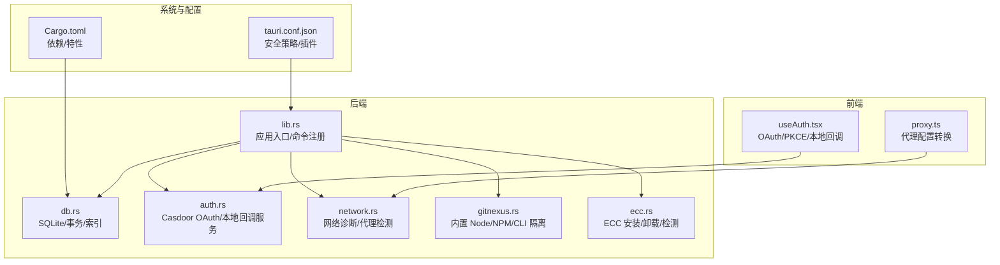
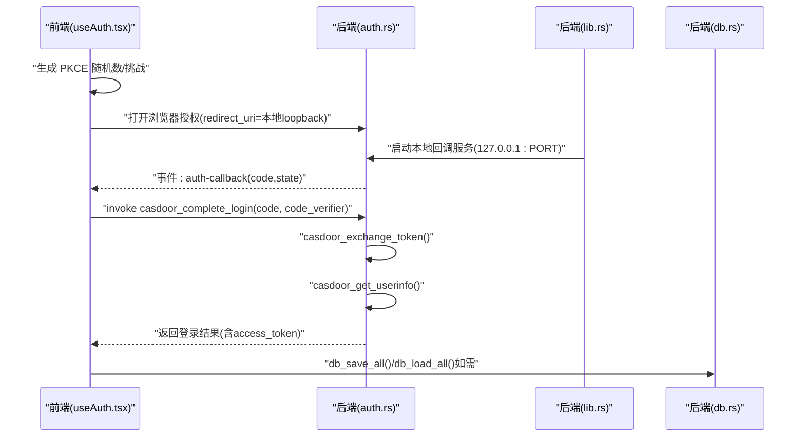
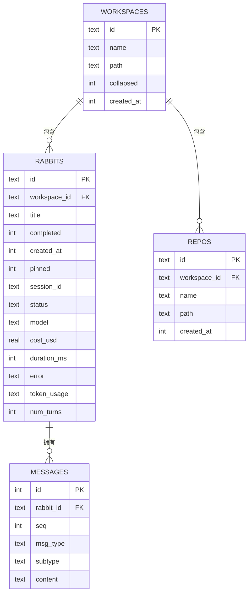
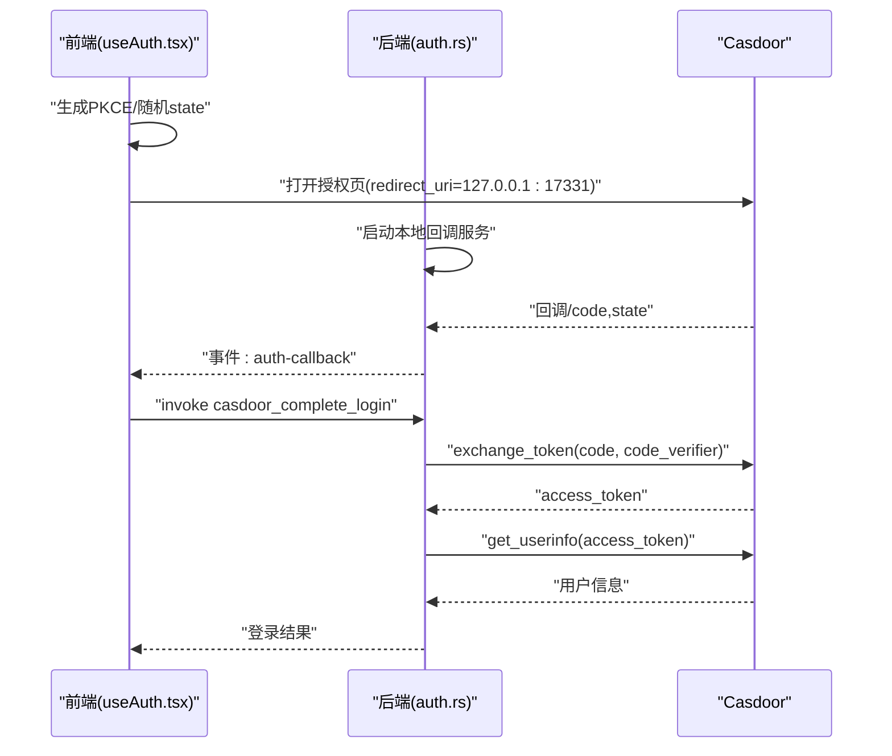
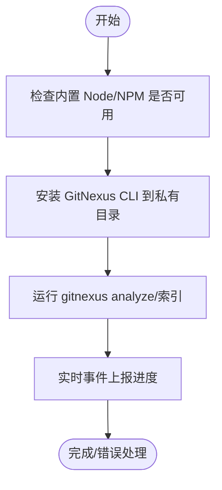
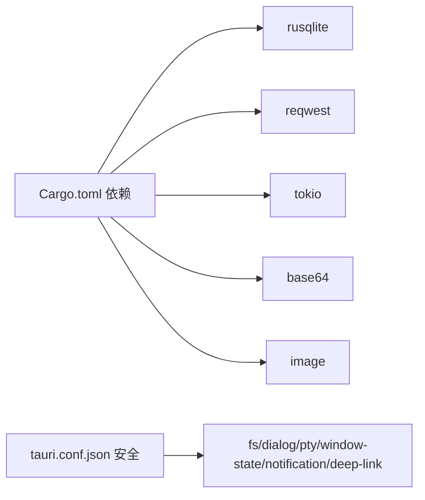

# 数据安全

<cite>
**本文引用的文件**
- [src-tauri/src/lib.rs](file://src-tauri/src/lib.rs)
- [src-tauri/src/db.rs](file://src-tauri/src/db.rs)
- [src-tauri/src/ecc.rs](file://src-tauri/src/ecc.rs)
- [src-tauri/src/auth.rs](file://src-tauri/src/auth.rs)
- [src-tauri/src/network.rs](file://src-tauri/src/network.rs)
- [src-tauri/src/gitnexus.rs](file://src-tauri/src/gitnexus.rs)
- [src-tauri/Cargo.toml](file://src-tauri/Cargo.toml)
- [src-tauri/tauri.conf.json](file://src-tauri/tauri.conf.json)
- [src/hooks/useAuth.tsx](file://src/hooks/useAuth.tsx)
- [src/utils/proxy.ts](file://src/utils/proxy.ts)
</cite>

## 目录
1. [简介](#简介)
2. [项目结构](#项目结构)
3. [核心组件](#核心组件)
4. [架构总览](#架构总览)
5. [详细组件分析](#详细组件分析)
6. [依赖关系分析](#依赖关系分析)
7. [性能考量](#性能考量)
8. [故障排查指南](#故障排查指南)
9. [结论](#结论)
10. [附录](#附录)

## 简介
本文件面向 RabbitCoding 的数据安全，聚焦于本地数据保护、SQLite 数据库安全、敏感信息加密存储、ECC 加密算法应用、数据完整性验证、备份与恢复安全、用户数据隔离与访问控制、数据脱敏策略、数据库安全配置、SQL 注入防护、数据传输加密、以及数据安全最佳实践与合规性要求。文档基于仓库现有实现进行深入分析，并提供可视化图示帮助理解。

## 项目结构
RabbitCoding 采用 Tauri + Rust 后端 + React 前端的混合架构。后端负责数据库、认证、网络诊断、外部工具集成等安全相关能力；前端负责用户交互、OAuth 流程、代理配置等。

图表来源
- [src-tauri/src/lib.rs:196-390](file://src-tauri/src/lib.rs#L196-L390)
- [src-tauri/src/db.rs:140-161](file://src-tauri/src/db.rs#L140-L161)
- [src-tauri/src/auth.rs:258-284](file://src-tauri/src/auth.rs#L258-L284)
- [src-tauri/src/network.rs:100-201](file://src-tauri/src/network.rs#L100-L201)
- [src-tauri/src/gitnexus.rs:136-144](file://src-tauri/src/gitnexus.rs#L136-L144)
- [src-tauri/src/ecc.rs:146-200](file://src-tauri/src/ecc.rs#L146-L200)
- [src-tauri/tauri.conf.json:22-24](file://src-tauri/tauri.conf.json#L22-L24)
- [src-tauri/Cargo.toml:20-39](file://src-tauri/Cargo.toml#L20-L39)

章节来源
- [src-tauri/src/lib.rs:196-390](file://src-tauri/src/lib.rs#L196-L390)
- [src-tauri/tauri.conf.json:1-52](file://src-tauri/tauri.conf.json#L1-L52)

## 核心组件
- 数据库层（SQLite）：集中管理工作区、兔子（对话）、仓库与消息，使用事务与外键约束保障一致性；WAL 模式提升并发与可靠性。
- 认证与访问控制：基于 Casdoor 的 OAuth 2.0 Authorization Code + PKCE，本地 loopback 回调，防止 CSRF；前端持久化用户信息至本地存储。
- 外部工具集成：内置 Node/NPM，隔离系统环境，避免依赖系统全局安装；提供 GitNexus CLI 的安装、卸载与索引进度事件。
- ECC 集成：检测、安装、卸载 ECC，支持最小化配置，降低外部依赖风险。
- 网络诊断：代理检测、DNS/HTTP/Ping 诊断，便于排查网络与 TLS 环境问题。

章节来源
- [src-tauri/src/db.rs:80-161](file://src-tauri/src/db.rs#L80-L161)
- [src-tauri/src/auth.rs:118-245](file://src-tauri/src/auth.rs#L118-L245)
- [src/hooks/useAuth.tsx:190-232](file://src/hooks/useAuth.tsx#L190-L232)
- [src-tauri/src/gitnexus.rs:180-379](file://src-tauri/src/gitnexus.rs#L180-L379)
- [src-tauri/src/ecc.rs:144-200](file://src-tauri/src/ecc.rs#L144-L200)
- [src-tauri/src/network.rs:100-201](file://src-tauri/src/network.rs#L100-L201)

## 架构总览
下图展示数据安全相关的关键交互：前端发起 OAuth 流程，后端启动本地回调服务接收授权码，随后通过命令完成令牌交换与用户信息获取；数据库层提供统一的数据持久化与完整性保障；网络与工具集成模块确保外部依赖可控与可诊断。

图表来源
- [src/hooks/useAuth.tsx:190-232](file://src/hooks/useAuth.tsx#L190-L232)
- [src-tauri/src/auth.rs:258-284](file://src-tauri/src/auth.rs#L258-L284)
- [src-tauri/src/auth.rs:118-245](file://src-tauri/src/auth.rs#L118-L245)
- [src-tauri/src/lib.rs:223-224](file://src-tauri/src/lib.rs#L223-L224)
- [src-tauri/src/db.rs:392-416](file://src-tauri/src/db.rs#L392-L416)

## 详细组件分析

### 数据库与本地数据保护（SQLite）
- 数据模型与完整性
  - 使用主键与外键约束，启用级联删除，确保删除工作区时级联清理兔子与消息。
  - 通过索引加速查询：按 workspace_id 的索引用于兔子与仓库列表检索；消息表按 rabbit_id+seq 组合索引，保障消息有序读取。
- 事务与一致性
  - 导入/导出采用显式事务：全量导入前开启事务，失败回滚，成功提交，避免部分写入破坏一致性。
- SQLite 安全配置
  - 启用 WAL 日志模式，提升并发读写稳定性；启用外键约束，保证参照完整性；同步级别设置为 NORMAL，平衡性能与可靠性。
- 数据序列化与迁移
  - 使用 JSON 序列化复杂对象（如 token_usage），并在迁移阶段动态增加列，保持向后兼容。

图表来源
- [src-tauri/src/db.rs:85-138](file://src-tauri/src/db.rs#L85-L138)

章节来源
- [src-tauri/src/db.rs:80-161](file://src-tauri/src/db.rs#L80-L161)
- [src-tauri/src/db.rs:290-386](file://src-tauri/src/db.rs#L290-L386)
- [src-tauri/src/db.rs:167-288](file://src-tauri/src/db.rs#L167-L288)

### 认证与访问控制（OAuth 2.0 + PKCE + 本地回调）
- 流程要点
  - 前端生成 code_verifier 与 code_challenge，携带 state 与 code_challenge_method=S256 发起授权。
  - 后端启动本地 loopback 回调服务监听 127.0.0.1:17331，解析回调参数并发出事件。
  - 前端校验 state 防止 CSRF，取出 code_verifier，调用后端命令完成令牌交换与用户信息获取。
  - 登录成功后，前端将用户信息持久化至本地存储。
- 安全措施
  - 使用 PKCE 防范授权码拦截；本地回调仅监听环回地址，降低中间人攻击风险。
  - 前端严格校验 state，缺失或不匹配立即终止流程。
  - 令牌交换与用户信息获取在后端完成，避免前端直接暴露密钥。

图表来源
- [src/hooks/useAuth.tsx:190-232](file://src/hooks/useAuth.tsx#L190-L232)
- [src-tauri/src/auth.rs:258-284](file://src-tauri/src/auth.rs#L258-L284)
- [src-tauri/src/auth.rs:118-245](file://src-tauri/src/auth.rs#L118-L245)

章节来源
- [src/hooks/useAuth.tsx:190-232](file://src/hooks/useAuth.tsx#L190-L232)
- [src-tauri/src/auth.rs:118-245](file://src-tauri/src/auth.rs#L118-L245)
- [src-tauri/src/auth.rs:258-284](file://src-tauri/src/auth.rs#L258-L284)

### 外部工具集成与用户数据隔离（GitNexus）
- 隔离策略
  - 使用内置 Node/NPM，不依赖系统 PATH，安装与运行均在应用私有目录（app_data_dir/npm-global）。
  - 通过环境变量与进程参数控制 CLI 行为，避免污染系统环境。
- 安全与可观测性
  - 安装/卸载/分析过程异步执行，实时通过事件上报进度，便于前端与用户感知。
  - 分支场景处理：针对非 Git 目录（如 docs）显式跳过向上查找 Git 根，避免索引范围扩大导致误操作。

图表来源
- [src-tauri/src/gitnexus.rs:180-379](file://src-tauri/src/gitnexus.rs#L180-L379)
- [src-tauri/src/gitnexus.rs:416-561](file://src-tauri/src/gitnexus.rs#L416-L561)

章节来源
- [src-tauri/src/gitnexus.rs:136-144](file://src-tauri/src/gitnexus.rs#L136-L144)
- [src-tauri/src/gitnexus.rs:180-379](file://src-tauri/src/gitnexus.rs#L180-L379)
- [src-tauri/src/gitnexus.rs:416-561](file://src-tauri/src/gitnexus.rs#L416-L561)

### ECC 集成与最小化依赖
- 检测逻辑：扫描 ~/.claude 下 agents/skills/ecc2/state-store 等目录，识别已安装版本。
- 安装/卸载：通过 npx/ecc-install 执行，卸载时清理相关目录与文件。
- 最小化配置：默认 profile=minimal，降低外部依赖与攻击面。

章节来源
- [src-tauri/src/ecc.rs:144-200](file://src-tauri/src/ecc.rs#L144-L200)
- [src-tauri/src/ecc.rs:202-290](file://src-tauri/src/ecc.rs#L202-L290)
- [src-tauri/src/ecc.rs:292-354](file://src-tauri/src/ecc.rs#L292-L354)

### 网络诊断与传输安全
- 代理检测：优先读取环境变量，其次读取系统代理配置（Windows netsh、macOS scutil），支持 HTTP/HTTPS/SOCKS。
- 诊断能力：DNS 解析、HTTP/TLS/RTT、Ping，输出包含 TLS 版本、远端 IP、丢包率等，便于评估网络与传输安全状况。
- 传输加密：HTTP 诊断输出包含 TLS 版本，有助于确认连接是否使用加密通道。

章节来源
- [src-tauri/src/network.rs:100-201](file://src-tauri/src/network.rs#L100-L201)
- [src-tauri/src/network.rs:366-375](file://src-tauri/src/network.rs#L366-L375)
- [src-tauri/src/network.rs:538-550](file://src-tauri/src/network.rs#L538-L550)
- [src-tauri/src/network.rs:556-800](file://src-tauri/src/network.rs#L556-L800)

### 本地数据保护与敏感信息处理
- 本地存储：前端使用 localStorage 持久化用户信息；后端通过 SQLite 存储工作区、兔子、仓库与消息。
- 敏感信息：OAuth 令牌与用户信息在前端仅短期驻留，登录完成后可主动清理；数据库中未见明文存储敏感字段。
- 文件访问：提供“不受限”读取命令以访问隐藏目录（如 .rabbit），但仅在受控上下文中使用，避免泄露。

章节来源
- [src/hooks/useAuth.tsx:94-187](file://src/hooks/useAuth.tsx#L94-L187)
- [src-tauri/src/lib.rs:107-112](file://src-tauri/src/lib.rs#L107-L112)

### 数据完整性验证与备份恢复
- 完整性：外键约束与级联删除确保引用完整性；WAL 模式与事务保障并发一致性。
- 备份与恢复：提供全量导入/导出命令，前端可将数据序列化为 JSON，后端以事务方式写入，便于离线备份与跨设备恢复。

章节来源
- [src-tauri/src/db.rs:85-138](file://src-tauri/src/db.rs#L85-L138)
- [src-tauri/src/db.rs:290-386](file://src-tauri/src/db.rs#L290-L386)
- [src-tauri/src/db.rs:392-416](file://src-tauri/src/db.rs#L392-L416)

### 数据脱敏策略
- 脱敏建议：对日志输出中的敏感字段（如令牌、URL）进行截断或掩码；当前实现对日志输出做了长度限制，避免泄露过多细节。
- 前端存储：用户头像、邮箱等字段在前端持久化，建议仅在必要时显示，避免在不可信环境中长期留存。

章节来源
- [src-tauri/src/auth.rs:150-153](file://src-tauri/src/auth.rs#L150-L153)
- [src-tauri/src/auth.rs:199-202](file://src-tauri/src/auth.rs#L199-L202)

### 数据库安全配置与 SQL 注入防护
- 配置要点：启用外键约束、WAL 模式、适度同步级别；建立复合索引优化查询。
- 注入防护：所有查询使用参数绑定（rusqlite params!），避免字符串拼接；前端输入经由后端命令处理，未见直接拼接 SQL 的实现。

章节来源
- [src-tauri/src/db.rs:85-138](file://src-tauri/src/db.rs#L85-L138)
- [src-tauri/src/db.rs:193-198](file://src-tauri/src/db.rs#L193-L198)
- [src-tauri/src/db.rs:334-353](file://src-tauri/src/db.rs#L334-L353)

### 数据传输加密
- 传输加密：网络诊断输出包含 TLS 版本，用于确认 HTTPS 连接是否使用加密通道。
- 证书与信任：网络模块未显式配置证书校验策略，建议在生产环境结合系统证书库与中间证书链进行校验。

章节来源
- [src-tauri/src/network.rs:437-485](file://src-tauri/src/network.rs#L437-L485)

## 依赖关系分析
- Rust 依赖：rusqlite（含捆绑 SQLite）、reqwest（HTTP 客户端）、tokio（异步运行时）、base64、image 等。
- Tauri 插件：fs、dialog、pty、window-state、notification、deep-link 等，配合安全策略与能力集使用。
- 前端依赖：@tauri-apps/api、@tauri-apps/plugin-opener、React 上下文与本地存储。

图表来源
- [src-tauri/Cargo.toml:20-39](file://src-tauri/Cargo.toml#L20-L39)
- [src-tauri/tauri.conf.json:22-24](file://src-tauri/tauri.conf.json#L22-L24)

章节来源
- [src-tauri/Cargo.toml:20-39](file://src-tauri/Cargo.toml#L20-L39)
- [src-tauri/tauri.conf.json:1-52](file://src-tauri/tauri.conf.json#L1-L52)

## 性能考量
- SQLite：WAL 模式提升并发读写性能；适度同步级别平衡可靠性与吞吐。
- 异步执行：网络诊断、GitNexus 安装/分析、ECC 安装均在后台任务执行，避免阻塞主线程。
- 事务批量写入：全量导入采用事务，减少磁盘碎片与写放大。

章节来源
- [src-tauri/src/db.rs:85-88](file://src-tauri/src/db.rs#L85-L88)
- [src-tauri/src/network.rs:366-375](file://src-tauri/src/network.rs#L366-L375)
- [src-tauri/src/gitnexus.rs:180-311](file://src-tauri/src/gitnexus.rs#L180-L311)
- [src-tauri/src/ecc.rs:202-290](file://src-tauri/src/ecc.rs#L202-L290)

## 故障排查指南
- OAuth 登录失败
  - 检查本地回调服务是否启动（端口 127.0.0.1:17331）；确认浏览器回调是否正确传递 code/state；前端校验 state 是否匹配。
- 数据库初始化失败
  - 检查应用数据目录可写性；查看数据库路径是否存在；若失败，前端可降级使用本地存储。
- 网络诊断异常
  - 检查代理配置与系统代理设置；确认 DNS/HTTP 工具（nslookup/dig/curl）可用；关注 TLS 版本与远端 IP。
- GitNexus 安装失败
  - 确认内置 Node/NPM 可用；检查 npm-global 目录可写；查看安装进度事件中的错误信息。

章节来源
- [src-tauri/src/auth.rs:258-284](file://src-tauri/src/auth.rs#L258-L284)
- [src-tauri/src/lib.rs:213-221](file://src-tauri/src/lib.rs#L213-L221)
- [src-tauri/src/network.rs:100-201](file://src-tauri/src/network.rs#L100-L201)
- [src-tauri/src/gitnexus.rs:180-311](file://src-tauri/src/gitnexus.rs#L180-L311)

## 结论
RabbitCoding 在数据安全方面采取了多项工程化实践：通过 SQLite 外键与事务保障数据一致性；采用 OAuth 2.0 + PKCE + 本地回调强化身份认证与访问控制；内置 Node/NPM 实现外部工具的可控隔离；网络诊断模块提供 TLS 与连通性验证；整体设计强调最小化依赖与可诊断性。建议在生产环境中进一步完善证书校验、日志脱敏与最小权限原则，持续提升合规性与安全性。

## 附录
- 最佳实践清单
  - 令牌与用户信息仅在内存与本地存储中短期持有，及时清理。
  - 使用参数化查询与外键约束，避免 SQL 注入与数据不一致。
  - 通过网络诊断定期检查 TLS 与连通性，确保传输安全。
  - 外部工具安装与运行限定在私有目录，避免污染系统环境。
  - 对日志输出进行敏感信息掩码与长度限制。
- 合规性建议
  - 遵循最小权限原则，仅授予必要的文件系统与网络权限。
  - 在涉及个人数据处理时，遵循适用的数据保护法规（如 GDPR、网络安全法）。
  - 定期审计第三方依赖与运行时环境，确保供应链安全。