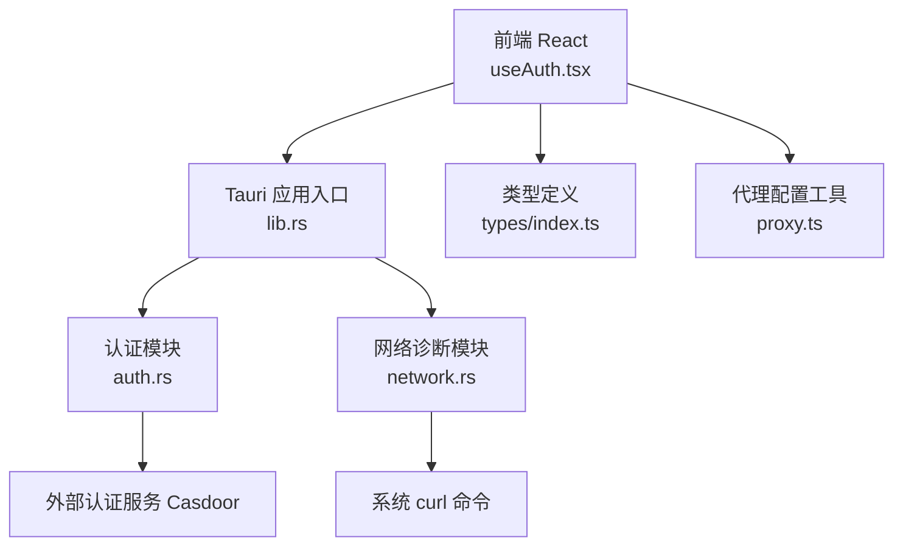
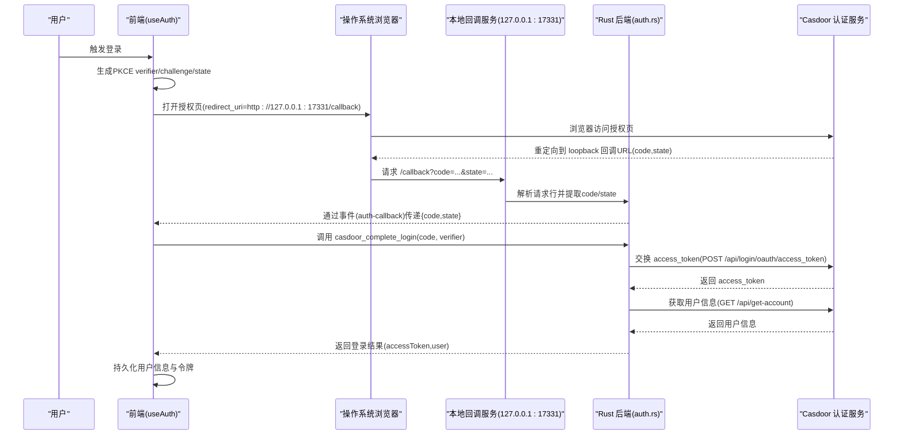
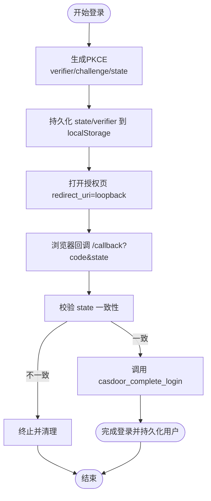
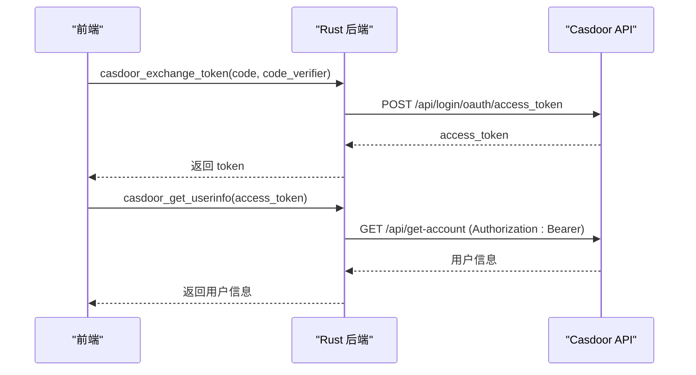
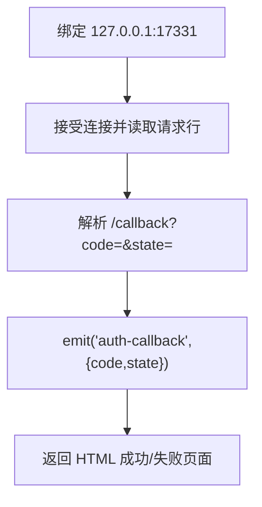
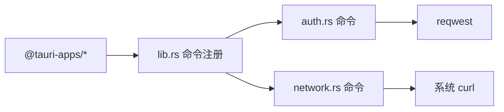

# 网络安全

<cite>
**本文引用的文件**
- [src/hooks/useAuth.tsx](file://src/hooks/useAuth.tsx)
- [src-tauri/src/auth.rs](file://src-tauri/src/auth.rs)
- [src-tauri/src/lib.rs](file://src-tauri/src/lib.rs)
- [src-tauri/src/network.rs](file://src-tauri/src/network.rs)
- [src/utils/proxy.ts](file://src/utils/proxy.ts)
- [src/types/index.ts](file://src/types/index.ts)
- [src-tauri/Cargo.toml](file://src-tauri/Cargo.toml)
- [src-tauri/tauri.conf.json](file://src-tauri/tauri.conf.json)
</cite>

## 目录
1. [简介](#简介)
2. [项目结构](#项目结构)
3. [核心组件](#核心组件)
4. [架构总览](#架构总览)
5. [详细组件分析](#详细组件分析)
6. [依赖关系分析](#依赖关系分析)
7. [性能考量](#性能考量)
8. [故障排查指南](#故障排查指南)
9. [结论](#结论)
10. [附录](#附录)

## 简介
本文件面向 RabbitCoding 的网络安全设计与实现，围绕以下主题展开：
- OAuth 2.0 授权码 + PKCE 流程与回退安全
- Casdoor 认证服务集成与 loopback 回调
- HTTPS 通信与证书校验链路
- 网络请求安全、代理与中间人攻击防护
- 端口安全与防火墙建议
- 网络诊断与安全加固实践

## 项目结构
RabbitCoding 采用前端 React + Tauri Rust 的混合架构。认证与网络相关逻辑主要分布在：
- 前端认证与 PKCE：src/hooks/useAuth.tsx
- Rust 后端认证与 loopback 回调：src-tauri/src/auth.rs
- 应用启动与命令注册：src-tauri/src/lib.rs
- 网络诊断与代理检测：src-tauri/src/network.rs
- 代理配置转换：src/utils/proxy.ts
- 类型与常量：src/types/index.ts
- 依赖与打包配置：src-tauri/Cargo.toml、src-tauri/tauri.conf.json

图表来源
- [src/hooks/useAuth.tsx:1-252](file://src/hooks/useAuth.tsx#L1-L252)
- [src-tauri/src/lib.rs:196-391](file://src-tauri/src/lib.rs#L196-L391)
- [src-tauri/src/auth.rs:1-376](file://src-tauri/src/auth.rs#L1-L376)
- [src-tauri/src/network.rs:1-864](file://src-tauri/src/network.rs#L1-L864)
- [src/utils/proxy.ts:1-62](file://src/utils/proxy.ts#L1-L62)
- [src/types/index.ts:715-733](file://src/types/index.ts#L715-L733)

章节来源
- [src/hooks/useAuth.tsx:1-252](file://src/hooks/useAuth.tsx#L1-L252)
- [src-tauri/src/lib.rs:196-391](file://src-tauri/src/lib.rs#L196-L391)
- [src-tauri/src/auth.rs:1-376](file://src-tauri/src/auth.rs#L1-L376)
- [src-tauri/src/network.rs:1-864](file://src-tauri/src/network.rs#L1-L864)
- [src/utils/proxy.ts:1-62](file://src/utils/proxy.ts#L1-L62)
- [src/types/index.ts:715-733](file://src/types/index.ts#L715-L733)

## 核心组件
- OAuth 2.0 + PKCE 前端实现：负责生成 PKCE 随机数、计算 code_challenge、构建授权 URL、持久化 state/verifier、监听 loopback 回调事件并完成 token 交换与用户信息获取。
- Rust 认证后端：封装 token 交换、用户信息查询、loopback 回调 HTTP 服务（127.0.0.1:17331）、事件派发至前端。
- 网络诊断与代理检测：跨平台检测系统代理、DNS 解析、HTTP/TLS 连通性、Ping 丢包与 RTT。
- 代理配置工具：将前端 ProxyConfig 转换为环境变量，兼容大小写键名，便于下游进程继承。

章节来源
- [src/hooks/useAuth.tsx:1-252](file://src/hooks/useAuth.tsx#L1-L252)
- [src-tauri/src/auth.rs:1-376](file://src-tauri/src/auth.rs#L1-L376)
- [src-tauri/src/network.rs:1-864](file://src-tauri/src/network.rs#L1-L864)
- [src/utils/proxy.ts:1-62](file://src/utils/proxy.ts#L1-L62)

## 架构总览
下图展示 RabbitCoding 的认证与网络交互路径，强调 loopback 回调、PKCE 与 HTTPS 通信：

图表来源
- [src/hooks/useAuth.tsx:100-187](file://src/hooks/useAuth.tsx#L100-L187)
- [src-tauri/src/auth.rs:251-376](file://src-tauri/src/auth.rs#L251-L376)
- [src-tauri/src/auth.rs:227-245](file://src-tauri/src/auth.rs#L227-L245)

章节来源
- [src/hooks/useAuth.tsx:100-224](file://src/hooks/useAuth.tsx#L100-L224)
- [src-tauri/src/auth.rs:227-376](file://src-tauri/src/auth.rs#L227-L376)

## 详细组件分析

### OAuth 2.0 + PKCE 实现与回退安全
- 前端使用 Web Crypto 生成随机字符串与 SHA-256 + base64url，确保 code_verifier 符合 PKCE 强约束。
- state 与 code_verifier 以 localStorage 持久化，配合 loopback 回调事件进行匹配与清理，降低 CSRF 与会话泄露风险。
- 回调端点固定为 127.0.0.1:17331，避免公网暴露与中间人劫持；Rust 端自行解析请求行并返回简单 HTML 页面，最小化服务面。
- Rust 端通过 Tauri 事件将 code/state 传递给前端，前端再发起 token 交换与用户信息获取，形成“浏览器仅参与授权”的闭环。

图表来源
- [src/hooks/useAuth.tsx:190-224](file://src/hooks/useAuth.tsx#L190-L224)
- [src/hooks/useAuth.tsx:106-168](file://src/hooks/useAuth.tsx#L106-L168)
- [src-tauri/src/auth.rs:258-376](file://src-tauri/src/auth.rs#L258-L376)

章节来源
- [src/hooks/useAuth.tsx:63-82](file://src/hooks/useAuth.tsx#L63-L82)
- [src/hooks/useAuth.tsx:106-168](file://src/hooks/useAuth.tsx#L106-L168)
- [src-tauri/src/auth.rs:258-376](file://src-tauri/src/auth.rs#L258-L376)

### Casdoor 认证服务集成
- 前端构建授权 URL，包含 client_id、redirect_uri、response_type、scope、code_challenge、state 等参数。
- Rust 后端提供三个命令：
  - 交换 token：casdoor_exchange_token
  - 获取用户信息：casdoor_get_userinfo
  - 组合命令：casdoor_complete_login（先交换 token 再获取用户信息）
- 所有对外请求使用 HTTPS，Rust 层通过 reqwest 客户端与系统证书栈协作，确保 TLS 校验。

图表来源
- [src-tauri/src/auth.rs:118-172](file://src-tauri/src/auth.rs#L118-L172)
- [src-tauri/src/auth.rs:179-220](file://src-tauri/src/auth.rs#L179-L220)
- [src-tauri/src/auth.rs:227-245](file://src-tauri/src/auth.rs#L227-L245)

章节来源
- [src/hooks/useAuth.tsx:206-217](file://src/hooks/useAuth.tsx#L206-L217)
- [src-tauri/src/auth.rs:118-245](file://src-tauri/src/auth.rs#L118-L245)

### Loopback 回调安全与事件派发
- Rust 端独立线程绑定 127.0.0.1:17331，解析请求行提取 query 参数，校验路径与参数后通过 Tauri 事件通知前端。
- 事件名为固定字符串，payload 包含 code 与 state；前端监听该事件并执行后续流程。
- 回调服务仅处理 /callback 路径，其他路径返回 404；错误场景返回“登录失败”页面，避免敏感信息泄露。

图表来源
- [src-tauri/src/auth.rs:258-376](file://src-tauri/src/auth.rs#L258-L376)

章节来源
- [src-tauri/src/auth.rs:258-376](file://src-tauri/src/auth.rs#L258-L376)

### HTTPS 通信与证书验证
- 外部 API 调用统一通过 HTTPS，Rust 层使用 reqwest，默认启用 TLS 校验。
- Cargo.toml 显示依赖 hyper-rustls、hyper-tls 等，表明底层基于 rustls/webpki 与系统证书栈协同工作。
- 网络诊断模块通过 curl 获取 TLS 版本与远端 IP，辅助识别证书链与协议版本。

章节来源
- [src-tauri/Cargo.toml:34-34](file://src-tauri/Cargo.toml#L34-L34)
- [src-tauri/src/network.rs:437-485](file://src-tauri/src/network.rs#L437-L485)

### 网络请求安全与代理
- 代理检测：优先读取环境变量（HTTP_PROXY/HTTPS_PROXY/all_proxy 等），其次在 Windows/macOS/Linux 平台分别尝试系统代理配置。
- 代理配置工具：将 ProxyConfig 转换为大小写兼容的环境变量键值对，便于下游进程继承。
- 网络诊断：对预设域名执行 DNS 解析、HTTP/TLS 连通性与 Ping，输出状态、错误与指标，辅助定位网络问题。

章节来源
- [src-tauri/src/network.rs:100-201](file://src-tauri/src/network.rs#L100-L201)
- [src/utils/proxy.ts:17-47](file://src/utils/proxy.ts#L17-L47)
- [src-tauri/src/network.rs:367-550](file://src-tauri/src/network.rs#L367-L550)

### 令牌管理机制
- 前端持久化用户信息（包括 accessToken），并在登出时清理 localStorage 中的 PKCE 临时数据与用户信息。
- Rust 后端不直接存储令牌，仅在必要时进行 token 交换与用户信息获取，降低本地持久化风险。

章节来源
- [src/hooks/useAuth.tsx:226-232](file://src/hooks/useAuth.tsx#L226-L232)
- [src/types/index.ts:718-732](file://src/types/index.ts#L718-L732)

## 依赖关系分析
- 前端依赖 @tauri-apps/api 与 @tauri-apps/plugin-opener，用于事件监听与系统浏览器打开。
- Rust 侧通过 tauri::command 暴露认证与网络诊断命令，统一由 lib.rs 注册。
- 外部依赖 reqwest、hyper-rustls、hyper-tls 等，保障 HTTPS 与 TLS 校验。

图表来源
- [src-tauri/src/lib.rs:344-387](file://src-tauri/src/lib.rs#L344-L387)
- [src-tauri/Cargo.toml:20-39](file://src-tauri/Cargo.toml#L20-L39)

章节来源
- [src-tauri/src/lib.rs:344-387](file://src-tauri/src/lib.rs#L344-L387)
- [src-tauri/Cargo.toml:20-39](file://src-tauri/Cargo.toml#L20-L39)

## 性能考量
- 本地 loopback 回调服务使用独立线程与简单 HTTP 解析，避免引入重型依赖，降低延迟与资源占用。
- 网络诊断模块采用异步任务与系统 curl，分两阶段获取指标（metrics + verbose），平衡准确性与性能。
- 建议：在高频网络诊断场景中，合并请求与缓存结果，避免重复调用系统工具。

## 故障排查指南
- 授权失败或状态不匹配
  - 检查前端是否正确持久化与比对 state；确认回调事件是否触发。
  - 参考：[src/hooks/useAuth.tsx:115-123](file://src/hooks/useAuth.tsx#L115-L123)
- 无法接收回调事件
  - 确认 Rust 启动时已调用回调服务；检查事件名与 payload 结构。
  - 参考：[src-tauri/src/lib.rs:223-224](file://src-tauri/src/lib.rs#L223-L224)、[src-tauri/src/auth.rs:314-337](file://src-tauri/src/auth.rs#L314-L337)
- 代理导致访问异常
  - 使用网络诊断命令查看代理状态与连通性；核对代理配置转换逻辑。
  - 参考：[src-tauri/src/network.rs:100-201](file://src-tauri/src/network.rs#L100-L201)、[src/utils/proxy.ts:17-47](file://src/utils/proxy.ts#L17-L47)
- TLS/证书问题
  - 使用网络诊断模块查看 TLS 版本与远端 IP；确认系统证书链有效。
  - 参考：[src-tauri/src/network.rs:437-485](file://src-tauri/src/network.rs#L437-L485)

章节来源
- [src/hooks/useAuth.tsx:115-123](file://src/hooks/useAuth.tsx#L115-L123)
- [src-tauri/src/lib.rs:223-224](file://src-tauri/src/lib.rs#L223-L224)
- [src-tauri/src/auth.rs:314-337](file://src-tauri/src/auth.rs#L314-L337)
- [src-tauri/src/network.rs:100-201](file://src-tauri/src/network.rs#L100-L201)
- [src/utils/proxy.ts:17-47](file://src/utils/proxy.ts#L17-L47)
- [src-tauri/src/network.rs:437-485](file://src-tauri/src/network.rs#L437-L485)

## 结论
RabbitCoding 在认证与网络方面采取了多层安全措施：
- 使用 PKCE 与 loopback 回调，显著降低授权码泄露与 CSRF 风险；
- 通过 HTTPS 与系统证书栈保障通信安全；
- 提供代理检测与网络诊断能力，便于快速定位问题；
- 严格的事件与参数校验，最小化本地服务面与错误信息暴露。

## 附录

### 端口与防火墙建议
- 本地回调端口：17331（仅监听 127.0.0.1），建议在企业防火墙策略中允许本地回环访问，禁止外网访问。
- 应用启动时自动注入 Node.js 运行时与 npm 全局目录，避免系统只读路径权限问题。

章节来源
- [src-tauri/src/auth.rs:15-17](file://src-tauri/src/auth.rs#L15-L17)
- [src-tauri/src/lib.rs:223-283](file://src-tauri/src/lib.rs#L223-L283)

### 代理配置示例与最佳实践
- 将 ProxyConfig 转换为环境变量键值对，确保大小写兼容（HTTP_PROXY/http_proxy、HTTPS_PROXY/https_proxy、ALL_PROXY/all_proxy、NO_PROXY/no_proxy）。
- 在启用代理时，优先使用系统代理检测结果；若需自定义，明确 noProxy 白名单（如 localhost、127.0.0.1）。

章节来源
- [src/utils/proxy.ts:17-47](file://src/utils/proxy.ts#L17-L47)

### 网络诊断命令参考
- DNS 诊断：对预设域名执行解析，输出解析时间、服务器与 IP 列表。
- HTTP/TLS 诊断：对预设端点执行 GET，输出状态码、HTTP 版本、TLS 版本、响应时间与远端 IP。
- Ping 诊断：对预设目标执行 ICMP，输出丢包率与 RTT 指标。

章节来源
- [src-tauri/src/network.rs:367-550](file://src-tauri/src/network.rs#L367-L550)