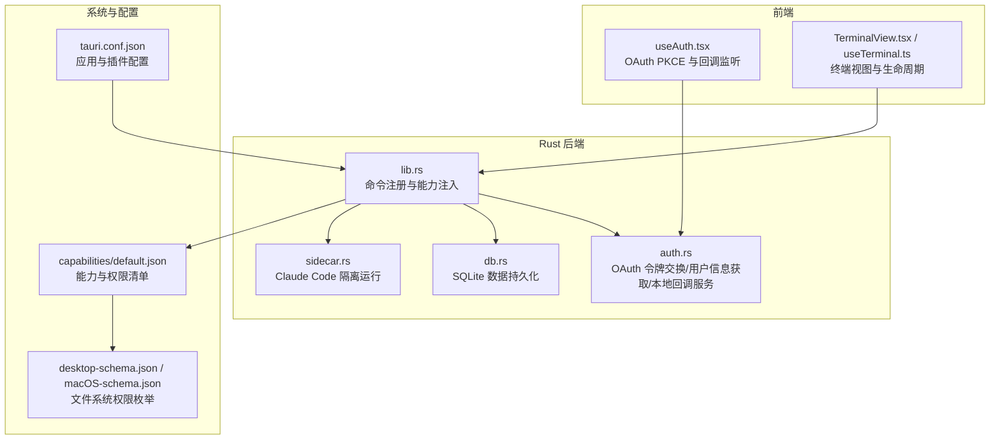
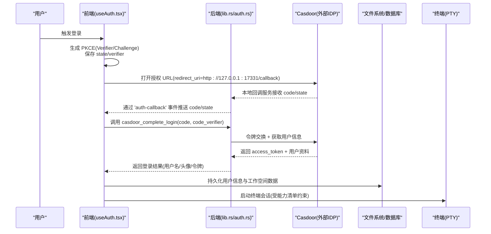
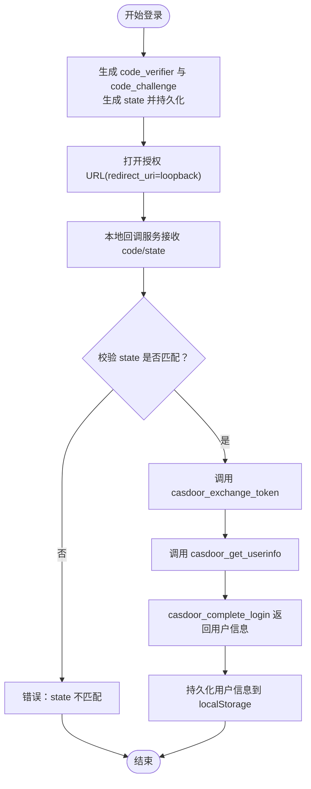
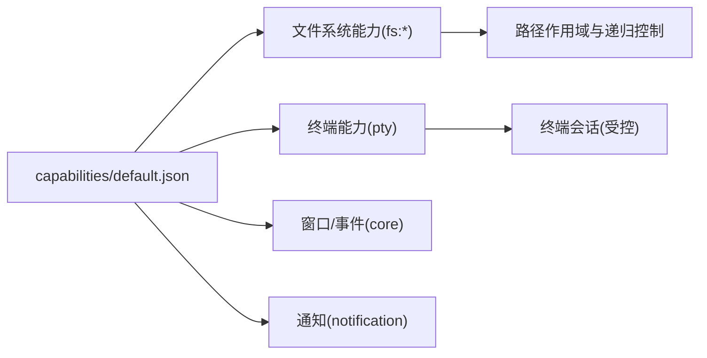
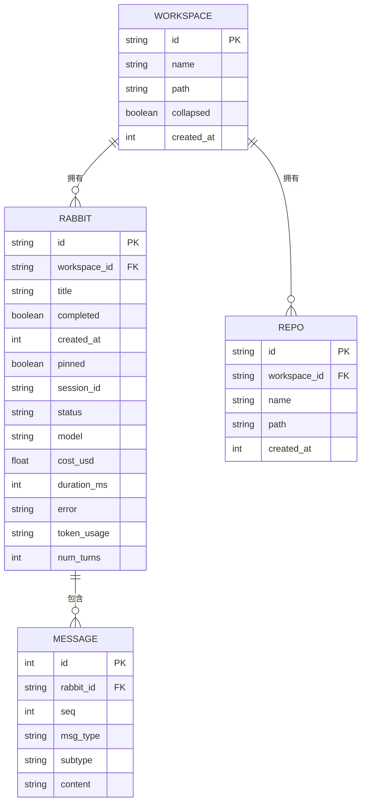
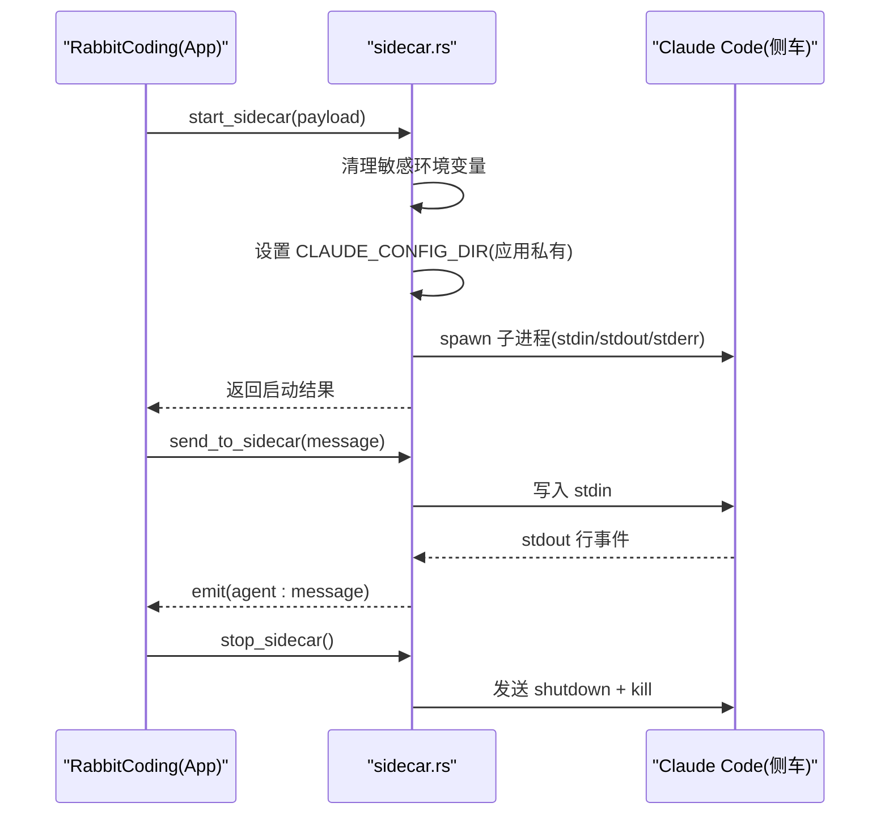
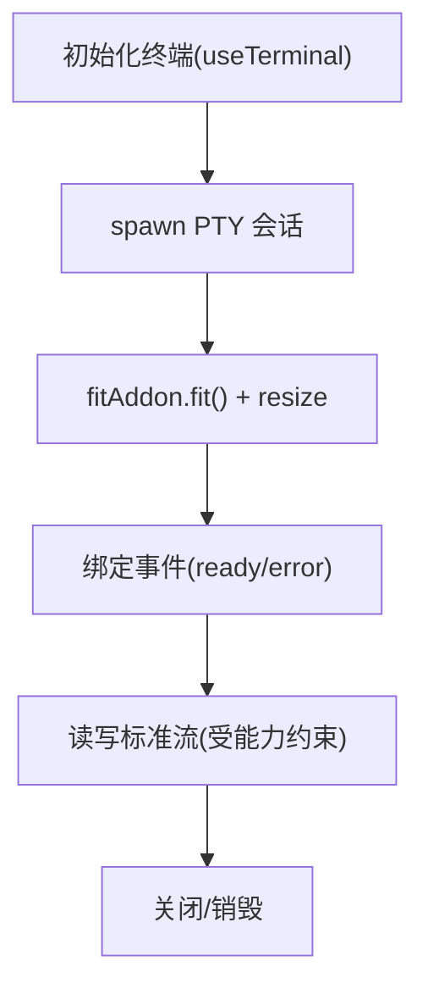
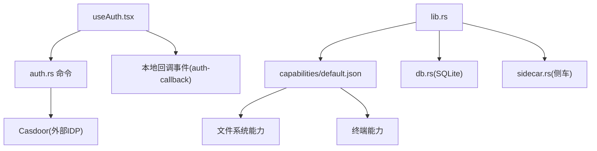

# 访问控制

<cite>
**本文引用的文件**
- [src-tauri/src/auth.rs](file://src-tauri/src/auth.rs)
- [src/hooks/useAuth.tsx](file://src/hooks/useAuth.tsx)
- [src-tauri/src/lib.rs](file://src-tauri/src/lib.rs)
- [src-tauri/capabilities/default.json](file://src-tauri/capabilities/default.json)
- [src-tauri/tauri.conf.json](file://src-tauri/tauri.conf.json)
- [src-tauri/src/db.rs](file://src-tauri/src/db.rs)
- [src-tauri/src/sidecar.rs](file://src-tauri/src/sidecar.rs)
- [src/types/index.ts](file://src/types/index.ts)
- [src/components/terminal/useTerminal.ts](file://src/components/terminal/useTerminal.ts)
- [src/components/terminal/TerminalView.tsx](file://src/components/terminal/TerminalView.tsx)
- [src-tauri/gen/schemas/desktop-schema.json](file://src-tauri/gen/schemas/desktop-schema.json)
- [src-tauri/gen/schemas/macOS-schema.json](file://src-tauri/gen/schemas/macOS-schema.json)
</cite>

## 目录
1. [简介](#简介)
2. [项目结构](#项目结构)
3. [核心组件](#核心组件)
4. [架构总览](#架构总览)
5. [详细组件分析](#详细组件分析)
6. [依赖关系分析](#依赖关系分析)
7. [性能考量](#性能考量)
8. [故障排查指南](#故障排查指南)
9. [结论](#结论)
10. [附录](#附录)

## 简介
本文件面向 RabbitCoding 的访问控制与权限管理，围绕用户身份认证、角色与权限分配、资源访问控制、OAuth 令牌验证、API 访问权限、数据隔离机制、工作空间与文件系统访问控制、终端操作权限、权限配置与继承规则、权限审计日志以及最佳实践与安全配置进行系统化说明。文档同时提供可视化图示与分层讲解，帮助开发者与运维人员快速理解并落地安全策略。

## 项目结构
RabbitCoding 的访问控制涉及三层协同：
- 前端 React 层：负责用户交互、OAuth PKCE 流程触发与回调接收、用户状态持久化。
- Tauri Rust 层：负责本地 OAuth 回调服务、命令暴露、文件系统与终端能力、侧车进程隔离与安全注入。
- 配置与能力层：通过 Tauri 能力与权限清单声明文件，限定文件系统、终端、对话框、通知等系统能力的最小可用集。

**图表来源**
- [src/hooks/useAuth.tsx:1-252](file://src/hooks/useAuth.tsx#L1-L252)
- [src-tauri/src/lib.rs:196-391](file://src-tauri/src/lib.rs#L196-L391)
- [src-tauri/src/auth.rs:118-376](file://src-tauri/src/auth.rs#L118-L376)
- [src-tauri/src/db.rs:140-417](file://src-tauri/src/db.rs#L140-L417)
- [src-tauri/src/sidecar.rs:1-359](file://src-tauri/src/sidecar.rs#L1-L359)
- [src-tauri/capabilities/default.json:1-41](file://src-tauri/capabilities/default.json#L1-L41)
- [src-tauri/tauri.conf.json:1-52](file://src-tauri/tauri.conf.json#L1-L52)
- [src-tauri/gen/schemas/desktop-schema.json:336-5381](file://src-tauri/gen/schemas/desktop-schema.json#L336-L5381)
- [src-tauri/gen/schemas/macOS-schema.json:336-5381](file://src-tauri/gen/schemas/macOS-schema.json#L336-L5381)

**章节来源**
- [src-tauri/src/lib.rs:196-391](file://src-tauri/src/lib.rs#L196-L391)
- [src-tauri/capabilities/default.json:1-41](file://src-tauri/capabilities/default.json#L1-41)
- [src-tauri/tauri.conf.json:1-52](file://src-tauri/tauri.conf.json#L1-L52)

## 核心组件
- 用户身份认证与 OAuth
  - 前端通过 PKCE 生成 code_verifier 与 code_challenge，打开浏览器访问 Casdoor 授权端点，本地 loopback 回调服务捕获 code/state，前端校验 state 并调用后端完成令牌交换与用户信息获取。
  - 后端提供 casdoor_exchange_token、casdoor_get_userinfo、casdoor_complete_login 三个命令，封装令牌交换与用户信息查询。
- 能力与权限清单
  - 通过 capabilities/default.json 声明窗口、对话框、文件系统、终端、通知、深链等能力；文件系统权限通过路径作用域与递归读写能力枚举进行细粒度控制。
- 数据持久化与隔离
  - SQLite 数据库存储工作空间、会话、仓库与消息，配合 Tauri 状态管理注入应用数据目录，确保数据隔离与跨平台一致性。
- 侧车进程隔离
  - 通过 sidecar.rs 启动 Claude Code 侧车，清理继承环境变量、重定向配置根目录，实现与用户全局环境的强隔离。
- 终端访问控制
  - 通过 Tauri PTY 插件与 xterm.js 集成，结合能力清单限制文件系统访问范围，仅允许工作区与受限目录。

**章节来源**
- [src/hooks/useAuth.tsx:190-241](file://src/hooks/useAuth.tsx#L190-L241)
- [src-tauri/src/auth.rs:118-245](file://src-tauri/src/auth.rs#L118-L245)
- [src-tauri/capabilities/default.json:8-41](file://src-tauri/capabilities/default.json#L8-L41)
- [src-tauri/src/db.rs:140-161](file://src-tauri/src/db.rs#L140-L161)
- [src-tauri/src/sidecar.rs:59-214](file://src-tauri/src/sidecar.rs#L59-L214)
- [src/components/terminal/useTerminal.ts:1-62](file://src/components/terminal/useTerminal.ts#L1-L62)

## 架构总览
下图展示了 RabbitCoding 的访问控制与权限管理的整体架构，包括认证流程、能力声明、数据与进程隔离、终端与文件系统访问控制。

**图表来源**
- [src/hooks/useAuth.tsx:100-187](file://src/hooks/useAuth.tsx#L100-L187)
- [src-tauri/src/auth.rs:258-350](file://src-tauri/src/auth.rs#L258-L350)
- [src-tauri/src/lib.rs:223-224](file://src-tauri/src/lib.rs#L223-L224)

## 详细组件分析

### 用户身份认证与 OAuth
- 前端流程要点
  - 生成 PKCE：随机字符串作为 code_verifier，计算 SHA-256 后 base64url 得到 code_challenge；state 用于防 CSRF。
  - 本地回调：通过 loopback HTTP 服务接收回调，校验 state 与 code_verifier 后调用后端命令完成令牌交换与用户信息获取。
  - 会话持久化：登录成功后将用户信息写入 localStorage，并记录登录时间戳。
- 后端流程要点
  - 令牌交换：向 Casdoor 令牌端点发起授权码换取 access_token 的请求。
  - 用户信息：使用 access_token 调用 /api/get-account 获取用户资料。
  - 组合命令：casdoor_complete_login 将上述两步合并，减少前端往返。
- 安全要点
  - 严格校验 state，防止 CSRF。
  - code_verifier 仅在本地使用，不暴露至网络。
  - 本地回调服务仅监听 127.0.0.1:17331，避免公网暴露。

**图表来源**
- [src/hooks/useAuth.tsx:190-241](file://src/hooks/useAuth.tsx#L190-L241)
- [src-tauri/src/auth.rs:118-245](file://src-tauri/src/auth.rs#L118-L245)

**章节来源**
- [src/hooks/useAuth.tsx:190-241](file://src/hooks/useAuth.tsx#L190-L241)
- [src-tauri/src/auth.rs:118-245](file://src-tauri/src/auth.rs#L118-L245)

### 能力与权限清单（文件系统、终端、通知等）
- 能力清单
  - 窗口、事件、对话框、通知、深链、opener 等默认能力开启。
  - 文件系统能力通过路径作用域与递归读写能力枚举进行精确控制，包含 HOME、.agents 等特定路径。
  - 终端能力通过 PTY 插件启用，结合文件系统作用域限制访问范围。
- 文件系统权限枚举
  - 桌面/应用数据/资源/模板等目录的读写与元数据访问能力，支持非递归与递归两种粒度。
  - 通过作用域配置，将可访问路径限定在用户家目录与应用私有目录范围内。

**图表来源**
- [src-tauri/capabilities/default.json:8-41](file://src-tauri/capabilities/default.json#L8-L41)
- [src-tauri/gen/schemas/desktop-schema.json:336-5381](file://src-tauri/gen/schemas/desktop-schema.json#L336-L5381)
- [src-tauri/gen/schemas/macOS-schema.json:336-5381](file://src-tauri/gen/schemas/macOS-schema.json#L336-L5381)

**章节来源**
- [src-tauri/capabilities/default.json:8-41](file://src-tauri/capabilities/default.json#L8-L41)
- [src-tauri/gen/schemas/desktop-schema.json:336-5381](file://src-tauri/gen/schemas/desktop-schema.json#L336-L5381)
- [src-tauri/gen/schemas/macOS-schema.json:336-5381](file://src-tauri/gen/schemas/macOS-schema.json#L336-L5381)

### 数据持久化与隔离（SQLite）
- 数据模型
  - 工作空间、会话、仓库、消息等实体，采用外键关联与级联删除，保证数据一致性。
  - 消息序列通过独立表存储，便于按会话检索与聚合。
- 隔离策略
  - 应用数据目录统一管理，避免与系统其他位置冲突。
  - 通过命令接口提供全量导入导出，支持事务批量写入，降低并发风险。

**图表来源**
- [src-tauri/src/db.rs:85-138](file://src-tauri/src/db.rs#L85-L138)

**章节来源**
- [src-tauri/src/db.rs:140-417](file://src-tauri/src/db.rs#L140-L417)

### 侧车进程隔离（Claude Code）
- 隔离措施
  - 清理从父进程继承的敏感环境变量，避免与 BYOK 配置冲突。
  - 重定向 Claude 配置根目录到应用专用数据目录，确保与用户全局环境完全隔离。
- 运行与通信
  - 启动 sidecar 进程，分别读取 stdout/stderr 线程并将事件广播给前端。
  - 通过 stdin 发送消息，支持优雅关闭与进程回收。

**图表来源**
- [src-tauri/src/sidecar.rs:59-214](file://src-tauri/src/sidecar.rs#L59-L214)

**章节来源**
- [src-tauri/src/sidecar.rs:59-214](file://src-tauri/src/sidecar.rs#L59-L214)

### 终端操作权限
- 终端生命周期
  - 通过 xterm.js 与 PTY 插件集成，支持自适应缩放与主题切换。
  - 仅在受能力清单约束的路径范围内进行文件系统操作，避免越权访问。
- 访问控制
  - 能力清单中明确启用 PTY 与必要文件系统能力，结合路径作用域限制访问范围。

**图表来源**
- [src/components/terminal/useTerminal.ts:33-62](file://src/components/terminal/useTerminal.ts#L33-L62)
- [src/components/terminal/TerminalView.tsx:15-47](file://src/components/terminal/TerminalView.tsx#L15-L47)
- [src-tauri/capabilities/default.json:20-26](file://src-tauri/capabilities/default.json#L20-L26)

**章节来源**
- [src/components/terminal/useTerminal.ts:1-62](file://src/components/terminal/useTerminal.ts#L1-L62)
- [src/components/terminal/TerminalView.tsx:1-47](file://src/components/terminal/TerminalView.tsx#L1-L47)
- [src-tauri/capabilities/default.json:20-26](file://src-tauri/capabilities/default.json#L20-L26)

## 依赖关系分析
- 前端依赖后端命令与事件
  - useAuth.tsx 依赖 auth.rs 暴露的 casdoor_* 命令与本地回调事件。
- 后端能力依赖配置文件
  - capabilities/default.json 决定文件系统、终端、通知等能力的可用性与作用域。
- 终端与文件系统
  - 终端能力通过 PTY 插件启用，文件系统访问通过作用域与递归能力枚举控制。

**图表来源**
- [src/hooks/useAuth.tsx:100-187](file://src/hooks/useAuth.tsx#L100-L187)
- [src-tauri/src/lib.rs:344-387](file://src-tauri/src/lib.rs#L344-L387)
- [src-tauri/capabilities/default.json:1-41](file://src-tauri/capabilities/default.json#L1-L41)

**章节来源**
- [src-tauri/src/lib.rs:344-387](file://src-tauri/src/lib.rs#L344-L387)
- [src-tauri/capabilities/default.json:1-41](file://src-tauri/capabilities/default.json#L1-L41)

## 性能考量
- OAuth 流程优化
  - 前端仅在首次登录时生成 PKCE，后续复用本地持久化的 state/verifier，减少重复计算与网络往返。
  - 后端将令牌交换与用户信息获取合并为一个命令，降低前端等待时间。
- 文件系统与终端
  - 文件系统能力通过作用域与递归控制，避免不必要的目录扫描与权限检查。
  - 终端缩放与渲染通过 fitAddon 与 ResizeObserver 优化，避免频繁重排。
- 数据持久化
  - SQLite 事务批量写入，减少磁盘 I/O；索引建立在常用查询列上，提升读取效率。

## 故障排查指南
- OAuth 登录失败
  - 检查本地回调服务是否正常监听 127.0.0.1:17331；确认前端是否正确接收 auth-callback 事件。
  - 校验 state 是否匹配，避免 CSRF 防护导致的登录中断。
- 令牌交换失败
  - 查看后端日志输出，确认 Casdoor 返回的错误信息与描述；检查 redirect_uri 与客户端配置是否一致。
- 文件系统访问受限
  - 检查 capabilities/default.json 中的 fs 作用域与递归能力是否满足需求；确认目标路径是否在允许范围内。
- 终端无输出或崩溃
  - 确认 PTY 插件已启用；检查终端容器可见性与 fitAddon.fit() 是否抛异常；查看 stderr 日志。
- 侧车进程异常
  - 检查环境变量是否被正确清理与注入；确认 CLAUDE_CONFIG_DIR 是否指向应用私有目录；查看 stdout/stderr 输出。

**章节来源**
- [src-tauri/src/auth.rs:258-350](file://src-tauri/src/auth.rs#L258-L350)
- [src-tauri/src/lib.rs:223-224](file://src-tauri/src/lib.rs#L223-L224)
- [src-tauri/src/sidecar.rs:175-208](file://src-tauri/src/sidecar.rs#L175-L208)

## 结论
RabbitCoding 的访问控制体系以“最小权限”为核心原则：前端仅承担交互与回调处理，后端集中处理认证与系统能力调用；通过能力清单与文件系统作用域精确控制访问范围；通过 SQLite 与应用数据目录实现数据隔离；通过 sidecar 隔离与环境变量清理实现进程级安全。整体方案兼顾安全性与可用性，适合桌面端复杂场景下的权限治理。

## 附录
- 权限配置方法
  - 在 capabilities/default.json 中添加/调整能力与作用域；在 tauri.conf.json 中配置应用与插件参数。
- 权限继承规则
  - 能力清单为应用级声明，子进程（如 sidecar）继承父进程能力但可通过环境变量与路径隔离进行约束。
- 权限审计日志
  - 建议在后端命令与 sidecar stdout/stderr 中增加结构化日志，记录关键操作与错误码，便于审计与追踪。
- 最佳实践与安全配置
  - 严格启用 PKCE 与 state 校验；限制文件系统作用域至最小必要路径；定期清理敏感环境变量；对侧车进程进行根目录隔离；对终端会话进行可见性与缩放控制；对 SQLite 数据进行备份与迁移策略。