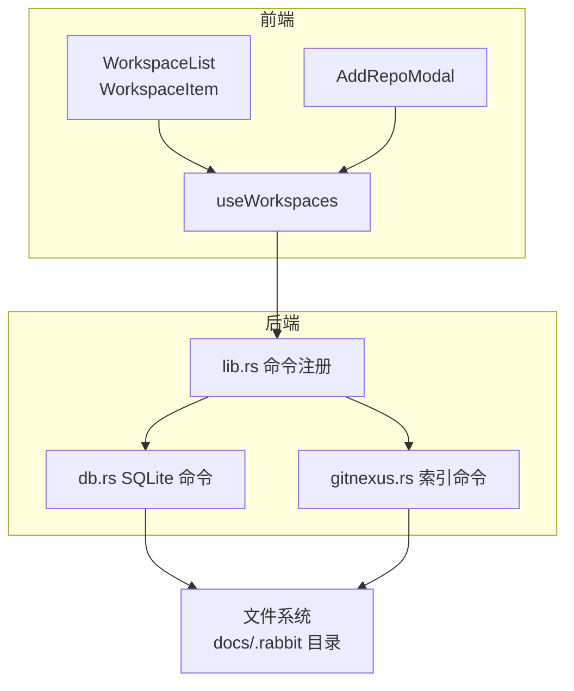
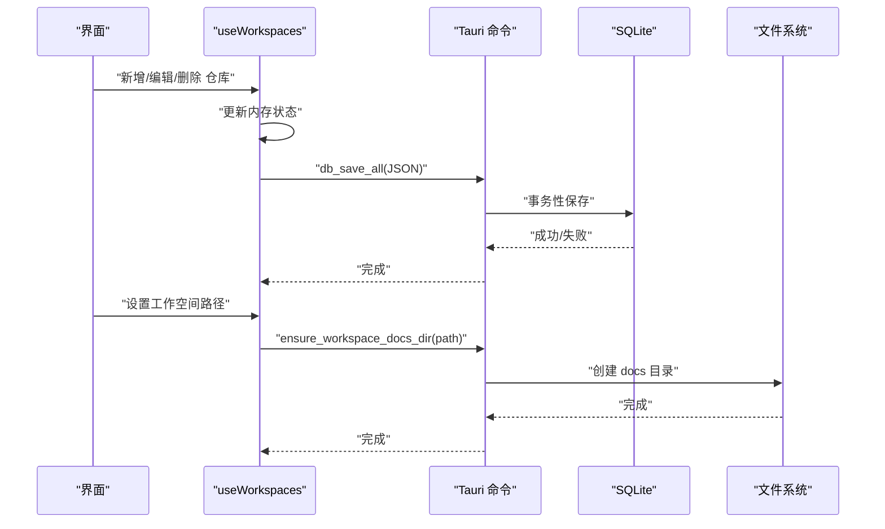
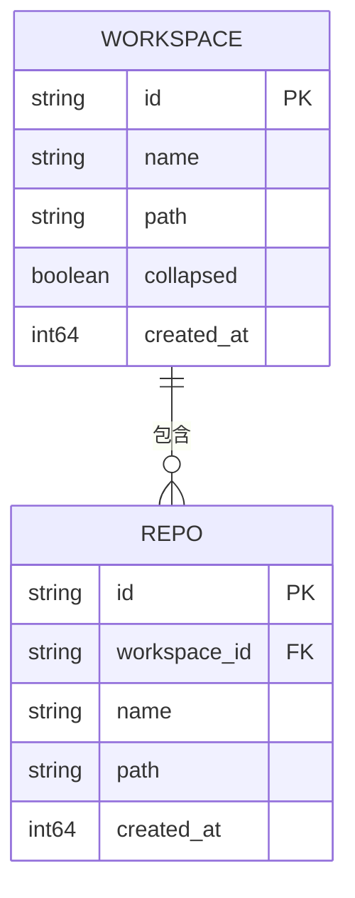
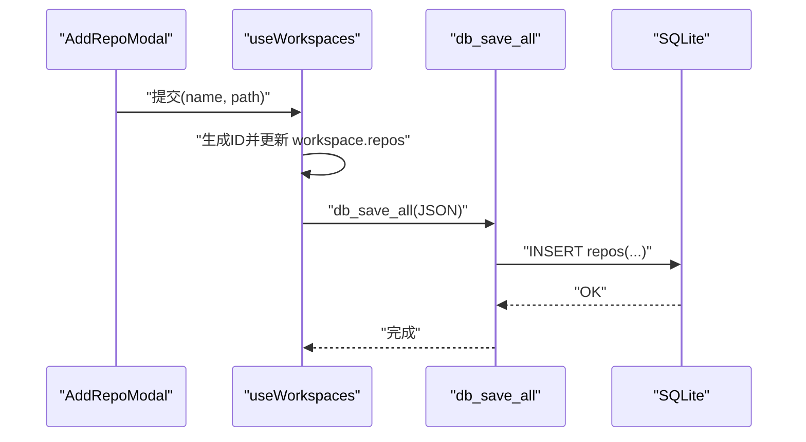
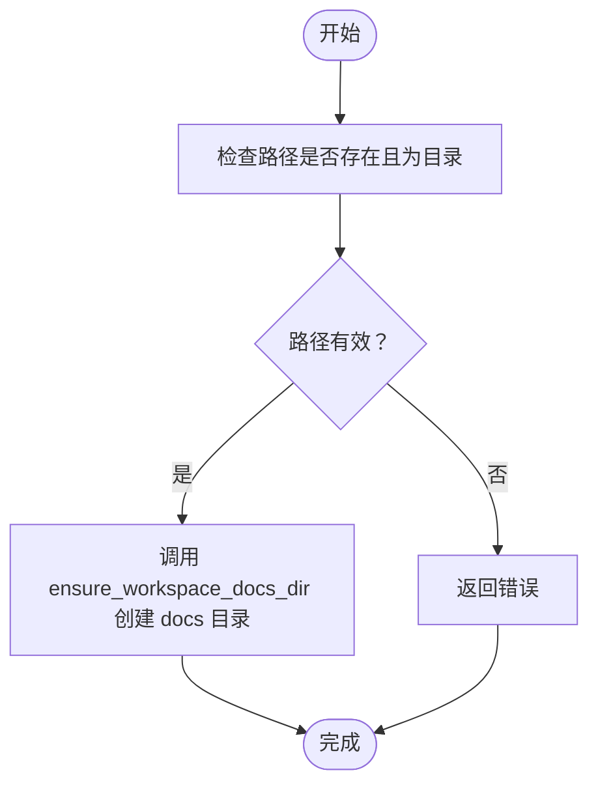
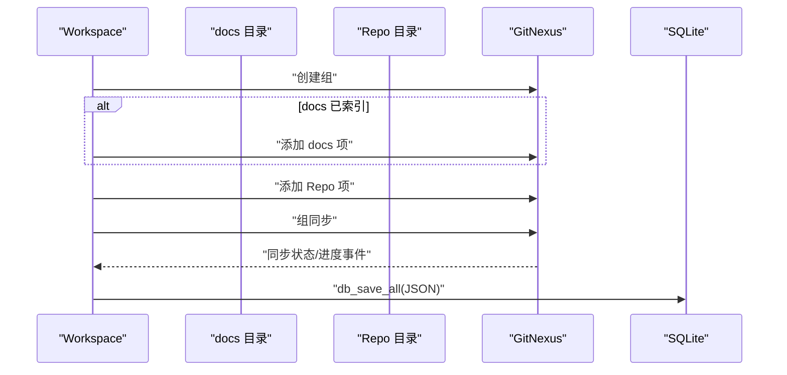
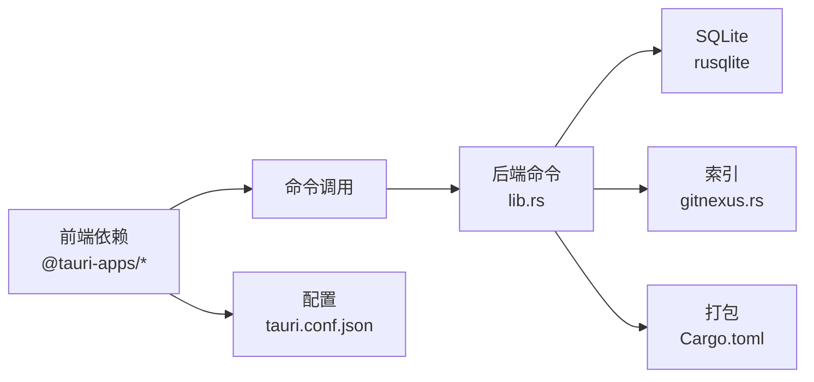

# 仓库管理

<cite>
**本文引用的文件**
- [src-tauri/src/lib.rs](file://src-tauri/src/lib.rs)
- [src-tauri/src/db.rs](file://src-tauri/src/db.rs)
- [src-tauri/src/gitnexus.rs](file://src-tauri/src/gitnexus.rs)
- [src/hooks/useWorkspaces.ts](file://src/hooks/useWorkspaces.ts)
- [src/components/common/AddRepoModal.tsx](file://src/components/common/AddRepoModal.tsx)
- [src/components/sidebar/SidebarHeader.tsx](file://src/components/sidebar/SidebarHeader.tsx)
- [src/components/sidebar/WorkspaceList.tsx](file://src/components/sidebar/WorkspaceList.tsx)
- [src/components/sidebar/WorkspaceItem.tsx](file://src/components/sidebar/WorkspaceItem.tsx)
- [src/types/index.ts](file://src/types/index.ts)
- [src-tauri/tauri.conf.json](file://src-tauri/tauri.conf.json)
- [src-tauri/Cargo.toml](file://src-tauri/Cargo.toml)
- [package.json](file://package.json)
</cite>

## 目录
1. [简介](#简介)
2. [项目结构](#项目结构)
3. [核心组件](#核心组件)
4. [架构总览](#架构总览)
5. [详细组件分析](#详细组件分析)
6. [依赖分析](#依赖分析)
7. [性能考量](#性能考量)
8. [故障排查指南](#故障排查指南)
9. [结论](#结论)
10. [附录](#附录)

## 简介
本文件面向 RabbitCoding 的“仓库管理”能力，系统性阐述工作空间（Workspace）与仓库（Repo）的概念、作用与管理机制。文档涵盖仓库的新增、删除、修改、查询流程，仓库路径校验策略，文档目录（docs）与工作空间根目录的文件系统集成方式，以及仓库与工作空间的绑定关系与数据隔离机制。同时给出仓库配置选项、权限控制与安全注意事项，并提供最佳实践与常见问题解决方案。

## 项目结构
仓库管理涉及前端状态与持久化、后端数据库与文件系统命令、以及索引与检索能力的协同。关键模块如下：
- 前端状态与持久化：React Hook 管理工作空间与仓库集合，采用 SQLite 作为主数据源，具备降级到 localStorage 的容错机制。
- 后端命令与数据库：提供工作空间与仓库的增删改查、全量导入导出、路径存在性校验等命令。
- 文件系统集成：确保工作空间根目录下的 docs、.rabbit/specs、.rabbit/codewiki 等目录存在，保障知识库与索引能力。
- 索引与检索：通过 GitNexus CLI 对 docs 与仓库进行分析与索引，支持组同步与进度事件。

图表来源
- [src-tauri/src/lib.rs:196-390](file://src-tauri/src/lib.rs#L196-L390)
- [src-tauri/src/db.rs:392-406](file://src-tauri/src/db.rs#L392-L406)
- [src-tauri/src/gitnexus.rs:381-437](file://src-tauri/src/gitnexus.rs#L381-L437)
- [src/hooks/useWorkspaces.ts:28-120](file://src/hooks/useWorkspaces.ts#L28-L120)
- [src/components/sidebar/WorkspaceList.tsx:10-62](file://src/components/sidebar/WorkspaceList.tsx#L10-L62)
- [src/components/sidebar/WorkspaceItem.tsx:38-62](file://src/components/sidebar/WorkspaceItem.tsx#L38-L62)

章节来源
- [src-tauri/src/lib.rs:196-390](file://src-tauri/src/lib.rs#L196-L390)
- [src-tauri/src/db.rs:392-406](file://src-tauri/src/db.rs#L392-L406)
- [src-tauri/src/gitnexus.rs:381-437](file://src-tauri/src/gitnexus.rs#L381-L437)
- [src/hooks/useWorkspaces.ts:28-120](file://src/hooks/useWorkspaces.ts#L28-L120)
- [src/components/sidebar/WorkspaceList.tsx:10-62](file://src/components/sidebar/WorkspaceList.tsx#L10-L62)
- [src/components/sidebar/WorkspaceItem.tsx:38-62](file://src/components/sidebar/WorkspaceItem.tsx#L38-L62)

## 核心组件
- 工作空间（Workspace）：顶层容器，包含名称、路径、折叠状态、创建时间，以及关联的兔子（Rabbit）与仓库（Repo）列表。
- 仓库（Repo）：绑定到某个工作空间的代码仓库条目，包含唯一 ID、名称、路径与创建时间。
- 前端 Hook（useWorkspaces）：负责工作空间与仓库的内存状态维护、SQLite/本地存储的异步加载与保存、路径变更触发的目录创建。
- 后端命令（lib.rs）：提供 ensure_workspace_docs_dir、ensure_rabbit_specs_dir、ensure_rabbit_codewiki_dir 等幂等目录创建命令，以及 db_*、gitnexus_* 系列命令。
- 数据库（db.rs）：定义 WorkspaceData/RepoData 等序列化结构，提供全量加载与保存、是否存在数据的探测。
- 索引（gitnexus.rs）：提供 GitNexus CLI 的检查、分析、组管理与同步命令，支持对 docs 与仓库的索引与组同步。

章节来源
- [src/types/index.ts:34-42](file://src/types/index.ts#L34-L42)
- [src/types/index.ts:1-6](file://src/types/index.ts#L1-L6)
- [src/hooks/useWorkspaces.ts:28-120](file://src/hooks/useWorkspaces.ts#L28-L120)
- [src-tauri/src/lib.rs:20-43](file://src-tauri/src/lib.rs#L20-L43)
- [src-tauri/src/db.rs:10-25](file://src-tauri/src/db.rs#L10-L25)
- [src-tauri/src/gitnexus.rs:350-437](file://src-tauri/src/gitnexus.rs#L350-L437)

## 架构总览
仓库管理的端到端流程包括：前端交互触发状态变更，Hook 将变更写入 SQLite；当工作空间路径发生变更时，前端调用后端命令确保 docs 目录存在；索引模块根据工作空间与仓库状态，调用 GitNexus CLI 进行分析与组同步。

图表来源
- [src/hooks/useWorkspaces.ts:100-120](file://src/hooks/useWorkspaces.ts#L100-L120)
- [src-tauri/src/db.rs:392-406](file://src-tauri/src/db.rs#L392-L406)
- [src-tauri/src/lib.rs:20-43](file://src-tauri/src/lib.rs#L20-L43)

## 详细组件分析

### 数据模型与绑定关系
- WorkspaceData/RepoData：后端使用结构体承载工作空间与仓库的数据，包含 id、name、path、created_at 等字段，并通过 serde 的 camelCase 映射与前端一致。
- Workspace 与 Repo 的绑定：每个 Repo 拥有 workspace_id 字段，形成一对多关系；前端通过 workspace.repos 列表维护仓库集合。
- 数据隔离：每个 Workspace 代表一个独立的工作域，其 Repo 列表与该 Workspace 的 docs 目录共同构成索引与知识库的边界。

图表来源
- [src-tauri/src/db.rs:10-25](file://src-tauri/src/db.rs#L10-L25)
- [src-tauri/src/db.rs:261-272](file://src-tauri/src/db.rs#L261-L272)
- [src/types/index.ts:34-42](file://src/types/index.ts#L34-L42)
- [src/types/index.ts:1-6](file://src/types/index.ts#L1-L6)

章节来源
- [src-tauri/src/db.rs:10-25](file://src-tauri/src/db.rs#L10-L25)
- [src-tauri/src/db.rs:261-272](file://src-tauri/src/db.rs#L261-L272)
- [src/types/index.ts:34-42](file://src/types/index.ts#L34-L42)
- [src/types/index.ts:1-6](file://src/types/index.ts#L1-L6)

### 仓库的新增、删除、修改与查询
- 新增仓库
  - 前端：打开 AddRepoModal，输入名称与路径，提交后由 Hook 生成唯一 ID 并追加到对应 Workspace.repos。
  - 后端：db_save_all 将完整 Workspace[] 写入 SQLite，事务保证一致性。
- 删除仓库
  - 前端：根据 repoId 过滤掉对应仓库，立即更新内存状态。
  - 后端：db_save_all 持久化。
- 修改仓库
  - 前端：updateRepo 通过部分更新字段（name/path）更新内存状态。
  - 后端：db_save_all 持久化。
- 查询仓库
  - 前端：从内存 workspaces 中读取 workspace.repos。
  - 后端：db_load_all 返回完整 Workspace[] JSON，包含每个 Workspace 的 repos 列表。

图表来源
- [src/components/common/AddRepoModal.tsx:13-40](file://src/components/common/AddRepoModal.tsx#L13-L40)
- [src/hooks/useWorkspaces.ts:277-297](file://src/hooks/useWorkspaces.ts#L277-L297)
- [src-tauri/src/db.rs:375-382](file://src-tauri/src/db.rs#L375-L382)

章节来源
- [src/components/common/AddRepoModal.tsx:13-40](file://src/components/common/AddRepoModal.tsx#L13-L40)
- [src/hooks/useWorkspaces.ts:277-297](file://src/hooks/useWorkspaces.ts#L277-L297)
- [src-tauri/src/db.rs:375-382](file://src-tauri/src/db.rs#L375-L382)

### 仓库路径验证与文档目录创建
- 路径验证
  - 索引阶段：gitnexus_analyze 在执行分析前会检查目标路径是否存在且为目录，若不满足则返回错误。
- 文档目录创建
  - 前端：当工作空间路径变更时，自动调用 ensure_workspace_docs_dir，确保 docs 目录存在（幂等）。
  - 后端：ensure_workspace_docs_dir 在工作空间根目录创建 docs 子目录；另有 ensure_rabbit_specs_dir、ensure_rabbit_codewiki_dir 保障 .rabbit/specs 与 .rabbit/codewiki 目录存在。

图表来源
- [src-tauri/src/gitnexus.rs:396-400](file://src-tauri/src/gitnexus.rs#L396-L400)
- [src-tauri/src/lib.rs:20-43](file://src-tauri/src/lib.rs#L20-L43)

章节来源
- [src-tauri/src/gitnexus.rs:396-400](file://src-tauri/src/gitnexus.rs#L396-L400)
- [src-tauri/src/lib.rs:20-43](file://src-tauri/src/lib.rs#L20-L43)

### 仓库与工作空间的绑定关系与数据隔离
- 绑定关系
  - 每个 Repo 属于一个 Workspace，通过 workspace_id 关联；Workspace 本身可包含多个 Repo。
- 数据隔离
  - 每个 Workspace 的索引与知识库以 docs 与 .rabbit 目录为边界，不同 Workspace 之间相互隔离。
  - 索引同步时，先创建组，再将 docs 与各 Repo 作为项加入组，最后执行组同步，确保作用域清晰。

图表来源
- [src-tauri/src/gitnexus.rs:381-437](file://src-tauri/src/gitnexus.rs#L381-L437)
- [src-tauri/src/db.rs:392-406](file://src-tauri/src/db.rs#L392-L406)

章节来源
- [src-tauri/src/gitnexus.rs:381-437](file://src-tauri/src/gitnexus.rs#L381-L437)
- [src-tauri/src/db.rs:392-406](file://src-tauri/src/db.rs#L392-L406)

### 仓库配置选项、权限控制与安全考虑
- 配置选项
  - 工作空间路径：用于确定 docs 与 .rabbit 目录位置，影响索引与知识库范围。
  - 仓库路径：用于索引与检索，需为有效目录。
- 权限控制
  - 文件系统访问：通过 Tauri 插件与命令进行受控访问；隐藏目录（如 .rabbit）通过专用命令读取。
  - 索引权限：GitNexus CLI 需要单独安装与检查，未安装时会提示用户在设置中安装。
- 安全考虑
  - 路径合法性：索引前进行存在性与目录类型校验，避免误操作。
  - 数据持久化：SQLite 事务写入，失败回滚；不可用时降级到 localStorage。
  - 插件与命令白名单：仅暴露必要的命令，避免过度授权。

章节来源
- [src-tauri/src/gitnexus.rs:350-379](file://src-tauri/src/gitnexus.rs#L350-L379)
- [src-tauri/src/lib.rs:107-112](file://src-tauri/src/lib.rs#L107-L112)
- [src-tauri/src/db.rs:290-305](file://src-tauri/src/db.rs#L290-L305)

## 依赖分析
- 前端依赖
  - @tauri-apps/api、@tauri-apps/plugin-*：提供命令调用、对话框、文件系统、通知等能力。
  - 本地存储与状态管理：localStorage 用于选中项与降级存储，useState/ref 用于内存状态。
- 后端依赖
  - rusqlite：SQLite 访问与事务控制。
  - tauri-plugin-*：窗口状态、通知、深链、终端等插件。
  - tokio：异步任务与子进程管理（如 GitNexus 分析）。
- 配置与打包
  - tauri.conf.json：应用元信息、窗口、深链等配置。
  - Cargo.toml：Rust 依赖清单，包含 tauri、rusqlite、tokio 等。

图表来源
- [package.json:14-36](file://package.json#L14-L36)
- [src-tauri/tauri.conf.json:1-51](file://src-tauri/tauri.conf.json#L1-L51)
- [src-tauri/Cargo.toml:20-38](file://src-tauri/Cargo.toml#L20-L38)
- [src-tauri/src/lib.rs:196-390](file://src-tauri/src/lib.rs#L196-L390)

章节来源
- [package.json:14-36](file://package.json#L14-L36)
- [src-tauri/tauri.conf.json:1-51](file://src-tauri/tauri.conf.json#L1-L51)
- [src-tauri/Cargo.toml:20-38](file://src-tauri/Cargo.toml#L20-L38)
- [src-tauri/src/lib.rs:196-390](file://src-tauri/src/lib.rs#L196-L390)

## 性能考量
- 写入策略
  - 双层防抖：500ms 内存写入后统一保存，3s 强制保存覆盖连续流式输出，降低频繁 IO。
  - 事务写入：db_save_all 在单事务中批量插入，提升吞吐并保证一致性。
- 索引性能
  - 后台线程执行：GitNexus 分析在后台线程执行，避免阻塞主线程。
  - 进度事件：通过事件流汇报进度，便于前端展示与用户感知。
- 文件系统
  - 幂等目录创建：ensure_* 系列命令幂等，避免重复创建带来的额外开销。

章节来源
- [src/hooks/useWorkspaces.ts:100-120](file://src/hooks/useWorkspaces.ts#L100-L120)
- [src-tauri/src/db.rs:290-305](file://src-tauri/src/db.rs#L290-L305)
- [src-tauri/src/gitnexus.rs:416-437](file://src-tauri/src/gitnexus.rs#L416-L437)

## 故障排查指南
- 数据库不可用
  - 现象：db_* 命令失败，前端降级到 localStorage。
  - 处理：检查应用数据目录权限与磁盘空间；必要时清理或重装应用。
- GitNexus 未安装
  - 现象：调用 gitnexus_* 命令时报“未安装”，或分析失败。
  - 处理：在设置中点击“安装”，确保 CLI 可用后再执行分析。
- 路径无效或非目录
  - 现象：索引失败，提示路径不存在或不是目录。
  - 处理：确认路径存在且为目录；对 docs 使用 --skip-git 参数避免向上查找 .git 根。
- 目录创建失败
  - 现象：docs 或 .rabbit 目录未创建。
  - 处理：检查工作空间路径权限；确保应用具有写入权限；必要时手动创建并重试。

章节来源
- [src/hooks/useWorkspaces.ts:74-92](file://src/hooks/useWorkspaces.ts#L74-L92)
- [src-tauri/src/gitnexus.rs:350-379](file://src-tauri/src/gitnexus.rs#L350-L379)
- [src-tauri/src/gitnexus.rs:396-400](file://src-tauri/src/gitnexus.rs#L396-L400)
- [src-tauri/src/lib.rs:20-43](file://src-tauri/src/lib.rs#L20-L43)

## 结论
RabbitCoding 的仓库管理以“工作空间-仓库”为核心模型，结合 SQLite 持久化、幂等目录创建与 GitNexus 索引能力，实现了从路径校验、目录准备到索引与同步的完整闭环。通过双层防抖与事务写入，兼顾了用户体验与数据一致性；通过严格的路径校验与受控命令，提升了安全性与稳定性。建议在生产环境中遵循最佳实践，确保路径权限与索引资源充足，以获得最佳体验。

## 附录
- 最佳实践
  - 为每个工作空间指定明确的根目录，确保 docs 与 .rabbit 目录可写。
  - 仓库路径应稳定且长期不变，避免频繁变更导致索引失效。
  - 定期执行组同步，保持索引时效性。
- 常见问题
  - 索引失败：检查路径有效性与 GitNexus 安装状态。
  - 数据丢失：关注 db_* 命令异常，必要时回退到 localStorage 备份。
  - 性能瓶颈：减少频繁写入，合并操作；合理设置索引频率。