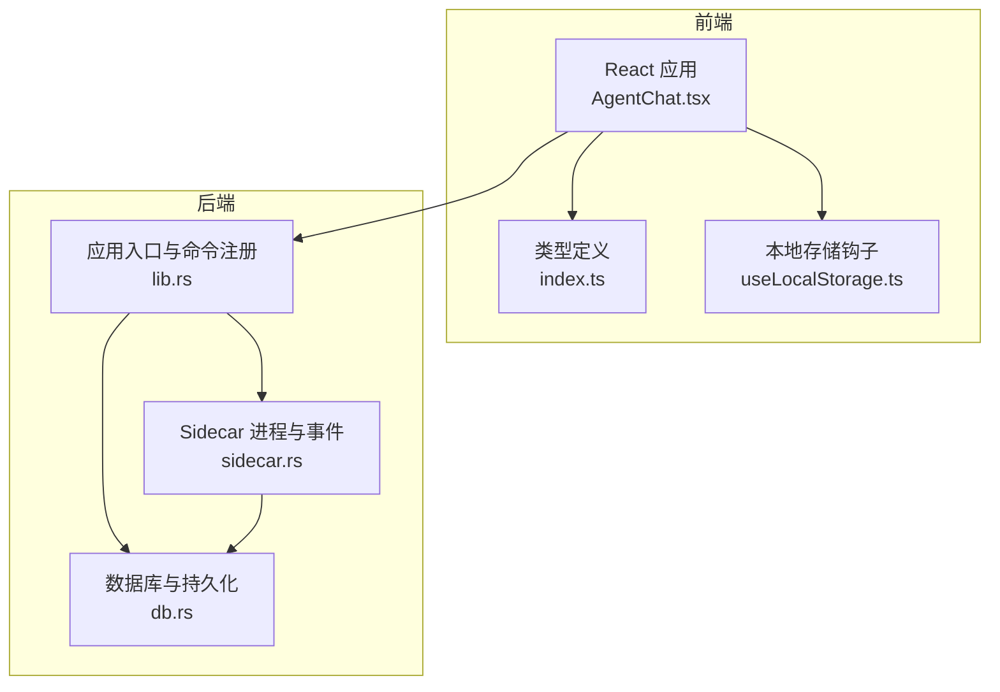
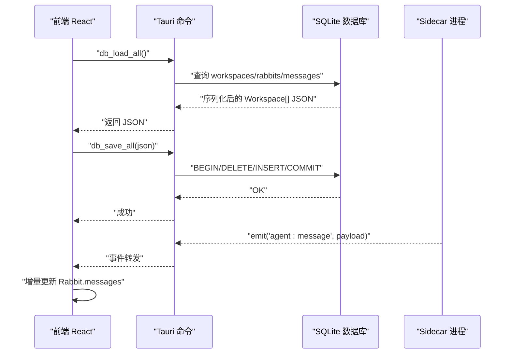
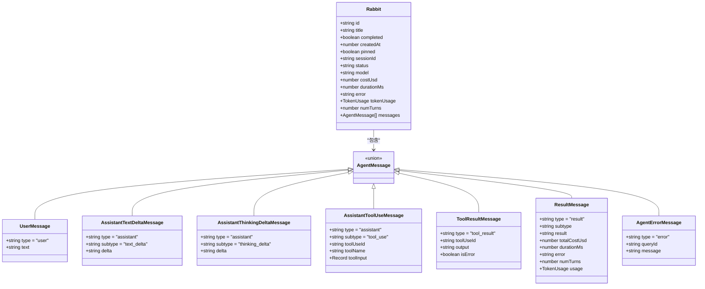
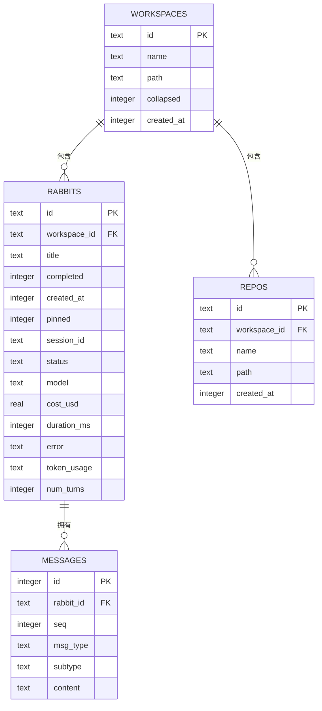
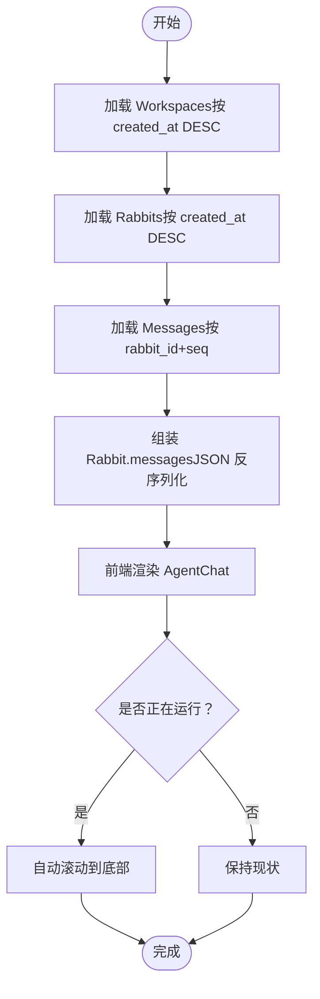
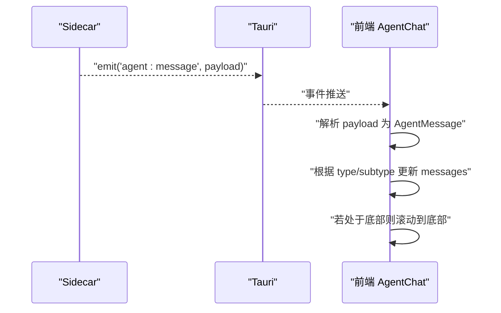
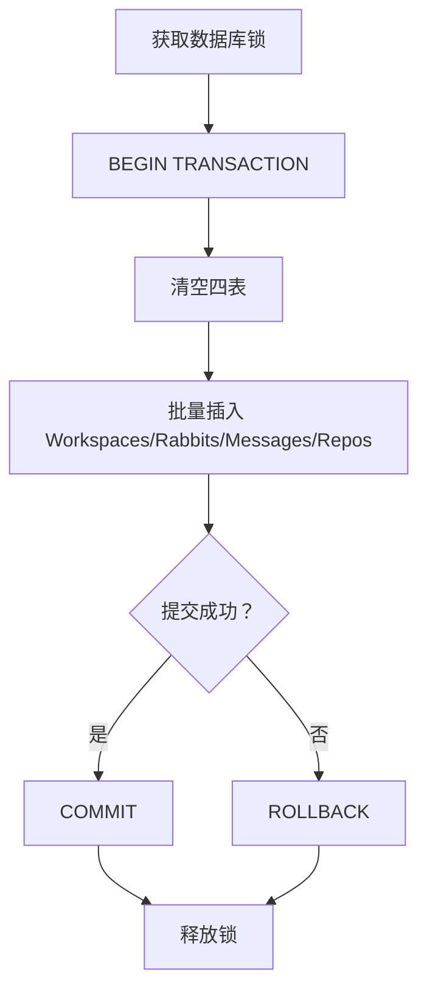
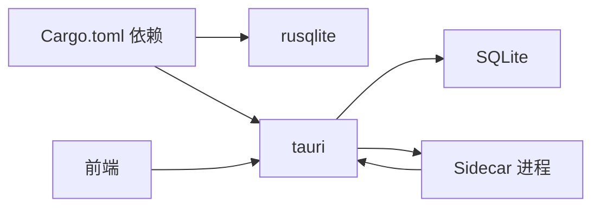

# 会话历史

<cite>
**本文引用的文件**
- [src-tauri/src/lib.rs](file://src-tauri/src/lib.rs)
- [src-tauri/src/db.rs](file://src-tauri/src/db.rs)
- [src-tauri/src/sidecar.rs](file://src-tauri/src/sidecar.rs)
- [src-tauri/Cargo.toml](file://src-tauri/Cargo.toml)
- [src/types/index.ts](file://src/types/index.ts)
- [src/components/agent/AgentChat.tsx](file://src/components/agent/AgentChat.tsx)
- [src/hooks/useLocalStorage.ts](file://src/hooks/useLocalStorage.ts)
</cite>

## 目录
1. [简介](#简介)
2. [项目结构](#项目结构)
3. [核心组件](#核心组件)
4. [架构总览](#架构总览)
5. [组件详解](#组件详解)
6. [依赖关系分析](#依赖关系分析)
7. [性能考量](#性能考量)
8. [故障排查指南](#故障排查指南)
9. [结论](#结论)
10. [附录](#附录)

## 简介
本文件面向 RabbitCoding 的“会话历史”能力，系统性阐述其数据结构、存储格式、检索机制、消息类型分类、状态管理与持久化策略，以及会话恢复、状态清理与内存优化、消息流式处理与增量更新、并发控制、查询接口与过滤排序规则，以及备份恢复与数据迁移方案。目标是帮助开发者与使用者全面理解并高效使用会话历史功能。

## 项目结构
围绕会话历史的关键模块分布如下：
- 后端（Tauri/Rust）
  - 数据库与持久化：src-tauri/src/db.rs
  - 应用入口与命令注册：src-tauri/src/lib.rs
  - Sidecar 进程与消息事件：src-tauri/src/sidecar.rs
  - 依赖声明：src-tauri/Cargo.toml
- 前端（React/TypeScript）
  - 类型定义（含消息类型与 Rabbit 结构）：src/types/index.ts
  - 会话渲染与流式处理：src/components/agent/AgentChat.tsx
  - 本地存储钩子：src/hooks/useLocalStorage.ts

**图表来源**
- [src-tauri/src/lib.rs:196-390](file://src-tauri/src/lib.rs#L196-L390)
- [src-tauri/src/db.rs:140-417](file://src-tauri/src/db.rs#L140-L417)
- [src-tauri/src/sidecar.rs:1-359](file://src-tauri/src/sidecar.rs#L1-L359)
- [src/types/index.ts:8-284](file://src/types/index.ts#L8-L284)
- [src/components/agent/AgentChat.tsx:1-215](file://src/components/agent/AgentChat.tsx#L1-L215)
- [src/hooks/useLocalStorage.ts:1-27](file://src/hooks/useLocalStorage.ts#L1-L27)

**章节来源**
- [src-tauri/src/lib.rs:196-390](file://src-tauri/src/lib.rs#L196-L390)
- [src-tauri/src/db.rs:140-417](file://src-tauri/src/db.rs#L140-L417)
- [src-tauri/src/sidecar.rs:1-359](file://src-tauri/src/sidecar.rs#L1-L359)
- [src/types/index.ts:8-284](file://src/types/index.ts#L8-L284)
- [src/components/agent/AgentChat.tsx:1-215](file://src/components/agent/AgentChat.tsx#L1-L215)
- [src/hooks/useLocalStorage.ts:1-27](file://src/hooks/useLocalStorage.ts#L1-L27)

## 核心组件
- 数据模型与消息类型
  - Rabbit：会话主体，包含标题、状态、消息数组、成本、时长、错误、Token 使用统计、回合数等。
  - AgentMessage：统一的前端消息类型集合，涵盖用户消息、系统初始化、文本/思考流式增量、工具调用、工具结果、最终结果、错误、Spec 生成/确认/写入、压缩状态/结果、用量更新、AskUserQuestion 等。
- 数据库模型
  - workspaces、rabbits、repos、messages 四表，采用 SQLite + rusqlite，WAL 模式、外键约束、索引优化。
  - messages 表按 rabbit_id+seq 排序，保证消息顺序与检索效率。
- 前端渲染与流式处理
  - AgentChat 负责消息分组、工具调用与结果关联、流式文本/思考的自动滚动与粘性布局。
- 后端命令与事件
  - db_load_all/db_save_all/db_has_data：全量加载/保存/检测数据存在。
  - sidecar.*：启动/停止/发送消息/查询状态，事件通过 emit 分发至前端。
- 本地存储降级
  - 当数据库初始化失败时，前端可降级使用 localStorage（由后端命令失败触发）。

**章节来源**
- [src/types/index.ts:8-284](file://src/types/index.ts#L8-L284)
- [src-tauri/src/db.rs:10-138](file://src-tauri/src/db.rs#L10-L138)
- [src/components/agent/AgentChat.tsx:32-85](file://src/components/agent/AgentChat.tsx#L32-L85)
- [src-tauri/src/lib.rs:344-387](file://src-tauri/src/lib.rs#L344-L387)
- [src-tauri/src/sidecar.rs:60-279](file://src-tauri/src/sidecar.rs#L60-L279)
- [src/hooks/useLocalStorage.ts:1-27](file://src/hooks/useLocalStorage.ts#L1-L27)

## 架构总览
会话历史贯穿“前端渲染 → 后端命令 → 数据库持久化 → Sidecar 事件”的闭环。前端通过 Tauri 命令与后端交互，后端负责数据库读写与 Sidecar 进程生命周期管理，消息事件经由 emit 推送到前端，前端据此增量更新 UI。

**图表来源**
- [src-tauri/src/db.rs:167-288](file://src-tauri/src/db.rs#L167-L288)
- [src-tauri/src/db.rs:290-386](file://src-tauri/src/db.rs#L290-L386)
- [src-tauri/src/lib.rs:344-387](file://src-tauri/src/lib.rs#L344-L387)
- [src-tauri/src/sidecar.rs:175-208](file://src-tauri/src/sidecar.rs#L175-L208)
- [src/components/agent/AgentChat.tsx:116-130](file://src/components/agent/AgentChat.tsx#L116-L130)

## 组件详解

### 数据模型与消息类型
- Rabbit 结构
  - 关键字段：id、title、completed、createdAt、pinned、sessionId、status、model、costUsd、durationMs、error、tokenUsage、numTurns、messages。
  - 与数据库 rabbits 表一一对应，messages 字段在加载时由 messages 表按 seq 顺序拼装。
- AgentMessage 类型体系
  - 覆盖用户输入、系统初始化、文本/思考流式增量、工具调用、工具结果、最终结果、错误、Spec 生成/确认/写入、压缩状态/结果、用量更新、AskUserQuestion 等。
  - Frontend 侧通过 type/subtype 区分不同消息形态，便于 UI 渲染与行为控制。

**图表来源**
- [src/types/index.ts:8-284](file://src/types/index.ts#L8-L284)

**章节来源**
- [src/types/index.ts:8-284](file://src/types/index.ts#L8-L284)

### 数据库设计与持久化策略
- 表结构与索引
  - workspaces：工作区基本信息。
  - rabbits：会话元数据与统计，外键关联 workspaces。
  - repos：工作区关联仓库。
  - messages：按 rabbit_id+seq 排序，存储 JSON 字符串形式的消息内容。
- 初始化与迁移
  - 首次打开数据库执行建表与 PRAGMA 设置。
  - 列迁移：向 rabbits 表添加 token_usage 与 num_turns 字段，兼容既有数据。
- 事务与一致性
  - 全量保存使用 BEGIN/COMMIT/ROLLBACK，确保原子性。
  - 全量加载按 created_at 顺序查询，前端按需渲染。
- 存储格式
  - messages.content 为 JSON 字符串，加载时反序列化为前端消息对象。
  - token_usage 作为 JSON 字符串存储，加载时转换为 TokenUsage 对象。

**图表来源**
- [src-tauri/src/db.rs:85-138](file://src-tauri/src/db.rs#L85-L138)

**章节来源**
- [src-tauri/src/db.rs:85-161](file://src-tauri/src/db.rs#L85-L161)
- [src-tauri/src/db.rs:167-288](file://src-tauri/src/db.rs#L167-L288)
- [src-tauri/src/db.rs:290-386](file://src-tauri/src/db.rs#L290-L386)

### 会话恢复与状态管理
- 会话恢复
  - db_load_all 按 created_at DESC 加载 workspaces，rabbits 按 created_at DESC，messages 按 seq ASC，保证渲染顺序正确。
  - Rabbit.status 与 error 字段用于前端展示运行态与错误态。
- 状态管理
  - Rabbit.status：idle/running/completed/error。
  - 压缩阶段：compactionPhase（compacting/done/failed）。
  - Token 统计：tokenUsage/currentUsage/numTurns。
- 前端渲染
  - AgentChat 根据 messages 构建分组，处理 tool_use 与 tool_result 的关联，识别最后一条流式消息，自动滚动到底部。

**图表来源**
- [src-tauri/src/db.rs:167-288](file://src-tauri/src/db.rs#L167-L288)
- [src/components/agent/AgentChat.tsx:97-130](file://src/components/agent/AgentChat.tsx#L97-L130)

**章节来源**
- [src-tauri/src/db.rs:167-288](file://src-tauri/src/db.rs#L167-L288)
- [src/components/agent/AgentChat.tsx:32-85](file://src/components/agent/AgentChat.tsx#L32-L85)
- [src/types/index.ts:8-32](file://src/types/index.ts#L8-L32)

### 消息流式处理与增量更新
- 流式增量
  - assistant.text_delta 与 assistant.thinking_delta 表示流式增量，前端逐条追加到当前消息末尾。
- 工具调用与结果
  - assistant.tool_use 与 tool_result 通过 toolUseId 关联，前端在消息组中进行配对展示。
- 自动滚动
  - 新消息到达或流式增量出现时，若用户处于底部，则自动滚动到底部，否则保持当前位置。

**图表来源**
- [src-tauri/src/sidecar.rs:175-208](file://src-tauri/src/sidecar.rs#L175-L208)
- [src/components/agent/AgentChat.tsx:97-130](file://src/components/agent/AgentChat.tsx#L97-L130)

**章节来源**
- [src-tauri/src/sidecar.rs:175-208](file://src-tauri/src/sidecar.rs#L175-L208)
- [src/components/agent/AgentChat.tsx:97-130](file://src/components/agent/AgentChat.tsx#L97-L130)

### 并发控制与一致性
- 数据库并发
  - 使用 Mutex 包裹 rusqlite 连接，命令执行前加锁，避免并发写冲突。
  - 全量保存使用事务，失败自动回滚，保证一致性。
- Sidecar 并发
  - 启动前检查已有进程状态，避免重复启动。
  - stdout/stderr 读取在独立线程中进行，避免阻塞主线程。

**图表来源**
- [src-tauri/src/db.rs:290-305](file://src-tauri/src/db.rs#L290-L305)
- [src-tauri/src/db.rs:307-386](file://src-tauri/src/db.rs#L307-L386)

**章节来源**
- [src-tauri/src/db.rs:290-305](file://src-tauri/src/db.rs#L290-L305)
- [src-tauri/src/db.rs:307-386](file://src-tauri/src/db.rs#L307-L386)
- [src-tauri/src/sidecar.rs:60-87](file://src-tauri/src/sidecar.rs#L60-L87)

### 查询接口、过滤条件与排序规则
- 查询接口
  - db_load_all：返回完整 Workspace[] JSON，包含 workspaces、rabbits、repos、messages。
  - db_has_data：判断数据库是否存在数据，用于迁移判断。
- 过滤与排序
  - workspaces/rabbits：按 created_at DESC。
  - messages：按 rabbit_id+seq 排序，保证顺序稳定。
- 前端过滤建议
  - 可基于 Rabbit.status、sessionId、model、createdAt 等字段在前端进行二次过滤与排序。

**章节来源**
- [src-tauri/src/db.rs:167-288](file://src-tauri/src/db.rs#L167-L288)
- [src-tauri/src/db.rs:408-416](file://src-tauri/src/db.rs#L408-L416)

### 备份恢复与数据迁移
- 备份
  - 数据库文件位于应用数据目录下的 rabbit.db，可直接复制该文件进行备份。
- 恢复
  - 将备份的 rabbit.db 替换到原位置，重启应用后 db_load_all 将自动加载。
- 迁移
  - 首次启动时执行建表与列迁移（token_usage、num_turns），兼容旧版本数据。
  - db_has_data 可用于判断是否需要迁移流程。

**章节来源**
- [src-tauri/src/lib.rs:212-221](file://src-tauri/src/lib.rs#L212-L221)
- [src-tauri/src/db.rs:140-161](file://src-tauri/src/db.rs#L140-L161)
- [src-tauri/src/db.rs:408-416](file://src-tauri/src/db.rs#L408-L416)

## 依赖关系分析
- Rust 依赖
  - rusqlite：SQLite 访问与 WAL 模式。
  - tauri：命令系统、插件生态、事件系统。
- 前端依赖
  - React：组件化渲染与状态管理。
  - lucide-react：图标。
- 事件与通信
  - Sidecar 通过 stdout 输出事件行，Tauri emit 到前端，前端基于事件增量更新。

**图表来源**
- [src-tauri/Cargo.toml:20-39](file://src-tauri/Cargo.toml#L20-L39)
- [src-tauri/src/lib.rs:196-390](file://src-tauri/src/lib.rs#L196-L390)
- [src-tauri/src/sidecar.rs:175-208](file://src-tauri/src/sidecar.rs#L175-L208)

**章节来源**
- [src-tauri/Cargo.toml:20-39](file://src-tauri/Cargo.toml#L20-L39)
- [src-tauri/src/lib.rs:196-390](file://src-tauri/src/lib.rs#L196-L390)
- [src-tauri/src/sidecar.rs:175-208](file://src-tauri/src/sidecar.rs#L175-L208)

## 性能考量
- 数据库性能
  - WAL 模式提升并发读写性能；外键与索引保障查询效率。
  - 全量保存使用事务，减少多次提交带来的开销。
- 前端渲染
  - 使用 useMemo 避免不必要的消息预处理；仅在 messages 变化时更新滚动状态。
  - 流式消息到达时才触发滚动，降低重排成本。
- Sidecar
  - stdout/stderr 异步读取，避免阻塞；进程复用减少启动开销。

[本节为通用性能建议，不直接分析具体文件]

## 故障排查指南
- 数据库初始化失败
  - 现象：db_* 命令失败，前端降级到 localStorage。
  - 处理：检查应用数据目录权限与磁盘空间，确认 rabbit.db 文件可读写。
- 会话历史为空
  - 现象：db_load_all 返回空或部分数据。
  - 处理：确认 db_has_data 返回值；检查 messages 表是否损坏；必要时重建数据库。
- 流式消息不显示
  - 现象：assistant.text_delta/assistant.thinking_delta 未在 UI 出现。
  - 处理：确认 Sidecar 正常运行；检查 Tauri 事件是否正常 emit；查看前端 AgentChat 的消息分组逻辑。
- 并发写入异常
  - 现象：db_save_all 报错或数据不一致。
  - 处理：确保同一时刻只有一个写入操作；检查事务是否正确提交或回滚。

**章节来源**
- [src-tauri/src/lib.rs:212-221](file://src-tauri/src/lib.rs#L212-L221)
- [src-tauri/src/db.rs:290-305](file://src-tauri/src/db.rs#L290-L305)
- [src-tauri/src/sidecar.rs:60-87](file://src-tauri/src/sidecar.rs#L60-L87)
- [src/components/agent/AgentChat.tsx:97-130](file://src/components/agent/AgentChat.tsx#L97-L130)

## 结论
RabbitCoding 的会话历史通过清晰的数据模型、可靠的数据库持久化、完善的事件驱动与前端增量渲染，实现了高可用的对话记录与展示。配合事务与并发控制、索引与排序策略，既满足了性能需求，也兼顾了扩展性与可维护性。建议在生产环境中定期备份 rabbit.db，并关注 Sidecar 与数据库的健康状态，以确保会话历史的完整性与稳定性。

[本节为总结性内容，不直接分析具体文件]

## 附录
- 术语
  - Rabbit：一次会话的抽象实体。
  - AgentMessage：会话中各类消息的统一类型。
  - 会话恢复：从数据库加载历史会话并渲染。
  - 增量更新：基于事件与消息流式更新 UI。
- 建议
  - 对大体量消息建议分页或虚拟滚动（前端层面）。
  - 对频繁写入场景可考虑批量写入策略（后端层面）。

[本节为补充说明，不直接分析具体文件]