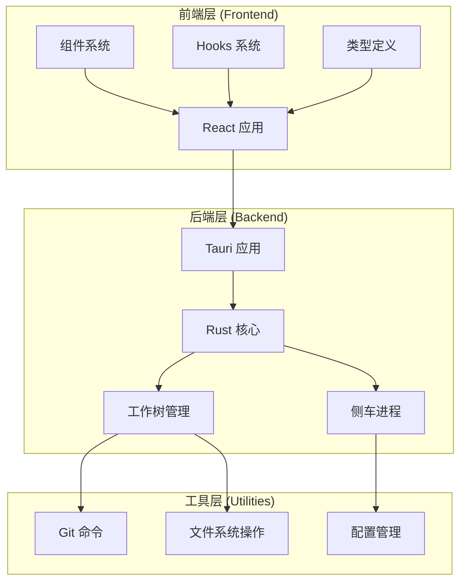
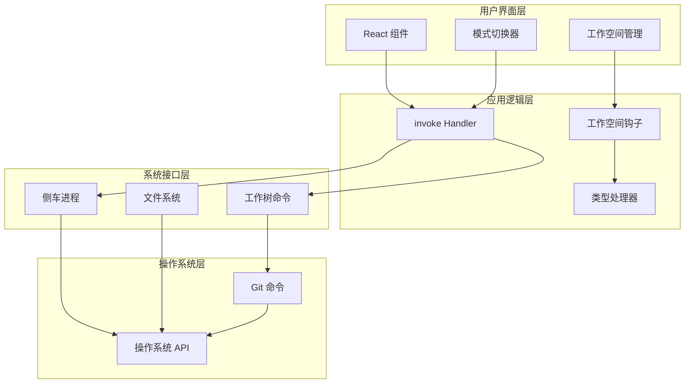
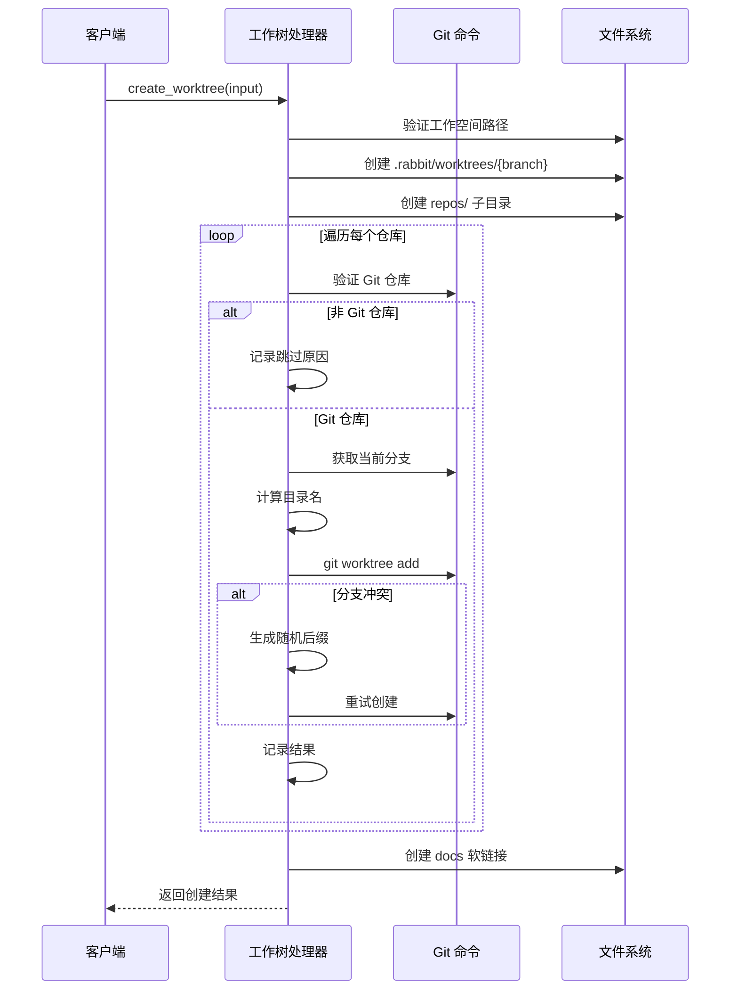
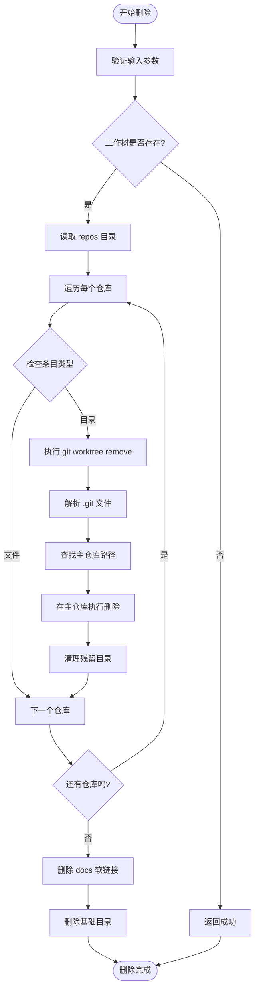
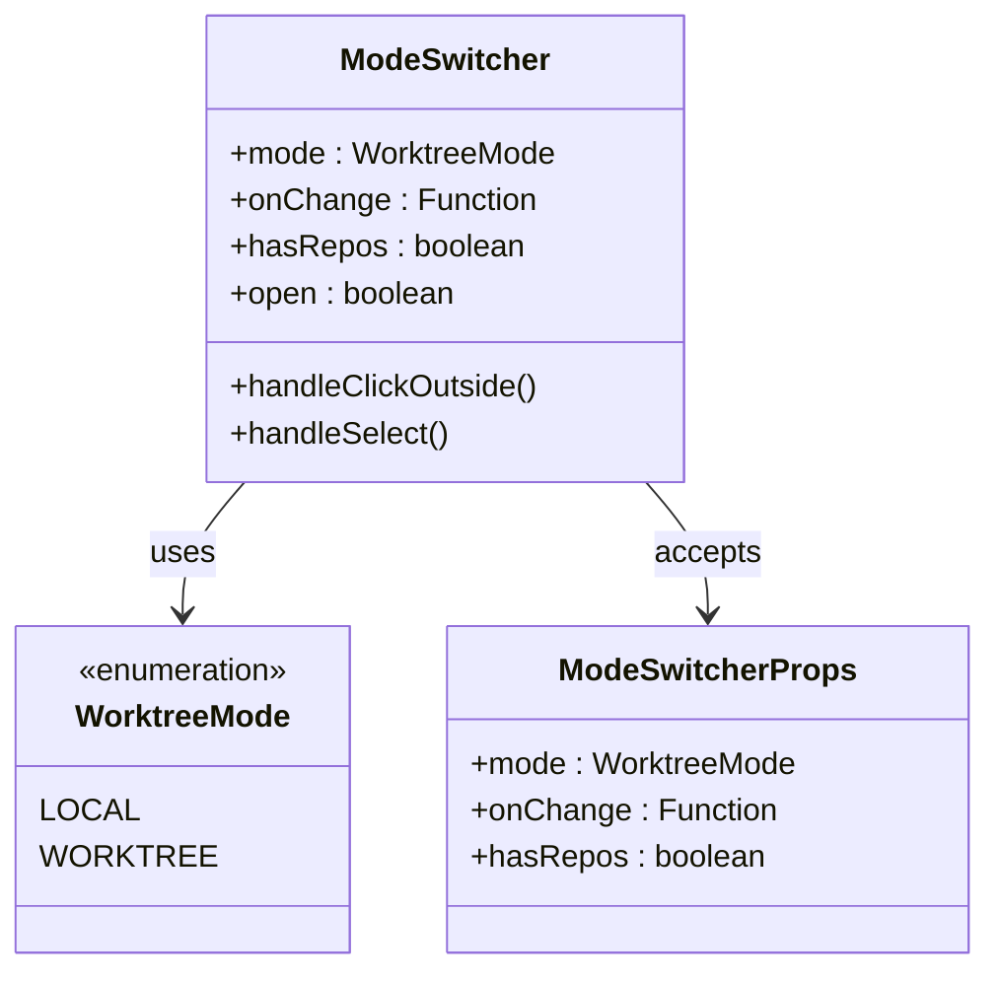
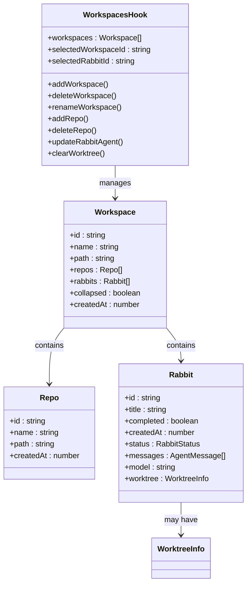

# 工作树隔离系统

<cite>
**本文档引用的文件**
- [worktree.rs](file://src-tauri/src/worktree.rs)
- [lib.rs](file://src-tauri/src/lib.rs)
- [main.rs](file://src-tauri/src/main.rs)
- [Cargo.toml](file://src-tauri/Cargo.toml)
- [ModeSwitcher.tsx](file://src/components/common/ModeSwitcher.tsx)
- [useWorkspaces.ts](file://src/hooks/useWorkspaces.ts)
- [index.ts](file://src/types/index.ts)
- [sidecar.rs](file://src-tauri/src/sidecar.rs)
- [package.json](file://package.json)
- [README.md](file://README.md)
</cite>

## 目录
1. [简介](#简介)
2. [项目结构](#项目结构)
3. [核心组件](#核心组件)
4. [架构概览](#架构概览)
5. [详细组件分析](#详细组件分析)
6. [依赖关系分析](#依赖关系分析)
7. [性能考虑](#性能考虑)
8. [故障排除指南](#故障排除指南)
9. [结论](#结论)

## 简介

工作树隔离系统是一个基于 Git Worktree 技术的代码隔离解决方案，旨在为开发者提供安全、独立的工作环境。该系统通过创建 Git 工作树镜像来实现代码隔离，确保不同项目或任务之间的代码不会相互影响。

系统采用 Tauri + React + TypeScript 技术栈构建，结合了 Rust 后端的强大功能和前端的用户友好界面。主要特性包括：

- **安全隔离**：通过 Git Worktree 实现真正的代码隔离
- **智能管理**：自动处理分支冲突和路径解析
- **跨平台支持**：支持 macOS、Windows 和 Linux 系统
- **无缝集成**：与现有的 Git 工作流程完美融合

## 项目结构

该项目采用模块化的组织方式，主要分为以下几个部分：



**图表来源**
- [lib.rs:1-800](file://src-tauri/src/lib.rs#L1-L800)
- [worktree.rs:1-414](file://src-tauri/src/worktree.rs#L1-L414)

**章节来源**
- [lib.rs:1-800](file://src-tauri/src/lib.rs#L1-L800)
- [worktree.rs:1-414](file://src-tauri/src/worktree.rs#L1-L414)

## 核心组件

### 工作树管理器 (Worktree Manager)

工作树管理器是系统的核心组件，负责创建、管理和删除 Git 工作树镜像。它提供了以下关键功能：

- **工作树创建**：为指定的仓库创建独立的工作树
- **路径解析**：智能处理仓库路径，确保正确的目录结构
- **冲突处理**：自动处理分支名称冲突
- **软链接管理**：创建 docs 目录的符号链接

### 模式切换器 (Mode Switcher)

模式切换器允许用户在本地模式和工作树模式之间切换：

- **本地模式**：直接访问原始仓库
- **工作树模式**：通过隔离的工作树访问代码
- **智能禁用**：当没有仓库时禁用工作树选项

### 工作空间钩子 (Workspace Hooks)

工作空间钩子管理系统中的工作空间和兔子（Rabbit）实体：

- **工作空间管理**：添加、删除、重命名工作空间
- **兔子管理**：管理 AI 助手实例
- **状态持久化**：提供本地存储和数据库两种持久化方案

**章节来源**
- [worktree.rs:163-280](file://src-tauri/src/worktree.rs#L163-L280)
- [ModeSwitcher.tsx:1-110](file://src/components/common/ModeSwitcher.tsx#L1-L110)
- [useWorkspaces.ts:28-676](file://src/hooks/useWorkspaces.ts#L28-L676)

## 架构概览

系统采用分层架构设计，确保各层之间的职责清晰分离：



**图表来源**
- [lib.rs:657-800](file://src-tauri/src/lib.rs#L657-L800)
- [worktree.rs:163-280](file://src-tauri/src/worktree.rs#L163-L280)
- [sidecar.rs:60-214](file://src-tauri/src/sidecar.rs#L60-L214)

## 详细组件分析

### 工作树创建流程

工作树创建过程是一个复杂的多步骤流程，涉及多个验证和处理阶段：



**图表来源**
- [worktree.rs:163-280](file://src-tauri/src/worktree.rs#L163-L280)

#### 关键处理逻辑

1. **路径验证**：确保工作空间路径有效且可访问
2. **目录结构**：创建必要的目录结构（`.rabbit/worktrees/{branch}/repos/`）
3. **仓库验证**：逐个验证每个仓库是否为有效的 Git 仓库
4. **分支管理**：处理分支名称冲突，自动生成唯一分支名
5. **软链接创建**：为 docs 目录创建符号链接

**章节来源**
- [worktree.rs:163-280](file://src-tauri/src/worktree.rs#L163-L280)

### 工作树删除流程

工作树删除流程需要谨慎处理，确保不会破坏主仓库：



**图表来源**
- [worktree.rs:282-360](file://src-tauri/src/worktree.rs#L282-L360)

#### 删除策略

1. **安全检查**：首先验证工作树是否存在
2. **仓库遍历**：遍历所有仓库目录，逐一删除
3. **主仓库定位**：从 `.git` 文件中解析主仓库路径
4. **优雅删除**：先尝试 `git worktree remove --force`，然后清理残留
5. **资源清理**：删除软链接和基础目录

**章节来源**
- [worktree.rs:282-360](file://src-tauri/src/worktree.rs#L282-L360)

### 模式切换机制

模式切换器实现了智能的模式管理：



**图表来源**
- [ModeSwitcher.tsx:5-12](file://src/components/common/ModeSwitcher.tsx#L5-L12)

#### 模式管理逻辑

1. **状态管理**：维护当前模式和下拉菜单状态
2. **选项控制**：根据是否有仓库动态启用/禁用工作树选项
3. **事件处理**：处理用户交互和外部状态变化
4. **国际化支持**：支持多语言标签显示

**章节来源**
- [ModeSwitcher.tsx:14-110](file://src/components/common/ModeSwitcher.tsx#L14-L110)

### 工作空间管理系统

工作空间管理系统提供了完整的项目管理功能：



**图表来源**
- [useWorkspaces.ts:28-676](file://src/hooks/useWorkspaces.ts#L28-L676)
- [index.ts:1-48](file://src/types/index.ts#L1-L48)

#### 核心功能

1. **数据持久化**：支持 SQLite 和 localStorage 双重持久化
2. **状态同步**：实时同步工作空间和兔子的状态
3. **防抖机制**：优化频繁状态变更的性能
4. **类型安全**：提供完整的 TypeScript 类型定义

**章节来源**
- [useWorkspaces.ts:28-676](file://src/hooks/useWorkspaces.ts#L28-L676)
- [index.ts:1-48](file://src/types/index.ts#L1-L48)

## 依赖关系分析

系统依赖关系复杂但结构清晰，主要依赖包括：

```mermaid
graph LR
subgraph "核心依赖"
TAURI[tauri ^2]
SERDE[serde ^1]
TOKIO[tokio ^1]
end
subgraph "前端依赖"
REACT[react ^19]
TS[typescript ~5.8]
VITE[vite ^7]
end
subgraph "工具依赖"
PNPM[pnpm ^11.5]
ESLINT[eslint]
PRETTIER[prettier]
end
subgraph "开发依赖"
TSC[typescript compiler]
VITE_PLUGIN[@vitejs/plugin-react]
TAURI_CLI[@tauri-apps/cli ^2]
end
TAURI --> SERDE
TAURI --> TOKIO
REACT --> TS
VITE --> TS
PNPM --> TSC
ESLINT --> TS
PRETTIER --> TS
```

**图表来源**
- [Cargo.toml:20-41](file://src-tauri/Cargo.toml#L20-L41)
- [package.json:14-46](file://package.json#L14-L46)

### 外部依赖

1. **Git 命令**：系统依赖系统级 Git 安装
2. **操作系统 API**：不同平台的特定功能支持
3. **文件系统**：跨平台文件操作能力
4. **网络通信**：HTTP 请求和 WebSocket 连接

**章节来源**
- [Cargo.toml:20-41](file://src-tauri/Cargo.toml#L20-L41)
- [package.json:14-46](file://package.json#L14-L46)

## 性能考虑

系统在设计时充分考虑了性能优化：

### 内存管理
- **懒加载**：组件按需加载，减少初始内存占用
- **状态缓存**：使用 useRef 缓存工作空间数据
- **防抖机制**：500ms 防抖延迟优化频繁状态变更

### I/O 优化
- **批量操作**：工作空间数据批量保存
- **异步处理**：所有文件系统操作都是异步的
- **缓存策略**：合理利用浏览器缓存

### 并发处理
- **Tokio 运行时**：使用多线程运行时提高并发性能
- **异步 I/O**：Git 命令和文件操作都是异步的
- **线程池**：合理的线程池配置

## 故障排除指南

### 常见问题及解决方案

#### 工作树创建失败
**症状**：创建工作树时报错
**可能原因**：
- Git 仓库无效
- 分支名称冲突
- 权限不足

**解决方案**：
1. 验证 Git 仓库有效性
2. 检查分支名称是否已被使用
3. 确认有足够的文件系统权限

#### 工作树删除异常
**症状**：删除工作树时出现残留文件
**可能原因**：
- 工作树仍处于活动状态
- 权限不足
- 文件被其他进程占用

**解决方案**：
1. 确保工作树不再被使用
2. 以管理员权限运行
3. 关闭占用文件的进程

#### 模式切换失效
**症状**：工作树模式无法切换
**可能原因**：
- 没有配置任何仓库
- 前端状态不同步

**解决方案**：
1. 添加至少一个仓库
2. 刷新页面确保状态同步

**章节来源**
- [worktree.rs:190-266](file://src-tauri/src/worktree.rs#L190-L266)
- [ModeSwitcher.tsx:36-49](file://src/components/common/ModeSwitcher.tsx#L36-L49)

## 结论

工作树隔离系统是一个设计精良的代码隔离解决方案，具有以下优势：

1. **技术先进性**：基于 Git Worktree 技术，提供真正的代码隔离
2. **用户体验**：直观的界面和流畅的操作体验
3. **可靠性**：完善的错误处理和故障恢复机制
4. **扩展性**：模块化设计便于功能扩展

系统通过精心设计的架构和实现，成功地解决了代码隔离这一复杂问题，为开发者提供了一个强大而易用的工具。未来可以考虑增加更多高级功能，如工作树模板、批量操作等，进一步提升用户体验。