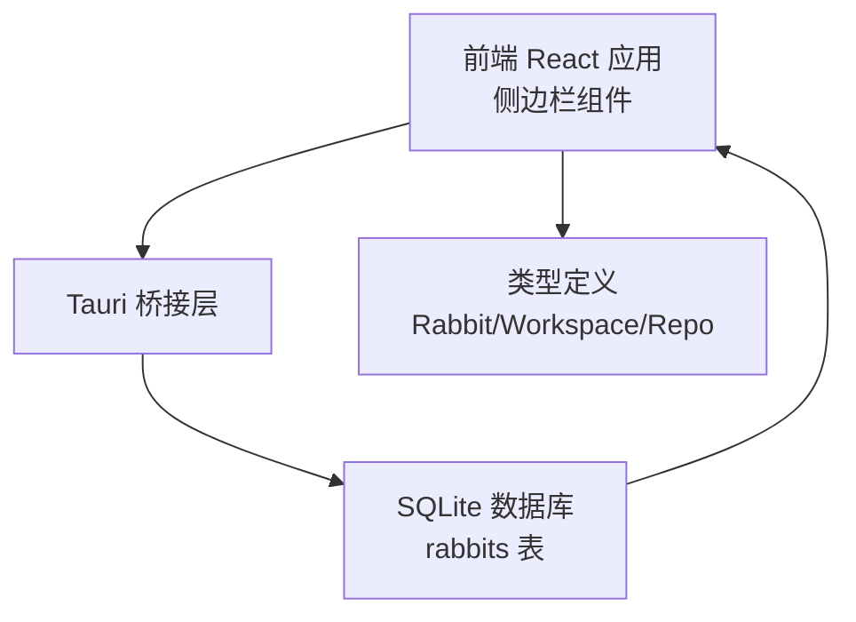
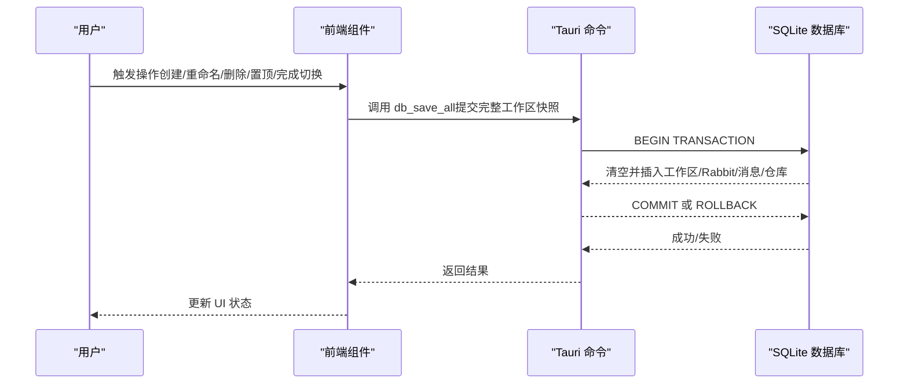
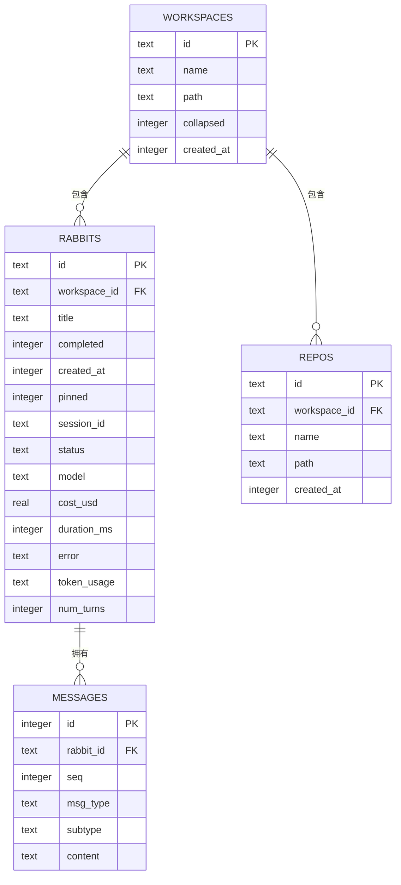
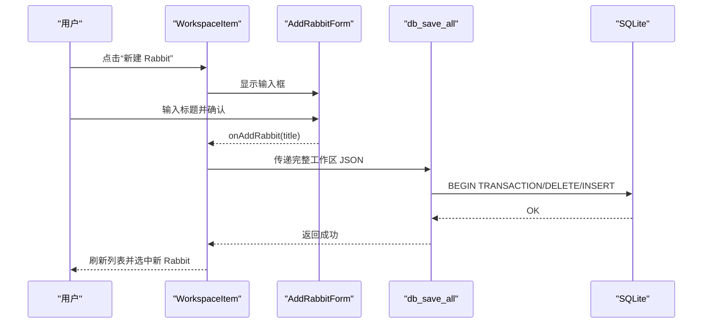
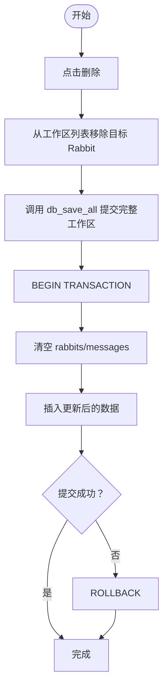
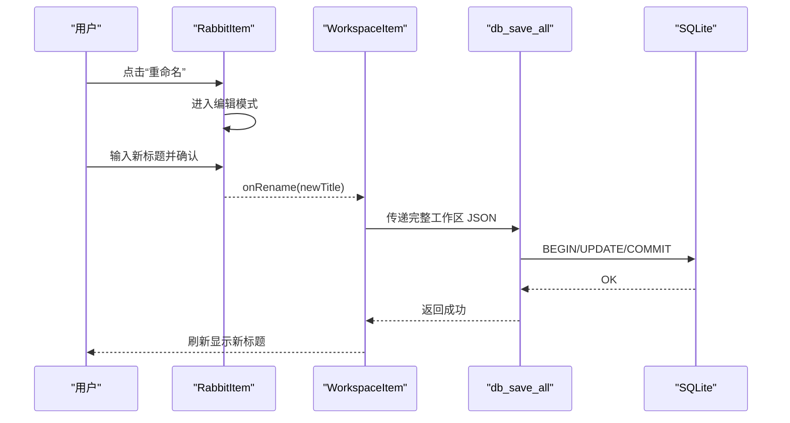
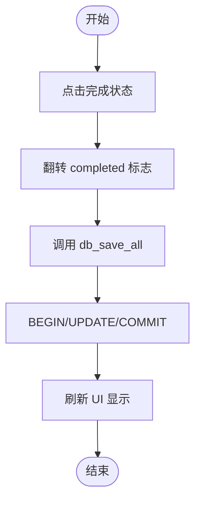
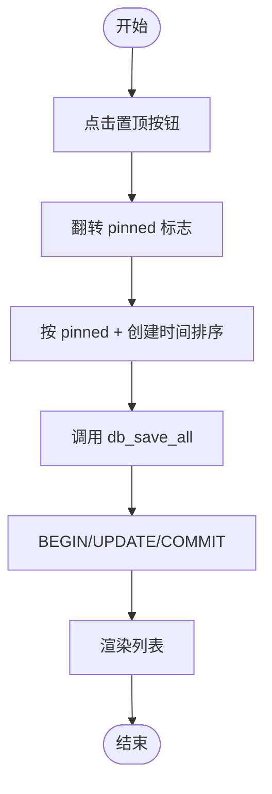
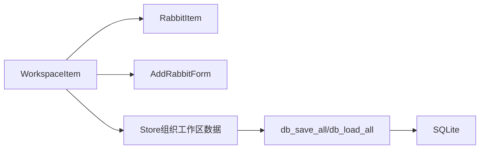

# Rabbit 管理操作

<cite>
**本文档引用的文件**
- [src-tauri/src/db.rs](file://src-tauri/src/db.rs)
- [src-tauri/src/lib.rs](file://src-tauri/src/lib.rs)
- [src/components/sidebar/AddRabbitForm.tsx](file://src/components/sidebar/AddRabbitForm.tsx)
- [src/components/sidebar/RabbitItem.tsx](file://src/components/sidebar/RabbitItem.tsx)
- [src/components/sidebar/WorkspaceItem.tsx](file://src/components/sidebar/WorkspaceItem.tsx)
- [src/types/index.ts](file://src/types/index.ts)
- [src-tauri/src/main.rs](file://src-tauri/src/main.rs)
</cite>

## 目录
1. [简介](#简介)
2. [项目结构](#项目结构)
3. [核心组件](#核心组件)
4. [架构总览](#架构总览)
5. [详细组件分析](#详细组件分析)
6. [依赖关系分析](#依赖关系分析)
7. [性能考虑](#性能考虑)
8. [故障排除指南](#故障排除指南)
9. [结论](#结论)

## 简介
本指南围绕 Rabbit（会话/任务）管理操作进行系统性说明，涵盖创建(addRabbit)、删除(deleteRabbit)、重命名(renameRabbit)、完成状态切换(toggleRabbitComplete)和置顶(pin)等核心功能。文档从数据模型、状态管理、持久化机制、前后端交互流程、依赖关系与约束条件、性能优化与故障排除等方面展开，帮助开发者与使用者准确理解并高效使用该能力。

## 项目结构
- 前端采用 React + TypeScript，侧边栏组件负责用户交互与状态展示。
- 后端基于 Tauri + Rust，使用 SQLite 存储工作区、Rabbit、仓库与消息等数据。
- 数据模型在前端与后端保持一致的驼峰命名风格，确保跨语言序列化/反序列化顺畅。

图表来源
- [src-tauri/src/db.rs:98-138](file://src-tauri/src/db.rs#L98-L138)
- [src-tauri/src/lib.rs:522-566](file://src-tauri/src/lib.rs#L522-L566)
- [src/types/index.ts:8-42](file://src/types/index.ts#L8-L42)

章节来源
- [src-tauri/src/db.rs:98-138](file://src-tauri/src/db.rs#L98-L138)
- [src-tauri/src/lib.rs:522-566](file://src-tauri/src/lib.rs#L522-L566)
- [src/types/index.ts:8-42](file://src/types/index.ts#L8-L42)

## 核心组件
- 数据模型
  - Rabbit：包含唯一标识、标题、完成状态、创建时间、置顶标记、会话 ID、状态、模型、费用、耗时、错误、令牌用量、轮次、消息列表等字段。
  - Workspace：包含工作区基本信息与 Rabbit/仓库列表。
  - Repo：仓库信息。
- 前端组件
  - AddRabbitForm：输入标题并触发创建。
  - RabbitItem：渲染单个 Rabbit，支持重命名、删除、置顶、完成状态切换、更多菜单等。
  - WorkspaceItem：组织工作区与 Rabbit 列表，控制折叠/展开与批量操作。
- 后端命令
  - db_load_all：加载全部数据（工作区、Rabbit、仓库、消息）。
  - db_save_all：接收完整 JSON，事务性全量替换。
  - db_has_data：检查数据库是否已有数据，用于迁移判断。

章节来源
- [src/types/index.ts:8-42](file://src/types/index.ts#L8-L42)
- [src-tauri/src/db.rs:25-74](file://src-tauri/src/db.rs#L25-L74)
- [src-tauri/src/db.rs:392-416](file://src-tauri/src/db.rs#L392-L416)
- [src/components/sidebar/AddRabbitForm.tsx:1-47](file://src/components/sidebar/AddRabbitForm.tsx#L1-L47)
- [src/components/sidebar/RabbitItem.tsx:1-179](file://src/components/sidebar/RabbitItem.tsx#L1-L179)
- [src/components/sidebar/WorkspaceItem.tsx:1-311](file://src/components/sidebar/WorkspaceItem.tsx#L1-L311)

## 架构总览
Rabbit 管理操作遵循“前端 UI 事件 → Tauri 命令 → SQLite 数据持久化”的闭环。前端通过命令与后端通信，后端以事务方式保证一致性，数据模型在两端对齐，确保状态变更可靠落地。

图表来源
- [src-tauri/src/db.rs:290-386](file://src-tauri/src/db.rs#L290-L386)
- [src-tauri/src/db.rs:399-406](file://src-tauri/src/db.rs#L399-L406)
- [src-tauri/src/lib.rs:522-566](file://src-tauri/src/lib.rs#L522-L566)

## 详细组件分析

### 数据模型与持久化
- 表结构要点
  - rabbits 表：主键 id，外键 workspace_id，字段包含完成状态、置顶、会话 ID、状态、模型、费用、耗时、错误、令牌用量、轮次等。
  - messages 表：按 rabbit_id 和 seq 排序，存储消息内容。
  - 索引：rabbits/workspace_id、repos/workspace_id、messages(rabbit_id, seq)。
- 序列化/反序列化
  - 前端与后端均使用 camelCase 字段名，RabbitData 中的 token_usage 字段以 JSON 字符串形式存储，加载时解析为对象。
- 事务与一致性
  - db_save_all 以事务包裹，先清空四表，再批量插入，保证原子性；失败则回滚。

图表来源
- [src-tauri/src/db.rs:98-138](file://src-tauri/src/db.rs#L98-L138)
- [src-tauri/src/db.rs:25-74](file://src-tauri/src/db.rs#L25-L74)

章节来源
- [src-tauri/src/db.rs:98-138](file://src-tauri/src/db.rs#L98-L138)
- [src-tauri/src/db.rs:25-74](file://src-tauri/src/db.rs#L25-L74)
- [src-tauri/src/db.rs:290-386](file://src-tauri/src/db.rs#L290-L386)

### 创建 Rabbit（addRabbit）
- 前端流程
  - 用户在工作区展开状态下点击“新建 Rabbit”，触发 AddRabbitForm 输入标题。
  - Enter 或失焦时调用 onAddRabbit，向 Store 层提交创建请求。
- 后端流程
  - Store 将完整工作区数据通过 db_save_all 提交至后端。
  - 后端以事务方式插入新的 Rabbit 记录及其消息（初始为空）。
- 约束与边界
  - 标题非空校验由前端完成；后端以事务保证新增记录一致性。
  - 新 Rabbit 的 created_at 由后端写入，status 默认 idle。

图表来源
- [src/components/sidebar/WorkspaceItem.tsx:231-236](file://src/components/sidebar/WorkspaceItem.tsx#L231-L236)
- [src/components/sidebar/AddRabbitForm.tsx:13-31](file://src/components/sidebar/AddRabbitForm.tsx#L13-L31)
- [src-tauri/src/db.rs:399-406](file://src-tauri/src/db.rs#L399-L406)
- [src-tauri/src/db.rs:307-386](file://src-tauri/src/db.rs#L307-L386)

章节来源
- [src/components/sidebar/WorkspaceItem.tsx:231-236](file://src/components/sidebar/WorkspaceItem.tsx#L231-L236)
- [src/components/sidebar/AddRabbitForm.tsx:13-31](file://src/components/sidebar/AddRabbitForm.tsx#L13-L31)
- [src-tauri/src/db.rs:399-406](file://src-tauri/src/db.rs#L399-L406)
- [src-tauri/src/db.rs:307-386](file://src-tauri/src/db.rs#L307-L386)

### 删除 Rabbit（deleteRabbit）
- 前端流程
  - 在 RabbitItem 更多菜单中选择“删除”，触发 onDelete。
  - WorkspaceItem 收集当前工作区的 Rabbit 列表，移除目标 Rabbit 后重新渲染。
- 后端流程
  - Store 将更新后的完整工作区 JSON 通过 db_save_all 提交。
  - 后端删除对应 rabbits 记录，由于外键约束（CASCADE），关联 messages 也会被清理。
- 约束与边界
  - 删除操作通过事务保证一致性；消息表依赖外键级联删除，避免脏数据。

图表来源
- [src/components/sidebar/WorkspaceItem.tsx:246](file://src/components/sidebar/WorkspaceItem.tsx#L246)
- [src-tauri/src/db.rs:399-406](file://src-tauri/src/db.rs#L399-L406)
- [src-tauri/src/db.rs:307-386](file://src-tauri/src/db.rs#L307-L386)

章节来源
- [src/components/sidebar/WorkspaceItem.tsx:246](file://src/components/sidebar/WorkspaceItem.tsx#L246)
- [src-tauri/src/db.rs:399-406](file://src-tauri/src/db.rs#L399-L406)
- [src-tauri/src/db.rs:307-386](file://src-tauri/src/db.rs#L307-L386)

### 重命名 Rabbit（renameRabbit）
- 前端流程
  - 在 RabbitItem 更多菜单中选择“重命名”，进入编辑模式。
  - Enter 或失焦时，若标题非空则调用 onRename，否则取消编辑。
- 后端流程
  - Store 将更新后的完整工作区 JSON 通过 db_save_all 提交。
  - 后端更新对应 rabbits.title 字段。
- 约束与边界
  - 标题非空校验在前端完成；后端以事务保证更新原子性。

图表来源
- [src/components/sidebar/RabbitItem.tsx:47-68](file://src/components/sidebar/RabbitItem.tsx#L47-L68)
- [src/components/sidebar/WorkspaceItem.tsx:245](file://src/components/sidebar/WorkspaceItem.tsx#L245)
- [src-tauri/src/db.rs:399-406](file://src-tauri/src/db.rs#L399-L406)

章节来源
- [src/components/sidebar/RabbitItem.tsx:47-68](file://src/components/sidebar/RabbitItem.tsx#L47-L68)
- [src/components/sidebar/WorkspaceItem.tsx:245](file://src/components/sidebar/WorkspaceItem.tsx#L245)
- [src-tauri/src/db.rs:399-406](file://src-tauri/src/db.rs#L399-L406)

### 完成状态切换（toggleRabbitComplete）
- 前端流程
  - 在 RabbitItem 中点击完成状态指示，触发 onToggleComplete。
  - WorkspaceItem 收集当前工作区的 Rabbit 列表，翻转目标 Rabbit.completed 后重新渲染。
- 后端流程
  - Store 将更新后的完整工作区 JSON 通过 db_save_all 提交。
  - 后端更新对应 rabbits.completed 字段。
- 约束与边界
  - 状态翻转仅影响 completed 字段；不影响其他元数据。

图表来源
- [src/components/sidebar/WorkspaceItem.tsx:244](file://src/components/sidebar/WorkspaceItem.tsx#L244)
- [src-tauri/src/db.rs:399-406](file://src-tauri/src/db.rs#L399-L406)

章节来源
- [src/components/sidebar/WorkspaceItem.tsx:244](file://src/components/sidebar/WorkspaceItem.tsx#L244)
- [src-tauri/src/db.rs:399-406](file://src-tauri/src/db.rs#L399-L406)

### 置顶（pin）
- 前端流程
  - 在 RabbitItem 中点击置顶按钮或更多菜单中的“置顶/取消置顶”，触发 onTogglePin。
  - WorkspaceItem 收集当前工作区的 Rabbit 列表，翻转目标 Rabbit.pinned 后重新渲染。
  - 列表排序规则：pinned 优先，其次按创建时间倒序。
- 后端流程
  - Store 将更新后的完整工作区 JSON 通过 db_save_all 提交。
  - 后端更新对应 rabbits.pinned 字段。
- 约束与边界
  - pinned 为可选布尔值（None/Some(true)），前端 UI 会根据该值决定视觉样式与排序位置。

图表来源
- [src/components/sidebar/RabbitItem.tsx:70-73](file://src/components/sidebar/RabbitItem.tsx#L70-L73)
- [src/components/sidebar/WorkspaceItem.tsx:155-160](file://src/components/sidebar/WorkspaceItem.tsx#L155-L160)
- [src-tauri/src/db.rs:399-406](file://src-tauri/src/db.rs#L399-L406)

章节来源
- [src/components/sidebar/RabbitItem.tsx:70-73](file://src/components/sidebar/RabbitItem.tsx#L70-L73)
- [src/components/sidebar/WorkspaceItem.tsx:155-160](file://src/components/sidebar/WorkspaceItem.tsx#L155-L160)
- [src-tauri/src/db.rs:399-406](file://src-tauri/src/db.rs#L399-L406)

## 依赖关系分析
- 组件耦合
  - WorkspaceItem 作为容器，向下传递操作回调（添加、重命名、删除、完成切换、置顶）。
  - RabbitItem 仅负责单个 Rabbit 的 UI 与交互，不直接访问数据库。
- 数据流
  - 前端通过 Store 组织工作区数据，最终以完整 JSON 形式提交到后端。
  - 后端以事务方式写入，确保一致性。
- 外部依赖
  - Tauri 命令注册与生命周期管理。
  - SQLite 索引与外键约束保障查询效率与数据完整性。

图表来源
- [src/components/sidebar/WorkspaceItem.tsx:237-251](file://src/components/sidebar/WorkspaceItem.tsx#L237-L251)
- [src/components/sidebar/RabbitItem.tsx:1-179](file://src/components/sidebar/RabbitItem.tsx#L1-L179)
- [src/components/sidebar/AddRabbitForm.tsx:1-47](file://src/components/sidebar/AddRabbitForm.tsx#L1-L47)
- [src-tauri/src/lib.rs:522-566](file://src-tauri/src/lib.rs#L522-L566)

章节来源
- [src/components/sidebar/WorkspaceItem.tsx:237-251](file://src/components/sidebar/WorkspaceItem.tsx#L237-L251)
- [src-tauri/src/lib.rs:522-566](file://src-tauri/src/lib.rs#L522-L566)

## 性能考虑
- 事务批处理
  - db_save_all 以事务包裹，减少多次往返带来的锁竞争与 IO 开销。
- 索引优化
  - rabbits/workspace_id、messages(rabbit_id, seq) 等索引有助于快速定位与排序。
- 序列化成本
  - 完整 JSON 提交简化了协议复杂度，但会带来序列化/反序列化开销；对于大规模数据可考虑增量更新策略。
- 前端渲染
  - 列表截断（最多展示若干项）与排序（pinned 优先）降低渲染压力。
- I/O 参数
  - SQLite PRAGMA 设置（WAL、foreign_keys、synchronous）提升并发与可靠性。

章节来源
- [src-tauri/src/db.rs:140-161](file://src-tauri/src/db.rs#L140-L161)
- [src-tauri/src/db.rs:135-138](file://src-tauri/src/db.rs#L135-L138)
- [src/components/sidebar/WorkspaceItem.tsx:155-160](file://src/components/sidebar/WorkspaceItem.tsx#L155-L160)

## 故障排除指南
- 数据库初始化失败
  - 现象：应用启动后 db_* 命令失败，前端降级到本地存储。
  - 排查：检查应用数据目录与 rabbit.db 文件权限；确认 Schema 初始化 SQL 正常执行。
- 事务回滚
  - 现象：提交后未生效或报错。
  - 排查：确认 JSON 结构与字段类型正确；检查外键约束是否满足；查看后端日志定位具体失败语句。
- 消息缺失
  - 现象：Rabbit 列表显示为空消息。
  - 排查：确认 messages 表按 rabbit_id+seq 排序；检查序列化/反序列化过程是否异常。
- 状态不同步
  - 现象：UI 与数据库状态不一致。
  - 排查：确认前端在操作后立即调用 db_save_all；避免并发修改导致的竞态。

章节来源
- [src-tauri/src/lib.rs:390-400](file://src-tauri/src/lib.rs#L390-L400)
- [src-tauri/src/db.rs:290-305](file://src-tauri/src/db.rs#L290-L305)
- [src-tauri/src/db.rs:232-254](file://src-tauri/src/db.rs#L232-L254)

## 结论
Rabbit 管理操作通过“前端事件驱动 + Tauri 命令 + SQLite 事务”的架构实现了高一致性与易用性。创建、删除、重命名、完成状态切换与置顶等操作均以完整工作区快照提交，确保数据一致性与可恢复性。结合索引与排序策略，可在较大规模数据下保持良好性能。建议在后续版本中探索增量更新与更细粒度的状态同步，进一步降低序列化成本与并发冲突风险。