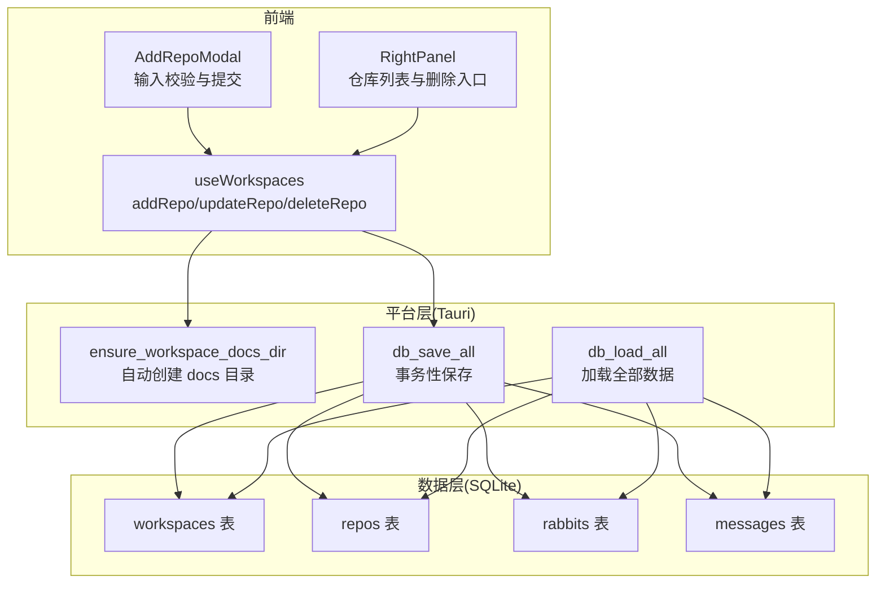
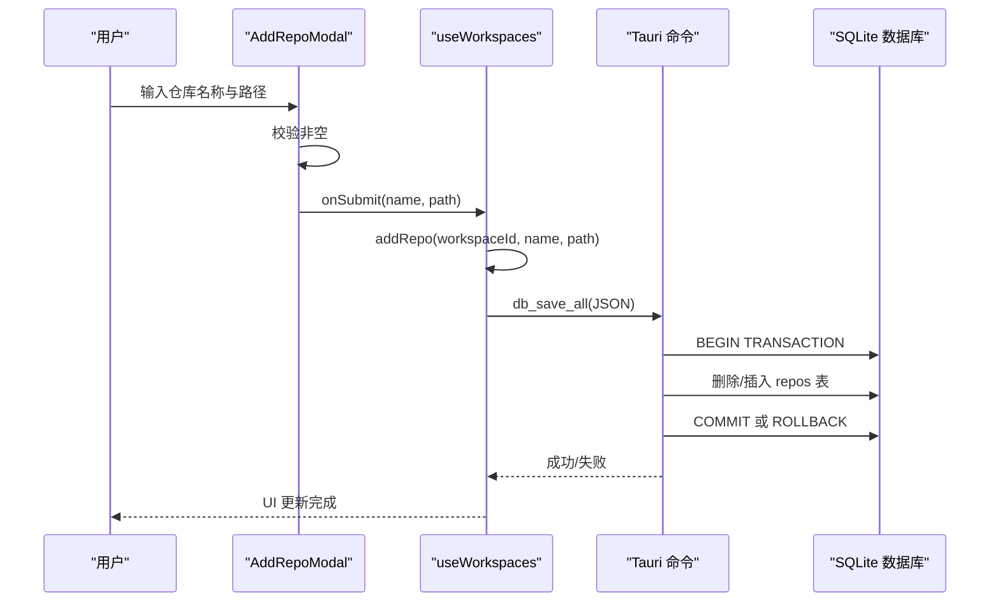
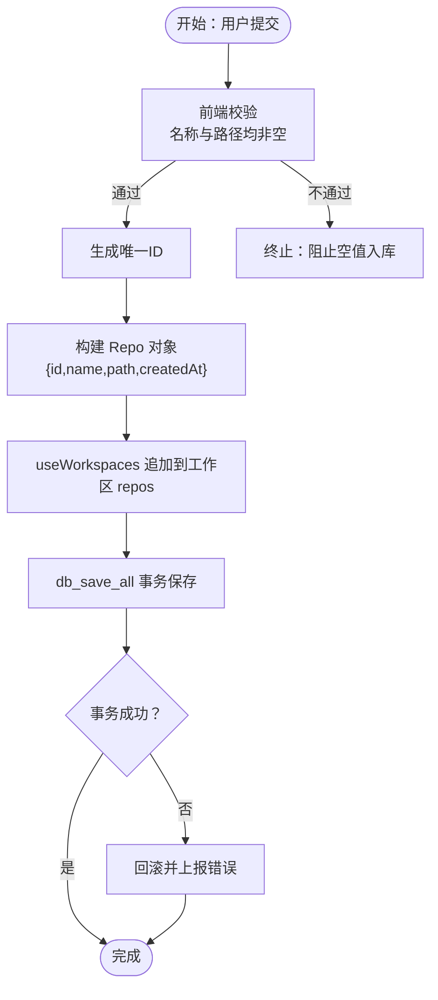
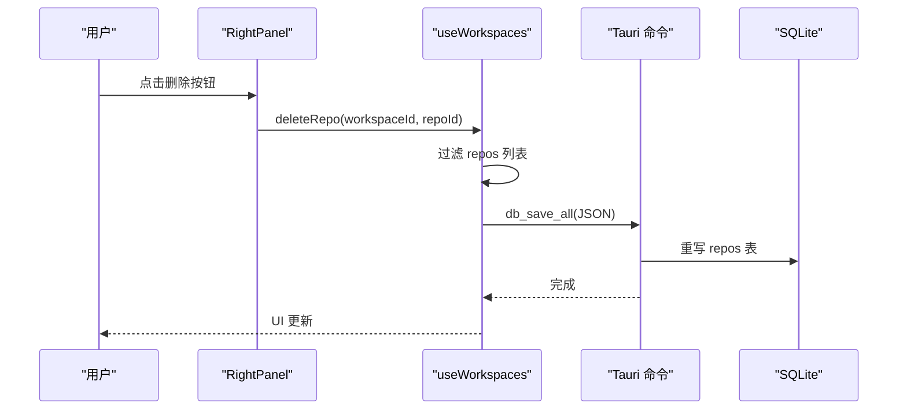
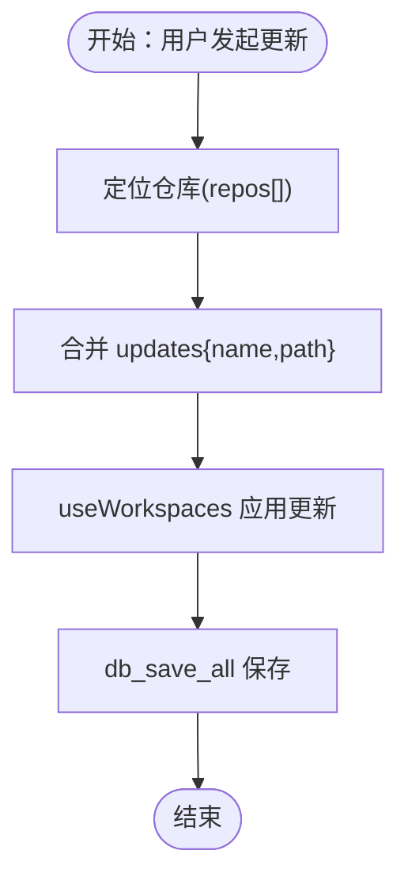
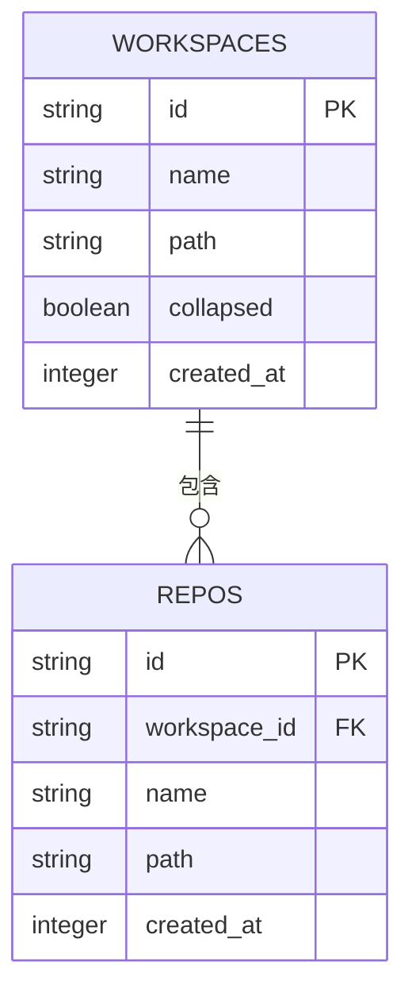
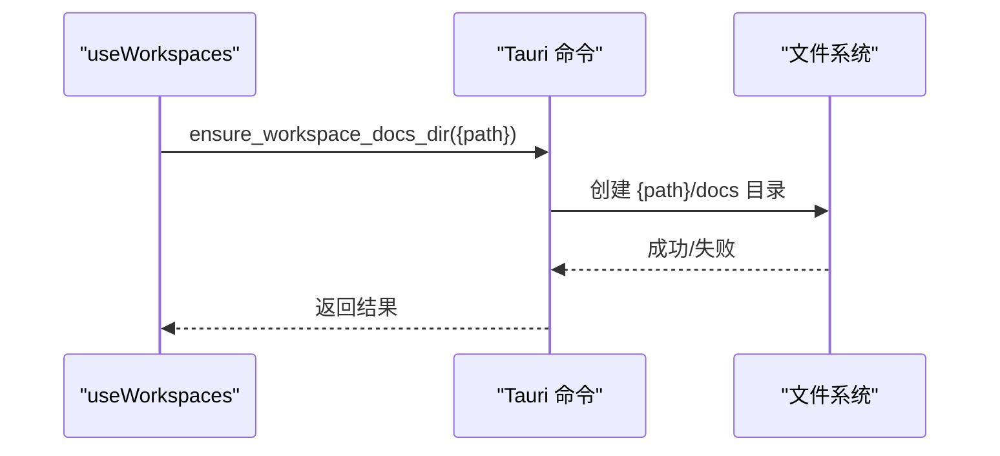
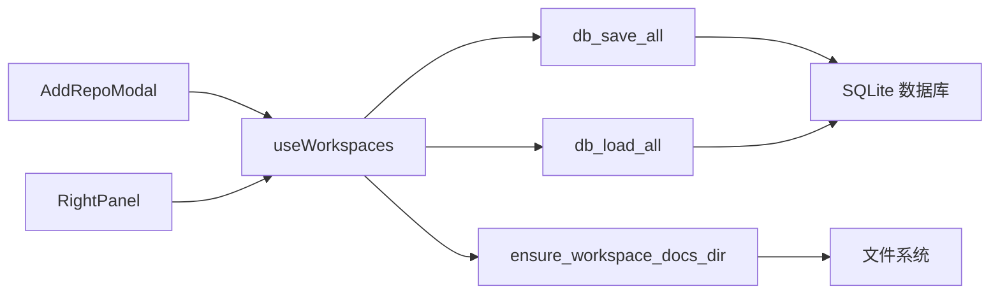

# 仓库管理操作

<cite>
**本文档引用的文件**
- [useWorkspaces.ts](file://src/hooks/useWorkspaces.ts)
- [AddRepoModal.tsx](file://src/components/common/AddRepoModal.tsx)
- [db.rs](file://src-tauri/src/db.rs)
- [lib.rs](file://src-tauri/src/lib.rs)
- [index.ts](file://src/types/index.ts)
- [SidebarHeader.tsx](file://src/components/sidebar/SidebarHeader.tsx)
- [RightPanel.tsx](file://src/components/RightPanel.tsx)
- [zh.ts](file://src/i18n/locales/zh.ts)
</cite>

## 目录
1. [简介](#简介)
2. [项目结构](#项目结构)
3. [核心组件](#核心组件)
4. [架构概览](#架构概览)
5. [详细组件分析](#详细组件分析)
6. [依赖关系分析](#依赖关系分析)
7. [性能考量](#性能考量)
8. [故障排除指南](#故障排除指南)
9. [结论](#结论)

## 简介
本文件面向仓库管理操作，围绕添加(addRepo)、删除(deleteRepo)和更新(updateRepo)三大核心功能，系统阐述以下方面：
- 仓库路径验证与名称规范
- 数据完整性检查与一致性保障
- 操作流程图与时序图
- 与工作空间路径的关系及自动文档目录创建
- 错误处理机制与最佳实践
- 性能优化建议与注意事项

## 项目结构
仓库管理涉及三层协作：
- 前端状态与UI：React Hook + Modal 组件负责交互与状态更新
- 数据持久化：SQLite 存储工作区、兔子与仓库信息
- 平台能力：Tauri 命令封装文件系统操作（如自动创建 docs 目录）

**图表来源**
- [useWorkspaces.ts:277-297](file://src/hooks/useWorkspaces.ts#L277-L297)
- [db.rs:392-406](file://src-tauri/src/db.rs#L392-L406)
- [lib.rs:22-27](file://src-tauri/src/lib.rs#L22-L27)

**章节来源**
- [useWorkspaces.ts:1-541](file://src/hooks/useWorkspaces.ts#L1-L541)
- [db.rs:1-417](file://src-tauri/src/db.rs#L1-L417)
- [lib.rs:22-27](file://src-tauri/src/lib.rs#L22-L27)

## 核心组件
- useWorkspaces 钩子：提供 addRepo、updateRepo、deleteRepo 三个仓库管理方法，并通过 Tauri 命令持久化到 SQLite。
- AddRepoModal：提供仓库添加/编辑的 UI，包含基础输入校验（非空）。
- db.rs：定义数据结构与 SQLite 模式，提供全量加载与事务性保存。
- lib.rs：暴露 ensure_workspace_docs_dir 等命令，实现自动目录创建。

**章节来源**
- [useWorkspaces.ts:277-297](file://src/hooks/useWorkspaces.ts#L277-L297)
- [AddRepoModal.tsx:1-79](file://src/components/common/AddRepoModal.tsx#L1-L79)
- [db.rs:67-74](file://src-tauri/src/db.rs#L67-L74)
- [lib.rs:22-27](file://src-tauri/src/lib.rs#L22-L27)

## 架构概览
仓库管理遵循“前端状态变更 → Tauri 命令 → SQLite 事务保存”的模式，确保数据一致性与可恢复性。

**图表来源**
- [AddRepoModal.tsx:27-33](file://src/components/common/AddRepoModal.tsx#L27-L33)
- [useWorkspaces.ts:277-283](file://src/hooks/useWorkspaces.ts#L277-L283)
- [db.rs:290-305](file://src-tauri/src/db.rs#L290-L305)
- [db.rs:375-386](file://src-tauri/src/db.rs#L375-L386)

## 详细组件分析

### 仓库添加 addRepo
- 输入校验
  - 前端：AddRepoModal 在提交时对名称与路径执行非空校验，阻止空值进入后续流程。
  - 后端：db.rs 的 repos 表结构要求 name 与 path 为非空字段，违反约束将导致保存失败。
- 状态更新
  - useWorkspaces 生成唯一 id，构造 Repo 对象并追加到对应工作区的 repos 数组。
- 持久化
  - 通过 db_save_all 以事务方式清空并重写 repos 表，保证原子性。
- 自动文档目录
  - 若工作区路径非空，前端会在创建工作区或更新路径时调用 ensure_workspace_docs_dir，确保 docs 目录存在。

**图表来源**
- [AddRepoModal.tsx:27-33](file://src/components/common/AddRepoModal.tsx#L27-L33)
- [useWorkspaces.ts:277-283](file://src/hooks/useWorkspaces.ts#L277-L283)
- [db.rs:375-386](file://src-tauri/src/db.rs#L375-L386)

**章节来源**
- [AddRepoModal.tsx:27-33](file://src/components/common/AddRepoModal.tsx#L27-L33)
- [useWorkspaces.ts:277-283](file://src/hooks/useWorkspaces.ts#L277-L283)
- [db.rs:116-123](file://src-tauri/src/db.rs#L116-L123)
- [db.rs:375-386](file://src-tauri/src/db.rs#L375-L386)

### 仓库删除 deleteRepo
- 选择与触发
  - RightPanel 中提供删除按钮，点击后调用 deleteRepo(workspaceId, repoId)。
- 状态变更
  - useWorkspaces 过滤掉指定 repoId，更新工作区 repos 列表。
- 持久化
  - 通过 db_save_all 重新写入 repos 表，确保与 UI 状态一致。

**图表来源**
- [RightPanel.tsx:553-558](file://src/components/RightPanel.tsx#L553-L558)
- [useWorkspaces.ts:285-289](file://src/hooks/useWorkspaces.ts#L285-L289)
- [db.rs:311-316](file://src-tauri/src/db.rs#L311-L316)

**章节来源**
- [RightPanel.tsx:553-558](file://src/components/RightPanel.tsx#L553-L558)
- [useWorkspaces.ts:285-289](file://src/hooks/useWorkspaces.ts#L285-L289)
- [db.rs:311-316](file://src-tauri/src/db.rs#L311-L316)

### 仓库更新 updateRepo
- 场景
  - 支持修改仓库名称与路径，适用于路径变更或重命名。
- 实现
  - useWorkspaces 根据 repoId 定位仓库，合并 updates 对象，更新对应字段。
- 一致性
  - 通过 db_save_all 保证更新被持久化，且与其他表结构保持一致。

**图表来源**
- [useWorkspaces.ts:291-297](file://src/hooks/useWorkspaces.ts#L291-L297)
- [db.rs:375-386](file://src-tauri/src/db.rs#L375-L386)

**章节来源**
- [useWorkspaces.ts:291-297](file://src/hooks/useWorkspaces.ts#L291-L297)
- [db.rs:375-386](file://src-tauri/src/db.rs#L375-L386)

### 数据模型与约束
- Repo 数据结构
  - 字段：id、name、path、createdAt
  - 约束：name、path 必填；id 唯一；与 workspaces 通过 workspace_id 外键关联。
- SQLite 模式
  - repos 表包含 id、workspace_id、name、path、created_at 字段，外键约束确保引用完整性。

**图表来源**
- [db.rs:90-123](file://src-tauri/src/db.rs#L90-L123)
- [index.ts:1-6](file://src/types/index.ts#L1-L6)

**章节来源**
- [db.rs:90-123](file://src-tauri/src/db.rs#L90-L123)
- [index.ts:1-6](file://src/types/index.ts#L1-L6)

### 路径验证与名称规范
- 前端校验
  - AddRepoModal：提交时禁止空名称与空路径。
  - SidebarHeader：创建工作区时同样要求名称非空。
- 后端约束
  - SQLite：repos.name 与 repos.path 为 NOT NULL，违反将导致插入失败。
- 建议规范
  - 名称：建议使用清晰、稳定的标识符，避免特殊字符。
  - 路径：建议使用绝对路径，确保跨平台一致性；若为相对路径，需明确工作区根目录。

**章节来源**
- [AddRepoModal.tsx:27-33](file://src/components/common/AddRepoModal.tsx#L27-L33)
- [SidebarHeader.tsx:41-46](file://src/components/sidebar/SidebarHeader.tsx#L41-L46)
- [db.rs:116-123](file://src-tauri/src/db.rs#L116-L123)

### 与工作空间路径的关系与自动文档目录
- 关系
  - 仓库属于工作区，repos.workspace_id 指向 workspaces.id。
- 自动创建
  - 当创建新工作区或更新工作区路径时，前端调用 ensure_workspace_docs_dir，确保 docs 目录存在。
  - 该行为与仓库路径无直接耦合，但通常建议将仓库置于工作区路径之下，便于统一管理。

**图表来源**
- [useWorkspaces.ts:181-185](file://src/hooks/useWorkspaces.ts#L181-L185)
- [lib.rs:22-27](file://src-tauri/src/lib.rs#L22-L27)

**章节来源**
- [useWorkspaces.ts:181-185](file://src/hooks/useWorkspaces.ts#L181-L185)
- [lib.rs:22-27](file://src-tauri/src/lib.rs#L22-L27)

### 错误处理机制
- 前端
  - AddRepoModal：空输入直接拒绝提交。
  - useWorkspaces：保存失败时控制台打印错误日志；DB 不可用时降级至 localStorage。
- 后端
  - db_save_all：事务包裹，任一步骤失败即回滚并返回错误。
  - ensure_workspace_docs_dir：文件系统创建失败时返回错误信息。
- 国际化提示
  - 本地化资源提供“添加代码库”、“代码库名称”、“代码库路径”等文案，便于用户理解。

**章节来源**
- [AddRepoModal.tsx:27-33](file://src/components/common/AddRepoModal.tsx#L27-L33)
- [useWorkspaces.ts:76-92](file://src/hooks/useWorkspaces.ts#L76-L92)
- [db.rs:290-305](file://src-tauri/src/db.rs#L290-L305)
- [lib.rs:22-27](file://src-tauri/src/lib.rs#L22-L27)
- [zh.ts:188-195](file://src/i18n/locales/zh.ts#L188-L195)

## 依赖关系分析
- 组件耦合
  - AddRepoModal 与 useWorkspaces：通过回调 onSubmit 传递数据。
  - RightPanel 与 useWorkspaces：通过回调 onDeleteRepo 触发删除。
  - useWorkspaces 与 db.rs：通过 Tauri 命令 db_save_all/db_load_all 交互。
  - useWorkspaces 与 lib.rs：通过 ensure_workspace_docs_dir 交互。
- 外部依赖
  - Tauri 命令注册与调用。
  - SQLite 约束与索引（外键、索引）保障引用完整性与查询效率。

**图表来源**
- [useWorkspaces.ts:277-297](file://src/hooks/useWorkspaces.ts#L277-L297)
- [db.rs:392-406](file://src-tauri/src/db.rs#L392-L406)
- [lib.rs:523-527](file://src-tauri/src/lib.rs#L523-L527)

**章节来源**
- [useWorkspaces.ts:277-297](file://src/hooks/useWorkspaces.ts#L277-L297)
- [db.rs:392-406](file://src-tauri/src/db.rs#L392-L406)
- [lib.rs:523-527](file://src-tauri/src/lib.rs#L523-L527)

## 性能考量
- 防抖与周期保存
  - useWorkspaces 对状态变更采用 500ms 防抖与 3s 周期强制保存策略，平衡实时性与性能。
- 事务批量写入
  - db_save_all 使用事务一次性重写 repos 表，减少多次往返与锁竞争。
- 建议
  - 控制仓库数量规模，避免一次性大量变更触发频繁保存。
  - 对于频繁更新的场景，可在 UI 层做本地缓冲，减少 invoke 次数。

**章节来源**
- [useWorkspaces.ts:101-119](file://src/hooks/useWorkspaces.ts#L101-L119)
- [db.rs:290-305](file://src-tauri/src/db.rs#L290-L305)

## 故障排除指南
- 问题：添加仓库后未生效
  - 检查前端控制台是否有 db_save_all 失败日志。
  - 确认工作区已正确加载（db_load_all）。
- 问题：路径无效或无法创建 docs
  - 确认 ensure_workspace_docs_dir 返回成功。
  - 检查路径权限与磁盘空间。
- 问题：删除仓库后仍可见
  - 确认 db_save_all 已成功写入，且 UI 已刷新。
  - 检查工作区数据是否被 localStorage 降级覆盖。

**章节来源**
- [useWorkspaces.ts:76-92](file://src/hooks/useWorkspaces.ts#L76-L92)
- [lib.rs:22-27](file://src-tauri/src/lib.rs#L22-L27)
- [db.rs:311-316](file://src-tauri/src/db.rs#L311-L316)

## 结论
仓库管理通过“前端状态 + Tauri 命令 + SQLite 事务”的组合，实现了可靠的增删改操作与数据一致性保障。前端提供基础输入校验与直观 UI，后端通过严格的数据模型与事务机制确保完整性，平台层提供自动目录创建等便利能力。结合防抖与周期保存策略，在性能与可靠性之间取得良好平衡。建议在实际使用中遵循名称与路径规范，合理组织工作区与仓库层级，以获得更佳体验。