# 工作空间 CRUD 操作

<cite>
**本文引用的文件**
- [useWorkspaces.ts](file://src/hooks/useWorkspaces.ts)
- [WorkspaceItem.tsx](file://src/components/sidebar/WorkspaceItem.tsx)
- [WorkspaceList.tsx](file://src/components/sidebar/WorkspaceList.tsx)
- [db.rs](file://src-tauri/src/db.rs)
- [index.ts](file://src/types/index.ts)
- [AddRabbitForm.tsx](file://src/components/sidebar/AddRabbitForm.tsx)
- [RabbitItem.tsx](file://src/components/sidebar/RabbitItem.tsx)
- [main.rs](file://src-tauri/src/main.rs)
- [lib.rs](file://src-tauri/src/lib.rs)
</cite>

## 目录
1. [简介](#简介)
2. [项目结构](#项目结构)
3. [核心组件](#核心组件)
4. [架构总览](#架构总览)
5. [详细组件分析](#详细组件分析)
6. [依赖关系分析](#依赖关系分析)
7. [性能考量](#性能考量)
8. [故障排查指南](#故障排查指南)
9. [结论](#结论)
10. [附录](#附录)

## 简介
本文件围绕 RabbitCoding 的“工作空间”CRUD 操作进行系统性说明，重点覆盖以下能力：
- 创建工作空间：支持无参创建与带名称/路径创建
- 删除工作空间：删除指定工作空间及其关联的 Rabbit、Repo
- 重命名工作空间：对工作空间名称进行更新
- 折叠/展开工作空间：控制工作空间下的 Rabbit 列表可见性

文档将从数据模型、前端状态管理、Tauri 命令与数据库交互、UI 展示与事件流转等维度，给出完整的实现脉络、流程图与时序图，并提供性能与错误处理建议。

## 项目结构
与工作空间 CRUD 直接相关的模块分布如下：
- 前端状态与业务逻辑：src/hooks/useWorkspaces.ts
- UI 展示与交互：src/components/sidebar/WorkspaceItem.tsx、WorkspaceList.tsx、RabbitItem.tsx、AddRabbitForm.tsx
- 类型定义：src/types/index.ts
- 数据持久化与命令桥接：src-tauri/src/db.rs、src-tauri/src/main.rs、src-tauri/src/lib.rs

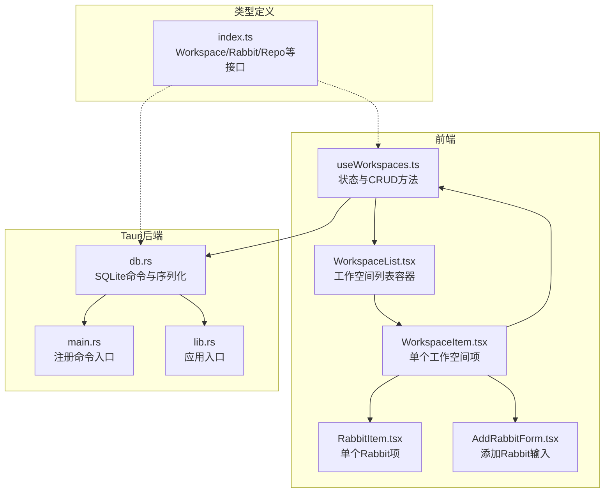

图表来源
- [useWorkspaces.ts:1-541](file://src/hooks/useWorkspaces.ts#L1-L541)
- [WorkspaceList.tsx:1-62](file://src/components/sidebar/WorkspaceList.tsx#L1-L62)
- [WorkspaceItem.tsx:1-311](file://src/components/sidebar/WorkspaceItem.tsx#L1-L311)
- [RabbitItem.tsx:1-179](file://src/components/sidebar/RabbitItem.tsx#L1-L179)
- [AddRabbitForm.tsx:1-47](file://src/components/sidebar/AddRabbitForm.tsx#L1-L47)
- [db.rs:1-417](file://src-tauri/src/db.rs#L1-L417)
- [main.rs](file://src-tauri/src/main.rs)
- [lib.rs](file://src-tauri/src/lib.rs)
- [index.ts:34-42](file://src/types/index.ts#L34-L42)

章节来源
- [useWorkspaces.ts:1-541](file://src/hooks/useWorkspaces.ts#L1-L541)
- [WorkspaceList.tsx:1-62](file://src/components/sidebar/WorkspaceList.tsx#L1-L62)
- [WorkspaceItem.tsx:1-311](file://src/components/sidebar/WorkspaceItem.tsx#L1-L311)
- [RabbitItem.tsx:1-179](file://src/components/sidebar/RabbitItem.tsx#L1-L179)
- [AddRabbitForm.tsx:1-47](file://src/components/sidebar/AddRabbitForm.tsx#L1-L47)
- [db.rs:1-417](file://src-tauri/src/db.rs#L1-L417)
- [index.ts:34-42](file://src/types/index.ts#L34-L42)

## 核心组件
- useWorkspaces：集中管理工作空间与 Rabbit 的本地状态，提供 CRUD 方法与双层防抖持久化策略
- WorkspaceList/WorkspaceItem：渲染工作空间列表与单个工作空间项，处理折叠/展开、重命名、删除、添加 Rabbit 等交互
- db.rs：定义 Workspace/Rabbit/Repo 的序列化结构，提供 db_load_all、db_save_all、db_has_data 等命令
- 类型定义：统一 Workspace/Rabbit/Repo 的字段与默认值，保证前后端一致

章节来源
- [useWorkspaces.ts:149-207](file://src/hooks/useWorkspaces.ts#L149-L207)
- [WorkspaceList.tsx:10-61](file://src/components/sidebar/WorkspaceList.tsx#L10-L61)
- [WorkspaceItem.tsx:38-311](file://src/components/sidebar/WorkspaceItem.tsx#L38-L311)
- [db.rs:10-74](file://src-tauri/src/db.rs#L10-L74)
- [index.ts:34-42](file://src/types/index.ts#L34-L42)

## 架构总览
工作空间 CRUD 的整体流程：
- 前端通过 useWorkspaces 提供的方法修改内存状态
- 通过 Tauri invoke 调用 db_save_all 将完整 JSON 写入 SQLite
- 首次启动或 DB 不可用时，回退到 localStorage
- UI 通过 WorkspaceList/WorkspaceItem 渲染并响应用户交互

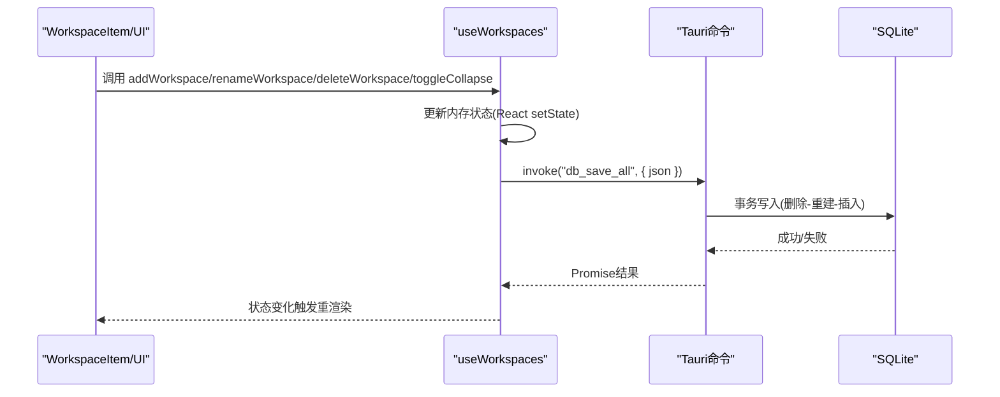

图表来源
- [useWorkspaces.ts:149-207](file://src/hooks/useWorkspaces.ts#L149-L207)
- [db.rs:392-406](file://src-tauri/src/db.rs#L392-L406)

## 详细组件分析

### 数据模型与类型
- Workspace：包含 id、name、path、collapsed、createdAt、rabbits、repos 等字段
- Rabbit：包含 id、title、completed、createdAt、pinned、status、messages、model 等字段
- Repo：包含 id、name、path、createdAt

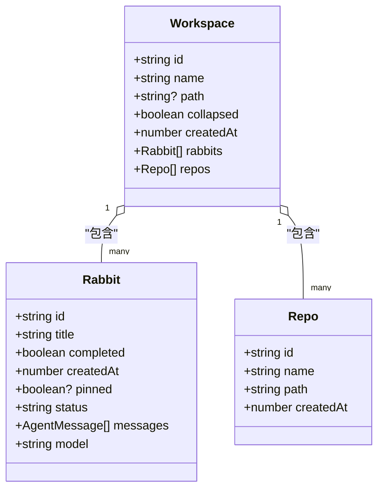

图表来源
- [index.ts:34-42](file://src/types/index.ts#L34-L42)
- [index.ts:8-32](file://src/types/index.ts#L8-L32)
- [index.ts:1-6](file://src/types/index.ts#L1-L6)

章节来源
- [index.ts:34-42](file://src/types/index.ts#L34-L42)
- [index.ts:8-32](file://src/types/index.ts#L8-L32)
- [index.ts:1-6](file://src/types/index.ts#L1-L6)

### 添加工作空间 addWorkspace
- 行为
  - 生成唯一 ID，构造空名称的工作空间对象
  - 插入到列表首位，选中该工作空间
  - 进入编辑模式，准备重命名
- 参数
  - 无
- 返回值
  - 无（副作用：更新状态）
- 内部实现要点
  - 使用 generateId 生成唯一标识
  - setWorkspaces(prev => [newWorkspace, ...prev]) 前置插入
  - setSelectedWorkspaceId 与 setEditingId 控制选中与编辑态
- 状态更新机制
  - React 状态变更后，通过双层防抖持久化策略写入数据库或 localStorage

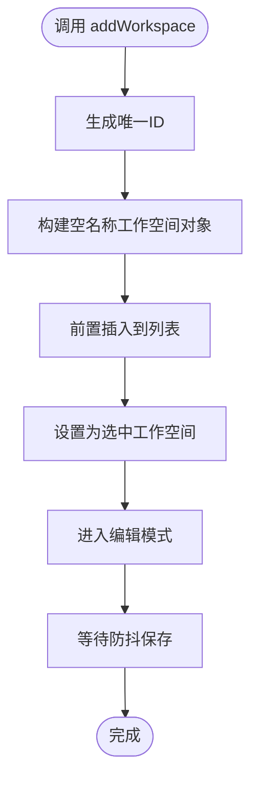

图表来源
- [useWorkspaces.ts:149-162](file://src/hooks/useWorkspaces.ts#L149-L162)

章节来源
- [useWorkspaces.ts:149-162](file://src/hooks/useWorkspaces.ts#L149-L162)

### 添加工作空间（带名称/路径）addWorkspaceWithName
- 行为
  - 校验并裁剪名称与路径
  - 生成唯一 ID，构造带名称/路径的工作空间对象
  - 插入到列表首位，选中该工作空间
  - 若提供路径，异步调用 ensure_workspace_docs_dir 确保 docs 目录存在
- 参数
  - name: string（必填）
  - path?: string（可选）
- 返回值
  - 无（副作用：更新状态）
- 内部实现要点
  - trim 与条件赋值 path
  - 调用 invoke('ensure_workspace_docs_dir', { path }) 进行目录检查
- 状态更新机制
  - 与 addWorkspace 相同，通过防抖持久化

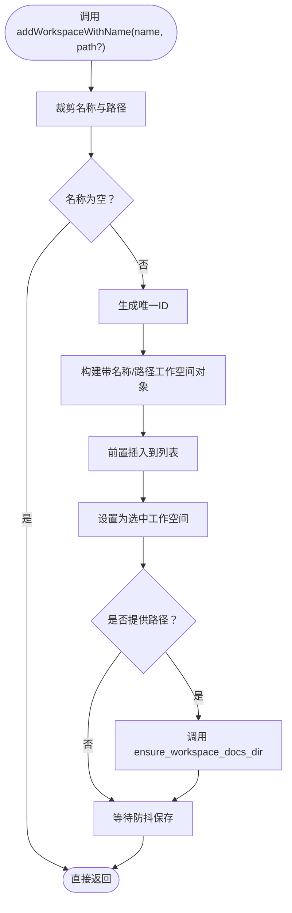

图表来源
- [useWorkspaces.ts:164-186](file://src/hooks/useWorkspaces.ts#L164-L186)

章节来源
- [useWorkspaces.ts:164-186](file://src/hooks/useWorkspaces.ts#L164-L186)

### 删除工作空间 deleteWorkspace
- 行为
  - 过滤掉指定 id 的工作空间
  - 若当前选中的工作空间被删除，则清空选中状态
  - 若当前选中的 Rabbit 属于被删除的工作空间，则清空选中 Rabbit
- 参数
  - id: string（必填）
- 返回值
  - 无（副作用：更新状态）
- 内部实现要点
  - setWorkspaces(prev => prev.filter(p => p.id !== id))
  - 通过 workspaces.find 与 rabbits.some 判断是否影响选中状态
- 状态更新机制
  - React 状态变更后，通过双层防抖持久化

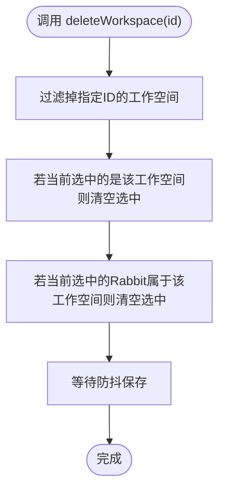

图表来源
- [useWorkspaces.ts:188-197](file://src/hooks/useWorkspaces.ts#L188-L197)

章节来源
- [useWorkspaces.ts:188-197](file://src/hooks/useWorkspaces.ts#L188-L197)

### 重命名工作空间 renameWorkspace
- 行为
  - 裁剪名称并校验非空
  - 更新对应工作空间的 name 字段
- 参数
  - id: string（必填）
  - name: string（必填）
- 返回值
  - 无（副作用：更新状态）
- 内部实现要点
  - setWorkspaces(prev => prev.map(p => p.id === id ? { ...p, name: trimmed } : p))
- 状态更新机制
  - React 状态变更后，通过双层防抖持久化

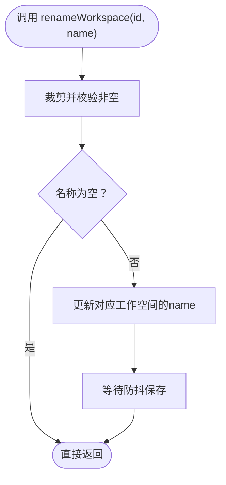

图表来源
- [useWorkspaces.ts:199-203](file://src/hooks/useWorkspaces.ts#L199-L203)

章节来源
- [useWorkspaces.ts:199-203](file://src/hooks/useWorkspaces.ts#L199-L203)

### 折叠/展开工作空间 toggleCollapse
- 行为
  - 切换指定工作空间的 collapsed 字段
- 参数
  - id: string（必填）
- 返回值
  - 无（副作用：更新状态）
- 内部实现要点
  - setWorkspaces(prev => prev.map(p => p.id === id ? { ...p, collapsed: !p.collapsed } : p))
- 状态更新机制
  - React 状态变更后，通过双层防抖持久化

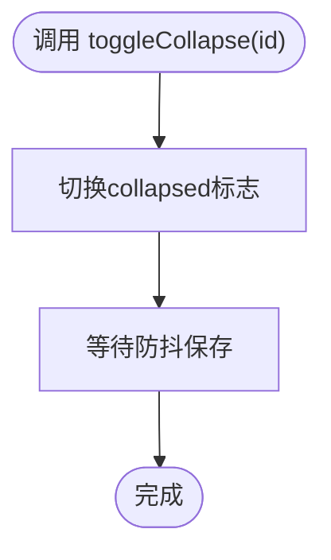

图表来源
- [useWorkspaces.ts:205-207](file://src/hooks/useWorkspaces.ts#L205-L207)

章节来源
- [useWorkspaces.ts:205-207](file://src/hooks/useWorkspaces.ts#L205-L207)

### UI 交互与事件流转
- WorkspaceList.tsx
  - 作为容器，将 useWorkspaces 的状态与 WorkspaceItem 绑定
  - 将 toggleCollapse、renameWorkspace、deleteWorkspace 等方法透传给 WorkspaceItem
- WorkspaceItem.tsx
  - 处理工作空间的重命名、删除、折叠/展开、添加 Rabbit 等交互
  - 在折叠状态下点击图标可展开，同时触发选中工作空间
- AddRabbitForm.tsx
  - 输入回车或失焦时提交标题，触发 addRabbit
- RabbitItem.tsx
  - 展示 Rabbit 列表项，支持重命名、置顶/取消置顶、删除、选中等

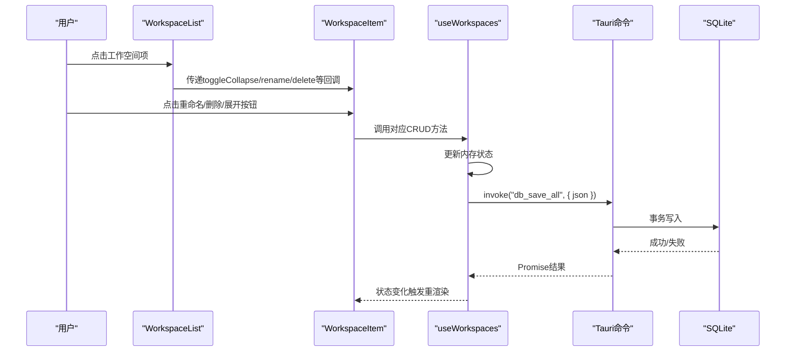

图表来源
- [WorkspaceList.tsx:32-58](file://src/components/sidebar/WorkspaceList.tsx#L32-L58)
- [WorkspaceItem.tsx:167-223](file://src/components/sidebar/WorkspaceItem.tsx#L167-L223)
- [useWorkspaces.ts:149-207](file://src/hooks/useWorkspaces.ts#L149-L207)
- [db.rs:392-406](file://src-tauri/src/db.rs#L392-L406)

章节来源
- [WorkspaceList.tsx:10-61](file://src/components/sidebar/WorkspaceList.tsx#L10-L61)
- [WorkspaceItem.tsx:38-311](file://src/components/sidebar/WorkspaceItem.tsx#L38-L311)
- [AddRabbitForm.tsx:9-47](file://src/components/sidebar/AddRabbitForm.tsx#L9-L47)
- [RabbitItem.tsx:20-179](file://src/components/sidebar/RabbitItem.tsx#L20-L179)

### 数据持久化与回退策略
- 首次启动
  - 调用 db_has_data 检查数据库是否有数据
  - 若无数据，尝试从 localStorage 迁移 rabbit-workspaces
- 加载
  - 调用 db_load_all 获取完整 JSON，解析为 Workspace[]
- 保存
  - 双层防抖：500ms 定时器与 3s 周期定时器
  - DB 可用时：invoke("db_save_all", { json })
  - DB 不可用时：降级写入 localStorage
- 序列化结构
  - db.rs 中定义 WorkspaceData/RabbitData/RepoData，字段与前端类型对齐

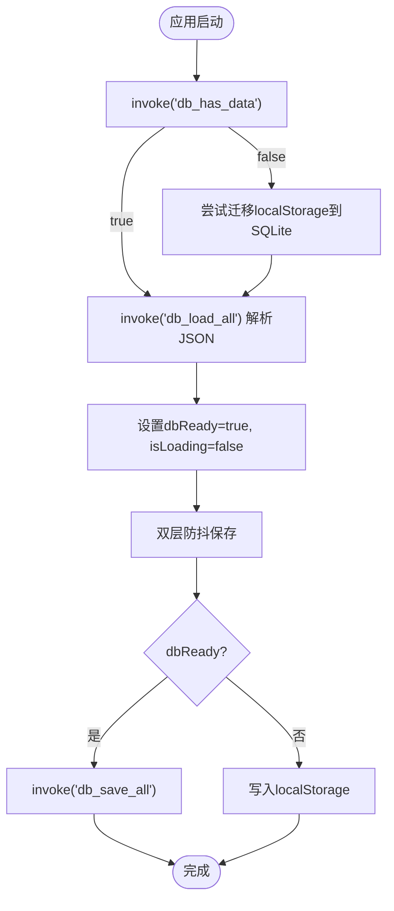

图表来源
- [useWorkspaces.ts:48-95](file://src/hooks/useWorkspaces.ts#L48-L95)
- [useWorkspaces.ts:100-129](file://src/hooks/useWorkspaces.ts#L100-L129)
- [db.rs:392-416](file://src-tauri/src/db.rs#L392-L416)

章节来源
- [useWorkspaces.ts:48-95](file://src/hooks/useWorkspaces.ts#L48-L95)
- [useWorkspaces.ts:100-129](file://src/hooks/useWorkspaces.ts#L100-L129)
- [db.rs:10-74](file://src-tauri/src/db.rs#L10-L74)
- [db.rs:392-416](file://src-tauri/src/db.rs#L392-L416)

## 依赖关系分析
- 前端依赖
  - useWorkspaces 依赖 @tauri-apps/api/core 进行 invoke 调用
  - useWorkspaces 依赖自定义 generateId 生成唯一 ID
  - useWorkspaces 依赖 useLocalStorage 读写本地选中状态
- 后端依赖
  - db.rs 依赖 rusqlite、serde、tauri::command
  - db.rs 通过 State<'_, Database> 注入数据库连接
- 类型依赖
  - 前后端类型通过 camelCase 字段对齐（WorkspaceData/RabbitData/RepoData）

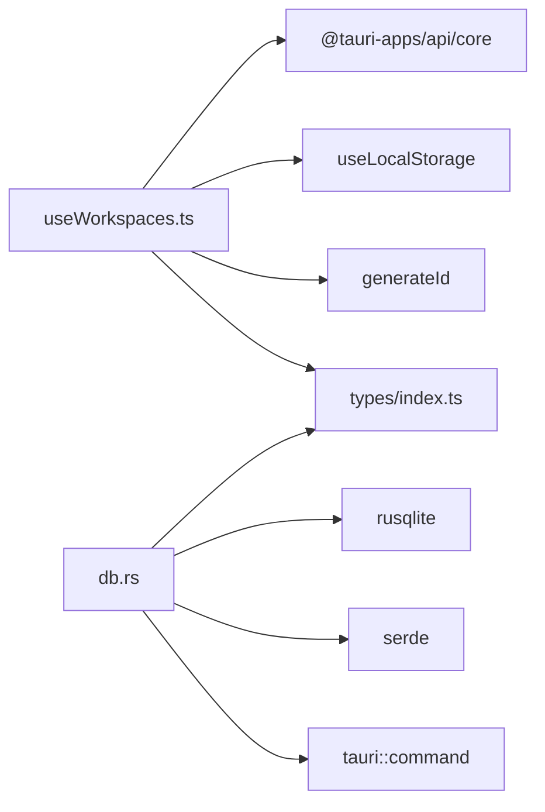

图表来源
- [useWorkspaces.ts:1-10](file://src/hooks/useWorkspaces.ts#L1-L10)
- [db.rs:1-5](file://src-tauri/src/db.rs#L1-L5)
- [index.ts:34-42](file://src/types/index.ts#L34-L42)

章节来源
- [useWorkspaces.ts:1-10](file://src/hooks/useWorkspaces.ts#L1-L10)
- [db.rs:1-5](file://src-tauri/src/db.rs#L1-L5)
- [index.ts:34-42](file://src/types/index.ts#L34-L42)

## 性能考量
- 防抖与周期保存
  - 500ms 防抖与 3s 周期保存，降低频繁写入数据库的开销
  - 对于高频变更（如流式消息增量）可通过周期保存覆盖
- 事务写入
  - db_save_all 使用 BEGIN/COMMIT/ROLLBACK，保证一致性与原子性
- 索引与查询
  - rabbits/repos/messages 表建立必要索引，提升查询效率
- UI 渲染
  - WorkspaceItem/RabbitItem 采用最小化重渲染策略，仅在状态变化时更新

## 故障排查指南
- DB 不可用
  - 现象：控制台打印降级日志，后续写入 localStorage
  - 处理：检查数据库文件权限与磁盘空间，修复后重启应用自动恢复
- 迁移失败
  - 现象：迁移异常被捕获并记录错误
  - 处理：检查 localStorage 中 rabbit-workspaces 的 JSON 格式
- 保存失败
  - 现象：防抖保存失败日志
  - 处理：确认 Tauri 命令注册正常，数据库连接可用
- 数据不一致
  - 现象：重启后状态异常
  - 处理：清理 localStorage 或数据库，重新导入数据

章节来源
- [useWorkspaces.ts:74-92](file://src/hooks/useWorkspaces.ts#L74-L92)
- [useWorkspaces.ts:104-108](file://src/hooks/useWorkspaces.ts#L104-L108)
- [db.rs:290-305](file://src-tauri/src/db.rs#L290-L305)

## 结论
RabbitCoding 的工作空间 CRUD 操作以 useWorkspaces 为核心，结合 Tauri 命令与 SQLite 实现了稳定的数据持久化与良好的用户体验。通过双层防抖与事务写入，兼顾了性能与一致性；通过 UI 与交互的细粒度设计，提升了易用性。建议在生产环境中关注数据库权限、磁盘空间与备份策略，确保数据安全与可恢复性。

## 附录
- 常见使用场景
  - 新建工作空间并立即重命名
  - 在工作空间内快速添加多个 Rabbit
  - 批量折叠/展开工作空间以聚焦当前任务
- 最佳实践
  - 保持工作空间名称简洁明确
  - 合理使用折叠功能管理大量工作空间
  - 定期备份工作空间数据（可通过导出/迁移机制）
  - 避免在高频变更期间强制关闭应用，以免丢失中间状态