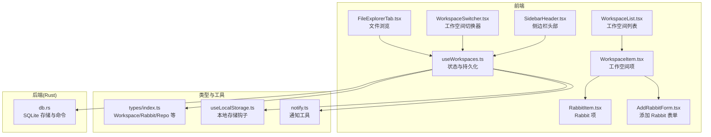
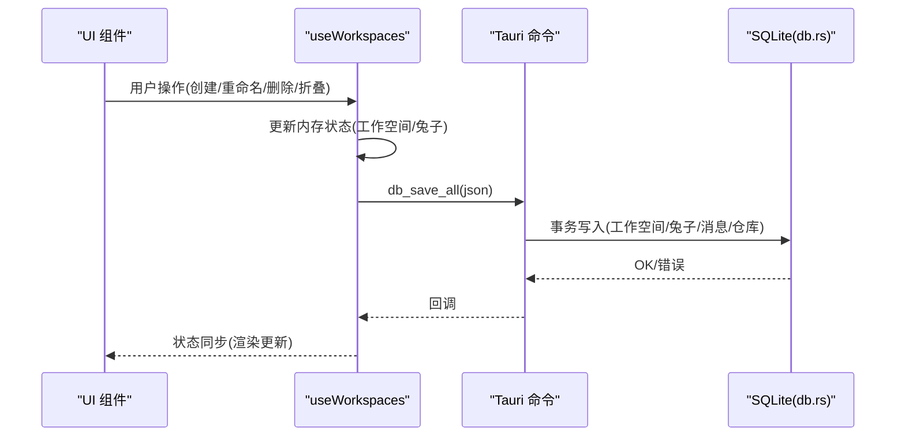
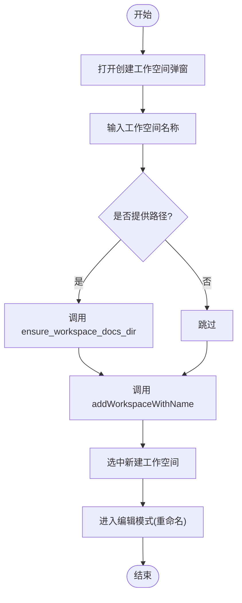
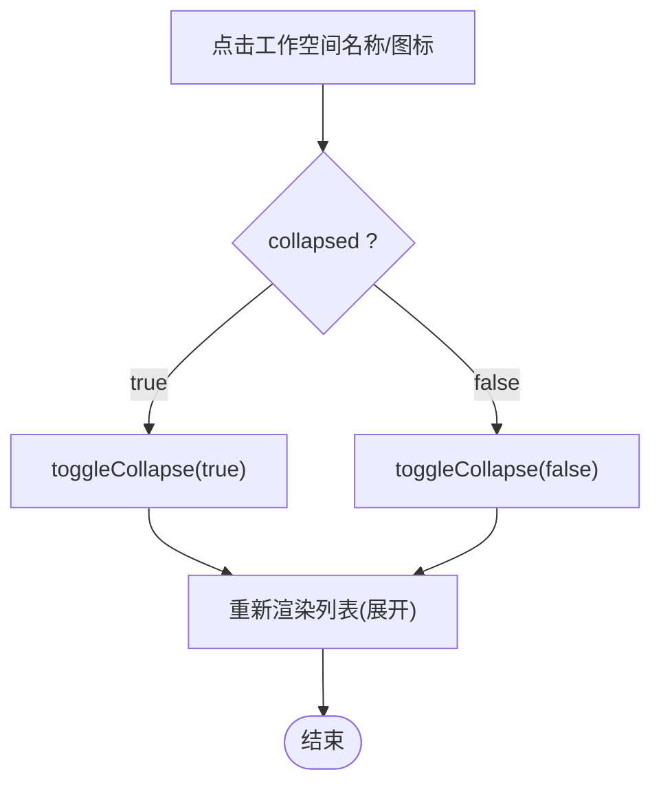
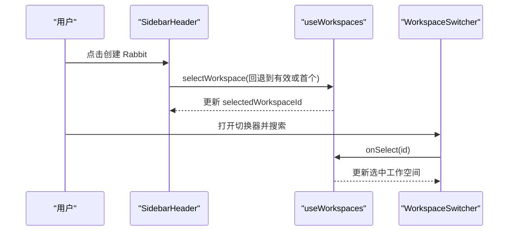
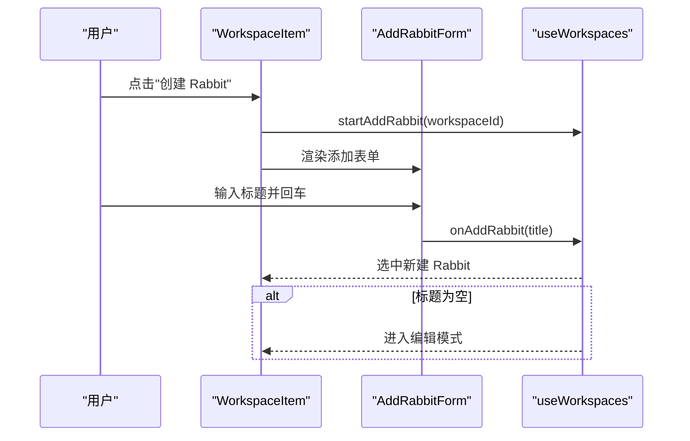
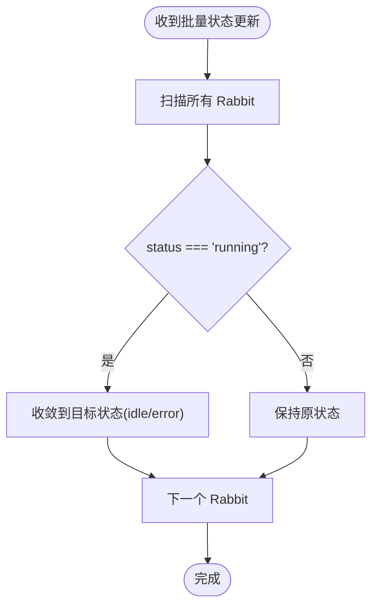
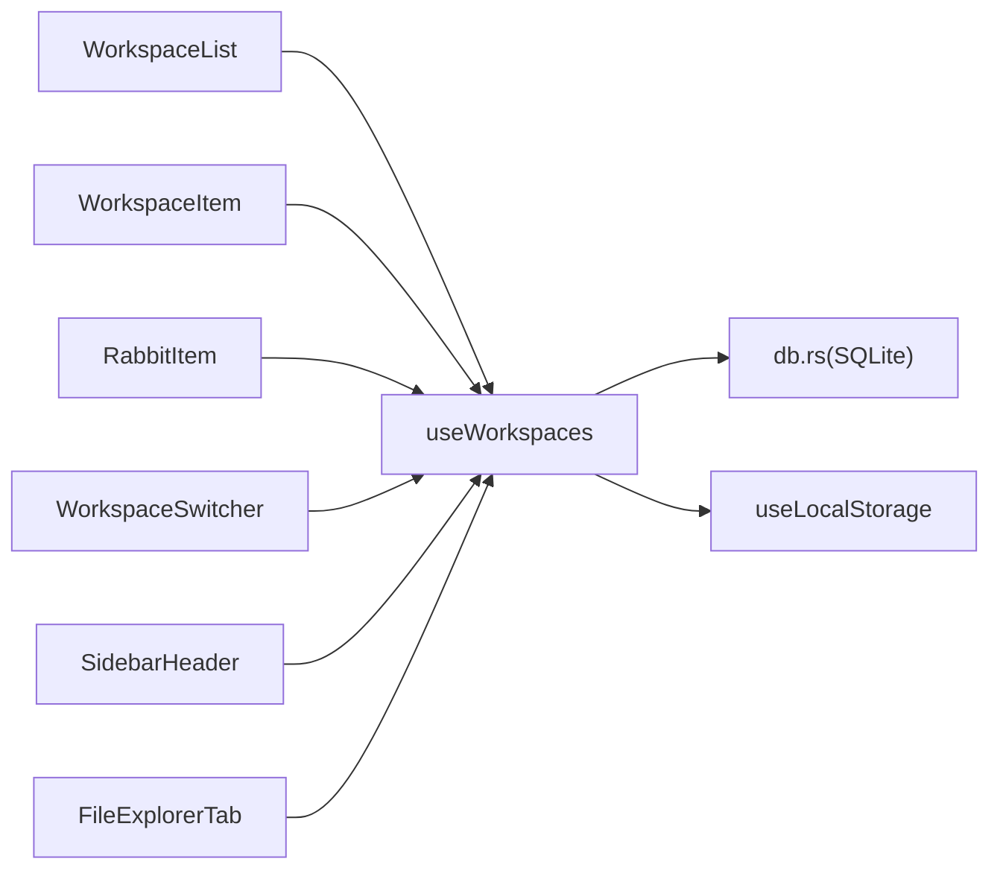

# 工作空间操作

<cite>
**本文引用的文件**
- [useWorkspaces.ts](file://src/hooks/useWorkspaces.ts)
- [WorkspaceList.tsx](file://src/components/sidebar/WorkspaceList.tsx)
- [WorkspaceItem.tsx](file://src/components/sidebar/WorkspaceItem.tsx)
- [WorkspaceSwitcher.tsx](file://src/components/common/WorkspaceSwitcher.tsx)
- [SidebarHeader.tsx](file://src/components/sidebar/SidebarHeader.tsx)
- [AddRabbitForm.tsx](file://src/components/sidebar/AddRabbitForm.tsx)
- [RabbitItem.tsx](file://src/components/sidebar/RabbitItem.tsx)
- [FileExplorerTab.tsx](file://src/components/files/FileExplorerTab.tsx)
- [index.ts](file://src/types/index.ts)
- [db.rs](file://src-tauri/src/db.rs)
- [useLocalStorage.ts](file://src/hooks/useLocalStorage.ts)
- [notify.ts](file://src/utils/notify.ts)
</cite>

## 目录
1. [简介](#简介)
2. [项目结构](#项目结构)
3. [核心组件](#核心组件)
4. [架构总览](#架构总览)
5. [详细组件分析](#详细组件分析)
6. [依赖关系分析](#依赖关系分析)
7. [性能考量](#性能考量)
8. [故障排除指南](#故障排除指南)
9. [结论](#结论)
10. [附录](#附录)

## 简介
本指南面向 RabbitCoding 的“工作空间”操作功能，提供从创建、删除、重命名、折叠/展开到选择机制、编辑模式、添加 Rabbit 的完整操作手册。同时涵盖批量操作、状态管理、错误处理、性能优化与用户体验建议，并配有操作流程图、状态转换图与交互示例，帮助开发者与用户高效、稳定地使用工作空间功能。

## 项目结构
工作空间相关逻辑主要分布在以下层次：
- 数据与状态：React Hook useWorkspaces.ts 负责工作空间与 Rabbit 的增删改查、持久化与状态收敛。
- UI 展示：侧边栏组件 WorkspaceList.tsx、WorkspaceItem.tsx、RabbitItem.tsx、AddRabbitForm.tsx、WorkspaceSwitcher.tsx、SidebarHeader.tsx。
- 类型定义：src/types/index.ts 中的 Workspace、Rabbit、Repo 等接口。
- 数据持久化：Rust 层 db.rs 提供 SQLite 存储与 Tauri 命令封装。
- 辅助工具：useLocalStorage.ts、notify.ts 等。

图表来源
- [useWorkspaces.ts:1-541](file://src/hooks/useWorkspaces.ts#L1-L541)
- [WorkspaceList.tsx:1-62](file://src/components/sidebar/WorkspaceList.tsx#L1-L62)
- [WorkspaceItem.tsx:1-311](file://src/components/sidebar/WorkspaceItem.tsx#L1-L311)
- [RabbitItem.tsx:1-179](file://src/components/sidebar/RabbitItem.tsx#L1-L179)
- [AddRabbitForm.tsx:1-47](file://src/components/sidebar/AddRabbitForm.tsx#L1-L47)
- [WorkspaceSwitcher.tsx:1-125](file://src/components/common/WorkspaceSwitcher.tsx#L1-L125)
- [SidebarHeader.tsx:1-161](file://src/components/sidebar/SidebarHeader.tsx#L1-L161)
- [FileExplorerTab.tsx:111-227](file://src/components/files/FileExplorerTab.tsx#L111-L227)
- [index.ts:34-42](file://src/types/index.ts#L34-L42)
- [db.rs:392-416](file://src-tauri/src/db.rs#L392-L416)
- [useLocalStorage.ts:1-26](file://src/hooks/useLocalStorage.ts#L1-L26)
- [notify.ts:187-274](file://src/utils/notify.ts#L187-L274)

章节来源
- [useWorkspaces.ts:1-541](file://src/hooks/useWorkspaces.ts#L1-L541)
- [WorkspaceList.tsx:1-62](file://src/components/sidebar/WorkspaceList.tsx#L1-L62)
- [WorkspaceItem.tsx:1-311](file://src/components/sidebar/WorkspaceItem.tsx#L1-L311)
- [WorkspaceSwitcher.tsx:1-125](file://src/components/common/WorkspaceSwitcher.tsx#L1-L125)
- [SidebarHeader.tsx:1-161](file://src/components/sidebar/SidebarHeader.tsx#L1-L161)
- [FileExplorerTab.tsx:111-227](file://src/components/files/FileExplorerTab.tsx#L111-L227)
- [index.ts:34-42](file://src/types/index.ts#L34-L42)
- [db.rs:392-416](file://src-tauri/src/db.rs#L392-L416)
- [useLocalStorage.ts:1-26](file://src/hooks/useLocalStorage.ts#L1-L26)
- [notify.ts:187-274](file://src/utils/notify.ts#L187-L274)

## 核心组件
- 工作空间数据模型：Workspace、Rabbit、Repo，分别承载工作空间、智能体（Rabbit）与仓库信息。
- 状态钩子 useWorkspaces：集中管理工作空间集合、选中状态、编辑状态、Rabbit 操作、消息流式更新、批量状态收敛、持久化策略等。
- UI 组件：
  - WorkspaceList/WorkspaceItem：渲染工作空间列表与折叠/展开、重命名、删除、添加 Rabbit、知识库入口等。
  - RabbitItem/AddRabbitForm：Rabbit 的重命名、删除、置顶/取消置顶、添加表单等。
  - WorkspaceSwitcher：工作空间切换器，支持搜索过滤。
  - SidebarHeader：创建工作空间弹窗与快捷创建 Rabbit。
  - FileExplorerTab：基于工作空间路径的文件浏览与编辑模式。

章节来源
- [index.ts:8-42](file://src/types/index.ts#L8-L42)
- [useWorkspaces.ts:28-541](file://src/hooks/useWorkspaces.ts#L28-L541)
- [WorkspaceList.tsx:10-62](file://src/components/sidebar/WorkspaceList.tsx#L10-L62)
- [WorkspaceItem.tsx:38-311](file://src/components/sidebar/WorkspaceItem.tsx#L38-L311)
- [RabbitItem.tsx:20-179](file://src/components/sidebar/RabbitItem.tsx#L20-L179)
- [AddRabbitForm.tsx:9-47](file://src/components/sidebar/AddRabbitForm.tsx#L9-L47)
- [WorkspaceSwitcher.tsx:12-125](file://src/components/common/WorkspaceSwitcher.tsx#L12-L125)
- [SidebarHeader.tsx:14-161](file://src/components/sidebar/SidebarHeader.tsx#L14-L161)
- [FileExplorerTab.tsx:111-227](file://src/components/files/FileExplorerTab.tsx#L111-L227)

## 架构总览
工作空间操作采用“前端状态 + Rust 持久化”的双层架构：
- 前端：useWorkspaces 维护内存中的工作空间集合，通过 Tauri invoke 调用 Rust 命令进行加载/保存。
- 后端：db.rs 提供 SQLite 存储，包含工作空间、Rabbit、消息、仓库四张表，支持事务性全量保存与查询。
- 降级策略：当数据库不可用时，自动回退到 localStorage 持久化，保证数据不丢失。

图表来源
- [useWorkspaces.ts:101-119](file://src/hooks/useWorkspaces.ts#L101-L119)
- [db.rs:392-416](file://src-tauri/src/db.rs#L392-L416)

## 详细组件分析

### 工作空间创建与删除
- 创建工作空间
  - 通过 SidebarHeader.tsx 的模态框输入名称与可选路径，调用 store.addWorkspaceWithName。
  - 若提供路径，自动调用 ensure_workspace_docs_dir 确保 docs 目录存在。
  - 新建后选中该工作空间，并进入编辑模式以便重命名。
- 删除工作空间
  - WorkspaceItem.tsx 调用 store.deleteWorkspace，同时清理选中的 Rabbit ID（若对应 Rabbit 已不存在）。

图表来源
- [SidebarHeader.tsx:41-46](file://src/components/sidebar/SidebarHeader.tsx#L41-L46)
- [useWorkspaces.ts:164-186](file://src/hooks/useWorkspaces.ts#L164-L186)

章节来源
- [SidebarHeader.tsx:14-161](file://src/components/sidebar/SidebarHeader.tsx#L14-L161)
- [useWorkspaces.ts:149-186](file://src/hooks/useWorkspaces.ts#L149-L186)
- [WorkspaceItem.tsx:120-129](file://src/components/sidebar/WorkspaceItem.tsx#L120-L129)

### 工作空间重命名与折叠/展开
- 重命名
  - WorkspaceItem.tsx 支持在编辑模式下直接输入并回车或失焦确认。
  - useWorkspaces.ts 的 renameWorkspace 去除空白后更新名称。
- 折叠/展开
  - WorkspaceItem.tsx 点击图标或名称区域切换 collapsed。
  - useWorkspaces.ts 的 toggleCollapse 切换状态。

图表来源
- [WorkspaceItem.tsx:169-170](file://src/components/sidebar/WorkspaceItem.tsx#L169-L170)
- [useWorkspaces.ts:205-207](file://src/hooks/useWorkspaces.ts#L205-L207)

章节来源
- [WorkspaceItem.tsx:92-118](file://src/components/sidebar/WorkspaceItem.tsx#L92-L118)
- [WorkspaceItem.tsx:169-170](file://src/components/sidebar/WorkspaceItem.tsx#L169-L170)
- [useWorkspaces.ts:199-203](file://src/hooks/useWorkspaces.ts#L199-L203)
- [useWorkspaces.ts:205-207](file://src/hooks/useWorkspaces.ts#L205-L207)

### 工作空间选择机制与编辑模式
- 选择机制
  - WorkspaceList.tsx 将 selectedWorkspaceId 传递给 WorkspaceItem。
  - SidebarHeader.tsx 的 handleCreateRabbit 会校验当前选中是否有效，无效则回退到第一个工作空间。
  - WorkspaceSwitcher.tsx 提供搜索与切换，支持键盘快捷键。
- 编辑模式
  - WorkspaceItem.tsx 与 RabbitItem.tsx 分别维护 editingId/editingRabbitId，支持 Enter/Escape 快捷键与失焦确认。

图表来源
- [SidebarHeader.tsx:54-64](file://src/components/sidebar/SidebarHeader.tsx#L54-L64)
- [WorkspaceSwitcher.tsx:27-31](file://src/components/common/WorkspaceSwitcher.tsx#L27-L31)
- [WorkspaceSwitcher.tsx:100-114](file://src/components/common/WorkspaceSwitcher.tsx#L100-L114)

章节来源
- [SidebarHeader.tsx:54-64](file://src/components/sidebar/SidebarHeader.tsx#L54-L64)
- [WorkspaceSwitcher.tsx:12-125](file://src/components/common/WorkspaceSwitcher.tsx#L12-L125)
- [WorkspaceList.tsx:36-40](file://src/components/sidebar/WorkspaceList.tsx#L36-L40)

### 添加 Rabbit 的流程
- 触发方式
  - WorkspaceItem.tsx：点击“更多”菜单中的“创建 Rabbit”，或点击工作空间名称区域展开后点击“+”。
  - SidebarHeader.tsx：点击“创建 Rabbit”按钮。
- 表单与提交
  - AddRabbitForm.tsx 支持回车提交与失焦提交，取消时关闭添加状态。
- 选中与编辑
  - 新建 Rabbit 后自动选中；若标题为空，进入编辑模式等待重命名。

图表来源
- [WorkspaceItem.tsx:127-128](file://src/components/sidebar/WorkspaceItem.tsx#L127-L128)
- [WorkspaceItem.tsx:147-153](file://src/components/sidebar/WorkspaceItem.tsx#L147-L153)
- [AddRabbitForm.tsx:13-31](file://src/components/sidebar/AddRabbitForm.tsx#L13-L31)
- [useWorkspaces.ts:209-230](file://src/hooks/useWorkspaces.ts#L209-L230)

章节来源
- [WorkspaceItem.tsx:125-153](file://src/components/sidebar/WorkspaceItem.tsx#L125-L153)
- [AddRabbitForm.tsx:9-47](file://src/components/sidebar/AddRabbitForm.tsx#L9-L47)
- [useWorkspaces.ts:209-230](file://src/hooks/useWorkspaces.ts#L209-L230)

### 批量操作与状态管理
- 批量收敛
  - resetAllRunningRabbits：将所有 status==='running' 的 Rabbit 收敛到指定状态（idle 或 error），用于 sidecar 退出/超时兜底。
- 消息流式更新
  - appendRabbitMessage：追加 Agent 消息，对 result 类型消息做去重处理。
  - appendDeltaToLastMessage：对最后一条同类型消息追加增量文本，支持 text/thinking 两类。
  - updateThinkingDuration：更新最后一条 thinking 消息的持续时间。
  - updateAskUserQuestionStatus：标记 AskUserQuestion 的回答状态与答案。
- 状态收敛
  - cleanupInflightState：重启后将“进行中”状态收敛，避免 UI 永久卡住。

图表来源
- [useWorkspaces.ts:342-355](file://src/hooks/useWorkspaces.ts#L342-L355)
- [useWorkspaces.ts:14-26](file://src/hooks/useWorkspaces.ts#L14-L26)

章节来源
- [useWorkspaces.ts:324-503](file://src/hooks/useWorkspaces.ts#L324-L503)
- [useWorkspaces.ts:14-26](file://src/hooks/useWorkspaces.ts#L14-L26)

### 文件浏览与编辑模式
- FileExplorerTab.tsx 基于工作空间路径加载目录树，支持刷新、折叠全部、搜索过滤。
- 编辑模式：dirty 标识、原始内容与当前内容对比，保存后闪现提示。

章节来源
- [FileExplorerTab.tsx:111-227](file://src/components/files/FileExplorerTab.tsx#L111-L227)

## 依赖关系分析
- 组件耦合
  - WorkspaceList 依赖 useWorkspaces 的状态与回调。
  - WorkspaceItem 依赖 useWorkspaces 的工作空间操作与 UI 控制。
  - RabbitItem 依赖 useWorkspaces 的 Rabbit 操作。
  - WorkspaceSwitcher 依赖 useWorkspaces 的工作空间集合与选择回调。
- 数据持久化
  - useWorkspaces 通过 invoke('db_save_all') 与 invoke('db_load_all') 与 Rust 通信。
  - db.rs 提供事务性全量保存与查询，包含工作空间、Rabbit、消息、仓库四表。
- 本地存储
  - useLocalStorage.ts 提供轻量数据的本地持久化，如选中工作空间与 Rabbit。
  - useWorkspaces 在数据库不可用时回退到 localStorage。

图表来源
- [WorkspaceList.tsx:10-62](file://src/components/sidebar/WorkspaceList.tsx#L10-L62)
- [WorkspaceItem.tsx:38-311](file://src/components/sidebar/WorkspaceItem.tsx#L38-L311)
- [RabbitItem.tsx:20-179](file://src/components/sidebar/RabbitItem.tsx#L20-L179)
- [WorkspaceSwitcher.tsx:12-125](file://src/components/common/WorkspaceSwitcher.tsx#L12-L125)
- [SidebarHeader.tsx:14-161](file://src/components/sidebar/SidebarHeader.tsx#L14-L161)
- [FileExplorerTab.tsx:111-227](file://src/components/files/FileExplorerTab.tsx#L111-L227)
- [useWorkspaces.ts:101-129](file://src/hooks/useWorkspaces.ts#L101-L129)
- [db.rs:392-416](file://src-tauri/src/db.rs#L392-L416)
- [useLocalStorage.ts:1-26](file://src/hooks/useLocalStorage.ts#L1-26)

章节来源
- [useWorkspaces.ts:101-129](file://src/hooks/useWorkspaces.ts#L101-L129)
- [db.rs:290-386](file://src-tauri/src/db.rs#L290-L386)

## 性能考量
- 双层防抖保存
  - 防抖层：状态变更后 500ms 触发 db_save_all，减少频繁写入。
  - 周期层：每 3s 强制保存，覆盖连续流式输出，避免丢失中间状态。
- 数据库事务
  - 全量保存使用事务，保证一致性与原子性，降低锁竞争。
- UI 渲染优化
  - WorkspaceItem.tsx 对 Rabbit 列表做“仅显示前 N 项 + 展开更多”策略，减少长列表渲染压力。
- 降级策略
  - 数据库不可用时回退到 localStorage，避免阻塞 UI。

章节来源
- [useWorkspaces.ts:101-119](file://src/hooks/useWorkspaces.ts#L101-L119)
- [db.rs:290-305](file://src-tauri/src/db.rs#L290-L305)
- [WorkspaceItem.tsx:162-163](file://src/components/sidebar/WorkspaceItem.tsx#L162-L163)
- [useWorkspaces.ts:76-92](file://src/hooks/useWorkspaces.ts#L76-L92)

## 故障排除指南
- 数据库不可用
  - 现象：控制台报错，无法保存。
  - 处理：useWorkspaces.ts 自动回退到 localStorage；检查数据库文件权限与磁盘空间。
- 保存失败
  - 现象：防抖保存回调打印错误日志。
  - 处理：检查网络/磁盘状态，稍后重试；必要时手动备份 localStorage 数据。
- 重启后状态异常
  - 现象：Rabbit 永远处于 running 或消息残留。
  - 处理：cleanupInflightState 会在加载时自动收敛“进行中”状态；也可使用 resetAllRunningRabbits 手动收敛。
- 通知与声音
  - 现象：通知未显示或声音未播放。
  - 处理：通过 notify.ts 的测试功能验证权限与设备状态；必要时打开系统通知设置。

章节来源
- [useWorkspaces.ts:76-92](file://src/hooks/useWorkspaces.ts#L76-L92)
- [useWorkspaces.ts:105-107](file://src/hooks/useWorkspaces.ts#L105-L107)
- [useWorkspaces.ts:14-26](file://src/hooks/useWorkspaces.ts#L14-L26)
- [useWorkspaces.ts:342-355](file://src/hooks/useWorkspaces.ts#L342-L355)
- [notify.ts:187-274](file://src/utils/notify.ts#L187-L274)

## 结论
RabbitCoding 的工作空间操作通过清晰的组件职责划分与稳健的持久化策略，实现了从创建、删除、重命名、折叠/展开到选择机制、编辑模式与添加 Rabbit 的完整闭环。配合双层防抖保存、事务性写入与降级回退，既保证了性能也提升了可靠性。建议在复杂场景下结合批量状态收敛与消息流式更新能力，进一步提升用户体验与系统稳定性。

## 附录
- 常见操作场景
  - 快速创建 Rabbit：点击侧边栏“创建 Rabbit”或在工作空间中点击“+”。
  - 批量收敛：在 sidecar 异常退出后，调用 resetAllRunningRabbits 收敛状态。
  - 文件浏览：在工作空间路径下使用 FileExplorerTab 进行文件查看与编辑。
- 交互示例
  - 工作空间重命名：在 WorkspaceItem 中进入编辑模式，输入名称后回车或失焦确认。
  - Rabbit 置顶：在 RabbitItem 的下拉菜单中切换置顶状态。
  - 工作空间切换：使用 WorkspaceSwitcher 搜索并选择目标工作空间。