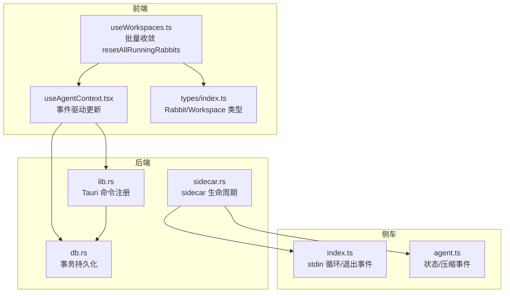
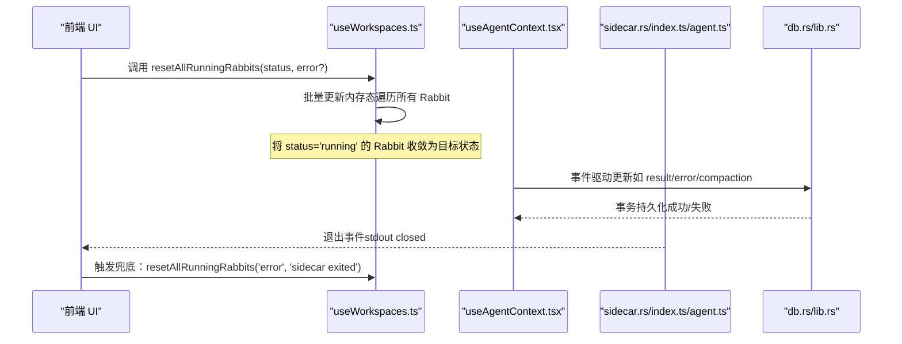
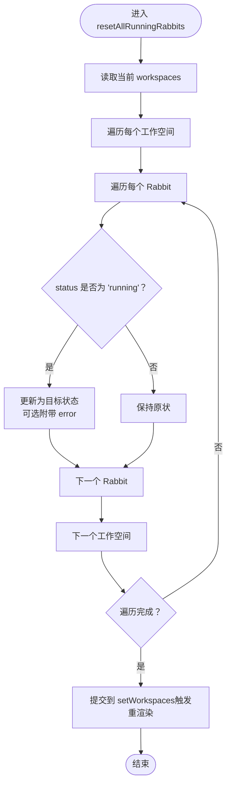
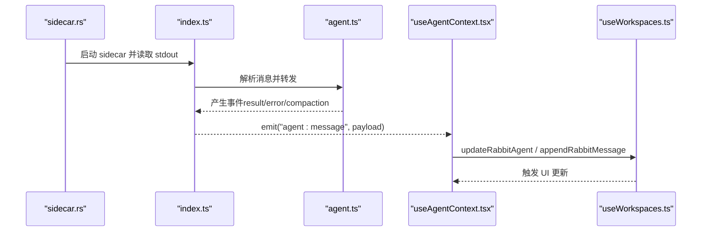
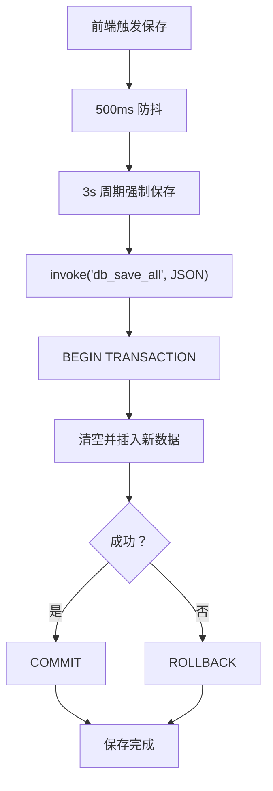
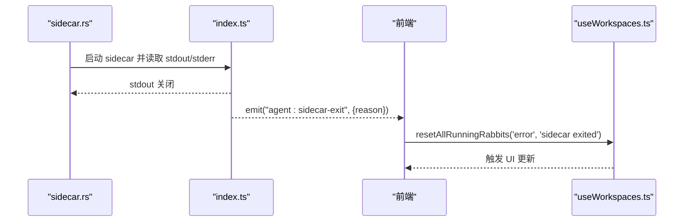
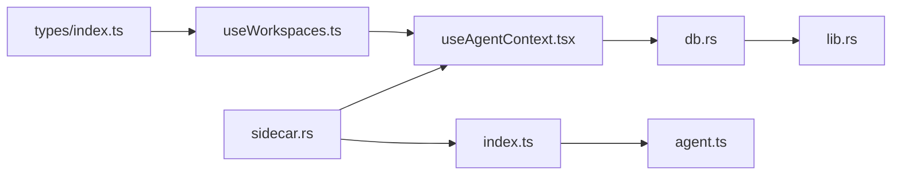

# 批量操作

<cite>
**本文引用的文件**
- [useWorkspaces.ts](file://src/hooks/useWorkspaces.ts)
- [types/index.ts](file://src/types/index.ts)
- [useAgentContext.tsx](file://src/hooks/useAgentContext.tsx)
- [useAgent.ts](file://src/hooks/useAgent.ts)
- [lib.rs](file://src-tauri/src/lib.rs)
- [db.rs](file://src-tauri/src/db.rs)
- [sidecar.rs](file://src-tauri/src/sidecar.rs)
- [index.ts](file://sidecar/src/index.ts)
- [agent.ts](file://sidecar/src/agent.ts)
</cite>

## 目录
1. [简介](#简介)
2. [项目结构](#项目结构)
3. [核心组件](#核心组件)
4. [架构总览](#架构总览)
5. [详细组件分析](#详细组件分析)
6. [依赖关系分析](#依赖关系分析)
7. [性能考量](#性能考量)
8. [故障排查指南](#故障排查指南)
9. [结论](#结论)
10. [附录](#附录)

## 简介
本指南聚焦“批量操作”能力，尤其是“批量收敛运行中 Rabbit 到目标状态”的实现与使用。该能力用于在侧车（sidecar）异常退出或超时等兜底场景，统一将所有处于“运行中”的 Rabbit 状态收敛至目标状态（例如“空闲”或“错误”），并可选附带错误信息，从而保证 UI 与持久化状态的一致性，避免界面永久卡在加载态。

此外，文档还阐述批量操作的设计原则、执行策略、错误处理机制、状态一致性保障、性能考虑、安全性与回滚思路，以及与单个操作的区别与适用场景。

## 项目结构
围绕批量操作的关键代码分布在以下位置：
- 前端状态与批量收敛逻辑：src/hooks/useWorkspaces.ts
- 类型定义：src/types/index.ts
- 事件驱动的状态更新：src/hooks/useAgentContext.tsx
- 侧车生命周期与退出事件：src-tauri/src/sidecar.rs、sidecar/src/index.ts、sidecar/src/agent.ts
- 数据持久化与事务：src-tauri/src/db.rs、src-tauri/src/lib.rs

图表来源
- [useWorkspaces.ts:342-355](file://src/hooks/useWorkspaces.ts#L342-L355)
- [useAgentContext.tsx:131-161](file://src/hooks/useAgentContext.tsx#L131-L161)
- [lib.rs:522-566](file://src-tauri/src/lib.rs#L522-L566)
- [db.rs:290-305](file://src-tauri/src/db.rs#L290-L305)
- [sidecar.rs:142-214](file://src-tauri/src/sidecar.rs#L142-L214)
- [index.ts:93-144](file://sidecar/src/index.ts#L93-L144)
- [agent.ts:320-356](file://sidecar/src/agent.ts#L320-L356)

章节来源
- [useWorkspaces.ts:1-541](file://src/hooks/useWorkspaces.ts#L1-L541)
- [types/index.ts:1-733](file://src/types/index.ts#L1-L733)
- [lib.rs:522-566](file://src-tauri/src/lib.rs#L522-L566)
- [db.rs:290-305](file://src-tauri/src/db.rs#L290-L305)
- [sidecar.rs:142-214](file://src-tauri/src/sidecar.rs#L142-L214)
- [index.ts:93-144](file://sidecar/src/index.ts#L93-L144)
- [agent.ts:320-356](file://sidecar/src/agent.ts#L320-L356)

## 核心组件
- 批量收敛函数 resetAllRunningRabbits
  - 功能：遍历所有工作空间与 Rabbit，将 status 为 running 的 Rabbit 统一更新为目标状态（idle 或 error），并可选附带错误信息。
  - 位置：src/hooks/useWorkspaces.ts
  - 特点：纯前端内存态更新，不直接触发持久化，但会与后续的防抖保存机制协同。
- 事件驱动的状态更新
  - 功能：根据 sidecar 事件（如 result/error/compaction 等）更新 Rabbit 的状态、消息与统计信息。
  - 位置：src/hooks/useAgentContext.tsx
- 类型与状态
  - 功能：定义 Rabbit 的状态枚举（idle/running/completed/error）、消息类型、压缩阶段等。
  - 位置：src/types/index.ts
- 侧车生命周期与退出事件
  - 功能：启动/停止 sidecar，监听 sidecar 退出事件，触发前端兜底逻辑。
  - 位置：src-tauri/src/sidecar.rs、sidecar/src/index.ts、sidecar/src/agent.ts
- 数据持久化与事务
  - 功能：事务内全量替换工作空间数据，保证批量更新与持久化的原子性。
  - 位置：src-tauri/src/db.rs、src-tauri/src/lib.rs

章节来源
- [useWorkspaces.ts:342-355](file://src/hooks/useWorkspaces.ts#L342-L355)
- [useAgentContext.tsx:131-161](file://src/hooks/useAgentContext.tsx#L131-L161)
- [types/index.ts:8-42](file://src/types/index.ts#L8-L42)
- [sidecar.rs:142-214](file://src-tauri/src/sidecar.rs#L142-L214)
- [index.ts:93-144](file://sidecar/src/index.ts#L93-L144)
- [agent.ts:320-356](file://sidecar/src/agent.ts#L320-L356)
- [db.rs:290-305](file://src-tauri/src/db.rs#L290-L305)
- [lib.rs:522-566](file://src-tauri/src/lib.rs#L522-L566)

## 架构总览
批量收敛的核心流程如下：
- 前端通过 resetAllRunningRabbits 将所有 running 的 Rabbit 状态更新为目标状态；
- 若目标状态为 error，可附带错误信息；
- 事件驱动模块根据 sidecar 事件更新 Rabbit 的状态与消息；
- 数据持久化通过事务命令在后端安全落盘，保证一致性；
- 侧车退出事件触发前端兜底逻辑，确保 UI 不会卡住。

图表来源
- [useWorkspaces.ts:342-355](file://src/hooks/useWorkspaces.ts#L342-L355)
- [useAgentContext.tsx:131-161](file://src/hooks/useAgentContext.tsx#L131-L161)
- [sidecar.rs:190-194](file://src-tauri/src/sidecar.rs#L190-L194)
- [db.rs:290-305](file://src-tauri/src/db.rs#L290-L305)
- [lib.rs:522-566](file://src-tauri/src/lib.rs#L522-L566)

## 详细组件分析

### 批量收敛函数 resetAllRunningRabbits
- 设计原则
  - 原子性：在单次调用中一次性更新所有符合条件的 Rabbit，避免中间态被外部事件破坏。
  - 一致性：与 UI 状态与持久化状态保持一致，防止“运行中”状态在侧车异常后长期存在。
  - 可控性：支持将状态收敛到 idle 或 error，并可附带错误信息。
- 执行策略
  - 遍历所有工作空间与 Rabbit，筛选 status 为 running 的项，统一更新为目标状态。
  - 若传入错误信息，则同时写入 error 字段。
- 错误处理
  - 该函数本身不抛错，仅做内存态更新；若需要持久化，需配合后续的防抖保存与事务落盘。
- 适用场景
  - 侧车异常退出或超时兜底：将所有“运行中”收敛为“错误”，并附带退出原因。
  - 应用重启后清理“进行中”状态：避免 UI 永远停留在 loading。

图表来源
- [useWorkspaces.ts:342-355](file://src/hooks/useWorkspaces.ts#L342-L355)

章节来源
- [useWorkspaces.ts:342-355](file://src/hooks/useWorkspaces.ts#L342-L355)

### 事件驱动的状态更新
- 作用：根据 sidecar 事件（result、error、compaction 等）更新 Rabbit 的状态、消息与统计信息。
- 与批量操作的关系：批量收敛是对“进行中”状态的兜底；事件驱动更新是对正常流程的精细化控制。
- 典型事件：
  - result：根据成功/失败更新状态与统计。
  - error：追加错误消息并标记 error。
  - compaction/compaction_result：更新压缩阶段与压缩结果。

图表来源
- [sidecar.rs:175-214](file://src-tauri/src/sidecar.rs#L175-L214)
- [index.ts:93-144](file://sidecar/src/index.ts#L93-L144)
- [agent.ts:320-356](file://sidecar/src/agent.ts#L320-L356)
- [useAgentContext.tsx:131-161](file://src/hooks/useAgentContext.tsx#L131-L161)
- [useWorkspaces.ts:324-402](file://src/hooks/useWorkspaces.ts#L324-L402)

章节来源
- [useAgentContext.tsx:131-161](file://src/hooks/useAgentContext.tsx#L131-L161)
- [useWorkspaces.ts:324-402](file://src/hooks/useWorkspaces.ts#L324-L402)
- [sidecar.rs:175-214](file://src-tauri/src/sidecar.rs#L175-L214)
- [index.ts:93-144](file://sidecar/src/index.ts#L93-L144)
- [agent.ts:320-356](file://sidecar/src/agent.ts#L320-L356)

### 数据持久化与事务
- 事务策略：save_all_inner 在开始时开启事务，插入完成后提交；若发生错误则回滚，保证全量替换的原子性。
- 保存策略：前端使用双层防抖保存（500ms 防抖 + 3s 周期强制保存），避免频繁 IO 与覆盖流式输出。
- 降级策略：当数据库不可用时，回退到 localStorage 写入。

图表来源
- [db.rs:290-305](file://src-tauri/src/db.rs#L290-L305)
- [db.rs:307-386](file://src-tauri/src/db.rs#L307-L386)
- [useWorkspaces.ts:101-119](file://src/hooks/useWorkspaces.ts#L101-L119)

章节来源
- [db.rs:290-305](file://src-tauri/src/db.rs#L290-L305)
- [db.rs:307-386](file://src-tauri/src/db.rs#L307-L386)
- [useWorkspaces.ts:101-119](file://src/hooks/useWorkspaces.ts#L101-L119)

### 侧车退出与兜底
- 退出事件：当 sidecar stdout 关闭或发生异常时，会发出 agent:sidecar-exit 事件。
- 兜底策略：前端收到退出事件后，调用 resetAllRunningRabbits('error', 'sidecar exited')，将所有“运行中”收敛为“错误”。

图表来源
- [sidecar.rs:190-194](file://src-tauri/src/sidecar.rs#L190-L194)
- [index.ts:119-128](file://sidecar/src/index.ts#L119-L128)
- [useWorkspaces.ts:342-355](file://src/hooks/useWorkspaces.ts#L342-L355)

章节来源
- [sidecar.rs:190-194](file://src-tauri/src/sidecar.rs#L190-L194)
- [index.ts:119-128](file://sidecar/src/index.ts#L119-L128)
- [useWorkspaces.ts:342-355](file://src/hooks/useWorkspaces.ts#L342-L355)

## 依赖关系分析
- 前端
  - useWorkspaces.ts 依赖 types/index.ts 的类型定义，负责批量收敛与消息/状态更新。
  - useAgentContext.tsx 依赖 useWorkspaces.ts 的更新接口，响应 sidecar 事件。
- 后端
  - lib.rs 注册 db_save_all/db_load_all 等命令，db.rs 实现事务持久化。
  - sidecar.rs 负责 sidecar 的启动、停止与事件转发。
- 侧车
  - index.ts 负责 stdin 循环与异常处理；agent.ts 生成压缩与状态事件。

图表来源
- [types/index.ts:8-42](file://src/types/index.ts#L8-L42)
- [useWorkspaces.ts:324-402](file://src/hooks/useWorkspaces.ts#L324-L402)
- [useAgentContext.tsx:131-161](file://src/hooks/useAgentContext.tsx#L131-L161)
- [db.rs:290-305](file://src-tauri/src/db.rs#L290-L305)
- [lib.rs:522-566](file://src-tauri/src/lib.rs#L522-L566)
- [sidecar.rs:142-214](file://src-tauri/src/sidecar.rs#L142-L214)
- [index.ts:93-144](file://sidecar/src/index.ts#L93-L144)
- [agent.ts:320-356](file://sidecar/src/agent.ts#L320-L356)

章节来源
- [types/index.ts:8-42](file://src/types/index.ts#L8-L42)
- [useWorkspaces.ts:324-402](file://src/hooks/useWorkspaces.ts#L324-L402)
- [useAgentContext.tsx:131-161](file://src/hooks/useAgentContext.tsx#L131-L161)
- [db.rs:290-305](file://src-tauri/src/db.rs#L290-L305)
- [lib.rs:522-566](file://src-tauri/src/lib.rs#L522-L566)
- [sidecar.rs:142-214](file://src-tauri/src/sidecar.rs#L142-L214)
- [index.ts:93-144](file://sidecar/src/index.ts#L93-L144)
- [agent.ts:320-356](file://sidecar/src/agent.ts#L320-L356)

## 性能考量
- 批量收敛复杂度
  - 时间复杂度：O(W×R)，其中 W 为工作空间数，R 为每个工作空间下的 Rabbit 数。该复杂度与遍历次数线性相关。
  - 空间复杂度：O(1) 额外空间（仅更新引用，不复制深层对象）。
- 防抖与周期保存
  - 500ms 防抖减少频繁 IO；3s 周期强制保存覆盖流式输出，平衡一致性与性能。
- 事务持久化
  - 全量替换采用事务，避免部分写入导致的数据不一致，提升可靠性。
- 侧车异常处理
  - 未捕获异常与拒绝会在 sidecar 侧记录并上报，前端据此进行兜底收敛，降低 UI 卡顿风险。

章节来源
- [useWorkspaces.ts:101-119](file://src/hooks/useWorkspaces.ts#L101-L119)
- [db.rs:290-305](file://src-tauri/src/db.rs#L290-L305)
- [index.ts:130-144](file://sidecar/src/index.ts#L130-L144)

## 故障排查指南
- 侧车未启动或异常退出
  - 现象：UI 长时间处于“运行中”，或出现“sidecar exited”错误。
  - 处理：前端监听 agent:sidecar-exit 事件，调用 resetAllRunningRabbits('error', 'sidecar exited') 进行兜底。
- 数据库不可用
  - 现象：db_save_all/db_load_all 失败，前端降级到 localStorage。
  - 处理：检查数据库初始化与权限；必要时清理损坏的数据库文件。
- 事件未到达
  - 现象：前端未收到 result/error/compaction 事件。
  - 处理：检查 sidecar stdout 读取线程与事件转发逻辑；确认 index.ts 的异常处理分支。
- 批量收敛无效
  - 现象：调用 resetAllRunningRabbits 后状态未变化。
  - 处理：确认调用参数（status/error）正确；检查后续保存是否被防抖覆盖。

章节来源
- [useWorkspaces.ts:342-355](file://src/hooks/useWorkspaces.ts#L342-L355)
- [sidecar.rs:190-194](file://src-tauri/src/sidecar.rs#L190-L194)
- [lib.rs:391-399](file://src-tauri/src/lib.rs#L391-L399)
- [index.ts:130-144](file://sidecar/src/index.ts#L130-L144)

## 结论
批量收敛“运行中” Rabbit 到目标状态是系统在侧车异常或超时场景下的关键兜底机制。它通过前端内存态更新、事件驱动的精细化状态管理、后端事务持久化与侧车退出事件联动，实现了状态一致性与用户体验的双重保障。结合防抖与周期保存策略，既保证了性能，又避免了数据不一致。建议在侧车生命周期管理与错误处理中优先使用该机制，确保系统在异常情况下仍能稳定运行。

## 附录

### 批量操作 vs 单个操作
- 批量操作
  - 面向场景：系统级兜底、重启后清理、侧车异常处理。
  - 特点：一次性更新所有符合条件的 Rabbit，强调一致性与原子性。
- 单个操作
  - 面向场景：用户交互、细粒度状态更新。
  - 特点：逐项更新，便于追踪与回滚。

章节来源
- [useWorkspaces.ts:324-402](file://src/hooks/useWorkspaces.ts#L324-L402)
- [useAgentContext.tsx:131-161](file://src/hooks/useAgentContext.tsx#L131-L161)

### 安全性与回滚建议
- 安全性
  - 事务持久化：db_save_all 采用事务，避免部分写入。
  - 降级策略：数据库不可用时回退到 localStorage，保证基本可用。
- 回滚机制
  - 前端内存态：resetAllRunningRabbits 仅更新内存态，可通过撤销操作或重新加载恢复。
  - 后端事务：若持久化失败，自动回滚，避免脏写。

章节来源
- [db.rs:290-305](file://src-tauri/src/db.rs#L290-L305)
- [lib.rs:391-399](file://src-tauri/src/lib.rs#L391-L399)