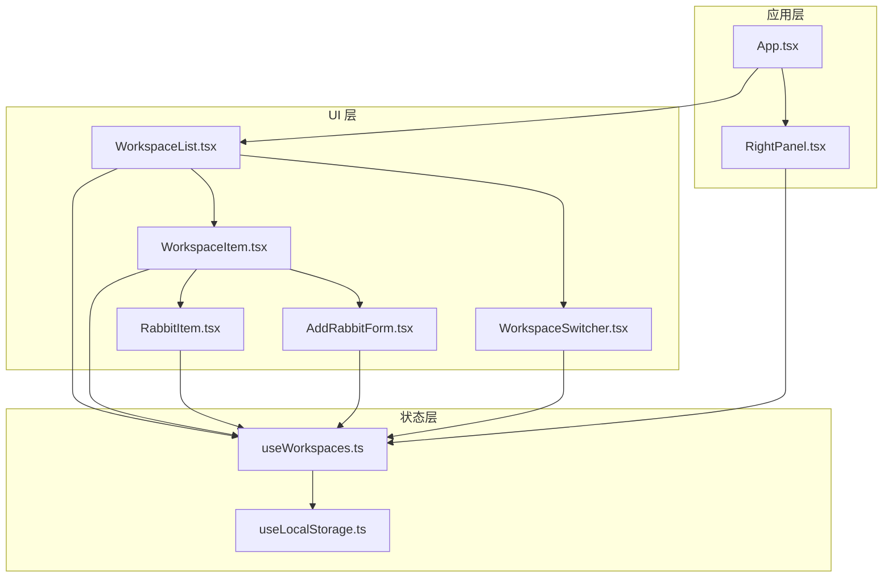
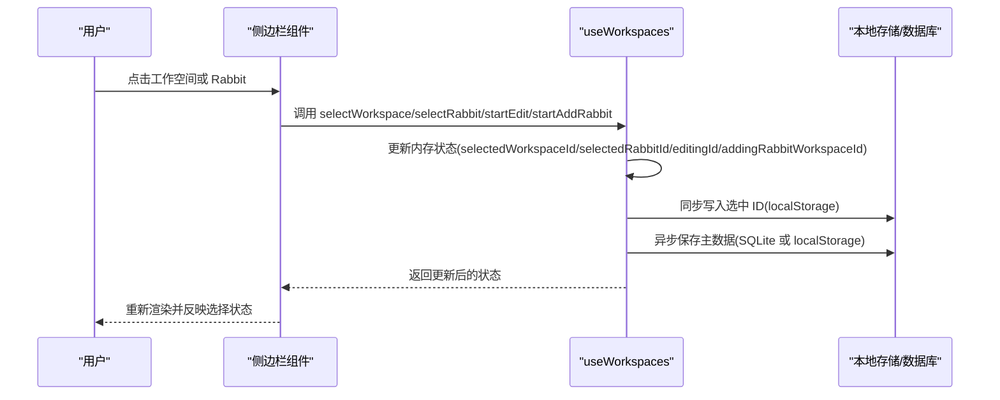
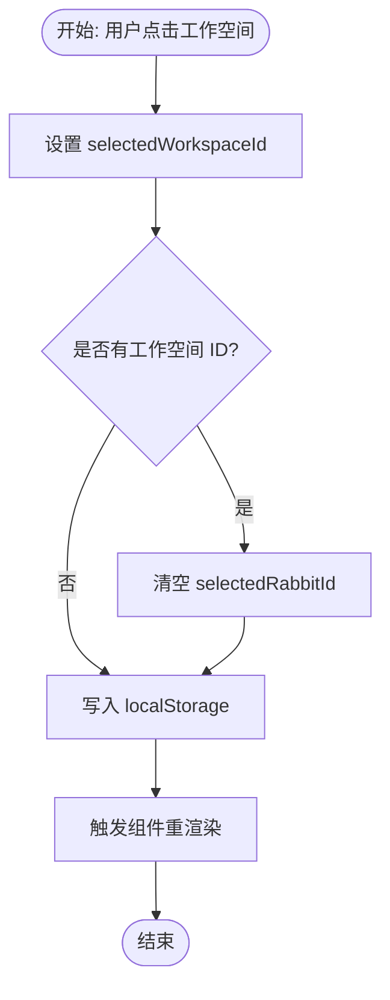
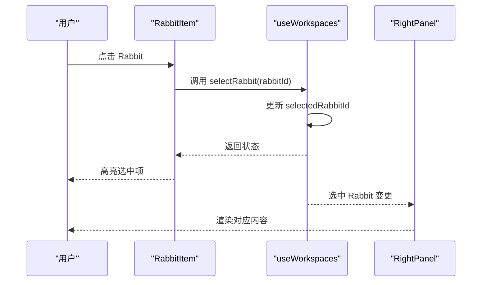
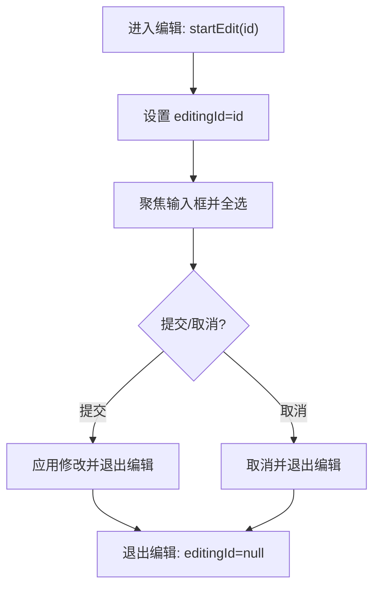
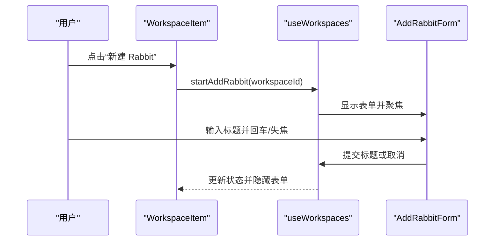
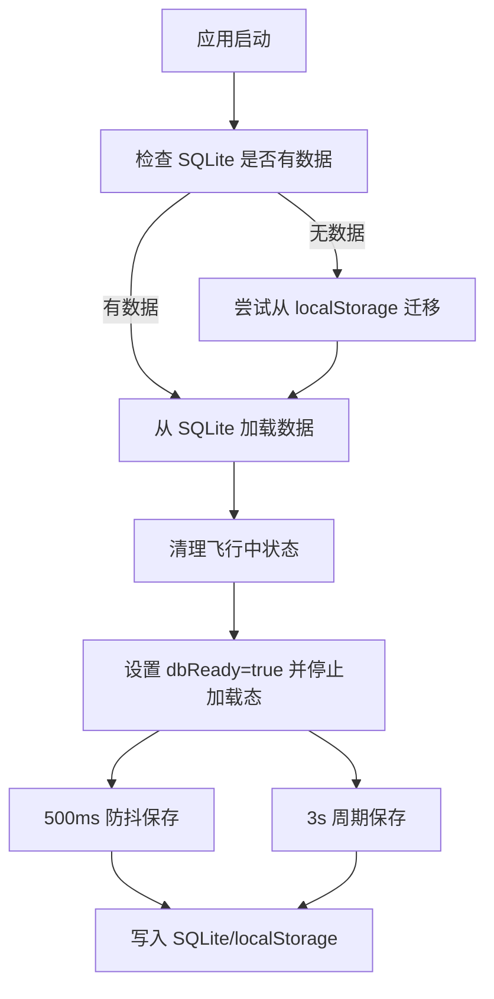
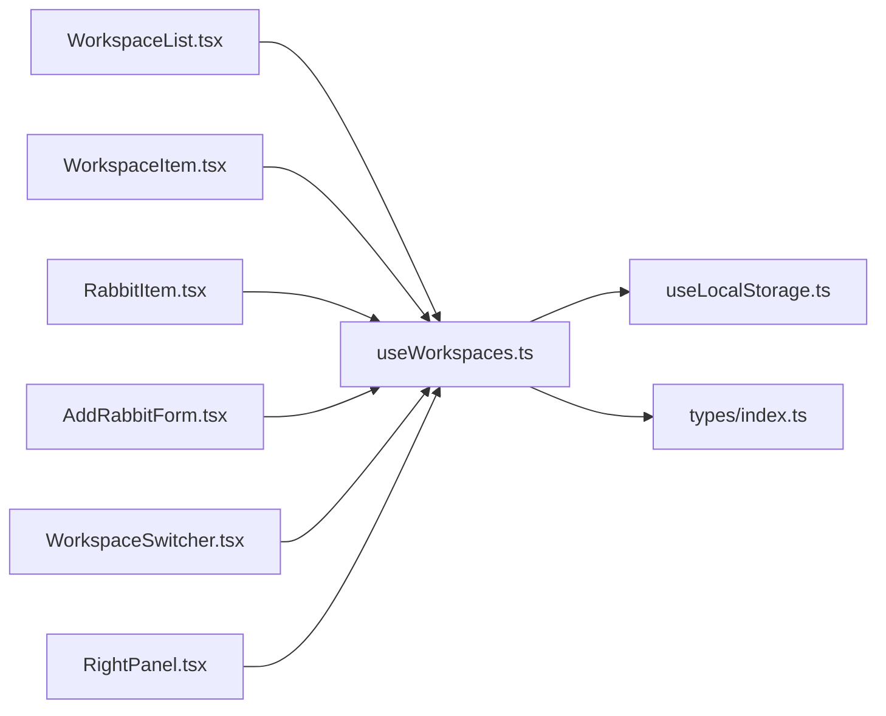

# 选择状态管理

<cite>
**本文档引用的文件**
- [src/hooks/useWorkspaces.ts](file://src/hooks/useWorkspaces.ts)
- [src/hooks/useLocalStorage.ts](file://src/hooks/useLocalStorage.ts)
- [src/types/index.ts](file://src/types/index.ts)
- [src/components/sidebar/WorkspaceList.tsx](file://src/components/sidebar/WorkspaceList.tsx)
- [src/components/sidebar/WorkspaceItem.tsx](file://src/components/sidebar/WorkspaceItem.tsx)
- [src/components/sidebar/RabbitItem.tsx](file://src/components/sidebar/RabbitItem.tsx)
- [src/components/sidebar/AddRabbitForm.tsx](file://src/components/sidebar/AddRabbitForm.tsx)
- [src/components/common/WorkspaceSwitcher.tsx](file://src/components/common/WorkspaceSwitcher.tsx)
- [src/components/RightPanel.tsx](file://src/components/RightPanel.tsx)
- [src/App.tsx](file://src/App.tsx)
</cite>

## 目录
1. [简介](#简介)
2. [项目结构](#项目结构)
3. [核心组件](#核心组件)
4. [架构总览](#架构总览)
5. [详细组件分析](#详细组件分析)
6. [依赖关系分析](#依赖关系分析)
7. [性能考量](#性能考量)
8. [故障排查指南](#故障排查指南)
9. [结论](#结论)

## 简介
本文件系统性阐述“选择状态管理”的设计与实现，围绕工作空间选择(selectWorkspace)、Rabbit 选择(selectRabbit)、编辑模式(startEdit/endEdit)以及添加 Rabbit 模式(startAddRabbit/cancelAddRabbit)四大核心状态展开，覆盖状态持久化、本地存储同步、状态恢复与 UI 更新机制，并提供状态流转图、数据绑定关系与生命周期管理说明，帮助开发者快速理解并优化该模块。

## 项目结构
围绕选择状态管理的关键文件组织如下：
- 状态钩子与持久化：useWorkspaces.ts、useLocalStorage.ts
- 类型定义：types/index.ts
- 侧边栏交互：WorkspaceList.tsx、WorkspaceItem.tsx、RabbitItem.tsx、AddRabbitForm.tsx、WorkspaceSwitcher.tsx
- 右侧面板与视图切换：RightPanel.tsx
- 应用入口与视图控制：App.tsx

图表来源
- [src/App.tsx](file://src/App.tsx)
- [src/hooks/useWorkspaces.ts](file://src/hooks/useWorkspaces.ts)
- [src/hooks/useLocalStorage.ts](file://src/hooks/useLocalStorage.ts)
- [src/components/sidebar/WorkspaceList.tsx](file://src/components/sidebar/WorkspaceList.tsx)
- [src/components/sidebar/WorkspaceItem.tsx](file://src/components/sidebar/WorkspaceItem.tsx)
- [src/components/sidebar/RabbitItem.tsx](file://src/components/sidebar/RabbitItem.tsx)
- [src/components/sidebar/AddRabbitForm.tsx](file://src/components/sidebar/AddRabbitForm.tsx)
- [src/components/common/WorkspaceSwitcher.tsx](file://src/components/common/WorkspaceSwitcher.tsx)
- [src/components/RightPanel.tsx](file://src/components/RightPanel.tsx)

章节来源
- [src/App.tsx](file://src/App.tsx)
- [src/hooks/useWorkspaces.ts](file://src/hooks/useWorkspaces.ts)
- [src/hooks/useLocalStorage.ts](file://src/hooks/useLocalStorage.ts)
- [src/components/sidebar/WorkspaceList.tsx](file://src/components/sidebar/WorkspaceList.tsx)
- [src/components/sidebar/WorkspaceItem.tsx](file://src/components/sidebar/WorkspaceItem.tsx)
- [src/components/sidebar/RabbitItem.tsx](file://src/components/sidebar/RabbitItem.tsx)
- [src/components/sidebar/AddRabbitForm.tsx](file://src/components/sidebar/AddRabbitForm.tsx)
- [src/components/common/WorkspaceSwitcher.tsx](file://src/components/common/WorkspaceSwitcher.tsx)
- [src/components/RightPanel.tsx](file://src/components/RightPanel.tsx)

## 核心组件
- useWorkspaces 钩子：集中管理工作空间与 Rabbit 的选择状态、编辑态与添加态，并负责持久化与恢复。
- useLocalStorage：为小体量的“选中 ID”提供本地存储能力。
- 类型系统：Workspace、Rabbit、AgentMessage 等类型定义支撑状态结构与消息流。
- 侧边栏组件：负责 UI 交互与状态回调，驱动 useWorkspaces 的状态变更。
- 右侧面板：根据选中 Rabbit 渲染对应内容，体现选择状态对 UI 的影响。

章节来源
- [src/hooks/useWorkspaces.ts](file://src/hooks/useWorkspaces.ts)
- [src/hooks/useLocalStorage.ts](file://src/hooks/useLocalStorage.ts)
- [src/types/index.ts](file://src/types/index.ts)
- [src/components/sidebar/WorkspaceList.tsx](file://src/components/sidebar/WorkspaceList.tsx)
- [src/components/sidebar/WorkspaceItem.tsx](file://src/components/sidebar/WorkspaceItem.tsx)
- [src/components/sidebar/RabbitItem.tsx](file://src/components/sidebar/RabbitItem.tsx)
- [src/components/sidebar/AddRabbitForm.tsx](file://src/components/sidebar/AddRabbitForm.tsx)
- [src/components/common/WorkspaceSwitcher.tsx](file://src/components/common/WorkspaceSwitcher.tsx)
- [src/components/RightPanel.tsx](file://src/components/RightPanel.tsx)

## 架构总览
选择状态管理采用“钩子集中管理 + 组件驱动”的模式：
- useWorkspaces 负责：
  - 选择状态：selectedWorkspaceId、selectedRabbitId
  - 编辑态：editingId
  - 添加态：addingRabbitWorkspaceId
  - 数据持久化：localStorage（选中 ID）、SQLite（主数据）
- 侧边栏组件通过回调触发 useWorkspaces 的状态变更，从而驱动 UI 更新与持久化。
- 右侧面板根据选中 Rabbit 的消息与状态渲染相应内容。

图表来源
- [src/hooks/useWorkspaces.ts](file://src/hooks/useWorkspaces.ts)
- [src/hooks/useLocalStorage.ts](file://src/hooks/useLocalStorage.ts)
- [src/components/sidebar/WorkspaceList.tsx](file://src/components/sidebar/WorkspaceList.tsx)
- [src/components/sidebar/WorkspaceItem.tsx](file://src/components/sidebar/WorkspaceItem.tsx)
- [src/components/sidebar/RabbitItem.tsx](file://src/components/sidebar/RabbitItem.tsx)
- [src/components/sidebar/AddRabbitForm.tsx](file://src/components/sidebar/AddRabbitForm.tsx)

## 详细组件分析

### 1) 工作空间选择 selectWorkspace
- 触发方式：侧边栏点击工作空间、右侧面板切换视图时触发。
- 状态变更：
  - 设置 selectedWorkspaceId
  - 若存在工作空间 ID，则清空 selectedRabbitId（避免跨工作空间的无效选择）
- 持久化：通过 useLocalStorage 同步写入本地存储。
- UI 影响：WorkspaceList/WorkspaceItem 根据 isSelected 切换高亮样式；右侧面板根据选中工作空间渲染仓库与索引状态。

图表来源
- [src/hooks/useWorkspaces.ts](file://src/hooks/useWorkspaces.ts)
- [src/components/sidebar/WorkspaceList.tsx](file://src/components/sidebar/WorkspaceList.tsx)
- [src/components/sidebar/WorkspaceItem.tsx](file://src/components/sidebar/WorkspaceItem.tsx)

章节来源
- [src/hooks/useWorkspaces.ts](file://src/hooks/useWorkspaces.ts)
- [src/components/sidebar/WorkspaceList.tsx](file://src/components/sidebar/WorkspaceList.tsx)
- [src/components/sidebar/WorkspaceItem.tsx](file://src/components/sidebar/WorkspaceItem.tsx)

### 2) Rabbit 选择 selectRabbit
- 触发方式：侧边栏点击 Rabbit 条目。
- 状态变更：设置 selectedRabbitId（允许为空以取消选择）。
- UI 影响：RabbitItem 根据 isSelected 高亮；RightPanel 根据选中 Rabbit 的消息与状态渲染“摘要/终端/文件/Spec”。

图表来源
- [src/hooks/useWorkspaces.ts](file://src/hooks/useWorkspaces.ts)
- [src/components/sidebar/RabbitItem.tsx](file://src/components/sidebar/RabbitItem.tsx)
- [src/components/RightPanel.tsx](file://src/components/RightPanel.tsx)

章节来源
- [src/hooks/useWorkspaces.ts](file://src/hooks/useWorkspaces.ts)
- [src/components/sidebar/RabbitItem.tsx](file://src/components/sidebar/RabbitItem.tsx)
- [src/components/RightPanel.tsx](file://src/components/RightPanel.tsx)

### 3) 编辑模式 startEdit/endEdit
- 触发方式：工作空间重命名、Rabbit 重命名。
- 状态变更：
  - startEdit：设置 editingId 为目标项 ID，进入编辑态
  - endEdit：清空 editingId，退出编辑态
- UI 行为：输入框自动聚焦并全选，失焦或回车后提交或取消。

图表来源
- [src/hooks/useWorkspaces.ts](file://src/hooks/useWorkspaces.ts)
- [src/components/sidebar/WorkspaceItem.tsx](file://src/components/sidebar/WorkspaceItem.tsx)
- [src/components/sidebar/RabbitItem.tsx](file://src/components/sidebar/RabbitItem.tsx)

章节来源
- [src/hooks/useWorkspaces.ts](file://src/hooks/useWorkspaces.ts)
- [src/components/sidebar/WorkspaceItem.tsx](file://src/components/sidebar/WorkspaceItem.tsx)
- [src/components/sidebar/RabbitItem.tsx](file://src/components/sidebar/RabbitItem.tsx)

### 4) 添加 Rabbit 模式 startAddRabbit/cancelAddRabbit
- 触发方式：工作空间展开后点击“新建 Rabbit”，或在工作空间菜单中选择“创建 Rabbit”。
- 状态变更：
  - startAddRabbit：设置 addingRabbitWorkspaceId=工作空间 ID，显示 AddRabbitForm
  - cancelAddRabbit：清空添加态，隐藏表单
- 表单行为：回车提交标题，失焦提交或取消；Esc 取消。

图表来源
- [src/hooks/useWorkspaces.ts](file://src/hooks/useWorkspaces.ts)
- [src/components/sidebar/WorkspaceItem.tsx](file://src/components/sidebar/WorkspaceItem.tsx)
- [src/components/sidebar/AddRabbitForm.tsx](file://src/components/sidebar/AddRabbitForm.tsx)

章节来源
- [src/hooks/useWorkspaces.ts](file://src/hooks/useWorkspaces.ts)
- [src/components/sidebar/WorkspaceItem.tsx](file://src/components/sidebar/WorkspaceItem.tsx)
- [src/components/sidebar/AddRabbitForm.tsx](file://src/components/sidebar/AddRabbitForm.tsx)

### 5) 状态持久化与恢复机制
- 选中 ID 持久化：使用 useLocalStorage 保存 selectedWorkspaceId 与 selectedRabbitId，保证页面刷新后仍能恢复到上次的选择。
- 主数据持久化：
  - 首次加载：检查 SQLite 是否已有数据；若无则尝试从 localStorage 迁移
  - 正常流程：从 SQLite 加载工作空间数据，清理“飞行中”状态（如 running->idle、中断的 ask_user_question/expired 等）
  - 双层防抖保存：状态变更后 500ms 触发保存；每 3s 强制保存一次，覆盖连续流式输出场景
  - 降级策略：当 SQLite 不可用时回退到 localStorage
- 状态恢复：组件挂载时读取 localStorage 中的选中 ID，并在 SQLite 数据加载完成后恢复 UI 选择状态。

图表来源
- [src/hooks/useWorkspaces.ts](file://src/hooks/useWorkspaces.ts)
- [src/hooks/useLocalStorage.ts](file://src/hooks/useLocalStorage.ts)

章节来源
- [src/hooks/useWorkspaces.ts](file://src/hooks/useWorkspaces.ts)
- [src/hooks/useLocalStorage.ts](file://src/hooks/useLocalStorage.ts)

### 6) 数据绑定关系与生命周期
- 数据绑定：
  - WorkspaceList/WorkspaceItem/RabbitItem 通过 props 接收选中状态与回调，实现 UI 与状态的双向绑定
  - 选中 ID 通过 useLocalStorage 与 useWorkspaces 同步
- 生命周期：
  - 组件挂载：读取 localStorage 选中 ID，异步加载 SQLite 数据
  - 状态变更：useWorkspaces 内部通过 setState 更新内存状态，同时触发持久化
  - 组件卸载：useEffect 清理定时器与监听，避免内存泄漏

章节来源
- [src/components/sidebar/WorkspaceList.tsx](file://src/components/sidebar/WorkspaceList.tsx)
- [src/components/sidebar/WorkspaceItem.tsx](file://src/components/sidebar/WorkspaceItem.tsx)
- [src/components/sidebar/RabbitItem.tsx](file://src/components/sidebar/RabbitItem.tsx)
- [src/hooks/useWorkspaces.ts](file://src/hooks/useWorkspaces.ts)

## 依赖关系分析
- 组件依赖：
  - WorkspaceList 依赖 useWorkspaces 提供的选中状态与操作方法
  - WorkspaceItem/RabbitItem 依赖 Workspace/Rabbit 类型定义
  - AddRabbitForm 依赖 WorkspaceSwitcher 的工作空间选择能力
- 状态依赖：
  - 选中 ID 依赖 useLocalStorage
  - 主数据依赖 SQLite（优先）与 localStorage（降级）

图表来源
- [src/components/sidebar/WorkspaceList.tsx](file://src/components/sidebar/WorkspaceList.tsx)
- [src/components/sidebar/WorkspaceItem.tsx](file://src/components/sidebar/WorkspaceItem.tsx)
- [src/components/sidebar/RabbitItem.tsx](file://src/components/sidebar/RabbitItem.tsx)
- [src/components/sidebar/AddRabbitForm.tsx](file://src/components/sidebar/AddRabbitForm.tsx)
- [src/components/common/WorkspaceSwitcher.tsx](file://src/components/common/WorkspaceSwitcher.tsx)
- [src/components/RightPanel.tsx](file://src/components/RightPanel.tsx)
- [src/hooks/useWorkspaces.ts](file://src/hooks/useWorkspaces.ts)
- [src/hooks/useLocalStorage.ts](file://src/hooks/useLocalStorage.ts)
- [src/types/index.ts](file://src/types/index.ts)

章节来源
- [src/components/sidebar/WorkspaceList.tsx](file://src/components/sidebar/WorkspaceList.tsx)
- [src/components/sidebar/WorkspaceItem.tsx](file://src/components/sidebar/WorkspaceItem.tsx)
- [src/components/sidebar/RabbitItem.tsx](file://src/components/sidebar/RabbitItem.tsx)
- [src/components/sidebar/AddRabbitForm.tsx](file://src/components/sidebar/AddRabbitForm.tsx)
- [src/components/common/WorkspaceSwitcher.tsx](file://src/components/common/WorkspaceSwitcher.tsx)
- [src/components/RightPanel.tsx](file://src/components/RightPanel.tsx)
- [src/hooks/useWorkspaces.ts](file://src/hooks/useWorkspaces.ts)
- [src/hooks/useLocalStorage.ts](file://src/hooks/useLocalStorage.ts)
- [src/types/index.ts](file://src/types/index.ts)

## 性能考量
- 防抖与周期保存：双层防抖减少频繁写入，3s 周期覆盖流式输出场景，平衡一致性与性能
- 降级策略：SQLite 不可用时回退 localStorage，保证基本可用性
- UI 渲染优化：RightPanel 对 zsh 终端采用可见性隐藏而非卸载，避免 xterm 重排闪烁
- 选择状态最小化：仅维护少量选中 ID，降低内存占用与序列化成本

## 故障排查指南
- 选中状态不生效
  - 检查 useLocalStorage 是否正常写入/读取
  - 确认 useWorkspaces 在数据加载完成后才恢复选中状态
- 选择切换异常
  - 确认 selectWorkspace 是否在设置工作空间 ID 后清空 Rabbit 选择
  - 检查组件 props 是否正确传递选中状态
- 添加 Rabbit 无响应
  - 确认 startAddRabbit 是否设置 addingRabbitWorkspaceId
  - 检查 AddRabbitForm 的键盘事件与失焦处理
- 数据不同步
  - 查看 SQLite 是否可用；不可用时检查 localStorage 写入
  - 确认防抖与周期保存定时器是否正常运行

章节来源
- [src/hooks/useWorkspaces.ts](file://src/hooks/useWorkspaces.ts)
- [src/hooks/useLocalStorage.ts](file://src/hooks/useLocalStorage.ts)
- [src/components/sidebar/AddRabbitForm.tsx](file://src/components/sidebar/AddRabbitForm.tsx)
- [src/components/RightPanel.tsx](file://src/components/RightPanel.tsx)

## 结论
该选择状态管理体系通过 useWorkspaces 钩子集中管理选中状态、编辑态与添加态，并结合 useLocalStorage 与 SQLite 的双层持久化策略，实现了稳定可靠的状态恢复与 UI 更新。侧边栏组件以清晰的交互与明确的回调驱动状态变更，右侧面板则基于选中 Rabbit 的消息与状态提供丰富的上下文内容。整体设计在一致性、性能与可维护性之间取得良好平衡，适合进一步扩展与演进。