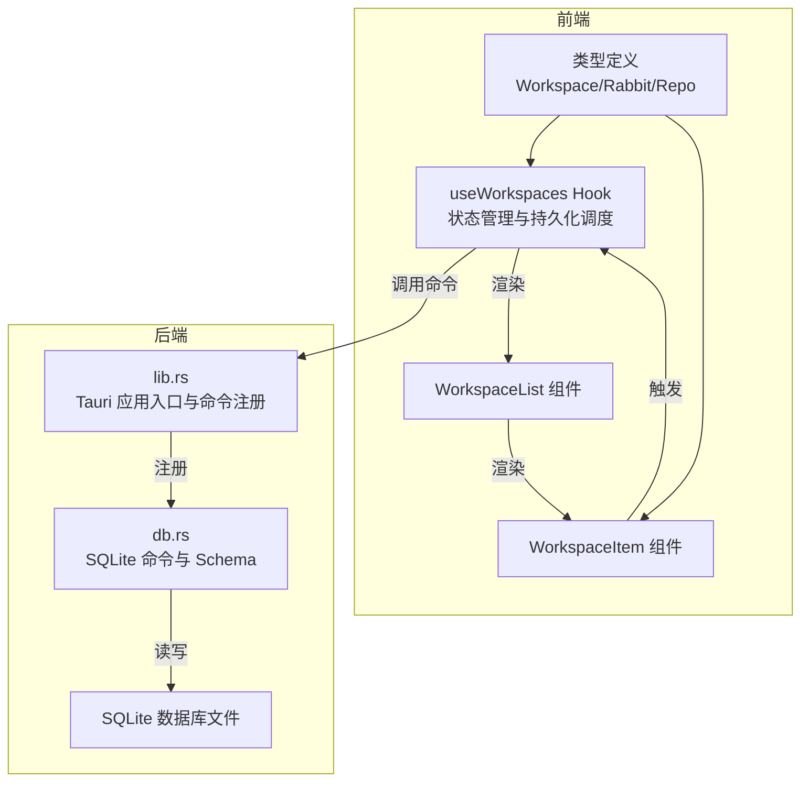
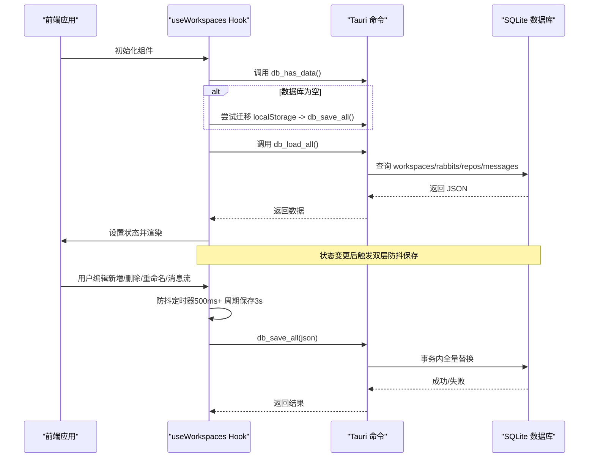
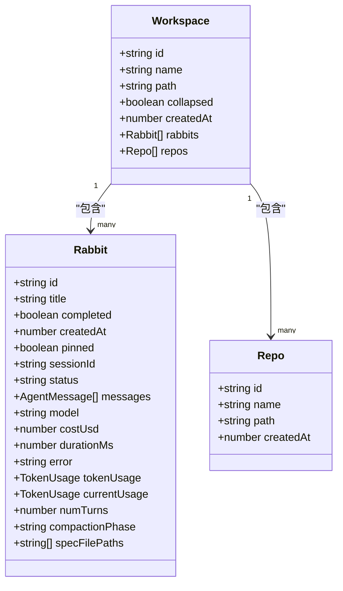
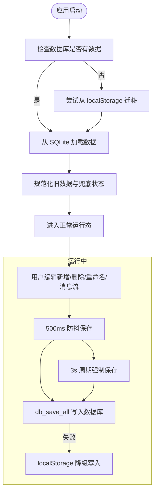
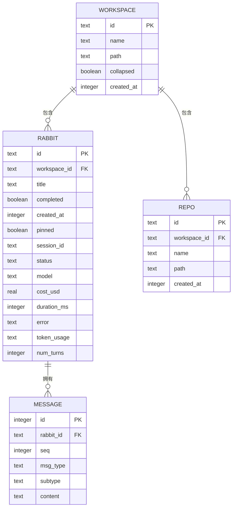
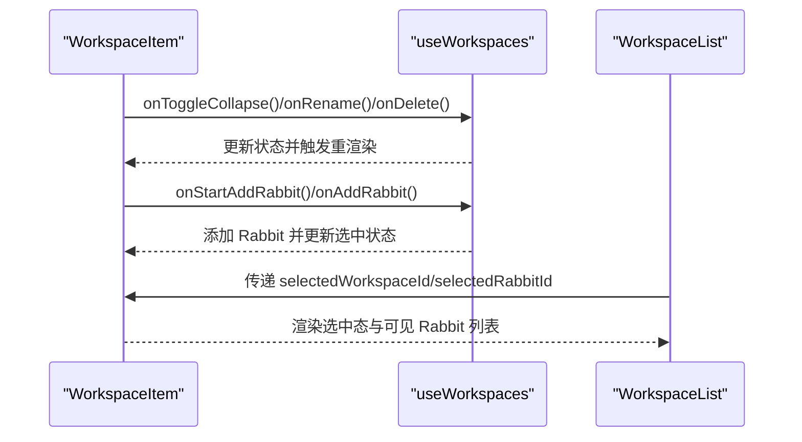
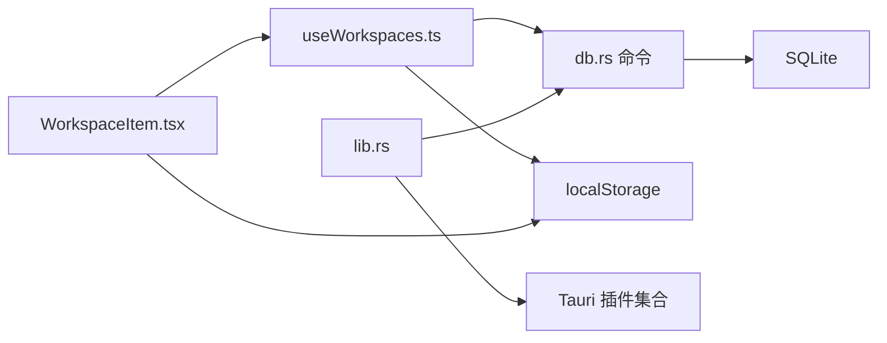

# 工作空间概念与设计

<cite>
**本文引用的文件**
- [useWorkspaces.ts](file://src/hooks/useWorkspaces.ts)
- [index.ts](file://src/types/index.ts)
- [db.rs](file://src-tauri/src/db.rs)
- [lib.rs](file://src-tauri/src/lib.rs)
- [WorkspaceList.tsx](file://src/components/sidebar/WorkspaceList.tsx)
- [WorkspaceItem.tsx](file://src/components/sidebar/WorkspaceItem.tsx)
- [id.ts](file://src/utils/id.ts)
- [Cargo.toml](file://src-tauri/Cargo.toml)
</cite>

## 目录
1. [简介](#简介)
2. [项目结构](#项目结构)
3. [核心组件](#核心组件)
4. [架构总览](#架构总览)
5. [详细组件分析](#详细组件分析)
6. [依赖分析](#依赖分析)
7. [性能考量](#性能考量)
8. [故障排查指南](#故障排查指南)
9. [结论](#结论)
10. [附录](#附录)

## 简介
本文件系统化阐述 RabbitCoding 中“工作空间（Workspace）”的概念、数据模型、关系与层次结构，以及其生命周期管理、状态转换与持久化策略。工作空间是用户组织与管理 AI 助手（Rabbit）与代码仓库（Repo）的顶层容器，围绕它构建了完整的前端状态管理、后端持久化与 UI 展示体系。

## 项目结构
工作空间相关的实现横跨前端 Hook、类型定义、UI 组件与后端数据库模块，形成“前端状态驱动 + 后端持久化”的协作架构：
- 前端状态与持久化：useWorkspaces Hook 负责工作空间数据的加载、迁移、双层防抖保存与降级策略。
- 数据模型：Workspace、Rabbit、Repo 等类型定义统一于前端类型文件。
- 后端持久化：Tauri 命令封装 SQLite 存取，提供建表、查询、全量替换与列迁移能力。
- UI 展示：侧边栏组件负责工作空间与 Rabbit 的可视化呈现与交互。

图表来源
- [useWorkspaces.ts:48-129](file://src/hooks/useWorkspaces.ts#L48-L129)
- [index.ts:34-42](file://src/types/index.ts#L34-L42)
- [lib.rs:125-316](file://src-tauri/src/lib.rs#L125-L316)
- [db.rs:85-138](file://src-tauri/src/db.rs#L85-L138)

章节来源
- [useWorkspaces.ts:48-129](file://src/hooks/useWorkspaces.ts#L48-L129)
- [index.ts:34-42](file://src/types/index.ts#L34-L42)
- [lib.rs:125-316](file://src-tauri/src/lib.rs#L125-L316)
- [db.rs:85-138](file://src-tauri/src/db.rs#L85-L138)

## 核心组件
- 工作空间数据模型
  - Workspace：顶层容器，包含唯一标识、名称、可选路径、折叠状态、创建时间、关联 Rabbit 列表与 Repo 列表。
  - Rabbit：工作空间内的对话/任务实体，包含标题、完成状态、创建时间、会话 ID、状态、消息列表、模型、成本与耗时统计、令牌用量、会话压缩阶段、Spec 文档路径等。
  - Repo：代码仓库，包含唯一标识、名称、路径与创建时间。
- 前端状态与持久化
  - useWorkspaces Hook：负责首次加载与迁移、双层防抖保存（500ms 防抖 + 3s 周期）、降级到 localStorage、清理重启后残留的“进行中”状态、规范化旧数据、提供增删改查与消息流式更新等操作。
- 后端持久化
  - db.rs：定义与前端字段对齐的序列化结构，提供建表、查询与全量替换、列迁移、索引优化等能力。
  - lib.rs：注册 Tauri 命令（db_load_all、db_save_all、db_has_data 等），并初始化数据库实例。

章节来源
- [index.ts:1-716](file://src/types/index.ts#L1-L716)
- [useWorkspaces.ts:14-147](file://src/hooks/useWorkspaces.ts#L14-L147)
- [db.rs:10-74](file://src-tauri/src/db.rs#L10-L74)
- [lib.rs:125-316](file://src-tauri/src/lib.rs#L125-L316)

## 架构总览
工作空间的生命周期贯穿“加载—编辑—保存—展示—回收”的闭环：
- 加载与迁移：启动时检查数据库是否有数据，若无则尝试从 localStorage 迁移，随后从 SQLite 加载；若数据库不可用则降级到 localStorage。
- 编辑与保存：前端状态变更后经双层防抖策略写入数据库；若数据库不可用则写入 localStorage。
- 展示与交互：UI 组件根据工作空间与 Rabbit 的状态进行渲染与交互。
- 回收与兜底：重启后清理“进行中”状态，保证 UI 不会永久卡住。

图表来源
- [useWorkspaces.ts:48-129](file://src/hooks/useWorkspaces.ts#L48-L129)
- [db.rs:167-288](file://src-tauri/src/db.rs#L167-L288)
- [lib.rs:272-285](file://src-tauri/src/lib.rs#L272-L285)

章节来源
- [useWorkspaces.ts:48-129](file://src/hooks/useWorkspaces.ts#L48-L129)
- [db.rs:167-288](file://src-tauri/src/db.rs#L167-L288)
- [lib.rs:272-285](file://src-tauri/src/lib.rs#L272-L285)

## 详细组件分析

### 数据模型与字段定义
- Workspace
  - 字段：id、name、path（可选）、collapsed、createdAt、rabbits（数组）、repos（数组）
  - 约束：id 唯一；createdAt 用于排序与历史记录；collapsed 控制 UI 折叠；rabbits/repo 默认空数组。
- Rabbit
  - 字段：id、title、completed、createdAt、pinned（可选）、sessionId（可选）、status（枚举）、messages（数组）、model、costUsd（可选）、durationMs（可选）、error（可选）、tokenUsage（可选）、currentUsage（可选）、numTurns（可选）、compactionPhase（可选）、specFilePaths（可选）。
  - 约束：status 为运行态时需在重启后收敛至稳定态；messages 中 result 类型消息去重；ask_user_question 类型消息支持 answered/expired 状态。
- Repo
  - 字段：id、name、path、createdAt
  - 约束：id 唯一；createdAt 用于排序。

图表来源
- [index.ts:34-42](file://src/types/index.ts#L34-L42)
- [index.ts:8-32](file://src/types/index.ts#L8-L32)
- [index.ts:1-6](file://src/types/index.ts#L1-L6)

章节来源
- [index.ts:1-716](file://src/types/index.ts#L1-L716)

### 生命周期管理与状态转换
- 加载与迁移
  - 首次启动检查数据库是否存在数据；若无则尝试从 localStorage 迁移；随后从 SQLite 加载；若失败则降级到 localStorage。
- 重启兜底
  - 启动时清理“进行中”状态：running → idle；compacting → null；移除 spec_generating；ask_user_question 未回答标记为 expired。
- 编辑与保存
  - 双层防抖：状态变更后 500ms 写入一次；每 3s 强制保存一次；数据库不可用时写入 localStorage。
- 删除与联动
  - 删除工作空间时同时清除选中的 Rabbit；删除 Rabbit 时同步清理选中状态。

图表来源
- [useWorkspaces.ts:48-129](file://src/hooks/useWorkspaces.ts#L48-L129)
- [useWorkspaces.ts:14-26](file://src/hooks/useWorkspaces.ts#L14-L26)

章节来源
- [useWorkspaces.ts:48-129](file://src/hooks/useWorkspaces.ts#L48-L129)
- [useWorkspaces.ts:14-26](file://src/hooks/useWorkspaces.ts#L14-L26)

### 持久化策略与数据库设计
- 前端持久化策略
  - 以 Workspace[] 为单位进行全量序列化与反序列化；通过 Tauri 命令与后端交互。
  - 采用事务批量写入，保证一致性。
- 后端数据库设计
  - 表结构：workspaces、rabbits、repos、messages；rabbits.messages 以独立表存储，便于按 Rabbit 分片与检索。
  - 索引：按 workspace_id 与 (rabbit_id, seq) 建立索引，优化查询性能。
  - 列迁移：对既有数据库进行幂等列添加（如 token_usage、num_turns），保证向前兼容。
- 命令接口
  - db_load_all：查询并拼装完整数据结构。
  - db_save_all：事务内全量替换。
  - db_has_data：判断是否需要迁移。

图表来源
- [db.rs:85-138](file://src-tauri/src/db.rs#L85-L138)
- [db.rs:167-288](file://src-tauri/src/db.rs#L167-L288)

章节来源
- [db.rs:85-138](file://src-tauri/src/db.rs#L85-L138)
- [db.rs:167-288](file://src-tauri/src/db.rs#L167-L288)
- [lib.rs:272-285](file://src-tauri/src/lib.rs#L272-L285)

### UI 展示与交互
- WorkspaceList 与 WorkspaceItem
  - WorkspaceList 负责渲染工作空间列表；WorkspaceItem 负责单个工作空间的折叠/展开、重命名、删除、Rabbit 新增与管理。
  - Rabbit 列表支持固定（pin）、完成状态切换、重命名、删除与更多项展开。
- 交互流程
  - 用户点击工作空间图标或名称触发展开/折叠；右键菜单提供重命名与删除；添加 Rabbit 表单支持输入标题并提交。
- 数据绑定
  - 通过 useWorkspaces 提供的方法与状态，实现 UI 与数据的双向绑定。

图表来源
- [WorkspaceList.tsx:9-59](file://src/components/sidebar/WorkspaceList.tsx#L9-L59)
- [WorkspaceItem.tsx:37-308](file://src/components/sidebar/WorkspaceItem.tsx#L37-L308)
- [useWorkspaces.ts:299-322](file://src/hooks/useWorkspaces.ts#L299-L322)

章节来源
- [WorkspaceList.tsx:9-59](file://src/components/sidebar/WorkspaceList.tsx#L9-L59)
- [WorkspaceItem.tsx:37-308](file://src/components/sidebar/WorkspaceItem.tsx#L37-L308)
- [useWorkspaces.ts:299-322](file://src/hooks/useWorkspaces.ts#L299-L322)

### 设计决策、技术权衡与扩展性
- 设计决策
  - 使用 UUID 作为主键，确保分布式与跨设备一致性。
  - 将消息拆分为独立表，支持按 Rabbit 快速检索与压缩。
  - 采用“驼峰命名”在后端序列化，与前端字段对齐，减少映射成本。
- 技术权衡
  - SQLite 作为嵌入式数据库，部署简单、性能可靠；对于大规模并发写入，可考虑引入 WAL 模式与索引优化（已实现）。
  - localStorage 降级策略提升可用性，但数据规模受限；适合轻量场景或迁移过渡期。
- 扩展性
  - Schema 支持列迁移，便于后续增加字段（如 token_usage、num_turns）。
  - Rabbit 的消息类型丰富，便于扩展更多 Agent 事件与工具调用链路。
  - UI 组件解耦良好，易于扩展工作空间标签、分组与多租户能力。

章节来源
- [db.rs:149-155](file://src-tauri/src/db.rs#L149-L155)
- [id.ts:1-4](file://src/utils/id.ts#L1-L4)
- [Cargo.toml:20-39](file://src-tauri/Cargo.toml#L20-L39)

## 依赖分析
- 前端依赖
  - useWorkspaces 依赖 Tauri 命令（db_load_all、db_save_all、db_has_data）与本地存储（localStorage）。
  - UI 组件依赖 useWorkspaces 提供的状态与方法。
- 后端依赖
  - db.rs 依赖 rusqlite、serde/serde_json；lib.rs 注册命令并初始化数据库。
- 外部依赖
  - Cargo.toml 指定 rusqlite（bundled 版本）、tauri、插件等。

图表来源
- [useWorkspaces.ts:48-129](file://src/hooks/useWorkspaces.ts#L48-L129)
- [db.rs:392-416](file://src-tauri/src/db.rs#L392-L416)
- [lib.rs:272-316](file://src-tauri/src/lib.rs#L272-L316)
- [Cargo.toml:20-39](file://src-tauri/Cargo.toml#L20-L39)

章节来源
- [useWorkspaces.ts:48-129](file://src/hooks/useWorkspaces.ts#L48-L129)
- [db.rs:392-416](file://src-tauri/src/db.rs#L392-L416)
- [lib.rs:272-316](file://src-tauri/src/lib.rs#L272-L316)
- [Cargo.toml:20-39](file://src-tauri/Cargo.toml#L20-L39)

## 性能考量
- 查询性能
  - 通过索引 idx_rabbits_workspace、idx_repos_workspace、idx_messages_rabbit 优化按工作空间与消息序列的查询。
- 写入性能
  - 事务批量写入（save_all_inner）减少 IO 次数，提升吞吐。
- 内存与序列化
  - 前端以 Workspace[] 为单位序列化/反序列化，避免频繁小对象写入；消息以 JSON 字符串形式存储，便于快速解析。
- 降级策略
  - 数据库不可用时写入 localStorage，保障可用性；但注意 localStorage 的容量限制与同步阻塞风险。

章节来源
- [db.rs:135-137](file://src-tauri/src/db.rs#L135-L137)
- [db.rs:290-386](file://src-tauri/src/db.rs#L290-L386)

## 故障排查指南
- 数据库不可用
  - 现象：db_load_all/db_save_all 抛错，前端降级到 localStorage。
  - 处理：检查数据库文件权限与路径；查看控制台错误日志；确认 Tauri 插件初始化是否成功。
- 迁移失败
  - 现象：首次启动未从 localStorage 迁移成功。
  - 处理：确认 localStorage 中的键名与数据格式正确；检查 db_save_all 的 JSON 解析错误。
- “进行中”状态未恢复
  - 现象：重启后 Rabbit 仍处于 running/compacting 等不稳定状态。
  - 处理：确认 cleanupInflightState 是否生效；检查 sidecar 退出逻辑与兜底重置。
- 消息流式更新异常
  - 现象：流式文本/思考增量未正确合并。
  - 处理：检查 appendDeltaToLastMessage 的消息类型匹配与去重逻辑；确认消息序列与 subtype 一致。

章节来源
- [useWorkspaces.ts:48-95](file://src/hooks/useWorkspaces.ts#L48-L95)
- [useWorkspaces.ts:14-26](file://src/hooks/useWorkspaces.ts#L14-L26)
- [useWorkspaces.ts:404-449](file://src/hooks/useWorkspaces.ts#L404-L449)

## 结论
工作空间作为 RabbitCoding 的核心组织单元，通过清晰的数据模型、稳健的持久化策略与完善的 UI 交互，实现了从加载、编辑、保存到展示的完整闭环。其设计兼顾可用性与扩展性：数据库层面提供事务与索引优化，前端层面提供双层防抖与降级策略，后端层面提供命令注册与列迁移能力。未来可在消息压缩、并发写入与多租户等方面进一步演进。

## 附录
- 实际使用场景与最佳实践
  - 场景一：新建工作空间并添加多个 Rabbit，用于不同项目的 AI 辅助开发。
  - 场景二：导入多个代码仓库，结合 Rabbit 的工具链进行代码分析与生成。
  - 最佳实践：
    - 为工作空间设置明确的路径与文档目录（自动创建 docs/.rabbit/specs）。
    - 合理使用 Rabbit 的 pinned 与完成状态，提高任务管理效率。
    - 定期清理冗余消息与压缩历史会话，降低存储与查询压力。
    - 在数据库不可用时，及时备份 localStorage 数据，避免数据丢失。