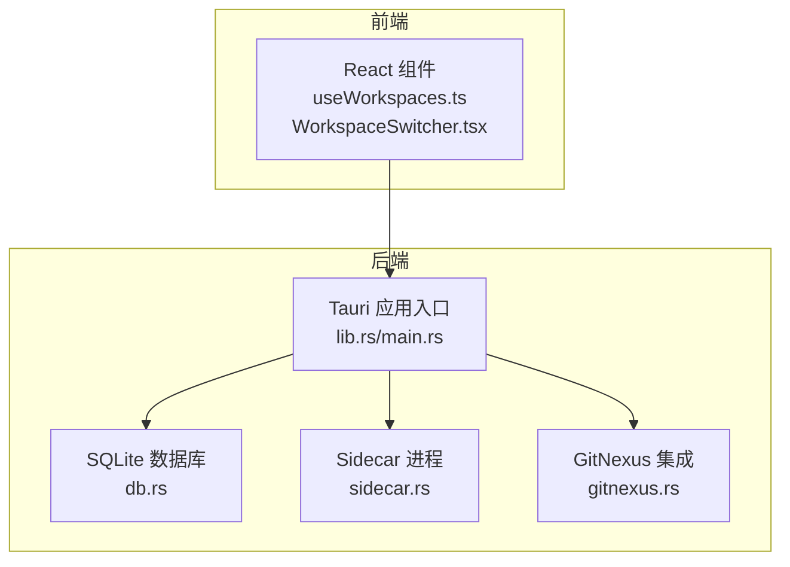
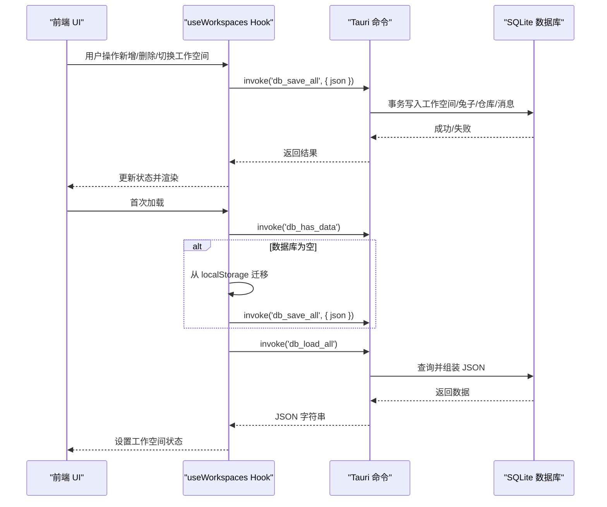
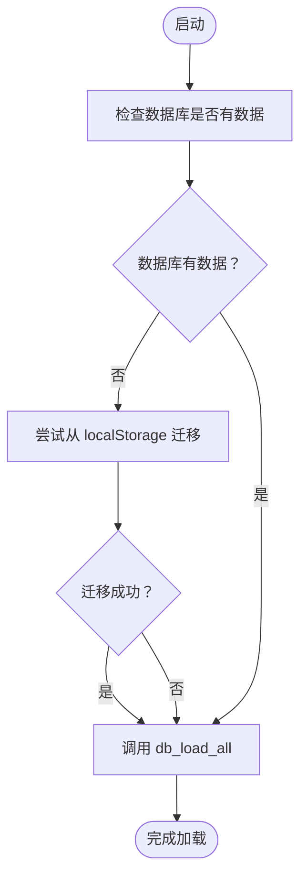
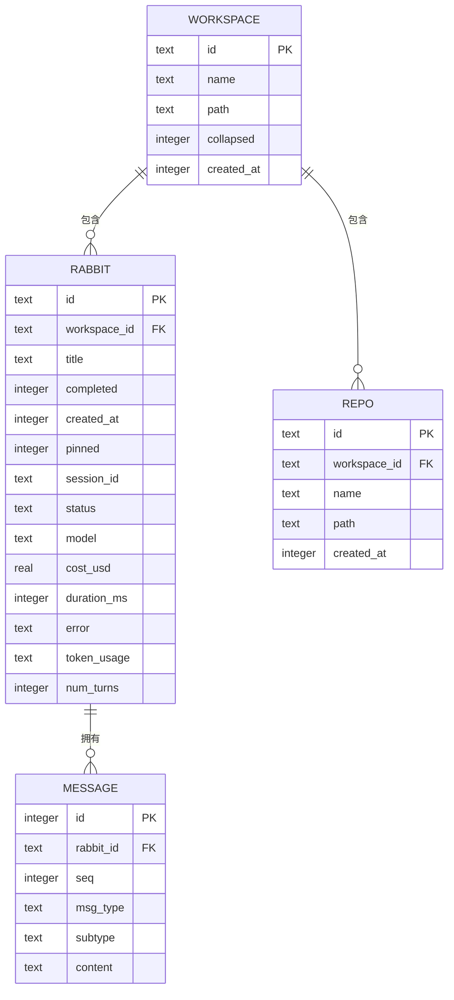
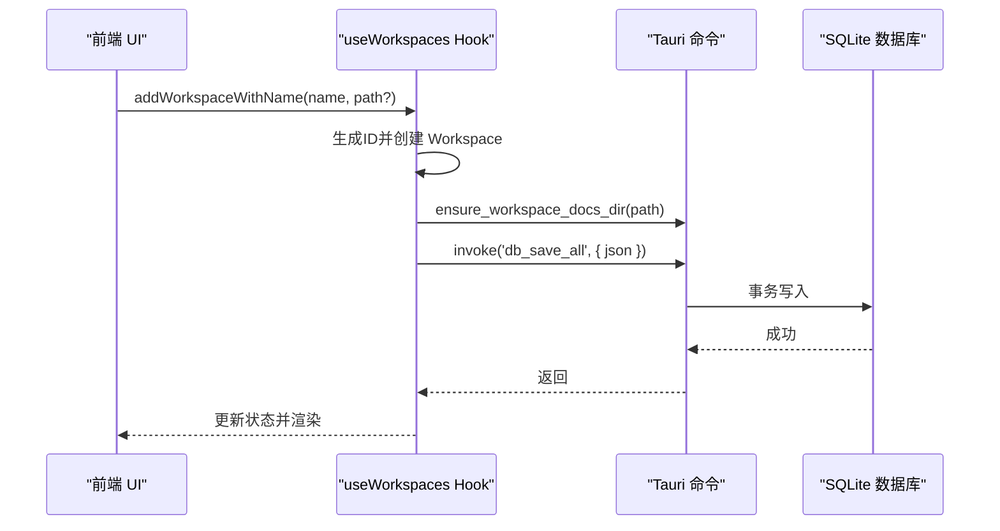
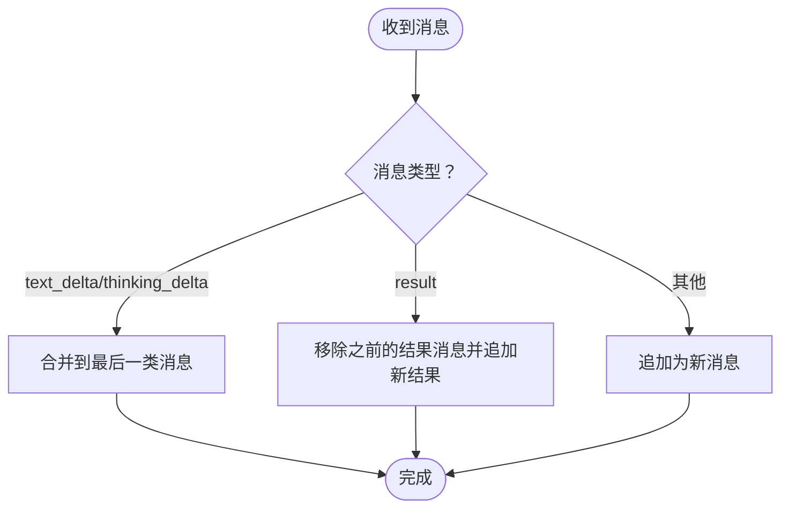
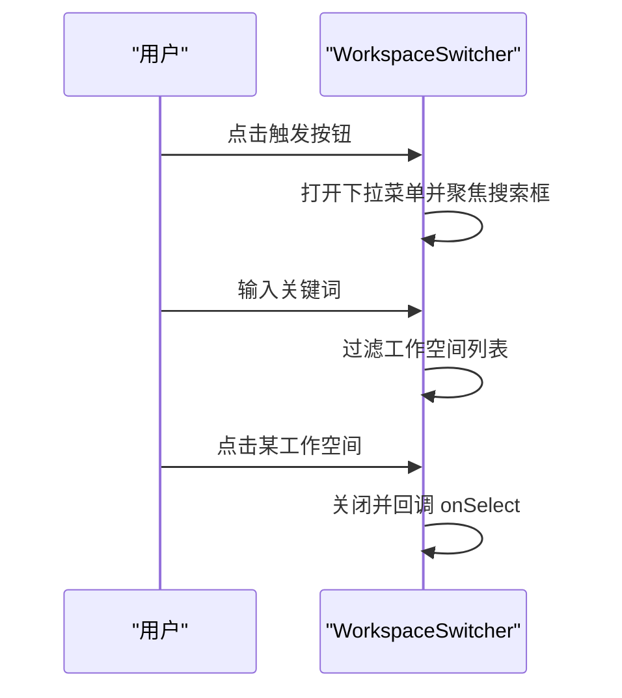
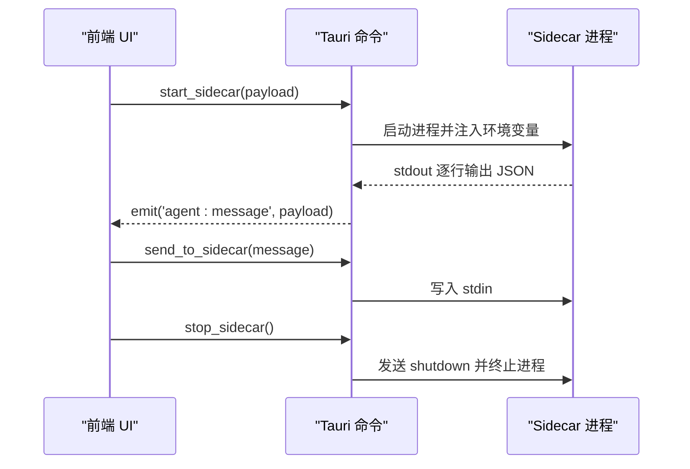
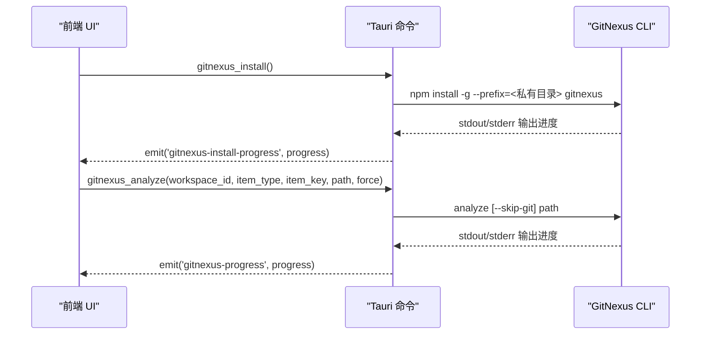
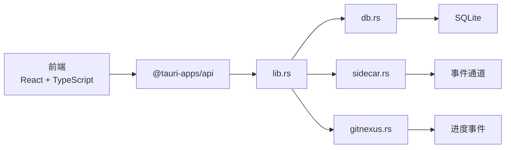

# 工作空间管理

<cite>
**本文档引用的文件**
- [useWorkspaces.ts](file://src/hooks/useWorkspaces.ts)
- [WorkspaceSwitcher.tsx](file://src/components/common/WorkspaceSwitcher.tsx)
- [lib.rs](file://src-tauri/src/lib.rs)
- [db.rs](file://src-tauri/src/db.rs)
- [Cargo.toml](file://src-tauri/Cargo.toml)
- [index.ts](file://src/types/index.ts)
- [gitnexus.rs](file://src-tauri/src/gitnexus.rs)
- [sidecar.rs](file://src-tauri/src/sidecar.rs)
- [main.rs](file://src-tauri/src/main.rs)
- [tauri.conf.json](file://src-tauri/tauri.conf.json)
</cite>

## 目录
1. [简介](#简介)
2. [项目结构](#项目结构)
3. [核心组件](#核心组件)
4. [架构总览](#架构总览)
5. [详细组件分析](#详细组件分析)
6. [依赖关系分析](#依赖关系分析)
7. [性能考量](#性能考量)
8. [故障排查指南](#故障排查指南)
9. [结论](#结论)
10. [附录](#附录)

## 简介
本文件面向 RabbitCoding 工作空间管理系统，系统采用前端 React + Tauri 后端的混合架构，围绕“工作空间”这一核心概念构建，提供仓库管理、会话历史、数据持久化、权限与安全控制、备份与恢复等能力。工作空间是用户组织代码仓库、智能体会话与相关配置的容器，系统通过 SQLite 数据库存储工作空间及其子对象（兔子、仓库、消息），并通过 Tauri 命令桥接前后端，实现高性能、可移植的数据访问与系统集成。

## 项目结构
- 前端（React + TypeScript）位于 src/，负责 UI、状态管理与交互逻辑。
- 后端（Rust + Tauri）位于 src-tauri/，负责数据库、系统集成、侧车进程与命令桥接。
- sidecar/ 为独立的 Node/TypeScript 进程，负责与 Claude Code 等外部系统通信，通过 Tauri 通道与主应用交互。
- 资源与打包配置位于 tauri.conf.json、Cargo.toml 等文件中。

图表来源
- [lib.rs:125-316](file://src-tauri/src/lib.rs#L125-L316)
- [db.rs:140-161](file://src-tauri/src/db.rs#L140-L161)
- [sidecar.rs:60-214](file://src-tauri/src/sidecar.rs#L60-L214)
- [gitnexus.rs:180-311](file://src-tauri/src/gitnexus.rs#L180-L311)

章节来源
- [lib.rs:125-316](file://src-tauri/src/lib.rs#L125-L316)
- [tauri.conf.json:1-52](file://src-tauri/tauri.conf.json#L1-L52)

## 核心组件
- 工作空间（Workspace）：包含名称、路径、折叠状态、创建时间、兔子列表、仓库列表等。
- 兔子（Rabbit）：代表一个智能体会话，包含标题、完成状态、创建时间、状态、消息、模型、成本、时长、错误、令牌用量、轮次、压缩阶段、Spec 文件路径等。
- 仓库（Repo）：关联到工作空间，包含名称、路径与创建时间。
- 数据模型（Types）：统一定义了前端与后端共享的数据结构，确保序列化/反序列化一致性。
- 工作空间 Hook（useWorkspaces.ts）：集中管理工作空间状态、持久化策略、迁移与降级逻辑。
- 工作空间切换器（WorkspaceSwitcher.tsx）：提供工作空间选择与搜索 UI。

章节来源
- [index.ts:34-42](file://src/types/index.ts#L34-L42)
- [index.ts:8-32](file://src/types/index.ts#L8-L32)
- [index.ts:1-6](file://src/types/index.ts#L1-L6)
- [useWorkspaces.ts:28-95](file://src/hooks/useWorkspaces.ts#L28-L95)
- [WorkspaceSwitcher.tsx:12-57](file://src/components/common/WorkspaceSwitcher.tsx#L12-L57)

## 架构总览
系统采用“前端状态 + 后端持久化”的双层架构：
- 前端通过 useWorkspaces.ts 维护内存中的工作空间集合，并通过 Tauri 命令与后端交互。
- 后端通过 SQLite 存储工作空间、兔子、仓库与消息，提供事务性读写与索引优化。
- Sidecar 与 GitNexus 作为外部集成组件，通过 Tauri 事件与命令进行协作。

图表来源
- [useWorkspaces.ts:48-95](file://src/hooks/useWorkspaces.ts#L48-L95)
- [db.rs:392-416](file://src-tauri/src/db.rs#L392-L416)

## 详细组件分析

### 数据模型与持久化策略
- 数据模型：前端与后端通过统一的 TypeScript/Rust 结构体定义数据字段，采用 camelCase 命名风格，保证序列化一致性。
- 持久化策略：
  - 首选 SQLite：通过 Tauri 命令 db_load_all/db_save_all/db_has_data 实现全量读写与存在性检查。
  - 自动迁移：首次启动检测数据库是否存在数据，若无则尝试从 localStorage 迁移。
  - 降级策略：当数据库不可用时，回退到 localStorage 写入。
  - 双层防抖：状态变更后 500ms 触发保存，每 3s 强制保存，兼顾性能与一致性。

图表来源
- [useWorkspaces.ts:48-95](file://src/hooks/useWorkspaces.ts#L48-L95)

章节来源
- [index.ts:34-42](file://src/types/index.ts#L34-L42)
- [index.ts:8-32](file://src/types/index.ts#L8-L32)
- [index.ts:1-6](file://src/types/index.ts#L1-L6)
- [useWorkspaces.ts:48-95](file://src/hooks/useWorkspaces.ts#L48-L95)
- [db.rs:140-161](file://src-tauri/src/db.rs#L140-L161)

### SQLite 数据库结构与索引
- 表结构：
  - workspaces：工作空间基本信息。
  - rabbits：工作空间内的兔子（智能体会话）。
  - repos：工作空间内的仓库。
  - messages：兔子的消息历史，按序号排序。
- 索引：
  - rabbits.workspace_id、repos.workspace_id、messages.rabbit_id+seq。
- 事务写入：save_all_inner 使用 BEGIN/COMMIT/ROLLBACK 确保一致性。
- 列迁移：运行时对 rabbits 新增列（token_usage、num_turns）进行幂等迁移。

图表来源
- [db.rs:85-138](file://src-tauri/src/db.rs#L85-L138)

章节来源
- [db.rs:85-138](file://src-tauri/src/db.rs#L85-L138)
- [db.rs:290-386](file://src-tauri/src/db.rs#L290-L386)

### 工作空间生命周期与操作流程
- 创建工作空间：生成唯一 ID，设置名称、路径、创建时间，标记为折叠状态。
- 删除工作空间：从集合中移除，并清理选中状态。
- 切换工作空间：更新选中 ID，必要时清空当前兔子选中状态。
- 更新路径：自动确保工作空间 docs 目录存在。
- 仓库管理：支持新增、删除、更新仓库信息。
- 兔子管理：支持新增、删除、重命名、完成状态切换、置顶/取消置顶。
- 会话历史：消息以 JSON 字符串形式存储，按序号排序，支持流式增量追加与去重。

图表来源
- [useWorkspaces.ts:149-186](file://src/hooks/useWorkspaces.ts#L149-L186)
- [lib.rs:19-33](file://src-tauri/src/lib.rs#L19-L33)

章节来源
- [useWorkspaces.ts:149-197](file://src/hooks/useWorkspaces.ts#L149-L197)
- [lib.rs:19-33](file://src-tauri/src/lib.rs#L19-L33)

### 会话历史与消息处理
- 消息类型：用户消息、系统初始化、助手文本/思考、工具调用、结果、错误、Spec 生成/确认/已写入、压缩状态/结果、用量更新、提问等。
- 流式增量：支持文本/思考增量追加，自动合并到最后一类消息。
- 去重策略：结果类型消息仅保留最后一条，避免重复显示。
- 用量更新：实时用量更新消息用于展示当前轮次上下文占用。

图表来源
- [useWorkspaces.ts:379-449](file://src/hooks/useWorkspaces.ts#L379-L449)
- [index.ts:65-255](file://src/types/index.ts#L65-L255)

章节来源
- [useWorkspaces.ts:379-503](file://src/hooks/useWorkspaces.ts#L379-L503)
- [index.ts:65-255](file://src/types/index.ts#L65-L255)

### 工作空间切换器
- 功能：显示当前工作空间，支持搜索过滤，点击切换。
- 交互：打开时自动聚焦输入框，点击外部区域关闭，支持键盘导航。

图表来源
- [WorkspaceSwitcher.tsx:12-57](file://src/components/common/WorkspaceSwitcher.tsx#L12-L57)

章节来源
- [WorkspaceSwitcher.tsx:12-124](file://src/components/common/WorkspaceSwitcher.tsx#L12-L124)

### 侧车（Sidecar）与外部集成
- Sidecar 进程：通过 Tauri 命令启动/停止，标准输入输出与主应用事件互通。
- 环境隔离：清理父进程遗留的 API Key 环境变量，重定向 Claude 配置根目录，确保与用户全局环境隔离。
- 事件通道：从 sidecar stdout 逐行读取 JSON 行，通过事件通道发送到前端。

图表来源
- [sidecar.rs:60-214](file://src-tauri/src/sidecar.rs#L60-L214)

章节来源
- [sidecar.rs:60-279](file://src-tauri/src/sidecar.rs#L60-L279)

### GitNexus 集成
- 私有安装：使用内置 Node/npm 将 GitNexus CLI 安装到应用私有目录，避免依赖系统环境。
- 索引与同步：支持分析路径、列出索引、创建/添加/同步组，实时通过事件上报进度。
- 进度事件：stdout/stderr 线程分别读取并 emit 进度事件，便于 UI 展示。

图表来源
- [gitnexus.rs:180-311](file://src-tauri/src/gitnexus.rs#L180-L311)
- [gitnexus.rs:381-561](file://src-tauri/src/gitnexus.rs#L381-L561)

章节来源
- [gitnexus.rs:180-311](file://src-tauri/src/gitnexus.rs#L180-L311)
- [gitnexus.rs:381-561](file://src-tauri/src/gitnexus.rs#L381-L561)

## 依赖关系分析
- 前端依赖：
  - @tauri-apps/api：与后端命令桥接。
  - 自定义 Hook：useWorkspaces.ts 管理工作空间状态与持久化。
  - UI 组件：WorkspaceSwitcher.tsx、文件树、终端等。
- 后端依赖：
  - rusqlite：SQLite 访问。
  - tauri-plugin-*：窗口状态、通知、深链、PTY、FS 等插件。
  - tokio：异步任务（GitNexus 安装/分析）。
- 构建与打包：
  - tauri.conf.json：应用配置、窗口、安全、资源与插件。
  - Cargo.toml：Rust 依赖与特性。

图表来源
- [lib.rs:125-316](file://src-tauri/src/lib.rs#L125-L316)
- [db.rs:140-161](file://src-tauri/src/db.rs#L140-L161)
- [sidecar.rs:60-214](file://src-tauri/src/sidecar.rs#L60-L214)
- [gitnexus.rs:180-311](file://src-tauri/src/gitnexus.rs#L180-L311)

章节来源
- [Cargo.toml:20-39](file://src-tauri/Cargo.toml#L20-L39)
- [tauri.conf.json:1-52](file://src-tauri/tauri.conf.json#L1-L52)

## 性能考量
- SQLite 事务：批量写入使用事务，减少磁盘写入次数，提升吞吐。
- 索引优化：针对外键与排序字段建立索引，加速查询。
- 防抖与周期保存：避免频繁写入，降低 I/O 压力。
- 异步任务：GitNexus 安装/分析使用 tokio::task::spawn_blocking，避免阻塞主线程。
- 环境隔离：Sidecar 启动时清理遗留环境变量，减少不必要的外部调用。

## 故障排查指南
- 数据库不可用：
  - 现象：首次加载失败，回退到 localStorage。
  - 处理：检查数据库文件权限与磁盘空间，确认 Tauri 初始化日志。
- 迁移失败：
  - 现象：localStorage 数据无法迁移到 SQLite。
  - 处理：检查 localStorage 中的键名与 JSON 格式，确认 db_save_all 命令返回。
- 保存失败：
  - 现象：状态变更后未持久化。
  - 处理：查看防抖定时器与周期保存逻辑，确认 db_save_all 返回。
- Sidecar 启动失败：
  - 现象：无法启动或 stdout 无输出。
  - 处理：检查 API Key、Base URL、环境变量注入，查看 stderr 日志。
- GitNexus 安装/分析失败：
  - 现象：安装或分析过程中报错。
  - 处理：查看进度事件中的最后输出行，确认 npm/node 可用性与网络环境。

章节来源
- [useWorkspaces.ts:74-95](file://src/hooks/useWorkspaces.ts#L74-L95)
- [db.rs:392-416](file://src-tauri/src/db.rs#L392-L416)
- [sidecar.rs:151-164](file://src-tauri/src/sidecar.rs#L151-L164)
- [gitnexus.rs:180-311](file://src-tauri/src/gitnexus.rs#L180-L311)

## 结论
RabbitCoding 的工作空间管理以“数据模型统一 + SQLite 持久化 + Tauri 命令桥接”为核心，结合 Sidecar 与 GitNexus 的外部集成，提供了稳定、可扩展的工作空间体验。通过自动迁移、降级策略与双层防抖保存，系统在可靠性与性能之间取得平衡。建议在生产环境中关注数据库权限、磁盘空间与网络环境，确保 Sidecar 与 GitNexus 的正常运行。

## 附录

### 实际使用场景与操作示例
- 场景一：新建工作空间并添加仓库
  - 步骤：调用 addWorkspaceWithName，填写工作空间名称与路径；调用 addRepo 添加仓库；调用 updateWorkspacePath 确保 docs 目录存在。
  - 参考：[useWorkspaces.ts:149-186](file://src/hooks/useWorkspaces.ts#L149-L186)，[useWorkspaces.ts:277-289](file://src/hooks/useWorkspaces.ts#L277-L289)，[lib.rs:19-33](file://src-tauri/src/lib.rs#L19-L33)
- 场景二：切换工作空间
  - 步骤：调用 selectWorkspace 切换选中工作空间；WorkspaceSwitcher 提供 UI 交互。
  - 参考：[useWorkspaces.ts:299-302](file://src/hooks/useWorkspaces.ts#L299-L302)，[WorkspaceSwitcher.tsx:27-31](file://src/components/common/WorkspaceSwitcher.tsx#L27-L31)
- 场景三：查看会话历史
  - 步骤：前端通过 appendRabbitMessage/appendDeltaToLastMessage 追加消息；后端按序号读取并返回。
  - 参考：[useWorkspaces.ts:379-449](file://src/hooks/useWorkspaces.ts#L379-L449)，[db.rs:232-254](file://src-tauri/src/db.rs#L232-L254)

### 权限管理与安全
- 环境隔离：Sidecar 启动时清理遗留 API Key 环境变量，重定向 Claude 配置根目录，避免与用户全局环境冲突。
- 插件与资源：通过 CLAUDE_CONFIG_DIR 隔离插件、技能、代理、命令、钩子、市场、规则、样式等资源。
- 深链与通知：通过 tauri.conf.json 配置深链方案与通知插件，遵循平台限制。

章节来源
- [sidecar.rs:96-131](file://src-tauri/src/sidecar.rs#L96-L131)
- [tauri.conf.json:44-50](file://src-tauri/tauri.conf.json#L44-L50)

### 备份与恢复机制
- 备份：通过 db_load_all 导出完整工作空间数据 JSON，可用于备份。
- 恢复：通过 db_save_all 导入 JSON，实现跨设备或重装后的数据恢复。
- 迁移：首次启动检测数据库是否存在数据，若无则尝试从 localStorage 迁移。

章节来源
- [db.rs:392-416](file://src-tauri/src/db.rs#L392-L416)
- [useWorkspaces.ts:48-95](file://src/hooks/useWorkspaces.ts#L48-L95)