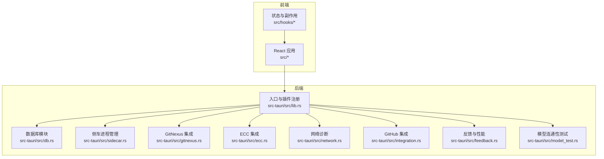
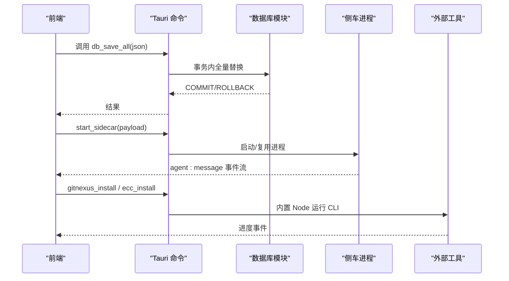
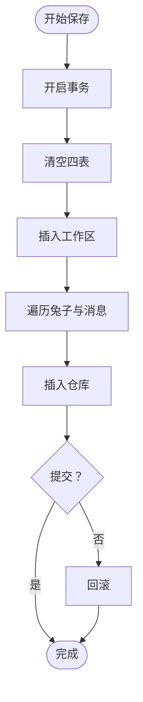
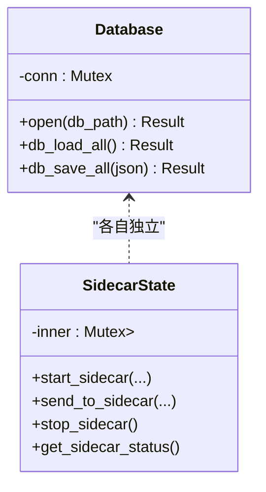
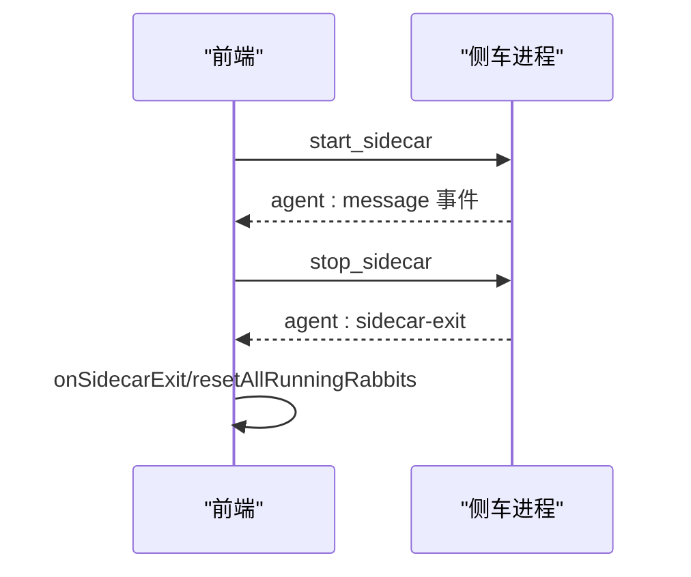
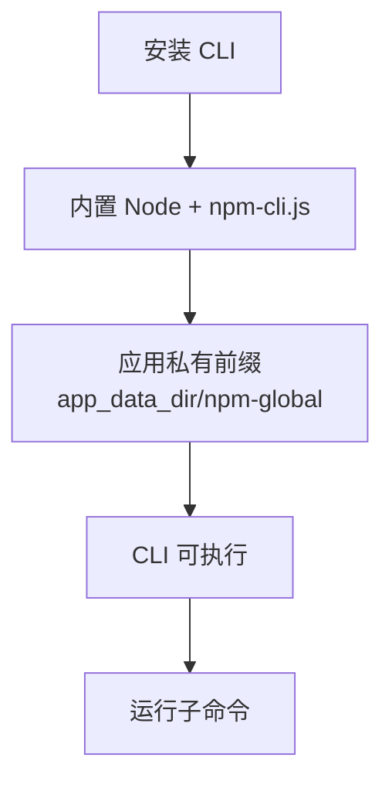
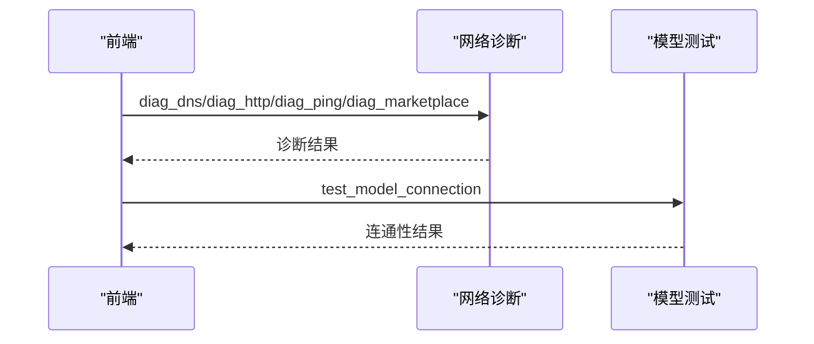
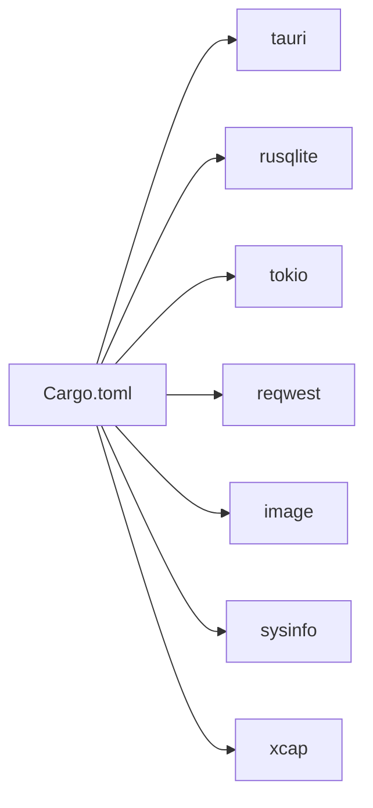

# 一致性保证

<cite>
**本文引用的文件**
- [src-tauri/src/lib.rs](file://src-tauri/src/lib.rs)
- [src-tauri/src/db.rs](file://src-tauri/src/db.rs)
- [src-tauri/src/sidecar.rs](file://src-tauri/src/sidecar.rs)
- [src-tauri/src/gitnexus.rs](file://src-tauri/src/gitnexus.rs)
- [src-tauri/src/ecc.rs](file://src-tauri/src/ecc.rs)
- [src-tauri/src/network.rs](file://src-tauri/src/network.rs)
- [src-tauri/src/integration.rs](file://src-tauri/src/integration.rs)
- [src-tauri/src/feedback.rs](file://src-tauri/src/feedback.rs)
- [src-tauri/src/model_test.rs](file://src-tauri/src/model_test.rs)
- [src/hooks/useAgentContext.tsx](file://src/hooks/useAgentContext.tsx)
- [sidecar/src/agent.ts](file://sidecar/src/agent.ts)
- [src-tauri/Cargo.toml](file://src-tauri/Cargo.toml)
</cite>

## 目录
1. [简介](#简介)
2. [项目结构](#项目结构)
3. [核心组件](#核心组件)
4. [架构总览](#架构总览)
5. [详细组件分析](#详细组件分析)
6. [依赖关系分析](#依赖关系分析)
7. [性能考量](#性能考量)
8. [故障排查指南](#故障排查指南)
9. [结论](#结论)
10. [附录](#附录)

## 简介
本文件聚焦 RabbitCoding 的数据一致性保证机制，系统性阐述以下主题：
- 数据竞态条件的预防与处理策略
- 事务处理、并发控制与锁机制
- 活跃状态清理、异常恢复与数据修复
- 数据校验规则、完整性检查与错误恢复流程
- 一致性保证最佳实践与常见问题解决方案

通过对 Rust 后端数据库模块、侧车进程管理、外部工具集成与前端状态机的综合分析，形成一套可落地的一致性保障方案。

## 项目结构
RabbitCoding 采用 Tauri + React 技术栈，Rust 后端位于 src-tauri，前端位于 src。后端以模块化方式组织，涵盖数据库、侧车、外部工具集成、网络诊断、反馈收集与模型连通性测试等功能。

图表来源
- [src-tauri/src/lib.rs:375-569](file://src-tauri/src/lib.rs#L375-L569)
- [src-tauri/src/db.rs:80-161](file://src-tauri/src/db.rs#L80-L161)
- [src-tauri/src/sidecar.rs:6-57](file://src-tauri/src/sidecar.rs#L6-L57)
- [src-tauri/src/gitnexus.rs:179-379](file://src-tauri/src/gitnexus.rs#L179-L379)
- [src-tauri/src/ecc.rs:144-200](file://src-tauri/src/ecc.rs#L144-L200)
- [src-tauri/src/network.rs:366-863](file://src-tauri/src/network.rs#L366-L863)
- [src-tauri/src/integration.rs:140-231](file://src-tauri/src/integration.rs#L140-L231)
- [src-tauri/src/feedback.rs:119-282](file://src-tauri/src/feedback.rs#L119-L282)
- [src-tauri/src/model_test.rs:78-207](file://src-tauri/src/model_test.rs#L78-L207)

章节来源
- [src-tauri/src/lib.rs:375-569](file://src-tauri/src/lib.rs#L375-L569)

## 核心组件
- 数据库层（Rusqlite + WAL + 事务）：提供 ACID 事务、外键约束与索引，确保工作区、兔子、仓库与消息的强一致写入与读取。
- 侧车进程管理：通过互斥状态与进程生命周期管理，避免重复启动与资源竞争。
- 外部工具集成：GitNexus/ECC 通过内置 Node 运行时与私有前缀隔离，减少系统级依赖带来的竞态。
- 网络诊断与模型连通性测试：提供可重复的网络与认证验证，降低因网络波动导致的数据不一致风险。
- 前端状态机：对侧车退出与超时进行统一收敛，防止 UI 长期挂起造成状态漂移。

章节来源
- [src-tauri/src/db.rs:80-161](file://src-tauri/src/db.rs#L80-L161)
- [src-tauri/src/sidecar.rs:6-57](file://src-tauri/src/sidecar.rs#L6-L57)
- [src-tauri/src/gitnexus.rs:179-379](file://src-tauri/src/gitnexus.rs#L179-L379)
- [src-tauri/src/ecc.rs:144-200](file://src-tauri/src/ecc.rs#L144-L200)
- [src-tauri/src/network.rs:366-863](file://src-tauri/src/network.rs#L366-L863)
- [src-tauri/src/model_test.rs:78-207](file://src-tauri/src/model_test.rs#L78-L207)
- [src/hooks/useAgentContext.tsx:131-193](file://src/hooks/useAgentContext.tsx#L131-L193)

## 架构总览
Rust 后端通过 Tauri 暴露命令接口，前端通过 IPC 调用。数据库采用 WAL 模式与事务封装，侧车进程通过子进程管理，外部工具通过内置 Node 运行时执行，网络诊断与模型测试提供一致性前置校验。

图表来源
- [src-tauri/src/lib.rs:522-566](file://src-tauri/src/lib.rs#L522-L566)
- [src-tauri/src/db.rs:290-406](file://src-tauri/src/db.rs#L290-L406)
- [src-tauri/src/sidecar.rs:60-214](file://src-tauri/src/sidecar.rs#L60-L214)
- [src-tauri/src/gitnexus.rs:183-311](file://src-tauri/src/gitnexus.rs#L183-L311)
- [src-tauri/src/ecc.rs:205-290](file://src-tauri/src/ecc.rs#L205-L290)

## 详细组件分析

### 数据库与事务一致性（ACID）
- 事务封装：保存操作在单个事务中执行，先清空四表，再批量插入，失败则回滚，确保“全有或全无”。
- 外键与级联：工作区删除触发兔子与仓库级联删除，消息按兔子级联删除，避免悬挂引用。
- 索引优化：针对工作区与兔子、仓库、消息建立索引，提升查询效率与一致性读取稳定性。
- WAL 模式：开启 WAL，提高并发读写能力，减少锁竞争。
- 列迁移：幂等地添加新列，兼容历史数据库。

图表来源
- [src-tauri/src/db.rs:290-386](file://src-tauri/src/db.rs#L290-L386)

章节来源
- [src-tauri/src/db.rs:80-161](file://src-tauri/src/db.rs#L80-L161)
- [src-tauri/src/db.rs:290-406](file://src-tauri/src/db.rs#L290-L406)

### 并发控制与锁机制
- 数据库锁：Rusqlite 使用文件锁与 WAL 模式，配合事务边界，天然实现写入串行化与读写分离。
- 互斥状态：侧车状态通过 Mutex 保护，避免重复启动与句柄泄漏。
- 异步任务：网络诊断与外部工具安装通过 tokio::task::spawn_blocking，避免阻塞主线程，同时通过线程池与管道读取保证事件有序。

图表来源
- [src-tauri/src/db.rs:80-161](file://src-tauri/src/db.rs#L80-L161)
- [src-tauri/src/sidecar.rs:6-57](file://src-tauri/src/sidecar.rs#L6-L57)

章节来源
- [src-tauri/src/db.rs:80-161](file://src-tauri/src/db.rs#L80-L161)
- [src-tauri/src/sidecar.rs:6-57](file://src-tauri/src/sidecar.rs#L6-L57)

### 侧车进程与活跃状态清理
- 进程生命周期：启动前检查已有进程存活，避免重复启动；退出时清理句柄；停止时先优雅关闭再强制 kill。
- 事件驱动：从 stdout/stderr 线程读取事件，统一通过 Emitter 发送到前端。
- 前端收敛：侧车退出或超时，前端统一将进行中的查询标记为 error，避免 UI 长期 loading。

图表来源
- [src-tauri/src/sidecar.rs:60-279](file://src-tauri/src/sidecar.rs#L60-L279)
- [src/hooks/useAgentContext.tsx:131-193](file://src/hooks/useAgentContext.tsx#L131-L193)
- [sidecar/src/agent.ts:320-356](file://sidecar/src/agent.ts#L320-L356)

章节来源
- [src-tauri/src/sidecar.rs:60-279](file://src-tauri/src/sidecar.rs#L60-L279)
- [src/hooks/useAgentContext.tsx:131-193](file://src/hooks/useAgentContext.tsx#L131-L193)
- [sidecar/src/agent.ts:320-356](file://sidecar/src/agent.ts#L320-L356)

### 外部工具集成与隔离
- GitNexus：通过内置 Node.js 与私有 npm 前缀安装 CLI，避免系统级依赖冲突；安装/卸载/检测均在私有目录进行。
- ECC：检测/安装/卸载均在用户家目录的 Claude 配置隔离目录中进行，避免污染全局环境。

图表来源
- [src-tauri/src/gitnexus.rs:183-311](file://src-tauri/src/gitnexus.rs#L183-L311)
- [src-tauri/src/ecc.rs:205-290](file://src-tauri/src/ecc.rs#L205-L290)

章节来源
- [src-tauri/src/gitnexus.rs:179-379](file://src-tauri/src/gitnexus.rs#L179-L379)
- [src-tauri/src/ecc.rs:144-200](file://src-tauri/src/ecc.rs#L144-L200)

### 网络诊断与模型连通性测试
- 网络诊断：DNS、HTTP、Ping、Marketplace 多维度诊断，输出代理信息与连通性指标，辅助定位网络层面的一致性问题。
- 模型连通性测试：最小化 Anthropic Messages 请求，验证 Base URL、API Key、模型 ID 正确性，避免后续调用阶段出现认证或端点错误。

图表来源
- [src-tauri/src/network.rs:366-863](file://src-tauri/src/network.rs#L366-L863)
- [src-tauri/src/model_test.rs:78-207](file://src-tauri/src/model_test.rs#L78-L207)

章节来源
- [src-tauri/src/network.rs:366-863](file://src-tauri/src/network.rs#L366-L863)
- [src-tauri/src/model_test.rs:78-207](file://src-tauri/src/model_test.rs#L78-L207)

### 数据校验规则与完整性检查
- 数据结构校验：前端与后端均采用 camelCase 字段命名，JSON 序列化/反序列化严格校验，避免字段缺失或类型不匹配。
- 外键完整性：通过 SQLite 外键约束与级联删除，确保删除工作区时同步清理兔子、仓库与消息。
- 索引完整性：为高频查询字段建立索引，保证查询稳定与一致性读取。
- 列迁移：新增列时采用幂等 ALTER TABLE，避免重复执行导致的错误。

章节来源
- [src-tauri/src/db.rs:85-138](file://src-tauri/src/db.rs#L85-L138)
- [src-tauri/src/db.rs:149-155](file://src-tauri/src/db.rs#L149-L155)

### 异常恢复与数据修复
- 事务回滚：保存失败自动回滚，保证数据库始终处于一致状态。
- 侧车异常收敛：侧车退出或超时，前端统一将进行中的查询标记为 error，避免状态漂移。
- 外部工具失败诊断：安装/卸载/检测过程捕获 stderr/stdout，聚合错误信息，便于快速定位问题。
- 网络与认证前置校验：在网络与认证不稳定时提前发现，减少后续调用失败的概率。

章节来源
- [src-tauri/src/db.rs:290-305](file://src-tauri/src/db.rs#L290-L305)
- [src/hooks/useAgentContext.tsx:180-193](file://src/hooks/useAgentContext.tsx#L180-L193)
- [src-tauri/src/gitnexus.rs:208-311](file://src-tauri/src/gitnexus.rs#L208-L311)
- [src-tauri/src/ecc.rs:224-290](file://src-tauri/src/ecc.rs#L224-L290)

## 依赖关系分析
Rust 后端通过 Cargo 管理依赖，核心包括 Tauri、rusqlite、tokio、reqwest、image 等。这些依赖共同支撑数据库、并发、网络与图像处理等能力。

图表来源
- [src-tauri/Cargo.toml:20-39](file://src-tauri/Cargo.toml#L20-L39)

章节来源
- [src-tauri/Cargo.toml:20-39](file://src-tauri/Cargo.toml#L20-L39)

## 性能考量
- WAL 模式与索引：WAL 提升并发读写性能，索引优化查询路径，降低锁竞争。
- 事务批处理：批量插入减少事务次数与锁持有时间。
- 异步 I/O：网络诊断与外部工具通过异步任务执行，避免阻塞主线程。
- 内置运行时：外部工具使用内置 Node.js 与私有前缀，减少系统级依赖带来的性能抖动。

## 故障排查指南
- 数据库保存失败：检查事务日志与回滚分支，确认 JSON 结构与字段映射是否正确。
- 侧车进程异常：检查 stdout/stderr 线程是否正常，确认 CLAUDE_CONFIG_DIR 隔离目录是否存在。
- 外部工具安装失败：查看 stderr/stdout 聚合信息，确认内置 Node 与 npm-cli.js 是否存在。
- 网络诊断异常：核对代理配置与 DNS/HTTP/Ping 结果，定位网络瓶颈。
- 模型连通性失败：根据 HTTP 状态码与错误信息调整 Base URL、API Key 或模型 ID。

章节来源
- [src-tauri/src/db.rs:290-305](file://src-tauri/src/db.rs#L290-L305)
- [src-tauri/src/sidecar.rs:175-209](file://src-tauri/src/sidecar.rs#L175-L209)
- [src-tauri/src/gitnexus.rs:208-311](file://src-tauri/src/gitnexus.rs#L208-L311)
- [src-tauri/src/network.rs:366-863](file://src-tauri/src/network.rs#L366-L863)
- [src-tauri/src/model_test.rs:171-207](file://src-tauri/src/model_test.rs#L171-L207)

## 结论
RabbitCoding 通过事务封装、WAL 模式、外键级联与索引优化实现了数据库层面的一致性；通过侧车进程互斥状态与前端状态机收敛，有效避免了活跃状态漂移；通过内置运行时与隔离目录，降低了外部依赖引发的竞态与不一致；通过网络诊断与模型连通性测试，将潜在问题前置发现。整体设计在工程实践中具备良好的可维护性与可扩展性。

## 附录
- 最佳实践
  - 所有写操作使用事务封装，失败即回滚。
  - 对高频查询字段建立索引，避免全表扫描。
  - 侧车进程启动前检查与复用，避免重复启动。
  - 外部工具安装使用内置运行时与私有前缀，确保隔离。
  - 前端对异常与超时进行统一收敛，避免 UI 长期挂起。
- 常见问题
  - 保存失败：检查 JSON 结构与字段映射，确认事务回滚逻辑。
  - 侧车退出：检查 stdout/stderr 日志，确认 CLAUDE_CONFIG_DIR 隔离。
  - 外部工具安装失败：检查内置 Node 与 npm-cli.js，查看 stderr/stdout。
  - 网络不稳定：使用网络诊断工具定位代理与连通性问题。
  - 认证失败：使用模型连通性测试确认 Base URL、API Key、模型 ID。