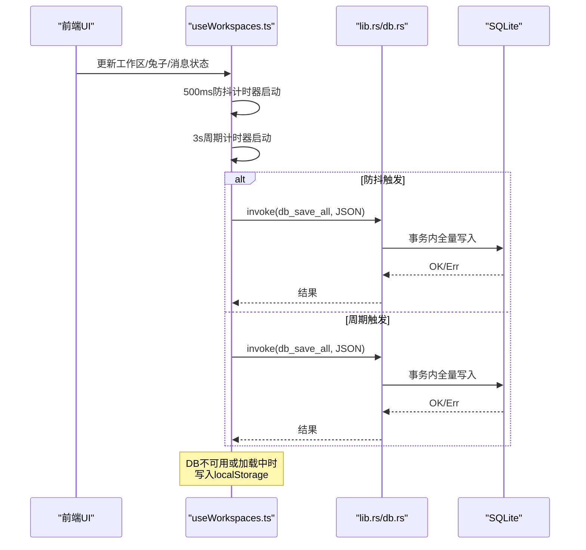
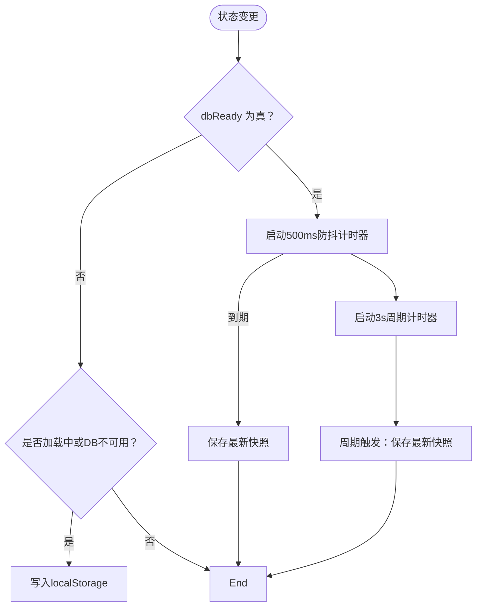
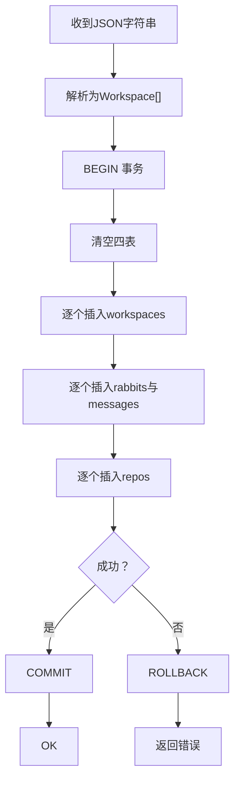
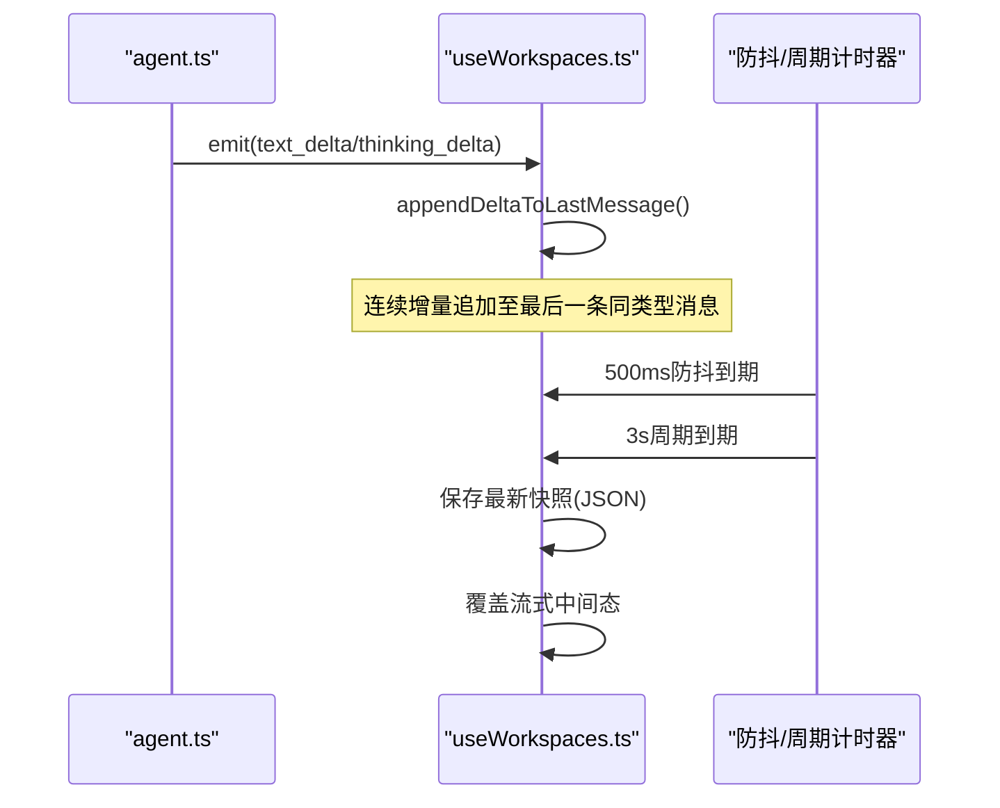
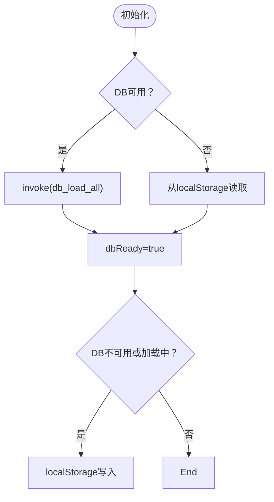
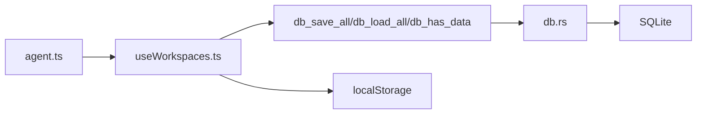

# 保存策略

<cite>
**本文引用的文件**
- [src/hooks/useWorkspaces.ts](file://src/hooks/useWorkspaces.ts)
- [src/hooks/useLocalStorage.ts](file://src/hooks/useLocalStorage.ts)
- [src-tauri/src/db.rs](file://src-tauri/src/db.rs)
- [src-tauri/src/lib.rs](file://src-tauri/src/lib.rs)
- [sidecar/src/agent.ts](file://sidecar/src/agent.ts)
</cite>

## 目录
1. [简介](#简介)
2. [项目结构](#项目结构)
3. [核心组件](#核心组件)
4. [架构总览](#架构总览)
5. [详细组件分析](#详细组件分析)
6. [依赖关系分析](#依赖关系分析)
7. [性能考量](#性能考量)
8. [故障排查指南](#故障排查指南)
9. [结论](#结论)

## 简介
本文件针对 RabbitCoding 的“双层防抖保存”机制进行全面技术说明，涵盖以下要点：
- 双层防抖设计：500ms 防抖层与 3s 周期层的协同工作方式
- 强制保存触发条件与流式输出场景下的数据覆盖策略
- 降级保存机制（localStorage）与异常处理流程
- 性能优化建议与内存管理策略

## 项目结构
与保存策略相关的核心位置如下：
- 前端 React Hook：负责状态管理、双层防抖与降级写入
- Tauri 后端：SQLite 数据库封装与命令接口
- 侧车（sidecar）：流式输出事件的产生方

```mermaid
graph TB
subgraph "前端"
UWS["useWorkspaces.ts<br/>状态与保存逻辑"]
ULS["useLocalStorage.ts<br/>通用本地存储Hook"]
end
subgraph "后端(Tauri)"
LIB["lib.rs<br/>命令注册与DB初始化"]
DB["db.rs<br/>SQLite封装与事务写入"]
end
subgraph "侧车"
AG["agent.ts<br/>流式事件产生"]
end
UWS --> |invoke(db_save_all)| LIB
LIB --> DB
AG --> |emit(assistant deltas)| UWS
UWS --> |localStorage fallback| ULS
```

图表来源
- [src/hooks/useWorkspaces.ts:101-129](file://src/hooks/useWorkspaces.ts#L101-L129)
- [src-tauri/src/lib.rs:374-566](file://src-tauri/src/lib.rs#L374-L566)
- [src-tauri/src/db.rs:399-406](file://src-tauri/src/db.rs#L399-L406)
- [sidecar/src/agent.ts:166-198](file://sidecar/src/agent.ts#L166-L198)

章节来源
- [src/hooks/useWorkspaces.ts:101-129](file://src/hooks/useWorkspaces.ts#L101-L129)
- [src-tauri/src/lib.rs:374-566](file://src-tauri/src/lib.rs#L374-L566)
- [src-tauri/src/db.rs:399-406](file://src-tauri/src/db.rs#L399-L406)
- [sidecar/src/agent.ts:166-198](file://sidecar/src/agent.ts#L166-L198)

## 核心组件
- 双层防抖保存（前端）
  - 500ms 防抖层：在状态变更后延时 500ms 触发一次保存，合并高频更新
  - 3s 周期层：每 3 秒强制保存一次，覆盖连续流式输出导致的中间态
  - 降级层：当数据库不可用或加载中时，写入 localStorage
- 数据库写入（后端）
  - 事务性全量替换：清空四表后批量写入，保证一致性
  - 命令接口：db_save_all、db_load_all、db_has_data
- 流式输出（侧车）
  - 产生 text_delta/thinking_delta 等增量事件，驱动前端消息追加

章节来源
- [src/hooks/useWorkspaces.ts:101-129](file://src/hooks/useWorkspaces.ts#L101-L129)
- [src-tauri/src/db.rs:290-386](file://src-tauri/src/db.rs#L290-L386)
- [sidecar/src/agent.ts:166-198](file://sidecar/src/agent.ts#L166-L198)

## 架构总览
双层防抖保存的整体流程如下：



图表来源
- [src/hooks/useWorkspaces.ts:101-129](file://src/hooks/useWorkspaces.ts#L101-L129)
- [src-tauri/src/db.rs:290-386](file://src-tauri/src/db.rs#L290-L386)
- [src-tauri/src/lib.rs:391-399](file://src-tauri/src/lib.rs#L391-L399)

## 详细组件分析

### 组件A：双层防抖保存（useWorkspaces）
- 设计要点
  - 使用 ref 保存最新快照，避免闭包捕获陈旧状态
  - 500ms 防抖层：在状态稳定后一次性保存
  - 3s 周期层：覆盖流式输出期间的中间态，确保最终一致性
  - 降级层：DB 不可用或加载中时，写入 localStorage
- 关键行为
  - 防抖保存：在 dbReady 且状态变化后启动计时器
  - 周期保存：每 3 秒执行一次，覆盖流式输出
  - 降级写入：当 dbReady 为 false 或 isLoading 为 true 时写 localStorage
- 异常处理
  - 防抖保存失败时记录错误日志
  - 周期保存失败时静默忽略，避免干扰持续保存
  - 降级写入失败时吞掉异常，保证 UI 不阻塞



图表来源
- [src/hooks/useWorkspaces.ts:101-129](file://src/hooks/useWorkspaces.ts#L101-L129)

章节来源
- [src/hooks/useWorkspaces.ts:101-129](file://src/hooks/useWorkspaces.ts#L101-L129)

### 组件B：数据库写入（db.rs）
- 设计要点
  - 事务性全量替换：BEGIN/COMMIT/ROLLBACK 包裹
  - 清空四表后按顺序插入：workspaces → rabbits/messages → repos
  - JSON 序列化/反序列化：前端传入完整 Workspace[] JSON
- 关键行为
  - db_save_all：接收 JSON，解析为结构化数据，事务内写入
  - db_load_all：查询四表并拼装为 JSON 返回
  - db_has_data：检查数据库是否已有数据，用于首次迁移判断
- 错误处理
  - 单条 SQL 失败即回滚，返回错误信息
  - 前端对 db_save_all 的调用进行错误捕获



图表来源
- [src-tauri/src/db.rs:290-386](file://src-tauri/src/db.rs#L290-L386)

章节来源
- [src-tauri/src/db.rs:290-386](file://src-tauri/src/db.rs#L290-L386)

### 组件C：流式输出与数据覆盖策略
- 流式输出来源
  - 侧车 agent.ts 产生 content_block_start/delta/stop 事件
  - 前端 useWorkspaces.ts 的 appendDeltaToLastMessage 将增量文本追加到同类型最后一条消息
- 数据覆盖策略
  - 500ms 防抖层：在稳定态保存一次，覆盖中间态
  - 3s 周期层：在流式过程中定期保存，确保最终态不丢失
  - result 类型消息去重：若已有 result，则替换而非追加，避免重复显示



图表来源
- [sidecar/src/agent.ts:166-198](file://sidecar/src/agent.ts#L166-L198)
- [src/hooks/useWorkspaces.ts:404-449](file://src/hooks/useWorkspaces.ts#L404-L449)
- [src/hooks/useWorkspaces.ts:101-129](file://src/hooks/useWorkspaces.ts#L101-L129)

章节来源
- [sidecar/src/agent.ts:166-198](file://sidecar/src/agent.ts#L166-L198)
- [src/hooks/useWorkspaces.ts:404-449](file://src/hooks/useWorkspaces.ts#L404-L449)
- [src/hooks/useWorkspaces.ts:101-129](file://src/hooks/useWorkspaces.ts#L101-L129)

### 组件D：降级保存与异常处理（localStorage）
- 降级触发条件
  - 首次加载：dbReady 为假或抛错时，回退到 localStorage
  - 运行时：DB 不可用或加载中时，写入 localStorage
- 行为细节
  - 加载：从 localStorage 读取并清理“进行中”状态
  - 写入：在满足条件时写入 rabbit-workspaces JSON
  - 异常：捕获 localStorage 写入失败，避免影响 UI



图表来源
- [src/hooks/useWorkspaces.ts:48-95](file://src/hooks/useWorkspaces.ts#L48-L95)
- [src/hooks/useWorkspaces.ts:121-129](file://src/hooks/useWorkspaces.ts#L121-L129)
- [src-tauri/src/lib.rs:391-399](file://src-tauri/src/lib.rs#L391-L399)

章节来源
- [src/hooks/useWorkspaces.ts:48-95](file://src/hooks/useWorkspaces.ts#L48-L95)
- [src/hooks/useWorkspaces.ts:121-129](file://src/hooks/useWorkspaces.ts#L121-L129)
- [src-tauri/src/lib.rs:391-399](file://src-tauri/src/lib.rs#L391-L399)

## 依赖关系分析
- 前端依赖
  - useWorkspaces.ts 依赖 Tauri 命令（db_save_all、db_load_all、db_has_data）
  - useWorkspaces.ts 依赖 localStorage（降级与迁移）
- 后端依赖
  - lib.rs 注册命令并管理 Database 实例
  - db.rs 提供事务写入与查询能力
- 侧车依赖
  - agent.ts 产生流式事件，驱动前端增量更新



图表来源
- [src/hooks/useWorkspaces.ts:101-129](file://src/hooks/useWorkspaces.ts#L101-L129)
- [src-tauri/src/db.rs:399-406](file://src-tauri/src/db.rs#L399-L406)
- [src-tauri/src/lib.rs:522-566](file://src-tauri/src/lib.rs#L522-L566)
- [sidecar/src/agent.ts:166-198](file://sidecar/src/agent.ts#L166-L198)

章节来源
- [src/hooks/useWorkspaces.ts:101-129](file://src/hooks/useWorkspaces.ts#L101-L129)
- [src-tauri/src/db.rs:399-406](file://src-tauri/src/db.rs#L399-L406)
- [src-tauri/src/lib.rs:522-566](file://src-tauri/src/lib.rs#L522-L566)
- [sidecar/src/agent.ts:166-198](file://sidecar/src/agent.ts#L166-L198)

## 性能考量
- 事务写入优化
  - 使用事务包裹全量写入，减少多次提交带来的 I/O 开销
  - 清空四表后再批量插入，避免外键约束检查的额外成本
- 防抖与周期的权衡
  - 500ms 防抖降低频繁写入频率，适合一般编辑场景
  - 3s 周期保障流式输出的最终一致性，避免中间态长时间占用
- 内存管理建议
  - 使用 ref 保存最新快照，避免闭包捕获陈旧状态导致的重复渲染
  - 对于大型 Workspace[]，尽量避免不必要的深拷贝，必要时采用不可变更新策略
- I/O 与线程
  - Tauri 命令在后台线程执行，前端保存调用不会阻塞 UI
  - 若数据量较大，可考虑分批写入或延迟合并（需评估一致性）

## 故障排查指南
- DB 初始化失败
  - 现象：控制台打印初始化失败日志，前端回退到 localStorage
  - 处理：检查应用数据目录权限与磁盘空间，确认 SQLite 文件可读写
- db_save_all 失败
  - 现象：防抖保存失败日志
  - 处理：检查 JSON 序列化/反序列化是否正确，确认事务内 SQL 执行是否报错
- 流式输出丢失
  - 现象：流式过程中看到中间态，但关闭后未保存
  - 处理：确认 3s 周期层是否正常运行；检查前端 appendDeltaToLastMessage 是否正确合并增量
- localStorage 写入失败
  - 现象：容量不足或不可用导致写入异常
  - 处理：清理过大的本地缓存，或提升存储配额

章节来源
- [src-tauri/src/lib.rs:391-399](file://src-tauri/src/lib.rs#L391-L399)
- [src-tauri/src/db.rs:290-386](file://src-tauri/src/db.rs#L290-L386)
- [src/hooks/useWorkspaces.ts:101-129](file://src/hooks/useWorkspaces.ts#L101-L129)

## 结论
RabbitCoding 的保存策略通过“500ms 防抖 + 3s 周期”的双层机制，在保证用户体验的同时兼顾了数据一致性与性能。配合事务性写入与 localStorage 降级方案，系统在异常情况下仍能稳健运行。对于流式输出场景，策略通过周期层覆盖中间态，确保最终落盘的完整性。