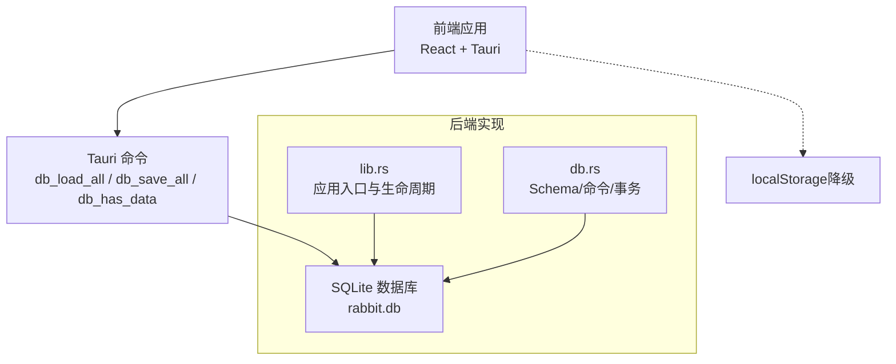
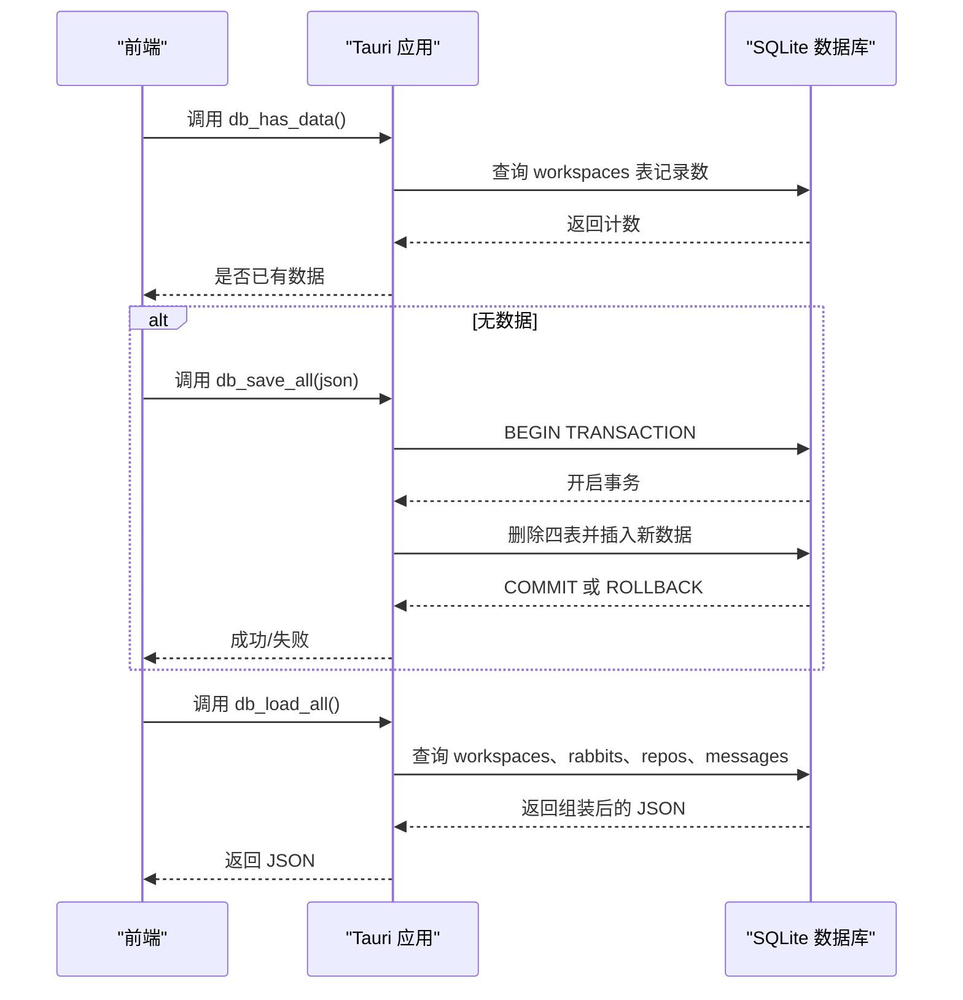
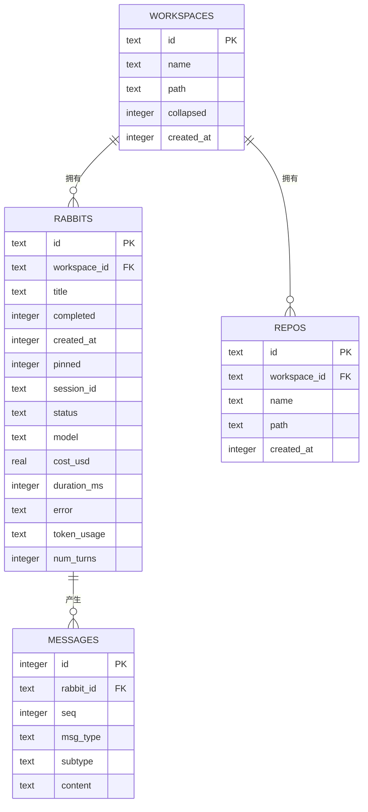
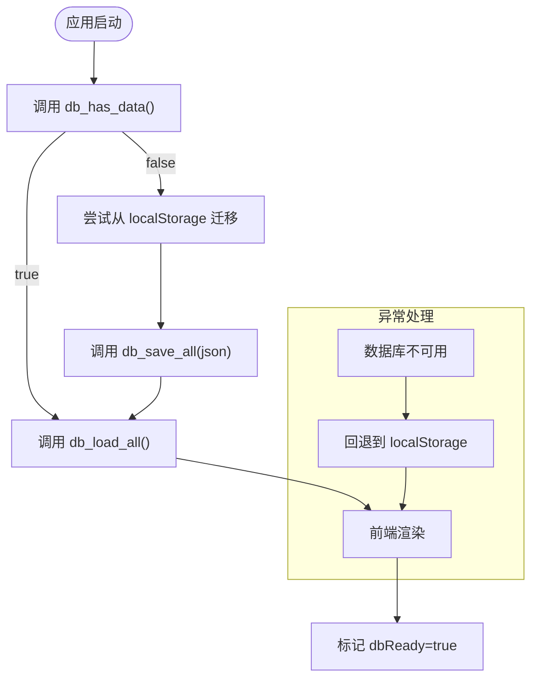
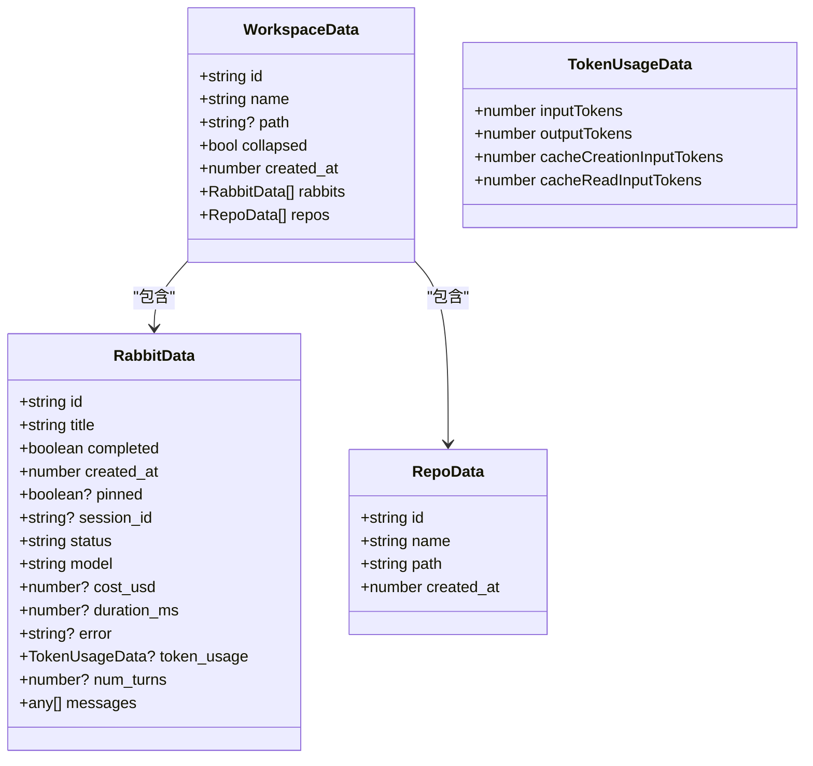
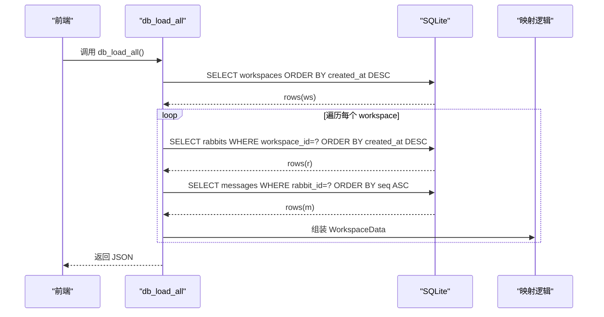
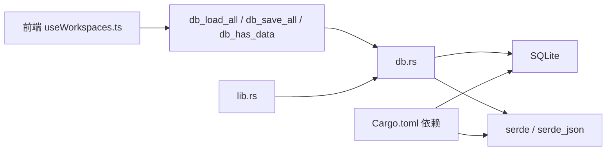

# 数据库设计

<cite>
**本文引用的文件**
- [src-tauri/src/db.rs](file://src-tauri/src/db.rs)
- [src-tauri/src/lib.rs](file://src-tauri/src/lib.rs)
- [src/hooks/useWorkspaces.ts](file://src/hooks/useWorkspaces.ts)
- [src/types/index.ts](file://src/types/index.ts)
- [Cargo.toml](file://src-tauri/Cargo.toml)
</cite>

## 目录
1. [简介](#简介)
2. [项目结构](#项目结构)
3. [核心组件](#核心组件)
4. [架构总览](#架构总览)
5. [详细组件分析](#详细组件分析)
6. [依赖关系分析](#依赖关系分析)
7. [性能考量](#性能考量)
8. [故障排查指南](#故障排查指南)
9. [结论](#结论)
10. [附录](#附录)

## 简介
本文件系统化梳理 RabbitCoding 的 SQLite 数据库设计，涵盖整体架构、表结构、核心实体关系、索引与查询优化、数据完整性约束、版本迁移与向后兼容策略，以及数据模型图示与字段说明。数据库采用 Tauri + Rust + rusqlite 实现，前端通过 Tauri 命令与数据库交互，实现工作空间、兔子（会话）、仓库与消息的持久化与加载。

## 项目结构
数据库相关代码集中在 Tauri 后端模块中，前端通过 React Hook 与之交互，形成“前端状态 + SQLite 持久化”的双轨数据源，具备降级能力（当 SQLite 不可用时回退到 localStorage）。

图表来源
- [src-tauri/src/lib.rs:206-221](file://src-tauri/src/lib.rs#L206-L221)
- [src-tauri/src/db.rs:392-416](file://src-tauri/src/db.rs#L392-L416)
- [src/hooks/useWorkspaces.ts:48-95](file://src/hooks/useWorkspaces.ts#L48-L95)

章节来源
- [src-tauri/src/lib.rs:206-221](file://src-tauri/src/lib.rs#L206-L221)
- [src-tauri/src/db.rs:392-416](file://src-tauri/src/db.rs#L392-L416)
- [src/hooks/useWorkspaces.ts:48-95](file://src/hooks/useWorkspaces.ts#L48-L95)

## 核心组件
- 数据库实例与连接
  - 通过全局状态注册数据库连接，使用互斥锁保护并发访问。
- Schema 初始化与迁移
  - 首次启动执行建表语句，开启 WAL、外键与同步策略；列迁移时幂等处理。
- Tauri 命令
  - db_load_all：全量导出工作空间、兔子、仓库与消息。
  - db_save_all：事务内全量导入覆盖。
  - db_has_data：判断数据库是否已有数据，用于迁移判定。
- 前端集成
  - 首次启动检查数据库是否有数据，若无则尝试从 localStorage 迁移；随后从数据库加载；失败则回退到 localStorage。

章节来源
- [src-tauri/src/db.rs:80-161](file://src-tauri/src/db.rs#L80-L161)
- [src-tauri/src/db.rs:392-416](file://src-tauri/src/db.rs#L392-L416)
- [src-tauri/src/lib.rs:206-221](file://src-tauri/src/lib.rs#L206-L221)
- [src/hooks/useWorkspaces.ts:48-129](file://src/hooks/useWorkspaces.ts#L48-L129)

## 架构总览
数据库采用“单文件 SQLite + WAL”模式，配合外键约束与索引，满足多层级嵌套数据的高效读写。前端通过命令驱动数据加载与保存，具备自动迁移与降级机制。

图表来源
- [src-tauri/src/db.rs:408-416](file://src-tauri/src/db.rs#L408-L416)
- [src-tauri/src/db.rs:290-305](file://src-tauri/src/db.rs#L290-L305)
- [src-tauri/src/db.rs:307-386](file://src-tauri/src/db.rs#L307-L386)
- [src-tauri/src/db.rs:167-288](file://src-tauri/src/db.rs#L167-L288)
- [src/hooks/useWorkspaces.ts:52-73](file://src/hooks/useWorkspaces.ts#L52-L73)

## 详细组件分析

### 数据模型与表结构
- 工作空间（workspaces）
  - 主键：id（TEXT）
  - 字段：name（TEXT）、path（TEXT）、collapsed（INTEGER）、created_at（INTEGER）
  - 作用：顶层容器，承载兔子与仓库集合。
- 兔子（rabbits）
  - 主键：id（TEXT）
  - 外键：workspace_id → workspaces(id)（CASCADE 删除）
  - 字段：title、completed、created_at、pinned、session_id、status、model、cost_usd、duration_ms、error、token_usage（TEXT 存储 JSON）、num_turns、seq（隐含于消息排序）
  - 作用：代表一次会话或任务，关联消息序列。
- 仓库（repos）
  - 主键：id（TEXT）
  - 外键：workspace_id → workspaces(id)（CASCADE 删除）
  - 字段：name、path、created_at
  - 作用：代码仓库或文档根目录集合。
- 消息（messages）
  - 主键：id（INTEGER 自增）
  - 外键：rabbit_id → rabbits(id)（CASCADE 删除）
  - 字段：rabbit_id、seq（INTEGER）、msg_type（TEXT）、subtype（TEXT）、content（TEXT）
  - 作用：按序存储兔子的对话/工具调用/状态等消息内容。

图表来源
- [src-tauri/src/db.rs:90-138](file://src-tauri/src/db.rs#L90-L138)

章节来源
- [src-tauri/src/db.rs:90-138](file://src-tauri/src/db.rs#L90-L138)

### 索引策略与查询优化
- 索引
  - idx_rabbits_workspace：加速按工作空间筛选兔子。
  - idx_repos_workspace：加速按工作空间筛选仓库。
  - idx_messages_rabbit：复合索引（rabbit_id, seq），保证消息按序读取与过滤。
- 查询路径
  - 导出流程：先查 workspaces（按创建时间倒序），再按 workspace_id 查 rabbits（倒序），再按 rabbit_id 查 messages（按 seq 正序），最后拼装为前端所需的 Workspace[] JSON。
  - 导入流程：事务内清空四表，按顺序插入 workspaces、rabbits（含 token_usage JSON 序列化）、messages（按 seq 插入），确保一致性与原子性。
- 优化点
  - 使用事务批量写入，减少 WAL 切换成本。
  - 消息 content 以 JSON 字符串存储，避免复杂嵌套字段带来的索引复杂度。
  - 通过外键级联删除，简化删除工作空间时的数据清理。

章节来源
- [src-tauri/src/db.rs:135-137](file://src-tauri/src/db.rs#L135-L137)
- [src-tauri/src/db.rs:167-288](file://src-tauri/src/db.rs#L167-L288)
- [src-tauri/src/db.rs:307-386](file://src-tauri/src/db.rs#L307-L386)

### 数据完整性约束
- 外键约束
  - rabbits.workspace_id → workspaces(id)（ON DELETE CASCADE）
  - repos.workspace_id → workspaces(id)（ON DELETE CASCADE）
  - messages.rabbit_id → rabbits(id)（ON DELETE CASCADE）
- PRAGMA 设置
  - journal_mode=WAL：提升并发读写性能与崩溃恢复能力。
  - foreign_keys=ON：启用外键检查，保障参照完整性。
  - synchronous=NORMAL：平衡性能与安全性。
- 列迁移
  - 幂等添加 token_usage（TEXT）与 num_turns（INTEGER），忽略重复列错误，确保历史数据库平滑升级。

章节来源
- [src-tauri/src/db.rs:85-88](file://src-tauri/src/db.rs#L85-L88)
- [src-tauri/src/db.rs:113-113](file://src-tauri/src/db.rs#L113-L113)
- [src-tauri/src/db.rs:122-122](file://src-tauri/src/db.rs#L122-L122)
- [src-tauri/src/db.rs:132-132](file://src-tauri/src/db.rs#L132-L132)
- [src-tauri/src/db.rs:149-155](file://src-tauri/src/db.rs#L149-L155)

### 版本管理、迁移与向后兼容
- 首次启动流程
  - 调用 db_has_data 判断数据库是否已有数据。
  - 若无数据，尝试从 localStorage 读取并调用 db_save_all 完成一次性迁移。
  - 随后调用 db_load_all 获取完整数据，前端渲染。
- 降级策略
  - 若数据库初始化失败或后续命令异常，前端回退到 localStorage，保证功能可用。
- 迁移注意事项
  - 列迁移使用幂等 ALTER TABLE，避免重复执行导致失败。
  - 导入时对 token_usage 进行 JSON 序列化，导出时反序列化，确保跨版本兼容。

图表来源
- [src/hooks/useWorkspaces.ts:48-95](file://src/hooks/useWorkspaces.ts#L48-L95)
- [src-tauri/src/db.rs:408-416](file://src-tauri/src/db.rs#L408-L416)
- [src-tauri/src/db.rs:290-305](file://src-tauri/src/db.rs#L290-L305)
- [src-tauri/src/db.rs:307-386](file://src-tauri/src/db.rs#L307-L386)

章节来源
- [src/hooks/useWorkspaces.ts:48-129](file://src/hooks/useWorkspaces.ts#L48-L129)
- [src-tauri/src/db.rs:408-416](file://src-tauri/src/db.rs#L408-L416)

### 数据模型类图（Serde 结构）

图表来源
- [src-tauri/src/db.rs:10-74](file://src-tauri/src/db.rs#L10-L74)

章节来源
- [src-tauri/src/db.rs:10-74](file://src-tauri/src/db.rs#L10-L74)

### 命令与数据流（序列图）

图表来源
- [src-tauri/src/db.rs:167-288](file://src-tauri/src/db.rs#L167-L288)

章节来源
- [src-tauri/src/db.rs:167-288](file://src-tauri/src/db.rs#L167-L288)

## 依赖关系分析
- 外部依赖
  - rusqlite：SQLite 绑定，启用 “bundled” 特性，便于打包与分发。
  - serde/serde_json：JSON 序列化与反序列化，支撑消息内容与统计字段。
- 内部耦合
  - lib.rs 负责应用生命周期与数据库初始化，db.rs 提供命令与数据访问。
  - 前端 useWorkspaces.ts 通过 Tauri 命令与数据库交互，具备降级到 localStorage 的能力。

图表来源
- [src-tauri/src/db.rs:1-4](file://src-tauri/src/db.rs#L1-L4)
- [src-tauri/src/lib.rs:206-221](file://src-tauri/src/lib.rs#L206-L221)
- [Cargo.toml:30](file://src-tauri/Cargo.toml#L30)

章节来源
- [Cargo.toml:20-39](file://src-tauri/Cargo.toml#L20-L39)
- [src-tauri/src/db.rs:1-4](file://src-tauri/src/db.rs#L1-L4)
- [src-tauri/src/lib.rs:206-221](file://src-tauri/src/lib.rs#L206-L221)

## 性能考量
- WAL 模式与外键启用：提升并发读写与参照完整性。
- 事务批量写入：减少磁盘写入次数，提高导入性能。
- 索引设计：针对高频过滤条件建立索引，降低查询成本。
- JSON 字符串存储：消息 content 以 JSON 字符串保存，避免复杂嵌套字段带来的索引与查询复杂度。
- 前端防抖与周期保存：减少频繁写入，结合 3 秒强制保存覆盖流式输出场景。

章节来源
- [src-tauri/src/db.rs:85-88](file://src-tauri/src/db.rs#L85-L88)
- [src-tauri/src/db.rs:290-305](file://src-tauri/src/db.rs#L290-L305)
- [src-tauri/src/db.rs:135-137](file://src-tauri/src/db.rs#L135-L137)
- [src/hooks/useWorkspaces.ts:100-119](file://src/hooks/useWorkspaces.ts#L100-L119)

## 故障排查指南
- 数据库初始化失败
  - 现象：应用启动时打印失败日志，db_* 命令不可用。
  - 处理：前端检测到命令失败后回退到 localStorage，继续使用。
- 导入失败
  - 现象：db_save_all 返回错误。
  - 处理：内部执行 ROLLBACK，前端捕获错误并记录；可重试或检查 JSON 格式。
- 数据不一致
  - 现象：导入后消息缺失或顺序错乱。
  - 处理：确认 messages 的 seq 递增插入；检查前端消息去重与增量拼接逻辑。
- 迁移失败
  - 现象：首次启动未能从 localStorage 迁移。
  - 处理：检查 localStorage 键名与 JSON 格式；确认 db_save_all 调用成功。

章节来源
- [src-tauri/src/lib.rs:213-221](file://src-tauri/src/lib.rs#L213-L221)
- [src-tauri/src/db.rs:290-305](file://src-tauri/src/db.rs#L290-L305)
- [src/hooks/useWorkspaces.ts:52-65](file://src/hooks/useWorkspaces.ts#L52-L65)

## 结论
该数据库设计以 SQLite 为核心，结合 WAL、外键与索引，实现了工作空间、兔子、仓库与消息的高内聚低耦合模型。通过事务批量导入、幂等列迁移与前端降级策略，兼顾了性能、可靠性与向前/向后兼容性。建议在后续迭代中持续关注消息内容增长趋势，必要时评估拆分字段或引入压缩策略。

## 附录

### 字段详细说明（按表）
- workspaces
  - id：主键，唯一标识工作空间。
  - name：工作空间名称，默认空字符串。
  - path：工作空间路径，可选。
  - collapsed：是否折叠，0/1。
  - created_at：创建时间戳。
- rabbits
  - id：主键，唯一标识兔子。
  - workspace_id：所属工作空间。
  - title：标题，默认空字符串。
  - completed：是否完成，0/1。
  - created_at：创建时间戳。
  - pinned：置顶标记，0/1。
  - session_id：会话 ID，可选。
  - status：状态（idle/running/completed/error）。
  - model：模型标识。
  - cost_usd：累计费用，可选。
  - duration_ms：累计时长，可选。
  - error：错误信息，可选。
  - token_usage：JSON 字符串，包含输入/输出/缓存统计。
  - num_turns：回合数，可选。
- repos
  - id：主键，唯一标识仓库。
  - workspace_id：所属工作空间。
  - name：仓库名称。
  - path：仓库路径。
  - created_at：创建时间戳。
- messages
  - id：自增主键。
  - rabbit_id：所属兔子。
  - seq：消息序号，用于保证顺序。
  - msg_type：消息类型（如 assistant、user、tool_result 等）。
  - subtype：子类型（如 text、thinking、text_delta 等）。
  - content：消息内容的 JSON 字符串。

章节来源
- [src-tauri/src/db.rs:90-138](file://src-tauri/src/db.rs#L90-L138)