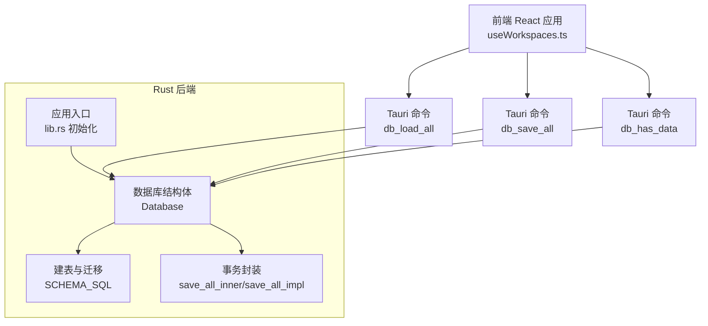
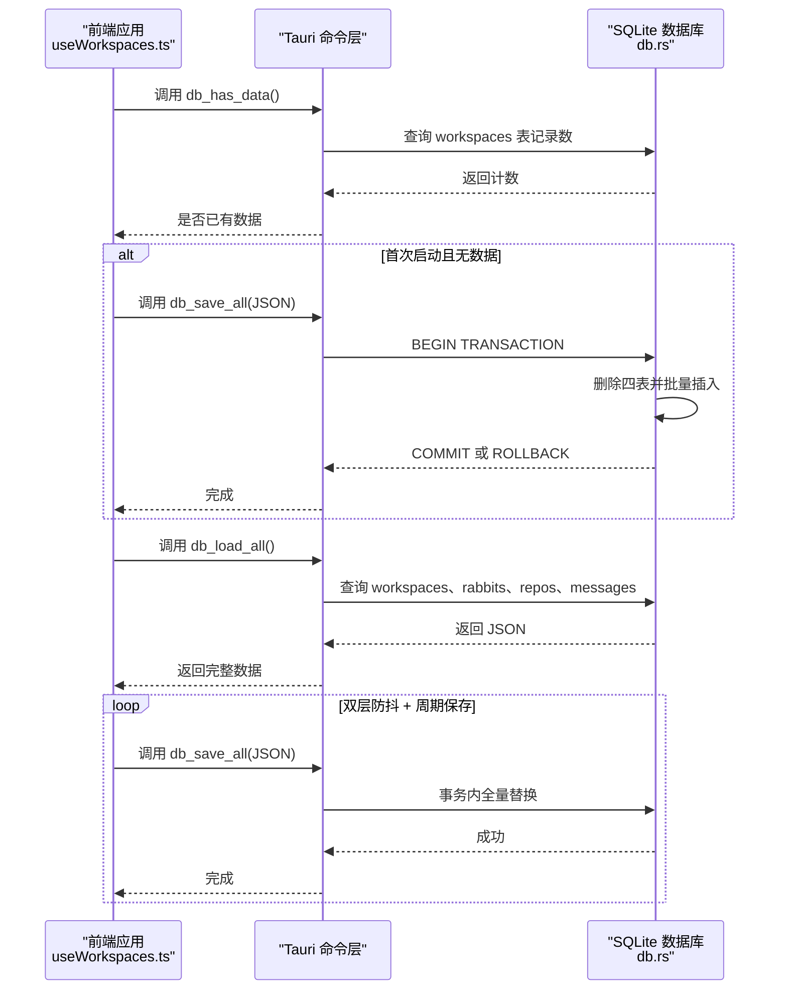
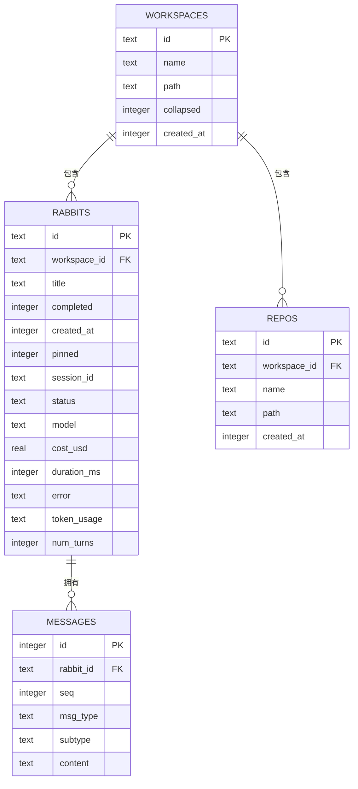
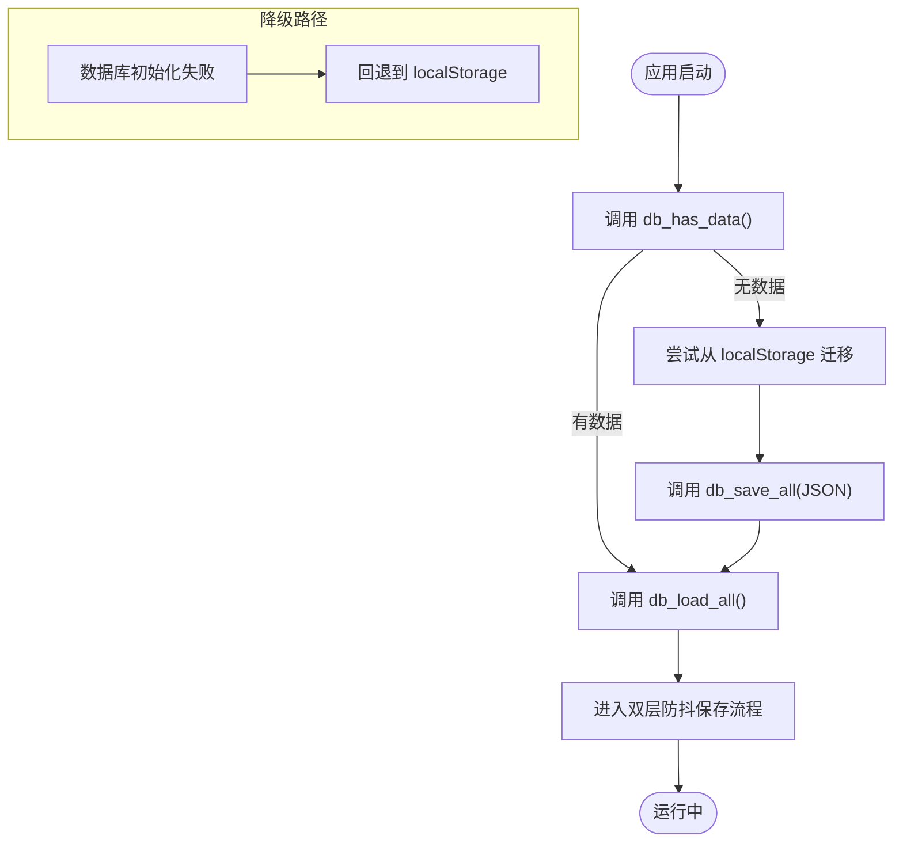
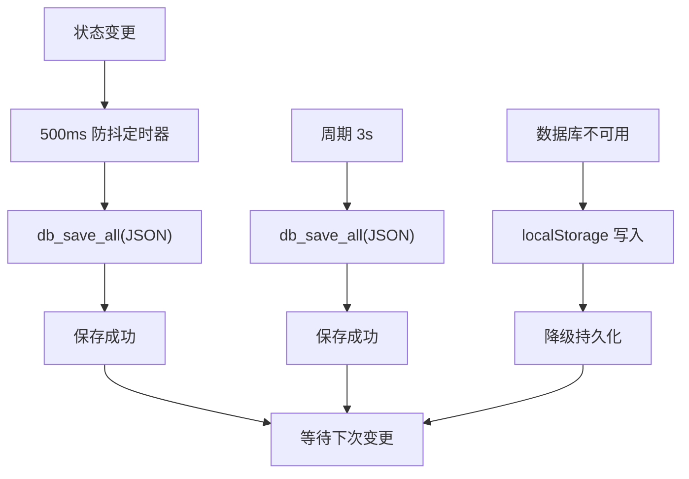
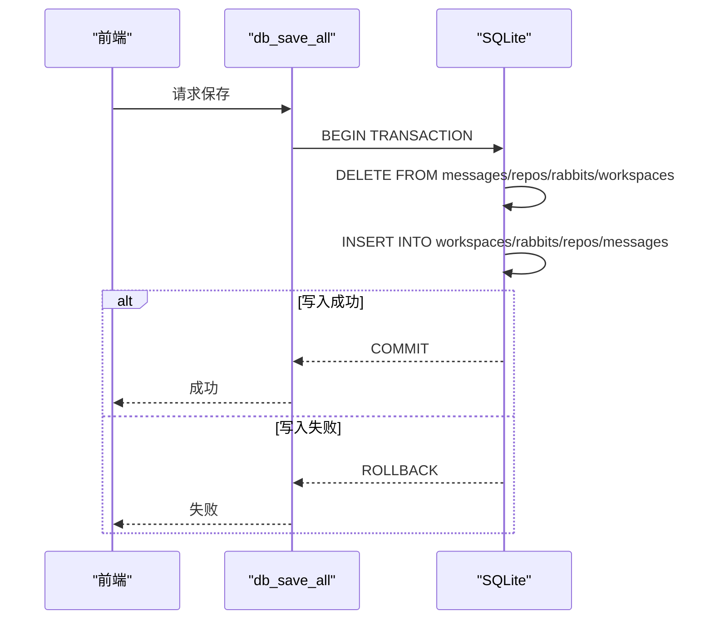
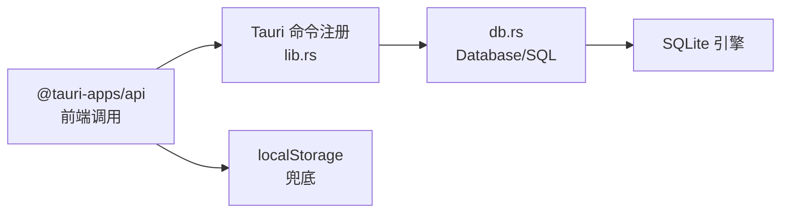

# 数据持久化

<cite>
**本文引用的文件**
- [src-tauri/src/db.rs](file://src-tauri/src/db.rs)
- [src-tauri/src/lib.rs](file://src-tauri/src/lib.rs)
- [src-tauri/Cargo.toml](file://src-tauri/Cargo.toml)
- [src/hooks/useWorkspaces.ts](file://src/hooks/useWorkspaces.ts)
- [src/hooks/useLocalStorage.ts](file://src/hooks/useLocalStorage.ts)
</cite>

## 目录
1. [简介](#简介)
2. [项目结构](#项目结构)
3. [核心组件](#核心组件)
4. [架构总览](#架构总览)
5. [详细组件分析](#详细组件分析)
6. [依赖关系分析](#依赖关系分析)
7. [性能考虑](#性能考虑)
8. [故障排查指南](#故障排查指南)
9. [结论](#结论)
10. [附录](#附录)

## 简介
本文件面向 RabbitCoding 的数据持久化系统，围绕 SQLite 数据库设计、表结构与索引策略、数据迁移机制与版本兼容性、双层防抖保存与强制保存、一致性与事务控制、并发与回退机制、以及备份与导入导出能力展开。文档同时提供性能优化建议、存储空间管理与维护策略，帮助开发者与运维人员全面掌握该系统的数据层实现。

## 项目结构
数据持久化相关的核心位置如下：
- 后端（Tauri/Rust 层）
  - 数据库初始化与命令：[src-tauri/src/db.rs](file://src-tauri/src/db.rs)
  - 应用入口与数据库注册：[src-tauri/src/lib.rs](file://src-tauri/src/lib.rs)
  - 依赖声明（rusqlite、tauri 等）：[src-tauri/Cargo.toml](file://src-tauri/Cargo.toml)
- 前端（React 层）
  - 工作区数据状态与持久化策略：[src/hooks/useWorkspaces.ts](file://src/hooks/useWorkspaces.ts)
  - 本地存储工具（localStorage）：[src/hooks/useLocalStorage.ts](file://src/hooks/useLocalStorage.ts)

图表来源
- [src-tauri/src/db.rs:80-161](file://src-tauri/src/db.rs#L80-L161)
- [src-tauri/src/lib.rs:197-390](file://src-tauri/src/lib.rs#L197-L390)
- [src/hooks/useWorkspaces.ts:48-129](file://src/hooks/useWorkspaces.ts#L48-L129)

章节来源
- [src-tauri/src/db.rs:80-161](file://src-tauri/src/db.rs#L80-L161)
- [src-tauri/src/lib.rs:197-390](file://src-tauri/src/lib.rs#L197-L390)
- [src/hooks/useWorkspaces.ts:48-129](file://src/hooks/useWorkspaces.ts#L48-L129)

## 核心组件
- 数据库结构体 Database：封装 SQLite 连接与全局互斥锁，提供建表、迁移、全量加载与全量保存能力。
- Tauri 命令：
  - db_load_all：查询四表并序列化为 JSON 返回。
  - db_save_all：接收完整 JSON，事务内全量替换写入。
  - db_has_data：检查数据库是否已有数据，用于迁移判定。
- 前端工作区 Hook useWorkspaces：
  - 首次加载时检查数据库是否有数据，若无则尝试从 localStorage 迁移。
  - 成功加载后进入“双层防抖 + 周期强制保存”流程；若数据库不可用则回退到 localStorage。
  - 提供消息追加、状态更新、去重与兼容性修复等工具方法。

章节来源
- [src-tauri/src/db.rs:392-417](file://src-tauri/src/db.rs#L392-L417)
- [src/hooks/useWorkspaces.ts:48-129](file://src/hooks/useWorkspaces.ts#L48-L129)

## 架构总览
RabbitCoding 的数据持久化采用“前端状态驱动 + Rust SQLite 后端”的分层设计。前端负责状态管理与保存策略，后端负责数据模型与事务一致性。

图表来源
- [src-tauri/src/db.rs:290-417](file://src-tauri/src/db.rs#L290-L417)
- [src/hooks/useWorkspaces.ts:48-129](file://src/hooks/useWorkspaces.ts#L48-L129)

## 详细组件分析

### 数据库设计与表结构
- 表关系与字段
  - workspaces：工作区基本信息（id、name、path、collapsed、created_at）。
  - rabbits：工作区内兔子（任务）信息（id、workspace_id 外键、title、completed、created_at、pinned、session_id、status、model、cost_usd、duration_ms、error、token_usage、num_turns）。
  - repos：工作区内仓库信息（id、workspace_id 外键、name、path、created_at）。
  - messages：兔子对话消息（id、rabbit_id 外键、seq、msg_type、subtype、content）。
- 约束与索引
  - 外键约束：rabbits.workspace_id、repos.workspace_id、messages.rabbit_id 均引用对应父表 id，并启用 ON DELETE CASCADE。
  - 索引：rabbits.workspace_id、repos.workspace_id、messages(rabbit_id, seq)。
- 迁移策略
  - 启动时对现有数据库执行列迁移（幂等），新增列不会因重复而报错。
  - 通过 ALTER TABLE 添加新列，保证向前兼容。

图表来源
- [src-tauri/src/db.rs:85-138](file://src-tauri/src/db.rs#L85-L138)

章节来源
- [src-tauri/src/db.rs:85-138](file://src-tauri/src/db.rs#L85-L138)

### 数据迁移机制与版本兼容性
- 首次启动检测：调用 db_has_data 判断数据库是否已有数据。
- 无数据时迁移：从 localStorage 读取历史数据并调用 db_save_all 写入数据库，完成一次性迁移。
- 列迁移：启动时对 rabbits 表执行列添加操作，保证后续字段可用。
- 降级处理：若数据库初始化失败，后端打印错误并允许前端回退到 localStorage。

图表来源
- [src-tauri/src/lib.rs:206-221](file://src-tauri/src/lib.rs#L206-L221)
- [src/hooks/useWorkspaces.ts:48-95](file://src/hooks/useWorkspaces.ts#L48-L95)

章节来源
- [src-tauri/src/lib.rs:206-221](file://src-tauri/src/lib.rs#L206-L221)
- [src/hooks/useWorkspaces.ts:48-95](file://src/hooks/useWorkspaces.ts#L48-L95)

### 双层防抖保存、强制保存与回退机制
- 双层防抖：状态变更后 500ms 触发一次保存，避免频繁写入。
- 周期强制保存：每 3 秒触发一次保存，覆盖连续流式输出场景。
- 降级层：当数据库不可用或加载失败时，回退到 localStorage 持久化，保证数据不丢失。
- 前端兜底：对“进行中”状态进行收敛，避免 UI 卡死。

图表来源
- [src/hooks/useWorkspaces.ts:100-129](file://src/hooks/useWorkspaces.ts#L100-L129)

章节来源
- [src/hooks/useWorkspaces.ts:100-129](file://src/hooks/useWorkspaces.ts#L100-L129)

### 数据一致性保证、事务处理与并发控制
- 事务处理：db_save_all_impl 在单事务中删除四表并批量插入，保证全量替换的一致性；失败时回滚。
- 并发控制：Database 内部使用 Mutex 包裹连接，避免多线程并发访问冲突。
- 外键级联：删除工作区时，子表数据自动清理，减少悬挂数据风险。

图表来源
- [src-tauri/src/db.rs:290-386](file://src-tauri/src/db.rs#L290-L386)

章节来源
- [src-tauri/src/db.rs:290-386](file://src-tauri/src/db.rs#L290-L386)

### 备份、恢复与导入导出
- 导出：前端调用 db_load_all 获取完整 JSON，可用于备份。
- 导入：前端调用 db_save_all 写入 JSON，可用于恢复。
- 本地备份：若数据库不可用，前端将数据写入 localStorage，作为临时备份。
- 建议实践：
  - 定期导出 JSON 至安全位置；
  - 恢复时先清空或备份当前数据库，再导入 JSON；
  - 使用操作系统层面的文件备份策略保护 rabbit.db。

章节来源
- [src-tauri/src/db.rs:392-417](file://src-tauri/src/db.rs#L392-L417)
- [src/hooks/useWorkspaces.ts:74-92](file://src/hooks/useWorkspaces.ts#L74-L92)

## 依赖关系分析
- 后端依赖 rusqlite 提供 SQLite 访问，Tauri 提供命令桥接与插件生态。
- 前端通过 @tauri-apps/api 调用后端命令，使用 React 状态管理与 localStorage 作为兜底。

图表来源
- [src-tauri/Cargo.toml:20-39](file://src-tauri/Cargo.toml#L20-L39)
- [src-tauri/src/lib.rs:344-389](file://src-tauri/src/lib.rs#L344-L389)
- [src/hooks/useWorkspaces.ts:1-26](file://src/hooks/useWorkspaces.ts#L1-L26)

章节来源
- [src-tauri/Cargo.toml:20-39](file://src-tauri/Cargo.toml#L20-L39)
- [src-tauri/src/lib.rs:344-389](file://src-tauri/src/lib.rs#L344-L389)

## 性能考虑
- WAL 模式与同步级别：PRAGMA 设置 WAL 与 NORMAL 同步，兼顾可靠性与性能。
- 索引策略：messages(rabbit_id, seq) 有利于按序读取消息；rabbits/workspace_id 与 repos/workspace_id 有利于按工作区检索。
- 批量写入：全量保存采用单事务批量插入，减少多次往返与锁竞争。
- 防抖与周期保存：降低写入频率，避免高频 I/O。
- 建议优化
  - 大消息拆分或外部化存储（如文件系统）以减小单条 content 文本大小。
  - 对高频查询建立复合索引或物化视图（需评估写入成本）。
  - 控制消息数量上限，定期归档或清理历史消息。

章节来源
- [src-tauri/src/db.rs:85-138](file://src-tauri/src/db.rs#L85-L138)
- [src/hooks/useWorkspaces.ts:100-119](file://src/hooks/useWorkspaces.ts#L100-L119)

## 故障排查指南
- 数据库初始化失败
  - 现象：后端打印错误，前端回退到 localStorage。
  - 排查：检查应用数据目录权限、磁盘空间、SQLite 文件完整性。
- 保存失败
  - 现象：db_save_all 抛错或回滚。
  - 排查：查看事务日志、确认 JSON 格式正确、检查外键约束。
- 加载为空
  - 现象：db_load_all 返回空数据。
  - 排查：确认 db_has_data 判定、迁移是否成功、表结构是否一致。
- 降级到 localStorage
  - 现象：dbReady=false，数据写入 localStorage。
  - 处理：尽快修复数据库问题，或手动导出 localStorage 数据并迁移至数据库。

章节来源
- [src-tauri/src/lib.rs:206-221](file://src-tauri/src/lib.rs#L206-L221)
- [src/hooks/useWorkspaces.ts:74-92](file://src/hooks/useWorkspaces.ts#L74-L92)

## 结论
RabbitCoding 的数据持久化以 SQLite 为核心，结合 Rust 的强类型与 Tauri 的命令桥接，实现了可靠的数据模型、事务一致性与灵活的迁移策略。前端通过双层防抖与周期保存平衡性能与实时性，并在数据库异常时提供 localStorage 降级保障。配合合理的索引与批量写入策略，系统可在中小规模数据下保持良好性能与稳定性。

## 附录
- 关键命令与职责
  - db_load_all：全量读取并序列化为 JSON。
  - db_save_all：接收 JSON 并在单事务中全量替换。
  - db_has_data：判断数据库是否已有数据，驱动迁移逻辑。
- 前端持久化要点
  - 首次加载迁移、双层防抖与周期保存、降级写入 localStorage、状态收敛与兼容性修复。

章节来源
- [src-tauri/src/db.rs:392-417](file://src-tauri/src/db.rs#L392-L417)
- [src/hooks/useWorkspaces.ts:48-129](file://src/hooks/useWorkspaces.ts#L48-L129)