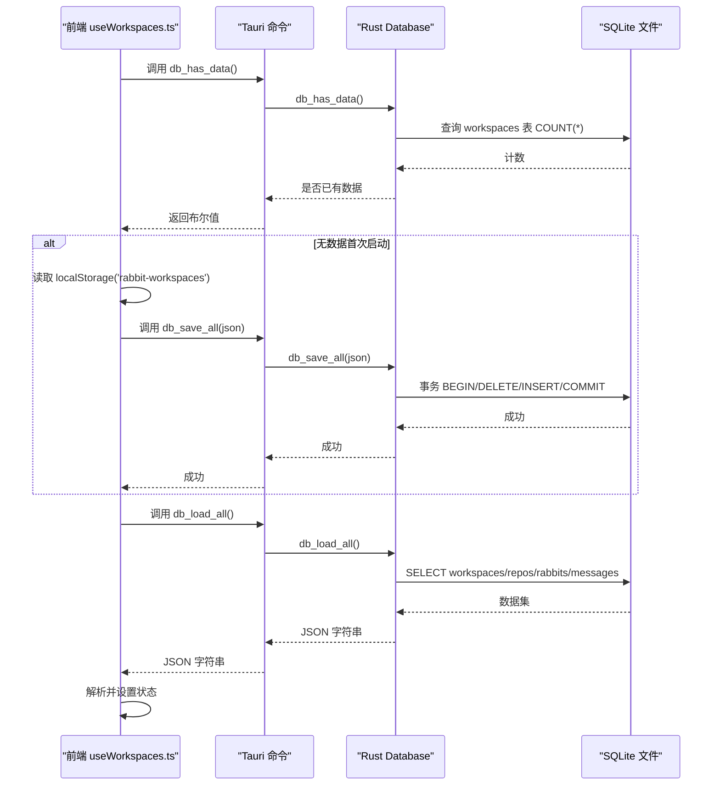
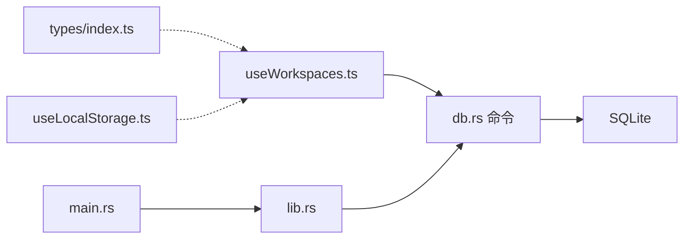

# 数据迁移

<cite>
**本文引用的文件**
- [db.rs](file://src-tauri/src/db.rs)
- [lib.rs](file://src-tauri/src/lib.rs)
- [main.rs](file://src-tauri/src/main.rs)
- [useWorkspaces.ts](file://src/hooks/useWorkspaces.ts)
- [useLocalStorage.ts](file://src/hooks/useLocalStorage.ts)
- [index.ts](file://src/types/index.ts)
- [tauri.conf.json](file://src-tauri/tauri.conf.json)
</cite>

## 目录
1. [简介](#简介)
2. [项目结构](#项目结构)
3. [核心组件](#核心组件)
4. [架构总览](#架构总览)
5. [详细组件分析](#详细组件分析)
6. [依赖关系分析](#依赖关系分析)
7. [性能考量](#性能考量)
8. [故障排查指南](#故障排查指南)
9. [结论](#结论)

## 简介
本文档围绕 RabbitCoding 的数据迁移机制展开，重点说明从浏览器端 localStorage 到 Tauri 后端 SQLite 的迁移流程与兼容性处理。内容涵盖版本检测、数据格式转换、错误处理与回退策略、数据完整性保护、迁移脚本的执行时机与条件判断、性能优化以及用户体验与数据安全保障。

## 项目结构
RabbitCoding 将数据持久化从 localStorage 迁移到 SQLite，前端通过 Tauri 命令与 Rust 后端交互，Rust 层负责数据库初始化、建表、迁移与事务性读写。

```mermaid
graph TB
subgraph "前端"
UWS["useWorkspaces.ts<br/>异步加载/迁移/保存"]
LST["useLocalStorage.ts<br/>localStorage 读写封装"]
TYPES["types/index.ts<br/>数据模型"]
end
subgraph "Tauri 后端"
MAIN["main.rs<br/>入口"]
LIB["lib.rs<br/>插件/命令注册"]
DB["db.rs<br/>SQLite/Schema/迁移/事务"]
end
subgraph "数据库"
SQLITE["SQLite 文件<br/>rabbit.db"]
end
UWS --> |invoke('db_has_data')| DB
UWS --> |invoke('db_load_all')| DB
UWS --> |invoke('db_save_all')| DB
DB --> SQLITE
LIB --> DB
MAIN --> LIB
TYPES -.-> UWS
LST -.-> UWS
```

图表来源
- [useWorkspaces.ts:45-95](file://src/hooks/useWorkspaces.ts#L45-L95)
- [db.rs:85-138](file://src-tauri/src/db.rs#L85-L138)
- [lib.rs:374-568](file://src-tauri/src/lib.rs#L374-L568)
- [main.rs:4-6](file://src-tauri/src/main.rs#L4-L6)

章节来源
- [useWorkspaces.ts:45-95](file://src/hooks/useWorkspaces.ts#L45-L95)
- [db.rs:85-138](file://src-tauri/src/db.rs#L85-L138)
- [lib.rs:374-568](file://src-tauri/src/lib.rs#L374-L568)
- [main.rs:4-6](file://src-tauri/src/main.rs#L4-L6)

## 核心组件
- 前端迁移与加载控制：useWorkspaces.ts 负责首次启动时的迁移判断、从 localStorage 到 SQLite 的一次性迁移、从 SQLite 加载数据、降级回退到 localStorage、双层防抖保存与周期性强制保存。
- 数据模型：types/index.ts 定义了 Workspace、Rabbit、Repo 等核心实体，用于前后端一致的数据结构映射。
- 后端数据库：db.rs 提供数据库初始化、Schema 建表、列迁移、全量读取与全量写入（事务）、数据完整性保护（外键、WAL、索引）。
- 命令注册与生命周期：lib.rs 在应用启动时创建数据库实例并注册命令；main.rs 作为入口调用 run()。

章节来源
- [useWorkspaces.ts:45-95](file://src/hooks/useWorkspaces.ts#L45-L95)
- [index.ts:34-42](file://src/types/index.ts#L34-L42)
- [db.rs:85-138](file://src-tauri/src/db.rs#L85-L138)
- [lib.rs:374-568](file://src-tauri/src/lib.rs#L374-L568)
- [main.rs:4-6](file://src-tauri/src/main.rs#L4-L6)

## 架构总览
迁移与加载的关键流程如下：



图表来源
- [useWorkspaces.ts:45-95](file://src/hooks/useWorkspaces.ts#L45-L95)
- [db.rs:408-416](file://src-tauri/src/db.rs#L408-L416)
- [db.rs:392-406](file://src-tauri/src/db.rs#L392-L406)

## 详细组件分析

### 前端迁移与加载控制（useWorkspaces.ts）
- 首次启动仅执行一次的异步加载与迁移：
  - 调用 db_has_data() 判断数据库是否已有数据。
  - 若无数据，尝试从 localStorage('rabbit-workspaces') 读取并调用 db_save_all(json) 完成一次性迁移。
  - 无论是否迁移成功，均调用 db_load_all() 从 SQLite 加载数据；若失败则降级回退到 localStorage。
- 降级策略：
  - db_* 命令失败或异常时，记录错误并回退到 localStorage，保证功能可用。
  - 设置 dbReady=false，使用 localStorage 写入（防抖层）。
- 双层保存策略：
  - 防抖层：状态变更后 500ms 触发 db_save_all。
  - 周期层：每 3s 强制保存，覆盖连续流式输出场景。
- 旧数据兼容：
  - 对 workspaces/rebbit 的字段进行规范化，确保缺失字段有默认值，提升兼容性。

章节来源
- [useWorkspaces.ts:45-95](file://src/hooks/useWorkspaces.ts#L45-L95)
- [useWorkspaces.ts:101-129](file://src/hooks/useWorkspaces.ts#L101-L129)
- [useWorkspaces.ts:131-147](file://src/hooks/useWorkspaces.ts#L131-L147)

### 数据模型与格式转换（types/index.ts 与 db.rs）
- 前端类型定义：
  - Workspace、Rabbit、Repo 等接口定义了字段与默认值，便于前端渲染与兼容处理。
- Rust 数据结构与序列化：
  - db.rs 定义了与前端字段名对齐的结构体（camelCase），并使用 serde 进行序列化/反序列化。
  - messages 采用 JSON 字符串存储，加载时解析为 serde_json::Value，保证消息内容的通用性。
- 格式转换：
  - 前端 JSON 字符串经 db_save_all() 解析为结构体集合，再写入 SQLite。
  - 读取时按表结构组装为结构体集合，再序列化为 JSON 返回前端。

章节来源
- [index.ts:34-42](file://src/types/index.ts#L34-L42)
- [index.ts:8-32](file://src/types/index.ts#L8-L32)
- [db.rs:10-74](file://src-tauri/src/db.rs#L10-L74)
- [db.rs:167-288](file://src-tauri/src/db.rs#L167-L288)

### 后端数据库初始化与迁移（db.rs）
- 初始化与 Schema 建表：
  - 打开或创建数据库文件，执行建表 SQL（workspaces、rabbits、repos、messages）。
  - 启用 WAL、外键约束、同步策略，建立必要索引。
- 列迁移（幂等）：
  - 对现有数据库执行 ALTER TABLE 添加新列（如 token_usage、num_turns），忽略重复列错误，保证向后兼容。
- 事务性读写：
  - db_save_all()：开启事务，清空四表，遍历写入；成功 COMMIT，失败 ROLLBACK。
  - db_load_all()：查询 workspaces、rabbits、messages，组装为 JSON 字符串返回。
- 数据完整性：
  - 外键约束（rabbits/repos/workspace_id）与级联删除，确保删除工作区时级联清理关联数据。
  - 索引加速查询（rabbits/workspace_id、repos/workspace_id、messages(rabbit_id, seq)）。

章节来源
- [db.rs:85-138](file://src-tauri/src/db.rs#L85-L138)
- [db.rs:140-161](file://src-tauri/src/db.rs#L140-L161)
- [db.rs:290-386](file://src-tauri/src/db.rs#L290-L386)
- [db.rs:392-416](file://src-tauri/src/db.rs#L392-L416)

### 命令注册与生命周期（lib.rs、main.rs）
- 生命周期：
  - 应用启动时创建 app_data_dir 并初始化数据库（Database::open），失败时不崩溃，前端通过命令失败检测降级。
  - 注册 db_load_all、db_save_all、db_has_data 等命令。
- 入口：
  - main.rs 调用 run()，进入 Tauri 应用生命周期。

章节来源
- [lib.rs:374-568](file://src-tauri/src/lib.rs#L374-L568)
- [main.rs:4-6](file://src-tauri/src/main.rs#L4-L6)

### 版本检测与兼容性处理
- 版本检测：
  - 通过 db_has_data() 查询 workspaces 表 COUNT(*) 判断是否已有数据，从而决定是否执行迁移。
- 兼容性处理：
  - 列迁移（ALTER TABLE）幂等，忽略重复列错误。
  - 前端对旧字段进行规范化（如 status、messages、model、specFilePaths），确保新旧数据共存时 UI 正常。
  - localStorage 作为最终降级方案，保证在数据库不可用时仍可读写。

章节来源
- [db.rs:408-416](file://src-tauri/src/db.rs#L408-L416)
- [useWorkspaces.ts:131-147](file://src/hooks/useWorkspaces.ts#L131-L147)

### 错误处理与回退策略
- 前端：
  - 迁移失败：捕获异常并记录日志，不阻断后续流程。
  - DB 不可用：捕获异常，回退到 localStorage，设置 dbReady=false，使用 localStorage 写入。
- 后端：
  - 数据库初始化失败：记录错误，不 panic，前端检测命令失败后降级。
  - 事务失败：统一 ROLLBACK，保证数据一致性。

章节来源
- [useWorkspaces.ts:56-64](file://src/hooks/useWorkspaces.ts#L56-L64)
- [useWorkspaces.ts:74-92](file://src/hooks/useWorkspaces.ts#L74-L92)
- [lib.rs:395-398](file://src-tauri/src/lib.rs#L395-L398)
- [db.rs:295-304](file://src-tauri/src/db.rs#L295-L304)

### 数据完整性保护
- 外键与级联删除：删除工作区时自动清理兔子与消息。
- 事务：全量写入使用事务，失败即回滚，避免部分写入导致脏数据。
- 索引：对高频查询字段建立索引，提升读取性能与稳定性。

章节来源
- [db.rs:98-137](file://src-tauri/src/db.rs#L98-L137)
- [db.rs:307-386](file://src-tauri/src/db.rs#L307-L386)

### 迁移脚本执行时机与条件判断
- 执行时机：
  - 首次挂载（useEffect）时执行一次。
- 条件判断：
  - db_has_data() 返回 false 时才尝试迁移。
  - localStorage 存在 'rabbit-workspaces' 时才执行迁移。
- 保存策略：
  - 防抖 500ms + 周期 3s，兼顾实时性与性能。

章节来源
- [useWorkspaces.ts:45-95](file://src/hooks/useWorkspaces.ts#L45-L95)
- [useWorkspaces.ts:101-129](file://src/hooks/useWorkspaces.ts#L101-L129)

### 性能优化
- 事务批量写入：db_save_all() 使用事务，减少多次提交开销。
- 索引优化：messages(rabbit_id, seq)、rabbits/workspace_id、repos/workspace_id。
- 读取优化：按 created_at 排序，减少前端排序成本。
- 防抖与周期保存：降低频繁写入对数据库的压力。

章节来源
- [db.rs:135-137](file://src-tauri/src/db.rs#L135-L137)
- [db.rs:290-386](file://src-tauri/src/db.rs#L290-L386)
- [useWorkspaces.ts:101-129](file://src/hooks/useWorkspaces.ts#L101-L129)

### 用户体验与数据安全保障
- 用户体验：
  - 首次启动无感迁移，不阻塞 UI。
  - DB 不可用时立即回退到 localStorage，保证可用性。
  - 双层保存策略覆盖流式输出场景，减少数据丢失风险。
- 数据安全：
  - 事务写入与 ROLLBACK 保护数据一致性。
  - 外键约束与级联删除避免悬挂数据。
  - 前端对旧字段进行兼容处理，避免因字段缺失导致渲染异常。

章节来源
- [useWorkspaces.ts:45-95](file://src/hooks/useWorkspaces.ts#L45-L95)
- [db.rs:290-386](file://src-tauri/src/db.rs#L290-L386)

## 依赖关系分析



图表来源
- [useWorkspaces.ts:1-5](file://src/hooks/useWorkspaces.ts#L1-L5)
- [db.rs:392-416](file://src-tauri/src/db.rs#L392-L416)
- [lib.rs:522-566](file://src-tauri/src/lib.rs#L522-L566)
- [main.rs:4-6](file://src-tauri/src/main.rs#L4-L6)

章节来源
- [useWorkspaces.ts:1-5](file://src/hooks/useWorkspaces.ts#L1-L5)
- [db.rs:392-416](file://src-tauri/src/db.rs#L392-L416)
- [lib.rs:522-566](file://src-tauri/src/lib.rs#L522-L566)
- [main.rs:4-6](file://src-tauri/src/main.rs#L4-L6)

## 性能考量
- 事务批处理：全量写入使用事务，显著降低写入延迟与锁竞争。
- 索引命中：针对高频查询字段建立索引，减少查询时间。
- 读取顺序：按 created_at 排序，减少前端额外排序成本。
- 保存频率控制：防抖与周期保存平衡实时性与性能。

## 故障排查指南
- 迁移失败：
  - 检查 db_has_data() 是否返回 false，确认 localStorage 是否存在 'rabbit-workspaces'。
  - 查看 db_save_all() 返回的错误信息，定位具体表或字段写入失败原因。
- DB 不可用：
  - 查看应用启动日志中数据库初始化失败信息。
  - 确认 app_data_dir 是否可写，数据库文件是否存在。
- 数据不一致：
  - 检查事务是否正常 COMMIT/ROLLBACK。
  - 确认外键约束是否生效，删除操作是否触发级联。

章节来源
- [useWorkspaces.ts:56-64](file://src/hooks/useWorkspaces.ts#L56-L64)
- [useWorkspaces.ts:74-92](file://src/hooks/useWorkspaces.ts#L74-L92)
- [lib.rs:395-398](file://src-tauri/src/lib.rs#L395-L398)
- [db.rs:295-304](file://src-tauri/src/db.rs#L295-L304)

## 结论
RabbitCoding 的数据迁移机制通过“版本检测 + 一次性迁移 + 事务性读写 + 双层保存 + 降级回退”的设计，在保证数据完整性与用户体验的同时，实现了从 localStorage 到 SQLite 的平滑过渡。该机制具备良好的兼容性与健壮性，适合在生产环境中长期稳定运行。