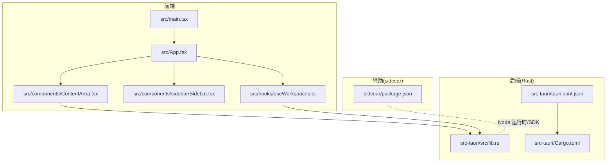
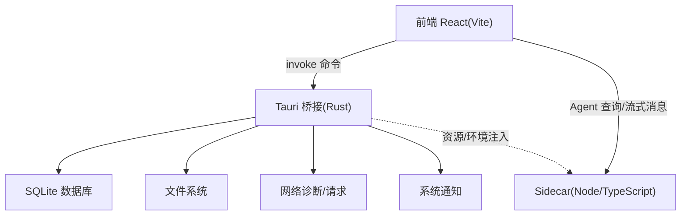
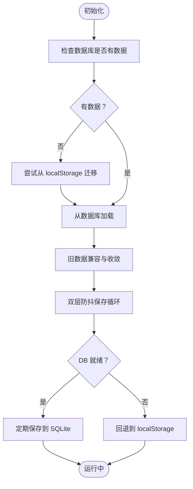
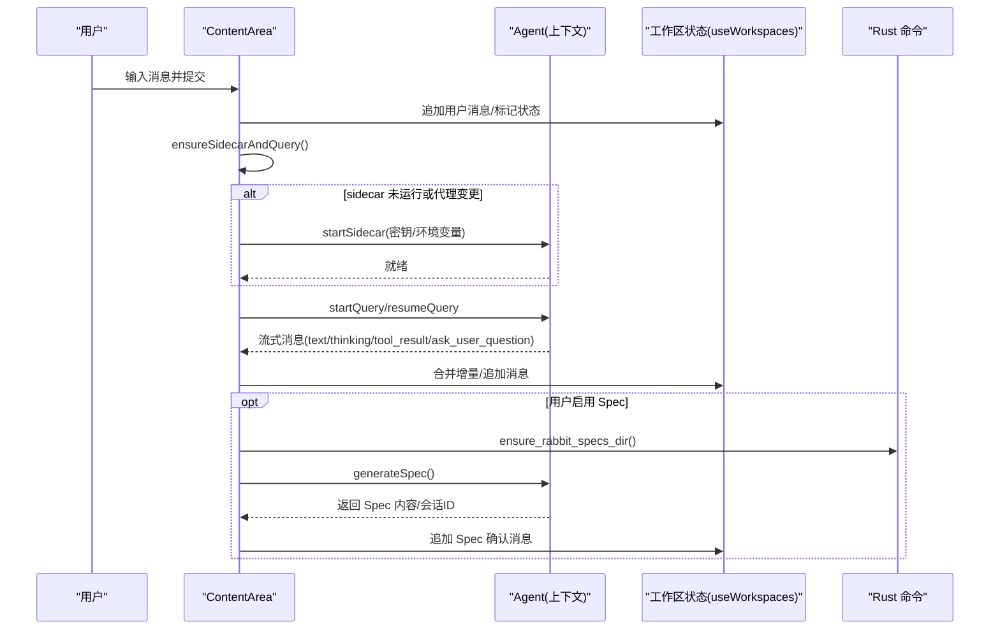
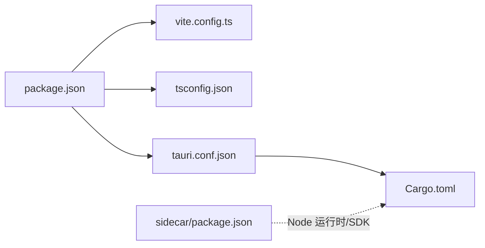

# 开发者指南

<cite>
**本文引用的文件**
- [README.md](file://README.md)
- [package.json](file://package.json)
- [vite.config.ts](file://vite.config.ts)
- [tsconfig.json](file://tsconfig.json)
- [src-tauri/tauri.conf.json](file://src-tauri/tauri.conf.json)
- [src-tauri/Cargo.toml](file://src-tauri/Cargo.toml)
- [src-tauri/src/lib.rs](file://src-tauri/src/lib.rs)
- [src-tauri/src/main.rs](file://src-tauri/src/main.rs)
- [src/main.tsx](file://src/main.tsx)
- [src/App.tsx](file://src/App.tsx)
- [src/hooks/useWorkspaces.ts](file://src/hooks/useWorkspaces.ts)
- [src/components/ContentArea.tsx](file://src/components/ContentArea.tsx)
- [src/components/sidebar/Sidebar.tsx](file://src/components/sidebar/Sidebar.tsx)
- [sidecar/package.json](file://sidecar/package.json)
</cite>

## 目录
1. [简介](#简介)
2. [项目结构](#项目结构)
3. [核心组件](#核心组件)
4. [架构总览](#架构总览)
5. [详细组件分析](#详细组件分析)
6. [依赖关系分析](#依赖关系分析)
7. [性能考量](#性能考量)
8. [故障排查指南](#故障排查指南)
9. [结论](#结论)
10. [附录](#附录)

## 简介
本指南面向 RabbitCoding 的开发者，帮助你快速搭建开发环境、理解项目结构与核心流程、掌握代码规范与贡献流程，并提供调试、性能分析与最佳实践建议。RabbitCoding 是一款基于 Tauri + React + TypeScript 的桌面应用，前端使用 Vite 构建，后端 Rust 提供系统能力与插件生态支持。

## 项目结构
- 前端
  - React + TypeScript + TailwindCSS + Vite
  - 主入口位于 src/main.tsx，根组件 App.tsx 负责视图路由与 Provider 组合
  - hooks/useWorkspaces.ts 管理工作区与 Rabbit 的状态与持久化
  - components/ 下包含侧边栏、内容区、设置页、终端等模块化 UI
- 后端
  - Rust（Tauri 2）作为原生桥接与系统能力提供者，命令暴露给前端调用
  - src-tauri/Cargo.toml 定义依赖与构建配置
  - src-tauri/tauri.conf.json 配置打包、窗口、资源与插件
- 辅助工程
  - sidecar：独立的 Node/TypeScript 工程，负责与外部服务交互（如 Claude Agent SDK）

**图表来源**
- [src/main.tsx:1-11](file://src/main.tsx#L1-L11)
- [src/App.tsx:1-102](file://src/App.tsx#L1-L102)
- [src/hooks/useWorkspaces.ts:1-541](file://src/hooks/useWorkspaces.ts#L1-L541)
- [src/components/sidebar/Sidebar.tsx:1-45](file://src/components/sidebar/Sidebar.tsx#L1-L45)
- [src/components/ContentArea.tsx:1-668](file://src/components/ContentArea.tsx#L1-L668)
- [src-tauri/src/lib.rs:1-317](file://src-tauri/src/lib.rs#L1-L317)
- [src-tauri/tauri.conf.json:1-52](file://src-tauri/tauri.conf.json#L1-L52)
- [src-tauri/Cargo.toml:1-40](file://src-tauri/Cargo.toml#L1-L40)
- [sidecar/package.json:1-25](file://sidecar/package.json#L1-L25)

**章节来源**
- [README.md:1-8](file://README.md#L1-L8)
- [package.json:1-46](file://package.json#L1-L46)
- [vite.config.ts:1-37](file://vite.config.ts#L1-L37)
- [tsconfig.json:1-26](file://tsconfig.json#L1-L26)
- [src-tauri/tauri.conf.json:1-52](file://src-tauri/tauri.conf.json#L1-L52)
- [src-tauri/Cargo.toml:1-40](file://src-tauri/Cargo.toml#L1-L40)
- [src-tauri/src/lib.rs:1-317](file://src-tauri/src/lib.rs#L1-L317)
- [src-tauri/src/main.rs:1-7](file://src-tauri/src/main.rs#L1-L7)
- [src/main.tsx:1-11](file://src/main.tsx#L1-L11)
- [src/App.tsx:1-102](file://src/App.tsx#L1-L102)
- [src/hooks/useWorkspaces.ts:1-541](file://src/hooks/useWorkspaces.ts#L1-L541)
- [src/components/ContentArea.tsx:1-668](file://src/components/ContentArea.tsx#L1-L668)
- [src/components/sidebar/Sidebar.tsx:1-45](file://src/components/sidebar/Sidebar.tsx#L1-L45)
- [sidecar/package.json:1-25](file://sidecar/package.json#L1-L25)

## 核心组件
- 应用入口与主题/国际化/多 Provider 组合
  - 入口文件创建根节点并挂载 App
  - App 组合主题、国际化、鉴权、工作区索引、Agent 上下文等 Provider
- 工作区与 Rabbit 状态管理
  - useWorkspaces.ts 负责工作区、仓库、Rabbit 的增删改查与持久化
  - 支持 SQLite 与 localStorage 双栈降级，具备防抖与周期性保存策略
- 侧边栏与内容区
  - Sidebar 实现可拖拽宽度与标题栏拖拽区域
  - ContentArea 负责对话输入、模型选择、代理配置、Spec 流程、右侧面板与仓库管理
- 后端桥接与命令
  - src-tauri/src/lib.rs 暴露大量命令（文件操作、通知、数据库、网络诊断、GitNexus、反馈、认证等）
  - 前端通过 @tauri-apps/api 的 invoke 调用后端命令

**章节来源**
- [src/main.tsx:1-11](file://src/main.tsx#L1-L11)
- [src/App.tsx:1-102](file://src/App.tsx#L1-L102)
- [src/hooks/useWorkspaces.ts:1-541](file://src/hooks/useWorkspaces.ts#L1-L541)
- [src/components/sidebar/Sidebar.tsx:1-45](file://src/components/sidebar/Sidebar.tsx#L1-L45)
- [src/components/ContentArea.tsx:1-668](file://src/components/ContentArea.tsx#L1-L668)
- [src-tauri/src/lib.rs:1-317](file://src-tauri/src/lib.rs#L1-L317)

## 架构总览
RabbitCoding 采用“前端 React + 后端 Rust(Tauri)”的分层架构。前端通过 Tauri 暴露的命令与后端通信，实现文件系统、通知、数据库、网络诊断、外部集成等功能。sidecar 作为独立 Node 工程，承载与外部服务（如 Claude Agent SDK）的交互。

**图表来源**
- [src-tauri/src/lib.rs:125-316](file://src-tauri/src/lib.rs#L125-L316)
- [src-tauri/tauri.conf.json:6-11](file://src-tauri/tauri.conf.json#L6-L11)
- [sidecar/package.json:1-25](file://sidecar/package.json#L1-L25)

## 详细组件分析

### 组件 A：工作区与 Rabbit 状态管理（useWorkspaces）
- 设计要点
  - 首次加载检查数据库是否有数据，若无则尝试从 localStorage 迁移
  - 成功加载后对“进行中”状态进行收敛，避免 UI 卡死
  - 双层防抖保存：500ms 防抖 + 3s 周期强制保存，DB 不可用时回退到 localStorage
  - 对旧数据进行兼容性补全（如 rabbits.agent 字段、repos 字段）
- 关键行为
  - 添加/删除/重命名工作区与 Rabbit
  - 追加/合并消息、增量文本合并、思维消息时长更新
  - 收敛所有 running 的 Rabbit 到目标状态（兜底）
  - 更新 Rabbit 的会话 ID、状态、成本、令牌用量、回合数、压缩阶段等

**图表来源**
- [src/hooks/useWorkspaces.ts:48-129](file://src/hooks/useWorkspaces.ts#L48-L129)

**章节来源**
- [src/hooks/useWorkspaces.ts:1-541](file://src/hooks/useWorkspaces.ts#L1-L541)

### 组件 B：内容区与 Agent 对话流程（ContentArea）
- 设计要点
  - 输入框 Sender 统一风格，根据主题动态计算发送按钮颜色
  - 模型选择器从 localStorage 读取配置，支持一键跳转设置页
  - 代理配置转换为环境变量，指纹校验用于 sidecar 重启判断
  - Spec 优先：先生成 Spec，用户确认后再进入编码阶段
  - 右侧面板可展开/拖拽/最大化，展示仓库与 Spec 相关能力
- 关键流程
  - ensureSidecarAndQuery：确保 sidecar 运行并执行查询
  - handleSpecRun：Spec 确认后恢复或新建会话进入编码
  - handleSpecStream：流式消息合并与展示（文本/思考/工具结果/提问）
  - handleSubmit：新/老会话提交、生成/恢复 Agent 查询

**图表来源**
- [src/components/ContentArea.tsx:97-384](file://src/components/ContentArea.tsx#L97-L384)
- [src/hooks/useWorkspaces.ts:324-402](file://src/hooks/useWorkspaces.ts#L324-L402)
- [src-tauri/src/lib.rs:272-313](file://src-tauri/src/lib.rs#L272-L313)

**章节来源**
- [src/components/ContentArea.tsx:1-668](file://src/components/ContentArea.tsx#L1-L668)
- [src/hooks/useWorkspaces.ts:1-541](file://src/hooks/useWorkspaces.ts#L1-L541)
- [src-tauri/src/lib.rs:1-317](file://src-tauri/src/lib.rs#L1-L317)

### 组件 C：侧边栏与可调整宽度（Sidebar）
- 设计要点
  - 标题栏拖拽区域适配 macOS 窗口控件与 Windows
  - 使用 useResizable 保存宽度到本地存储，支持拖拽调整
- 交互
  - 与 App 视图切换配合，点击 Rabbit/Workspace 自动回到主视图

**章节来源**
- [src/components/sidebar/Sidebar.tsx:1-45](file://src/components/sidebar/Sidebar.tsx#L1-L45)

## 依赖关系分析
- 前端依赖
  - React、Ant Design X、Monaco Editor、TailwindCSS、@tauri-apps/* 系列插件
  - Vite + React 插件 + TailwindCSS 插件
- 后端依赖
  - Tauri 2、rusqlite、reqwest、image、tauri-plugin-* 等
  - sidecar 依赖 @anthropic-ai/claude-agent-sdk、zod、esbuild
- 构建与脚本
  - package.json 提供 dev/build/preview/tauri/setup:resources
  - vite.config.ts 固定前端开发端口与 HMR 设置
  - tauri.conf.json 配置 devUrl、beforeDevCommand、资源与图标

**图表来源**
- [package.json:1-46](file://package.json#L1-L46)
- [vite.config.ts:1-37](file://vite.config.ts#L1-L37)
- [tsconfig.json:1-26](file://tsconfig.json#L1-L26)
- [src-tauri/tauri.conf.json:1-52](file://src-tauri/tauri.conf.json#L1-L52)
- [src-tauri/Cargo.toml:1-40](file://src-tauri/Cargo.toml#L1-L40)
- [sidecar/package.json:1-25](file://sidecar/package.json#L1-L25)

**章节来源**
- [package.json:1-46](file://package.json#L1-L46)
- [vite.config.ts:1-37](file://vite.config.ts#L1-L37)
- [tsconfig.json:1-26](file://tsconfig.json#L1-L26)
- [src-tauri/tauri.conf.json:1-52](file://src-tauri/tauri.conf.json#L1-L52)
- [src-tauri/Cargo.toml:1-40](file://src-tauri/Cargo.toml#L1-L40)
- [sidecar/package.json:1-25](file://sidecar/package.json#L1-L25)

## 性能考量
- 前端
  - 使用 React.memo 与 useMemo 减少重渲染（App.tsx 中对 store 的包装）
  - Sender 组件 autoSize 控制输入高度，避免频繁布局抖动
  - 右侧面板宽度与主面板宽度分离存储，提升交互流畅度
- 后端
  - SQLite 作为首选持久化，localStorage 作为降级方案
  - 双层防抖保存降低 I/O 压力，周期性保存覆盖流式输出场景
- 网络与代理
  - 代理配置指纹校验，避免不必要的 sidecar 重启
  - 环境变量注入统一处理，减少重复初始化成本

[本节为通用指导，不直接分析具体文件]

## 故障排查指南
- 启动与开发
  - 端口占用：Vite 固定端口 1420，严格端口模式，确保未被占用
  - HMR：在远程主机开发时启用 host 参数，保证热更新 WebSocket 连接
- 数据持久化
  - DB 初始化失败：后端会记录错误并降级到 localStorage，检查应用数据目录权限
  - 迁移失败：确认 localStorage 中历史数据格式正确
- 通知与系统集成
  - 通知设置页面打开失败：检查平台特定命令（macOS/Windows）是否可用
  - 自定义通知：后端通过 osascript/PowerShell 实现，失败时返回 false
- 代理与 sidecar
  - 代理变更导致 sidecar 重启：指纹校验生效，确保环境变量正确注入
  - API Key 缺失：前端弹出配置弹窗，保存后自动启动 sidecar 并执行待处理查询

**章节来源**
- [vite.config.ts:20-35](file://vite.config.ts#L20-L35)
- [src-tauri/src/lib.rs:141-211](file://src-tauri/src/lib.rs#L141-L211)
- [src-tauri/src/lib.rs:65-114](file://src-tauri/src/lib.rs#L65-L114)
- [src/components/ContentArea.tsx:127-169](file://src/components/ContentArea.tsx#L127-L169)

## 结论
RabbitCoding 通过清晰的前后端分层、完善的命令桥接与健壮的状态管理，提供了可扩展的桌面开发体验。遵循本文档的开发流程、代码规范与调试建议，可以高效地进行功能迭代与问题定位。

[本节为总结性内容，不直接分析具体文件]

## 附录

### 开发环境设置
- 推荐 IDE 与插件
  - VS Code + Tauri 插件 + rust-analyzer
- 依赖与工具
  - Node.js（通过 pnpm 管理）、Rust 工具链、Xcode/Android Studio（按需）
- 启动步骤
  - 安装依赖后运行前端开发服务器与 Tauri 开发命令
  - sidecar 资源准备：执行 setup-resources 脚本

**章节来源**
- [README.md:5-8](file://README.md#L5-L8)
- [package.json:7-12](file://package.json#L7-L12)
- [sidecar/package.json:6-10](file://sidecar/package.json#L6-L10)

### 代码规范
- TypeScript
  - 严格模式、未使用变量/参数检查、switch 不可穿透
- React
  - 合理使用 memo 与 hooks，避免不必要的重渲染
- 命名与组织
  - 组件按功能拆分至 components/*，Hooks 放置于 hooks/，类型定义于 types/

**章节来源**
- [tsconfig.json:17-22](file://tsconfig.json#L17-L22)
- [src/App.tsx:29-99](file://src/App.tsx#L29-L99)

### 贡献指南
- 提交前检查
  - 本地构建与预览通过
  - 单元测试与端到端测试（如有）
- 提交流程
  - Fork 仓库 → 新建分支 → 提交更改 → 发起 Pull Request → 代码评审 → 合并

[本节为通用流程说明，不直接分析具体文件]

### 开发流程与评审标准
- 新功能开发
  - 设计 UI/UX → 编写组件与 Hooks → 实现后端命令（如需）→ 调试与联调 → 文档与测试
- Bug 修复
  - 复现步骤 → 定位问题 → 编写最小化修复 → 单测覆盖 → 回归测试
- 版本发布
  - 更新版本号 → 生成变更日志 → 打包构建 → 上传资源 → 发布公告

[本节为通用流程说明，不直接分析具体文件]

### 开发工具与调试技巧
- 前端
  - React DevTools、Vite HMR、TailwindCSS 工具类辅助
- 后端
  - Tauri Devtools（需启用）、日志输出、窗口状态持久化
- 性能分析
  - React Profiler、浏览器性能面板、Rust 日志与错误追踪

**章节来源**
- [vite.config.ts:18-35](file://vite.config.ts#L18-L35)
- [src-tauri/src/lib.rs:259-267](file://src-tauri/src/lib.rs#L259-L267)

### 社区参与与贡献机制
- 反馈与问题
  - 通过反馈收集器提交截图与系统信息
- 集成与插件
  - 通过插件市场页面查看与安装第三方插件
- 认证与登录
  - 通过深色模式与主题切换、国际化支持提升用户体验

**章节来源**
- [src-tauri/src/lib.rs:306-312](file://src-tauri/src/lib.rs#L306-L312)
- [src/components/ContentArea.tsx:640-664](file://src/components/ContentArea.tsx#L640-L664)