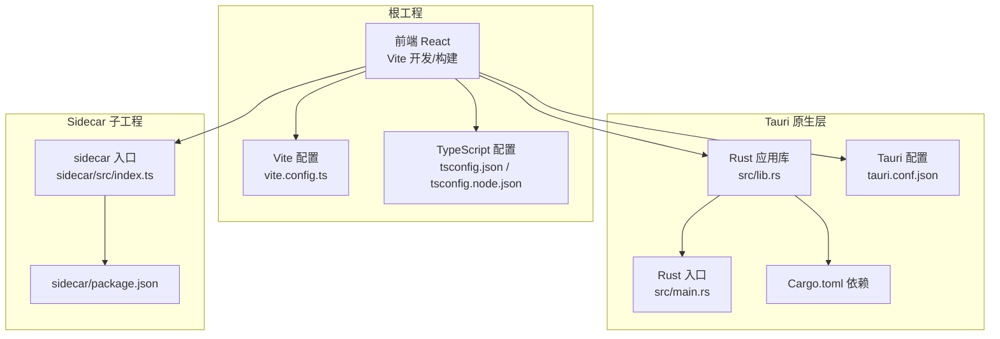
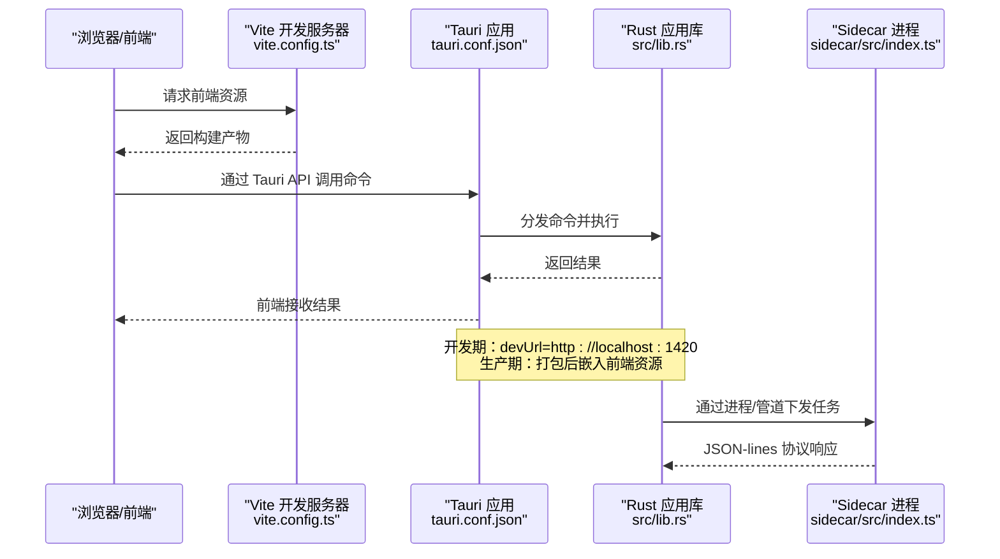
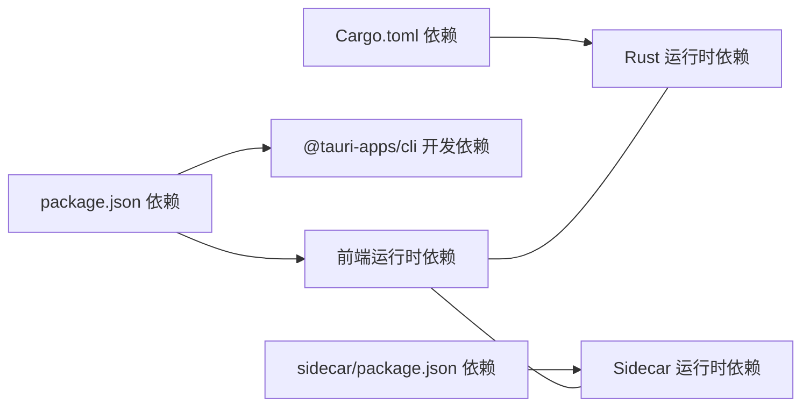

# 快速开始

<cite>
**本文引用的文件**
- [README.md](file://README.md)
- [package.json](file://package.json)
- [vite.config.ts](file://vite.config.ts)
- [tsconfig.json](file://tsconfig.json)
- [tsconfig.node.json](file://tsconfig.node.json)
- [src-tauri/tauri.conf.json](file://src-tauri/tauri.conf.json)
- [src-tauri/Cargo.toml](file://src-tauri/Cargo.toml)
- [src-tauri/src/lib.rs](file://src-tauri/src/lib.rs)
- [src-tauri/src/main.rs](file://src-tauri/src/main.rs)
- [src/main.tsx](file://src/main.tsx)
- [.github/workflows/build.yml](file://.github/workflows/build.yml)
- [sidecar/package.json](file://sidecar/package.json)
- [sidecar/src/index.ts](file://sidecar/src/index.ts)
- [pnpm-workspace.yaml](file://pnpm-workspace.yaml)
</cite>

## 目录
1. [简介](#简介)
2. [项目结构](#项目结构)
3. [核心组件](#核心组件)
4. [架构总览](#架构总览)
5. [详细组件分析](#详细组件分析)
6. [依赖分析](#依赖分析)
7. [性能考虑](#性能考虑)
8. [故障排除指南](#故障排除指南)
9. [结论](#结论)
10. [附录](#附录)

## 简介
本指南面向新加入 RabbitCoding 项目的开发者，帮助你在最短时间内完成环境准备、依赖安装与开发服务器启动，并了解生产构建与部署流程。项目采用 Tauri + React + TypeScript 技术栈，前端使用 Vite 进行开发与打包，Rust 提供系统能力与插件扩展，sidecar 子工程负责与外部 AI 代理的通信。

## 项目结构
项目采用“根仓库 + sidecar 子工程 + Tauri 原生层”的多工程组织方式：
- 根工程：前端 React + TypeScript，Vite 开发服务器与打包
- Tauri 原生层：Rust 编写的桌面应用壳，提供系统能力与插件
- sidecar：Node.js 工程，负责与外部代理的协议交互与任务编排

图表来源
- [vite.config.ts:1-37](file://vite.config.ts#L1-L37)
- [tsconfig.json:1-26](file://tsconfig.json#L1-L26)
- [tsconfig.node.json:1-11](file://tsconfig.node.json#L1-L11)
- [src-tauri/tauri.conf.json:1-52](file://src-tauri/tauri.conf.json#L1-L52)
- [src-tauri/Cargo.toml:1-40](file://src-tauri/Cargo.toml#L1-L40)
- [src-tauri/src/lib.rs:1-317](file://src-tauri/src/lib.rs#L1-L317)
- [src-tauri/src/main.rs:1-7](file://src-tauri/src/main.rs#L1-L7)
- [sidecar/package.json:1-25](file://sidecar/package.json#L1-L25)
- [sidecar/src/index.ts:1-145](file://sidecar/src/index.ts#L1-L145)

章节来源
- [README.md:1-8](file://README.md#L1-L8)
- [package.json:1-46](file://package.json#L1-L46)
- [vite.config.ts:1-37](file://vite.config.ts#L1-L37)
- [tsconfig.json:1-26](file://tsconfig.json#L1-L26)
- [tsconfig.node.json:1-11](file://tsconfig.node.json#L1-L11)
- [src-tauri/tauri.conf.json:1-52](file://src-tauri/tauri.conf.json#L1-L52)
- [src-tauri/Cargo.toml:1-40](file://src-tauri/Cargo.toml#L1-L40)
- [src-tauri/src/lib.rs:1-317](file://src-tauri/src/lib.rs#L1-L317)
- [src-tauri/src/main.rs:1-7](file://src-tauri/src/main.rs#L1-L7)
- [sidecar/package.json:1-25](file://sidecar/package.json#L1-L25)
- [sidecar/src/index.ts:1-145](file://sidecar/src/index.ts#L1-L145)

## 核心组件
- 前端开发与构建
  - 使用 Vite 作为开发服务器与打包工具，React + TypeScript
  - 开发脚本与构建脚本定义于根工程的 package.json
- Tauri 原生层
  - Rust 应用库与入口，注册插件、初始化数据库、注入 Node.js 运行时、窗口状态持久化等
  - Tauri 配置集中于 tauri.conf.json，定义窗口、安全策略、打包资源与插件
- Sidecar 协议
  - Node.js sidecar 通过标准输入/输出与 Rust 主进程通信，实现外部代理任务编排

章节来源
- [package.json:7-12](file://package.json#L7-L12)
- [vite.config.ts:9-36](file://vite.config.ts#L9-L36)
- [src-tauri/tauri.conf.json:6-11](file://src-tauri/tauri.conf.json#L6-L11)
- [src-tauri/src/lib.rs:124-316](file://src-tauri/src/lib.rs#L124-L316)
- [sidecar/src/index.ts:37-91](file://sidecar/src/index.ts#L37-L91)

## 架构总览
下图展示了从浏览器到 Rust 原生层与 sidecar 的典型请求链路，以及开发期与生产期的差异点。

图表来源
- [vite.config.ts:20-30](file://vite.config.ts#L20-L30)
- [src-tauri/tauri.conf.json:7-10](file://src-tauri/tauri.conf.json#L7-L10)
- [src-tauri/src/lib.rs:272-313](file://src-tauri/src/lib.rs#L272-L313)
- [sidecar/src/index.ts:37-91](file://sidecar/src/index.ts#L37-L91)

## 详细组件分析

### 环境要求与安装
- Node.js
  - 推荐版本：由工作流中使用的 Node.js 22.x 作为参考，建议使用匹配的 LTS 版本
  - 包管理器：pnpm，版本由 package.json 的 packageManager 字段声明
- Rust
  - 使用稳定工具链，目标平台根据需要选择（如 aarch64-apple-darwin、x86_64-apple-darwin、x86_64-pc-windows-msvc、aarch64-pc-windows-msvc）
- Tauri CLI
  - 通过 @tauri-apps/cli 安装，用于开发与打包
- VS Code 插件
  - Tauri、rust-analyzer 为官方推荐插件

章节来源
- [README.md:5-8](file://README.md#L5-L8)
- [package.json:6](file://package.json#L6)
- [.github/workflows/build.yml:55-58](file://.github/workflows/build.yml#L55-L58)

### 依赖安装步骤
- 安装根工程依赖
  - 使用 pnpm 安装根依赖（包含前端与 Tauri CLI）
- 安装 sidecar 依赖并构建
  - 进入 sidecar 目录，安装依赖并执行 bundle，生成 sidecar-bundle.js
- 准备 sidecar 资源
  - 执行 setup-resources 脚本，将 sidecar 二进制与 Node 运行时复制到资源目录

章节来源
- [.github/workflows/build.yml:66-78](file://.github/workflows/build.yml#L66-L78)
- [sidecar/package.json:6-11](file://sidecar/package.json#L6-L11)
- [package.json:12](file://package.json#L12)

### 开发环境搭建与启动
- 启动前端开发服务器
  - 使用 Vite 开发服务器，默认监听固定端口，严格端口占用
- 启动 Tauri 应用
  - 使用 Tauri CLI 启动应用，开发期会先运行前端开发服务器
- HMR 与跨主机开发
  - 可通过环境变量配置开发主机地址，实现跨设备热重载

章节来源
- [package.json:8](file://package.json#L8)
- [vite.config.ts:18-30](file://vite.config.ts#L18-L30)
- [src-tauri/tauri.conf.json:7-8](file://src-tauri/tauri.conf.json#L7-L8)

### 生产构建与部署
- 构建前端
  - 先执行类型检查与构建，再由 Tauri 打包
- 构建原生侧车与资源
  - sidecar 打包为 ESM，复制到资源目录；同时下载对应平台的 Node.js 运行时并放入资源
- 版本注入与发布元数据
  - 根据分支或标签动态决定是否为 nightly，注入版本号与更新通道
- 使用 tauri-action 自动化打包与发布
  - 支持多平台目标，自动签名与公证（macOS），并生成更新清单

章节来源
- [.github/workflows/build.yml:66-105](file://.github/workflows/build.yml#L66-L105)
- [.github/workflows/build.yml:129-172](file://.github/workflows/build.yml#L129-L172)
- [.github/workflows/build.yml:174-196](file://.github/workflows/build.yml#L174-L196)

### 开发工具推荐配置
- VS Code
  - Tauri 插件、rust-analyzer 插件
- TypeScript
  - tsconfig.json 与 tsconfig.node.json 提供严格的类型检查与模块解析配置
- Vite
  - vite.config.ts 配置了 React 与 TailwindCSS 插件，禁用清屏、固定端口与 HMR

章节来源
- [README.md:5-8](file://README.md#L5-L8)
- [tsconfig.json:2-22](file://tsconfig.json#L2-L22)
- [tsconfig.node.json:2-8](file://tsconfig.node.json#L2-L8)
- [vite.config.ts:10-13](file://vite.config.ts#L10-L13)

### sidecar 协议与任务编排
- 协议
  - 通过标准输入读取 JSON-lines 命令，标准输出返回 JSON-lines 响应，标准错误用于日志
- 支持的命令
  - start_query、resume_query、cancel_query、compact_query、respond_tool_request、shutdown
- 错误处理
  - 对未知命令与异常进行错误回传，保证协议健壮性

章节来源
- [sidecar/src/index.ts:8-33](file://sidecar/src/index.ts#L8-L33)
- [sidecar/src/index.ts:37-91](file://sidecar/src/index.ts#L37-L91)
- [sidecar/src/index.ts:130-144](file://sidecar/src/index.ts#L130-L144)

## 依赖分析
- 前端依赖
  - React、Ant Design、Monaco Editor、TailwindCSS、@tauri-apps/api 等
- 开发依赖
  - @tauri-apps/cli、@vitejs/plugin-react、typescript、vite
- Rust 依赖
  - tauri、tauri-plugin-*、rusqlite、reqwest、image、tauri-plugin-pty 等
- sidecar 依赖
  - @anthropic-ai/claude-agent-sdk、zod、esbuild

图表来源
- [package.json:14-44](file://package.json#L14-L44)
- [src-tauri/Cargo.toml:20-39](file://src-tauri/Cargo.toml#L20-L39)
- [sidecar/package.json:12-20](file://sidecar/package.json#L12-L20)

章节来源
- [package.json:14-44](file://package.json#L14-L44)
- [src-tauri/Cargo.toml:20-39](file://src-tauri/Cargo.toml#L20-L39)
- [sidecar/package.json:12-20](file://sidecar/package.json#L12-L20)

## 性能考虑
- Vite 固定端口与 HMR
  - 固定端口避免端口冲突，HMR 在跨主机场景下启用 WebSocket
- Rust 异步运行时
  - tokio 多线程运行时提升并发能力
- 数据库与窗口状态
  - rusqlite 与窗口状态插件减少 IO 成本，提升启动速度
- sidecar 协议
  - JSON-lines 流式协议降低解析开销，支持并发处理

章节来源
- [vite.config.ts:18-30](file://vite.config.ts#L18-L30)
- [src-tauri/Cargo.toml:31](file://src-tauri/Cargo.toml#L31)
- [src-tauri/src/lib.rs:134-270](file://src-tauri/src/lib.rs#L134-L270)
- [sidecar/src/index.ts:37-91](file://sidecar/src/index.ts#L37-L91)

## 故障排除指南
- 端口占用
  - Vite 使用固定端口，若被占用需释放或关闭占用进程
- HMR 无法连接
  - 检查跨主机开发环境变量与网络连通性
- sidecar 无响应
  - 确认 sidecar 已正确构建并复制到资源目录；查看标准错误日志
- Tauri 打包缺失资源
  - 确认 sidecar 二进制与 Node.js 运行时已复制到资源目录
- macOS 签名与公证
  - 确保私钥与证书配置正确，Apple API Key 已写入私有目录

章节来源
- [vite.config.ts:20-30](file://vite.config.ts#L20-L30)
- [.github/workflows/build.yml:75-116](file://.github/workflows/build.yml#L75-L116)
- [sidecar/src/index.ts:130-144](file://sidecar/src/index.ts#L130-L144)
- [.github/workflows/build.yml:118-127](file://.github/workflows/build.yml#L118-L127)

## 结论
通过本指南，你可以完成 RabbitCoding 项目的环境准备、依赖安装、开发服务器启动与生产构建部署。建议在开发过程中结合 VS Code 插件与 TypeScript 配置，充分利用 Tauri 的原生能力与 sidecar 的协议机制，逐步深入项目架构与业务逻辑。

## 附录
- 常用命令
  - 启动前端开发服务器：参见 [package.json:8](file://package.json#L8)
  - 启动 Tauri 应用：参见 [package.json:11](file://package.json#L11)
  - 构建前端：参见 [package.json:9](file://package.json#L9)
  - 设置 sidecar 资源：参见 [package.json:12](file://package.json#L12)
- 关键配置
  - Vite：参见 [vite.config.ts:9-36](file://vite.config.ts#L9-L36)
  - TypeScript：参见 [tsconfig.json:1-26](file://tsconfig.json#L1-L26)、[tsconfig.node.json:1-11](file://tsconfig.node.json#L1-L11)
  - Tauri：参见 [src-tauri/tauri.conf.json:1-52](file://src-tauri/tauri.conf.json#L1-L52)
  - Rust：参见 [src-tauri/Cargo.toml:1-40](file://src-tauri/Cargo.toml#L1-L40)
  - Sidecar：参见 [sidecar/package.json:1-25](file://sidecar/package.json#L1-L25)、[sidecar/src/index.ts:1-145](file://sidecar/src/index.ts#L1-L145)
- 工作流
  - 参见 [.github/workflows/build.yml:1-196](file://.github/workflows/build.yml#L1-L196)