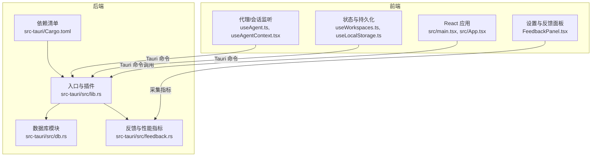
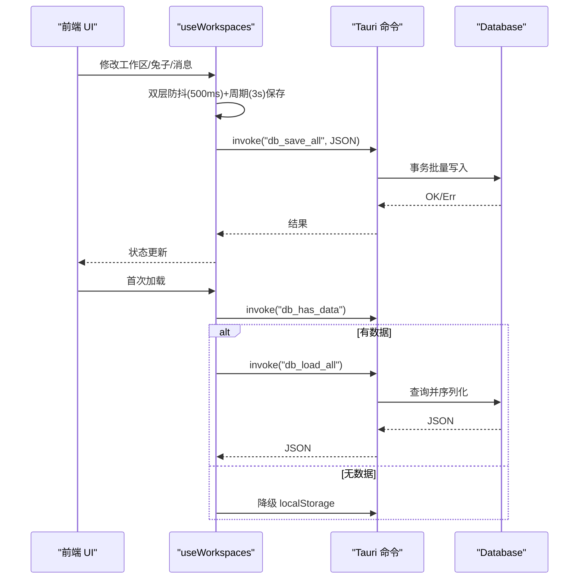
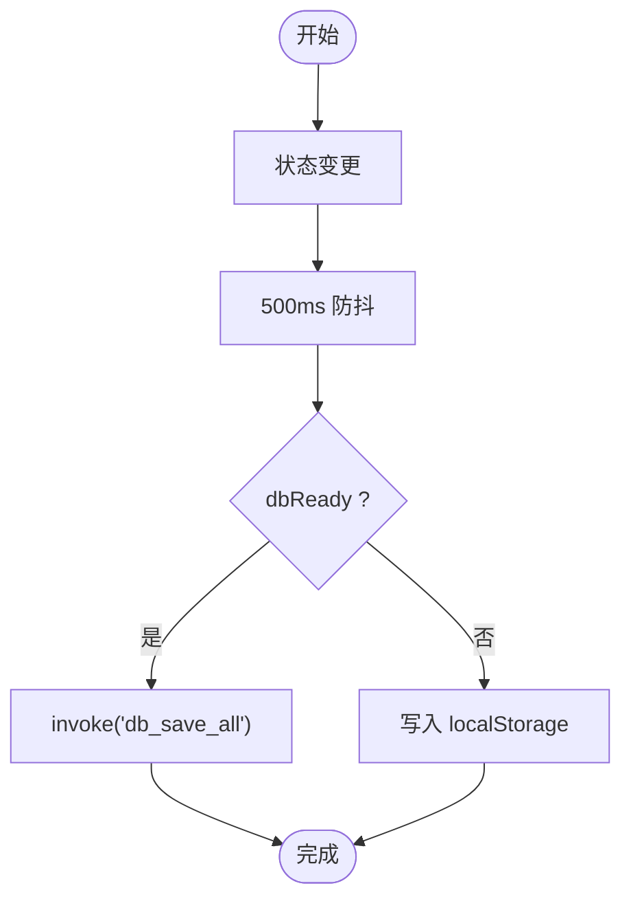
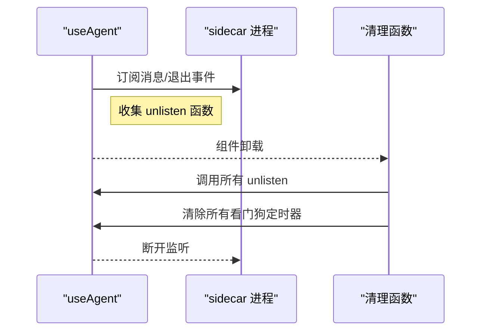
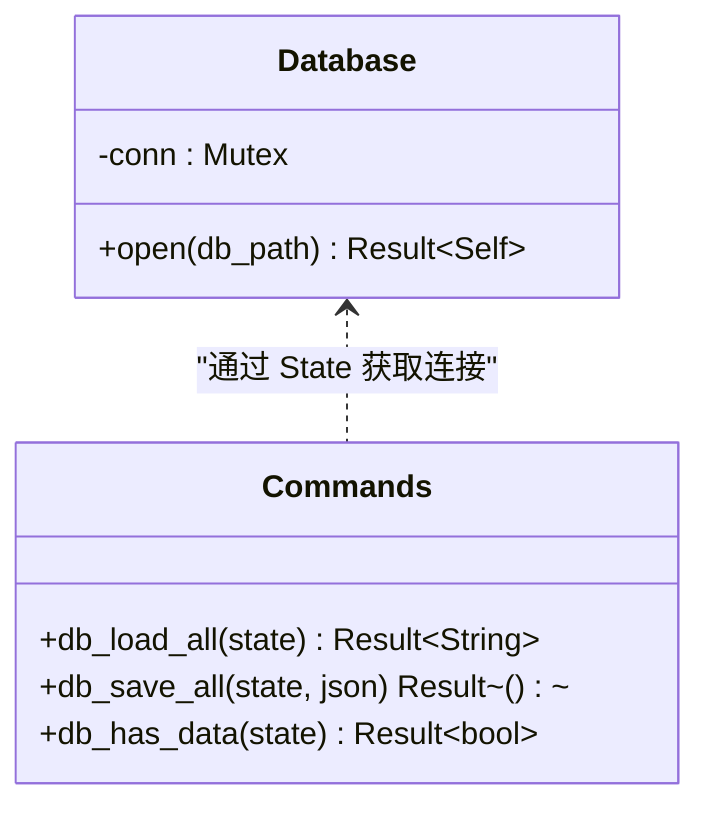
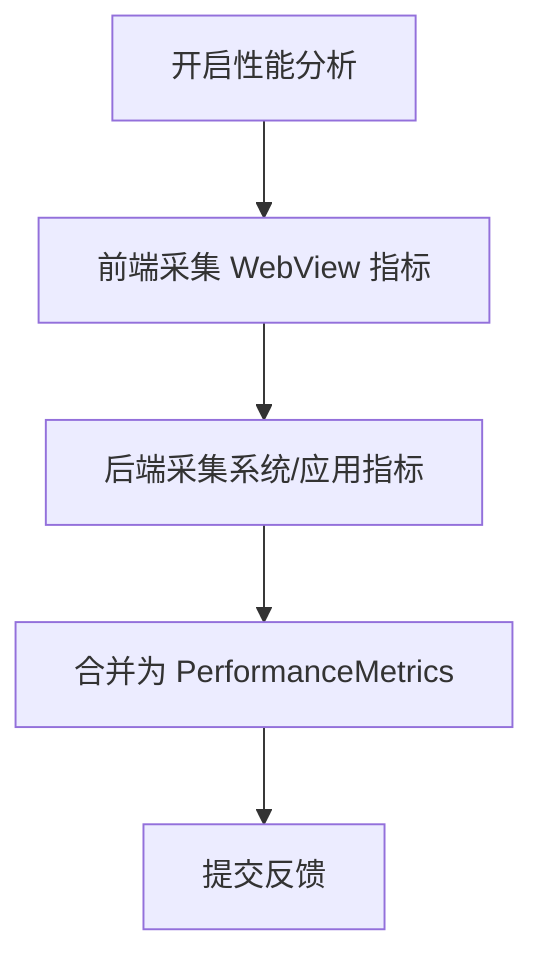
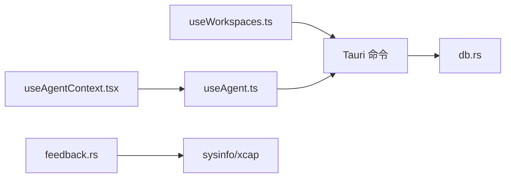

# 内存管理

<cite>
**本文引用的文件**
- [src/main.tsx](file://src/main.tsx)
- [src/App.tsx](file://src/App.tsx)
- [src/hooks/useLocalStorage.ts](file://src/hooks/useLocalStorage.ts)
- [src/hooks/useWorkspaces.ts](file://src/hooks/useWorkspaces.ts)
- [src/hooks/useAgent.ts](file://src/hooks/useAgent.ts)
- [src/hooks/useAgentContext.tsx](file://src/hooks/useAgentContext.tsx)
- [src-tauri/src/lib.rs](file://src-tauri/src/lib.rs)
- [src-tauri/src/db.rs](file://src-tauri/src/db.rs)
- [src-tauri/Cargo.toml](file://src-tauri/Cargo.toml)
- [src-tauri/src/feedback.rs](file://src-tauri/src/feedback.rs)
- [src/components/settings/FeedbackPanel.tsx](file://src/components/settings/FeedbackPanel.tsx)
- [src/types/index.ts](file://src/types/index.ts)
</cite>

## 目录
1. [简介](#简介)
2. [项目结构](#项目结构)
3. [核心组件](#核心组件)
4. [架构总览](#架构总览)
5. [详细组件分析](#详细组件分析)
6. [依赖关系分析](#依赖关系分析)
7. [性能考量](#性能考量)
8. [故障排除指南](#故障排除指南)
9. [结论](#结论)
10. [附录](#附录)

## 简介
本指南聚焦 RabbitCoding 的内存管理策略，涵盖前端 React 状态与持久化、localStorage 使用优化、组件卸载清理；以及 Rust 后端的内存管理、SQLite 内存优化与数据结构选择。文档还提供内存泄漏检测方法、内存使用监控、垃圾回收优化建议、内存分析工具使用、性能瓶颈识别与优化最佳实践，并给出具体示例与故障排除方法。

## 项目结构
RabbitCoding 采用 Tauri v2 + React 前端 + Rust 后端的混合架构。前端负责 UI、状态管理与持久化策略（优先 SQLite，回退 localStorage），后端负责数据库连接、命令处理、系统信息采集与性能指标收集。

图表来源
- [src/main.tsx:1-11](file://src/main.tsx#L1-L11)
- [src/App.tsx:1-107](file://src/App.tsx#L1-L107)
- [src/hooks/useWorkspaces.ts:1-541](file://src/hooks/useWorkspaces.ts#L1-L541)
- [src/hooks/useLocalStorage.ts:1-27](file://src/hooks/useLocalStorage.ts#L1-L27)
- [src/hooks/useAgent.ts:1-334](file://src/hooks/useAgent.ts#L1-L334)
- [src/hooks/useAgentContext.tsx:1-298](file://src/hooks/useAgentContext.tsx#L1-L298)
- [src-tauri/src/lib.rs:196-391](file://src-tauri/src/lib.rs#L196-L391)
- [src-tauri/src/db.rs:1-417](file://src-tauri/src/db.rs#L1-L417)
- [src-tauri/src/feedback.rs:1-200](file://src-tauri/src/feedback.rs#L1-L200)
- [src-tauri/Cargo.toml:1-40](file://src-tauri/Cargo.toml#L1-L40)

章节来源
- [src/main.tsx:1-11](file://src/main.tsx#L1-L11)
- [src/App.tsx:1-107](file://src/App.tsx#L1-L107)
- [src-tauri/src/lib.rs:196-391](file://src-tauri/src/lib.rs#L196-L391)

## 核心组件
- 前端状态与持久化
  - useWorkspaces：集中管理工作区、兔子（会话）、仓库与消息，支持 SQLite 主存储与 localStorage 回退，含双层防抖保存与旧数据兼容。
  - useLocalStorage：封装 localStorage 读写，提供默认值与错误兜底。
- 后端数据库与命令
  - Database：全局数据库状态，使用 Mutex 包裹 rusqlite 连接，开启 WAL、外键与同步策略，提供建表、迁移、全量加载/保存。
  - Tauri 命令：db_load_all、db_save_all、db_has_data 等，驱动前后端数据交互。
- 代理/会话监听与清理
  - useAgent：维护 sidecar 生命周期、消息监听、看门狗定时器，组件卸载时清理监听与定时器，避免泄漏。
  - useAgentContext：包装 start/resume/cancel/compact 等操作，统一错误回滚与状态收敛。
- 性能监控与反馈
  - feedback.rs：采集系统信息、WebView 指标与应用进程指标，形成性能报告。
  - FeedbackPanel：设置面板中可选开启性能分析，展示内存、CPU、DOM 元素等指标。

章节来源
- [src/hooks/useWorkspaces.ts:1-541](file://src/hooks/useWorkspaces.ts#L1-L541)
- [src/hooks/useLocalStorage.ts:1-27](file://src/hooks/useLocalStorage.ts#L1-L27)
- [src-tauri/src/db.rs:1-417](file://src-tauri/src/db.rs#L1-L417)
- [src-tauri/src/lib.rs:196-391](file://src-tauri/src/lib.rs#L196-L391)
- [src/hooks/useAgent.ts:1-334](file://src/hooks/useAgent.ts#L1-L334)
- [src/hooks/useAgentContext.tsx:1-298](file://src/hooks/useAgentContext.tsx#L1-L298)
- [src-tauri/src/feedback.rs:1-200](file://src-tauri/src/feedback.rs#L1-L200)
- [src/components/settings/FeedbackPanel.tsx:392-422](file://src/components/settings/FeedbackPanel.tsx#L392-L422)

## 架构总览
前端通过 Tauri 命令访问后端能力，后端以数据库为中心承载业务数据。前端状态通过双层防抖与周期性保存降低频繁 IO；后端通过事务批量写入与索引优化提升吞吐与内存效率。

图表来源
- [src/hooks/useWorkspaces.ts:48-129](file://src/hooks/useWorkspaces.ts#L48-L129)
- [src-tauri/src/db.rs:392-416](file://src-tauri/src/db.rs#L392-L416)
- [src-tauri/src/lib.rs:344-387](file://src-tauri/src/lib.rs#L344-L387)

## 详细组件分析

### 前端内存管理策略与 localStorage 优化
- 状态集中与不可变更新
  - useWorkspaces 使用 useState 管理工作区树，通过不可变更新（映射/过滤/拼接）生成新对象，减少共享引用导致的意外修改与长生命周期持有。
- 双层防抖与周期保存
  - 防抖层：状态变更后 500ms 触发保存，避免高频写入。
  - 周期层：每 3s 强制保存，覆盖流式输出场景，确保数据一致性。
  - 降级层：当 dbReady=false 或 isLoading=true 时写 localStorage，避免阻塞主线程。
- 旧数据兼容与归一化
  - 对缺失字段进行默认填充，避免运行时反复判断与临时对象创建。
- localStorage 使用优化
  - useLocalStorage 提供默认值与 JSON 解析/序列化，异常时返回默认值，避免崩溃。
  - 写入失败捕获异常，不阻断 UI，保证健壮性。

图表来源
- [src/hooks/useWorkspaces.ts:100-129](file://src/hooks/useWorkspaces.ts#L100-L129)
- [src/hooks/useLocalStorage.ts:13-23](file://src/hooks/useLocalStorage.ts#L13-L23)

章节来源
- [src/hooks/useWorkspaces.ts:1-541](file://src/hooks/useWorkspaces.ts#L1-L541)
- [src/hooks/useLocalStorage.ts:1-27](file://src/hooks/useLocalStorage.ts#L1-L27)

### 组件卸载清理与内存泄漏防护
- 代理监听与看门狗
  - useAgent 在 effect 中注册 sidecar 消息与进程退出监听，并将 unlisten 函数收集到数组，在清理函数中统一调用，同时清除所有看门狗定时器，避免悬挂回调与定时器泄漏。
- 上下文包装与兜底
  - useAgentContext 包装 start/resume/cancel/compact 等操作，失败时回滚状态，避免 UI 永远停留在 running。
- React StrictMode 兼容
  - 在关键 await 前检查取消标志，若组件已卸载立即清理，防止“卸载后写入”造成泄漏。

图表来源
- [src/hooks/useAgent.ts:290-334](file://src/hooks/useAgent.ts#L290-L334)
- [src/hooks/useAgentContext.tsx:150-298](file://src/hooks/useAgentContext.tsx#L150-L298)

章节来源
- [src/hooks/useAgent.ts:1-334](file://src/hooks/useAgent.ts#L1-L334)
- [src/hooks/useAgentContext.tsx:1-298](file://src/hooks/useAgentContext.tsx#L1-L298)

### Rust 后端内存管理与 SQLite 优化
- 数据库连接与并发
  - Database 以 Mutex 包裹 rusqlite::Connection，避免多线程竞争；命令通过 State 获取连接，保证线程安全。
- 事务与批量写入
  - db_save_all 使用 BEGIN/COMMIT/ROLLBACK 控制事务，批量删除四表后再逐条插入，减少锁竞争与碎片化。
- 索引与查询优化
  - 为 rabbits/workspace_id、repos/workspace_id、messages(rabbit_id, seq) 建立索引，加速分页与关联查询。
- PRAGMA 优化
  - WAL 模式、外键约束、NORMAL 同步策略平衡一致性与性能。
- 数据结构选择
  - 使用 serde_json::Value 存储消息内容，配合 JSON 文本列，便于扩展但需注意大消息的内存占用；可通过压缩或外部存储优化（建议）。

图表来源
- [src-tauri/src/db.rs:80-161](file://src-tauri/src/db.rs#L80-L161)
- [src-tauri/src/db.rs:392-416](file://src-tauri/src/db.rs#L392-L416)

章节来源
- [src-tauri/src/db.rs:1-417](file://src-tauri/src/db.rs#L1-L417)
- [src-tauri/src/lib.rs:196-391](file://src-tauri/src/lib.rs#L196-L391)

### 内存使用监控与性能分析
- 指标采集
  - 系统信息：操作系统、版本、架构、CPU 型号/核心数、总内存。
  - 应用指标：应用内存（MB）、CPU 百分比、系统内存/CPU 使用率。
  - WebView 指标：DOM 元素数量、JS Heap（已用/总计）、DOM 完成时间。
- 设置面板
  - 可选开启性能分析，提交反馈时自动附加指标，辅助定位问题。
- 采集流程
  - 前端收集 WebView 指标，后端收集系统与应用指标，合并为 PerformanceMetrics。

图表来源
- [src-tauri/src/feedback.rs:160-200](file://src-tauri/src/feedback.rs#L160-L200)
- [src-tauri/src/feedback.rs:66-83](file://src-tauri/src/feedback.rs#L66-L83)
- [src/components/settings/FeedbackPanel.tsx:392-422](file://src/components/settings/FeedbackPanel.tsx#L392-L422)

章节来源
- [src-tauri/src/feedback.rs:1-200](file://src-tauri/src/feedback.rs#L1-L200)
- [src/components/settings/FeedbackPanel.tsx:392-422](file://src/components/settings/FeedbackPanel.tsx#L392-L422)

## 依赖关系分析
- 前端对后端的依赖
  - useWorkspaces 依赖 Tauri 命令（db_load_all、db_save_all、db_has_data）实现数据持久化。
  - useAgent 依赖 sidecar 通信与 Tauri 命令，依赖 useAgentContext 进行状态收敛。
- 后端对数据库与系统的依赖
  - Database 依赖 rusqlite 与 PRAGMA 配置；feedback.rs 依赖 sysinfo 与 xcap。
- 依赖耦合与内聚
  - 前端 hook 聚合业务逻辑，后端模块职责清晰；通过命令接口解耦前后端。

图表来源
- [src/hooks/useWorkspaces.ts:1-541](file://src/hooks/useWorkspaces.ts#L1-L541)
- [src/hooks/useAgent.ts:1-334](file://src/hooks/useAgent.ts#L1-L334)
- [src/hooks/useAgentContext.tsx:1-298](file://src/hooks/useAgentContext.tsx#L1-L298)
- [src-tauri/src/db.rs:1-417](file://src-tauri/src/db.rs#L1-L417)
- [src-tauri/src/feedback.rs:1-200](file://src-tauri/src/feedback.rs#L1-L200)

章节来源
- [src-tauri/Cargo.toml:1-40](file://src-tauri/Cargo.toml#L1-L40)

## 性能考量
- 前端
  - 避免在渲染路径创建大对象；使用 useMemo/memo 缓存计算结果与子组件。
  - 控制消息数组长度，必要时对历史消息做分页或归档。
  - 使用双层防抖与周期保存平衡一致性与性能。
- 后端
  - 使用 WAL 模式与索引提升查询性能；事务批量写入减少锁竞争。
  - 对大消息内容考虑外部存储或压缩，降低 SQLite 文本列内存占用。
- 监控
  - 定期采集性能指标，结合日志与错误上报定位瓶颈。

## 故障排除指南
- 数据库不可用
  - 现象：db_load_all/db_save_all 失败，UI 显示降级。
  - 处理：检查 app_data_dir 权限与 rabbit.db 可访问性；确认 PRAGMA 初始化成功。
  - 参考
    - [src-tauri/src/lib.rs:213-221](file://src-tauri/src/lib.rs#L213-L221)
    - [src-tauri/src/db.rs:140-161](file://src-tauri/src/db.rs#L140-L161)
- 内存泄漏
  - 现象：组件卸载后仍出现定时器或监听回调。
  - 处理：确认 useAgent 清理逻辑已执行；检查 useAgentContext 的 cancelQuery 是否正确标记并延时清理。
  - 参考
    - [src/hooks/useAgent.ts:290-334](file://src/hooks/useAgent.ts#L290-L334)
    - [src/hooks/useAgentContext.tsx:195-201](file://src/hooks/useAgentContext.tsx#L195-L201)
- localStorage 写入失败
  - 现象：容量不足或不可用导致写入异常。
  - 处理：捕获异常并降级到安全默认值；必要时清理不必要项。
  - 参考
    - [src/hooks/useLocalStorage.ts:16-21](file://src/hooks/useLocalStorage.ts#L16-L21)
- 性能指标缺失
  - 现象：反馈面板未显示内存/CPU 指标。
  - 处理：确认设置中已开启性能分析；检查前端 WebView 指标与后端采集流程。
  - 参考
    - [src/components/settings/FeedbackPanel.tsx:392-422](file://src/components/settings/FeedbackPanel.tsx#L392-L422)
    - [src-tauri/src/feedback.rs:195-200](file://src-tauri/src/feedback.rs#L195-L200)

章节来源
- [src-tauri/src/lib.rs:213-221](file://src-tauri/src/lib.rs#L213-L221)
- [src-tauri/src/db.rs:140-161](file://src-tauri/src/db.rs#L140-L161)
- [src/hooks/useAgent.ts:290-334](file://src/hooks/useAgent.ts#L290-L334)
- [src/hooks/useAgentContext.tsx:195-201](file://src/hooks/useAgentContext.tsx#L195-L201)
- [src/hooks/useLocalStorage.ts:16-21](file://src/hooks/useLocalStorage.ts#L16-L21)
- [src/components/settings/FeedbackPanel.tsx:392-422](file://src/components/settings/FeedbackPanel.tsx#L392-L422)
- [src-tauri/src/feedback.rs:195-200](file://src-tauri/src/feedback.rs#L195-L200)

## 结论
RabbitCoding 在前端通过不可变更新、双层防抖与 localStorage 回退保障状态一致性与健壮性；在后端通过事务批量写入、索引与 PRAGMA 优化提升 SQLite 性能与内存效率。配合完善的监听清理与性能监控机制，整体内存管理策略兼顾稳定性与可观测性。建议后续针对大消息内容引入外部存储或压缩策略，进一步降低内存峰值。

## 附录
- 关键类型与消息模型
  - Rabbit/Workspace/Repo 结构体定义与消息类型集合，支撑前端状态与后端序列化。
  - 参考
    - [src/types/index.ts:8-32](file://src/types/index.ts#L8-L32)
    - [src/types/index.ts:82-200](file://src/types/index.ts#L82-L200)

章节来源
- [src/types/index.ts:1-200](file://src/types/index.ts#L1-L200)