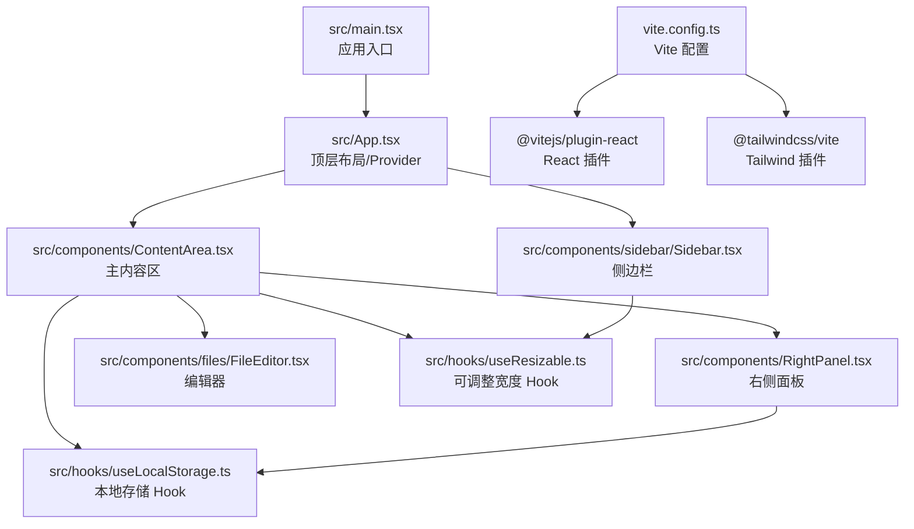
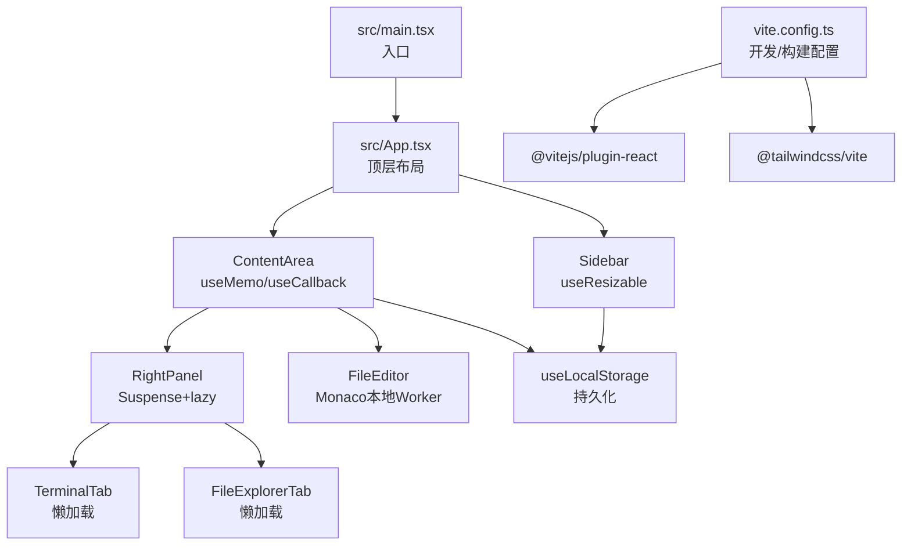
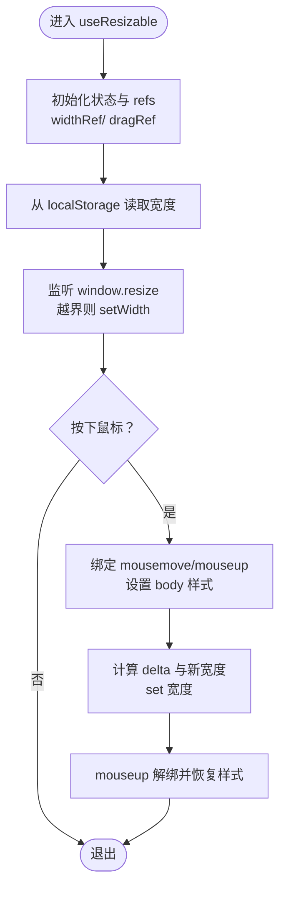
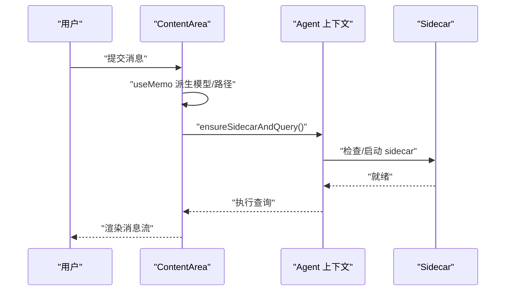
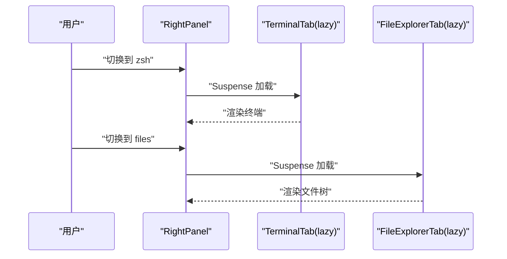
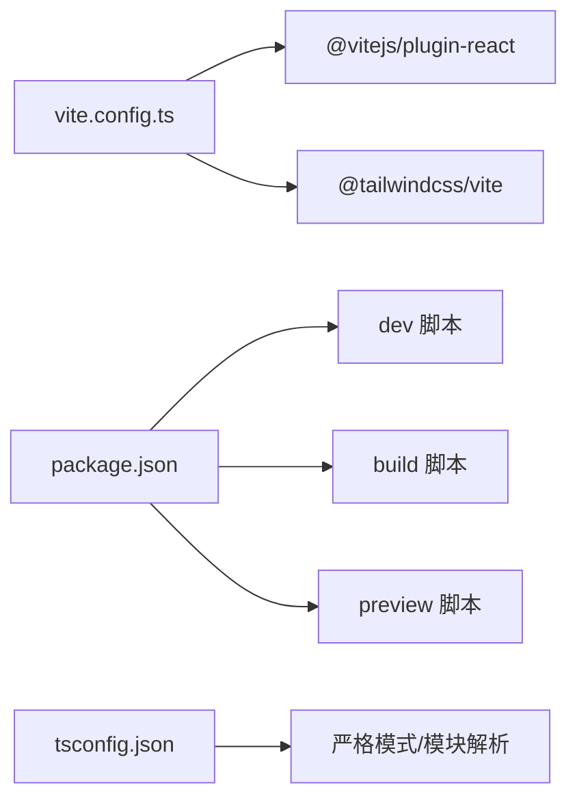

# 前端性能优化

<cite>
**本文引用的文件**
- [vite.config.ts](file://vite.config.ts)
- [package.json](file://package.json)
- [tsconfig.json](file://tsconfig.json)
- [tsconfig.node.json](file://tsconfig.node.json)
- [src/main.tsx](file://src/main.tsx)
- [src/App.tsx](file://src/App.tsx)
- [src/hooks/useResizable.ts](file://src/hooks/useResizable.ts)
- [src/hooks/useLocalStorage.ts](file://src/hooks/useLocalStorage.ts)
- [src/components/sidebar/Sidebar.tsx](file://src/components/sidebar/Sidebar.tsx)
- [src/components/ContentArea.tsx](file://src/components/ContentArea.tsx)
- [src/components/RightPanel.tsx](file://src/components/RightPanel.tsx)
- [src/components/files/FileEditor.tsx](file://src/components/files/FileEditor.tsx)
- [src/components/common/ContextMenu.tsx](file://src/components/common/ContextMenu.tsx)
- [src/utils/notify.ts](file://src/utils/notify.ts)
- [src/components/settings/FeedbackPanel.tsx](file://src/components/settings/FeedbackPanel.tsx)
</cite>

## 目录
1. [简介](#简介)
2. [项目结构](#项目结构)
3. [核心组件](#核心组件)
4. [架构总览](#架构总览)
5. [详细组件分析](#详细组件分析)
6. [依赖关系分析](#依赖关系分析)
7. [性能考量](#性能考量)
8. [故障排查指南](#故障排查指南)
9. [结论](#结论)
10. [附录](#附录)

## 简介
本指南面向 RabbitCoding 前端，系统性梳理并给出可操作的性能优化方案，重点覆盖：
- React 组件渲染优化：memo、useMemo、useCallback、事件处理去抖节流、避免不必要的重渲染
- 状态管理优化：集中式状态与局部状态分离、useLocalStorage 的持久化与异常兜底
- 事件处理优化：拖拽与鼠标事件的最小监听范围、防抖与资源回收
- useResizable Hook 的性能实现：最小化计算、ref 与状态同步、窗口 resize 回收
- Vite 构建优化：插件配置、开发服务器与 HMR、忽略路径、打包产物体积控制
- 代码分割与懒加载：Suspense + lazy 的按需加载、右侧面板的标签页懒加载
- 性能监控与调试：React DevTools 分析、内存使用观察、性能指标采集
- 最佳实践与示例：结合现有代码路径，提供可落地的优化建议

## 项目结构
RabbitCoding 前端采用 React + Vite 架构，主要目录与职责如下：
- src/main.tsx：应用入口，StrictMode 包裹根组件
- src/App.tsx：顶层布局与 Provider 组合，视图切换与主题同步
- src/hooks：通用 Hook，如 useResizable、useLocalStorage
- src/components：功能模块组件，如 Sidebar、ContentArea、RightPanel、FileEditor
- vite.config.ts：Vite 开发与构建配置，集成 React 插件与 TailwindCSS 插件
- package.json：脚本与依赖声明
- tsconfig.json/tsconfig.node.json：TypeScript 编译配置

**图表来源**
- [src/main.tsx:1-11](file://src/main.tsx#L1-L11)
- [src/App.tsx:1-107](file://src/App.tsx#L1-L107)
- [src/components/sidebar/Sidebar.tsx:1-46](file://src/components/sidebar/Sidebar.tsx#L1-L46)
- [src/components/ContentArea.tsx:1-668](file://src/components/ContentArea.tsx#L1-L668)
- [src/components/RightPanel.tsx:1-740](file://src/components/RightPanel.tsx#L1-L740)
- [src/components/files/FileEditor.tsx:1-182](file://src/components/files/FileEditor.tsx#L1-L182)
- [vite.config.ts:1-37](file://vite.config.ts#L1-L37)

**章节来源**
- [src/main.tsx:1-11](file://src/main.tsx#L1-L11)
- [src/App.tsx:1-107](file://src/App.tsx#L1-L107)
- [vite.config.ts:1-37](file://vite.config.ts#L1-L37)

## 核心组件
- useResizable：提供可拖拽调整宽度的能力，结合 useLocalStorage 持久化宽度，窗口 resize 时进行上限校验，拖拽过程最小化计算与 DOM 修改
- useLocalStorage：封装 localStorage 读写，带异常兜底，避免因存储不可用导致崩溃
- Sidebar：使用 useResizable 控制宽度，拖拽手柄仅在 hover 或拖拽时改变样式
- ContentArea：主内容区，负责模型配置、代理配置、API Key 管理、Sidecar 生命周期、消息流处理等，大量使用 useMemo/useCallback 降低重渲染
- RightPanel：右侧面板，包含 summary/zsh/files/spec 多标签页，zsh 使用 Suspense + lazy 懒加载，减少初始包体与首屏压力
- FileEditor：基于 Monaco Editor，本地 Worker，避免 CDN 依赖，提升离线稳定性与加载速度
- ContextMenu：菜单点击外部关闭，wheel 关闭，移除事件时解绑，防止内存泄漏
- notify：Web Audio API 声音提示，按需创建 AudioContext，窗口失焦恢复，避免自动播放限制

**章节来源**
- [src/hooks/useResizable.ts:1-95](file://src/hooks/useResizable.ts#L1-L95)
- [src/hooks/useLocalStorage.ts:1-26](file://src/hooks/useLocalStorage.ts#L1-L26)
- [src/components/sidebar/Sidebar.tsx:1-46](file://src/components/sidebar/Sidebar.tsx#L1-L46)
- [src/components/ContentArea.tsx:1-668](file://src/components/ContentArea.tsx#L1-L668)
- [src/components/RightPanel.tsx:1-740](file://src/components/RightPanel.tsx#L1-L740)
- [src/components/files/FileEditor.tsx:1-182](file://src/components/files/FileEditor.tsx#L1-L182)
- [src/components/common/ContextMenu.tsx:1-35](file://src/components/common/ContextMenu.tsx#L1-L35)
- [src/utils/notify.ts:134-166](file://src/utils/notify.ts#L134-L166)

## 架构总览
下图展示前端关键交互链路：入口 -> 布局 -> 业务组件 -> Hook 与状态 -> 构建与运行时。

**图表来源**
- [src/main.tsx:1-11](file://src/main.tsx#L1-L11)
- [src/App.tsx:1-107](file://src/App.tsx#L1-L107)
- [src/components/sidebar/Sidebar.tsx:1-46](file://src/components/sidebar/Sidebar.tsx#L1-L46)
- [src/components/ContentArea.tsx:1-668](file://src/components/ContentArea.tsx#L1-L668)
- [src/components/RightPanel.tsx:1-740](file://src/components/RightPanel.tsx#L1-L740)
- [src/components/files/FileEditor.tsx:1-182](file://src/components/files/FileEditor.tsx#L1-L182)
- [vite.config.ts:1-37](file://vite.config.ts#L1-L37)

## 详细组件分析

### useResizable Hook 性能实现
- 设计要点
  - 使用 useRef 保存当前宽度与拖拽起点，避免每次渲染都产生新值
  - 使用 useLocalStorage 持久化宽度，初始化时从 localStorage 读取，避免重复 IO
  - 窗口 resize 时仅在越界时 setWidth，减少无效更新
  - 拖拽阶段仅计算新宽度并 setWidth，样式修改集中在手柄元素，避免影响其他节点
  - 支持 reverse 方向与最大宽度比例，满足不同布局需求
- 性能收益
  - 事件绑定/解绑在 useEffect 中完成，拖拽结束即解绑，避免内存泄漏
  - 通过 widthRef 与 useCallback 包裹 handleMouseDown，降低下游组件重渲染
- 优化建议
  - 可引入节流/防抖于 mousemove，进一步降低高频事件对主线程的影响
  - 对 maxWidthRatio 的计算结果缓存，避免重复计算

**图表来源**
- [src/hooks/useResizable.ts:17-94](file://src/hooks/useResizable.ts#L17-L94)

**章节来源**
- [src/hooks/useResizable.ts:1-95](file://src/hooks/useResizable.ts#L1-L95)
- [src/components/sidebar/Sidebar.tsx:18-44](file://src/components/sidebar/Sidebar.tsx#L18-L44)
- [src/components/ContentArea.tsx:59-65](file://src/components/ContentArea.tsx#L59-L65)

### 组件重渲染控制与事件处理优化
- ContentArea
  - 大量使用 useMemo 派生只读数据（模型选项、有效模型字符串），避免子组件重复计算
  - 使用 useCallback 包裹提交、取消、压缩等函数，减少下游组件重渲染
  - 通过 ref 存储 pending query，避免闭包捕获陈旧状态
  - 代理指纹与 API Key 变更时，仅在必要时重启 sidecar，减少不必要开销
- Sidebar
  - 仅在 isResizing 时改变样式，避免常驻样式变更
- ContextMenu
  - 仅在组件挂载时添加事件监听，卸载时统一移除，防止内存泄漏
- notify
  - 按需创建 AudioContext，失焦恢复，避免自动播放限制带来的失败

**图表来源**
- [src/components/ContentArea.tsx:97-169](file://src/components/ContentArea.tsx#L97-L169)

**章节来源**
- [src/components/ContentArea.tsx:1-668](file://src/components/ContentArea.tsx#L1-L668)
- [src/components/sidebar/Sidebar.tsx:1-46](file://src/components/sidebar/Sidebar.tsx#L1-L46)
- [src/components/common/ContextMenu.tsx:1-35](file://src/components/common/ContextMenu.tsx#L1-L35)
- [src/utils/notify.ts:134-166](file://src/utils/notify.ts#L134-L166)

### 右侧面板懒加载与内存管理
- 右侧面板采用 Suspense + lazy 按需加载 zsh 与文件浏览标签页，减少初始包体
- zsh 标签页始终挂载，通过 visibility 控制可见性，保持 xterm canvas 存活，避免频繁重建导致的闪烁与重排
- spec 文档切换通过 Map 选择当前活跃文件，读取时使用 invoke 读取受限路径，避免权限问题

**图表来源**
- [src/components/RightPanel.tsx:34-36](file://src/components/RightPanel.tsx#L34-L36)
- [src/components/RightPanel.tsx:697-713](file://src/components/RightPanel.tsx#L697-L713)
- [src/components/RightPanel.tsx:715-728](file://src/components/RightPanel.tsx#L715-L728)

**章节来源**
- [src/components/RightPanel.tsx:1-740](file://src/components/RightPanel.tsx#L1-L740)

### 编辑器性能与离线稳定性
- FileEditor 使用本地 Monaco 包与 Worker，避免 CDN 依赖，提升离线可用性与加载速度
- 主题随 useTheme 切换，自动选择 vs 或 vs-dark
- 通过 getLanguage 根据文件扩展名映射语言，减少不必要的切换

**章节来源**
- [src/components/files/FileEditor.tsx:1-182](file://src/components/files/FileEditor.tsx#L1-L182)

## 依赖关系分析
- 构建与运行时
  - @vitejs/plugin-react：启用 React JSX transform 与 HMR
  - @tailwindcss/vite：集成 TailwindCSS
  - TypeScript 配置开启 bundler 模式与严格模式，提升类型安全
- 依赖与脚本
  - package.json 定义 dev/build/preview/tauri 等脚本，构建时先 tsc 再 vite build

**图表来源**
- [vite.config.ts:1-37](file://vite.config.ts#L1-L37)
- [package.json:1-46](file://package.json#L1-L46)
- [tsconfig.json:1-25](file://tsconfig.json#L1-L25)

**章节来源**
- [vite.config.ts:1-37](file://vite.config.ts#L1-L37)
- [package.json:1-46](file://package.json#L1-L46)
- [tsconfig.json:1-25](file://tsconfig.json#L1-L25)
- [tsconfig.node.json:1-10](file://tsconfig.node.json#L1-L10)

## 性能考量
- 渲染优化
  - 使用 useMemo/useCallback 缓存昂贵计算与回调，减少子组件重渲染
  - 合理拆分组件边界，避免父组件小变引起全树重渲染
- 事件与交互
  - 事件监听范围最小化，拖拽结束后及时解绑
  - 高频事件（mousemove）可考虑节流/防抖
- 状态管理
  - 将可持久化的尺寸、面板开关等放入 useLocalStorage，减少网络请求与服务端耦合
  - 对大对象或数组的更新采用不可变更新策略，配合浅比较
- 构建与加载
  - 代码分割与懒加载：右侧面板标签页按需加载
  - 减少第三方 CDN 依赖，Monaco 使用本地 Worker
  - 生产构建开启压缩与 Tree-shaking（由 Vite/TS 默认行为保障）
- 内存与资源
  - 卸载时移除事件监听，避免内存泄漏
  - AudioContext 按需创建与恢复，避免自动播放限制
- 监控与分析
  - 使用 React DevTools Profiler 分析渲染耗时与重渲染热点
  - 结合浏览器性能面板（Performance/Network）定位卡顿与资源瓶颈
  - 设置性能指标采集（内存、CPU、帧率），在反馈面板中展示

[本节为通用指导，不直接分析具体文件，故无“章节来源”]

## 故障排查指南
- 拖拽失效或内存泄漏
  - 检查拖拽事件是否正确绑定与解绑
  - 确认 isResizing 状态与 ref 更新顺序
- 右侧面板闪烁或卡顿
  - 确认 zsh 标签页通过 visibility 控制而非显隐切换
  - 检查懒加载组件的 Suspense fallback 是否合理
- 编辑器无法加载或语言识别错误
  - 检查 Monaco Worker 配置与文件扩展名映射
- 性能指标不可见
  - 确认反馈面板中性能开关已开启
  - 检查平台 API 是否可用（如内存/CPU 信息）

**章节来源**
- [src/components/common/ContextMenu.tsx:1-35](file://src/components/common/ContextMenu.tsx#L1-L35)
- [src/components/RightPanel.tsx:697-713](file://src/components/RightPanel.tsx#L697-L713)
- [src/components/files/FileEditor.tsx:1-182](file://src/components/files/FileEditor.tsx#L1-L182)
- [src/components/settings/FeedbackPanel.tsx:392-422](file://src/components/settings/FeedbackPanel.tsx#L392-L422)

## 结论
通过在渲染、状态、事件、构建与懒加载等方面的系统性优化，RabbitCoding 能够获得更流畅的用户体验与更低的资源占用。建议持续使用 React DevTools 与浏览器性能工具进行回归测试，并在新增功能时遵循本文的最佳实践，确保性能与体验的长期稳定。

[本节为总结性内容，不直接分析具体文件，故无“章节来源”]

## 附录
- 优化清单
  - 对高频渲染组件使用 memo/useMemo/useCallback
  - 事件监听最小化并及时解绑
  - 使用 useLocalStorage 管理可持久化 UI 状态
  - 采用 Suspense + lazy 进行代码分割
  - 减少第三方 CDN 依赖，使用本地资源
  - 使用 React DevTools Profiler 与浏览器性能面板持续监控

[本节为补充说明，不直接分析具体文件，故无“章节来源”]