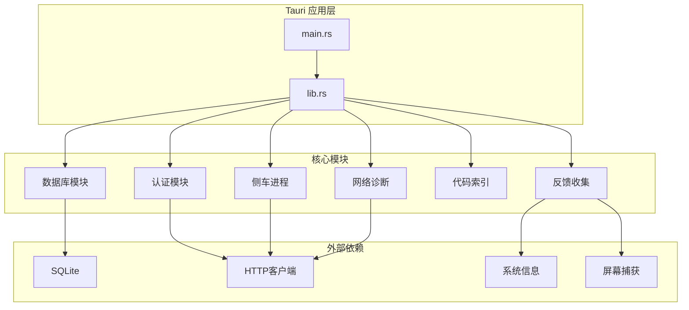
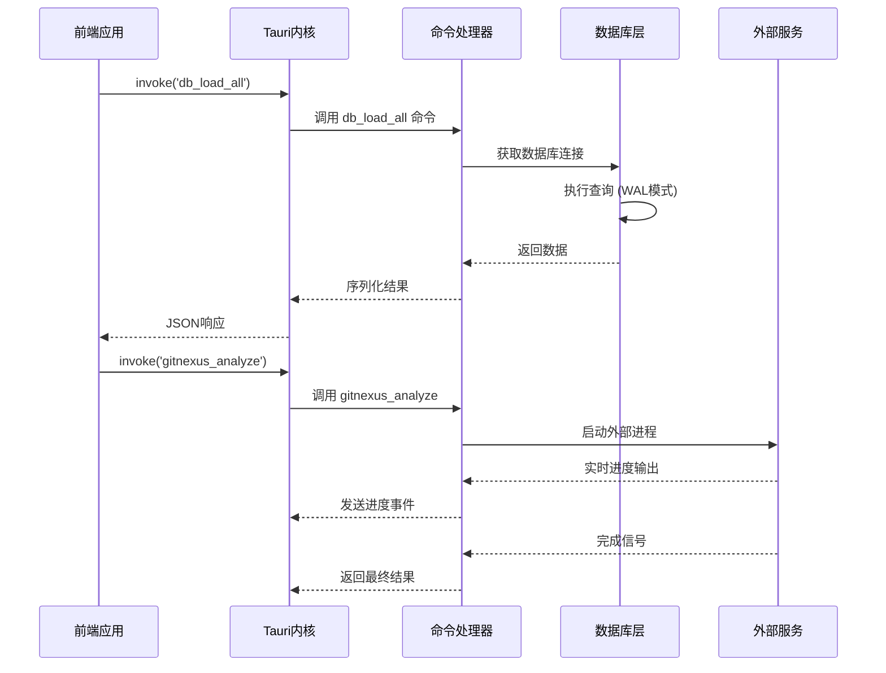
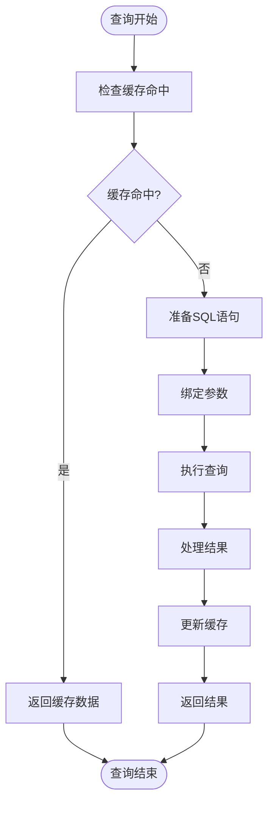
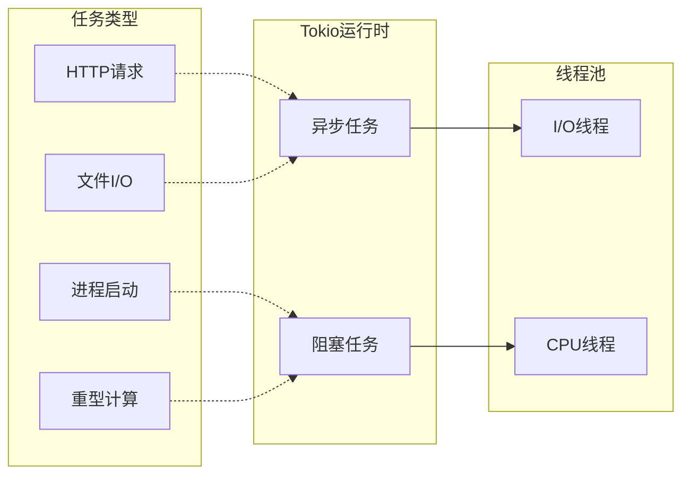
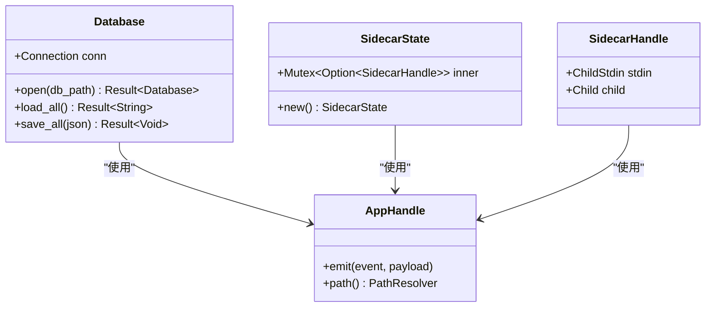
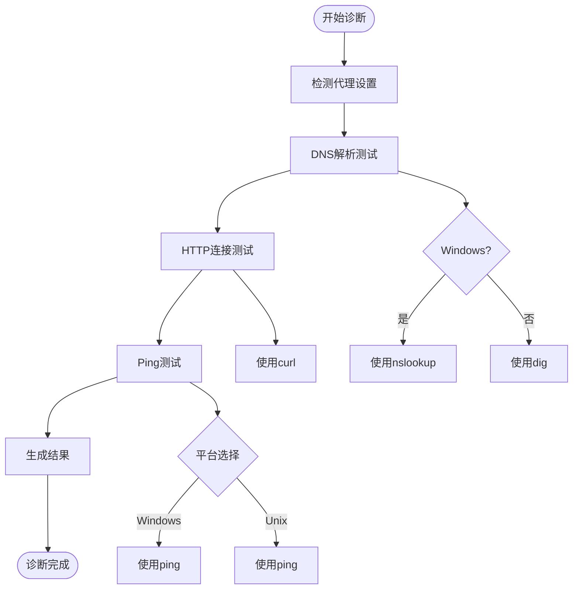
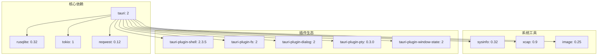

# RabbitCoding 后端性能优化指南

<cite>
**本文档引用的文件**
- [Cargo.toml](file://src-tauri/Cargo.toml)
- [main.rs](file://src-tauri/src/main.rs)
- [lib.rs](file://src-tauri/src/lib.rs)
- [db.rs](file://src-tauri/src/db.rs)
- [auth.rs](file://src-tauri/src/auth.rs)
- [sidecar.rs](file://src-tauri/src/sidecar.rs)
- [network.rs](file://src-tauri/src/network.rs)
- [gitnexus.rs](file://src-tauri/src/gitnexus.rs)
- [model_test.rs](file://src-tauri/src/model_test.rs)
- [ecc.rs](file://src-tauri/src/ecc.rs)
- [integration.rs](file://src-tauri/src/integration.rs)
- [feedback.rs](file://src-tauri/src/feedback.rs)
- [README.md](file://README.md)
</cite>

## 目录
1. [简介](#简介)
2. [项目结构](#项目结构)
3. [核心组件](#核心组件)
4. [架构概览](#架构概览)
5. [详细组件分析](#详细组件分析)
6. [依赖关系分析](#依赖关系分析)
7. [性能考虑](#性能考虑)
8. [故障排除指南](#故障排除指南)
9. [结论](#结论)

## 简介

RabbitCoding 是一个基于 Tauri + React + TypeScript 的桌面应用程序，专注于代码协作和智能代理功能。本文档提供了全面的后端性能优化指南，涵盖 Rust 后端性能优化策略、数据库操作优化、并发处理优化、SQLite 查询优化、事务管理、连接池配置、Tauri 命令处理优化、异步操作优化以及内存管理。

## 项目结构

RabbitCoding 采用模块化的 Rust 后端架构，主要组件包括：

**图表来源**
- [main.rs:1-7](file://src-tauri/src/main.rs#L1-L7)
- [lib.rs:1-391](file://src-tauri/src/lib.rs#L1-L391)

**章节来源**
- [main.rs:1-7](file://src-tauri/src/main.rs#L1-L7)
- [lib.rs:1-391](file://src-tauri/src/lib.rs#L1-L391)

## 核心组件

### 数据库管理系统

数据库模块使用 rusqlite 提供高性能的本地数据存储，采用 WAL 模式和适当的索引策略：

- **WAL 模式**：提高并发读取性能
- **外键约束**：确保数据完整性
- **同步模式**：NORMAL 平衡性能和安全性
- **复合索引**：优化常用查询模式

### 异步任务处理

系统广泛使用 Tokio 异步运行时处理 I/O 密集型操作：

- **阻塞任务**：使用 `tokio::task::spawn_blocking` 处理 CPU 密集型操作
- **异步 HTTP**：使用 reqwest 处理网络请求
- **线程池**：合理分配计算和 I/O 任务

### 进程管理

Sidecar 模块负责管理外部进程，提供隔离的运行环境：

- **进程隔离**：使用独立的配置目录
- **环境变量控制**：精确控制外部工具行为
- **状态监控**：实时监控进程健康状况

**章节来源**
- [db.rs:1-417](file://src-tauri/src/db.rs#L1-L417)
- [sidecar.rs:1-359](file://src-tauri/src/sidecar.rs#L1-L359)

## 架构概览

**图表来源**
- [lib.rs:344-387](file://src-tauri/src/lib.rs#L344-L387)
- [db.rs:392-416](file://src-tauri/src/db.rs#L392-L416)
- [gitnexus.rs:383-561](file://src-tauri/src/gitnexus.rs#L383-L561)

## 详细组件分析

### 数据库优化策略

#### SQLite 查询优化

数据库模块实现了多种查询优化技术：

**图表来源**
- [db.rs:167-288](file://src-tauri/src/db.rs#L167-L288)

#### 事务管理优化

数据库事务采用批量操作策略：

- **批量删除**：先清空所有表，再批量插入
- **原子性保证**：使用 BEGIN/COMMIT/ROLLBACK
- **错误恢复**：自动回滚失败的事务

#### 连接池配置

虽然当前使用单连接，但设计支持连接池扩展：

- **Mutex 包装**：线程安全的连接访问
- **锁粒度**：最小化锁持有时间
- **连接复用**：避免频繁建立/销毁连接

**章节来源**
- [db.rs:85-161](file://src-tauri/src/db.rs#L85-L161)
- [db.rs:290-386](file://src-tauri/src/db.rs#L290-L386)

### 并发处理优化

#### 异步任务调度

系统采用混合并发模型：

**图表来源**
- [network.rs:366-375](file://src-tauri/src/network.rs#L366-L375)
- [gitnexus.rs:187-311](file://src-tauri/src/gitnexus.rs#L187-L311)

#### 线程间通信

使用 Rust 的 `Arc<Mutex<T>>` 实现线程安全的数据共享：

- **进度报告**：实时向前端发送任务进度
- **错误传播**：确保错误信息完整传递
- **资源清理**：优雅处理线程生命周期

**章节来源**
- [gitnexus.rs:208-261](file://src-tauri/src/gitnexus.rs#L208-L261)
- [feedback.rs:121-158](file://src-tauri/src/feedback.rs#L121-L158)

### Tauri 命令处理优化

#### 命令注册机制

系统采用集中式的命令注册模式：

**图表来源**
- [db.rs:81-83](file://src-tauri/src/db.rs#L81-L83)
- [sidecar.rs:7-14](file://src-tauri/src/sidecar.rs#L7-L14)

#### 性能监控集成

反馈模块提供全面的性能监控能力：

- **系统资源监控**：CPU、内存使用情况
- **WebView 指标**：DOM元素数量、JavaScript堆使用
- **应用指标**：进程内存、CPU占用率
- **屏幕截图**：完整的视觉证据

**章节来源**
- [feedback.rs:195-235](file://src-tauri/src/feedback.rs#L195-L235)
- [lib.rs:344-387](file://src-tauri/src/lib.rs#L344-L387)

### 网络诊断优化

#### 多平台网络测试

网络模块提供跨平台的网络诊断能力：

**图表来源**
- [network.rs:207-375](file://src-tauri/src/network.rs#L207-L375)
- [network.rs:391-550](file://src-tauri/src/network.rs#L391-L550)

#### 代理检测机制

系统能够自动检测各种代理配置：

- **环境变量检测**：HTTP_PROXY、HTTPS_PROXY 等
- **系统代理检测**：Windows 的 netsh、macOS 的 scutil
- **智能代理识别**：区分不同类型的代理服务器

**章节来源**
- [network.rs:100-201](file://src-tauri/src/network.rs#L100-L201)
- [network.rs:366-550](file://src-tauri/src/network.rs#L366-L550)

## 依赖关系分析

**图表来源**
- [Cargo.toml:20-39](file://src-tauri/Cargo.toml#L20-L39)

**章节来源**
- [Cargo.toml:1-40](file://src-tauri/Cargo.toml#L1-L40)

## 性能考虑

### CPU 使用率优化

1. **异步 I/O 优先**：所有网络和文件操作都使用异步方式
2. **阻塞任务分离**：CPU 密集型任务使用 `spawn_blocking`
3. **线程池配置**：利用 Tokio 的多线程运行时

### 内存使用监控

系统提供多层次的内存监控：

- **进程内存**：当前应用使用的物理内存
- **系统内存**：整体系统内存使用率
- **WebView 内存**：前端渲染引擎的内存占用
- **垃圾回收**：定期清理无用数据结构

### 磁盘 I/O 优化

- **WAL 模式**：提高并发读取性能
- **批量操作**：减少磁盘写入次数
- **索引优化**：为常用查询字段建立索引

### 网络性能优化

- **连接复用**：HTTP 客户端复用连接
- **超时控制**：合理的请求超时设置
- **错误重试**：智能的失败重试机制

## 故障排除指南

### 常见性能问题

#### 数据库性能问题

**症状**：查询响应缓慢，大量锁等待

**解决方案**：
1. 检查索引使用情况
2. 优化查询语句
3. 考虑增加连接池大小
4. 分析慢查询日志

#### 内存泄漏问题

**症状**：内存使用持续增长

**排查步骤**：
1. 使用 `sysinfo` 模块监控内存使用
2. 检查循环引用
3. 确认资源正确释放
4. 使用内存分析工具

#### 并发死锁问题

**症状**：应用无响应

**预防措施**：
1. 统一的锁获取顺序
2. 设置锁超时
3. 避免在锁内进行 I/O 操作
4. 使用 RAII 模式管理资源

**章节来源**
- [feedback.rs:195-235](file://src-tauri/src/feedback.rs#L195-L235)
- [db.rs:140-161](file://src-tauri/src/db.rs#L140-L161)

## 结论

RabbitCoding 的后端架构展现了现代桌面应用的最佳实践。通过合理的模块化设计、异步编程模型和性能监控机制，系统能够在保证功能完整性的同时提供优秀的性能表现。

### 关键优化成果

1. **高性能数据库**：SQLite + WAL 模式提供出色的并发性能
2. **异步架构**：充分利用 Tokio 运行时的优势
3. **进程隔离**：Sidecar 模式确保外部工具的稳定运行
4. **全面监控**：内置的性能监控帮助及时发现和解决问题

### 未来优化方向

1. **连接池扩展**：从单连接升级到连接池
2. **查询缓存**：实现智能查询结果缓存
3. **内存池**：为大对象分配专门的内存池
4. **性能分析工具**：集成更详细的性能分析功能

通过持续的性能优化和监控，RabbitCoding 能够为用户提供流畅、稳定的开发体验。