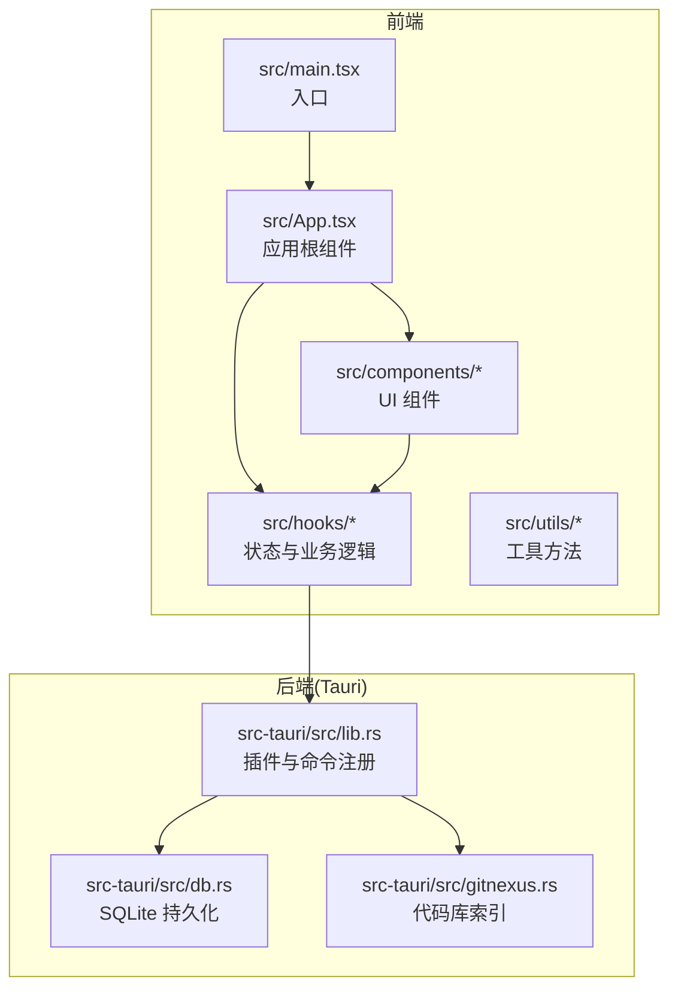
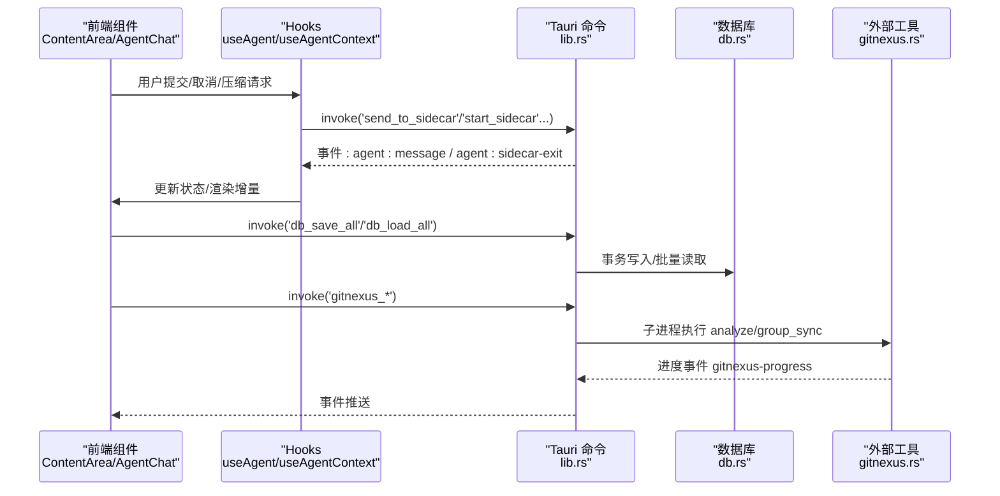
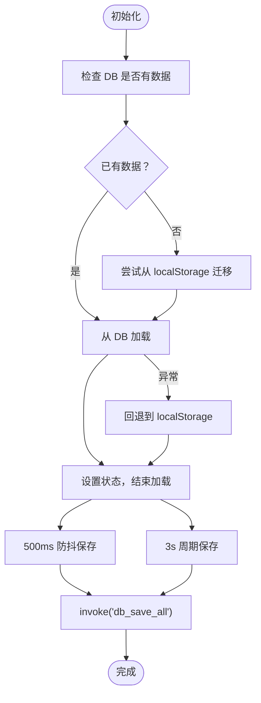
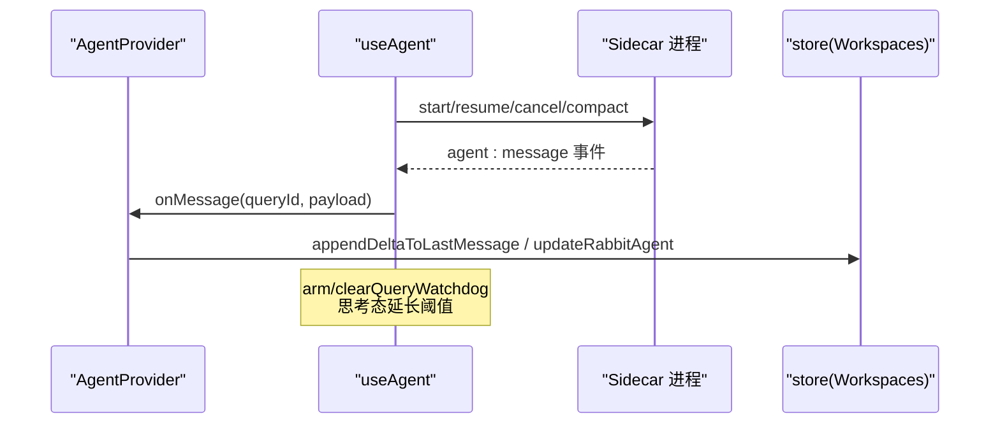
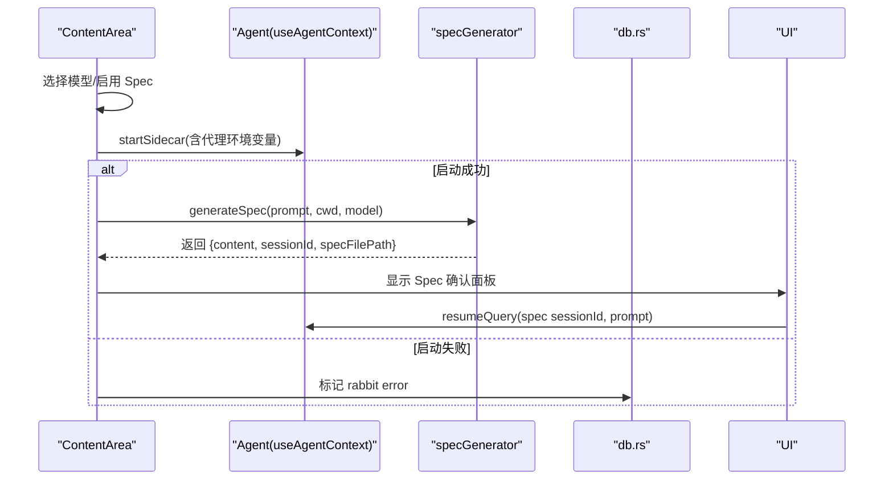
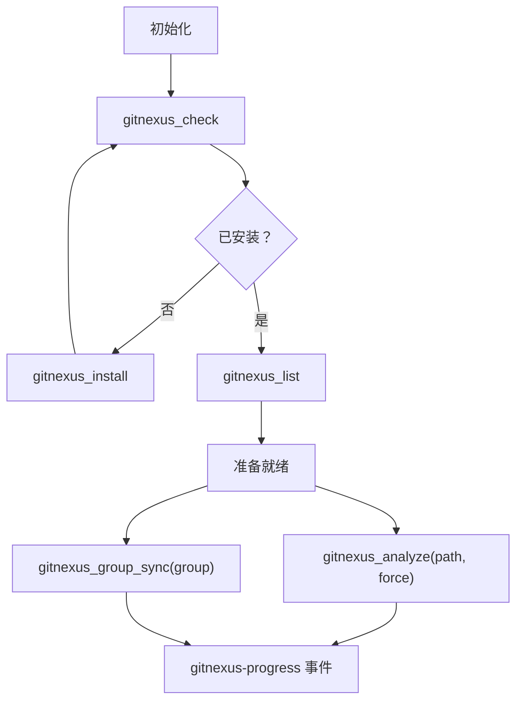
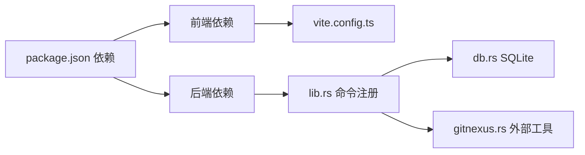

# 性能优化

<cite>
**本文引用的文件**
- [package.json](file://package.json)
- [vite.config.ts](file://vite.config.ts)
- [src/main.tsx](file://src/main.tsx)
- [src/App.tsx](file://src/App.tsx)
- [src/hooks/useWorkspaces.ts](file://src/hooks/useWorkspaces.ts)
- [src/hooks/useAgentContext.tsx](file://src/hooks/useAgentContext.tsx)
- [src/hooks/useAgent.ts](file://src/hooks/useAgent.ts)
- [src/hooks/useCodebaseIndex.tsx](file://src/hooks/useCodebaseIndex.tsx)
- [src/components/ContentArea.tsx](file://src/components/ContentArea.tsx)
- [src/utils/specGenerator.ts](file://src/utils/specGenerator.ts)
- [src-tauri/src/lib.rs](file://src-tauri/src/lib.rs)
- [src-tauri/src/db.rs](file://src-tauri/src/db.rs)
- [src-tauri/src/gitnexus.rs](file://src-tauri/src/gitnexus.rs)
</cite>

## 目录
1. [简介](#简介)
2. [项目结构](#项目结构)
3. [核心组件](#核心组件)
4. [架构总览](#架构总览)
5. [详细组件分析](#详细组件分析)
6. [依赖关系分析](#依赖关系分析)
7. [性能考量](#性能考量)
8. [故障排查指南](#故障排查指南)
9. [结论](#结论)
10. [附录](#附录)

## 简介
本指南面向 RabbitCoding 的性能优化，覆盖前端渲染与状态更新、后端数据库与外部工具、缓存与资源管理、性能监控与基准测试等方面。文档结合代码实现，给出可操作的优化建议、流程图与最佳实践，帮助在保证功能正确性的前提下，显著提升响应速度、降低内存占用、改善用户体验。

## 项目结构
RabbitCoding 采用 React + Tauri 架构：前端负责 UI、状态与交互；后端（Tauri Rust）负责数据库、系统集成、外部工具（如 sidecar、gitnexus）与事件分发。Vite 用于开发与构建，TailwindCSS 提供样式基础。

图表来源
- [src/main.tsx:1-11](file://src/main.tsx#L1-L11)
- [src/App.tsx:1-102](file://src/App.tsx#L1-L102)
- [src-tauri/src/lib.rs:124-317](file://src-tauri/src/lib.rs#L124-L317)
- [src-tauri/src/db.rs:140-417](file://src-tauri/src/db.rs#L140-L417)
- [src-tauri/src/gitnexus.rs:176-761](file://src-tauri/src/gitnexus.rs#L176-L761)

章节来源
- [package.json:1-46](file://package.json#L1-L46)
- [vite.config.ts:1-37](file://vite.config.ts#L1-L37)
- [src/main.tsx:1-11](file://src/main.tsx#L1-L11)
- [src/App.tsx:1-102](file://src/App.tsx#L1-L102)
- [src-tauri/src/lib.rs:124-317](file://src-tauri/src/lib.rs#L124-L317)

## 核心组件
- 应用根与主题适配：App 负责视图切换、主题同步与全局 Provider 组合，确保首屏加载与暗色模式一致性。
- 工作空间与状态：useWorkspaces 负责工作空间、兔子（任务）、仓库的数据加载、持久化与消息流式更新。
- Agent 通信：useAgent 提供 sidecar 生命周期与消息监听；AgentProvider 将消息路由到 store，统一处理流式增量与终态收敛。
- 代码库索引：useCodebaseIndex 管理 gitnexus 安装、索引与同步状态，通过事件驱动更新 UI。
- 内容区域：ContentArea 负责模型选择、API Key 管理、代理配置、Spec 生成与编码流程的协调。
- 规格生成：specGenerator 通过专用 queryId 与事件监听，保障 Spec 生成的稳定性与超时保护。
- 后端命令：lib.rs 注册命令，db.rs 实现 SQLite 事务持久化，gitnexus.rs 管理内置 Node/npm 与索引子进程。

章节来源
- [src/App.tsx:29-99](file://src/App.tsx#L29-L99)
- [src/hooks/useWorkspaces.ts:28-541](file://src/hooks/useWorkspaces.ts#L28-L541)
- [src/hooks/useAgent.ts:53-334](file://src/hooks/useAgent.ts#L53-L334)
- [src/hooks/useAgentContext.tsx:88-285](file://src/hooks/useAgentContext.tsx#L88-L285)
- [src/hooks/useCodebaseIndex.tsx:79-500](file://src/hooks/useCodebaseIndex.tsx#L79-L500)
- [src/components/ContentArea.tsx:30-668](file://src/components/ContentArea.tsx#L30-L668)
- [src/utils/specGenerator.ts:142-300](file://src/utils/specGenerator.ts#L142-L300)
- [src-tauri/src/lib.rs:272-313](file://src-tauri/src/lib.rs#L272-L313)
- [src-tauri/src/db.rs:392-417](file://src-tauri/src/db.rs#L392-L417)
- [src-tauri/src/gitnexus.rs:180-761](file://src-tauri/src/gitnexus.rs#L180-L761)

## 架构总览
前端通过 Tauri 命令与后端交互，后端以事件形式推送进度与状态，前端基于 Context 与 Hooks 组织状态流。数据库采用 SQLite，配合事务与索引提升读写效率；外部工具（sidecar、gitnexus）通过内置 Node 运行，避免系统环境差异带来的性能波动。

图表来源
- [src/components/ContentArea.tsx:97-169](file://src/components/ContentArea.tsx#L97-L169)
- [src/hooks/useAgent.ts:156-243](file://src/hooks/useAgent.ts#L156-L243)
- [src-tauri/src/lib.rs:272-313](file://src-tauri/src/lib.rs#L272-L313)
- [src-tauri/src/db.rs:392-417](file://src-tauri/src/db.rs#L392-L417)
- [src-tauri/src/gitnexus.rs:384-561](file://src-tauri/src/gitnexus.rs#L384-L561)

## 详细组件分析

### 组件 A：工作空间与状态持久化（useWorkspaces）
- 异步加载与降级：优先 SQLite，失败回退 localStorage；首次启动尝试迁移。
- 双层防抖保存：定时器与周期性保存，避免频繁 IO；流式输出期间强制保存。
- 消息增量合并：针对 assistant 文本/思考增量与 result 去重，减少重复渲染。
- 状态收敛：重启或 sidecar 异常退出时，统一收敛“进行中”状态，避免 UI 永远 loading。

图表来源
- [src/hooks/useWorkspaces.ts:48-120](file://src/hooks/useWorkspaces.ts#L48-L120)
- [src-tauri/src/db.rs:392-417](file://src-tauri/src/db.rs#L392-L417)

章节来源
- [src/hooks/useWorkspaces.ts:28-541](file://src/hooks/useWorkspaces.ts#L28-L541)
- [src-tauri/src/db.rs:140-417](file://src-tauri/src/db.rs#L140-L417)

### 组件 B：Agent 通信与消息处理（useAgent / AgentProvider）
- 事件监听与回调引用：使用 ref 存储回调，避免重复注册；严格清理避免泄漏。
- 查询看门狗：独立计时器，思考态延长阈值；终态清除，避免误判超时。
- 侧车生命周期：启动/停止/检查状态；进程退出统一收敛“进行中”状态。
- Provider 职责：将 sidecar 消息映射到 store，处理 text_delta/thinking_delta/result/error/compaction 等类型。

图表来源
- [src/hooks/useAgent.ts:262-321](file://src/hooks/useAgent.ts#L262-L321)
- [src/hooks/useAgentContext.tsx:92-193](file://src/hooks/useAgentContext.tsx#L92-L193)

章节来源
- [src/hooks/useAgent.ts:53-334](file://src/hooks/useAgent.ts#L53-L334)
- [src/hooks/useAgentContext.tsx:88-285](file://src/hooks/useAgentContext.tsx#L88-L285)

### 组件 C：内容区域与交互（ContentArea）
- 代理与 API Key 管理：动态合并代理环境变量；代理变更触发 sidecar 重启；无 Key 弹窗后自动启动。
- Spec 生成：专用 queryId 与事件监听，超时保护；支持 resume 保留探索上下文。
- 编码流程：Follow-up 恢复会话；编码前可先生成 Spec 并确认后执行。

图表来源
- [src/components/ContentArea.tsx:97-169](file://src/components/ContentArea.tsx#L97-L169)
- [src/utils/specGenerator.ts:142-300](file://src/utils/specGenerator.ts#L142-L300)
- [src-tauri/src/db.rs:392-417](file://src-tauri/src/db.rs#L392-L417)

章节来源
- [src/components/ContentArea.tsx:30-668](file://src/components/ContentArea.tsx#L30-L668)
- [src/utils/specGenerator.ts:1-300](file://src/utils/specGenerator.ts#L1-L300)

### 组件 D：代码库索引（useCodebaseIndex / gitnexus.rs）
- 安装与检测：内置 Node/npm，安装到应用私有 prefix；检测 CLI 可用性。
- 索引与同步：analyze 实时 emit 进度；group_sync 跨仓库提取契约；支持 force 与 skip-git。
- 状态管理：事件驱动更新 indexStates/syncStates，避免轮询。

图表来源
- [src/hooks/useCodebaseIndex.tsx:146-275](file://src/hooks/useCodebaseIndex.tsx#L146-L275)
- [src-tauri/src/gitnexus.rs:180-761](file://src-tauri/src/gitnexus.rs#L180-L761)

章节来源
- [src/hooks/useCodebaseIndex.tsx:79-500](file://src/hooks/useCodebaseIndex.tsx#L79-L500)
- [src-tauri/src/gitnexus.rs:176-761](file://src-tauri/src/gitnexus.rs#L176-L761)

## 依赖关系分析
- 前端依赖：React、Ant Design X、Monaco Editor、TailwindCSS、@tauri-apps/* 插件。
- 构建工具：Vite + React 插件 + TailwindCSS 插件；开发服务器固定端口与 HMR。
- 后端依赖：Tauri、rusqlite、tokio、reqwest、image、tauri 插件集合。
- 事件与命令：前端通过 invoke 调用后端命令；后端通过 emit 推送事件。

图表来源
- [package.json:14-44](file://package.json#L14-L44)
- [vite.config.ts:1-37](file://vite.config.ts#L1-L37)
- [src-tauri/src/lib.rs:272-313](file://src-tauri/src/lib.rs#L272-L313)

章节来源
- [package.json:1-46](file://package.json#L1-L46)
- [vite.config.ts:1-37](file://vite.config.ts#L1-L37)
- [src-tauri/src/lib.rs:124-317](file://src-tauri/src/lib.rs#L124-L317)

## 性能考量

### 前端性能优化策略
- 渲染优化
  - 使用 useMemo/memo 避免不必要的重渲染（例如 App 中对 store 的包装）。
  - 将重型计算移出渲染函数，或使用 requestIdleCallback/微任务拆分。
- 状态更新优化
  - useWorkspaces 的消息增量合并与去重，减少数组重建与渲染次数。
  - 使用局部 Provider（AgentProvider、CodebaseIndexProvider）缩小订阅范围。
- 数据加载优化
  - 首屏加载：App 在 store.isLoading 期间显示骨架屏，避免空白。
  - 异步加载与降级：DB 不可用时回退 localStorage，保证可用性。
- 组件渲染优化
  - ContentArea 中根据选中 Rabbit/Workspace 决定渲染路径，避免无用节点。
  - 右侧面板可折叠与拖拽调整宽度，减少主区域重绘。

章节来源
- [src/App.tsx:48-60](file://src/App.tsx#L48-L60)
- [src/hooks/useWorkspaces.ts:324-449](file://src/hooks/useWorkspaces.ts#L324-L449)
- [src/components/ContentArea.tsx:416-668](file://src/components/ContentArea.tsx#L416-L668)

### 后端性能优化方案
- 数据库优化
  - 事务批量写入：save_all_inner 使用 BEGIN/COMMIT，减少 WAL 切换开销。
  - 索引与 PRAGMA：启用 WAL、foreign_keys、synchronous=normal，加速读写。
  - 分表与序列：messages 表按 rabbit_id+seq 排序，便于有序读取。
- 外部工具优化
  - 内置 Node/npm：避免系统 PATH 差异，安装与运行稳定，减少失败重试。
  - 进度事件：gitnexus analyze/group_sync 通过线程与管道实时推送，避免轮询。
- 进程与并发
  - tokio::task::spawn_blocking：将阻塞 I/O 与子进程隔离，避免阻塞主线程。
  - 事件驱动：通过 listen/emit 减少轮询与锁竞争。

章节来源
- [src-tauri/src/db.rs:140-417](file://src-tauri/src/db.rs#L140-L417)
- [src-tauri/src/gitnexus.rs:180-761](file://src-tauri/src/gitnexus.rs#L180-L761)

### 内存管理技巧
- 前端
  - 严格清理事件监听：useAgent 在 effect cleanup 中移除监听与看门狗，防止泄漏。
  - 闭包引用：useAgentContext 使用 ref 存储 queryId 集合与取消标记，避免闭包过期。
  - 本地存储降级：DB 不可用时写 localStorage，避免内存暴涨。
- 后端
  - Mutex 保护连接：Database 使用 Mutex<Connection>，避免并发访问冲突。
  - 任务隔离：spawn_blocking 将 I/O 与子进程放入后台线程，释放主线程。

章节来源
- [src/hooks/useAgent.ts:262-321](file://src/hooks/useAgent.ts#L262-L321)
- [src/hooks/useAgentContext.tsx:88-285](file://src/hooks/useAgentContext.tsx#L88-L285)
- [src-tauri/src/db.rs:80-83](file://src-tauri/src/db.rs#L80-L83)

### 数据库查询优化
- 读取路径：load_all_inner 分三步（workspaces → rabbits → messages），按 created_at 排序，保证顺序与性能。
- 写入路径：save_all_inner 先清空四表，再批量插入，使用事务保证一致性。
- 索引：idx_rabbits_workspace、idx_repos_workspace、idx_messages_rabbit，加速关联查询。

章节来源
- [src-tauri/src/db.rs:167-288](file://src-tauri/src/db.rs#L167-L288)
- [src-tauri/src/db.rs:290-386](file://src-tauri/src/db.rs#L290-L386)

### 缓存策略
- 会话压缩：ContentArea 提供手动压缩入口，降低上下文长度，减少 token 使用与延迟。
- 代理指纹：ContentArea 记录代理指纹，变更时重启 sidecar，避免缓存污染。
- 事件缓存：useCodebaseIndex 使用 indexStates/syncStates 记录中间状态，避免重复请求。

章节来源
- [src/components/ContentArea.tsx:390-403](file://src/components/ContentArea.tsx#L390-L403)
- [src/components/ContentArea.tsx:127-154](file://src/components/ContentArea.tsx#L127-L154)
- [src/hooks/useCodebaseIndex.tsx:86-141](file://src/hooks/useCodebaseIndex.tsx#L86-L141)

### 资源管理
- 构建与运行
  - Vite 固定端口与 HMR 配置，减少热更新抖动。
  - TailwindCSS 按需引入，避免打包体积膨胀。
- 外部工具
  - 内置 Node 与 npm：dev/prod 一致，避免系统差异导致的性能波动。
  - gitnexus 仅在需要时运行，完成后释放资源。

章节来源
- [vite.config.ts:15-37](file://vite.config.ts#L15-L37)
- [src-tauri/src/gitnexus.rs:135-144](file://src-tauri/src/gitnexus.rs#L135-L144)

### 性能监控工具与指标
- 监控点
  - 侧车看门狗：useAgent 的查询超时与思考态阈值，避免 UI 卡死。
  - 事件日志：gitnexus-progress、gitnexus-install-progress，记录耗时与错误。
  - 数据库事务：save_all_inner 的 BEGIN/COMMIT，确保一致性与可观测性。
- 指标建议
  - 前端：首屏渲染耗时、消息增量渲染次数、取消查询成功率。
  - 后端：db 读写耗时、gitnexus analyze/group_sync 耗时、sidecar 启动耗时。
- 基准测试
  - 使用 Vite 预览模式与生产构建对比，测量冷启动与热更新差异。
  - 对比启用/禁用 Spec 生成的端到端耗时，评估中间态收益。

章节来源
- [src/hooks/useAgent.ts:66-101](file://src/hooks/useAgent.ts#L66-L101)
- [src-tauri/src/gitnexus.rs:416-561](file://src-tauri/src/gitnexus.rs#L416-L561)
- [src-tauri/src/db.rs:290-305](file://src-tauri/src/db.rs#L290-L305)

### 优化示例与最佳实践
- 示例：双层防抖保存
  - 在 useWorkspaces 中，500ms 防抖 + 3s 周期保存，兼顾实时性与性能。
- 示例：Spec 生成超时保护
  - specGenerator 使用 listen 注册 + 超时机制，避免永久等待。
- 示例：侧车看门狗
  - useAgent 为每条 query 维护独立计时器，思考态延长阈值，避免误判。
- 最佳实践
  - 事件驱动优于轮询；将阻塞 I/O 放入后台线程；合理使用事务与索引；避免在渲染函数中进行昂贵计算。

章节来源
- [src/hooks/useWorkspaces.ts:100-120](file://src/hooks/useWorkspaces.ts#L100-L120)
- [src/utils/specGenerator.ts:195-299](file://src/utils/specGenerator.ts#L195-L299)
- [src/hooks/useAgent.ts:75-101](file://src/hooks/useAgent.ts#L75-L101)

## 故障排查指南
- 侧车无法启动
  - 检查 API Key 与代理环境变量；ContentArea 在启动失败时标记 rabbit error。
  - 使用 checkStatus 获取 sidecar 状态，必要时 stopSidecar 后重启。
- 查询无响应
  - useAgent 的看门狗会在阈值后触发 onQueryTimeout；检查网络与代理。
  - 若处于思考态，等待更长时间（思考态阈值更长）。
- 数据库异常
  - db_load_all/db_save_all 抛错时，useWorkspaces 会回退到 localStorage。
  - 检查 PRAGMA 与索引是否存在，必要时重建。
- 索引失败
  - gitnexus_analyze 输出最后一条 stderr/stdout 作为诊断依据；必要时使用 force 或 skip-git。

章节来源
- [src/components/ContentArea.tsx:146-169](file://src/components/ContentArea.tsx#L146-L169)
- [src/hooks/useAgent.ts:262-321](file://src/hooks/useAgent.ts#L262-L321)
- [src-tauri/src/db.rs:392-417](file://src-tauri/src/db.rs#L392-L417)
- [src-tauri/src/gitnexus.rs:516-561](file://src-tauri/src/gitnexus.rs#L516-L561)

## 结论
RabbitCoding 的性能优化围绕“事件驱动 + 事务持久化 + 内置工具链 + 看门狗与超时保护”展开。通过合理的状态管理、消息增量合并、数据库索引与事务、以及外部工具的内置运行，可在保证功能正确性的同时显著提升响应速度与稳定性。建议持续关注首屏渲染、消息流式渲染与数据库写入的热点路径，结合监控指标进行迭代优化。

## 附录
- 开发与构建
  - dev/build/preview/tauri 脚本；Vite 固定端口与 HMR。
- 依赖清单
  - 前端：React、Ant Design X、Monaco Editor、TailwindCSS、@tauri-apps/*。
  - 后端：Tauri、rusqlite、tokio、reqwest、image、tauri 插件。

章节来源
- [package.json:7-12](file://package.json#L7-L12)
- [vite.config.ts:15-37](file://vite.config.ts#L15-L37)
- [package.json:14-44](file://package.json#L14-L44)