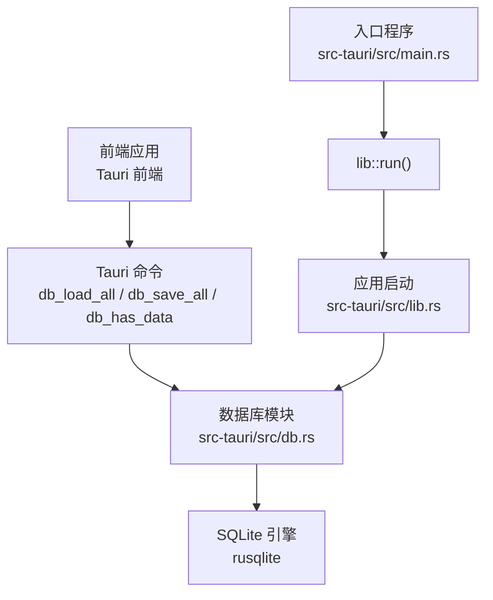
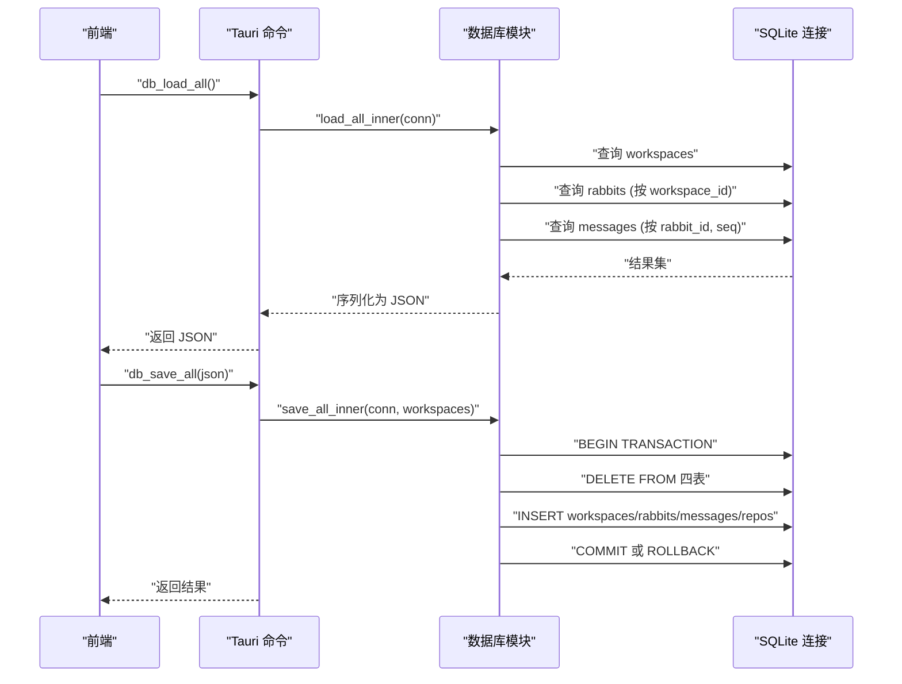
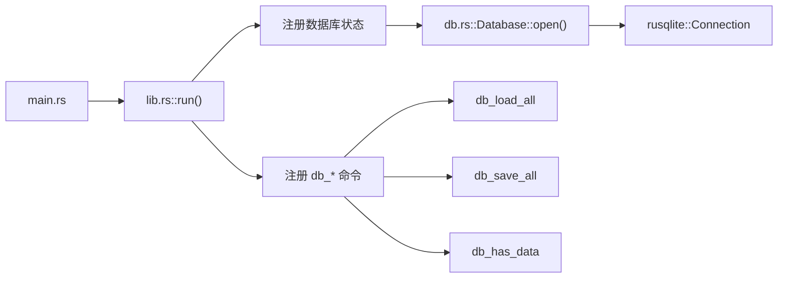

# 数据库优化

<cite>
**本文引用的文件**
- [src-tauri/src/db.rs](file://src-tauri/src/db.rs)
- [src-tauri/src/lib.rs](file://src-tauri/src/lib.rs)
- [src-tauri/Cargo.toml](file://src-tauri/Cargo.toml)
- [src-tauri/src/main.rs](file://src-tauri/src/main.rs)
</cite>

## 目录
1. [简介](#简介)
2. [项目结构](#项目结构)
3. [核心组件](#核心组件)
4. [架构总览](#架构总览)
5. [详细组件分析](#详细组件分析)
6. [依赖分析](#依赖分析)
7. [性能考量](#性能考量)
8. [故障排查指南](#故障排查指南)
9. [结论](#结论)
10. [附录](#附录)

## 简介
本指南面向 RabbitCoding 的数据库优化需求，聚焦于 SQLite 在本地嵌入式场景下的优化策略与实践。文档基于现有代码实现，系统梳理了数据模型设计、索引策略、事务与并发控制、连接管理、查询与序列化性能、以及可扩展的监控与分析建议。文中所有优化建议均与当前实现保持一致，避免引入与现有架构冲突的改动。

## 项目结构
RabbitCoding 的数据库层位于 Tauri 后端（Rust），采用 rusqlite 作为 SQLite 绑定，通过 Tauri 命令暴露给前端。数据库初始化、建表与迁移、读写接口均由后端模块集中管理。

图表来源
- [src-tauri/src/db.rs:140-161](file://src-tauri/src/db.rs#L140-L161)
- [src-tauri/src/lib.rs:206-222](file://src-tauri/src/lib.rs#L206-L222)
- [src-tauri/src/main.rs:4-6](file://src-tauri/src/main.rs#L4-L6)

章节来源
- [src-tauri/src/lib.rs:206-222](file://src-tauri/src/lib.rs#L206-L222)
- [src-tauri/src/db.rs:140-161](file://src-tauri/src/db.rs#L140-L161)
- [src-tauri/src/main.rs:4-6](file://src-tauri/src/main.rs#L4-L6)

## 核心组件
- 数据库结构体与连接管理
  - 通过全局状态持有互斥锁保护的 SQLite 连接，确保多线程安全访问。
  - 初始化时执行 PRAGMA 设置与建表脚本，包含外键约束与索引。
- 读写接口
  - 加载：一次性查询所有工作区、兔子、仓库与消息，组装为统一 JSON。
  - 保存：事务内全量删除并重插，保证一致性。
  - 检查：快速判断数据库是否已有数据，用于迁移逻辑。
- 数据模型
  - workspaces、rabbits、repos、messages 表，具备必要的外键关系与索引。

章节来源
- [src-tauri/src/db.rs:80-83](file://src-tauri/src/db.rs#L80-L83)
- [src-tauri/src/db.rs:85-138](file://src-tauri/src/db.rs#L85-L138)
- [src-tauri/src/db.rs:167-288](file://src-tauri/src/db.rs#L167-L288)
- [src-tauri/src/db.rs:290-386](file://src-tauri/src/db.rs#L290-L386)
- [src-tauri/src/db.rs:392-416](file://src-tauri/src/db.rs#L392-L416)

## 架构总览
数据库优化的关键在于“模型-索引-事务-序列化”四个维度协同。当前实现已具备 WAL 日志模式、外键与同步级别调整、基础索引与事务封装。后续优化可在不破坏现有 API 的前提下，逐步引入更细粒度的事务、批量写入、延迟序列化与缓存策略。

图表来源
- [src-tauri/src/db.rs:167-288](file://src-tauri/src/db.rs#L167-L288)
- [src-tauri/src/db.rs:290-386](file://src-tauri/src/db.rs#L290-L386)
- [src-tauri/src/db.rs:392-416](file://src-tauri/src/db.rs#L392-L416)

## 详细组件分析

### 数据模型与索引设计
- 表结构要点
  - workspaces：主键 id，created_at 用于排序。
  - rabbits：主键 id，外键 workspace_id，索引 idx_rabbits_workspace；新增列 token_usage、num_turns。
  - repos：主键 id，外键 workspace_id，索引 idx_repos_workspace。
  - messages：自增主键 id，复合索引 idx_messages_rabbit(rabbit_id, seq)，按序存储消息。
- 索引策略
  - 以“外键过滤 + 有序访问”为核心：按 workspace_id 查询兔子与仓库，按 rabbit_id+seq 查询消息。
  - 复合索引 messages(rabbit_id, seq) 适配“先分组再排序”的读取模式。
- 优化建议（与现有实现兼容）
  - 若存在频繁按 created_at 范围查询，可考虑在 rabbits/repo 上增加 created_at 单列索引以减少排序成本。
  - 若前端常做“最近会话”查询，可评估在 rabbits 上增加 created_at 辅助索引。

章节来源
- [src-tauri/src/db.rs:85-138](file://src-tauri/src/db.rs#L85-L138)
- [src-tauri/src/db.rs:135-137](file://src-tauri/src/db.rs#L135-L137)

### 事务与并发控制
- 事务边界
  - 保存流程以单事务包裹，失败回滚，保证一致性。
  - 加载流程未显式开启事务，但通过一次查询完成组装，整体原子性由调用方控制。
- 并发模型
  - 全局 Mutex 包裹 Connection，避免并发读写竞争。
  - 适合桌面端单实例场景；若未来引入多实例或多线程写入，需评估更细粒度的并发控制。
- 优化建议
  - 读多写少场景：可考虑拆分读写锁或引入只读连接副本。
  - 写入批量化：合并多次写入为单事务，减少锁竞争与 WAL 切换。

章节来源
- [src-tauri/src/db.rs:290-305](file://src-tauri/src/db.rs#L290-L305)
- [src-tauri/src/db.rs:392-416](file://src-tauri/src/db.rs#L392-L416)
- [src-tauri/src/db.rs:80-83](file://src-tauri/src/db.rs#L80-L83)

### 查询性能与序列化优化
- 查询路径
  - 加载：按 created_at 逆序获取工作区，再按 workspace_id 获取兔子，再按 rabbit_id 获取消息，最后按 created_at 正序获取仓库。
  - 优点：顺序稳定，便于前端渲染；缺点：对 messages 的查询为“每兔子一次”，存在 N+1 查询风险。
- 序列化与反序列化
  - 使用 serde_json 对兔子的 token_usage 与消息内容进行序列化/反序列化。
  - 消息 content 以字符串存储，读取时转换为 JSON 值，避免大对象拆分。
- 优化建议
  - 减少 N+1：在加载阶段预取所有消息并按 rabbit_id 分组，避免循环查询。
  - 延迟序列化：仅在需要时解析消息 JSON，减少不必要的 CPU 开销。
  - 批量写入：保存阶段保持全量替换，避免频繁小事务；如需增量更新，可引入“部分更新 + 事务”组合。

章节来源
- [src-tauri/src/db.rs:167-288](file://src-tauri/src/db.rs#L167-L288)
- [src-tauri/src/db.rs:328-373](file://src-tauri/src/db.rs#L328-L373)

### 连接与初始化
- 初始化流程
  - 应用启动时创建 app_data_dir/rabbit.db，初始化 PRAGMA、建表与索引。
  - 通过 tauri::Builder.setup 注册数据库全局状态，失败时降级至前端本地存储。
- PRAGMA 与参数
  - WAL 模式提升并发读写能力。
  - 外键约束开启，保证参照完整性。
  - 同步级别设为 NORMAL，平衡性能与可靠性。
- 优化建议
  - 可根据设备类型调整 synchronous（如高性能 SSD 可适度降低）。
  - 在高写入场景可考虑启用 WAL 自动检查点阈值调整。

章节来源
- [src-tauri/src/lib.rs:206-222](file://src-tauri/src/lib.rs#L206-L222)
- [src-tauri/src/db.rs:85-88](file://src-tauri/src/db.rs#L85-L88)
- [src-tauri/src/db.rs:142-161](file://src-tauri/src/db.rs#L142-L161)

### 数据压缩与存储形态
- 当前做法
  - 消息 content 以 JSON 字符串存储，读取时解析为 JSON 值；token_usage 以 JSON 字符串存储。
- 压缩建议
  - 对大体量消息内容可考虑启用 SQLite 压缩扩展（如 sqlite-zstd），或在应用层进行压缩后再入库。
  - 注意：压缩会增加 CPU 开销，需结合读写比例与硬件条件权衡。

章节来源
- [src-tauri/src/db.rs:204-206](file://src-tauri/src/db.rs#L204-L206)
- [src-tauri/src/db.rs:356-352](file://src-tauri/src/db.rs#L356-L352)

### 缓存策略
- 适用场景
  - 前端渲染层可缓存已加载的工作区/兔子列表，避免重复触发 db_load_all。
  - 对高频读取的消息片段可做内存缓存（按 rabbit_id 分桶）。
- 实施建议
  - 采用 LRU 缓存，结合失效策略（如按时间或容量）。
  - 与后端事务配合：写入成功后再刷新缓存，保证一致性。

章节来源
- [src-tauri/src/db.rs:392-416](file://src-tauri/src/db.rs#L392-L416)

### 批量操作优化
- 现状
  - 保存采用“清空+全量插入”，事务包裹，简单可靠。
- 优化方向
  - 增量更新：比较前后差异，仅更新变化项，减少 IO 与锁竞争。
  - 批量插入：使用 rusqlite 的“预编译语句 + 批量参数”减少 SQL 解析成本。
  - 合理拆分：将大事务拆分为多个小事务，降低锁持有时间。

章节来源
- [src-tauri/src/db.rs:290-386](file://src-tauri/src/db.rs#L290-L386)

### 查询分析与慢查询识别
- 建议方案
  - 使用 SQLite EXPLAIN QUERY PLAN 分析关键查询的执行计划，确认索引命中情况。
  - 在 db_load_all 的各查询处埋点统计耗时，定位瓶颈（如 messages 查询）。
  - 结合系统指标（CPU/IO/内存）观察高负载时段的关联性。
- 工具与集成
  - 可在开发构建中启用 SQLite 的统计信息收集与分析接口，生产环境谨慎开启以避免性能损耗。

章节来源
- [src-tauri/src/db.rs:167-288](file://src-tauri/src/db.rs#L167-L288)

## 依赖分析
- rusqlite 版本与特性
  - 使用 0.32 版本，启用 bundled 功能，简化部署。
  - tokio 用于异步任务（如外部工具调用），与数据库模块解耦。
- 依赖关系图

图表来源
- [src-tauri/src/main.rs:4-6](file://src-tauri/src/main.rs#L4-L6)
- [src-tauri/src/lib.rs:206-222](file://src-tauri/src/lib.rs#L206-L222)
- [src-tauri/src/db.rs:142-161](file://src-tauri/src/db.rs#L142-L161)

章节来源
- [src-tauri/Cargo.toml:30](file://src-tauri/Cargo.toml#L30)
- [src-tauri/src/lib.rs:344-387](file://src-tauri/src/lib.rs#L344-L387)

## 性能考量
- 读取路径优化
  - 将 messages 的 N+1 查询改为一次性聚合查询，按 rabbit_id 分组后按 seq 排序输出。
  - 对高频字段（如 created_at）建立辅助索引，减少排序与临时表生成。
- 写入路径优化
  - 保持事务边界清晰，避免长事务；必要时拆分为多个短事务。
  - 使用批量插入与预编译语句，减少 SQL 解析与编译开销。
- 并发与锁
  - 当前使用全局 Mutex 保护连接，适合单实例场景；多实例或高并发需引入连接池与更细粒度锁。
- 存储与压缩
  - 对大体量 JSON 内容考虑压缩存储，注意 CPU 与 IO 的权衡。
- 监控与分析
  - 在关键路径埋点耗时统计，结合 EXPLAIN QUERY PLAN 与系统指标进行综合分析。

## 故障排查指南
- 常见问题与定位
  - 无法打开数据库：检查 app_data_dir 权限与路径是否存在。
  - 保存失败：查看事务回滚日志，确认具体插入失败的表与字段。
  - 查询缓慢：对 messages 查询进行 EXPLAIN，确认是否命中复合索引。
- 降级策略
  - 后端初始化失败时，前端可降级使用本地存储，保证基本可用。
- 建议的日志与诊断
  - 在 db_load_all/db_save_all 中记录关键步骤耗时，便于定位瓶颈。
  - 对异常错误进行结构化记录，包含 SQL 语句与参数摘要。

章节来源
- [src-tauri/src/lib.rs:213-221](file://src-tauri/src/lib.rs#L213-L221)
- [src-tauri/src/db.rs:290-305](file://src-tauri/src/db.rs#L290-L305)
- [src-tauri/src/db.rs:167-288](file://src-tauri/src/db.rs#L167-L288)

## 结论
RabbitCoding 的数据库层以简洁可靠的模式实现了本地嵌入式 SQLite 的读写与迁移。当前优化重点应放在“减少 N+1 查询、增强批量写入、引入延迟序列化与缓存、细化事务边界”等方面。这些改进既符合现有架构，又能显著提升读写性能与用户体验。随着业务增长，可进一步引入连接池、压缩与更精细的监控分析体系。

## 附录
- 示例与最佳实践
  - 读取优化示例：在加载阶段一次性聚合 messages，按 rabbit_id 分组后按 seq 输出，避免循环查询。
  - 写入优化示例：使用预编译语句与批量参数，减少 SQL 解析成本；将大事务拆分为多个短事务。
  - 缓存示例：前端缓存工作区/兔子列表，后端写入成功后再刷新缓存。
- 参考实现位置
  - [加载流程:167-288](file://src-tauri/src/db.rs#L167-L288)
  - [保存流程:290-386](file://src-tauri/src/db.rs#L290-L386)
  - [初始化与 PRAGMA:85-138](file://src-tauri/src/db.rs#L85-L138)
  - [命令注册与启动:206-222](file://src-tauri/src/lib.rs#L206-L222)