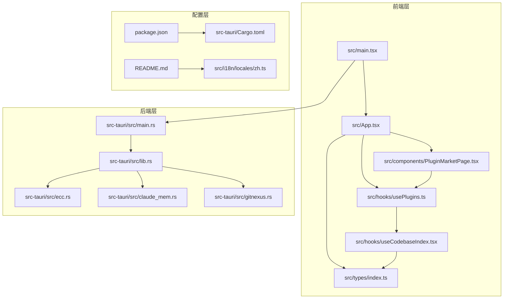
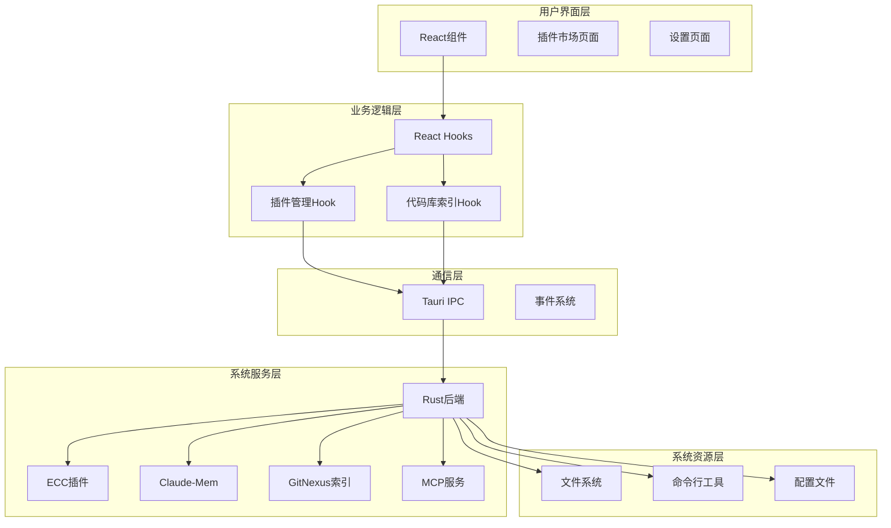
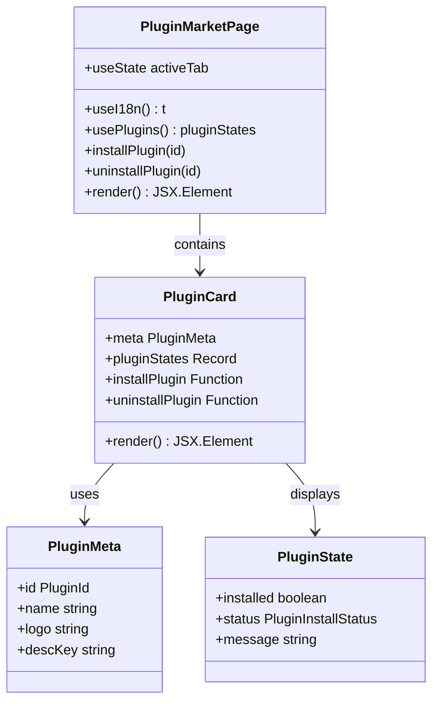
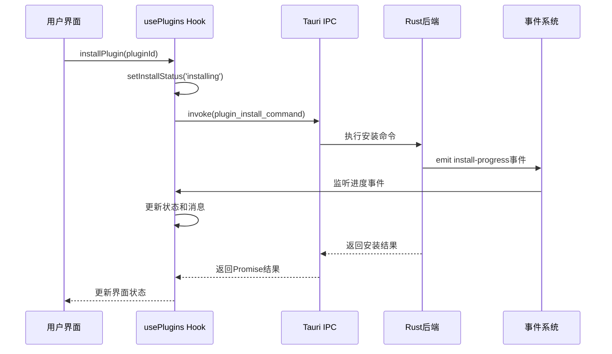
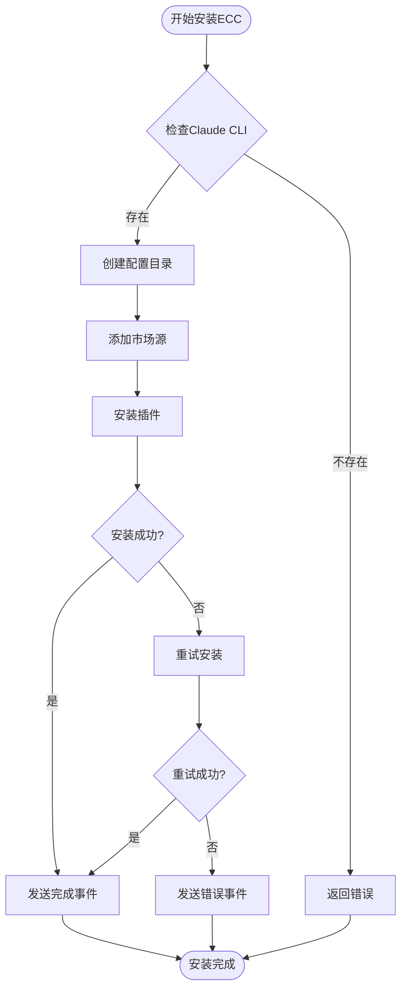

# Claude插件管理

<cite>
**本文档引用的文件**
- [README.md](file://README.md)
- [package.json](file://package.json)
- [src/main.tsx](file://src/main.tsx)
- [src/App.tsx](file://src/App.tsx)
- [src/components/PluginMarketPage.tsx](file://src/components/PluginMarketPage.tsx)
- [src/hooks/usePlugins.ts](file://src/hooks/usePlugins.ts)
- [src/hooks/useCodebaseIndex.tsx](file://src/hooks/useCodebaseIndex.tsx)
- [src/types/index.ts](file://src/types/index.ts)
- [src-tauri/src/lib.rs](file://src-tauri/src/lib.rs)
- [src-tauri/src/main.rs](file://src-tauri/src/main.rs)
- [src-tauri/src/ecc.rs](file://src-tauri/src/ecc.rs)
- [src-tauri/src/claude_mem.rs](file://src-tauri/src/claude_mem.rs)
- [src-tauri/src/gitnexus.rs](file://src-tauri/src/gitnexus.rs)
- [src-tauri/Cargo.toml](file://src-tauri/Cargo.toml)
- [src/i18n/locales/zh.ts](file://src/i18n/locales/zh.ts)
</cite>

## 目录
1. [简介](#简介)
2. [项目结构](#项目结构)
3. [核心组件](#核心组件)
4. [架构概览](#架构概览)
5. [详细组件分析](#详细组件分析)
6. [依赖关系分析](#依赖关系分析)
7. [性能考虑](#性能考虑)
8. [故障排除指南](#故障排除指南)
9. [结论](#结论)

## 简介

Claude插件管理系统是一个基于Tauri + React + TypeScript构建的现代化桌面应用程序，专门为Claude AI助手提供插件管理和扩展功能。该系统支持四个主要插件：GitNexus代码库索引、Context7 MCP服务、ECC Everything Claude Code插件和Claude-Mem持久记忆系统。

该项目采用前后端分离架构，前端使用React构建用户界面，后端使用Rust提供高性能的系统级功能。插件管理功能允许用户轻松安装、卸载和管理各种Claude AI相关的插件，从而扩展AI助手的能力。

## 项目结构

项目采用模块化的组织方式，主要分为以下几个部分：



**图表来源**
- [src/main.tsx:1-14](file://src/main.tsx#L1-L14)
- [src/App.tsx:1-151](file://src/App.tsx#L1-L151)
- [src-tauri/src/main.rs:1-7](file://src-tauri/src/main.rs#L1-L7)
- [src-tauri/src/lib.rs:1-800](file://src-tauri/src/lib.rs#L1-L800)

**章节来源**
- [package.json:1-48](file://package.json#L1-L48)
- [README.md:1-8](file://README.md#L1-L8)

## 核心组件

### 插件市场页面

插件市场页面是用户与插件系统交互的主要界面，提供完整的插件管理功能：

- **插件展示**：以卡片形式展示所有可用插件，包括GitNexus、Context7、ECC和Claude-Mem
- **状态管理**：实时显示插件安装状态（未安装、安装中、已安装、错误）
- **操作控制**：提供安装、重新安装、卸载等操作按钮
- **进度显示**：显示安装过程中的实时进度和日志

### 插件管理Hook

`usePlugins` Hook是插件系统的核心逻辑控制器：

- **状态跟踪**：管理所有插件的安装状态和进度
- **事件监听**：监听后端发出的安装进度事件
- **命令执行**：调用后端Rust命令执行插件安装和卸载
- **配置管理**：处理MCP服务器配置和Context7插件配置

### 代码库索引系统

`useCodebaseIndex` Hook提供GitNexus代码库索引功能：

- **索引状态管理**：跟踪工作区中docs和repo的索引状态
- **进度监听**：接收GitNexus分析过程的实时进度
- **同步功能**：支持工作区级别的代码库同步
- **安装管理**：提供GitNexus CLI的一键安装功能

**章节来源**
- [src/components/PluginMarketPage.tsx:1-277](file://src/components/PluginMarketPage.tsx#L1-L277)
- [src/hooks/usePlugins.ts:1-293](file://src/hooks/usePlugins.ts#L1-L293)
- [src/hooks/useCodebaseIndex.tsx:1-519](file://src/hooks/useCodebaseIndex.tsx#L1-L519)

## 架构概览

系统采用分层架构设计，确保前后端分离和功能模块化：



**图表来源**
- [src/App.tsx:94-148](file://src/App.tsx#L94-L148)
- [src/hooks/usePlugins.ts:64-292](file://src/hooks/usePlugins.ts#L64-L292)
- [src-tauri/src/lib.rs:655-800](file://src-tauri/src/lib.rs#L655-L800)

## 详细组件分析

### 插件市场页面组件

插件市场页面实现了完整的插件生命周期管理：



**图表来源**
- [src/components/PluginMarketPage.tsx:70-183](file://src/components/PluginMarketPage.tsx#L70-L183)
- [src/components/PluginMarketPage.tsx:32-64](file://src/components/PluginMarketPage.tsx#L32-L64)

插件市场页面的核心功能包括：

1. **插件状态管理**：通过`pluginStates`对象跟踪所有插件的安装状态
2. **Tab切换**：支持"市场"和"已安装"两个视图模式
3. **实时进度显示**：显示安装过程中的详细进度信息
4. **错误处理**：提供重试和错误诊断功能

### 插件管理Hook实现

`usePlugins` Hook提供了统一的插件管理接口：



**图表来源**
- [src/hooks/usePlugins.ts:188-243](file://src/hooks/usePlugins.ts#L188-L243)
- [src/hooks/usePlugins.ts:115-158](file://src/hooks/usePlugins.ts#L115-L158)

插件管理的核心流程：

1. **状态初始化**：为每个插件初始化安装状态和消息
2. **事件监听**：监听后端发出的安装进度事件
3. **命令执行**：根据插件类型调用相应的Rust命令
4. **状态更新**：实时更新插件状态和用户界面

### Rust后端插件实现

每个插件都有对应的Rust实现模块，提供系统级的功能支持：

#### ECC插件实现

ECC插件通过Claude CLI插件机制实现：



**图表来源**
- [src-tauri/src/ecc.rs:164-325](file://src-tauri/src/ecc.rs#L164-L325)

#### Claude-Mem插件实现

Claude-Mem插件提供持久记忆功能：

- **配置管理**：使用应用专用的配置目录确保插件与sidecar协同工作
- **版本检测**：通过解析插件配置文件检测已安装版本
- **安装流程**：支持两种安装方式的降级处理

#### GitNexus插件实现

GitNexus插件提供代码库索引功能：

- **内置运行时**：使用应用内嵌的Node.js运行时，避免系统依赖
- **私有安装**：将插件安装到应用私有目录，确保安全隔离
- **进度监控**：实时监控安装和索引过程的进度

**章节来源**
- [src/hooks/usePlugins.ts:64-292](file://src/hooks/usePlugins.ts#L64-L292)
- [src-tauri/src/ecc.rs:1-354](file://src-tauri/src/ecc.rs#L1-L354)
- [src-tauri/src/claude_mem.rs:1-472](file://src-tauri/src/claude_mem.rs#L1-L472)
- [src-tauri/src/gitnexus.rs:1-761](file://src-tauri/src/gitnexus.rs#L1-L761)

## 依赖关系分析

项目采用模块化依赖管理，确保功能清晰分离：

```mermaid
graph TB
subgraph "前端依赖"
React[React 19.1.0]
TauriAPI[@tauri-apps/api 2]
Antd[Ant Design 6.4.4]
Monaco[Monaco Editor 0.55.1]
Lucide[Lucide React 1.18.0]
end
subgraph "后端依赖"
Tauri[Tauri 2]
Serde[Serde JSON]
Tokio[Tokio Runtime]
Sqlite[Rusqlite]
Reqwest[HTTP Client]
end
subgraph "插件依赖"
NPM[npm/yarn]
Node[node-runtime]
ClaudeCLI[Claude Code CLI]
GitNexus[GitNexus CLI]
end
React --> TauriAPI
TauriAPI --> Tauri
Tauri --> Serde
Tauri --> Tokio
Tauri --> Sqlite
Serde --> Reqwest
```

**图表来源**
- [package.json:14-38](file://package.json#L14-L38)
- [src-tauri/Cargo.toml:20-40](file://src-tauri/Cargo.toml#L20-L40)

**章节来源**
- [package.json:1-48](file://package.json#L1-L48)
- [src-tauri/Cargo.toml:1-40](file://src-tauri/Cargo.toml#L1-L40)

## 性能考虑

系统在设计时充分考虑了性能优化：

### 前端性能优化

- **状态管理优化**：使用React.memo和useMemo避免不必要的重渲染
- **事件监听管理**：及时清理事件监听器，防止内存泄漏
- **异步操作优化**：使用Promise和async/await处理异步操作
- **UI响应性**：实时进度显示确保用户获得良好的交互体验

### 后端性能优化

- **Tokio运行时**：使用异步运行时处理并发操作
- **进程管理**：合理管理外部进程，避免资源浪费
- **事件驱动**：使用事件系统减少轮询开销
- **内存管理**：及时释放不再使用的资源

### 网络性能优化

- **HTTP客户端**：使用高效的HTTP客户端库
- **连接池**：复用网络连接，减少建立连接的开销
- **超时控制**：合理设置超时时间，避免长时间阻塞

## 故障排除指南

### 常见问题及解决方案

#### 插件安装失败

**问题症状**：插件安装过程中出现错误，状态停留在"安装中"

**可能原因**：
1. Claude CLI未正确安装
2. 网络连接问题
3. 权限不足
4. 磁盘空间不足

**解决方案**：
1. 验证Claude CLI安装状态
2. 检查网络连接和代理设置
3. 确认应用具有必要的文件系统权限
4. 清理磁盘空间

#### 插件状态不同步

**问题症状**：前端显示的插件状态与实际状态不符

**解决方案**：
1. 刷新插件状态
2. 重启应用
3. 检查事件监听器是否正常工作

#### GitNexus索引问题

**问题症状**：代码库索引失败或进度停滞

**解决方案**：
1. 检查GitNexus CLI安装状态
2. 验证工作区路径的有效性
3. 确认代码库具有Git仓库结构
4. 清理索引缓存并重新索引

**章节来源**
- [src/hooks/usePlugins.ts:115-158](file://src/hooks/usePlugins.ts#L115-L158)
- [src-tauri/src/gitnexus.rs:416-561](file://src-tauri/src/gitnexus.rs#L416-L561)

## 结论

Claude插件管理系统是一个功能完善、架构清晰的现代化桌面应用程序。通过采用Tauri + React + TypeScript的技术栈，系统实现了高性能的插件管理功能，支持多种Claude AI相关的插件扩展。

系统的主要优势包括：

1. **模块化设计**：清晰的前后端分离和功能模块划分
2. **用户体验**：直观的界面设计和实时状态反馈
3. **系统集成**：深度集成Claude AI生态系统
4. **可扩展性**：灵活的插件架构支持未来功能扩展
5. **性能优化**：高效的异步处理和资源管理

该系统为开发者提供了强大的工具集，能够显著提升Claude AI助手的工作效率和功能完整性。通过持续的维护和功能扩展，该系统有望成为Claude AI生态中最受欢迎的插件管理解决方案之一。