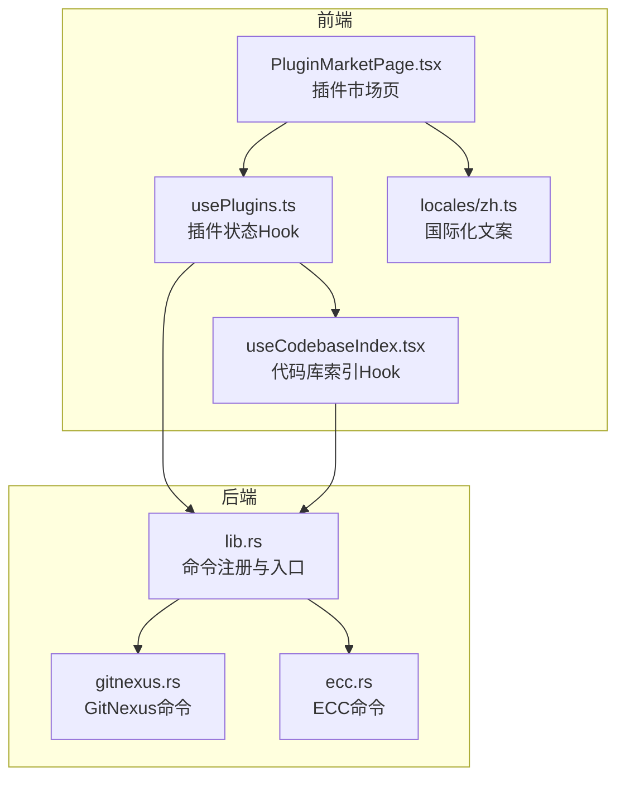
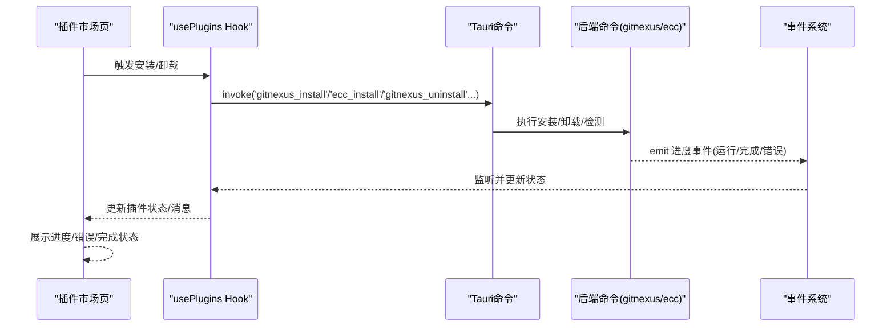
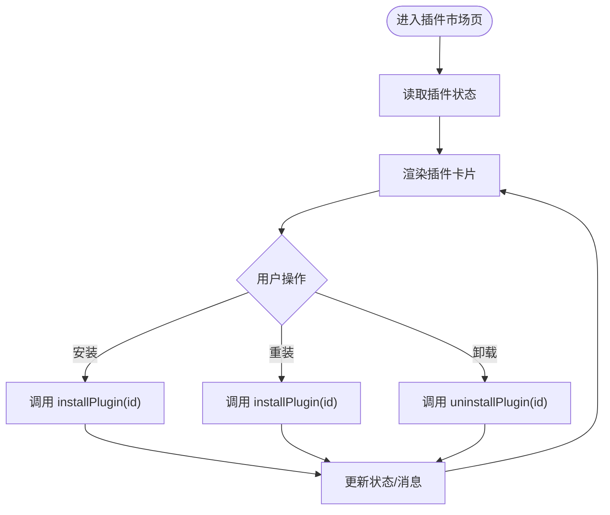
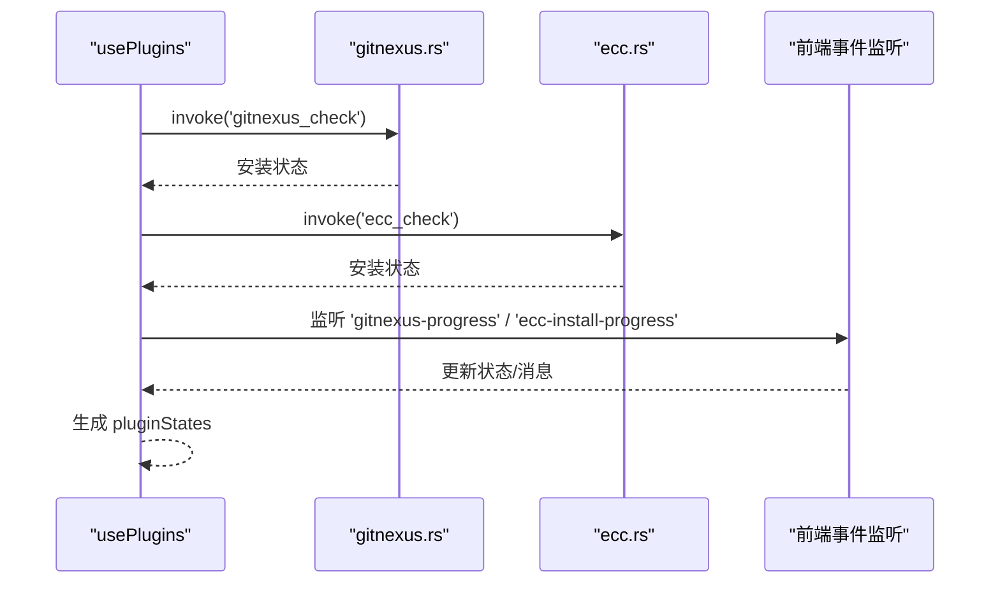
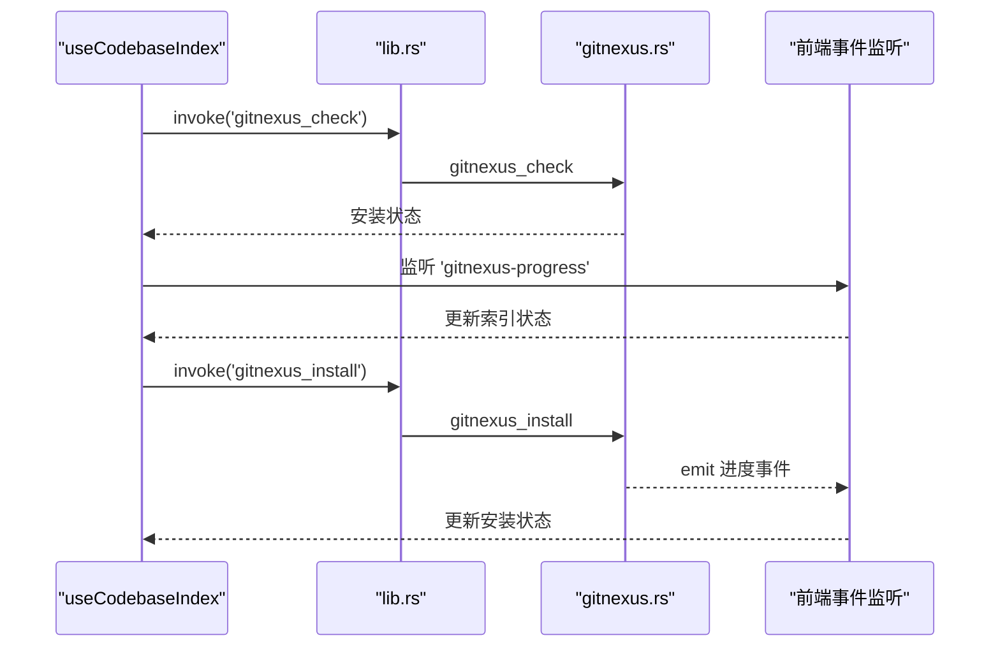
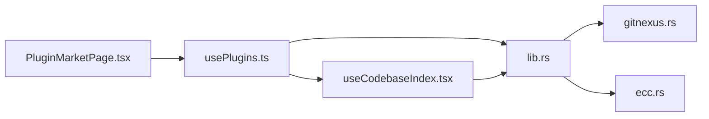
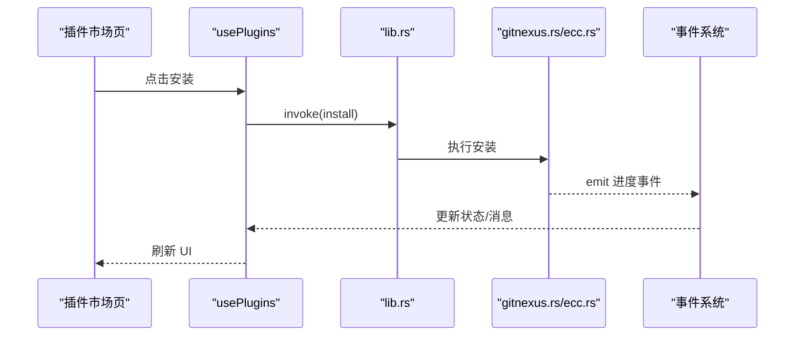

# 插件市场管理

<cite>
**本文档引用的文件**
- [src/components/PluginMarketPage.tsx](file://src/components/PluginMarketPage.tsx)
- [src/hooks/usePlugins.ts](file://src/hooks/usePlugins.ts)
- [src/hooks/useCodebaseIndex.tsx](file://src/hooks/useCodebaseIndex.tsx)
- [src/i18n/locales/zh.ts](file://src/i18n/locales/zh.ts)
- [src-tauri/src/lib.rs](file://src-tauri/src/lib.rs)
- [src-tauri/src/gitnexus.rs](file://src-tauri/src/gitnexus.rs)
- [src-tauri/src/ecc.rs](file://src-tauri/src/ecc.rs)
</cite>

## 目录
1. [简介](#简介)
2. [项目结构](#项目结构)
3. [核心组件](#核心组件)
4. [架构总览](#架构总览)
5. [详细组件分析](#详细组件分析)
6. [依赖关系分析](#依赖关系分析)
7. [性能考虑](#性能考虑)
8. [故障排查指南](#故障排查指南)
9. [结论](#结论)
10. [附录](#附录)

## 简介
本文件面向 RabbitCoding 插件市场管理，系统性梳理插件市场的实现机制与运维实践，涵盖插件展示、分类管理、搜索过滤、安装/卸载/重装、版本与更新、状态跟踪与进度显示、错误处理、批量操作、评分与评价、下载统计、审核与质量控制、推广与运营最佳实践等内容。文档以代码为依据，结合可视化图表，帮助开发者与运营人员快速理解与高效维护插件生态。

## 项目结构
插件市场相关代码主要分布在前端组件与 Hooks、国际化文案、以及后端 Tauri 命令三部分：
- 前端页面与状态管理：插件市场页、插件状态 Hook、代码库索引 Hook
- 国际化：插件市场文案与多语言支持
- 后端命令：GitNexus 安装/卸载/索引、ECC 安装/卸载、事件派发

**图表来源**
- [src/components/PluginMarketPage.tsx](file://src/components/PluginMarketPage.tsx)
- [src/hooks/usePlugins.ts](file://src/hooks/usePlugins.ts)
- [src/hooks/useCodebaseIndex.tsx](file://src/hooks/useCodebaseIndex.tsx)
- [src/i18n/locales/zh.ts](file://src/i18n/locales/zh.ts)
- [src-tauri/src/lib.rs](file://src-tauri/src/lib.rs)
- [src-tauri/src/gitnexus.rs](file://src-tauri/src/gitnexus.rs)
- [src-tauri/src/ecc.rs](file://src-tauri/src/ecc.rs)

**章节来源**
- [src/components/PluginMarketPage.tsx](file://src/components/PluginMarketPage.tsx)
- [src/hooks/usePlugins.ts](file://src/hooks/usePlugins.ts)
- [src/hooks/useCodebaseIndex.tsx](file://src/hooks/useCodebaseIndex.tsx)
- [src/i18n/locales/zh.ts](file://src/i18n/locales/zh.ts)
- [src-tauri/src/lib.rs](file://src-tauri/src/lib.rs)

## 核心组件
- 插件市场页（PluginMarketPage）：提供「市场」「已安装」双标签页，展示插件卡片，支持安装/重装/卸载、状态与进度展示、错误提示。
- 插件状态 Hook（usePlugins）：统一管理插件安装状态、监听后端进度事件、封装安装/卸载逻辑。
- 代码库索引 Hook（useCodebaseIndex）：管理 GitNexus 安装状态与索引进度事件，支撑「已安装」页的插件状态联动。
- 国际化（locales/zh.ts）：提供插件市场文案与多语言支持。
- 后端命令（lib.rs + gitnexus.rs + ecc.rs）：提供插件安装/卸载、进度事件派发、状态查询等能力。

**章节来源**
- [src/components/PluginMarketPage.tsx](file://src/components/PluginMarketPage.tsx)
- [src/hooks/usePlugins.ts](file://src/hooks/usePlugins.ts)
- [src/hooks/useCodebaseIndex.tsx](file://src/hooks/useCodebaseIndex.tsx)
- [src/i18n/locales/zh.ts](file://src/i18n/locales/zh.ts)
- [src-tauri/src/lib.rs](file://src-tauri/src/lib.rs)
- [src-tauri/src/gitnexus.rs](file://src-tauri/src/gitnexus.rs)
- [src-tauri/src/ecc.rs](file://src-tauri/src/ecc.rs)

## 架构总览
插件市场采用“前端页面 + 状态 Hook + 国际化 + 后端命令”的分层设计。前端通过 Tauri invoke 调用后端命令，后端通过事件（progress）向前端推送安装/索引进度，形成闭环的状态管理与用户体验。

**图表来源**
- [src/components/PluginMarketPage.tsx](file://src/components/PluginMarketPage.tsx)
- [src/hooks/usePlugins.ts](file://src/hooks/usePlugins.ts)
- [src-tauri/src/lib.rs](file://src-tauri/src/lib.rs)
- [src-tauri/src/gitnexus.rs](file://src-tauri/src/gitnexus.rs)
- [src-tauri/src/ecc.rs](file://src-tauri/src/ecc.rs)

## 详细组件分析

### 插件市场页（PluginMarketPage）
- 功能要点
  - 双标签页：「市场」「已安装」，已安装页支持「重新安装」「卸载」。
  - 插件卡片：展示图标、名称、描述、安装状态、实时日志、错误信息。
  - 操作按钮：安装、重试、禁用中状态、卸载。
  - 空状态：无已安装插件时显示占位提示。
- 状态驱动
  - 通过 usePlugins 提供的 pluginStates、installPlugin、uninstallPlugin 控制 UI 行为。
  - 安装中/错误状态通过状态字段与 message 字段驱动 UI 展示。

**图表来源**
- [src/components/PluginMarketPage.tsx](file://src/components/PluginMarketPage.tsx)
- [src/hooks/usePlugins.ts](file://src/hooks/usePlugins.ts)

**章节来源**
- [src/components/PluginMarketPage.tsx](file://src/components/PluginMarketPage.tsx)
- [src/hooks/usePlugins.ts](file://src/hooks/usePlugins.ts)

### 插件状态 Hook（usePlugins）
- 职责
  - 统一管理插件状态（已安装/安装中/错误）、消息、安装/卸载动作。
  - 监听后端进度事件（gitnexus-progress、ecc-install-progress），更新状态。
  - 封装不同插件的安装/卸载差异（GitNexus 通过 invoke 调用；ECC 通过 npx；Context7 通过本地存储 MCP 配置）。
- 关键点
  - 插件状态来源：GitNexus 检测、Context7 配置检测、ECC 检测与进度事件。
  - 安装/卸载：根据插件 ID 分发至对应逻辑，失败时设置错误状态与消息。

**图表来源**
- [src/hooks/usePlugins.ts](file://src/hooks/usePlugins.ts)
- [src-tauri/src/gitnexus.rs](file://src-tauri/src/gitnexus.rs)
- [src-tauri/src/ecc.rs](file://src-tauri/src/ecc.rs)

**章节来源**
- [src/hooks/usePlugins.ts](file://src/hooks/usePlugins.ts)
- [src-tauri/src/gitnexus.rs](file://src-tauri/src/gitnexus.rs)
- [src-tauri/src/ecc.rs](file://src-tauri/src/ecc.rs)

### 代码库索引 Hook（useCodebaseIndex）
- 职责
  - 管理 GitNexus 安装状态与索引进度事件，支撑「已安装」页的插件状态联动。
  - 提供一键安装 GitNexus、触发索引、同步工作区、刷新状态等能力。
- 关键点
  - 监听 gitnexus-progress 与 gitnexus-install-progress 事件，更新索引状态与安装状态。
  - 通过 invoke 调用后端命令，实现安装、分析、列出、分组同步等功能。

**图表来源**
- [src/hooks/useCodebaseIndex.tsx](file://src/hooks/useCodebaseIndex.tsx)
- [src-tauri/src/lib.rs](file://src-tauri/src/lib.rs)
- [src-tauri/src/gitnexus.rs](file://src-tauri/src/gitnexus.rs)

**章节来源**
- [src/hooks/useCodebaseIndex.tsx](file://src/hooks/useCodebaseIndex.tsx)
- [src-tauri/src/lib.rs](file://src-tauri/src/lib.rs)
- [src-tauri/src/gitnexus.rs](file://src-tauri/src/gitnexus.rs)

### 国际化与文案
- 插件市场文案集中于 locales/zh.ts，包含标题、描述、按钮文案、状态文案等，便于多语言扩展。
- 插件市场页通过 useI18n 获取翻译，确保 UI 文案一致性。

**章节来源**
- [src/i18n/locales/zh.ts](file://src/i18n/locales/zh.ts)
- [src/components/PluginMarketPage.tsx](file://src/components/PluginMarketPage.tsx)

### 后端命令与事件
- 命令注册：lib.rs 中集中注册所有命令，包括 GitNexus 与 ECC 的安装/卸载/检测、进度事件等。
- GitNexus 命令：提供安装、卸载、检测、分析、列出、分组创建/添加/同步、状态查询等。
- ECC 命令：提供检测、安装、卸载、进度事件派发。
- 事件派发：安装过程中通过 emit 实时推送进度，前端监听并更新 UI。

**章节来源**
- [src-tauri/src/lib.rs](file://src-tauri/src/lib.rs)
- [src-tauri/src/gitnexus.rs](file://src-tauri/src/gitnexus.rs)
- [src-tauri/src/ecc.rs](file://src-tauri/src/ecc.rs)

## 依赖关系分析
- 前端依赖
  - PluginMarketPage 依赖 usePlugins 与国际化。
  - usePlugins 依赖 useCodebaseIndex（GitNexus 状态）与 Tauri 事件。
  - useCodebaseIndex 依赖 Tauri 命令与事件。
- 后端依赖
  - lib.rs 注册命令并桥接前端调用。
  - gitnexus.rs/ecc.rs 提供具体安装/卸载/检测逻辑与事件派发。

**图表来源**
- [src/components/PluginMarketPage.tsx](file://src/components/PluginMarketPage.tsx)
- [src/hooks/usePlugins.ts](file://src/hooks/usePlugins.ts)
- [src/hooks/useCodebaseIndex.tsx](file://src/hooks/useCodebaseIndex.tsx)
- [src-tauri/src/lib.rs](file://src-tauri/src/lib.rs)
- [src-tauri/src/gitnexus.rs](file://src-tauri/src/gitnexus.rs)
- [src-tauri/src/ecc.rs](file://src-tauri/src/ecc.rs)

**章节来源**
- [src/components/PluginMarketPage.tsx](file://src/components/PluginMarketPage.tsx)
- [src/hooks/usePlugins.ts](file://src/hooks/usePlugins.ts)
- [src/hooks/useCodebaseIndex.tsx](file://src/hooks/useCodebaseIndex.tsx)
- [src-tauri/src/lib.rs](file://src-tauri/src/lib.rs)
- [src-tauri/src/gitnexus.rs](file://src-tauri/src/gitnexus.rs)
- [src-tauri/src/ecc.rs](file://src-tauri/src/ecc.rs)

## 性能考虑
- 安装/卸载异步化：通过后台线程与事件派发，避免阻塞 UI。
- 事件聚合：前端统一监听进度事件，减少重复轮询与状态抖动。
- 幂等操作：如 GitNexus 安装、分组创建等，后端已做存在性检查与忽略处理。
- 资源隔离：内置 Node/NPM 运行时与应用私有前缀，降低系统依赖与冲突风险。

## 故障排查指南
- 安装失败
  - 检查后端事件：观察 gitnexus-install-progress/ecc-install-progress 的错误消息。
  - 核对前置条件：ECC 需要 npx 可用；GitNexus 需要内置 Node/NPM 可用。
- 状态不一致
  - 使用「刷新状态」或重新检测，确保前端状态与后端实际状态一致。
- 事件未到达
  - 确认前端已正确监听相应事件；检查后端 emit 是否触发。
- 卸载残留
  - 针对 ECC 卸载，确认 ~/.claude 下相关目录已被清理。

**章节来源**
- [src/hooks/usePlugins.ts](file://src/hooks/usePlugins.ts)
- [src-tauri/src/gitnexus.rs](file://src-tauri/src/gitnexus.rs)
- [src-tauri/src/ecc.rs](file://src-tauri/src/ecc.rs)

## 结论
RabbitCoding 插件市场通过清晰的前端页面与 Hook、完善的后端命令与事件系统，实现了插件的安装、状态跟踪、进度展示与错误处理。现有架构具备良好的扩展性与稳定性，适合进一步引入评分、评价、下载统计、审核与质量控制、推广运营等能力。

## 附录

### 插件安装流程（序列图）

**图表来源**
- [src/components/PluginMarketPage.tsx](file://src/components/PluginMarketPage.tsx)
- [src/hooks/usePlugins.ts](file://src/hooks/usePlugins.ts)
- [src-tauri/src/lib.rs](file://src-tauri/src/lib.rs)
- [src-tauri/src/gitnexus.rs](file://src-tauri/src/gitnexus.rs)
- [src-tauri/src/ecc.rs](file://src-tauri/src/ecc.rs)

### 插件卸载与重装流程
- 卸载：调用对应卸载命令，清理状态与消息，必要时移除本地配置。
- 重装：先卸载，再安装，利用事件系统展示进度与最终状态。

**章节来源**
- [src/hooks/usePlugins.ts](file://src/hooks/usePlugins.ts)
- [src-tauri/src/ecc.rs](file://src-tauri/src/ecc.rs)
- [src-tauri/src/gitnexus.rs](file://src-tauri/src/gitnexus.rs)

### 版本管理与更新机制
- GitNexus：通过内置 Node/NPM 在应用私有前缀安装，版本检测基于 CLI --version 输出。
- ECC：通过 npx -y ecc-install 安装，版本检测基于目录与文件存在性推断。
- 更新：当前实现为重新安装，后续可扩展为增量更新或版本对比。

**章节来源**
- [src-tauri/src/gitnexus.rs](file://src-tauri/src/gitnexus.rs)
- [src-tauri/src/ecc.rs](file://src-tauri/src/ecc.rs)

### 搜索与分类（概念性说明）
- 搜索：可在现有插件卡片基础上增加搜索框与过滤逻辑，结合国际化文案与状态字段进行筛选。
- 分类：通过插件元数据扩展分类字段，配合 UI 增加分类筛选器。

[本节为概念性说明，不直接分析具体文件]

### 评分系统、评价与下载统计（概念性说明）
- 评分与评价：建议引入数据库或本地持久化存储，记录评分与评价内容，前端展示与排序。
- 下载统计：可在后端记录安装次数与时间，前端展示统计信息。

[本节为概念性说明，不直接分析具体文件]

### 审核与质量控制（概念性说明）
- 审核流程：建立插件元数据校验、安装脚本安全扫描、版本合规检查等机制。
- 质量控制：引入自动化测试与回归检查，保障插件稳定性。

[本节为概念性说明，不直接分析具体文件]

### 推广与运营最佳实践（概念性说明）
- 推广策略：通过市场页推荐位、新插件上架提示、热门插件榜单等方式提升曝光。
- 运营实践：定期清理无效插件、收集用户反馈、优化安装体验与文档。

[本节为概念性说明，不直接分析具体文件]