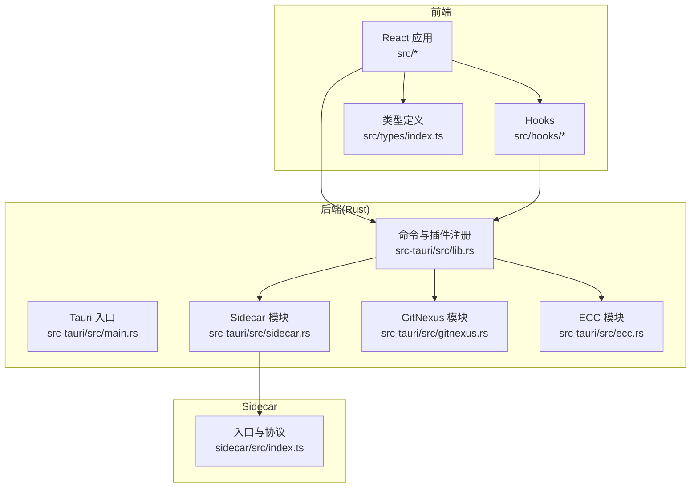
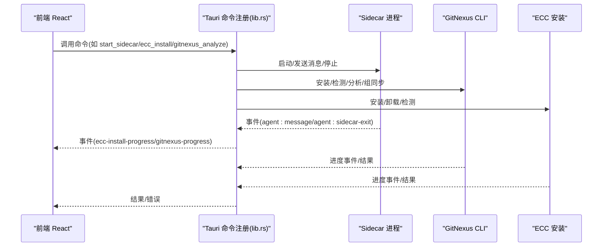
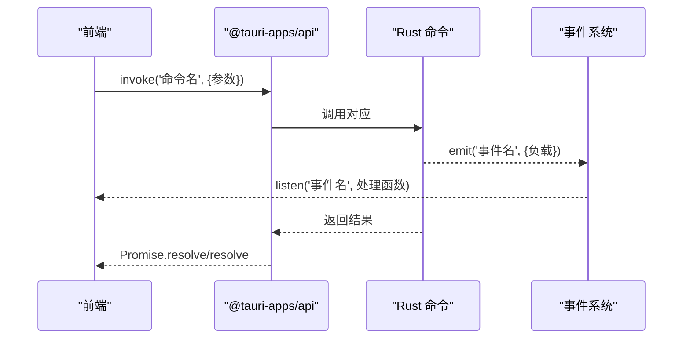
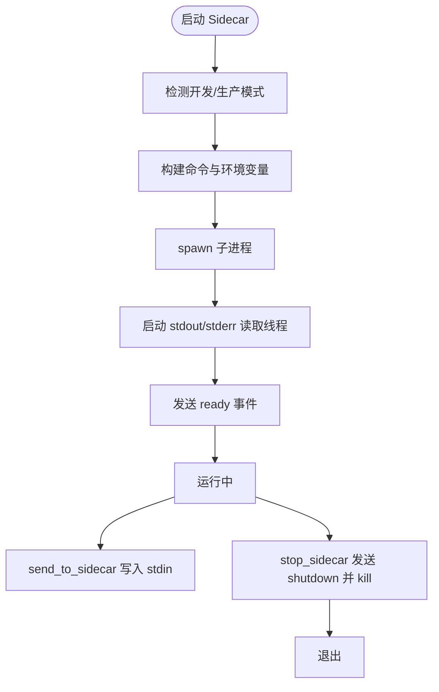
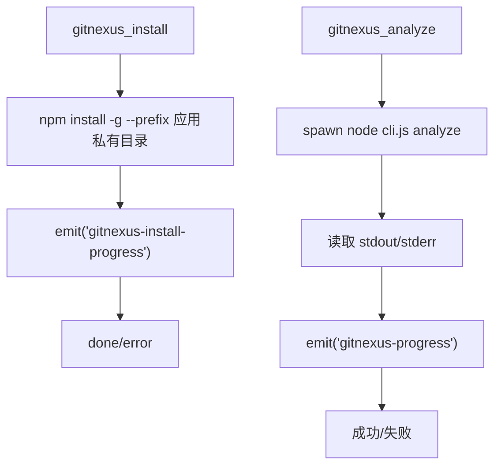
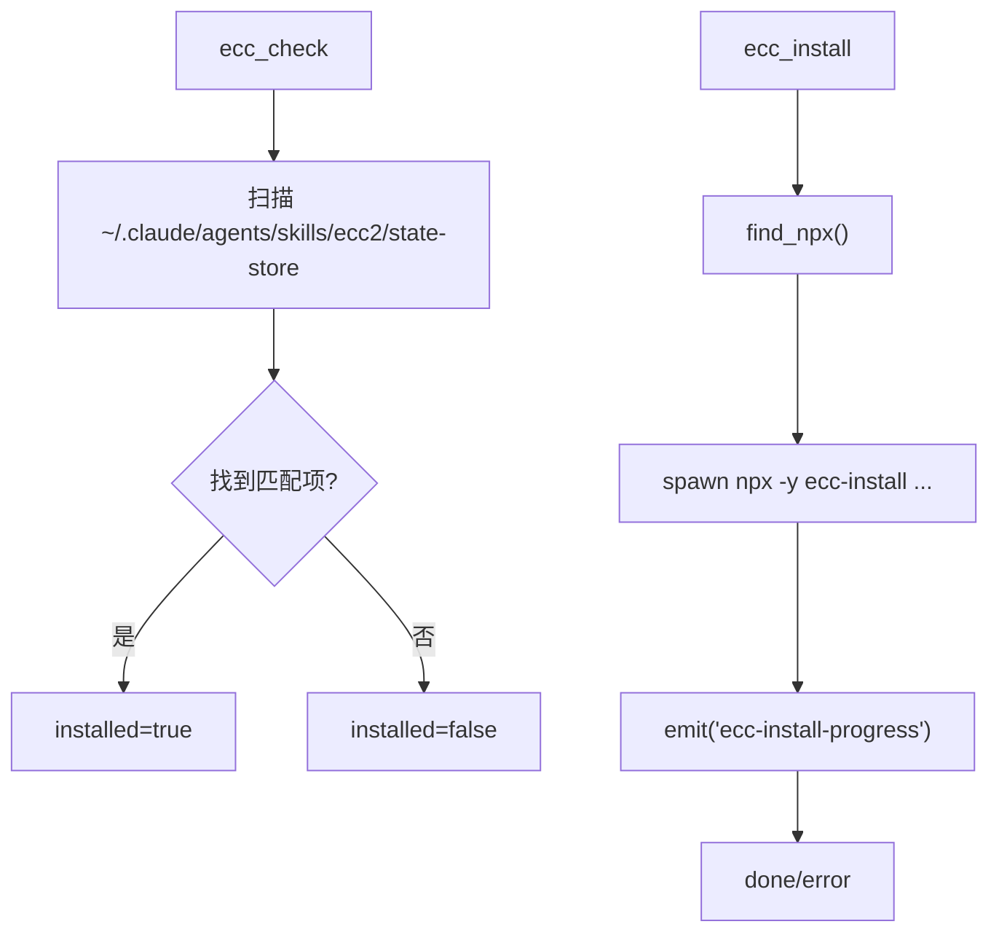
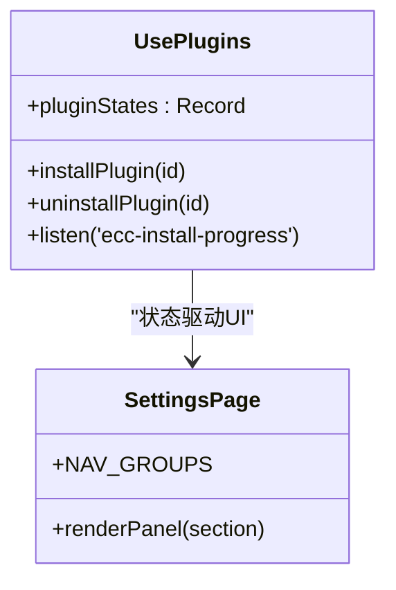
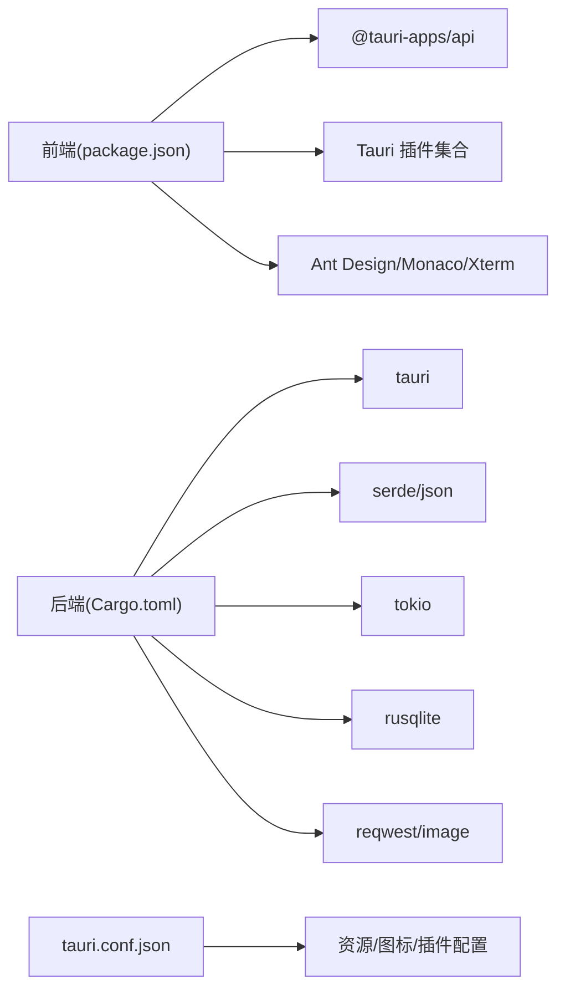

# 插件开发指南

<cite>
**本文档引用的文件**
- [README.md](file://README.md)
- [package.json](file://package.json)
- [Cargo.toml](file://src-tauri/Cargo.toml)
- [tauri.conf.json](file://src-tauri/tauri.conf.json)
- [lib.rs](file://src-tauri/src/lib.rs)
- [main.rs](file://src-tauri/src/main.rs)
- [usePlugins.ts](file://src/hooks/usePlugins.ts)
- [SettingsPage.tsx](file://src/components/settings/SettingsPage.tsx)
- [index.ts](file://sidecar/src/index.ts)
- [sidecar.rs](file://src-tauri/src/sidecar.rs)
- [gitnexus.rs](file://src-tauri/src/gitnexus.rs)
- [ecc.rs](file://src-tauri/src/ecc.rs)
- [index.ts](file://src/types/index.ts)
</cite>

## 目录
1. [简介](#简介)
2. [项目结构](#项目结构)
3. [核心组件](#核心组件)
4. [架构总览](#架构总览)
5. [详细组件分析](#详细组件分析)
6. [依赖关系分析](#依赖关系分析)
7. [性能考虑](#性能考虑)
8. [故障排查指南](#故障排查指南)
9. [结论](#结论)
10. [附录](#附录)

## 简介
本指南面向 RabbitCoding 插件开发者，提供从项目初始化到发布部署的完整流程，涵盖插件接口规范、API 使用方法、事件处理机制、配置文件格式与元数据定义、依赖声明、开发模板与最佳实践、调试与错误处理、性能优化、测试策略与质量保障、常见问题与工具推荐等内容。文档基于仓库现有代码进行深入分析，确保内容与实际实现保持一致。

## 项目结构
RabbitCoding 采用 Tauri + React + TypeScript 技术栈，前端使用 Vite 构建，后端 Rust 提供原生能力与插件集成，sidecar 作为外部进程与 Claude Agent 协作。关键目录与职责如下：
- src：React 前端源码，包含组件、Hooks、类型定义、国际化与工具函数
- src-tauri：Rust 后端，包含命令注册、插件管理、数据库、网络诊断、认证等模块
- sidecar：Node.js 侧车进程，负责与 Claude Agent 通信，遵循 JSON-lines 协议
- public：静态资源
- 配置文件：package.json（前端依赖与脚本）、Cargo.toml（Rust 依赖与插件）、tauri.conf.json（应用构建与打包配置）

**图表来源**
- [main.rs:1-7](file://src-tauri/src/main.rs#L1-L7)
- [lib.rs:196-390](file://src-tauri/src/lib.rs#L196-L390)
- [sidecar.rs:1-359](file://src-tauri/src/sidecar.rs#L1-L359)
- [gitnexus.rs:1-761](file://src-tauri/src/gitnexus.rs#L1-L761)
- [ecc.rs:1-355](file://src-tauri/src/ecc.rs#L1-L355)
- [index.ts:1-145](file://sidecar/src/index.ts#L1-L145)

**章节来源**
- [README.md:1-8](file://README.md#L1-L8)
- [package.json:1-46](file://package.json#L1-L46)
- [Cargo.toml:1-40](file://src-tauri/Cargo.toml#L1-L40)
- [tauri.conf.json:1-52](file://src-tauri/tauri.conf.json#L1-L52)

## 核心组件
本节梳理插件开发涉及的核心组件及其职责：
- Tauri 命令与插件注册：在 lib.rs 中集中注册命令与插件，统一暴露给前端调用
- 插件状态管理：usePlugins.ts 提供插件安装/卸载与状态监听逻辑
- Sidecar 进程：负责与 Claude Agent 交互，支持启动、发送消息、停止与状态查询
- GitNexus：代码库索引与组同步，提供安装、检测、分析、列出、组操作等命令
- ECC：Claude Expert Code Collection 安装与卸载，提供检测与进度事件
- 类型系统：src/types/index.ts 定义了 Agent 消息、MCP 配置、网络诊断、反馈等类型

**章节来源**
- [lib.rs:196-390](file://src-tauri/src/lib.rs#L196-L390)
- [usePlugins.ts:1-195](file://src/hooks/usePlugins.ts#L1-L195)
- [sidecar.rs:1-359](file://src-tauri/src/sidecar.rs#L1-L359)
- [gitnexus.rs:1-761](file://src-tauri/src/gitnexus.rs#L1-L761)
- [ecc.rs:1-355](file://src-tauri/src/ecc.rs#L1-L355)
- [index.ts:1-733](file://src/types/index.ts#L1-L733)

## 架构总览
RabbitCoding 插件体系围绕“前端调用 → Rust 命令 → 子进程/外部工具”的模式展开。前端通过 @tauri-apps/api 调用 Rust 注册的命令，Rust 命令根据需要启动 sidecar、调用 GitNexus CLI 或执行 ECC 安装/卸载，期间通过事件向前端推送进度与状态。

**图表来源**
- [lib.rs:344-387](file://src-tauri/src/lib.rs#L344-L387)
- [sidecar.rs:60-214](file://src-tauri/src/sidecar.rs#L60-L214)
- [gitnexus.rs:180-311](file://src-tauri/src/gitnexus.rs#L180-L311)
- [ecc.rs:204-290](file://src-tauri/src/ecc.rs#L204-L290)

## 详细组件分析

### 插件接口规范与 API 使用
- 命令注册：Rust 通过 generate_handler! 将命令集中注册，前端通过 invoke 调用
- 事件订阅：前端使用 listen 订阅后端事件，如 ecc-install-progress、gitnexus-progress、agent:message
- 参数与返回：命令参数与返回值在 Rust 中以结构体形式定义，前端通过类型系统约束

**图表来源**
- [lib.rs:344-387](file://src-tauri/src/lib.rs#L344-L387)
- [usePlugins.ts:80-100](file://src/hooks/usePlugins.ts#L80-L100)

**章节来源**
- [lib.rs:344-387](file://src-tauri/src/lib.rs#L344-L387)
- [usePlugins.ts:1-195](file://src/hooks/usePlugins.ts#L1-L195)
- [index.ts:274-283](file://src/types/index.ts#L274-L283)

### Sidecar 进程管理
- 启动：根据开发/生产模式选择 Node.js 与 sidecar-bundle.js，注入环境变量，清理 Anthropic 相关环境变量，隔离用户全局配置
- 通信：通过 stdin 发送 JSON-lines 命令，stdout 接收事件，stderr 输出日志
- 状态：提供 get_sidecar_status 查询运行状态，stop_sidecar 发送 shutdown 命令并强制终止

**图表来源**
- [sidecar.rs:60-214](file://src-tauri/src/sidecar.rs#L60-L214)
- [index.ts:96-128](file://sidecar/src/index.ts#L96-L128)

**章节来源**
- [sidecar.rs:1-359](file://src-tauri/src/sidecar.rs#L1-L359)
- [index.ts:1-145](file://sidecar/src/index.ts#L1-L145)

### GitNexus 插件
- 安装：使用内置 Node.js 与 npm-cli.js 安装到应用私有 prefix，避免系统依赖
- 检测：验证 CLI 是否存在于私有目录
- 分析：在后台线程执行 analyze，实时 emit 进度事件
- 组操作：创建组、添加仓库、同步组、查询状态

**图表来源**
- [gitnexus.rs:180-311](file://src-tauri/src/gitnexus.rs#L180-L311)
- [gitnexus.rs:383-561](file://src-tauri/src/gitnexus.rs#L383-L561)

**章节来源**
- [gitnexus.rs:1-761](file://src-tauri/src/gitnexus.rs#L1-L761)

### ECC 插件
- 检测：扫描用户家目录下的 Claude 配置目录，识别 agents/skills/ecc2/state-store
- 安装：通过 npx 执行 ecc-install --profile minimal --target claude，实时 emit 进度
- 卸载：删除相关目录与文件

**图表来源**
- [ecc.rs:144-200](file://src-tauri/src/ecc.rs#L144-L200)
- [ecc.rs:204-290](file://src-tauri/src/ecc.rs#L204-L290)

**章节来源**
- [ecc.rs:1-355](file://src-tauri/src/ecc.rs#L1-L355)

### 插件状态管理与 UI 集成
- usePlugins：封装插件安装/卸载、状态监听、MCP 配置管理
- SettingsPage：设置页导航与面板渲染，支持扩展新的插件面板

**图表来源**
- [usePlugins.ts:53-195](file://src/hooks/usePlugins.ts#L53-L195)
- [SettingsPage.tsx:56-143](file://src/components/settings/SettingsPage.tsx#L56-L143)

**章节来源**
- [usePlugins.ts:1-195](file://src/hooks/usePlugins.ts#L1-L195)
- [SettingsPage.tsx:1-228](file://src/components/settings/SettingsPage.tsx#L1-L228)

## 依赖关系分析
- 前端依赖：@tauri-apps/api、@tauri-apps/plugin-* 等插件，Ant Design、Monaco Editor、Xterm 等
- 后端依赖：tauri、serde、tokio、reqwest、rusqlite、image、tauri-plugin-* 等
- 构建与打包：Vite、Tauri CLI、tauri.conf.json 配置资源与图标

**图表来源**
- [package.json:14-36](file://package.json#L14-L36)
- [Cargo.toml:20-38](file://src-tauri/Cargo.toml#L20-L38)
- [tauri.conf.json:26-50](file://src-tauri/tauri.conf.json#L26-L50)

**章节来源**
- [package.json:1-46](file://package.json#L1-L46)
- [Cargo.toml:1-40](file://src-tauri/Cargo.toml#L1-L40)
- [tauri.conf.json:1-52](file://src-tauri/tauri.conf.json#L1-L52)

## 性能考虑
- 异步与并发：使用 tokio::task::spawn_blocking 执行耗时子进程，避免阻塞主线程
- 进程隔离：sidecar 与 GitNexus 使用内置 Node.js，避免系统 PATH 与权限问题，提升稳定性
- 事件驱动：通过事件流推送进度，减少轮询带来的 CPU 占用
- 环境变量清理：启动 sidecar 时移除 Anthropic 相关环境变量，防止冲突与重复加载

[本节为通用指导，无需特定文件引用]

## 故障排查指南
- 事件未到达：检查前端是否正确 listen 对应事件名，确认 Rust emit 调用位置
- 子进程无响应：确认 sidecar 启动参数与路径，查看 stderr 日志输出
- GitNexus 安装失败：检查内置 Node.js 与 npm-cli.js 是否存在，查看进度事件中的错误详情
- ECC 安装失败：确认系统已安装 Node.js，npx 可用；查看进度事件中的错误信息
- 数据库初始化失败：前端会降级到 localStorage，检查 app_data_dir 权限与路径

**章节来源**
- [sidecar.rs:175-214](file://src-tauri/src/sidecar.rs#L175-L214)
- [gitnexus.rs:208-311](file://src-tauri/src/gitnexus.rs#L208-L311)
- [ecc.rs:204-290](file://src-tauri/src/ecc.rs#L204-L290)
- [lib.rs:213-221](file://src-tauri/src/lib.rs#L213-L221)

## 结论
RabbitCoding 提供了完善的插件开发框架：统一的命令注册与事件系统、可扩展的 Sidecar 通信协议、内置 Node.js 的 GitNexus/ECC 管理、以及清晰的类型定义与 UI 集成。按照本指南的流程与最佳实践，开发者可以快速实现稳定、可维护的插件功能，并在不同平台上获得一致的用户体验。

[本节为总结性内容，无需特定文件引用]

## 附录

### 插件开发模板与步骤
- 初始化：基于现有项目结构，新增插件模块（Rust 命令 + 前端 Hook + 类型定义）
- 命令注册：在 lib.rs 的 generate_handler! 中注册新命令
- 事件推送：通过 app.emit 推送进度与状态事件
- 前端集成：在 usePlugins.ts 中管理插件状态与安装流程
- UI 展示：在 SettingsPage.tsx 中添加插件面板

**章节来源**
- [lib.rs:344-387](file://src-tauri/src/lib.rs#L344-L387)
- [usePlugins.ts:1-195](file://src/hooks/usePlugins.ts#L1-L195)
- [SettingsPage.tsx:56-143](file://src/components/settings/SettingsPage.tsx#L56-L143)

### 配置文件格式与元数据
- tauri.conf.json：应用名称、版本、构建命令、窗口配置、安全策略、打包资源与图标、插件配置（如 deep-link）
- Cargo.toml：Rust 依赖与插件，如 tauri-plugin-pty、tauri-plugin-shell、rusqlite 等
- package.json：前端依赖与脚本，如 dev/build/preview/tauri/setup:resources

**章节来源**
- [tauri.conf.json:1-52](file://src-tauri/tauri.conf.json#L1-L52)
- [Cargo.toml:1-40](file://src-tauri/Cargo.toml#L1-L40)
- [package.json:1-46](file://package.json#L1-L46)

### API 使用方法速查
- 前端调用：invoke('命令名', {参数})，监听事件 listen('事件名', 处理函数)
- Rust 命令：#[tauri::command] fn 命令名(...) -> 返回值
- 事件发射：app.emit('事件名', 负载)

**章节来源**
- [lib.rs:344-387](file://src-tauri/src/lib.rs#L344-L387)
- [usePlugins.ts:80-100](file://src/hooks/usePlugins.ts#L80-L100)

### 事件处理机制
- Sidecar：agent:message、agent:sidecar-exit
- GitNexus：gitnexus-progress、gitnexus-install-progress
- ECC：ecc-install-progress

**章节来源**
- [sidecar.rs:175-194](file://src-tauri/src/sidecar.rs#L175-L194)
- [gitnexus.rs:216-230](file://src-tauri/src/gitnexus.rs#L216-L230)
- [ecc.rs:224-262](file://src-tauri/src/ecc.rs#L224-L262)

### 调试方法与工具推荐
- VS Code + Tauri 插件 + rust-analyzer
- 前端：Vite 开发服务器，热更新与类型检查
- 后端：Rust 编译与运行，DevTools（devtools feature 已启用）
- Sidecar：stderr 日志输出，便于定位问题

**章节来源**
- [README.md:5-8](file://README.md#L5-L8)
- [lib.rs:331-342](file://src-tauri/src/lib.rs#L331-L342)

### 错误处理与性能优化建议
- 使用 Result<T, String> 明确错误传播，前端捕获并展示
- 使用 tokio::task::spawn_blocking 执行外部进程，避免阻塞
- 清理环境变量，避免第三方工具污染
- 事件驱动推送进度，减少轮询

**章节来源**
- [sidecar.rs:96-115](file://src-tauri/src/sidecar.rs#L96-L115)
- [gitnexus.rs:187-200](file://src-tauri/src/gitnexus.rs#L187-L200)
- [ecc.rs:206-216](file://src-tauri/src/ecc.rs#L206-L216)

### 测试策略与质量保证
- 单元测试：针对 Rust 命令与工具函数编写测试
- 集成测试：模拟前端调用与事件监听，验证端到端流程
- 端到端测试：在真实环境中验证插件安装、运行与卸载
- 质量门禁：CI 中执行类型检查、构建与测试

[本节为通用指导，无需特定文件引用]

### 常见问题与解决方案
- 安装 GitNexus 失败：检查内置 Node.js 与 npm-cli.js 是否存在
- ECC 安装失败：确认 npx 可用，查看进度事件中的错误详情
- Sidecar 无法启动：检查资源路径与 Node.js 可执行文件
- 事件未触发：确认事件名与监听逻辑一致

**章节来源**
- [gitnexus.rs:136-144](file://src-tauri/src/gitnexus.rs#L136-L144)
- [ecc.rs:52-138](file://src-tauri/src/ecc.rs#L52-L138)
- [sidecar.rs:287-358](file://src-tauri/src/sidecar.rs#L287-L358)