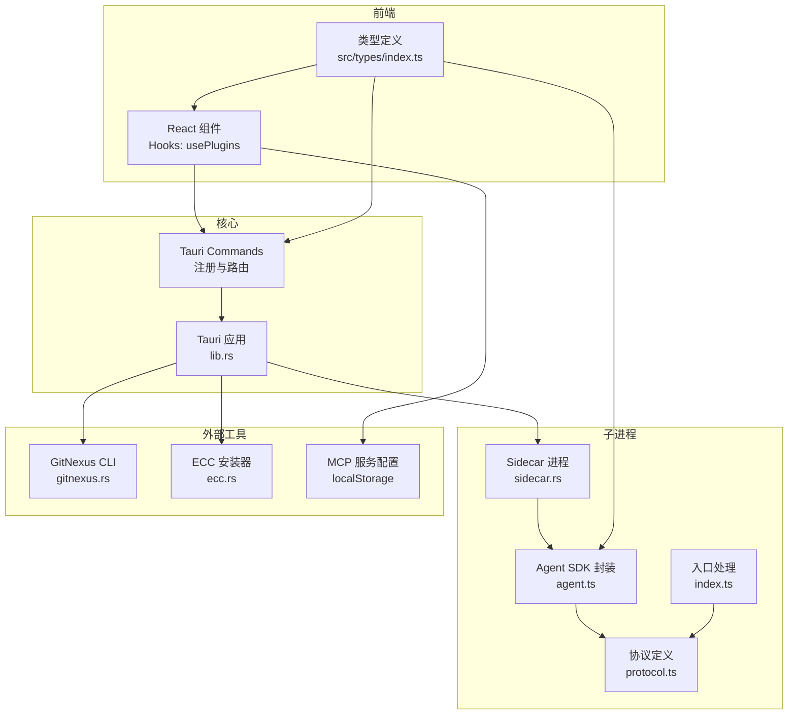
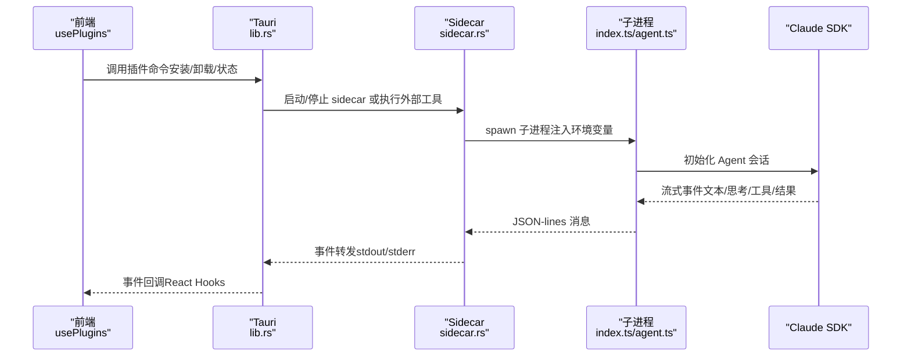
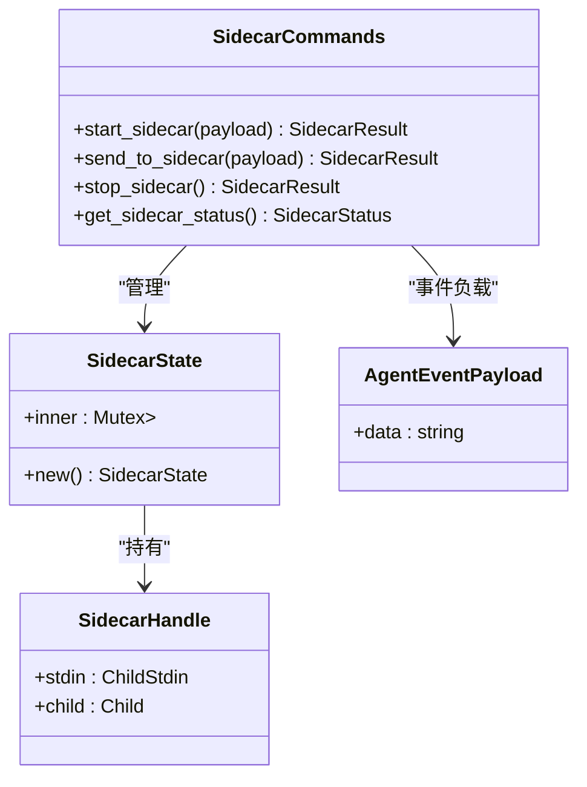
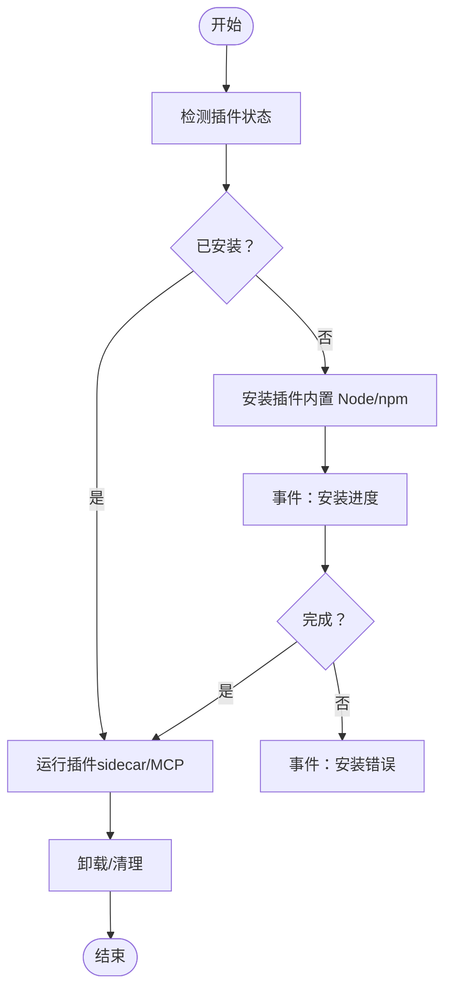
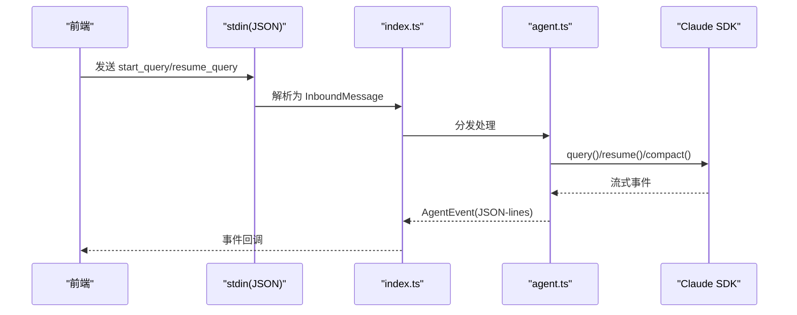
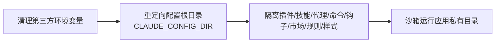
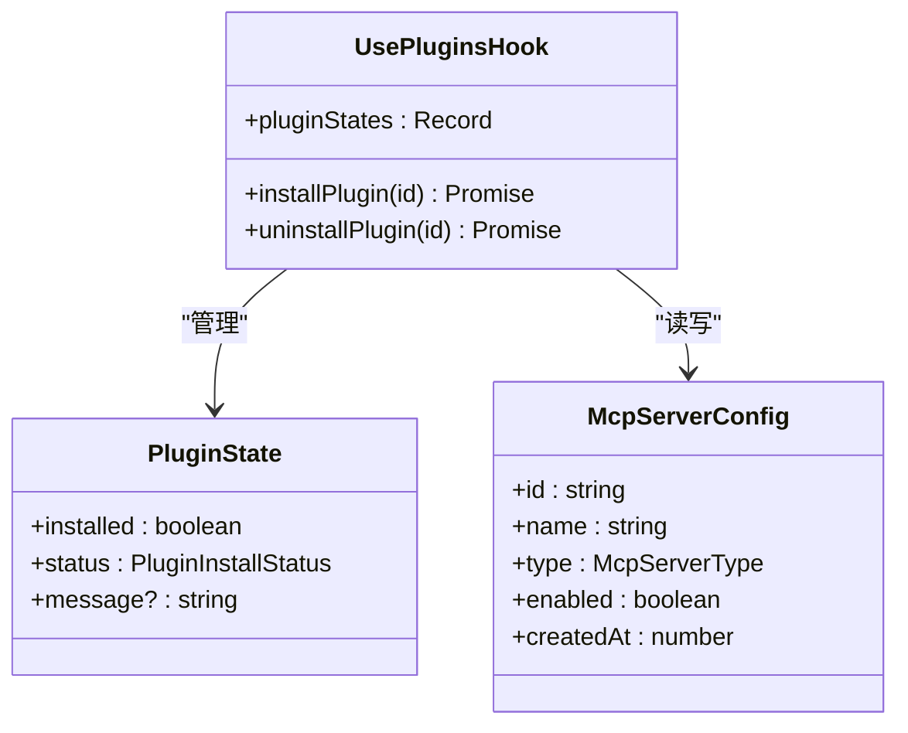
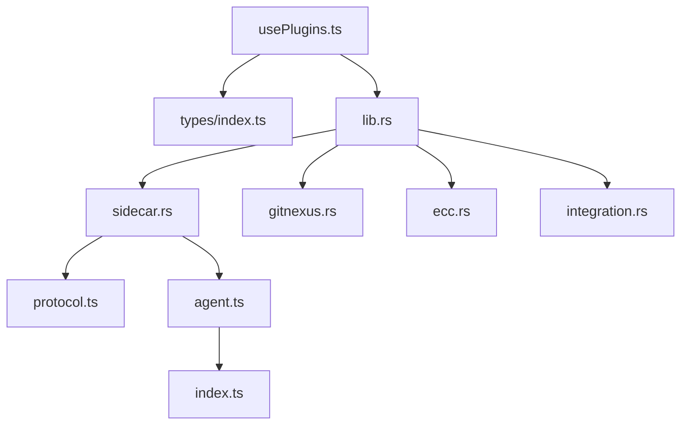

# 插件架构设计

<cite>
**本文档引用的文件**
- [README.md](file://README.md)
- [main.rs](file://src-tauri/src/main.rs)
- [lib.rs](file://src-tauri/src/lib.rs)
- [usePlugins.ts](file://src/hooks/usePlugins.ts)
- [sidecar.rs](file://src-tauri/src/sidecar.rs)
- [ecc.rs](file://src-tauri/src/ecc.rs)
- [gitnexus.rs](file://src-tauri/src/gitnexus.rs)
- [integration.rs](file://src-tauri/src/integration.rs)
- [index.ts](file://sidecar/src/index.ts)
- [agent.ts](file://sidecar/src/agent.ts)
- [protocol.ts](file://sidecar/src/protocol.ts)
- [types/index.ts](file://src/types/index.ts)
</cite>

## 目录
1. [简介](#简介)
2. [项目结构](#项目结构)
3. [核心组件](#核心组件)
4. [架构总览](#架构总览)
5. [详细组件分析](#详细组件分析)
6. [依赖关系分析](#依赖关系分析)
7. [性能考虑](#性能考虑)
8. [故障排除指南](#故障排除指南)
9. [结论](#结论)

## 简介
本文件面向 RabbitCoding 插件架构设计，系统性阐述插件系统的整体架构、插件注册机制、生命周期管理、接口规范设计，以及插件与核心系统的集成方式。重点涵盖以下方面：
- 插件注册与发现：基于本地 CLI 工具（gitnexus、ECC）与 MCP 服务配置的插件发现与注册。
- 生命周期管理：安装、运行、卸载与清理的完整生命周期。
- 接口规范：Rust Tauri Commands 与前端 React Hooks 的统一接口契约。
- 插件间通信协议：基于 JSON-lines 的 sidecar 协议，支持 Agent 查询、工具调用与用户问答。
- 安全隔离机制：通过应用私有目录、环境变量隔离与 CLAUDE_CONFIG_DIR 重定向实现安全沙箱。
- 加载流程：从前端触发到 Rust 后端启动子进程，再到 sidecar 与 Claude SDK 的完整链路。

## 项目结构
RabbitCoding 采用 Tauri + React + TypeScript 前端与 Rust 后端的混合架构。插件体系主要由以下层次构成：
- 前端层：React Hooks（如 usePlugins）负责插件状态管理与用户交互。
- 核心层：Tauri Commands（lib.rs 中注册）封装各类插件操作。
- 子进程层：sidecar.rs 管理 sidecar 子进程，ecc.rs/gnix.rs 管理外部 CLI 工具。
- 协议层：sidecar/src/protocol.ts 定义前后端通信协议，index.ts/agent.ts 实现协议处理。
- 类型层：src/types/index.ts 提供统一的数据结构与消息类型定义。

**图表来源**
- [lib.rs:125-316](file://src-tauri/src/lib.rs#L125-L316)
- [sidecar.rs:59-358](file://src-tauri/src/sidecar.rs#L59-L358)
- [gitnexus.rs:180-379](file://src-tauri/src/gitnexus.rs#L180-L379)
- [ecc.rs:144-354](file://src-tauri/src/ecc.rs#L144-L354)
- [index.ts:96-144](file://sidecar/src/index.ts#L96-L144)
- [agent.ts:470-606](file://sidecar/src/agent.ts#L470-L606)
- [protocol.ts:13-252](file://sidecar/src/protocol.ts#L13-L252)
- [usePlugins.ts:53-194](file://src/hooks/usePlugins.ts#L53-L194)
- [types/index.ts:413-451](file://src/types/index.ts#L413-L451)

**章节来源**
- [lib.rs:125-316](file://src-tauri/src/lib.rs#L125-L316)
- [usePlugins.ts:53-194](file://src/hooks/usePlugins.ts#L53-L194)
- [types/index.ts:413-451](file://src/types/index.ts#L413-L451)

## 核心组件
本节聚焦插件系统的关键组件及其职责：
- Tauri Commands：在 lib.rs 中集中注册，提供插件安装、卸载、状态查询与 sidecar 管理等能力。
- Sidecar 子进程：通过 sidecar.rs 启动与管理 sidecar，注入环境变量、隔离配置目录，并转发 stdout/stderr 事件。
- 外部工具插件：
  - GitNexus：通过内置 Node.js 与 npm-cli.js 安装/卸载 CLI，避免系统依赖与 PATH 问题。
  - ECC：检测/安装/卸载 ECC，实时上报安装进度事件。
- 前端 Hooks：usePlugins.ts 统一管理插件状态、安装/卸载流程与事件监听。
- 协议层：protocol.ts 定义 JSON-lines 协议，index.ts/agent.ts 实现消息解析与处理。

**章节来源**
- [lib.rs:125-316](file://src-tauri/src/lib.rs#L125-L316)
- [sidecar.rs:59-358](file://src-tauri/src/sidecar.rs#L59-L358)
- [gitnexus.rs:180-379](file://src-tauri/src/gitnexus.rs#L180-L379)
- [ecc.rs:144-354](file://src-tauri/src/ecc.rs#L144-L354)
- [usePlugins.ts:53-194](file://src/hooks/usePlugins.ts#L53-L194)
- [protocol.ts:13-252](file://sidecar/src/protocol.ts#L13-L252)

## 架构总览
RabbitCoding 插件架构以“前端触发 → Rust 后端执行 → 子进程处理 → 协议通信”的链路为核心，结合安全隔离与事件驱动的异步处理，形成高内聚、低耦合的插件生态。

**图表来源**
- [lib.rs:272-313](file://src-tauri/src/lib.rs#L272-L313)
- [sidecar.rs:59-214](file://src-tauri/src/sidecar.rs#L59-L214)
- [index.ts:96-144](file://sidecar/src/index.ts#L96-L144)
- [agent.ts:241-465](file://sidecar/src/agent.ts#L241-L465)

**章节来源**
- [lib.rs:272-313](file://src-tauri/src/lib.rs#L272-L313)
- [sidecar.rs:59-214](file://src-tauri/src/sidecar.rs#L59-L214)
- [index.ts:96-144](file://sidecar/src/index.ts#L96-L144)
- [agent.ts:241-465](file://sidecar/src/agent.ts#L241-L465)

## 详细组件分析

### Sidecar 子进程管理
Sidecar 作为 Claude Agent 的运行载体，负责：
- 进程生命周期管理：启动、停止、状态查询与优雅关闭。
- 环境隔离：清理继承的第三方环境变量，重定向 CLAUDE_CONFIG_DIR，确保插件与配置完全受控。
- 事件转发：将 sidecar stdout 的 JSON-lines 消息转换为 Tauri 事件，供前端订阅。

**图表来源**
- [sidecar.rs:6-57](file://src-tauri/src/sidecar.rs#L6-L57)
- [sidecar.rs:59-279](file://src-tauri/src/sidecar.rs#L59-L279)
- [sidecar.rs:45-49](file://src-tauri/src/sidecar.rs#L45-L49)

**章节来源**
- [sidecar.rs:59-279](file://src-tauri/src/sidecar.rs#L59-L279)

### 插件注册与生命周期（GitNexus/ECC/MCP）
- GitNexus：通过内置 Node.js 与 npm-cli.js 安装到应用私有目录，避免系统依赖；支持安装进度事件与卸载清理。
- ECC：检测已安装版本，一键安装/卸载，实时上报安装进度事件。
- MCP：通过 localStorage 存储配置，前端直接注入命令行参数（如 npx @upstash/context7-mcp）。

**图表来源**
- [gitnexus.rs:180-311](file://src-tauri/src/gitnexus.rs#L180-L311)
- [ecc.rs:144-290](file://src-tauri/src/ecc.rs#L144-L290)
- [usePlugins.ts:124-191](file://src/hooks/usePlugins.ts#L124-L191)

**章节来源**
- [gitnexus.rs:180-311](file://src-tauri/src/gitnexus.rs#L180-L311)
- [ecc.rs:144-290](file://src-tauri/src/ecc.rs#L144-L290)
- [usePlugins.ts:124-191](file://src/hooks/usePlugins.ts#L124-L191)

### 插件间通信协议（JSON-lines）
协议层定义了前端与 sidecar 的标准通信格式，支持：
- 前端 → Sidecar：启动查询、恢复会话、取消查询、压缩会话、响应用户提问、关闭。
- Sidecar → 前端：系统初始化、文本/思考增量、工具调用、工具结果、最终结果、错误、会话压缩状态与结果、Token 用量更新、AskUserQuestion 提问。

**图表来源**
- [protocol.ts:13-78](file://sidecar/src/protocol.ts#L13-L78)
- [protocol.ts:84-107](file://sidecar/src/protocol.ts#L84-L107)
- [index.ts:37-91](file://sidecar/src/index.ts#L37-L91)
- [agent.ts:320-438](file://sidecar/src/agent.ts#L320-L438)

**章节来源**
- [protocol.ts:13-252](file://sidecar/src/protocol.ts#L13-L252)
- [index.ts:37-91](file://sidecar/src/index.ts#L37-L91)
- [agent.ts:320-438](file://sidecar/src/agent.ts#L320-L438)

### 安全隔离与权限控制
- 环境变量隔离：启动 sidecar 时清理第三方环境变量，防止外部配置污染。
- 配置根目录隔离：通过 CLAUDE_CONFIG_DIR 指向应用私有目录，阻断用户全局 ~/.claude 资源泄漏。
- 运行时沙箱：sidecar 与外部工具均在应用私有目录下运行，避免系统级权限与全局状态影响。

**图表来源**
- [sidecar.rs:96-130](file://src-tauri/src/sidecar.rs#L96-L130)

**章节来源**
- [sidecar.rs:96-130](file://src-tauri/src/sidecar.rs#L96-L130)

### 前端插件状态管理（usePlugins）
usePlugins 提供统一的插件状态管理与操作接口：
- 状态聚合：gitnexus、context7、ecc 的安装状态与消息。
- 安装/卸载：根据插件类型调用对应 Tauri 命令或修改 MCP 配置。
- 事件监听：订阅安装进度事件，实时更新 UI。

**图表来源**
- [usePlugins.ts:16-37](file://src/hooks/usePlugins.ts#L16-L37)
- [usePlugins.ts:53-194](file://src/hooks/usePlugins.ts#L53-L194)
- [types/index.ts:413-451](file://src/types/index.ts#L413-L451)

**章节来源**
- [usePlugins.ts:53-194](file://src/hooks/usePlugins.ts#L53-L194)
- [types/index.ts:413-451](file://src/types/index.ts#L413-L451)

## 依赖关系分析
- 前端依赖：React Hooks 依赖 Tauri API 与本地存储；类型定义贯穿前后端。
- 核心依赖：lib.rs 依赖各插件模块（sidecar.rs、gitnexus.rs、ecc.rs、integration.rs）提供的命令。
- 子进程依赖：sidecar.rs 依赖 sidecar 源码（index.ts/agent.ts/protocol.ts）实现协议处理。
- 外部工具依赖：gitnexus.rs/ecc.rs 依赖内置 Node.js 与 npm-cli.js，避免系统依赖。

**图表来源**
- [lib.rs:1-11](file://src-tauri/src/lib.rs#L1-L11)
- [lib.rs:272-313](file://src-tauri/src/lib.rs#L272-L313)
- [sidecar.rs:1-4](file://src-tauri/src/sidecar.rs#L1-L4)
- [gitnexus.rs:1-7](file://src-tauri/src/gitnexus.rs#L1-L7)
- [ecc.rs:1-5](file://src-tauri/src/ecc.rs#L1-L5)
- [integration.rs:1-2](file://src-tauri/src/integration.rs#L1-L2)
- [protocol.ts:1-7](file://sidecar/src/protocol.ts#L1-L7)
- [agent.ts:1-10](file://sidecar/src/agent.ts#L1-L10)
- [index.ts:1-7](file://sidecar/src/index.ts#L1-L7)

**章节来源**
- [lib.rs:1-11](file://src-tauri/src/lib.rs#L1-L11)
- [sidecar.rs:1-4](file://src-tauri/src/sidecar.rs#L1-L4)
- [gitnexus.rs:1-7](file://src-tauri/src/gitnexus.rs#L1-L7)
- [ecc.rs:1-5](file://src-tauri/src/ecc.rs#L1-L5)
- [integration.rs:1-2](file://src-tauri/src/integration.rs#L1-L2)
- [protocol.ts:1-7](file://sidecar/src/protocol.ts#L1-L7)
- [agent.ts:1-10](file://sidecar/src/agent.ts#L1-L10)
- [index.ts:1-7](file://sidecar/src/index.ts#L1-L7)

## 性能考虑
- 子进程并发：sidecar 支持并发查询，避免阻塞；前端通过事件驱动更新 UI，降低轮询成本。
- 流式输出：Agent SDK 通过增量事件推送文本与思考过程，减少一次性大消息带来的延迟。
- 环境隔离成本：注入 PATH 与 NPM_CONFIG_PREFIX 仅在生产模式进行，开发模式使用 tsx 直接运行，平衡易用性与性能。
- 事件合并：前端监听安装进度事件，批量更新状态，避免频繁渲染。

## 故障排除指南
- 安装失败：
  - GitNexus：检查内置 Node/npm 是否可用，查看安装进度事件中的错误详情。
  - ECC：确认 npx 可用，关注安装事件中的错误码与日志。
- 进程异常：
  - sidecar 未运行：检查 get_sidecar_status，必要时重新启动。
  - stdout/stderr 读取中断：关注 sidecar-exit 事件，排查子进程退出原因。
- 权限与隔离问题：
  - 确认 CLAUDE_CONFIG_DIR 指向应用私有目录，避免用户全局配置干扰。
  - 清理第三方环境变量（如 ANTHROPIC_*），防止 BYOK 被覆盖。

**章节来源**
- [gitnexus.rs:208-307](file://src-tauri/src/gitnexus.rs#L208-L307)
- [ecc.rs:206-289](file://src-tauri/src/ecc.rs#L206-L289)
- [sidecar.rs:245-270](file://src-tauri/src/sidecar.rs#L245-L270)

## 结论
RabbitCoding 插件架构通过“前端 Hooks + Tauri Commands + 子进程 + 协议层”的清晰分层，实现了插件的标准化注册、生命周期管理与安全隔离。sidecar 作为核心执行单元，配合 JSON-lines 协议与增量事件，提供了流畅的用户体验；内置 Node.js 与应用私有目录策略有效规避了系统依赖与权限问题。未来可在 MCP 服务发现、插件热加载与更细粒度的权限控制方面进一步优化。