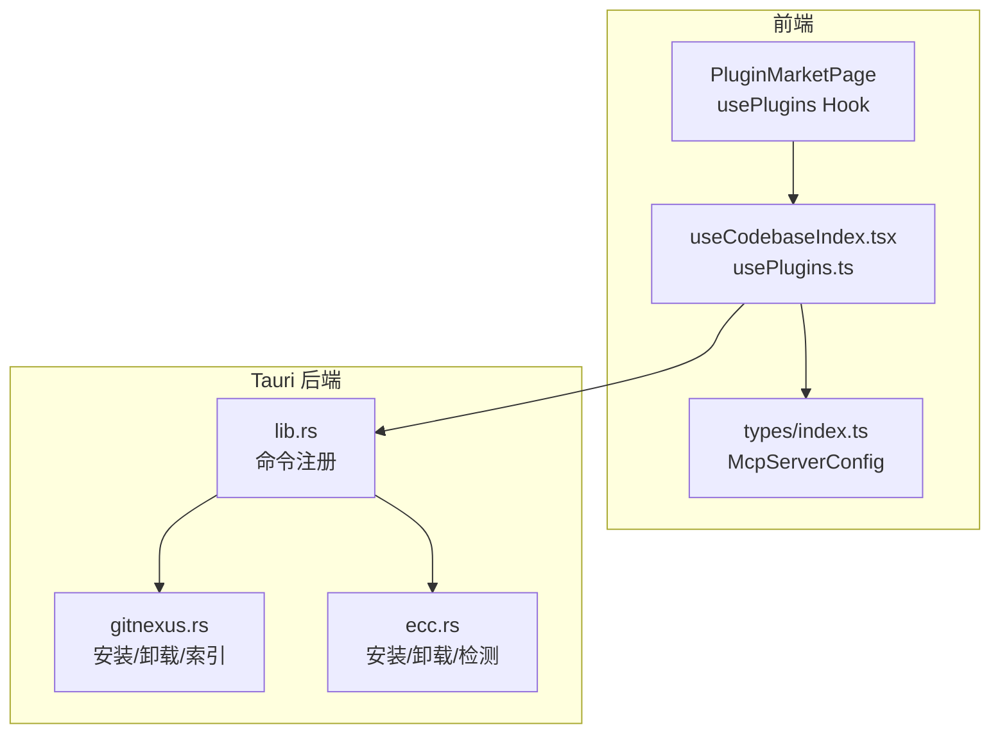
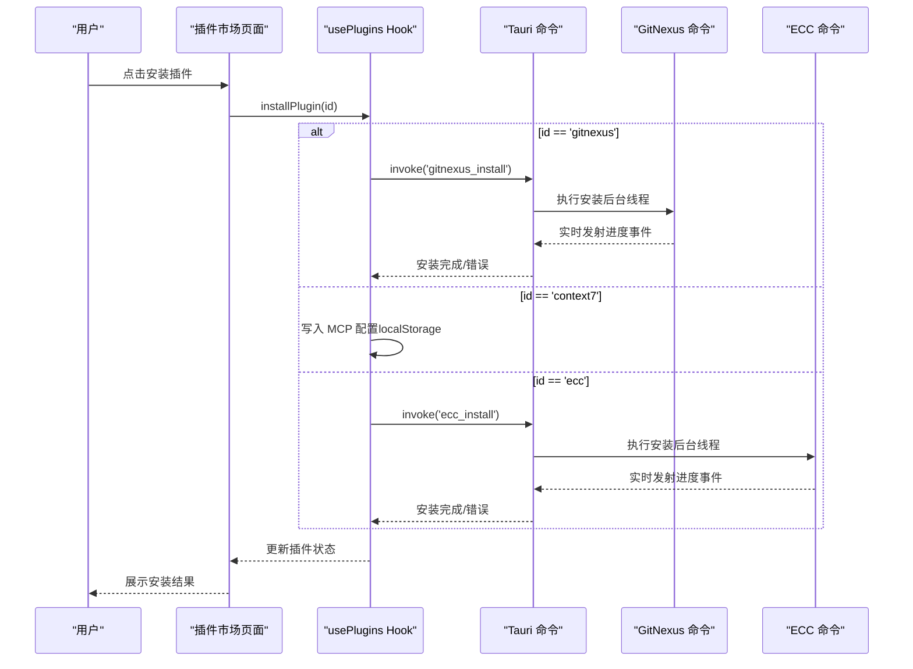
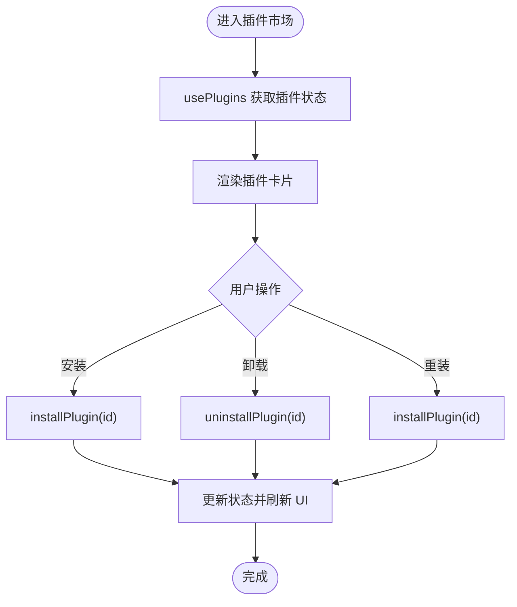
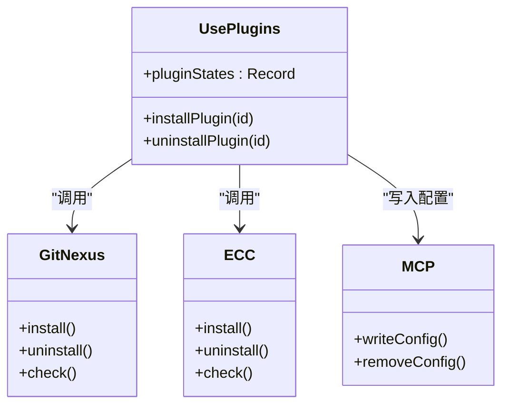
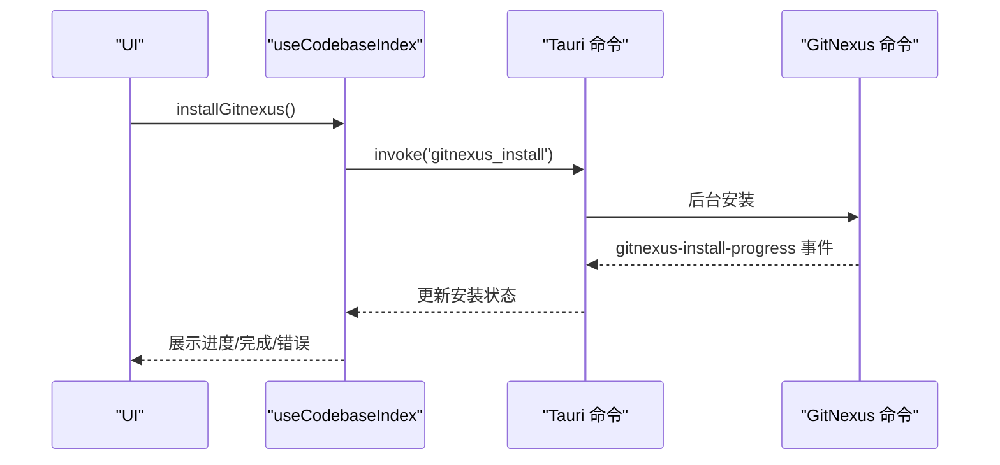
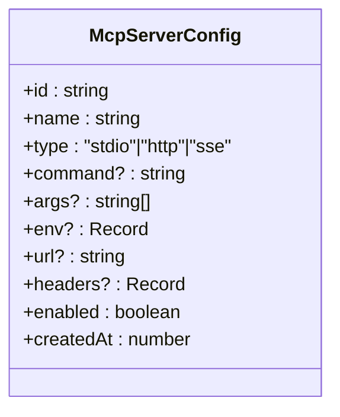
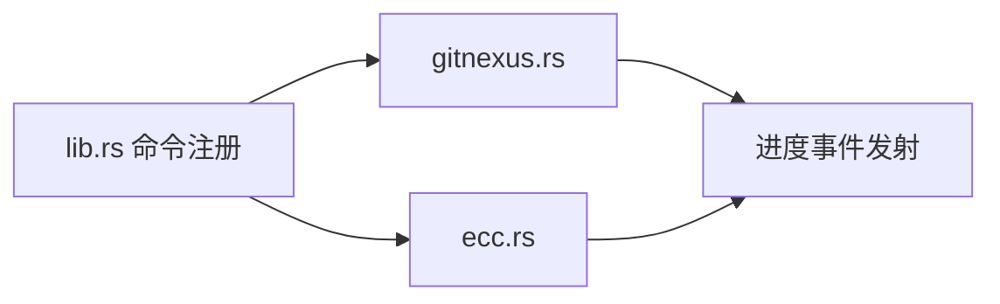
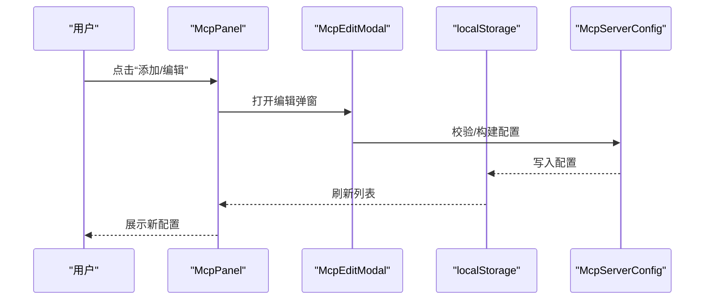
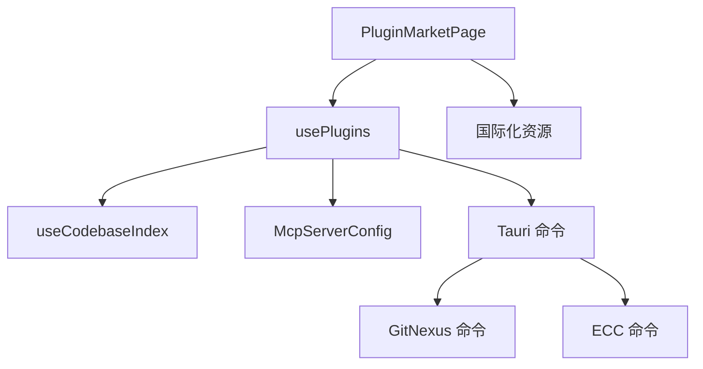

# 插件系统

<cite>
**本文引用的文件**
- [src/main.tsx](file://src/main.tsx)
- [src/App.tsx](file://src/App.tsx)
- [src/components/PluginMarketPage.tsx](file://src/components/PluginMarketPage.tsx)
- [src/hooks/usePlugins.ts](file://src/hooks/usePlugins.ts)
- [src/hooks/useCodebaseIndex.tsx](file://src/hooks/useCodebaseIndex.tsx)
- [src/types/index.ts](file://src/types/index.ts)
- [src-tauri/src/lib.rs](file://src-tauri/src/lib.rs)
- [src-tauri/src/gitnexus.rs](file://src-tauri/src/gitnexus.rs)
- [src-tauri/src/ecc.rs](file://src-tauri/src/ecc.rs)
- [src/components/settings/McpPanel.tsx](file://src/components/settings/McpPanel.tsx)
- [src/components/settings/McpEditModal.tsx](file://src/components/settings/McpEditModal.tsx)
- [src/i18n/locales/zh.ts](file://src/i18n/locales/zh.ts)
</cite>

## 目录
1. [简介](#简介)
2. [项目结构](#项目结构)
3. [核心组件](#核心组件)
4. [架构总览](#架构总览)
5. [详细组件分析](#详细组件分析)
6. [依赖关系分析](#依赖关系分析)
7. [性能考量](#性能考量)
8. [故障排查指南](#故障排查指南)
9. [结论](#结论)
10. [附录](#附录)

## 简介
本文件系统性阐述 RabbitCoding 的插件体系：包括插件架构设计、插件市场实现、安装与卸载流程、生命周期管理、接口规范以及与核心功能（代码库索引、MCP 服务器、侧车进程）的集成方式。文档面向开发者与高级用户，既提供高层概览，也给出代码级的可视化与流程图，帮助快速理解与扩展。

## 项目结构
RabbitCoding 的插件系统由前端 React 组件与 Tauri 后端命令共同构成：
- 前端负责 UI、状态管理与事件监听，通过 Tauri invoke 调用后端命令。
- 后端（Rust）提供插件安装/卸载、状态检测、事件发射等能力。
- 插件市场页面统一展示与管理内置插件（GitNexus、Context7、ECC）。

**图表来源**
- [src/components/PluginMarketPage.tsx](file://src/components/PluginMarketPage.tsx)
- [src/hooks/usePlugins.ts](file://src/hooks/usePlugins.ts)
- [src/hooks/useCodebaseIndex.tsx](file://src/hooks/useCodebaseIndex.tsx)
- [src/types/index.ts](file://src/types/index.ts)
- [src-tauri/src/lib.rs](file://src-tauri/src/lib.rs)
- [src-tauri/src/gitnexus.rs](file://src-tauri/src/gitnexus.rs)
- [src-tauri/src/ecc.rs](file://src-tauri/src/ecc.rs)

**章节来源**
- [src/main.tsx](file://src/main.tsx)
- [src/App.tsx](file://src/App.tsx)
- [src/components/PluginMarketPage.tsx](file://src/components/PluginMarketPage.tsx)
- [src/hooks/usePlugins.ts](file://src/hooks/usePlugins.ts)
- [src/hooks/useCodebaseIndex.tsx](file://src/hooks/useCodebaseIndex.tsx)
- [src/types/index.ts](file://src/types/index.ts)
- [src-tauri/src/lib.rs](file://src-tauri/src/lib.rs)
- [src-tauri/src/gitnexus.rs](file://src-tauri/src/gitnexus.rs)
- [src-tauri/src/ecc.rs](file://src-tauri/src/ecc.rs)

## 核心组件
- 插件市场页面：展示插件卡片、安装/卸载/重装按钮、错误与进度提示。
- 插件状态钩子：集中管理插件安装状态、监听后端事件、封装安装/卸载逻辑。
- 代码库索引钩子：提供 GitNexus 安装检测、进度事件监听、批量同步工作区。
- 类型系统：统一 MCP 服务器配置结构，支撑插件生态中的外部服务接入。
- 后端命令：提供插件安装/卸载、状态检测、事件发射等能力。

**章节来源**
- [src/components/PluginMarketPage.tsx](file://src/components/PluginMarketPage.tsx)
- [src/hooks/usePlugins.ts](file://src/hooks/usePlugins.ts)
- [src/hooks/useCodebaseIndex.tsx](file://src/hooks/useCodebaseIndex.tsx)
- [src/types/index.ts](file://src/types/index.ts)
- [src-tauri/src/lib.rs](file://src-tauri/src/lib.rs)

## 架构总览
插件系统采用“前端 UI + Hook 状态机 + Tauri 命令”的分层架构：
- 前端通过 usePlugins 统一调度插件安装/卸载，useCodebaseIndex 管理 GitNexus 生命周期。
- 后端通过命令暴露安装/卸载、状态检测、事件发射能力，确保安装过程可观测、可回退。
- 插件市场页面作为入口，聚合插件状态并提供一键操作。

**图表来源**
- [src/components/PluginMarketPage.tsx](file://src/components/PluginMarketPage.tsx)
- [src/hooks/usePlugins.ts](file://src/hooks/usePlugins.ts)
- [src-tauri/src/gitnexus.rs](file://src-tauri/src/gitnexus.rs)
- [src-tauri/src/ecc.rs](file://src-tauri/src/ecc.rs)

## 详细组件分析

### 插件市场页面（PluginMarketPage）
- 负责展示插件列表、Tab（市场/已安装）、插件卡片与操作按钮。
- 通过 usePlugins 获取插件状态与安装/卸载方法，驱动 UI 行为。
- 支持安装中实时日志与错误提示，提升用户体验。

**图表来源**
- [src/components/PluginMarketPage.tsx](file://src/components/PluginMarketPage.tsx)
- [src/hooks/usePlugins.ts](file://src/hooks/usePlugins.ts)

**章节来源**
- [src/components/PluginMarketPage.tsx](file://src/components/PluginMarketPage.tsx)
- [src/hooks/usePlugins.ts](file://src/hooks/usePlugins.ts)

### 插件状态钩子（usePlugins）
- 统一管理插件安装状态、监听后端事件、封装安装/卸载逻辑。
- 内置插件包括：GitNexus、Context7、ECC。
- GitNexus 通过 useCodebaseIndex 提供安装检测与进度事件；ECC 通过后端命令安装并监听进度；Context7 通过写入 MCP 配置实现“安装”。

**图表来源**
- [src/hooks/usePlugins.ts](file://src/hooks/usePlugins.ts)
- [src-tauri/src/gitnexus.rs](file://src-tauri/src/gitnexus.rs)
- [src-tauri/src/ecc.rs](file://src-tauri/src/ecc.rs)
- [src/types/index.ts](file://src/types/index.ts)

**章节来源**
- [src/hooks/usePlugins.ts](file://src/hooks/usePlugins.ts)
- [src/types/index.ts](file://src/types/index.ts)

### 代码库索引钩子（useCodebaseIndex）
- 管理 GitNexus 安装检测、索引进度事件监听、工作区同步。
- 提供 installGitnexus、triggerIndex、syncWorkspace、refreshStatus 等能力。
- 与插件市场联动，统一展示安装进度与错误信息。

**图表来源**
- [src/hooks/useCodebaseIndex.tsx](file://src/hooks/useCodebaseIndex.tsx)
- [src-tauri/src/gitnexus.rs](file://src-tauri/src/gitnexus.rs)

**章节来源**
- [src/hooks/useCodebaseIndex.tsx](file://src/hooks/useCodebaseIndex.tsx)
- [src-tauri/src/gitnexus.rs](file://src-tauri/src/gitnexus.rs)

### 类型系统与 MCP 配置
- McpServerConfig 定义了 MCP 服务器的通用配置结构，支持 stdio/http/sse 三种传输类型。
- 插件生态可通过 MCP 配置接入外部服务，实现工具/技能扩展。

**图表来源**
- [src/types/index.ts](file://src/types/index.ts)

**章节来源**
- [src/types/index.ts](file://src/types/index.ts)

### 后端命令与插件实现
- lib.rs 注册所有命令，包括 GitNexus 与 ECC 的安装/卸载/检测命令。
- gitnexus.rs 提供安装/卸载/索引、进度事件发射、组同步等能力。
- ecc.rs 提供安装/卸载/ECC 检测、进度事件发射等能力。

**图表来源**
- [src-tauri/src/lib.rs](file://src-tauri/src/lib.rs)
- [src-tauri/src/gitnexus.rs](file://src-tauri/src/gitnexus.rs)
- [src-tauri/src/ecc.rs](file://src-tauri/src/ecc.rs)

**章节来源**
- [src-tauri/src/lib.rs](file://src-tauri/src/lib.rs)
- [src-tauri/src/gitnexus.rs](file://src-tauri/src/gitnexus.rs)
- [src-tauri/src/ecc.rs](file://src-tauri/src/ecc.rs)

### 第三方插件支持与 MCP 集成
- 通过 McpPanel 与 McpEditModal 管理 MCP 服务器配置，支持新增/编辑/删除/启用切换。
- 插件生态可通过 MCP 接入外部工具与服务，实现能力扩展。

**图表来源**
- [src/components/settings/McpPanel.tsx](file://src/components/settings/McpPanel.tsx)
- [src/components/settings/McpEditModal.tsx](file://src/components/settings/McpEditModal.tsx)
- [src/types/index.ts](file://src/types/index.ts)

**章节来源**
- [src/components/settings/McpPanel.tsx](file://src/components/settings/McpPanel.tsx)
- [src/components/settings/McpEditModal.tsx](file://src/components/settings/McpEditModal.tsx)
- [src/types/index.ts](file://src/types/index.ts)

## 依赖关系分析
- 前端依赖 Tauri invoke 与事件监听，后端通过命令暴露能力。
- 插件状态钩子依赖类型系统与本地存储（localStorage）。
- 插件市场页面依赖国际化资源与插件状态钩子。
- 后端命令依赖事件发射与后台线程，保证安装过程可观测。

**图表来源**
- [src/components/PluginMarketPage.tsx](file://src/components/PluginMarketPage.tsx)
- [src/hooks/usePlugins.ts](file://src/hooks/usePlugins.ts)
- [src/hooks/useCodebaseIndex.tsx](file://src/hooks/useCodebaseIndex.tsx)
- [src/types/index.ts](file://src/types/index.ts)
- [src-tauri/src/lib.rs](file://src-tauri/src/lib.rs)
- [src-tauri/src/gitnexus.rs](file://src-tauri/src/gitnexus.rs)
- [src-tauri/src/ecc.rs](file://src-tauri/src/ecc.rs)
- [src/i18n/locales/zh.ts](file://src/i18n/locales/zh.ts)

**章节来源**
- [src/components/PluginMarketPage.tsx](file://src/components/PluginMarketPage.tsx)
- [src/hooks/usePlugins.ts](file://src/hooks/usePlugins.ts)
- [src/hooks/useCodebaseIndex.tsx](file://src/hooks/useCodebaseIndex.tsx)
- [src/types/index.ts](file://src/types/index.ts)
- [src-tauri/src/lib.rs](file://src-tauri/src/lib.rs)
- [src-tauri/src/gitnexus.rs](file://src-tauri/src/gitnexus.rs)
- [src-tauri/src/ecc.rs](file://src-tauri/src/ecc.rs)
- [src/i18n/locales/zh.ts](file://src/i18n/locales/zh.ts)

## 性能考量
- 安装过程采用后台线程与事件发射，避免阻塞 UI。
- 插件状态与进度通过事件驱动更新，减少重复渲染。
- GitNexus 安装时通过环境变量与内置 Node/NPM，避免系统依赖带来的性能波动。
- MCP 配置存储于本地，读写开销低，便于快速切换与启用。

## 故障排查指南
- 安装失败：检查后端命令返回的错误信息与进度事件，定位 npm 安装阶段的问题。
- 进度不更新：确认事件监听是否正确注册，以及后端命令是否正常发射事件。
- GitNexus 未安装：通过检测命令确认安装状态，必要时重新安装。
- ECC 卸载残留：检查用户主目录下的相关目录与文件，手动清理后重试。

**章节来源**
- [src/hooks/usePlugins.ts](file://src/hooks/usePlugins.ts)
- [src/hooks/useCodebaseIndex.tsx](file://src/hooks/useCodebaseIndex.tsx)
- [src-tauri/src/gitnexus.rs](file://src-tauri/src/gitnexus.rs)
- [src-tauri/src/ecc.rs](file://src-tauri/src/ecc.rs)

## 结论
RabbitCoding 的插件系统以清晰的前后端职责划分、统一的类型系统与事件驱动机制为核心，实现了插件的安装、卸载、状态管理与生态扩展。通过插件市场页面与 Hook 状态机，用户可以直观地管理内置插件；通过 MCP 配置，第三方能力得以无缝接入。建议在扩展新插件时遵循现有接口规范与事件约定，确保一致性与可观测性。

## 附录
- 插件开发最佳实践
  - 使用统一的安装/卸载命令与事件发射，保证 UI 体验一致。
  - 通过类型系统约束配置结构，避免运行时错误。
  - 将安装过程放入后台线程，实时发射进度事件，提升可观测性。
  - 对第三方插件，优先通过 MCP 配置接入，降低耦合度。
- 安全与性能
  - 安装过程避免直接依赖系统环境，优先使用内置 Node/NPM。
  - 对外部命令与网络请求进行超时与重试控制。
  - 对用户输入进行严格校验，防止注入与误配置。