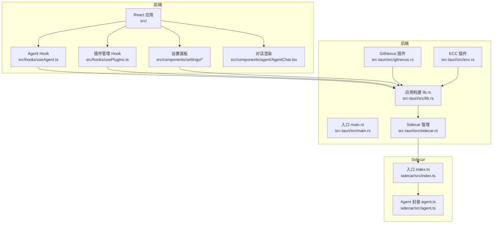
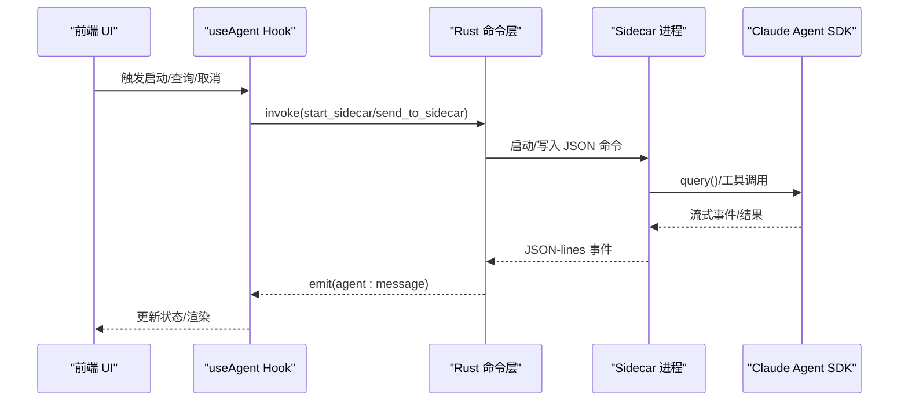
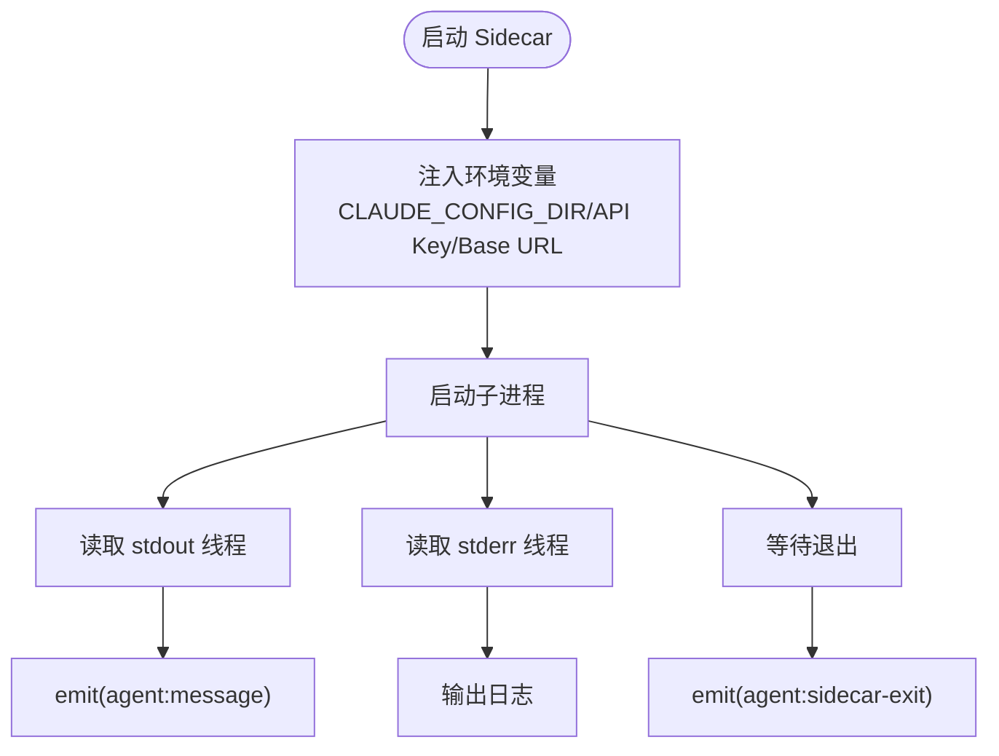
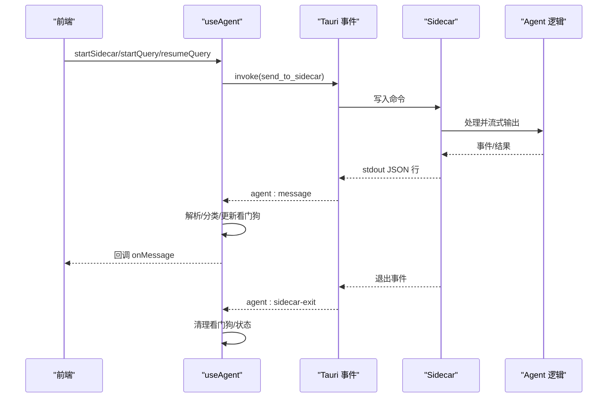
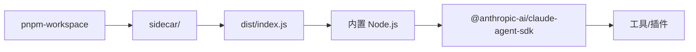
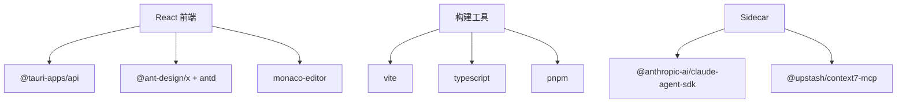

# 插件集成方式

<cite>
**本文档引用的文件**
- [src-tauri/src/lib.rs](file://src-tauri/src/lib.rs)
- [src-tauri/src/main.rs](file://src-tauri/src/main.rs)
- [src-tauri/src/sidecar.rs](file://src-tauri/src/sidecar.rs)
- [src-tauri/src/gitnexus.rs](file://src-tauri/src/gitnexus.rs)
- [src-tauri/src/ecc.rs](file://src-tauri/src/ecc.rs)
- [sidecar/src/index.ts](file://sidecar/src/index.ts)
- [sidecar/src/agent.ts](file://sidecar/src/agent.ts)
- [src/hooks/usePlugins.ts](file://src/hooks/usePlugins.ts)
- [src/hooks/useAgent.ts](file://src/hooks/useAgent.ts)
- [src/types/index.ts](file://src/types/index.ts)
- [src/components/settings/McpPanel.tsx](file://src/components/settings/McpPanel.tsx)
- [src/components/settings/SettingsPage.tsx](file://src/components/settings/SettingsPage.tsx)
- [src/components/agent/AgentChat.tsx](file://src/components/agent/AgentChat.tsx)
- [package.json](file://package.json)
</cite>

## 目录
1. [简介](#简介)
2. [项目结构](#项目结构)
3. [核心组件](#核心组件)
4. [架构总览](#架构总览)
5. [详细组件分析](#详细组件分析)
6. [依赖关系分析](#依赖关系分析)
7. [性能考虑](#性能考虑)
8. [故障排查指南](#故障排查指南)
9. [结论](#结论)
10. [附录](#附录)

## 简介
本文件面向 RabbitCoding 插件集成方式的技术实现，系统阐述插件与核心系统的集成机制，包括 IPC 通信、事件订阅、回调处理；插件加载策略、动态链接、模块化架构；插件间协作机制、资源共享与冲突解决；插件配置集成、设置同步与数据交换；扩展点定义、钩子机制与中间件支持；以及热重载、无缝更新与兼容性保障；并提供集成测试方法、性能监控与故障恢复机制。

## 项目结构
RabbitCoding 采用 Tauri + React 前端 + Node.js Sidecar 的混合架构：
- Rust 后端负责系统命令、进程管理、事件发射与数据库等核心能力
- Node.js Sidecar 通过标准输入输出与 Rust 交互，封装 Claude Agent SDK，提供插件与工具调用能力
- 前端 React 通过 Tauri IPC 与 Rust 通信，监听事件并渲染界面

图示来源
- [src-tauri/src/main.rs:1-7](file://src-tauri/src/main.rs#L1-L7)
- [src-tauri/src/lib.rs:196-390](file://src-tauri/src/lib.rs#L196-L390)
- [src-tauri/src/sidecar.rs:1-359](file://src-tauri/src/sidecar.rs#L1-L359)
- [sidecar/src/index.ts:1-145](file://sidecar/src/index.ts#L1-L145)
- [sidecar/src/agent.ts:1-606](file://sidecar/src/agent.ts#L1-L606)
- [src/hooks/useAgent.ts:1-334](file://src/hooks/useAgent.ts#L1-L334)
- [src/hooks/usePlugins.ts:1-195](file://src/hooks/usePlugins.ts#L1-L195)

章节来源
- [src-tauri/src/main.rs:1-7](file://src-tauri/src/main.rs#L1-L7)
- [src-tauri/src/lib.rs:196-390](file://src-tauri/src/lib.rs#L196-L390)
- [src-tauri/src/sidecar.rs:1-359](file://src-tauri/src/sidecar.rs#L1-L359)
- [sidecar/src/index.ts:1-145](file://sidecar/src/index.ts#L1-L145)
- [sidecar/src/agent.ts:1-606](file://sidecar/src/agent.ts#L1-L606)
- [src/hooks/useAgent.ts:1-334](file://src/hooks/useAgent.ts#L1-L334)
- [src/hooks/usePlugins.ts:1-195](file://src/hooks/usePlugins.ts#L1-L195)

## 核心组件
- Rust 应用构建与命令注册：集中注册所有 Tauri 命令与插件，初始化数据库、窗口状态、Node.js 运行时注入与侧车进程管理
- Sidecar 进程管理：启动/停止/查询 Sidecar 状态，转发 JSON-lines 命令，接收流式事件
- Agent 通信层：前端通过 useAgent Hook 与 Sidecar 交互，监听 agent:message 与 agent:sidecar-exit 事件
- 插件管理：usePlugins Hook 管理 GitNexus、Context7、ECC 插件的安装/卸载与状态同步
- MCP 服务配置：前端设置面板持久化 MCP Server 配置，支持 stdio/http/sse 三种传输
- 类型系统：统一前后端消息类型定义，确保 IPC 一致性

章节来源
- [src-tauri/src/lib.rs:196-390](file://src-tauri/src/lib.rs#L196-L390)
- [src-tauri/src/sidecar.rs:1-359](file://src-tauri/src/sidecar.rs#L1-L359)
- [src/hooks/useAgent.ts:1-334](file://src/hooks/useAgent.ts#L1-L334)
- [src/hooks/usePlugins.ts:1-195](file://src/hooks/usePlugins.ts#L1-L195)
- [src/types/index.ts:1-733](file://src/types/index.ts#L1-L733)

## 架构总览
RabbitCoding 的插件集成采用“IPC + 事件驱动 + 进程隔离”的架构：
- 前端通过 Tauri IPC 调用 Rust 命令，Rust 通过子进程管理 Sidecar
- Sidecar 以 JSON-lines 协议与 Rust 通信，将 Claude Agent SDK 的流式事件转换为结构化消息
- 前端监听事件并渲染，同时通过 usePlugins 与 useAgent 管理插件与对话生命周期

图示来源
- [src/hooks/useAgent.ts:103-256](file://src/hooks/useAgent.ts#L103-L256)
- [src-tauri/src/sidecar.rs:60-243](file://src-tauri/src/sidecar.rs#L60-L243)
- [sidecar/src/index.ts:37-91](file://sidecar/src/index.ts#L37-L91)
- [sidecar/src/agent.ts:320-465](file://sidecar/src/agent.ts#L320-L465)

## 详细组件分析

### Sidecar 进程与 IPC 通信
- 启动流程：Rust 通过 Command 启动 Sidecar，注入 CLAUDE_CONFIG_DIR、API Key、Base URL、自定义环境变量等
- 通信协议：stdin 写入 JSON 命令，stdout 逐行输出 JSON 事件，stderr 输出日志
- 事件分发：Rust 读取 stdout，将每行 JSON 通过 Tauri 事件 agent:message 发送给前端
- 健壮性：stderr 线程输出日志；进程退出时发送 agent:sidecar-exit 事件

图示来源
- [src-tauri/src/sidecar.rs:60-243](file://src-tauri/src/sidecar.rs#L60-L243)
- [sidecar/src/index.ts:96-144](file://sidecar/src/index.ts#L96-L144)

章节来源
- [src-tauri/src/sidecar.rs:1-359](file://src-tauri/src/sidecar.rs#L1-L359)
- [sidecar/src/index.ts:1-145](file://sidecar/src/index.ts#L1-L145)

### Agent 事件订阅与回调处理
- 事件订阅：useAgent 在挂载时注册 agent:message 与 agent:sidecar-exit 事件监听
- 消息解析：将 JSON 字符串解析为 AgentEvent，按消息类型更新看门狗与思考态
- 超时保护：为每条 query 维护独立计时器，思考态使用更宽松阈值，避免误判
- 回调处理：通过 onMessage/onSidecarExit/onQueryTimeout 回调向 UI 传递状态

图示来源
- [src/hooks/useAgent.ts:262-320](file://src/hooks/useAgent.ts#L262-L320)
- [src-tauri/src/sidecar.rs:175-208](file://src-tauri/src/sidecar.rs#L175-L208)
- [sidecar/src/agent.ts:146-465](file://sidecar/src/agent.ts#L146-L465)

章节来源
- [src/hooks/useAgent.ts:1-334](file://src/hooks/useAgent.ts#L1-L334)
- [src/types/index.ts:78-283](file://src/types/index.ts#L78-L283)

### 插件加载策略与动态链接
- GitNexus：内置 Node.js 与 npm，安装到应用私有前缀，避免系统依赖；通过命令行调用 CLI，后台线程实时 emit 进度事件
- ECC：检测用户家目录下的 Claude 配置目录，支持一键安装/卸载；通过 npx 命令安装到指定目标
- Context7：通过 MCP Server 配置以 stdio 方式运行，前端直接写入 localStorage

图示来源
- [src-tauri/src/gitnexus.rs:180-311](file://src-tauri/src/gitnexus.rs#L180-L311)
- [src-tauri/src/ecc.rs:202-290](file://src-tauri/src/ecc.rs#L202-L290)
- [src/hooks/usePlugins.ts:124-158](file://src/hooks/usePlugins.ts#L124-L158)

章节来源
- [src-tauri/src/gitnexus.rs:1-761](file://src-tauri/src/gitnexus.rs#L1-L761)
- [src-tauri/src/ecc.rs:1-355](file://src-tauri/src/ecc.rs#L1-L355)
- [src/hooks/usePlugins.ts:1-195](file://src/hooks/usePlugins.ts#L1-L195)

### 插件间协作、资源共享与冲突解决
- 资源隔离：Sidecar 通过 CLAUDE_CONFIG_DIR 将 Claude 配置根目录重定向至应用私有目录，阻断全局资源泄漏
- 环境变量清理：启动前移除从父进程继承的 ANTHROPIC_* 环境变量，确保 BYOK 注入优先
- MCP 服务：前端通过 McpPanel 管理多路 MCP Server，按 enabled 状态启用；Context7 通过 stdio 直接运行
- 冲突处理：AskUserQuestion 采用 requestId 管理，超时与取消通过 AbortController 与定时器协同处理

章节来源
- [src-tauri/src/sidecar.rs:96-150](file://src-tauri/src/sidecar.rs#L96-L150)
- [src-tauri/src/sidecar.rs:117-131](file://src-tauri/src/sidecar.rs#L117-L131)
- [src/components/settings/McpPanel.tsx:1-155](file://src/components/settings/McpPanel.tsx#L1-155)
- [sidecar/src/agent.ts:500-573](file://sidecar/src/agent.ts#L500-L573)

### 插件配置集成、设置同步与数据交换
- 配置存储：MCP Server 配置存储在 localStorage；插件状态通过 usePlugins 管理
- 设置同步：SettingsPage 提供统一设置入口，McpPanel 展示与编辑配置
- 数据交换：前端通过 invoke 与 Rust 通信，Rust 通过事件向前端推送进度与状态

章节来源
- [src/components/settings/McpPanel.tsx:1-155](file://src/components/settings/McpPanel.tsx#L1-155)
- [src/components/settings/SettingsPage.tsx:1-228](file://src/components/settings/SettingsPage.tsx#L1-L228)
- [src/hooks/usePlugins.ts:1-195](file://src/hooks/usePlugins.ts#L1-L195)

### 扩展点定义、钩子机制与中间件支持
- 扩展点：MCP Server（stdio/http/sse），WriteSpec 工具，AskUserQuestion 钩子
- 钩子机制：Agent 侧通过 canUseTool 钩子拦截与放行工具调用，支持自定义行为
- 中间件：Sidecar 通过 MCP 服务器提供工具中间件能力，支持外部工具接入

章节来源
- [sidecar/src/agent.ts:260-312](file://sidecar/src/agent.ts#L260-L312)
- [sidecar/src/agent.ts:84-135](file://sidecar/src/agent.ts#L84-L135)
- [src/types/index.ts:414-451](file://src/types/index.ts#L414-L451)

### 热重载、无缝更新与兼容性保证
- 热重载：Sidecar 开发模式支持 tsx 直接运行或编译后 dist 执行；生产模式使用内置 Node.js 运行打包脚本
- 无缝更新：Rust 启动时注入 PATH 与 NPM_CONFIG_PREFIX，确保 npx 与 npm 全局安装的 CLI 可用
- 兼容性：Rust 通过 CLAUDE_CONFIG_DIR 隔离配置，避免系统环境变量影响；前端类型系统统一消息格式

章节来源
- [src-tauri/src/sidecar.rs:287-358](file://src-tauri/src/sidecar.rs#L287-L358)
- [src-tauri/src/lib.rs:226-283](file://src-tauri/src/lib.rs#L226-L283)
- [src/types/index.ts:78-283](file://src/types/index.ts#L78-L283)

## 依赖关系分析
- 前端依赖：@tauri-apps/api、@ant-design/x、antd、monaco-editor 等
- 插件生态：@anthropic-ai/claude-agent-sdk、@upstash/context7-mcp、ecc-install 等
- 构建工具：Vite、TypeScript、pnpm

图示来源
- [package.json:14-44](file://package.json#L14-L44)
- [sidecar/src/agent.ts:12](file://sidecar/src/agent.ts#L12)

章节来源
- [package.json:1-46](file://package.json#L1-L46)

## 性能考虑
- 事件流式处理：Sidecar 通过 JSON-lines 逐行输出，前端按消息增量渲染，降低内存峰值
- 进程隔离：插件运行在独立子进程中，避免前端阻塞
- 看门狗机制：为每条 query 维护独立计时器，思考态放宽阈值，提升稳定性
- 资源隔离：通过 CLAUDE_CONFIG_DIR 与环境变量清理，减少不必要的 IO 与配置解析

## 故障排查指南
- Sidecar 未启动：检查 start_sidecar 返回值与 agent:sidecar-exit 事件
- 无事件流：确认 stdout 读取线程是否正常，stderr 日志是否输出
- 插件安装失败：查看 gitnexus/ecc 的进度事件与错误详情
- MCP 配置无效：确认 enabled 状态与传输类型匹配

章节来源
- [src/hooks/useAgent.ts:290-296](file://src/hooks/useAgent.ts#L290-L296)
- [src-tauri/src/gitnexus.rs:210-308](file://src-tauri/src/gitnexus.rs#L210-L308)
- [src-tauri/src/ecc.rs:205-289](file://src-tauri/src/ecc.rs#L205-L289)

## 结论
RabbitCoding 的插件集成以 IPC 与事件驱动为核心，结合进程隔离与资源重定向，实现了稳定、可扩展的插件体系。通过统一的类型系统与 Hook 机制，前端能够高效地管理 Sidecar 生命周期与插件状态，满足复杂场景下的协作与扩展需求。

## 附录
- 术语
  - IPC：进程间通信
  - MCP：Model Context Protocol
  - BYOK：Bring Your Own Key
- 参考路径
  - [src-tauri/src/lib.rs](file://src-tauri/src/lib.rs)
  - [src-tauri/src/sidecar.rs](file://src-tauri/src/sidecar.rs)
  - [sidecar/src/index.ts](file://sidecar/src/index.ts)
  - [sidecar/src/agent.ts](file://sidecar/src/agent.ts)
  - [src/hooks/useAgent.ts](file://src/hooks/useAgent.ts)
  - [src/hooks/usePlugins.ts](file://src/hooks/usePlugins.ts)
  - [src/types/index.ts](file://src/types/index.ts)
  - [src/components/settings/McpPanel.tsx](file://src/components/settings/McpPanel.tsx)
  - [src/components/settings/SettingsPage.tsx](file://src/components/settings/SettingsPage.tsx)
  - [src/components/agent/AgentChat.tsx](file://src/components/agent/AgentChat.tsx)
  - [package.json](file://package.json)