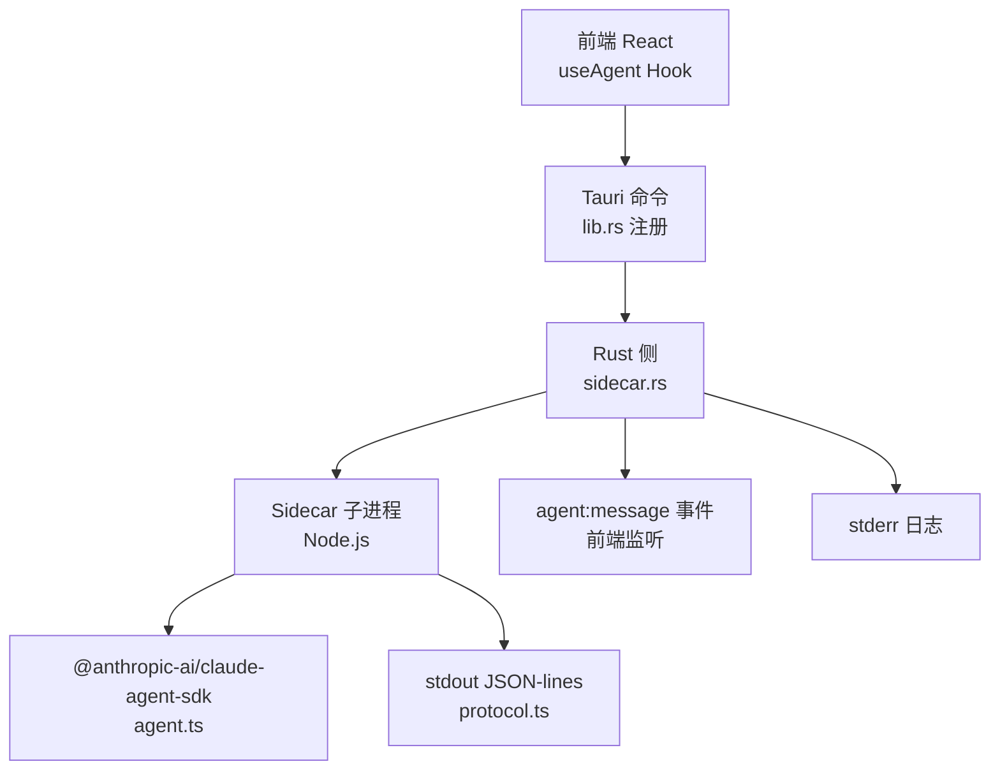
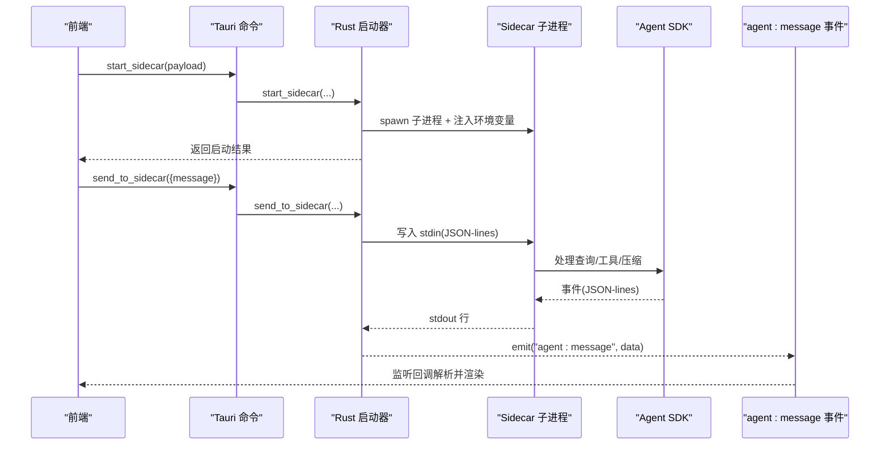
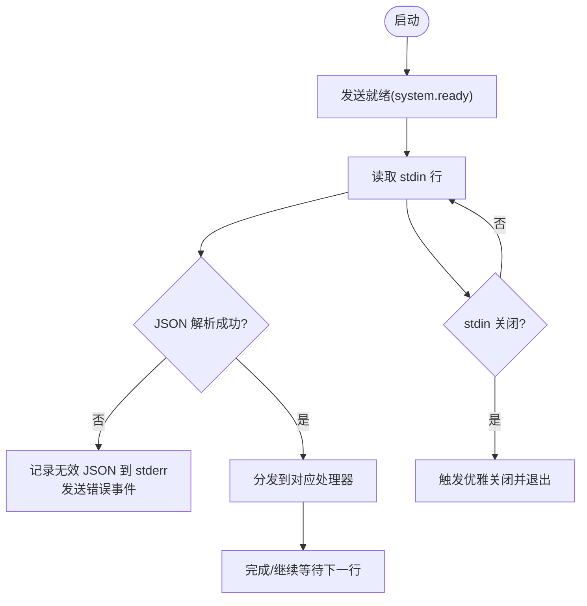
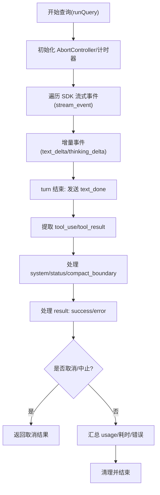
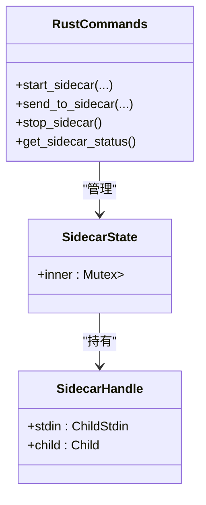
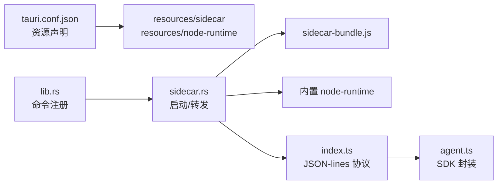
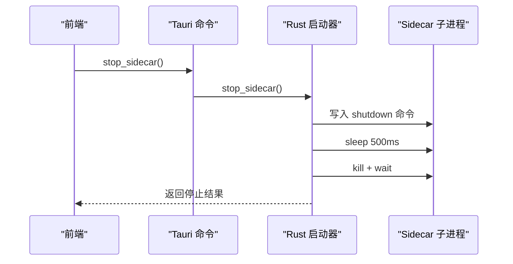

# Sidecar 进程问题

<cite>
**本文引用的文件**
- [sidecar/src/index.ts](file://sidecar/src/index.ts)
- [sidecar/src/agent.ts](file://sidecar/src/agent.ts)
- [sidecar/src/protocol.ts](file://sidecar/src/protocol.ts)
- [src-tauri/src/sidecar.rs](file://src-tauri/src/sidecar.rs)
- [src-tauri/src/lib.rs](file://src-tauri/src/lib.rs)
- [src-tauri/src/main.rs](file://src-tauri/src/main.rs)
- [src/hooks/useAgent.ts](file://src/hooks/useAgent.ts)
- [src-tauri/tauri.conf.json](file://src-tauri/tauri.conf.json)
- [sidecar/package.json](file://sidecar/package.json)
- [sidecar/tsconfig.json](file://sidecar/tsconfig.json)
</cite>

## 目录
1. [简介](#简介)
2. [项目结构](#项目结构)
3. [核心组件](#核心组件)
4. [架构总览](#架构总览)
5. [详细组件分析](#详细组件分析)
6. [依赖关系分析](#依赖关系分析)
7. [性能考量](#性能考量)
8. [故障排除指南](#故障排除指南)
9. [结论](#结论)
10. [附录](#附录)

## 简介
本指南聚焦 RabbitCoding 中的 Sidecar 进程问题，涵盖启动失败、进程崩溃、通信中断、资源占用异常等场景的诊断与修复流程。文档基于实际源码实现，提供进程状态检查、日志分析、IPC 问题定位、资源监控与异常恢复策略，并给出重启与监控配置建议。

## 项目结构
RabbitCoding 的 Sidecar 采用“前端（React + Tauri）↔ Rust 后端（Tauri 命令）↔ Node.js Sidecar（JSON-lines 协议）”三层架构：
- 前端通过 Tauri 命令调用 Rust 后端，Rust 后端负责启动/管理 Sidecar 子进程，并转发 stdout/stderr。
- Sidecar 通过 stdin 读取 JSON-lines 命令，处理查询、工具调用、会话压缩等，通过 stdout 输出 JSON-lines 事件。
- 协议层定义了命令与事件的类型，确保跨语言边界的数据一致性。

图表来源
- [src-tauri/src/lib.rs:344-387](file://src-tauri/src/lib.rs#L344-L387)
- [src-tauri/src/sidecar.rs:60-214](file://src-tauri/src/sidecar.rs#L60-L214)
- [sidecar/src/index.ts:96-128](file://sidecar/src/index.ts#L96-L128)
- [sidecar/src/agent.ts:241-465](file://sidecar/src/agent.ts#L241-L465)
- [sidecar/src/protocol.ts:13-78](file://sidecar/src/protocol.ts#L13-L78)

章节来源
- [src-tauri/src/lib.rs:344-387](file://src-tauri/src/lib.rs#L344-L387)
- [src-tauri/src/sidecar.rs:60-214](file://src-tauri/src/sidecar.rs#L60-L214)
- [sidecar/src/index.ts:96-128](file://sidecar/src/index.ts#L96-L128)
- [sidecar/src/agent.ts:241-465](file://sidecar/src/agent.ts#L241-L465)
- [sidecar/src/protocol.ts:13-78](file://sidecar/src/protocol.ts#L13-L78)

## 核心组件
- Sidecar 入口与命令循环：负责读取 stdin JSON-lines 命令、分发到对应处理器、向 stdout 输出事件、向 stderr 输出日志。
- Agent SDK 封装：将 SDK 的异步生成器转换为 JSON-lines 流式事件，处理工具调用、会话压缩、取消与错误上报。
- 协议定义：统一前后端消息类型，包括查询命令、系统事件、工具调用、结果与错误等。
- Rust 启动器：管理 Sidecar 子进程生命周期，注入环境变量与配置目录，转发 stdout/stderr 到前端事件。

章节来源
- [sidecar/src/index.ts:1-145](file://sidecar/src/index.ts#L1-L145)
- [sidecar/src/agent.ts:1-606](file://sidecar/src/agent.ts#L1-L606)
- [sidecar/src/protocol.ts:1-252](file://sidecar/src/protocol.ts#L1-L252)
- [src-tauri/src/sidecar.rs:1-359](file://src-tauri/src/sidecar.rs#L1-L359)

## 架构总览
下图展示从前端发起查询到 Sidecar 返回事件的完整链路，以及 Rust 后端对子进程的管理与事件转发。

图表来源
- [src-tauri/src/sidecar.rs:60-214](file://src-tauri/src/sidecar.rs#L60-L214)
- [sidecar/src/index.ts:104-127](file://sidecar/src/index.ts#L104-L127)
- [sidecar/src/agent.ts:241-465](file://sidecar/src/agent.ts#L241-L465)
- [src/hooks/useAgent.ts:265-296](file://src/hooks/useAgent.ts#L265-L296)

章节来源
- [src-tauri/src/sidecar.rs:60-214](file://src-tauri/src/sidecar.rs#L60-L214)
- [sidecar/src/index.ts:104-127](file://sidecar/src/index.ts#L104-L127)
- [sidecar/src/agent.ts:241-465](file://sidecar/src/agent.ts#L241-L465)
- [src/hooks/useAgent.ts:265-296](file://src/hooks/useAgent.ts#L265-L296)

## 详细组件分析

### Sidecar 入口与命令循环（index.ts）
- stdin 循环：逐行读取 JSON-lines，解析为命令后分发处理，异常时向 stderr 输出并返回错误事件。
- 事件输出：stdout 以 JSON-lines 输出事件；stderr 专门用于日志，不影响协议消息。
- 异常兜底：未捕获异常与未处理拒绝会在 stderr 输出错误并返回错误事件，主程序记录致命错误后退出。

图表来源
- [sidecar/src/index.ts:96-128](file://sidecar/src/index.ts#L96-L128)
- [sidecar/src/index.ts:131-144](file://sidecar/src/index.ts#L131-L144)

章节来源
- [sidecar/src/index.ts:1-145](file://sidecar/src/index.ts#L1-L145)

### Agent SDK 封装（agent.ts）
- 查询执行：封装 SDK 的异步生成器，将流式增量事件转换为 JSON-lines，同时处理工具调用、会话压缩、取消与错误。
- 工具调用：对 AskUserQuestion 进行前端交互，支持超时与取消；对 WriteSpec 工具进行特殊处理，写入 .rabbit/specs 并触发查询中止。
- 会话压缩：通过发送 /compact 触发 SDK 压缩，上报压缩状态与结果。
- 终态处理：区分用户取消与 SDK 抛错，分别返回成功或错误结果，并附带耗时与 token 使用统计。

图表来源
- [sidecar/src/agent.ts:241-465](file://sidecar/src/agent.ts#L241-L465)
- [sidecar/src/agent.ts:500-573](file://sidecar/src/agent.ts#L500-L573)

章节来源
- [sidecar/src/agent.ts:1-606](file://sidecar/src/agent.ts#L1-L606)

### 协议定义（protocol.ts）
- 前端→Sidecar 命令：start/resume/cancel/compact/respond/shutdown。
- Sidecar→前端事件：system/init、assistant 流式事件、tool_result、usage_update、compaction、result/error、ask_user_question、spec_written。
- 类型安全：通过 TypeScript 接口约束命令与事件，降低跨语言边界错误。

章节来源
- [sidecar/src/protocol.ts:13-78](file://sidecar/src/protocol.ts#L13-L78)
- [sidecar/src/protocol.ts:90-252](file://sidecar/src/protocol.ts#L90-L252)

### Rust 启动器（sidecar.rs）
- 进程管理：spawn 子进程，注入环境变量（API Key、Base URL、自定义变量），设置 CLAUDE_CONFIG_DIR 隔离配置。
- 事件转发：stdout 逐行读取并转发为 Tauri 事件；stderr 逐行输出到 eprintln。
- 命令接口：start_sidecar/send_to_sidecar/stop_sidecar/get_sidecar_status。
- 路径解析：开发模式直接运行 TS 源码或 dist；生产模式使用打包的 node-runtime 与 sidecar-bundle.js。

图表来源
- [src-tauri/src/sidecar.rs:6-57](file://src-tauri/src/sidecar.rs#L6-L57)
- [src-tauri/src/sidecar.rs:60-214](file://src-tauri/src/sidecar.rs#L60-L214)

章节来源
- [src-tauri/src/sidecar.rs:1-359](file://src-tauri/src/sidecar.rs#L1-L359)

## 依赖关系分析
- 构建与运行：前端通过 Tauri 命令调用 Rust 后端；Rust 后端根据配置选择运行方式（开发/生产）。
- Sidecar 依赖：Node.js 运行时、@anthropic-ai/claude-agent-sdk、zod；生产模式下依赖打包的 sidecar-bundle.js 与内置 node-runtime。
- 资源与路径：tauri.conf.json 声明资源目录 resources/sidecar 与 resources/node-runtime，Rust 后端在生产模式下从资源目录加载。

图表来源
- [src-tauri/tauri.conf.json:26-32](file://src-tauri/tauri.conf.json#L26-L32)
- [src-tauri/src/lib.rs:344-387](file://src-tauri/src/lib.rs#L344-L387)
- [src-tauri/src/sidecar.rs:287-358](file://src-tauri/src/sidecar.rs#L287-L358)
- [sidecar/package.json:8-8](file://sidecar/package.json#L8-L8)

章节来源
- [src-tauri/tauri.conf.json:26-32](file://src-tauri/tauri.conf.json#L26-L32)
- [src-tauri/src/lib.rs:344-387](file://src-tauri/src/lib.rs#L344-L387)
- [src-tauri/src/sidecar.rs:287-358](file://src-tauri/src/sidecar.rs#L287-L358)
- [sidecar/package.json:8-8](file://sidecar/package.json#L8-L8)

## 性能考量
- 流式输出：Agent SDK 事件通过增量事件推送，前端按流式渲染，减少一次性数据压力。
- 会话压缩：定期触发压缩可降低上下文占用，提升响应速度与稳定性。
- 超时与看门狗：前端为每条查询设置看门狗，正常态 10 分钟、思考态 30 分钟，避免静默卡死导致 UI 长时间挂起。
- 环境隔离：通过 CLAUDE_CONFIG_DIR 隔离全局配置，避免外部资源影响性能与稳定性。

章节来源
- [sidecar/src/agent.ts:146-199](file://sidecar/src/agent.ts#L146-L199)
- [src/hooks/useAgent.ts:67-95](file://src/hooks/useAgent.ts#L67-L95)

## 故障排除指南

### 一、启动失败
可能原因
- Rust 启动器无法 spawn 子进程（权限、路径、资源缺失）。
- 开发模式下 TS 源码不可用，tsx/npx 未安装或不可执行。
- 生产模式下 node-runtime 或 sidecar-bundle.js 未正确打包/放置。

排查步骤
1. 检查 Rust 启动器返回的错误信息（success=false 且 error 字段）。
2. 查看 stderr 日志（Rust 后端将 stderr 输出到 eprintln，前端也可在控制台看到）。
3. 确认 tauri.conf.json 中 resources/sidecar 与 resources/node-runtime 是否存在。
4. 开发模式：确认 sidecar/dist/index.js 或 npx/tsx 可用；生产模式：确认内置 node-runtime 与 sidecar-bundle.js 路径有效。

处理建议
- 若 spawn 失败：修正权限、路径或环境变量；必要时手动运行内置 node-runtime 验证。
- 若 TS 源码不可用：先构建 dist 或安装 tsx/npx；生产模式下确保资源目录完整。
- 若资源缺失：重新打包或检查 tauri.conf.json 的 resources 配置。

章节来源
- [src-tauri/src/sidecar.rs:151-164](file://src-tauri/src/sidecar.rs#L151-L164)
- [src-tauri/src/sidecar.rs:287-358](file://src-tauri/src/sidecar.rs#L287-L358)
- [src-tauri/tauri.conf.json:26-32](file://src-tauri/tauri.conf.json#L26-L32)
- [sidecar/package.json:6-10](file://sidecar/package.json#L6-L10)

### 二、进程崩溃
可能原因
- 未捕获异常或未处理拒绝导致 Node.js 进程退出。
- Sidecar 主循环异常（JSON 解析失败、命令类型未知）。
- SDK 抛出错误且未被适配，导致流程中断。

排查步骤
1. 查看 stderr 日志（Rust 后端转发的 eprintln 与 Sidecar 的 stderr）。
2. 确认主循环是否收到 “system.ready” 事件；若未收到，可能是启动阶段失败。
3. 检查前端是否收到 “agent:sidecar-exit” 事件及其原因。

处理建议
- 修复未捕获异常：在前端监听 sidecar-exit，统一收敛为 error，避免 UI 长时间 loading。
- 修复命令类型：确保前端发送的命令类型与协议一致。
- 优化 SDK 错误处理：在 agent.ts 中补充错误映射与兜底逻辑。

章节来源
- [sidecar/src/index.ts:131-144](file://sidecar/src/index.ts#L131-L144)
- [sidecar/src/index.ts:119-123](file://sidecar/src/index.ts#L119-L123)
- [src/hooks/useAgent.ts:290-296](file://src/hooks/useAgent.ts#L290-L296)

### 三、通信中断
可能原因
- stdin 写入失败（子进程已退出或 stdin 关闭）。
- stdout 读取线程提前退出（子进程退出或 IO 错误）。
- 前端未正确监听 agent:message 事件。

排查步骤
1. 调用 send_to_sidecar 返回的错误信息（失败时包含具体原因）。
2. 检查 Rust 后端 stdout 读取线程是否提前退出并触发 sidecar-exit 事件。
3. 确认前端已注册 agent:message 事件监听并在解析失败时记录错误。

处理建议
- 重连策略：在前端检测到 sidecar-exit 后，自动重启 Sidecar 并重发未完成的查询。
- 命令重试：对关键命令（如 start_query/resume_query）增加有限重试与去重。
- 监控心跳：在前端周期性检查 last message 时间，超时则触发看门狗。

章节来源
- [src-tauri/src/sidecar.rs:217-243](file://src-tauri/src/sidecar.rs#L217-L243)
- [src-tauri/src/sidecar.rs:175-208](file://src-tauri/src/sidecar.rs#L175-L208)
- [src/hooks/useAgent.ts:265-296](file://src/hooks/useAgent.ts#L265-L296)

### 四、资源占用异常
可能原因
- 查询长时间无响应（静默卡死），前端看门狗触发。
- 会话上下文过大，未及时压缩。
- 工具调用频繁或阻塞，导致 CPU/IO 占用高。

排查步骤
1. 观察前端看门狗日志（10 分钟/30 分钟阈值）与 sidecar-exit 原因。
2. 检查 usage_update 事件是否持续增长，确认是否需要触发压缩。
3. 分析 stderr 日志中是否有大量工具调用或错误重试。

处理建议
- 启用自动压缩：在合适时机发送 /compact 触发压缩，降低上下文占用。
- 优化工具调用：限制 allowedTools 与 permissionMode，避免不必要的工具调用。
- 限流与重试：对高频工具调用增加节流与最大重试次数。

章节来源
- [src/hooks/useAgent.ts:67-95](file://src/hooks/useAgent.ts#L67-L95)
- [sidecar/src/agent.ts:491-497](file://sidecar/src/agent.ts#L491-L497)
- [sidecar/src/agent.ts:175-213](file://sidecar/src/agent.ts#L175-L213)

### 五、进程重启策略与异常恢复
- 优雅关闭：前端调用 stop_sidecar，Rust 先发送 shutdown 命令，等待片刻后强制 kill。
- 自动重启：前端监听 sidecar-exit，根据业务需要自动重启 Sidecar 并重发未完成查询。
- 状态查询：通过 get_sidecar_status 判断运行状态，避免重复启动。

图表来源
- [src-tauri/src/sidecar.rs:245-270](file://src-tauri/src/sidecar.rs#L245-L270)

章节来源
- [src-tauri/src/sidecar.rs:245-270](file://src-tauri/src/sidecar.rs#L245-L270)

### 六、进程监控配置
- 前端看门狗：为每条查询设置独立计时器，思考态延长阈值，避免误判。
- 事件监听：统一解析 agent:message，区分终态与中间态，及时清理计时器。
- 退出处理：sidecar-exit 时统一收敛为 error，清理所有计时器，防止内存泄漏。

章节来源
- [src/hooks/useAgent.ts:67-101](file://src/hooks/useAgent.ts#L67-L101)
- [src/hooks/useAgent.ts:180-193](file://src/hooks/useAgent.ts#L180-L193)

### 七、常见错误代码与含义
- 启动失败：start_sidecar 返回 success=false，error 字段包含具体原因（如 spawn 失败、路径错误）。
- 写入失败：send_to_sidecar 返回 success=false，error 字段包含写入失败原因（如 Sidecar 未运行）。
- 未捕获异常：stderr 输出 Uncaught exception/Unhandled rejection，随后 Sidecar 退出。
- 无效 JSON：stdin 读取到非 JSON 行，Sidecar 记录 invalid JSON 并返回错误事件。

章节来源
- [src-tauri/src/sidecar.rs:151-164](file://src-tauri/src/sidecar.rs#L151-L164)
- [src-tauri/src/sidecar.rs:217-243](file://src-tauri/src/sidecar.rs#L217-L243)
- [sidecar/src/index.ts:113-116](file://sidecar/src/index.ts#L113-L116)
- [sidecar/src/index.ts:131-139](file://sidecar/src/index.ts#L131-L139)

### 八、调试技巧
- 启用开发模式：使用 npx tsx 直接运行 TS 源码，便于快速定位逻辑问题。
- 观察 stderr：Rust 后端会将 stderr 逐行输出到 eprintln，前端也可在控制台查看。
- 分层验证：先验证 Rust 启动器能否成功 spawn，再验证 Sidecar 是否输出 system.ready，最后验证前端事件监听。
- 日志聚合：在前端统一记录 agent:message 与 sidecar-exit，形成完整的诊断线索。

章节来源
- [src-tauri/src/sidecar.rs:196-208](file://src-tauri/src/sidecar.rs#L196-L208)
- [sidecar/src/index.ts:20-22](file://sidecar/src/index.ts#L20-L22)
- [sidecar/src/index.ts:96-128](file://sidecar/src/index.ts#L96-L128)

## 结论
通过明确的三层架构与严格的 JSON-lines 协议，RabbitCoding 的 Sidecar 进程具备良好的可观测性与可恢复性。结合前端看门狗、Rust 启动器的事件转发与 Sidecar 的异常兜底，可以高效定位并解决启动失败、崩溃、通信中断与资源异常等问题。建议在生产环境中完善自动重启与资源监控策略，确保稳定运行。

## 附录

### A. 关键文件与职责速览
- sidecar/src/index.ts：Sidecar 主入口，命令循环与事件输出。
- sidecar/src/agent.ts：SDK 封装与查询执行，工具调用与压缩。
- sidecar/src/protocol.ts：命令与事件类型定义。
- src-tauri/src/sidecar.rs：子进程管理与事件转发。
- src-tauri/src/lib.rs：命令注册与应用初始化。
- src/hooks/useAgent.ts：前端监听、看门狗与异常恢复。
- src-tauri/tauri.conf.json：资源目录与打包配置。
- sidecar/package.json：Sidecar 构建脚本与依赖。

章节来源
- [sidecar/src/index.ts:1-145](file://sidecar/src/index.ts#L1-L145)
- [sidecar/src/agent.ts:1-606](file://sidecar/src/agent.ts#L1-L606)
- [sidecar/src/protocol.ts:1-252](file://sidecar/src/protocol.ts#L1-L252)
- [src-tauri/src/sidecar.rs:1-359](file://src-tauri/src/sidecar.rs#L1-L359)
- [src-tauri/src/lib.rs:197-391](file://src-tauri/src/lib.rs#L197-L391)
- [src/hooks/useAgent.ts:1-334](file://src/hooks/useAgent.ts#L1-L334)
- [src-tauri/tauri.conf.json:1-52](file://src-tauri/tauri.conf.json#L1-L52)
- [sidecar/package.json:1-25](file://sidecar/package.json#L1-L25)