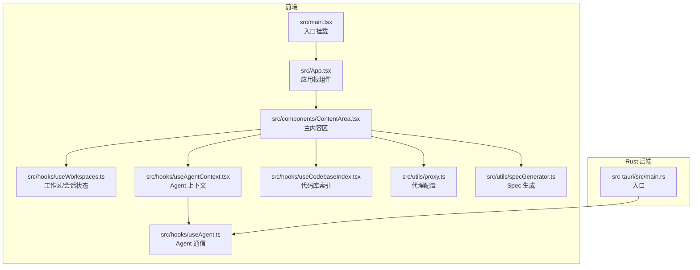
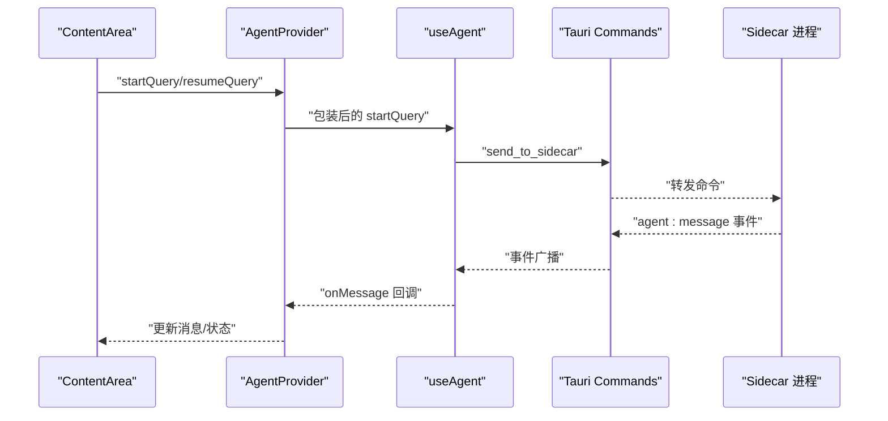
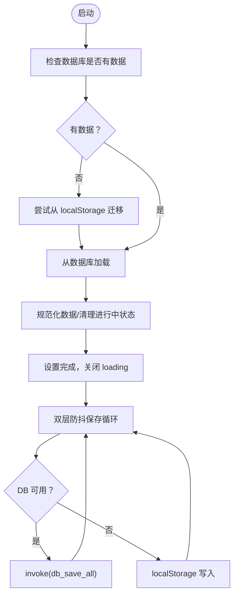
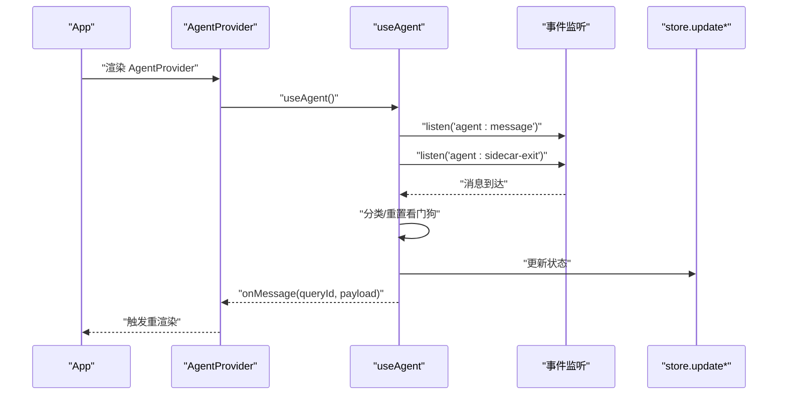
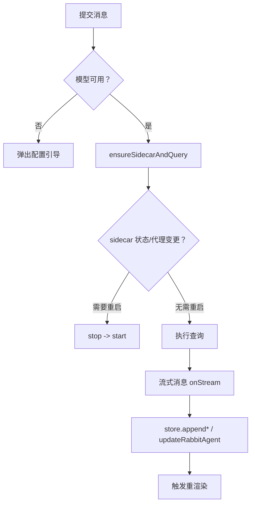
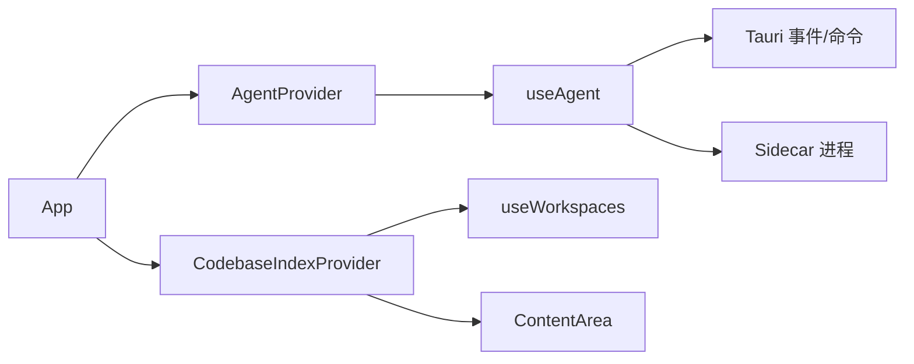

# 性能问题

<cite>
**本文引用的文件**
- [README.md](file://README.md)
- [package.json](file://package.json)
- [vite.config.ts](file://vite.config.ts)
- [src/main.tsx](file://src/main.tsx)
- [src/App.tsx](file://src/App.tsx)
- [src/hooks/useWorkspaces.ts](file://src/hooks/useWorkspaces.ts)
- [src/hooks/useAgentContext.tsx](file://src/hooks/useAgentContext.tsx)
- [src/hooks/useCodebaseIndex.tsx](file://src/hooks/useCodebaseIndex.tsx)
- [src/components/ContentArea.tsx](file://src/components/ContentArea.tsx)
- [src/hooks/useAgent.ts](file://src/hooks/useAgent.ts)
- [src/utils/proxy.ts](file://src/utils/proxy.ts)
- [src/utils/specGenerator.ts](file://src/utils/specGenerator.ts)
- [src/types/index.ts](file://src/types/index.ts)
- [src-tauri/src/main.rs](file://src-tauri/src/main.rs)
</cite>

## 目录
1. [简介](#简介)
2. [项目结构](#项目结构)
3. [核心组件](#核心组件)
4. [架构总览](#架构总览)
5. [详细组件分析](#详细组件分析)
6. [依赖关系分析](#依赖关系分析)
7. [性能考量](#性能考量)
8. [故障排查指南](#故障排查指南)
9. [结论](#结论)
10. [附录](#附录)

## 简介
本文件面向 RabbitCoding 的性能问题诊断与优化，聚焦以下典型症状：应用启动缓慢、内存占用过高、CPU 使用率异常、响应延迟高。我们将从数据加载与持久化、消息流与监听、渲染与状态管理、网络代理与 sidecar 生命周期、以及缓存与资源使用五个维度，系统性梳理问题根因与优化策略，并提供可操作的监控与分析方法。

## 项目结构
RabbitCoding 采用 Tauri + React + Vite 技术栈，前端负责 UI 与交互，Rust 侧提供原生能力（数据库、文件系统、外部进程 sidecar 等）。构建与开发流程由 Vite 驱动，Tauri CLI 管理打包与运行。

图表来源
- [src/main.tsx:1-11](file://src/main.tsx#L1-L11)
- [src/App.tsx:1-107](file://src/App.tsx#L1-L107)
- [src/components/ContentArea.tsx:1-690](file://src/components/ContentArea.tsx#L1-L690)
- [src/hooks/useWorkspaces.ts:1-541](file://src/hooks/useWorkspaces.ts#L1-L541)
- [src/hooks/useAgentContext.tsx:1-298](file://src/hooks/useAgentContext.tsx#L1-L298)
- [src/hooks/useAgent.ts:1-334](file://src/hooks/useAgent.ts#L1-L334)
- [src/hooks/useCodebaseIndex.tsx:1-519](file://src/hooks/useCodebaseIndex.tsx#L1-L519)
- [src/utils/proxy.ts:1-62](file://src/utils/proxy.ts#L1-L62)
- [src/utils/specGenerator.ts:1-300](file://src/utils/specGenerator.ts#L1-L300)
- [src-tauri/src/main.rs:1-7](file://src-tauri/src/main.rs#L1-L7)

章节来源
- [README.md:1-8](file://README.md#L1-L8)
- [package.json:1-46](file://package.json#L1-L46)
- [vite.config.ts:1-37](file://vite.config.ts#L1-L37)
- [src/main.tsx:1-11](file://src/main.tsx#L1-L11)
- [src/App.tsx:1-107](file://src/App.tsx#L1-L107)

## 核心组件
- 数据与状态
  - useWorkspaces：集中管理工作区、兔兔（会话）、消息与持久化，包含双层防抖保存与降级策略，影响启动与运行时内存占用。
  - useCodebaseIndex：代码库索引与同步状态管理，涉及大量事件监听与状态聚合。
- 通信与流式
  - useAgent：封装 sidecar 启停、查询、取消、压缩、看门狗与事件监听，是 CPU 与内存压力的关键节点。
  - AgentProvider：在应用层级持有监听器，避免页面切换导致消息丢失，但需注意取消与清理。
- 业务交互
  - ContentArea：主对话区，串联模型选择、代理配置、Spec 生成、右侧面板等，是渲染热点区域。
  - specGenerator：Spec 生成流程的前端落盘与事件监听，包含竞态修复与超时保护。
- 网络与代理
  - proxy：代理配置转换与指纹校验，支持 sidecar 启停时的代理变更检测。

章节来源
- [src/hooks/useWorkspaces.ts:1-541](file://src/hooks/useWorkspaces.ts#L1-L541)
- [src/hooks/useCodebaseIndex.tsx:1-519](file://src/hooks/useCodebaseIndex.tsx#L1-L519)
- [src/hooks/useAgent.ts:1-334](file://src/hooks/useAgent.ts#L1-L334)
- [src/hooks/useAgentContext.tsx:1-298](file://src/hooks/useAgentContext.tsx#L1-L298)
- [src/components/ContentArea.tsx:1-690](file://src/components/ContentArea.tsx#L1-L690)
- [src/utils/specGenerator.ts:1-300](file://src/utils/specGenerator.ts#L1-L300)
- [src/utils/proxy.ts:1-62](file://src/utils/proxy.ts#L1-L62)

## 架构总览
前端通过 Tauri Commands 与 Rust 侧交互，使用事件通道接收 sidecar 的流式消息。AgentProvider 在 App 层持有监听器，ContentArea 负责触发查询与渲染，useWorkspaces 负责状态持久化与归一化。

图表来源
- [src/components/ContentArea.tsx:1-690](file://src/components/ContentArea.tsx#L1-L690)
- [src/hooks/useAgentContext.tsx:1-298](file://src/hooks/useAgentContext.tsx#L1-L298)
- [src/hooks/useAgent.ts:1-334](file://src/hooks/useAgent.ts#L1-L334)

## 详细组件分析

### 数据加载与持久化（useWorkspaces）
- 启动路径
  - 首先检查数据库是否有数据，若无则尝试从 localStorage 迁移，再从数据库加载；失败则降级到 localStorage。
  - 加载完成后清理“进行中”状态，收敛 UI，避免永久 loading。
- 保存策略
  - 双层防抖：500ms 延迟保存 + 3s 强制保存，降低频繁 IO。
  - DB 不可用时写 localStorage，避免阻塞。
- 性能影响点
  - 大体量消息数组的深拷贝与状态更新可能导致渲染与 GC 压力。
  - 频繁的 JSON stringify/parsing 与 invoke 调用可能成为瓶颈。

图表来源
- [src/hooks/useWorkspaces.ts:48-129](file://src/hooks/useWorkspaces.ts#L48-L129)

章节来源
- [src/hooks/useWorkspaces.ts:1-541](file://src/hooks/useWorkspaces.ts#L1-L541)

### 事件监听与消息流（useAgent + AgentProvider）
- 监听机制
  - useAgent 在 effect 中注册 agent:message 与 agent:sidecar-exit 事件监听，解析 JSON payload，按 queryId 分发。
  - AgentProvider 在 App 层持有监听器，避免页面切换导致消息丢失。
- 看门狗与超时
  - 每条 query 独立计时，收到任意消息重置；思考态延长阈值，避免长思考误判。
  - sidecar 退出时统一清理计时器，防止泄漏。
- 性能影响点
  - 事件风暴（大量消息短时间到达）可能造成主线程阻塞与内存峰值。
  - 未及时清理的监听器与定时器会导致内存泄漏。

图表来源
- [src/hooks/useAgent.ts:262-320](file://src/hooks/useAgent.ts#L262-L320)
- [src/hooks/useAgentContext.tsx:88-193](file://src/hooks/useAgentContext.tsx#L88-L193)

章节来源
- [src/hooks/useAgent.ts:1-334](file://src/hooks/useAgent.ts#L1-L334)
- [src/hooks/useAgentContext.tsx:1-298](file://src/hooks/useAgentContext.tsx#L1-L298)

### 渲染热点与状态更新（ContentArea）
- 渲染路径
  - 主对话区根据选中 Rabbit 渲染 AgentChat，底部 Sender 控制输入与取消。
  - 右侧面板可展开/拖拽宽度，包含仓库管理与 Spec 预览。
- 性能影响点
  - 大消息数组的渲染与 diff 可能导致重排重绘。
  - 模型选择器、开关、按钮等高频交互引发的多次重渲染。
  - 右侧面板宽度与最大化状态的本地存储读写。

图表来源
- [src/components/ContentArea.tsx:269-400](file://src/components/ContentArea.tsx#L269-L400)

章节来源
- [src/components/ContentArea.tsx:1-690](file://src/components/ContentArea.tsx#L1-L690)

### 代码库索引与同步（useCodebaseIndex）
- 初始化
  - 检测 gitnexus 安装状态，加载已索引列表，交叉比对更新状态。
- 事件驱动
  - 监听 gitnexus-progress 与 gitnexus-install-progress，动态更新索引与同步状态。
- 性能影响点
  - 大型仓库索引过程中产生大量事件，需避免在渲染中直接映射所有项。
  - 状态聚合与查找表（Set/Map）的构建与更新成本。

章节来源
- [src/hooks/useCodebaseIndex.tsx:1-519](file://src/hooks/useCodebaseIndex.tsx#L1-L519)

### Spec 生成流程（specGenerator）
- 设计要点
  - 不依赖 Agent 直接写文件，改为纯文本生成后前端落盘，路径可控。
  - 事件监听先注册再发送查询，修复竞态；添加超时保护，防止永久阻塞。
- 性能影响点
  - 大体量 Spec 内容的字符串拼接与写入可能造成主线程卡顿。
  - 多次事件监听注册/注销与定时器管理需谨慎。

章节来源
- [src/utils/specGenerator.ts:1-300](file://src/utils/specGenerator.ts#L1-L300)

### 代理配置与 sidecar 启停（proxy + ContentArea）
- 代理指纹
  - 通过 JSON 序列化生成指纹，检测代理变更后重启 sidecar。
- ContentArea
  - 在启动 sidecar 前合并代理环境变量，避免无效请求与重试。

章节来源
- [src/utils/proxy.ts:1-62](file://src/utils/proxy.ts#L1-L62)
- [src/components/ContentArea.tsx:111-183](file://src/components/ContentArea.tsx#L111-L183)

## 依赖关系分析
- 组件耦合
  - App 作为根容器，注入主题、国际化、认证、AgentProvider、CodebaseIndexProvider。
  - ContentArea 依赖 useAgentContext 与 useWorkspaces，形成“查询—状态—渲染”的闭环。
- 外部依赖
  - Tauri Commands/Events：与 Rust 侧通信。
  - 代理环境变量：影响 sidecar 网络访问。
- 潜在风险
  - 事件监听与定时器未正确清理，易导致内存泄漏。
  - 大数组状态更新未做稳定化处理，可能引发过度渲染。

图表来源
- [src/App.tsx:1-107](file://src/App.tsx#L1-L107)
- [src/hooks/useAgentContext.tsx:88-284](file://src/hooks/useAgentContext.tsx#L88-L284)
- [src/hooks/useCodebaseIndex.tsx:79-500](file://src/hooks/useCodebaseIndex.tsx#L79-L500)
- [src/hooks/useAgent.ts:106-151](file://src/hooks/useAgent.ts#L106-L151)

章节来源
- [src/App.tsx:1-107](file://src/App.tsx#L1-L107)
- [src/hooks/useAgentContext.tsx:1-298](file://src/hooks/useAgentContext.tsx#L1-L298)
- [src/hooks/useCodebaseIndex.tsx:1-519](file://src/hooks/useCodebaseIndex.tsx#L1-L519)
- [src/hooks/useAgent.ts:1-334](file://src/hooks/useAgent.ts#L1-L334)

## 性能考量
- 启动缓慢
  - 数据加载路径复杂，建议：
    - 优化数据库迁移与降级路径的日志与错误处理，避免重复尝试。
    - 对大型工作区采用分页/懒加载策略，减少首屏状态规模。
- 内存占用过高
  - 大消息数组与频繁深拷贝是主因，建议：
    - 使用不可变数据结构或引用稳定化策略（如 useWorkspaces 中的 normalizedWorkspaces）。
    - 对历史消息进行分页或滑动窗口裁剪。
    - 严格清理事件监听与定时器，避免泄漏。
- CPU 使用率异常
  - 事件风暴与渲染风暴叠加，建议：
    - 在 useAgent 中增加节流/批处理队列，合并同类消息。
    - ContentArea 中对高频交互使用 useCallback/memo 包裹。
    - 减少不必要的状态提升与跨层传递。
- 响应延迟高
  - sidecar 启停与网络代理变更导致的冷启动，建议：
    - 代理指纹变更时仅在必要时重启 sidecar。
    - 预热 sidecar 或复用已有实例，减少频繁启停。
- 渲染性能
  - 使用 React.memo、useMemo、useCallback，避免子树重渲染。
  - 对长列表使用虚拟滚动或分页。
- 数据流性能
  - 将“流式增量”与“最终消息”分离处理，减少重复渲染。
  - 对消息数组采用尾部追加与就地更新策略。

[本节为通用指导，无需特定文件引用]

## 故障排查指南
- 启动慢/白屏
  - 检查数据库可用性与迁移日志，确认降级路径是否生效。
  - 关注首屏 loading 逻辑与 workspaces 初始化。
- 内存飙升
  - 检查事件监听是否在组件卸载时清理。
  - 审视消息数组长度与更新频率，必要时引入裁剪。
- CPU 飙升
  - 观察 sidecar 看门狗触发频率，确认是否存在静默卡死。
  - 检查代理变更导致的 sidecar 频繁重启。
- 响应延迟
  - 使用 ContentArea 的 pendingQueryRef 与 ensureSidecarAndQuery 路径，确认代理与 API Key 配置。
  - 关注 spec 生成流程的超时与竞态修复。

章节来源
- [src/hooks/useWorkspaces.ts:48-129](file://src/hooks/useWorkspaces.ts#L48-L129)
- [src/hooks/useAgent.ts:262-320](file://src/hooks/useAgent.ts#L262-L320)
- [src/components/ContentArea.tsx:111-183](file://src/components/ContentArea.tsx#L111-L183)
- [src/utils/specGenerator.ts:195-299](file://src/utils/specGenerator.ts#L195-L299)

## 结论
RabbitCoding 的性能问题多源于数据加载路径复杂、事件流密集、渲染热点集中与 sidecar 生命周期管理不当。通过优化持久化策略、事件批处理、渲染稳定化与 sidecar 预热/复用，可显著缓解启动慢、内存高、CPU 异常与响应延迟等问题。建议以“可观测—定位—优化—验证”的闭环推进，逐步完善监控与缓存策略。

[本节为总结，无需特定文件引用]

## 附录
- 性能监控建议
  - 前端：使用浏览器性能面板观察主线程占用、GC 活动与长任务；结合 React DevTools Profiler 定位重渲染热点。
  - Rust：在 sidecar 侧输出关键事件的时间戳与耗时，便于端到端分析。
- 缓存策略
  - 会话消息：短期缓存（最近 N 条），长期历史分页存储。
  - 代理配置：指纹缓存，变更时精确重启 sidecar。
  - 代码库索引：增量同步与本地缓存，避免全量重建。
- 系统资源配置建议
  - 适当提高 sidecar 的内存与并发限制，避免频繁 OOM。
  - 优化磁盘 IO：将临时目录与日志目录指向高性能磁盘。

[本节为通用指导，无需特定文件引用]