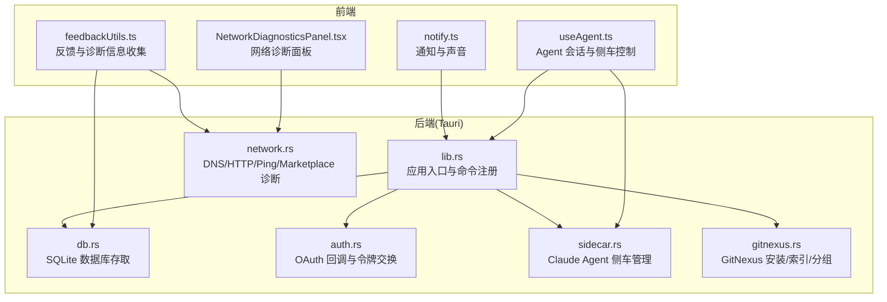
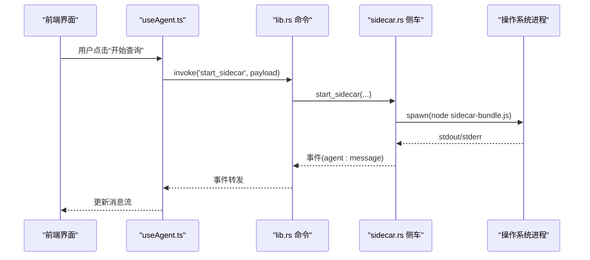
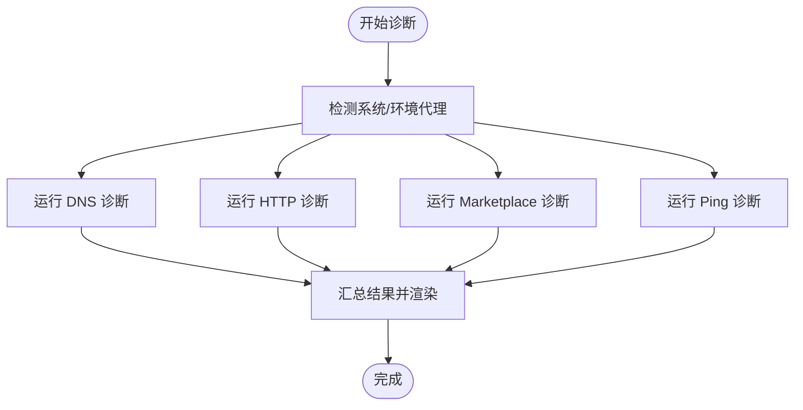
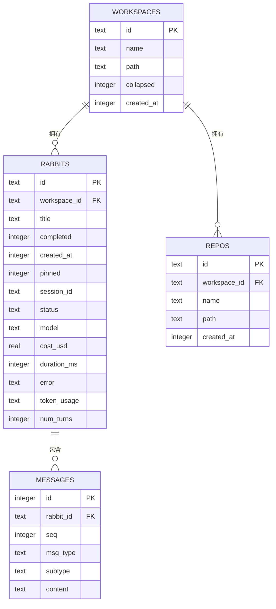
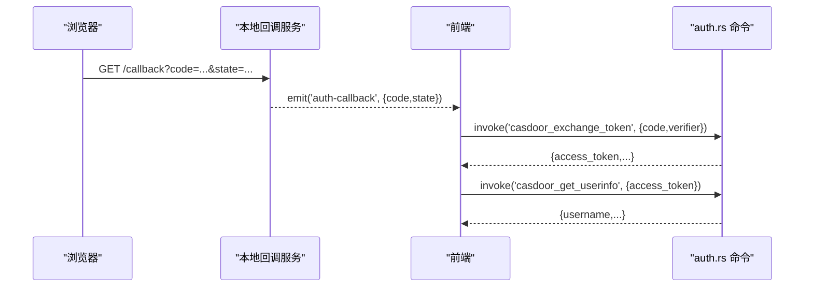
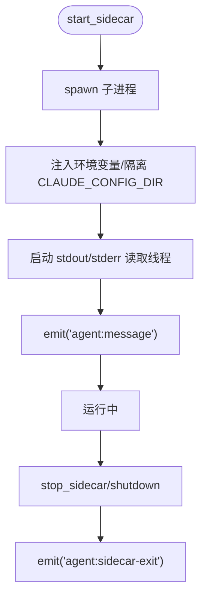
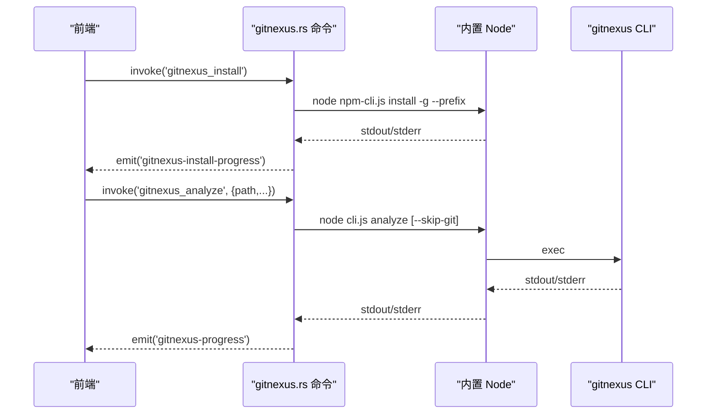
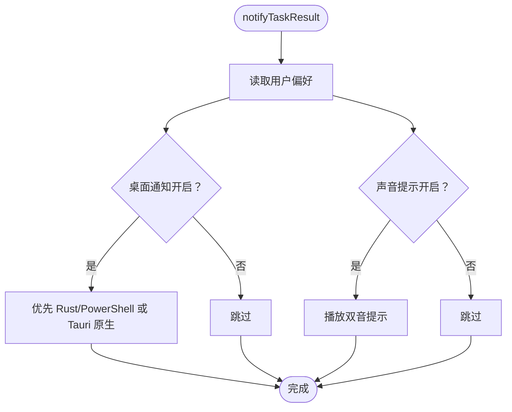
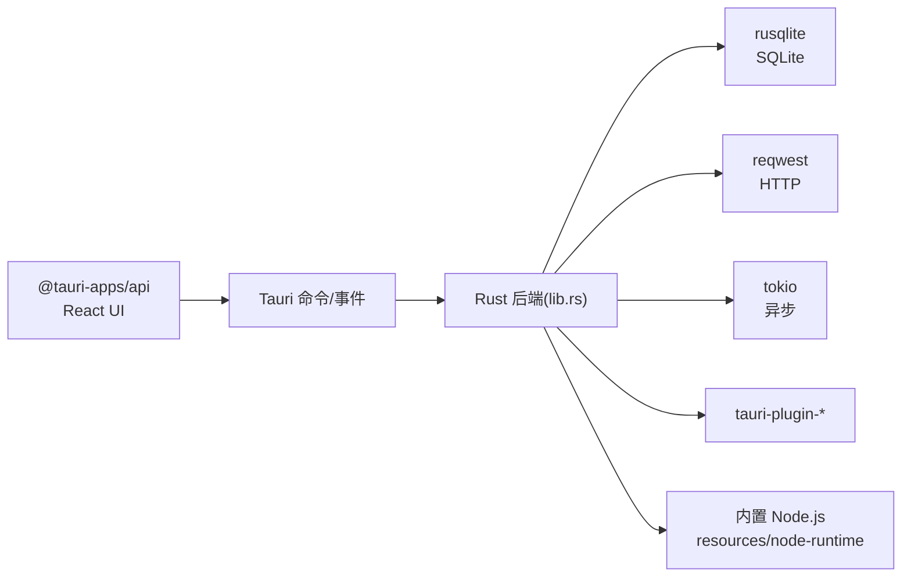

# 故障排除

<cite>
**本文引用的文件**
- [README.md](file://README.md)
- [package.json](file://package.json)
- [Cargo.toml](file://src-tauri/Cargo.toml)
- [main.rs](file://src-tauri/src/main.rs)
- [lib.rs](file://src-tauri/src/lib.rs)
- [db.rs](file://src-tauri/src/db.rs)
- [network.rs](file://src-tauri/src/network.rs)
- [auth.rs](file://src-tauri/src/auth.rs)
- [sidecar.rs](file://src-tauri/src/sidecar.rs)
- [gitnexus.rs](file://src-tauri/src/gitnexus.rs)
- [notify.ts](file://src/utils/notify.ts)
- [useAgent.ts](file://src/hooks/useAgent.ts)
- [NetworkDiagnosticsPanel.tsx](file://src/components/settings/NetworkDiagnosticsPanel.tsx)
- [feedbackUtils.ts](file://src/components/settings/feedback/feedbackUtils.ts)
</cite>

## 目录
1. [简介](#简介)
2. [项目结构](#项目结构)
3. [核心组件](#核心组件)
4. [架构总览](#架构总览)
5. [详细组件分析](#详细组件分析)
6. [依赖关系分析](#依赖关系分析)
7. [性能考虑](#性能考虑)
8. [故障排除指南](#故障排除指南)
9. [结论](#结论)
10. [附录](#附录)

## 简介
本文件面向 RabbitCoding 的使用者与维护者，提供系统化的故障排除指南。内容覆盖网络连接、数据库、认证、侧车进程、代码库索引（GitNexus）、通知与性能等问题的识别、诊断与解决方法，并给出调试技巧、日志分析、错误追踪流程、常见错误代码与含义、预防措施、故障示例与最佳实践，以及如何收集诊断信息与提交问题报告。

## 项目结构
RabbitCoding 采用 Tauri + React + TypeScript 技术栈，Rust 侧提供命令、网络诊断、数据库、认证、侧车与 GitNexus 等能力，前端负责 UI、事件监听与用户交互。

图示来源
- [lib.rs:124-316](file://src-tauri/src/lib.rs#L124-L316)
- [network.rs:1-800](file://src-tauri/src/network.rs#L1-L800)
- [db.rs:1-417](file://src-tauri/src/db.rs#L1-L417)
- [auth.rs:1-376](file://src-tauri/src/auth.rs#L1-L376)
- [sidecar.rs:1-359](file://src-tauri/src/sidecar.rs#L1-L359)
- [gitnexus.rs:1-761](file://src-tauri/src/gitnexus.rs#L1-L761)
- [NetworkDiagnosticsPanel.tsx:1-425](file://src/components/settings/NetworkDiagnosticsPanel.tsx#L1-L425)
- [useAgent.ts:1-334](file://src/hooks/useAgent.ts#L1-L334)
- [notify.ts:1-274](file://src/utils/notify.ts#L1-L274)
- [feedbackUtils.ts:1-121](file://src/components/settings/feedback/feedbackUtils.ts#L1-L121)

章节来源
- [README.md:1-8](file://README.md#L1-L8)
- [package.json:1-46](file://package.json#L1-L46)
- [Cargo.toml:1-40](file://src-tauri/Cargo.toml#L1-L40)

## 核心组件
- 应用入口与命令注册：负责初始化数据库、窗口状态、OAuth 回调服务、注册命令与事件。
- 网络诊断：提供 DNS、HTTP、Ping、Marketplace 四类诊断，聚合代理信息与结果。
- 数据库：基于 SQLite 的工作区、兔子（会话）、仓库与消息持久化，支持全量导入导出与迁移。
- 认证：本地 loopback OAuth 回调服务，令牌交换与用户信息获取。
- 侧车：管理 Claude Agent 侧车生命周期、标准输入输出事件、环境隔离与路径解析。
- GitNexus：内置 Node/NPM 管理与安装，CLI 调用、索引进度事件、分组同步与状态查询。
- 通知：跨平台桌面通知与声音提示，兼容开发/发布两种模式。
- 反馈：配置摘要、WebView 性能指标采集，辅助问题报告。

章节来源
- [lib.rs:124-316](file://src-tauri/src/lib.rs#L124-L316)
- [network.rs:1-800](file://src-tauri/src/network.rs#L1-L800)
- [db.rs:1-417](file://src-tauri/src/db.rs#L1-L417)
- [auth.rs:1-376](file://src-tauri/src/auth.rs#L1-L376)
- [sidecar.rs:1-359](file://src-tauri/src/sidecar.rs#L1-L359)
- [gitnexus.rs:1-761](file://src-tauri/src/gitnexus.rs#L1-L761)
- [notify.ts:1-274](file://src/utils/notify.ts#L1-L274)
- [NetworkDiagnosticsPanel.tsx:1-425](file://src/components/settings/NetworkDiagnosticsPanel.tsx#L1-L425)
- [feedbackUtils.ts:1-121](file://src/components/settings/feedback/feedbackUtils.ts#L1-L121)

## 架构总览
RabbitCoding 的前后端交互通过 Tauri 命令与事件实现。前端通过 @tauri-apps/api 调用后端命令，后端在 Rust 中执行业务逻辑并返回结果或发出事件。侧车与外部 CLI 通过子进程方式运行，标准输出/错误通过事件上报前端。

图示来源
- [useAgent.ts:106-126](file://src/hooks/useAgent.ts#L106-L126)
- [sidecar.rs:61-214](file://src-tauri/src/sidecar.rs#L61-L214)
- [lib.rs:271-313](file://src-tauri/src/lib.rs#L271-L313)

## 详细组件分析

### 网络诊断组件
- 功能：并行执行 DNS、HTTP、Ping、Marketplace 诊断，展示代理信息与各指标。
- 关键命令：diag_dns、diag_http、diag_ping、diag_marketplace。
- 诊断要点：代理检测、DNS 解析、HTTP 响应码/协议/TLS/时延、Ping 丢包与 RTT、Marketplace 连通性与可用性。
- 前端集成：NetworkDiagnosticsPanel.tsx 调用 invoke 并逐块渲染结果。

图示来源
- [network.rs:100-201](file://src-tauri/src/network.rs#L100-L201)
- [network.rs:366-375](file://src-tauri/src/network.rs#L366-L375)
- [network.rs:538-550](file://src-tauri/src/network.rs#L538-L550)
- [network.rs:800-864](file://src-tauri/src/network.rs#L800-L864)
- [NetworkDiagnosticsPanel.tsx:343-370](file://src/components/settings/NetworkDiagnosticsPanel.tsx#L343-L370)

章节来源
- [network.rs:1-800](file://src-tauri/src/network.rs#L1-L800)
- [NetworkDiagnosticsPanel.tsx:1-425](file://src/components/settings/NetworkDiagnosticsPanel.tsx#L1-L425)

### 数据库组件
- 功能：工作区、兔子（会话）、仓库、消息四表建模与迁移；全量导入导出；事务保障。
- 关键命令：db_load_all、db_save_all、db_has_data。
- 诊断要点：数据库路径、WAL 模式、外键约束、索引、序列化/反序列化错误。
- 前端集成：通过 invoke 调用，失败时可降级至本地存储。

图示来源
- [db.rs:85-138](file://src-tauri/src/db.rs#L85-L138)
- [db.rs:140-161](file://src-tauri/src/db.rs#L140-L161)
- [db.rs:392-416](file://src-tauri/src/db.rs#L392-L416)

章节来源
- [db.rs:1-417](file://src-tauri/src/db.rs#L1-L417)

### 认证组件
- 功能：本地 loopback 回调服务（127.0.0.1:17331），令牌交换与用户信息获取，组合命令一次性完成。
- 诊断要点：端口占用、回调参数解析、网络连通性、超时与错误描述。
- 前端集成：通过事件接收回调，再发起令牌交换与用户信息请求。

图示来源
- [auth.rs:258-350](file://src-tauri/src/auth.rs#L258-L350)
- [auth.rs:118-172](file://src-tauri/src/auth.rs#L118-L172)
- [auth.rs:179-220](file://src-tauri/src/auth.rs#L179-L220)

章节来源
- [auth.rs:1-376](file://src-tauri/src/auth.rs#L1-L376)

### 侧车组件
- 功能：启动/停止/查询侧车状态；向 stdin 发送消息；从 stdout 逐行事件推送；stderr 日志打印；环境变量隔离与路径解析。
- 诊断要点：进程存活、stdin 写入、stdout/stderr 读取、CLAUDE_CONFIG_DIR 隔离、内置 Node 路径。
- 前端集成：useAgent.ts 监听 agent:message 与 agent:sidecar-exit 事件，管理看门狗与思考态。

图示来源
- [sidecar.rs:61-214](file://src-tauri/src/sidecar.rs#L61-L214)
- [sidecar.rs:216-279](file://src-tauri/src/sidecar.rs#L216-L279)
- [useAgent.ts:262-320](file://src/hooks/useAgent.ts#L262-L320)

章节来源
- [sidecar.rs:1-359](file://src-tauri/src/sidecar.rs#L1-L359)
- [useAgent.ts:1-334](file://src/hooks/useAgent.ts#L1-L334)

### GitNexus 组件
- 功能：内置 Node/NPM 管理；安装/卸载/检测 CLI；analyze 索引；list 列表；group create/add/sync/status；进度事件。
- 诊断要点：内置 Node/NPM 可用性、prefix 路径、CLI 可执行性、子进程输出与错误码。
- 前端集成：通过事件流展示进度，最终返回索引结果或错误。

图示来源
- [gitnexus.rs:183-311](file://src-tauri/src/gitnexus.rs#L183-L311)
- [gitnexus.rs:384-561](file://src-tauri/src/gitnexus.rs#L384-L561)
- [gitnexus.rs:644-754](file://src-tauri/src/gitnexus.rs#L644-L754)

章节来源
- [gitnexus.rs:1-761](file://src-tauri/src/gitnexus.rs#L1-L761)

### 通知组件
- 功能：跨平台桌面通知与声音提示；开发/发布模式优先级切换；打开系统通知设置。
- 诊断要点：权限状态、平台差异、回退策略、音频上下文状态。

图示来源
- [notify.ts:97-120](file://src/utils/notify.ts#L97-L120)
- [notify.ts:139-183](file://src/utils/notify.ts#L139-L183)

章节来源
- [notify.ts:1-274](file://src/utils/notify.ts#L1-L274)

## 依赖关系分析
- 前端依赖：@tauri-apps/api、@tauri-apps/plugin-* 等插件，React Hooks 与 UI 组件。
- 后端依赖：rusqlite、reqwest、tokio、tauri-plugin-*、image/base64 等。
- 运行时：内置 Node.js（resources/node-runtime）在生产模式下用于 sidecar 与 GitNexus。

图示来源
- [package.json:14-36](file://package.json#L14-L36)
- [Cargo.toml:20-39](file://src-tauri/Cargo.toml#L20-L39)
- [lib.rs:124-133](file://src-tauri/src/lib.rs#L124-L133)
- [sidecar.rs:287-358](file://src-tauri/src/sidecar.rs#L287-L358)

章节来源
- [package.json:1-46](file://package.json#L1-L46)
- [Cargo.toml:1-40](file://src-tauri/Cargo.toml#L1-L40)

## 性能考虑
- 网络诊断：并发执行多路诊断，缩短总耗时；Ping 通常最慢，应单独处理完成时机。
- 数据库：WAL 模式、外键与索引优化；批量导入使用事务（COMMIT/ROLLBACK）。
- 侧车：stdout/stderr 读取线程化，避免阻塞；环境变量隔离减少外部耦合。
- WebView 性能：采集 DOM 元素数、JS Heap、DOM Complete 时间，辅助定位前端性能瓶颈。

章节来源
- [network.rs:352-370](file://src-tauri/src/network.rs#L352-L370)
- [db.rs:290-305](file://src-tauri/src/db.rs#L290-L305)
- [sidecar.rs:175-208](file://src-tauri/src/sidecar.rs#L175-L208)
- [feedbackUtils.ts:66-84](file://src/components/settings/feedback/feedbackUtils.ts#L66-L84)

## 故障排除指南

### 一、网络连接问题
- 现象
  - DNS 解析失败或无 A 记录
  - HTTP 请求超时/状态码异常/TLS 版本不匹配
  - Ping 丢包率高或 RTT 异常
  - Marketplace 连接失败或 API 不可用
- 诊断步骤
  - 使用设置页“网络诊断”并行执行 DNS/HTTP/Ping/Marketplace 诊断。
  - 检查代理：系统代理（Windows netsh、macOS scutil）与环境变量（HTTP_PROXY/HTTPS_PROXY 等）。
  - 校验本地 loopback 回调端口 127.0.0.1:17331 是否被占用。
- 解决方案
  - 修正代理配置或切换直连；必要时禁用代理进行对比测试。
  - 更换 DNS（如 8.8.8.8）或使用 HTTPS DNS（DoH）。
  - 调整超时与重试策略；确认防火墙/杀软未拦截。
  - 若 Marketplace 失败，先验证 HTTP 诊断与 DNS 解析。
- 预防措施
  - 定期运行网络诊断；在新网络环境下首次使用前执行。
  - 为不同网络环境准备代理配置模板。
- 示例
  - DNS：无 A 记录 → 检查 DNS 服务器与域名有效性。
  - HTTP：TLS 版本不匹配 → 升级系统或调整客户端协议。
  - Ping：丢包率 100% → 检查路由/ACL/防火墙。

章节来源
- [network.rs:100-201](file://src-tauri/src/network.rs#L100-L201)
- [network.rs:207-375](file://src-tauri/src/network.rs#L207-L375)
- [network.rs:391-550](file://src-tauri/src/network.rs#L391-L550)
- [network.rs:556-800](file://src-tauri/src/network.rs#L556-L800)
- [NetworkDiagnosticsPanel.tsx:343-370](file://src/components/settings/NetworkDiagnosticsPanel.tsx#L343-L370)

### 二、数据库问题
- 现象
  - 初始化失败（数据库路径不可写/权限不足）
  - 导入/导出失败（JSON 反序列化错误/序列化失败）
  - 迁移失败（列变更/索引缺失）
- 诊断步骤
  - 查看应用数据目录与 rabbit.db 路径；确认目录存在且可写。
  - 检查工作区/会话/仓库/消息数据完整性。
  - 观察事务执行日志（COMMIT/ROLLBACK）。
- 解决方案
  - 修复路径权限；更换到用户可写目录。
  - 修复 JSON 结构；确保 camelCase 字段与后端模型一致。
  - 手动执行迁移 SQL（新增列、索引）。
- 预防措施
  - 启动时自动创建目录；失败时降级到本地存储。
  - 导入前备份现有数据；导出后校验 JSON 结构。
- 示例
  - “Failed to open database: ...” → 检查路径与权限。
  - “Failed to parse JSON: ...” → 修复前端数据模型或后端序列化。

章节来源
- [lib.rs:141-149](file://src-tauri/src/lib.rs#L141-L149)
- [db.rs:140-161](file://src-tauri/src/db.rs#L140-L161)
- [db.rs:392-416](file://src-tauri/src/db.rs#L392-L416)

### 三、认证与 OAuth 问题
- 现象
  - 回调端口被占用或无法绑定
  - 令牌交换失败（错误码/描述）
  - 用户信息接口返回缺失数据
- 诊断步骤
  - 检查 127.0.0.1:17331 是否被占用（如 Chrome/其他应用）。
  - 查看回调服务日志（eprintln）与前端事件是否到达。
  - 校验令牌交换与用户信息请求的响应体与状态码。
- 解决方案
  - 关闭占用端口的应用；重启回调服务。
  - 重试授权流程；检查客户端 ID 与重定向 URI。
  - 根据错误描述定位上游服务问题。
- 预防措施
  - 启动时自动注册回调服务；失败时提示用户。
  - 为不同环境准备独立的重定向 URI。
- 示例
  - “bind 127.0.0.1:17331 failed: ...” → 端口冲突或权限不足。
  - “Token exchange failed: ...” → 服务端返回错误详情。

章节来源
- [auth.rs:258-284](file://src-tauri/src/auth.rs#L258-L284)
- [auth.rs:118-172](file://src-tauri/src/auth.rs#L118-L172)
- [auth.rs:179-220](file://src-tauri/src/auth.rs#L179-L220)

### 四、侧车与 Agent 问题
- 现象
  - 侧车无法启动（找不到内置 Node、权限不足）
  - 无法向 stdin 写入（进程已退出/句柄失效）
  - stdout 事件中断或无事件
  - 会话卡死（无 result/error 事件）
- 诊断步骤
  - 检查内置 Node 路径与 sidecar-bundle.js 是否存在。
  - 查看 stderr 日志（eprintln）与 agent:sidecar-exit 事件。
  - 使用 get_sidecar_status 查询运行状态。
  - 观察看门狗（query watchdog）是否触发超时。
- 解决方案
  - 修复资源路径；确保生产模式下资源目录正确。
  - 重新启动侧车；确保进程存活后再写入。
  - 清理看门狗与思考态集合；避免误判。
- 预防措施
  - 启动时注入 PATH 与 NPM_CONFIG_PREFIX；避免权限问题。
  - 严格区分“思考态”与“正常态”的超时阈值。
- 示例
  - “Failed to spawn sidecar: ...” → 资源缺失或权限不足。
  - “Sidecar is not running” → 未启动或已退出。

章节来源
- [sidecar.rs:287-358](file://src-tauri/src/sidecar.rs#L287-L358)
- [sidecar.rs:61-214](file://src-tauri/src/sidecar.rs#L61-L214)
- [useAgent.ts:75-101](file://src/hooks/useAgent.ts#L75-L101)
- [useAgent.ts:262-320](file://src/hooks/useAgent.ts#L262-L320)

### 五、GitNexus 问题
- 现象
  - 安装失败（npm install -g 失败）
  - analyze 索引卡住或报错
  - list/group 操作异常
- 诊断步骤
  - 检查内置 Node 与 npm-cli.js 是否存在。
  - 查看安装/分析过程中的 stdout/stderr 事件。
  - 验证目标路径是否存在与可访问。
- 解决方案
  - 清理 optional grammars 环境变量；重试安装。
  - 使用 --skip-git 避免向上查找 .git 根。
  - 重新 group create/add/sync。
- 预防措施
  - 安装后检查 CLI 版本；定期清理与重建 prefix。
- 示例
  - “npm install failed (exit ...): ...” → 依赖编译失败或网络问题。
  - “Exit code: ...” → 子进程返回码指示错误。

章节来源
- [gitnexus.rs:183-311](file://src-tauri/src/gitnexus.rs#L183-L311)
- [gitnexus.rs:384-561](file://src-tauri/src/gitnexus.rs#L384-L561)
- [gitnexus.rs:644-754](file://src-tauri/src/gitnexus.rs#L644-L754)

### 六、通知与声音问题
- 现象
  - 通知未显示或权限被拒绝
  - 声音无法播放
- 诊断步骤
  - 检查权限状态与回退策略（Rust/PowerShell → Tauri）。
  - 浏览器自动播放策略限制导致音频上下文暂停。
- 解决方案
  - 引导用户打开系统通知设置；请求权限。
  - 在用户交互后恢复 AudioContext；确保音频上下文可用。
- 预防措施
  - 测试通知时强制显示提示；避免静默成功。
- 示例
  - “Tauri notification failed: ...” → 权限或签名问题。
  - “AudioContext state suspended” → 需要用户交互恢复。

章节来源
- [notify.ts:68-120](file://src/utils/notify.ts#L68-L120)
- [notify.ts:139-183](file://src/utils/notify.ts#L139-L183)

### 七、调试技巧与日志分析
- 调试技巧
  - 开启 DevTools（F12）查看前端日志与网络请求。
  - 后端 eprintln 输出到系统日志；观察侧车 stderr。
  - 使用网络诊断面板并行收集 DNS/HTTP/Ping/Marketplace 结果。
- 日志分析
  - 认证：关注回调服务绑定与令牌交换响应体。
  - 侧车：关注 stdout 事件与 agent:sidecar-exit 事件。
  - GitNexus：关注安装/分析过程中的进度事件与最后输出行。
- 错误追踪
  - 前端：@tauri-apps/api invoke 返回的错误字符串。
  - 后端：Result 类型的错误映射与 eprintln。

章节来源
- [lib.rs:213-257](file://src-tauri/src/lib.rs#L213-L257)
- [auth.rs:133-153](file://src-tauri/src/auth.rs#L133-L153)
- [sidecar.rs:196-208](file://src-tauri/src/sidecar.rs#L196-L208)
- [gitnexus.rs:209-261](file://src-tauri/src/gitnexus.rs#L209-L261)

### 八、收集诊断信息与提交问题报告
- 诊断清单
  - 网络诊断结果（DNS/HTTP/Ping/Marketplace）
  - 数据库状态（是否有数据、迁移情况）
  - 侧车状态（运行/停止、最近事件）
  - GitNexus 安装与索引状态
  - 通知与声音测试结果
  - WebView 性能指标（DOM 元素数、JS Heap、DOM Complete）
- 信息脱敏
  - 不包含 API Key、代理地址等敏感信息。
- 提交建议
  - 附上操作系统版本、RabbitCoding 版本、网络环境简述。
  - 提供最小复现步骤与期望/实际行为对比。

章节来源
- [NetworkDiagnosticsPanel.tsx:343-370](file://src/components/settings/NetworkDiagnosticsPanel.tsx#L343-L370)
- [feedbackUtils.ts:7-61](file://src/components/settings/feedback/feedbackUtils.ts#L7-L61)
- [feedbackUtils.ts:66-84](file://src/components/settings/feedback/feedbackUtils.ts#L66-L84)

## 结论
通过系统化的网络诊断、数据库健康检查、认证流程验证、侧车与 GitNexus 管理、通知与性能监控，RabbitCoding 能够快速定位并解决问题。建议在新环境首次使用与网络/代理变更后运行网络诊断；定期检查数据库与侧车状态；遇到问题时结合 eprintln 与前端日志进行交叉验证，并按“诊断清单”收集信息提交问题报告。

## 附录

### 常见错误代码与含义
- 数据库
  - “Failed to open database: ...” → 数据库文件或路径问题
  - “Failed to initialize schema: ...” → 初始化 SQL 执行失败
  - “Failed to parse JSON: ...” → 导入数据结构不匹配
- 网络诊断
  - “No A records found” → DNS 无解析结果
  - “Failed to run dig/nslookup: ...” → 本地工具不可用
  - “Failed to execute curl: ...” → curl 命令执行失败
- 侧车
  - “Failed to spawn sidecar: ...” → 子进程创建失败
  - “Sidecar is not running” → 未启动或已退出
  - “stdout closed” → 侧车进程退出
- GitNexus
  - “npm install failed (exit ...): ...” → 安装失败
  - “Exit code: ...” → 子进程返回码
- 认证
  - “bind 127.0.0.1:17331 failed: ...” → 端口占用或权限不足
  - “Token exchange failed: ...” → 令牌交换错误

章节来源
- [db.rs:142-147](file://src-tauri/src/db.rs#L142-L147)
- [network.rs:222-231](file://src-tauri/src/network.rs#L222-L231)
- [network.rs:490-506](file://src-tauri/src/network.rs#L490-L506)
- [sidecar.rs:158-163](file://src-tauri/src/sidecar.rs#L158-L163)
- [gitnexus.rs:282-307](file://src-tauri/src/gitnexus.rs#L282-L307)
- [auth.rs:262-268](file://src-tauri/src/auth.rs#L262-L268)
- [auth.rs:167-171](file://src-tauri/src/auth.rs#L167-L171)