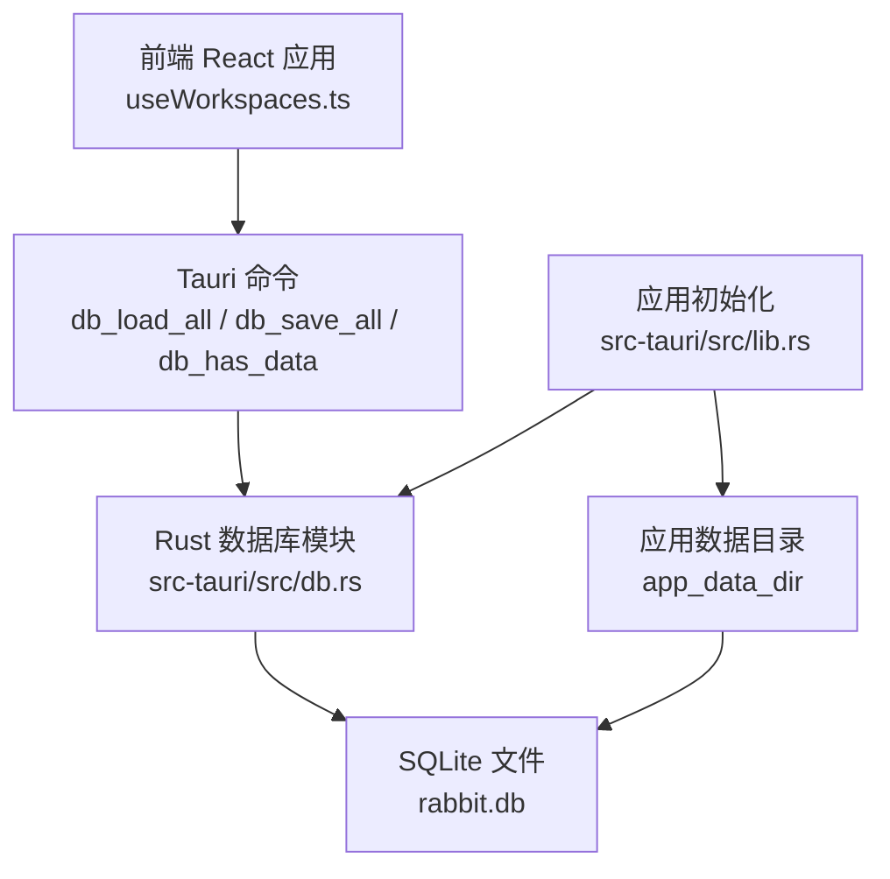
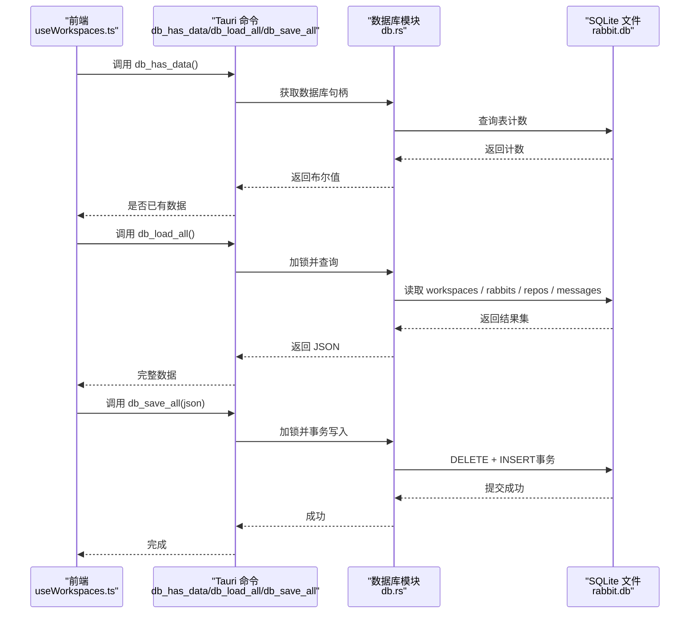
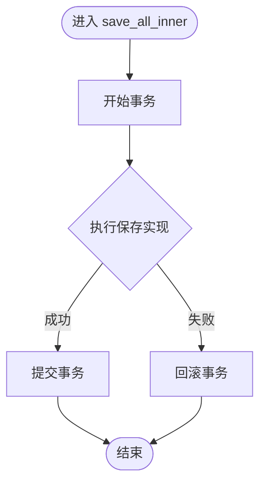
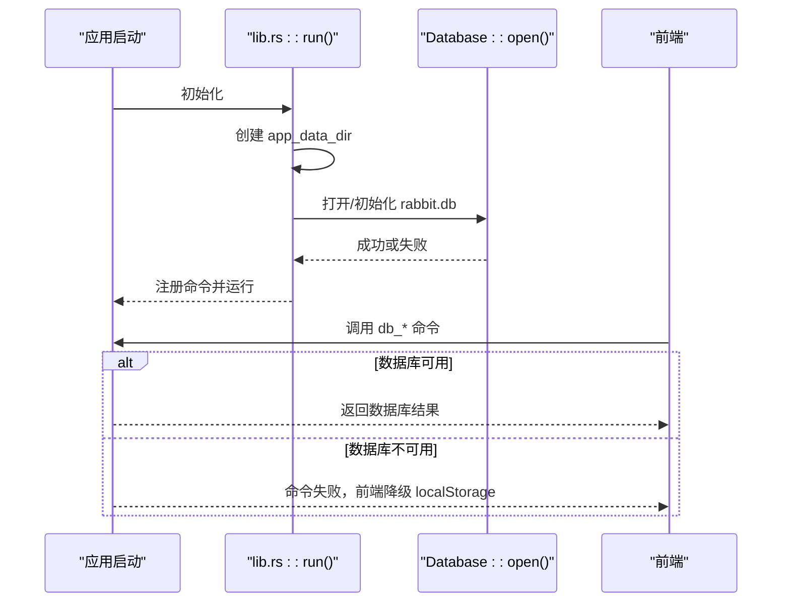
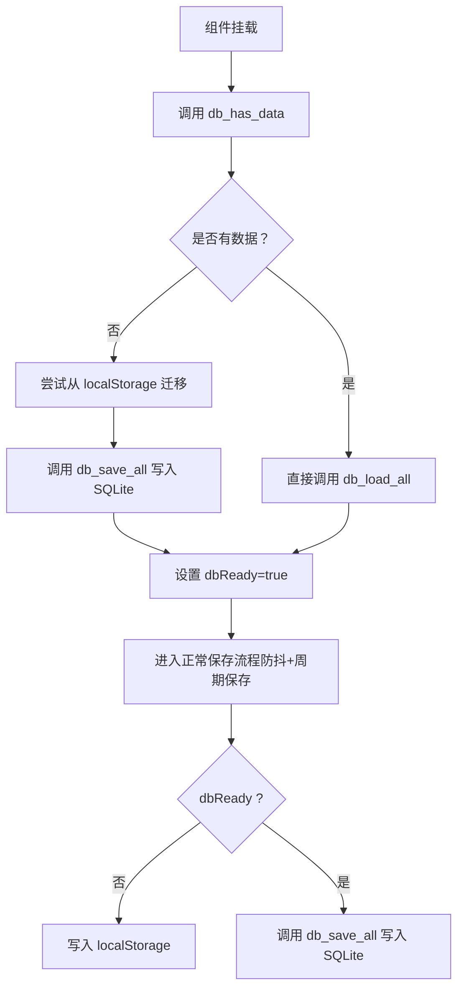
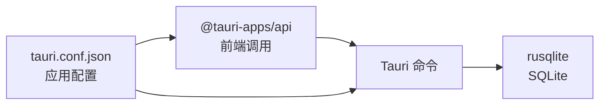

# 数据库问题

<cite>
**本文引用的文件**
- [src-tauri/src/db.rs](file://src-tauri/src/db.rs)
- [src-tauri/src/lib.rs](file://src-tauri/src/lib.rs)
- [src-tauri/Cargo.toml](file://src-tauri/Cargo.toml)
- [src-tauri/tauri.conf.json](file://src-tauri/tauri.conf.json)
- [src/hooks/useWorkspaces.ts](file://src/hooks/useWorkspaces.ts)
- [src/hooks/useLocalStorage.ts](file://src/hooks/useLocalStorage.ts)
</cite>

## 目录
1. [简介](#简介)
2. [项目结构](#项目结构)
3. [核心组件](#核心组件)
4. [架构总览](#架构总览)
5. [详细组件分析](#详细组件分析)
6. [依赖关系分析](#依赖关系分析)
7. [性能考量](#性能考量)
8. [故障排除指南](#故障排除指南)
9. [结论](#结论)
10. [附录](#附录)

## 简介
本指南聚焦 RabbitCoding 的 SQLite 数据库问题排查与修复，涵盖连接失败、数据库锁定、数据损坏、权限问题的诊断与处理；提供数据库文件完整性检查、并发访问冲突处理、损坏数据清理方法；给出备份与恢复流程、性能优化建议、存储空间管理策略；并包含错误消息解读、数据库迁移注意事项与权限配置检查步骤。

## 项目结构
RabbitCoding 的数据库逻辑位于 Tauri 后端模块中，采用 Rust + rusqlite 实现，SQLite 数据库存放在应用数据目录下的 rabbit.db。前端通过 Tauri 命令调用后端数据库接口，具备“数据库不可用时自动降级到 localStorage”的容错机制。

图示来源
- [src-tauri/src/db.rs:140-161](file://src-tauri/src/db.rs#L140-L161)
- [src-tauri/src/lib.rs:206-222](file://src-tauri/src/lib.rs#L206-L222)

章节来源
- [src-tauri/src/db.rs:80-161](file://src-tauri/src/db.rs#L80-L161)
- [src-tauri/src/lib.rs:206-222](file://src-tauri/src/lib.rs#L206-L222)

## 核心组件
- 数据库结构体与全局状态
  - Database 结构体封装了 SQLite 连接，并通过 Mutex 保证线程安全。
  - 初始化时执行建表与迁移脚本，确保模式一致。
- 数据模型
  - WorkspaceData、RabbitData、RepoData、TokenUsageData 等结构体定义了数据库表与序列化格式。
- Tauri 命令
  - db_load_all：查询并拼装完整数据为 JSON。
  - db_save_all：接收 JSON，事务内全量替换。
  - db_has_data：判断数据库是否有数据，用于迁移判定。
- 应用初始化
  - 在应用启动时创建 app_data_dir，构建 rabbit.db 路径并尝试初始化数据库；若失败则记录错误但不崩溃，前端据此降级。

章节来源
- [src-tauri/src/db.rs:80-161](file://src-tauri/src/db.rs#L80-L161)
- [src-tauri/src/db.rs:392-417](file://src-tauri/src/db.rs#L392-L417)
- [src-tauri/src/lib.rs:206-222](file://src-tauri/src/lib.rs#L206-L222)

## 架构总览
RabbitCoding 的数据库访问链路如下：

图示来源
- [src-tauri/src/db.rs:392-417](file://src-tauri/src/db.rs#L392-L417)
- [src-tauri/src/db.rs:167-288](file://src-tauri/src/db.rs#L167-L288)
- [src-tauri/src/db.rs:290-386](file://src-tauri/src/db.rs#L290-L386)
- [src-tauri/src/lib.rs:206-222](file://src-tauri/src/lib.rs#L206-L222)

## 详细组件分析

### 数据库模块（db.rs）
- 连接与初始化
  - 通过 Connection::open 打开或创建数据库文件。
  - 执行建表与索引初始化，启用 WAL、外键约束、同步模式等。
  - 执行列迁移（幂等），避免重复添加列导致失败。
- 读取流程（load_all）
  - 分步查询：workspaces → rabbits → messages → repos。
  - 将 JSON 字符串字段反序列化为结构体，组装为 Workspace[] JSON。
- 写入流程（save_all）
  - 事务内执行：先清空四表，再批量插入。
  - 消息表按序号 seq 存储，便于有序读取。
- 错误处理
  - 所有数据库操作均返回 Result，错误信息统一包装为字符串，便于前端捕获与提示。

图示来源
- [src-tauri/src/db.rs:290-305](file://src-tauri/src/db.rs#L290-L305)
- [src-tauri/src/db.rs:307-386](file://src-tauri/src/db.rs#L307-L386)

章节来源
- [src-tauri/src/db.rs:80-161](file://src-tauri/src/db.rs#L80-L161)
- [src-tauri/src/db.rs:167-288](file://src-tauri/src/db.rs#L167-L288)
- [src-tauri/src/db.rs:290-386](file://src-tauri/src/db.rs#L290-L386)

### 应用初始化与数据库装载（lib.rs）
- 初始化流程
  - 创建 app_data_dir，拼接 rabbit.db 路径。
  - 调用 Database::open 初始化数据库，失败时记录错误并继续运行。
- 命令注册
  - 将 db_load_all、db_save_all、db_has_data 注册为 Tauri 命令，供前端调用。
- 前端降级
  - 若数据库初始化失败，前端会回退到 localStorage 继续工作。

图示来源
- [src-tauri/src/lib.rs:206-222](file://src-tauri/src/lib.rs#L206-L222)
- [src-tauri/src/db.rs:140-161](file://src-tauri/src/db.rs#L140-L161)

章节来源
- [src-tauri/src/lib.rs:206-222](file://src-tauri/src/lib.rs#L206-L222)

### 前端数据库交互（useWorkspaces.ts）
- 首次加载
  - 调用 db_has_data 判断是否需要迁移。
  - 若无数据，尝试从 localStorage 迁移至 SQLite。
  - 从 db_load_all 加载完整数据，设置 dbReady 与 isLoading。
- 降级策略
  - 若 db_* 命令失败，回退到 localStorage 并继续使用。
- 保存策略
  - 双层防抖：500ms 防抖 + 3s 强制保存，保障流式输出场景的数据落盘。
  - 当 dbReady 为 false 时，写入 localStorage。

图示来源
- [src/hooks/useWorkspaces.ts:48-95](file://src/hooks/useWorkspaces.ts#L48-L95)
- [src/hooks/useWorkspaces.ts:100-129](file://src/hooks/useWorkspaces.ts#L100-L129)

章节来源
- [src/hooks/useWorkspaces.ts:48-95](file://src/hooks/useWorkspaces.ts#L48-L95)
- [src/hooks/useWorkspaces.ts:100-129](file://src/hooks/useWorkspaces.ts#L100-L129)

## 依赖关系分析
- Rust 依赖
  - rusqlite：SQLite 绑定，启用捆绑特性。
  - tauri：跨平台桌面框架，提供命令系统与插件生态。
- 构建与打包
  - tauri.conf.json 定义产品名称、窗口属性、资源与插件配置。
- 前端依赖
  - @tauri-apps/api：调用后端命令。
  - useLocalStorage：localStorage 工具，用于降级与迁移。

图示来源
- [src-tauri/Cargo.toml:20-40](file://src-tauri/Cargo.toml#L20-L40)
- [src-tauri/tauri.conf.json:1-52](file://src-tauri/tauri.conf.json#L1-L52)

章节来源
- [src-tauri/Cargo.toml:20-40](file://src-tauri/Cargo.toml#L20-L40)
- [src-tauri/tauri.conf.json:1-52](file://src-tauri/tauri.conf.json#L1-L52)

## 性能考量
- WAL 模式
  - 通过 PRAGMA journal_mode = WAL 提升并发读写性能，减少写入阻塞。
- 同步策略
  - PRAGMA synchronous = NORMAL 平衡可靠性与性能；如需更强一致性可考虑提升级别。
- 索引设计
  - 为 rabbits/workspace_id、repos/workspace_id、messages/rabbit_id+seq 建立索引，加速查询。
- 事务写入
  - 批量写入使用事务，显著降低写入成本与锁竞争。
- 读写分离
  - 读取流程分步查询，避免一次性大查询造成阻塞；写入流程集中在一个事务中。

章节来源
- [src-tauri/src/db.rs:85-138](file://src-tauri/src/db.rs#L85-L138)
- [src-tauri/src/db.rs:290-305](file://src-tauri/src/db.rs#L290-L305)

## 故障排除指南

### 一、数据库连接失败
- 现象
  - 前端调用 db_* 命令失败，控制台出现数据库初始化或命令执行错误。
- 诊断步骤
  - 检查应用数据目录是否存在且可写：应用启动时会在 app_data_dir 下创建 rabbit.db。
  - 确认数据库文件权限：确保当前用户对 rabbit.db 与父目录具有读写权限。
  - 检查 SQLite 版本与 rusqlite 绑定：确认运行环境的 SQLite 动态库版本兼容。
- 修复建议
  - 重新创建 app_data_dir 并赋予正确权限。
  - 如为便携版或受限环境，尝试将应用数据目录移动到用户可写路径。
  - 升级/更换 rusqlite 版本或使用系统自带 SQLite。
- 降级策略
  - 若初始化失败，应用会继续运行，前端自动回退到 localStorage。

章节来源
- [src-tauri/src/lib.rs:206-222](file://src-tauri/src/lib.rs#L206-L222)
- [src-tauri/src/db.rs:140-148](file://src-tauri/src/db.rs#L140-L148)
- [src/hooks/useWorkspaces.ts:74-92](file://src/hooks/useWorkspaces.ts#L74-L92)

### 二、数据库锁定（写入阻塞/无法提交）
- 现象
  - 写入 db_save_all 报错，提示数据库忙或无法获取锁。
- 诊断步骤
  - 检查是否存在长时间运行的读事务或并发写入。
  - 确认 WAL 日志文件未被意外删除或损坏。
- 修复建议
  - 确保写入流程使用事务并在短时间内完成。
  - 避免在其他进程/工具中同时打开同一数据库文件。
  - 重启应用释放潜在的锁持有者。
- 预防措施
  - 控制写入频率，利用前端的防抖与周期保存策略。
  - 将大体量写入拆分为更小批次。

章节来源
- [src-tauri/src/db.rs:290-305](file://src-tauri/src/db.rs#L290-L305)
- [src-tauri/src/db.rs:307-386](file://src-tauri/src/db.rs#L307-L386)

### 三、数据损坏与不一致
- 现象
  - 读取 db_load_all 失败或数据异常（如 JSON 字段反序列化错误）。
- 诊断步骤
  - 检查 messages.content 字段是否为合法 JSON。
  - 校验 token_usage 字段是否为合法 JSON。
- 修复建议
  - 清理损坏的 JSON 字段：将 messages.content 中非 JSON 字符串替换为空对象或删除该条目。
  - 重建索引与表结构：执行建表 SQL（WAL/外键/同步/索引）。
  - 通过事务全量重写：先删除旧数据，再插入修复后的数据。
- 预防措施
  - 写入前严格校验 JSON 序列化结果。
  - 使用事务保证多表一致性。

章节来源
- [src-tauri/src/db.rs:167-288](file://src-tauri/src/db.rs#L167-L288)
- [src-tauri/src/db.rs:307-386](file://src-tauri/src/db.rs#L307-L386)

### 四、权限问题
- 现象
  - 无法创建/写入 app_data_dir 或 rabbit.db。
- 诊断步骤
  - 检查当前用户对 app_data_dir 的写权限。
  - 检查磁盘空间与文件系统配额。
- 修复建议
  - 更改应用数据目录到用户可写路径。
  - 以管理员身份运行或调整目录权限。
  - 清理磁盘空间或禁用只读挂载。

章节来源
- [src-tauri/src/lib.rs:206-222](file://src-tauri/src/lib.rs#L206-L222)

### 五、数据库文件完整性检查
- 建议方法
  - 使用 SQLite 原生命令检查：pragma integrity_check；pragma foreign_key_check。
  - 检查 journal_mode 与 synchronous 设置是否符合预期。
  - 导出 schema 与统计信息，核对表结构与行数。
- 注意事项
  - 在离线状态下执行完整性检查，避免并发写入干扰。
  - 若发现损坏，优先备份后再尝试修复。

章节来源
- [src-tauri/src/db.rs:85-138](file://src-tauri/src/db.rs#L85-L138)

### 六、并发访问冲突处理
- 现象
  - 读写互相阻塞，写入超时。
- 解决方案
  - 使用 WAL 模式与短事务。
  - 避免长事务与长查询，必要时拆分。
  - 前端采用防抖与周期保存，减少高并发写入。

章节来源
- [src-tauri/src/db.rs:85-138](file://src-tauri/src/db.rs#L85-L138)
- [src-tauri/src/db.rs:290-305](file://src-tauri/src/db.rs#L290-L305)

### 七、备份与恢复流程
- 备份
  - 关闭应用后复制 rabbit.db 与其 WAL/SHM 文件（如使用 WAL）。
  - 建议同时导出 schema 与关键表数据作为文本备份。
- 恢复
  - 停止应用，将备份文件覆盖原文件。
  - 启动应用验证 db_has_data 与 db_load_all 正常。
- 迁移
  - 首次启动若无数据，尝试从 localStorage 迁移；迁移成功后删除旧数据。

章节来源
- [src/hooks/useWorkspaces.ts:52-65](file://src/hooks/useWorkspaces.ts#L52-L65)
- [src-tauri/src/db.rs:408-417](file://src-tauri/src/db.rs#L408-L417)

### 八、存储空间管理
- 建议
  - 定期清理不再使用的 rabbits/repo 数据。
  - 控制 messages 表增长：限制历史消息数量或定期归档。
  - 监控 app_data_dir 磁盘占用，及时清理临时文件。

章节来源
- [src-tauri/src/db.rs:307-386](file://src-tauri/src/db.rs#L307-L386)

### 九、错误消息解读与定位
- 常见错误类型
  - “Failed to open database”：文件不存在、权限不足、路径不可写。
  - “Failed to initialize schema”：SQLite 版本或绑定不兼容、WAL 文件异常。
  - “Insert/Query/Serialize failed”：数据格式不合法（JSON）、外键约束冲突。
  - “Debounced save failed”：数据库繁忙或锁冲突。
- 定位方法
  - 查看应用启动日志与命令返回值。
  - 在前端控制台观察 db_* 命令调用链与错误堆栈。
  - 使用 SQLite 原生命令检查完整性与索引状态。

章节来源
- [src-tauri/src/db.rs:140-148](file://src-tauri/src/db.rs#L140-L148)
- [src-tauri/src/db.rs:307-386](file://src-tauri/src/db.rs#L307-L386)
- [src/hooks/useWorkspaces.ts:104-108](file://src/hooks/useWorkspaces.ts#L104-L108)

### 十、数据库迁移问题处理
- 场景
  - 新版本增加列或表结构变化。
- 处理方式
  - 使用幂等 ALTER TABLE 语句，忽略重复列错误。
  - 首次启动检测 db_has_data，必要时从 localStorage 迁移。
- 验证
  - 迁移后执行完整性检查与基本查询验证。

章节来源
- [src-tauri/src/db.rs:149-156](file://src-tauri/src/db.rs#L149-L156)
- [src-tauri/src/db.rs:408-417](file://src-tauri/src/db.rs#L408-L417)
- [src/hooks/useWorkspaces.ts:52-65](file://src/hooks/useWorkspaces.ts#L52-L65)

### 十一、权限配置检查步骤
- 目录权限
  - 确认 app_data_dir 可创建、可写。
- 文件权限
  - 确认 rabbit.db、wal/shm 文件可读写。
- 磁盘空间
  - 确保剩余空间足以容纳数据库文件与 WAL 日志。
- 系统策略
  - 检查只读文件系统、沙盒策略、安全软件拦截。

章节来源
- [src-tauri/src/lib.rs:206-222](file://src-tauri/src/lib.rs#L206-L222)

## 结论
RabbitCoding 的数据库模块通过 WAL、事务与索引设计实现了较好的并发与性能表现；应用在初始化失败时具备自动降级能力，提升了用户体验。针对连接失败、锁定、损坏与权限问题，建议结合本指南的诊断与修复步骤，配合备份与恢复流程，快速定位并解决问题。同时，遵循性能与存储管理建议，可有效降低故障发生概率并提升系统稳定性。

## 附录
- 前端降级与迁移逻辑参考
  - [src/hooks/useWorkspaces.ts:48-95](file://src/hooks/useWorkspaces.ts#L48-L95)
  - [src/hooks/useLocalStorage.ts:1-27](file://src/hooks/useLocalStorage.ts#L1-L27)
- 数据库命令与初始化参考
  - [src-tauri/src/db.rs:392-417](file://src-tauri/src/db.rs#L392-L417)
  - [src-tauri/src/lib.rs:206-222](file://src-tauri/src/lib.rs#L206-L222)
- 依赖与配置参考
  - [src-tauri/Cargo.toml:20-40](file://src-tauri/Cargo.toml#L20-L40)
  - [src-tauri/tauri.conf.json:1-52](file://src-tauri/tauri.conf.json#L1-L52)