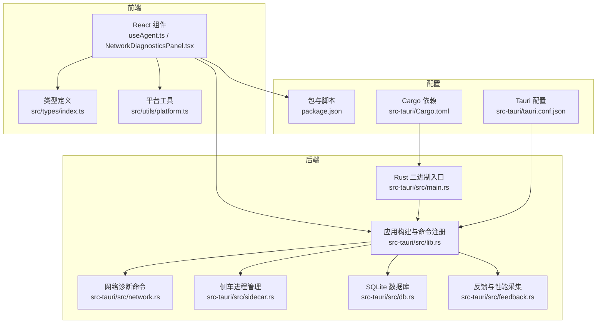
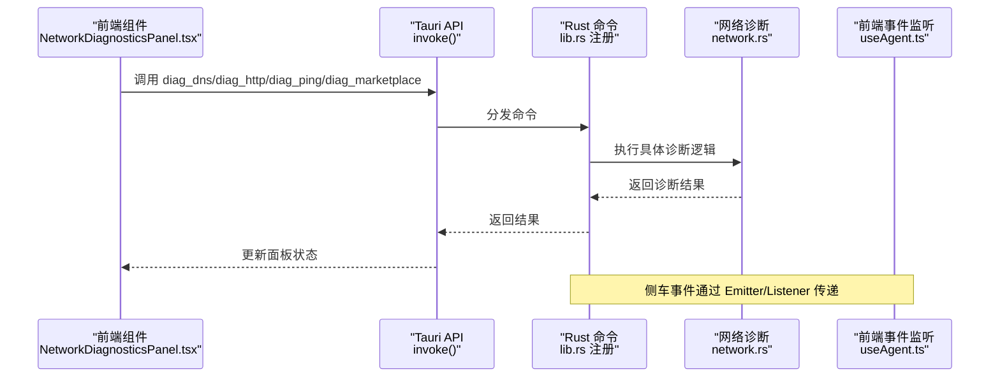
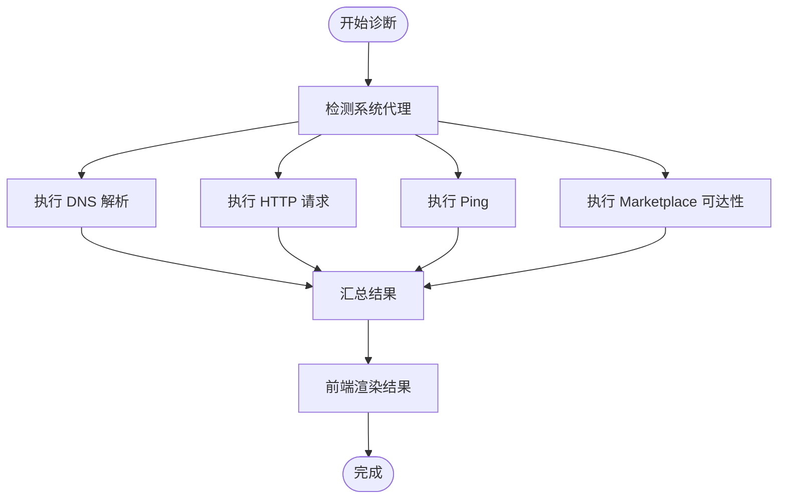
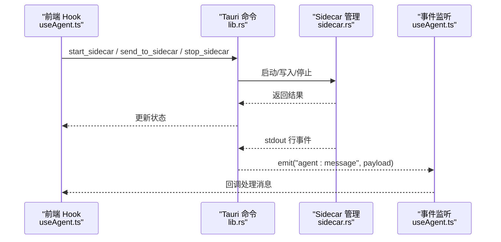
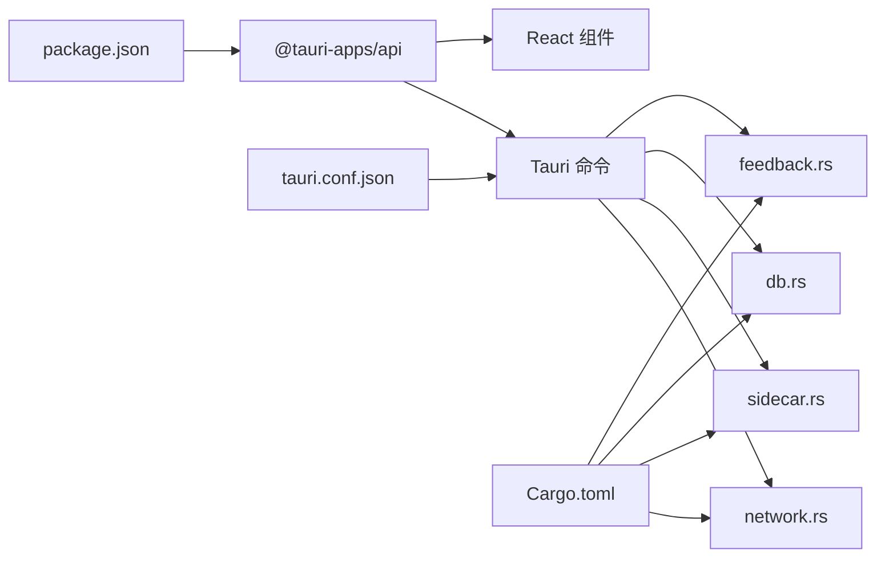

# 调试工具和技巧

<cite>
**本文引用的文件**
- [README.md](file://README.md)
- [package.json](file://package.json)
- [Cargo.toml](file://src-tauri/Cargo.toml)
- [tauri.conf.json](file://src-tauri/tauri.conf.json)
- [main.rs](file://src-tauri/src/main.rs)
- [lib.rs](file://src-tauri/src/lib.rs)
- [network.rs](file://src-tauri/src/network.rs)
- [sidecar.rs](file://src-tauri/src/sidecar.rs)
- [db.rs](file://src-tauri/src/db.rs)
- [feedback.rs](file://src-tauri/src/feedback.rs)
- [NetworkDiagnosticsPanel.tsx](file://src/components/settings/NetworkDiagnosticsPanel.tsx)
- [useAgent.ts](file://src/hooks/useAgent.ts)
- [platform.ts](file://src/utils/platform.ts)
- [index.ts](file://src/types/index.ts)
</cite>

## 目录
1. [简介](#简介)
2. [项目结构](#项目结构)
3. [核心组件](#核心组件)
4. [架构总览](#架构总览)
5. [详细组件分析](#详细组件分析)
6. [依赖关系分析](#依赖关系分析)
7. [性能考虑](#性能考虑)
8. [故障排查指南](#故障排查指南)
9. [结论](#结论)
10. [附录](#附录)

## 简介
本指南面向 RabbitCoding 的开发者与高级用户，聚焦于实际可用的调试方法与技巧，涵盖浏览器开发者工具、Rust 调试器、日志分析与诊断工具链。内容包括：
- 如何启用与查看详细日志
- 如何收集诊断信息与系统性能指标
- 如何分析错误堆栈与定位问题
- 断点设置与异步流程跟踪
- 性能分析、内存泄漏检测与网络请求监控
- 常见调试场景的实操步骤与建议

## 项目结构
RabbitCoding 是一个基于 Tauri + React + TypeScript 的桌面应用，前端使用 Vite 构建，后端 Rust 提供系统能力与命令桥接。调试相关的关键位置如下：
- 前端：React 组件、Hooks、国际化与类型定义
- 后端：Tauri 命令与插件、网络诊断、侧车进程管理、数据库、反馈上报
- 配置：Vite、Tauri、Cargo

图表来源
- [main.rs:1-7](file://src-tauri/src/main.rs#L1-L7)
- [lib.rs:196-390](file://src-tauri/src/lib.rs#L196-L390)
- [network.rs:1-800](file://src-tauri/src/network.rs#L1-L800)
- [sidecar.rs:1-359](file://src-tauri/src/sidecar.rs#L1-L359)
- [db.rs:1-417](file://src-tauri/src/db.rs#L1-L417)
- [feedback.rs:1-282](file://src-tauri/src/feedback.rs#L1-L282)
- [NetworkDiagnosticsPanel.tsx:1-425](file://src/components/settings/NetworkDiagnosticsPanel.tsx#L1-L425)
- [useAgent.ts:1-334](file://src/hooks/useAgent.ts#L1-L334)
- [platform.ts:1-19](file://src/utils/platform.ts#L1-L19)
- [index.ts:1-733](file://src/types/index.ts#L1-L733)
- [package.json:1-46](file://package.json#L1-L46)
- [tauri.conf.json:1-52](file://src-tauri/tauri.conf.json#L1-L52)
- [Cargo.toml:1-40](file://src-tauri/Cargo.toml#L1-L40)

章节来源
- [README.md:1-8](file://README.md#L1-L8)
- [package.json:1-46](file://package.json#L1-L46)
- [tauri.conf.json:1-52](file://src-tauri/tauri.conf.json#L1-L52)
- [Cargo.toml:1-40](file://src-tauri/Cargo.toml#L1-L40)

## 核心组件
- 网络诊断模块：提供 DNS、HTTP、Ping、Marketplace 的诊断命令与前端面板，支持并行执行与结果可视化。
- 侧车进程管理：负责启动/停止 Claude Agent SDK Sidecar，转发消息与事件，处理 stderr 日志输出。
- 数据库模块：封装 SQLite 存储，提供工作区、兔子会话、仓库与消息的持久化。
- 反馈与性能采集：采集系统信息、WebView 指标与应用性能，支持截图与反馈提交。
- 前端 Hooks：useAgent 管理 Sidecar 生命周期、事件监听、查询看门狗与思考态处理。

章节来源
- [network.rs:1-800](file://src-tauri/src/network.rs#L1-L800)
- [NetworkDiagnosticsPanel.tsx:1-425](file://src/components/settings/NetworkDiagnosticsPanel.tsx#L1-L425)
- [sidecar.rs:1-359](file://src-tauri/src/sidecar.rs#L1-L359)
- [useAgent.ts:1-334](file://src/hooks/useAgent.ts#L1-L334)
- [db.rs:1-417](file://src-tauri/src/db.rs#L1-L417)
- [feedback.rs:1-282](file://src-tauri/src/feedback.rs#L1-L282)

## 架构总览
RabbitCoding 的调试相关架构围绕“前端命令调用 + Rust 命令实现 + 事件驱动”的模式展开。前端通过 @tauri-apps/api 调用 invoke，Rust 侧通过 tauri::command 注册命令；事件通过 Emitter/Listener 在前端与后端之间传递。

图表来源
- [NetworkDiagnosticsPanel.tsx:343-370](file://src/components/settings/NetworkDiagnosticsPanel.tsx#L343-L370)
- [lib.rs:344-387](file://src-tauri/src/lib.rs#L344-L387)
- [network.rs:366-550](file://src-tauri/src/network.rs#L366-L550)
- [useAgent.ts:262-320](file://src/hooks/useAgent.ts#L262-L320)

## 详细组件分析

### 网络诊断组件与命令
- 前端面板 NetworkDiagnosticsPanel.tsx 并行触发四个诊断命令，分别映射到 Rust 的 diag_dns、diag_http、diag_ping、diag_marketplace。
- Rust 网络模块 network.rs 实现跨平台的 DNS 解析、HTTP 连通性、Ping 与 Marketplace 可达性检测，并输出统一的数据结构。
- 诊断结果通过前端状态机渲染，包含代理信息、响应时间、协议版本、丢包率等关键指标。

图表来源
- [network.rs:100-201](file://src-tauri/src/network.rs#L100-L201)
- [network.rs:366-550](file://src-tauri/src/network.rs#L366-L550)
- [NetworkDiagnosticsPanel.tsx:343-370](file://src/components/settings/NetworkDiagnosticsPanel.tsx#L343-L370)

章节来源
- [NetworkDiagnosticsPanel.tsx:1-425](file://src/components/settings/NetworkDiagnosticsPanel.tsx#L1-L425)
- [network.rs:1-800](file://src-tauri/src/network.rs#L1-L800)

### 侧车进程与事件流
- sidecar.rs 负责启动/停止 Claude Agent SDK Sidecar，注入环境变量，转发消息与事件。
- useAgent.ts 管理 Sidecar 生命周期、事件监听、查询看门狗与“思考态”识别，确保长时间静默不会误判超时。
- 侧车 stderr 输出通过 eprintln 打印到控制台，便于快速定位问题。

图表来源
- [sidecar.rs:60-214](file://src-tauri/src/sidecar.rs#L60-L214)
- [lib.rs:353-356](file://src-tauri/src/lib.rs#L353-L356)
- [useAgent.ts:106-151](file://src/hooks/useAgent.ts#L106-L151)
- [useAgent.ts:262-320](file://src/hooks/useAgent.ts#L262-L320)

章节来源
- [sidecar.rs:1-359](file://src-tauri/src/sidecar.rs#L1-L359)
- [useAgent.ts:1-334](file://src/hooks/useAgent.ts#L1-L334)

### 数据库与持久化
- db.rs 提供工作区、兔子会话、仓库与消息的建表、迁移与读写接口，采用事务批量保存，支持序列化/反序列化。
- 通过 db_load_all/db_save_all 命令在前端与后端之间交换完整数据集，便于备份/恢复与问题复现。

章节来源
- [db.rs:1-417](file://src-tauri/src/db.rs#L1-L417)
- [lib.rs:357-360](file://src-tauri/src/lib.rs#L357-L360)

### 反馈与性能采集
- feedback.rs 支持截取应用窗口、收集系统信息与性能指标（应用内存/CPU、系统内存/CPU、WebView 指标），并提交到服务端。
- 前端通过 @tauri-apps/api 调用 capture_app_window、collect_system_info、collect_performance_metrics、submit_feedback。

章节来源
- [feedback.rs:1-282](file://src-tauri/src/feedback.rs#L1-L282)
- [NetworkDiagnosticsPanel.tsx:318-425](file://src/components/settings/NetworkDiagnosticsPanel.tsx#L318-L425)

## 依赖关系分析
- 前端依赖 @tauri-apps/api 进行命令调用与事件监听；依赖 Ant Design、Monaco Editor、Xterm 等 UI/编辑能力。
- 后端依赖 tauri、rusqlite、reqwest、sysinfo、xcap 等 crates；启用 devtools 功能以便在开发期打开调试工具。
- 配置层面，Vite 与 Tauri CLI 提供开发与打包流程；Cargo.toml 管理 Rust 依赖与构建特性。

图表来源
- [package.json:14-36](file://package.json#L14-L36)
- [Cargo.toml:20-39](file://src-tauri/Cargo.toml#L20-L39)
- [tauri.conf.json:6-11](file://src-tauri/tauri.conf.json#L6-L11)
- [lib.rs:196-390](file://src-tauri/src/lib.rs#L196-L390)

章节来源
- [package.json:1-46](file://package.json#L1-L46)
- [Cargo.toml:1-40](file://src-tauri/Cargo.toml#L1-L40)
- [tauri.conf.json:1-52](file://src-tauri/tauri.conf.json#L1-L52)

## 性能考虑
- 网络诊断采用 tokio::task::spawn_blocking 并行执行，避免阻塞主线程。
- 侧车 stdout/stderr 分别在独立线程中读取，减少阻塞风险。
- 数据库批量保存使用事务，降低 I/O 次数与锁竞争。
- 建议在生产构建中通过环境变量与配置调整日志级别，避免过度输出影响性能。

## 故障排查指南

### 启用与查看日志
- 开发期：在 Tauri 配置中启用 devtools，启动应用后按 F12 打开开发者工具查看 Console 与网络面板。
- 侧车日志：stderr 输出通过 eprintln 打印到控制台，便于快速定位问题。
- 窗口状态事件：窗口尺寸/移动/关闭事件会打印调试日志，有助于定位布局与多屏问题。

章节来源
- [tauri.conf.json:22-24](file://src-tauri/tauri.conf.json#L22-L24)
- [lib.rs:285-330](file://src-tauri/src/lib.rs#L285-L330)
- [sidecar.rs:196-208](file://src-tauri/src/sidecar.rs#L196-L208)

### 收集诊断信息
- 网络诊断：在设置页的网络诊断面板点击“开始诊断”，并行执行 DNS、HTTP、Ping、Marketplace 检测，查看代理、响应时间、协议版本等。
- 反馈采集：调用 capture_app_window、collect_system_info、collect_performance_metrics，组合为 FeedbackPayload 提交。

章节来源
- [NetworkDiagnosticsPanel.tsx:318-425](file://src/components/settings/NetworkDiagnosticsPanel.tsx#L318-L425)
- [feedback.rs:119-281](file://src-tauri/src/feedback.rs#L119-L281)

### 分析错误堆栈与定位问题
- 侧车异常：关注 stderr 输出与 agent:sidecar-exit 事件，结合查询看门狗超时策略定位卡死或无响应场景。
- 网络异常：根据 DNS/HTTP/Ping/MKP 的 status/error 字段定位具体环节与错误原因。
- 数据库异常：检查建表/迁移 SQL 与事务提交逻辑，必要时导出数据库文件进行离线分析。

章节来源
- [useAgent.ts:262-320](file://src/hooks/useAgent.ts#L262-L320)
- [network.rs:207-375](file://src-tauri/src/network.rs#L207-L375)
- [db.rs:140-161](file://src-tauri/src/db.rs#L140-L161)

### 断点设置与异步跟踪
- 前端断点：在 NetworkDiagnosticsPanel.tsx 的 invoke 调用处设置断点，观察并行执行与错误分支。
- 侧车断点：在 sidecar.rs 的 stdout/stderr 线程中设置断点，验证事件发射与前端接收。
- 异步流程：useAgent.ts 的事件监听与定时器需注意 StrictMode 下的清理逻辑，避免竞态与泄漏。

章节来源
- [NetworkDiagnosticsPanel.tsx:343-370](file://src/components/settings/NetworkDiagnosticsPanel.tsx#L343-L370)
- [sidecar.rs:175-208](file://src-tauri/src/sidecar.rs#L175-L208)
- [useAgent.ts:262-320](file://src/hooks/useAgent.ts#L262-L320)

### 性能分析与内存泄漏检测
- WebView 指标：通过 WebviewMetrics（domElements、jsHeap、timing）评估前端性能瓶颈。
- 系统与应用指标：使用 sysinfo 收集 CPU/内存使用率，结合应用日志定位资源占用异常。
- 建议：定期导出数据库快照与日志，对比不同版本的性能曲线。

章节来源
- [feedback.rs:195-235](file://src-tauri/src/feedback.rs#L195-L235)
- [index.ts:661-676](file://src/types/index.ts#L661-L676)

### 网络请求监控
- 使用浏览器开发者工具的 Network 面板监控前端发起的请求。
- 对比 Rust 侧 network.rs 的诊断结果，核对代理、TLS 版本、响应时间与状态码。
- 若出现代理冲突或证书问题，优先检查系统代理与证书链。

章节来源
- [network.rs:391-550](file://src-tauri/src/network.rs#L391-L550)
- [tauri.conf.json:22-24](file://src-tauri/tauri.conf.json#L22-L24)

### 常见场景与解决方案
- 侧车无法启动：检查环境变量注入、CLAUDE_CONFIG_DIR 隔离与进程存活状态。
- 事件未到达：确认事件发射与监听的生命周期，避免 StrictMode 导致的提前清理。
- 数据库损坏：导出现有数据，重建数据库并导入，观察问题是否复现。
- 反馈提交失败：检查网络连通性与服务端返回状态，记录响应体用于定位。

章节来源
- [sidecar.rs:96-150](file://src-tauri/src/sidecar.rs#L96-L150)
- [useAgent.ts:262-320](file://src/hooks/useAgent.ts#L262-L320)
- [db.rs:290-305](file://src-tauri/src/db.rs#L290-L305)
- [feedback.rs:237-281](file://src-tauri/src/feedback.rs#L237-L281)

## 结论
RabbitCoding 的调试体系以“命令 + 事件 + 诊断 + 采集”为核心，覆盖前端、后端与系统层面。通过合理利用浏览器开发者工具、Rust 调试器与内置诊断命令，可以高效定位网络、进程、存储与性能问题。建议在日常开发中：
- 保持最小化日志输出，仅在调试期开启详细日志
- 使用并行诊断与事件监听，缩短问题定位时间
- 定期导出数据库与日志，建立回归分析基线
- 在生产构建中严格控制环境变量与外部依赖，避免污染

## 附录

### 调试命令与工具配置速查
- 启动与开发
  - 启动前端开发服务器：参见 package.json 的 scripts
  - 启动 Tauri 应用：参见 package.json 的 scripts
- Rust 调试
  - 在 Cargo.toml 中启用 devtools，参见 tauri.conf.json 的 security.csp
  - 在 main.rs 中保留 windows_subsystem 配置，避免额外控制台
- 网络诊断
  - 前端：NetworkDiagnosticsPanel.tsx 的 runDiagnostics
  - 后端：diag_dns/diag_http/diag_ping/diag_marketplace
- 侧车调试
  - start_sidecar/send_to_sidecar/stop_sidecar/get_sidecar_status
  - 关注 stderr 输出与 agent:message/agent:sidecar-exit 事件
- 数据库
  - db_load_all/db_save_all/db_has_data
- 反馈与性能
  - capture_app_window/collect_system_info/collect_performance_metrics/submit_feedback

章节来源
- [package.json:7-12](file://package.json#L7-L12)
- [tauri.conf.json:22-24](file://src-tauri/tauri.conf.json#L22-L24)
- [main.rs:1-7](file://src-tauri/src/main.rs#L1-L7)
- [lib.rs:344-387](file://src-tauri/src/lib.rs#L344-L387)
- [NetworkDiagnosticsPanel.tsx:318-425](file://src/components/settings/NetworkDiagnosticsPanel.tsx#L318-L425)
- [sidecar.rs:60-279](file://src-tauri/src/sidecar.rs#L60-L279)
- [db.rs:392-416](file://src-tauri/src/db.rs#L392-L416)
- [feedback.rs:119-281](file://src-tauri/src/feedback.rs#L119-L281)