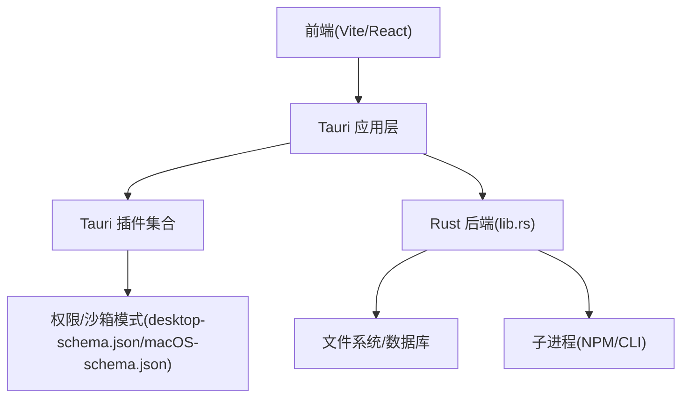
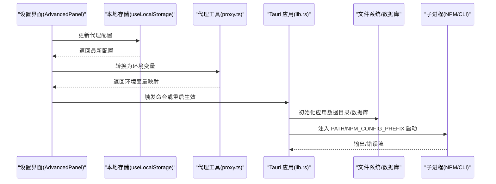
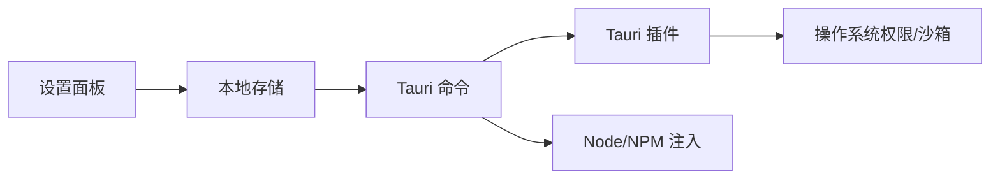
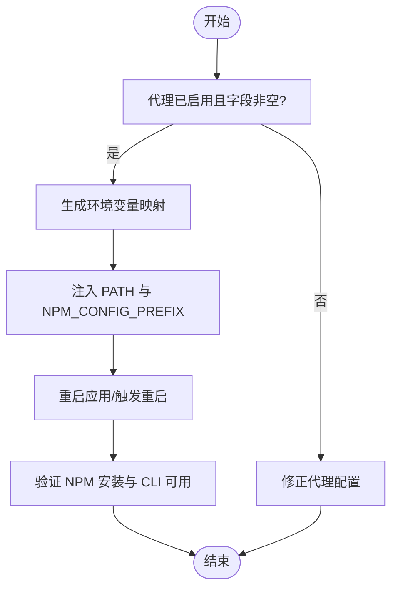

# 配置问题

<cite>
**本文引用的文件**
- [tauri.conf.json](file://src-tauri/tauri.conf.json)
- [package.json](file://package.json)
- [Cargo.toml](file://src-tauri/Cargo.toml)
- [lib.rs](file://src-tauri/src/lib.rs)
- [gitnexus.rs](file://src-tauri/src/gitnexus.rs)
- [db.rs](file://src-tauri/src/db.rs)
- [proxy.ts](file://src/utils/proxy.ts)
- [AdvancedPanel.tsx](file://src/components/settings/AdvancedPanel.tsx)
- [McpEditModal.tsx](file://src/components/settings/McpEditModal.tsx)
- [GeneralPanel.tsx](file://src/components/settings/GeneralPanel.tsx)
- [useLocalStorage.ts](file://src/hooks/useLocalStorage.ts)
- [main.rs](file://src-tauri/src/main.rs)
- [desktop-schema.json](file://src-tauri/gen/schemas/desktop-schema.json)
- [macOS-schema.json](file://src-tauri/gen/schemas/macOS-schema.json)
</cite>

## 目录
1. [简介](#简介)
2. [项目结构](#项目结构)
3. [核心组件](#核心组件)
4. [架构总览](#架构总览)
5. [详细组件分析](#详细组件分析)
6. [依赖分析](#依赖分析)
7. [性能考虑](#性能考虑)
8. [故障排除指南](#故障排除指南)
9. [结论](#结论)
10. [附录](#附录)

## 简介
本文件面向 RabbitCoding 的配置问题，提供系统化的诊断与修复方法，覆盖以下方面：
- 配置文件错误：Tauri 配置、前端构建与打包配置、Rust 依赖清单
- 环境变量问题：代理配置、Node/NPM 运行时注入、子进程环境传递
- 权限配置错误：文件系统访问范围、沙箱策略、平台特定权限
- 路径设置问题：资源路径、应用数据目录、Node 运行时路径
- 配置冲突与验证：代理与网络诊断、MCP 服务配置校验、本地存储回退
- 配置重置与迁移：默认配置恢复、数据库迁移、本地存储清理

## 项目结构
RabbitCoding 采用前端 + Tauri 后端混合架构，配置相关的关键位置如下：
- 前端构建与脚本：package.json
- Tauri 应用配置：src-tauri/tauri.conf.json
- Rust 依赖与插件：src-tauri/Cargo.toml
- 应用入口与插件初始化：src-tauri/src/lib.rs、src-tauri/src/main.rs
- 设置面板与本地存储：src/components/settings/*.tsx、src/hooks/useLocalStorage.ts
- 网络代理与环境变量转换：src/utils/proxy.ts
- GitNexus/NPM 子进程与环境注入：src-tauri/src/gitnexus.rs
- 数据库与迁移：src-tauri/src/db.rs
- 平台沙箱与权限模式：src-tauri/gen/schemas/desktop-schema.json、macOS-schema.json

图表来源
- [lib.rs:197-390](file://src-tauri/src/lib.rs#L197-L390)
- [tauri.conf.json:1-52](file://src-tauri/tauri.conf.json#L1-L52)
- [package.json:1-46](file://package.json#L1-L46)
- [Cargo.toml:1-40](file://src-tauri/Cargo.toml#L1-L40)

章节来源
- [tauri.conf.json:1-52](file://src-tauri/tauri.conf.json#L1-L52)
- [package.json:1-46](file://package.json#L1-L46)
- [Cargo.toml:1-40](file://src-tauri/Cargo.toml#L1-L40)

## 核心组件
- Tauri 应用配置与打包：定义产品信息、窗口属性、安全策略、资源与图标、深链 Scheme
- Rust 插件与命令：窗口状态、对话框、文件系统、终端、通知、深链、侧车进程、数据库、网络诊断、集成与认证
- 本地存储与设置：主题、语言、通知偏好、代理配置、MCP 服务配置
- 环境变量与代理：统一代理配置到环境变量映射，注入 PATH 与 NPM_CONFIG_PREFIX
- 子进程与 Node/NPM：生产模式注入内置 Node/NPM，设置全局前缀，确保可写目录
- 数据库与迁移：初始化与列迁移，降级到本地存储

章节来源
- [lib.rs:197-390](file://src-tauri/src/lib.rs#L197-L390)
- [AdvancedPanel.tsx:1-101](file://src/components/settings/AdvancedPanel.tsx#L1-L101)
- [proxy.ts:1-61](file://src/utils/proxy.ts#L1-L61)
- [gitnexus.rs:135-379](file://src-tauri/src/gitnexus.rs#L135-L379)
- [db.rs:146-416](file://src-tauri/src/db.rs#L146-L416)

## 架构总览
下图展示配置相关的关键交互：前端设置影响后端命令与子进程环境，后端负责注入运行时与权限策略。

图表来源
- [AdvancedPanel.tsx:13-101](file://src/components/settings/AdvancedPanel.tsx#L13-L101)
- [useLocalStorage.ts:1-27](file://src/hooks/useLocalStorage.ts#L1-L27)
- [proxy.ts:17-47](file://src/utils/proxy.ts#L17-L47)
- [lib.rs:226-283](file://src-tauri/src/lib.rs#L226-L283)
- [gitnexus.rs:135-174](file://src-tauri/src/gitnexus.rs#L135-L174)

## 详细组件分析

### Tauri 应用配置与打包
- 产品与窗口：名称、版本、标识符、窗口尺寸与标题栏样式
- 安全策略：CSP 设为 null（需结合业务评估风险）
- 打包资源：包含 sidecar 与 node-runtime 资源目录
- 图标与平台：多尺寸图标与 macOS entitlements
- 深链：自定义 scheme 注册

章节来源
- [tauri.conf.json:1-52](file://src-tauri/tauri.conf.json#L1-L52)

### 前端构建与脚本
- 开发与构建：dev/build/preview/tauri 脚本
- 包管理器：pnpm 版本锁定
- 依赖：React、Ant Design、Monaco Editor、TailwindCSS、Tauri 插件等

章节来源
- [package.json:1-46](file://package.json#L1-L46)

### Rust 依赖与插件
- 核心：tauri、serde、rusqlite、reqwest、image、tauri-plugin-* 等
- 功能插件：opener、pty、shell、dialog、fs、notification、deep-link、window-state

章节来源
- [Cargo.toml:1-40](file://src-tauri/Cargo.toml#L1-L40)

### 应用入口与插件初始化
- 入口：main.rs 设置 Windows 子系统
- 初始化：注册插件、创建应用数据目录、初始化数据库、注入 Node/NPM 环境、注册深链、监听窗口事件

章节来源
- [main.rs:1-7](file://src-tauri/src/main.rs#L1-L7)
- [lib.rs:197-390](file://src-tauri/src/lib.rs#L197-L390)

### 本地存储与设置面板
- 本地存储：封装 localStorage 读写，异常兜底
- 通用设置：语言、主题、通知、偏好、隐私
- 高级设置：代理开关与字段、重启提示

章节来源
- [useLocalStorage.ts:1-27](file://src/hooks/useLocalStorage.ts#L1-L27)
- [GeneralPanel.tsx:1-250](file://src/components/settings/GeneralPanel.tsx#L1-L250)
- [AdvancedPanel.tsx:1-101](file://src/components/settings/AdvancedPanel.tsx#L1-L101)

### 代理配置与环境变量
- 默认代理配置：启用标志、HTTP/HTTPS/SOCKS、no_proxy
- 环境变量映射：大小写兼容、仅在启用且非空时注入
- 指纹：基于配置序列化，用于检测变更

章节来源
- [proxy.ts:1-61](file://src/utils/proxy.ts#L1-L61)

### 子进程与 Node/NPM 环境注入
- 生产模式注入内置 Node/NPM：修改 PATH，设置 NPM_CONFIG_PREFIX 指向可写目录
- 子进程继承：所有 sidecar、MCP、ecc、gitnexus 等均继承新环境
- GitNexus/NPM：检测内置运行时与 CLI，执行命令并处理输出/错误

章节来源
- [lib.rs:226-283](file://src-tauri/src/lib.rs#L226-L283)
- [gitnexus.rs:135-174](file://src-tauri/src/gitnexus.rs#L135-L174)

### 数据库与迁移
- 初始化：创建应用数据目录与数据库文件
- 迁移：列级迁移（幂等），忽略重复列错误
- 降级：数据库初始化失败时，前端检测并降级到本地存储

章节来源
- [lib.rs:206-222](file://src-tauri/src/lib.rs#L206-L222)
- [db.rs:146-161](file://src-tauri/src/db.rs#L146-L161)

### 平台沙箱与权限模式
- 桌面与 macOS 模式：定义文件系统访问范围、命令执行范围、深链注册等
- 配置冲突：若前端命令超出权限范围，需在能力文件中显式授权

章节来源
- [desktop-schema.json:4591-4847](file://src-tauri/gen/schemas/desktop-schema.json#L4591-L4847)
- [macOS-schema.json:4591-4847](file://src-tauri/gen/schemas/macOS-schema.json#L4591-L4847)

## 依赖分析
- 前端到后端：设置面板通过本地存储与命令调用影响后端行为
- 后端到系统：插件与命令依赖平台权限与沙箱策略
- 运行时依赖：生产模式注入内置 Node/NPM，确保可写全局前缀

图表来源
- [AdvancedPanel.tsx:13-101](file://src/components/settings/AdvancedPanel.tsx#L13-L101)
- [useLocalStorage.ts:1-27](file://src/hooks/useLocalStorage.ts#L1-L27)
- [lib.rs:197-390](file://src-tauri/src/lib.rs#L197-L390)
- [desktop-schema.json:4591-4847](file://src-tauri/gen/schemas/desktop-schema.json#L4591-L4847)

章节来源
- [lib.rs:197-390](file://src-tauri/src/lib.rs#L197-L390)
- [desktop-schema.json:4591-4847](file://src-tauri/gen/schemas/desktop-schema.json#L4591-L4847)

## 性能考虑
- 窗口状态持久化：窗口尺寸与位置变更时保存，减少重复 IO
- 数据库迁移幂等：避免重复列导致的失败
- 代理配置指纹：仅在配置变化时触发重启，降低无效重启

## 故障排除指南

### 一、配置文件错误
- Tauri 配置校验
  - 检查字段类型与取值范围：如窗口宽高、CSP、资源路径、图标路径
  - 资源路径有效性：确认 resources/sidecar 与 resources/node-runtime 存在
  - 深链 Scheme：确保 scheme 已注册
- 前端构建配置
  - devUrl 与前端端口一致，避免跨域或无法加载
  - 前端 dist 路径与 build 前端输出一致
- Rust 依赖
  - 插件版本与 Tauri 版本兼容
  - 必需插件（fs、dialog、pty、notification、deep-link、window-state）已启用

章节来源
- [tauri.conf.json:6-11](file://src-tauri/tauri.conf.json#L6-L11)
- [tauri.conf.json:26-43](file://src-tauri/tauri.conf.json#L26-L43)
- [tauri.conf.json:44-50](file://src-tauri/tauri.conf.json#L44-L50)
- [package.json:7-12](file://package.json#L7-L12)
- [Cargo.toml:20-39](file://src-tauri/Cargo.toml#L20-L39)

### 二、环境变量问题
- 代理配置未生效
  - 检查代理开关与字段是否为空
  - 确认已转换为环境变量（HTTP_PROXY、HTTPS_PROXY、ALL_PROXY、NO_PROXY）
  - 重启应用或触发重启流程
- Node/NPM 权限问题
  - 生产模式下 PATH 是否包含内置 node/bin 与 npm-global/bin
  - NPM_CONFIG_PREFIX 是否指向可写目录（应用数据目录）
  - 子进程是否继承新环境变量

图表来源
- [proxy.ts:17-47](file://src/utils/proxy.ts#L17-L47)
- [lib.rs:253-283](file://src-tauri/src/lib.rs#L253-L283)
- [gitnexus.rs:135-174](file://src-tauri/src/gitnexus.rs#L135-L174)

章节来源
- [proxy.ts:1-61](file://src/utils/proxy.ts#L1-L61)
- [lib.rs:226-283](file://src-tauri/src/lib.rs#L226-L283)
- [gitnexus.rs:135-174](file://src-tauri/src/gitnexus.rs#L135-L174)

### 三、权限配置错误
- 文件系统访问
  - 若读取 .rabbit 等隐藏目录失败，使用后端命令绕过 fs:scope 限制
  - 检查平台沙箱模式与权限范围（desktop-schema.json、macOS-schema.json）
- 命令执行
  - Shell 命令参数白名单与正则校验需正确配置
- 深链注册
  - 开发期与各平台均需注册 scheme

章节来源
- [lib.rs:108-112](file://src-tauri/src/lib.rs#L108-L112)
- [lib.rs:334-340](file://src-tauri/src/lib.rs#L334-L340)
- [desktop-schema.json:6842-6871](file://src-tauri/gen/schemas/desktop-schema.json#L6842-L6871)
- [macOS-schema.json:6842-6871](file://src-tauri/gen/schemas/macOS-schema.json#L6842-L6871)

### 四、路径设置问题
- 应用数据目录
  - 确认应用数据目录存在且可写
- 资源路径
  - resources/node-runtime 是否存在于打包产物中
- Node 运行时路径
  - Windows 与非 Windows 的 bin 目录差异

章节来源
- [lib.rs:206-211](file://src-tauri/src/lib.rs#L206-L211)
- [lib.rs:231-238](file://src-tauri/src/lib.rs#L231-L238)

### 五、配置冲突与验证
- 代理与网络诊断
  - 使用网络诊断命令验证 DNS/HTTP/Ping/市场连接
- MCP 服务配置
  - 支持 stdio/http/sse 三种类型
  - 支持表单与 JSON 导入，自动识别类型与字段
- 本地存储回退
  - 数据库初始化失败时，前端降级到 localStorage

章节来源
- [lib.rs:360-364](file://src-tauri/src/lib.rs#L360-L364)
- [McpEditModal.tsx:1-200](file://src/components/settings/McpEditModal.tsx#L1-L200)
- [lib.rs:213-221](file://src-tauri/src/lib.rs#L213-L221)

### 六、配置重置与迁移
- 默认配置恢复
  - 代理：清空代理配置，恢复默认值
  - 设置：删除对应 localStorage 键，使用默认值
- 数据库迁移
  - 列迁移幂等，忽略重复列错误
  - 如需完全重置，可删除数据库文件后重启
- 本地存储清理
  - 清理缓存与历史记录键

章节来源
- [AdvancedPanel.tsx:13-101](file://src/components/settings/AdvancedPanel.tsx#L13-L101)
- [GeneralPanel.tsx:235-246](file://src/components/settings/GeneralPanel.tsx#L235-L246)
- [db.rs:146-161](file://src-tauri/src/db.rs#L146-L161)
- [lib.rs:213-221](file://src-tauri/src/lib.rs#L213-L221)

### 七、配置验证工具使用方法
- 网络诊断
  - 使用网络诊断命令进行 DNS、HTTP、Ping、市场连通性测试
- 代理验证
  - 通过代理配置指纹检测变更，必要时重启应用
- MCP 验证
  - 导入/导出配置，自动识别类型与字段，确保必填项完整

章节来源
- [lib.rs:360-364](file://src-tauri/src/lib.rs#L360-L364)
- [proxy.ts:53-61](file://src/utils/proxy.ts#L53-L61)
- [McpEditModal.tsx:137-200](file://src/components/settings/McpEditModal.tsx#L137-L200)

## 结论
- RabbitCoding 的配置体系由前端设置、Tauri 应用配置、Rust 插件与权限模式共同组成
- 代理与运行时注入是生产环境的关键点，需严格校验 PATH 与 NPM_CONFIG_PREFIX
- 平台沙箱与权限范围决定了文件系统与命令执行能力，应按需放权
- 本地存储与数据库提供配置回退与迁移能力，便于快速恢复

## 附录

### 常见配置错误提示与解读
- “Bundled Node.js runtime missing”
  - 解释：打包产物中缺少内置 Node/NPM
  - 处理：确认 resources/node-runtime 资源已包含，重新构建
- “GitNexus CLI not installed”
  - 解释：未安装 GitNexus CLI
  - 处理：在设置中点击安装，或手动安装到应用私有前缀
- “Failed to initialize database”
  - 解释：数据库初始化失败
  - 处理：检查应用数据目录可写性，删除损坏数据库后重启
- “npm install failed”
  - 解释：NPM 安装失败，可能因权限或网络
  - 处理：检查代理与网络，确认 NPM_CONFIG_PREFIX 可写

章节来源
- [gitnexus.rs:147-174](file://src-tauri/src/gitnexus.rs#L147-L174)
- [lib.rs:213-221](file://src-tauri/src/lib.rs#L213-L221)