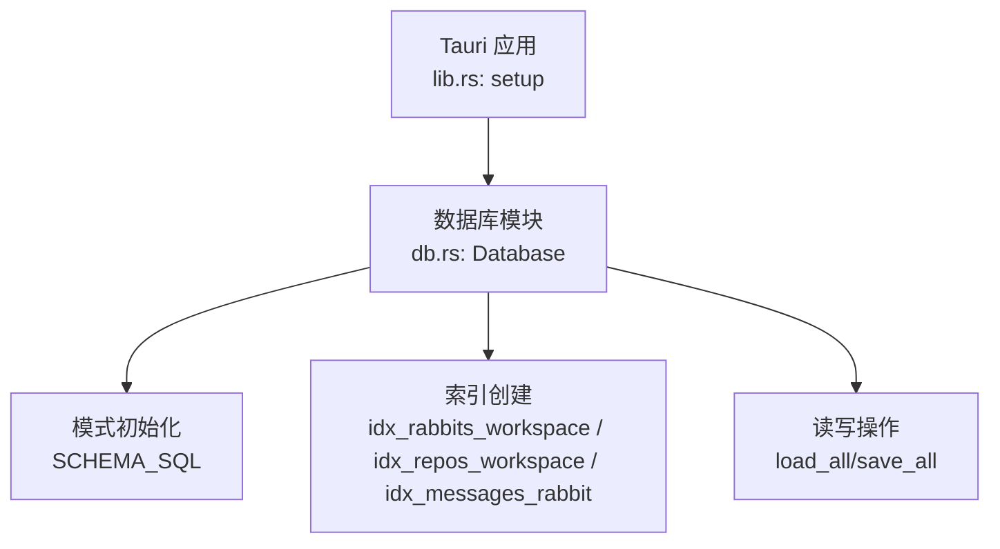
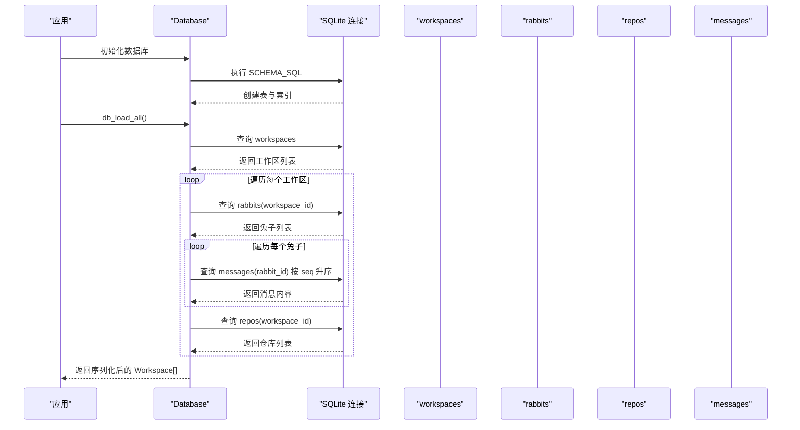
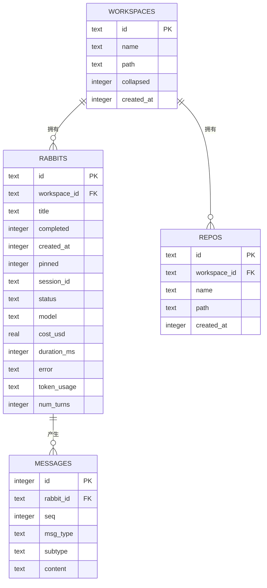
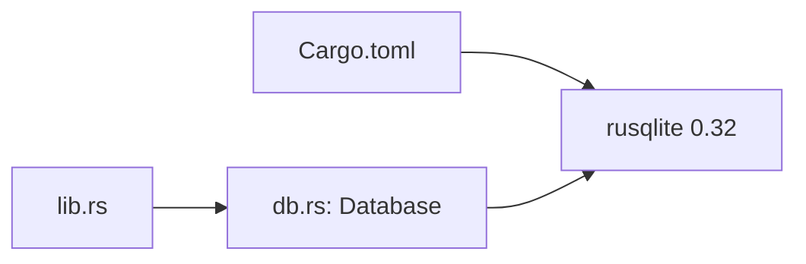
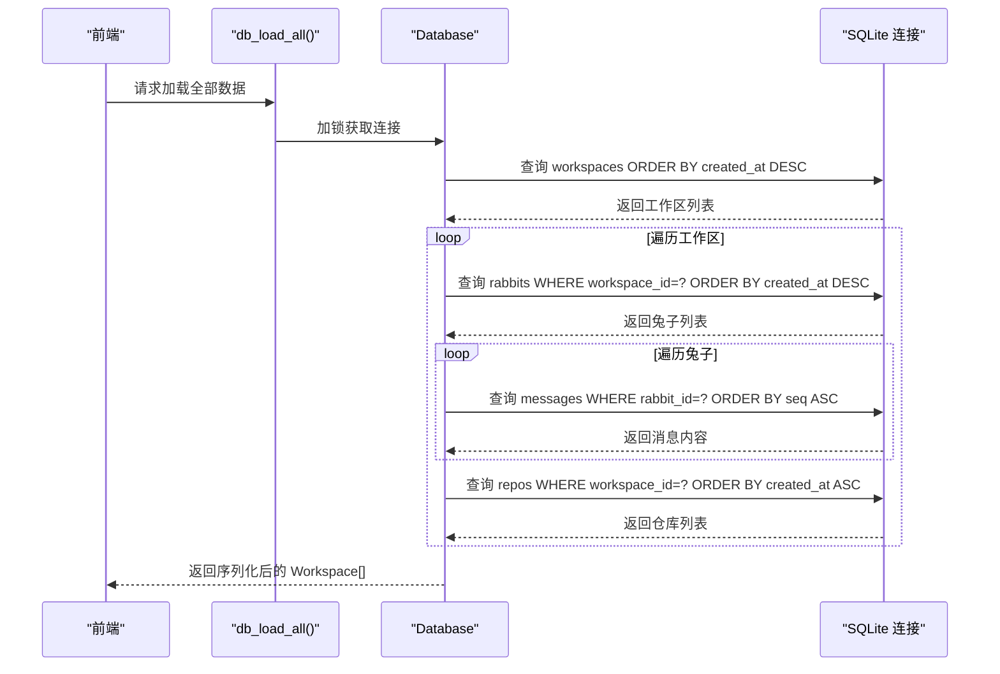
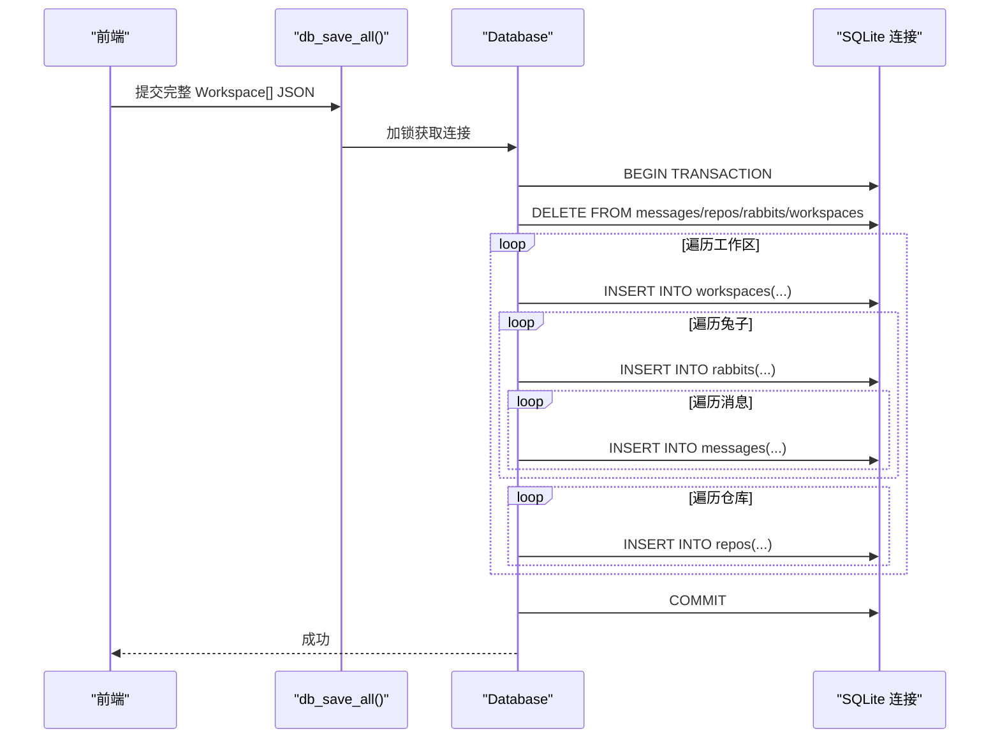

# 数据库模式

<cite>
**本文引用的文件**
- [db.rs](file://src-tauri/src/db.rs)
- [lib.rs](file://src-tauri/src/lib.rs)
- [Cargo.toml](file://src-tauri/Cargo.toml)
</cite>

## 目录
1. [简介](#简介)
2. [项目结构](#项目结构)
3. [核心组件](#核心组件)
4. [架构总览](#架构总览)
5. [详细组件分析](#详细组件分析)
6. [依赖分析](#依赖分析)
7. [性能考量](#性能考量)
8. [故障排查指南](#故障排查指南)
9. [结论](#结论)
10. [附录](#附录)

## 简介
本文件为 RabbitCoding 的数据库模式文档，聚焦于四个核心表（workspaces、rabbits、repos、messages）的结构与关系。文档详细说明各表字段定义、数据类型、约束条件、主键与外键设计、级联删除策略，以及索引设计与性能考量。同时给出 PRAGMA 设置说明（WAL 模式、外键约束、同步模式）与完整的 SQL DDL 语句，并提供表关系图与关键流程的时序图，帮助开发者快速理解并维护数据库结构。

## 项目结构
数据库逻辑集中在 Tauri 后端的 Rust 模块中，通过 SQLite（rusqlite）实现本地持久化。数据库初始化在应用启动阶段完成，连接池采用互斥锁包装的单连接模型，确保线程安全访问。

图表来源
- [lib.rs:206-221](file://src-tauri/src/lib.rs#L206-L221)
- [db.rs:85-138](file://src-tauri/src/db.rs#L85-L138)

章节来源
- [lib.rs:206-221](file://src-tauri/src/lib.rs#L206-L221)
- [db.rs:85-138](file://src-tauri/src/db.rs#L85-L138)

## 核心组件
- 数据库结构体 Database：封装 SQLite 连接，负责模式初始化、迁移与查询执行。
- 数据模型结构体：WorkspaceData、RabbitData、RepoData、TokenUsageData，用于序列化/反序列化与跨语言交互。
- Tauri 命令：db_load_all、db_save_all、db_has_data，提供对数据库的统一访问接口。

章节来源
- [db.rs:80-83](file://src-tauri/src/db.rs#L80-L83)
- [db.rs:10-74](file://src-tauri/src/db.rs#L10-L74)
- [db.rs:392-416](file://src-tauri/src/db.rs#L392-L416)

## 架构总览
数据库采用单文件 SQLite 文件存储，使用 WAL 模式提升并发读写性能；启用外键约束保证参照完整性；通过索引优化常见查询路径。应用启动时初始化数据库并建立索引；数据加载时先查工作区，再查其下的兔子与仓库，最后按序加载消息；保存时采用事务批量写入，确保一致性。

图表来源
- [db.rs:167-288](file://src-tauri/src/db.rs#L167-L288)
- [db.rs:193-274](file://src-tauri/src/db.rs#L193-L274)

## 详细组件分析

### 表：workspaces（工作区）
- 主键：id（TEXT，PRIMARY KEY）
- 字段：
  - id：工作区唯一标识
  - name：工作区名称（TEXT，NOT NULL，默认空字符串）
  - path：工作区路径（TEXT，可空）
  - collapsed：是否折叠（INTEGER，NOT NULL，默认 0）
  - created_at：创建时间戳（INTEGER，NOT NULL）
- 约束：无显式外键约束（作为根实体）
- 索引：无独立索引（常用按 created_at 查询，见下文）

章节来源
- [db.rs:90-96](file://src-tauri/src/db.rs#L90-L96)
- [db.rs:169-185](file://src-tauri/src/db.rs#L169-L185)

### 表：rabbits（兔子）
- 主键：id（TEXT，PRIMARY KEY）
- 外键：workspace_id 引用 workspaces(id)，ON DELETE CASCADE
- 字段：
  - id：兔子唯一标识
  - workspace_id：所属工作区（TEXT，NOT NULL）
  - title：标题（TEXT，NOT NULL，默认空字符串）
  - completed：是否完成（INTEGER，NOT NULL，默认 0）
  - created_at：创建时间戳（INTEGER，NOT NULL）
  - pinned：是否置顶（INTEGER，NOT NULL，默认 0）
  - session_id：会话 ID（TEXT，可空）
  - status：状态（TEXT，NOT NULL，默认 "idle"）
  - model：模型（TEXT，NOT NULL，默认空字符串）
  - cost_usd：消费美元（REAL，可空）
  - duration_ms：耗时毫秒（INTEGER，可空）
  - error：错误信息（TEXT，可空）
  - token_usage：JSON 文本，记录令牌用量（TEXT，可空）
  - num_turns：对话轮次（INTEGER，可空）
- 约束：外键约束 + 级联删除
- 索引：idx_rabbits_workspace(workspace_id)

章节来源
- [db.rs:98-114](file://src-tauri/src/db.rs#L98-L114)
- [db.rs:135](file://src-tauri/src/db.rs#L135)
- [db.rs:193-226](file://src-tauri/src/db.rs#L193-L226)

### 表：repos（仓库）
- 主键：id（TEXT，PRIMARY KEY）
- 外键：workspace_id 引用 workspaces(id)，ON DELETE CASCADE
- 字段：
  - id：仓库唯一标识
  - workspace_id：所属工作区（TEXT，NOT NULL）
  - name：仓库名称（TEXT，NOT NULL）
  - path：仓库路径（TEXT，NOT NULL）
  - created_at：创建时间戳（INTEGER，NOT NULL）
- 约束：外键约束 + 级联删除
- 索引：idx_repos_workspace(workspace_id)

章节来源
- [db.rs:116-123](file://src-tauri/src/db.rs#L116-L123)
- [db.rs:136](file://src-tauri/src/db.rs#L136)
- [db.rs:257-273](file://src-tauri/src/db.rs#L257-L273)

### 表：messages（消息）
- 主键：id（INTEGER，PRIMARY KEY，AUTOINCREMENT）
- 外键：rabbit_id 引用 rabbits(id)，ON DELETE CASCADE
- 字段：
  - id：自增消息编号
  - rabbit_id：所属兔子（TEXT，NOT NULL）
  - seq：消息序号（INTEGER，NOT NULL）
  - msg_type：消息类型（TEXT，NOT NULL）
  - subtype：子类型（TEXT，可空）
  - content：消息内容（TEXT，NOT NULL，JSON 文本）
- 约束：外键约束 + 级联删除
- 索引：idx_messages_rabbit(rabbit_id, seq)

章节来源
- [db.rs:125-133](file://src-tauri/src/db.rs#L125-L133)
- [db.rs:137](file://src-tauri/src/db.rs#L137)
- [db.rs:232-254](file://src-tauri/src/db.rs#L232-L254)

### 数据模型与序列化
- WorkspaceData：包含 id、name、path、collapsed、created_at、rabbits、repos
- RabbitData：包含 id、title、completed、created_at、pinned、session_id、status、model、cost_usd、duration_ms、error、token_usage、num_turns、messages
- RepoData：包含 id、name、path、created_at
- TokenUsageData：包含 input_tokens、output_tokens、cache_creation_input_tokens、cache_read_input_tokens

章节来源
- [db.rs:10-74](file://src-tauri/src/db.rs#L10-L74)

### PRAGMA 设置说明
- journal_mode=WAL：开启预写日志模式，提升并发读性能与崩溃恢复能力
- foreign_keys=ON：启用外键约束检查，保证参照完整性
- synchronous=NORMAL：平衡性能与安全性，减少 fsync 频率

章节来源
- [db.rs:85-88](file://src-tauri/src/db.rs#L85-L88)

### 完整 SQL DDL 语句
以下为从源码提取的完整建表与索引语句（按实际顺序）：
- PRAGMA 设置
  - journal_mode=WAL
  - foreign_keys=ON
  - synchronous=NORMAL
- 建表
  - workspaces(id TEXT PRIMARY KEY, name TEXT NOT NULL DEFAULT '', path TEXT, collapsed INTEGER NOT NULL DEFAULT 0, created_at INTEGER NOT NULL)
  - rabbits(id TEXT PRIMARY KEY, workspace_id TEXT NOT NULL, title TEXT NOT NULL DEFAULT '', completed INTEGER NOT NULL DEFAULT 0, created_at INTEGER NOT NULL, pinned INTEGER NOT NULL DEFAULT 0, session_id TEXT, status TEXT NOT NULL DEFAULT 'idle', model TEXT NOT NULL DEFAULT '', cost_usd REAL, duration_ms INTEGER, error TEXT, token_usage TEXT, num_turns INTEGER, FOREIGN KEY (workspace_id) REFERENCES workspaces(id) ON DELETE CASCADE)
  - repos(id TEXT PRIMARY KEY, workspace_id TEXT NOT NULL, name TEXT NOT NULL, path TEXT NOT NULL, created_at INTEGER NOT NULL, FOREIGN KEY (workspace_id) REFERENCES workspaces(id) ON DELETE CASCADE)
  - messages(id INTEGER PRIMARY KEY AUTOINCREMENT, rabbit_id TEXT NOT NULL, seq INTEGER NOT NULL, msg_type TEXT NOT NULL, subtype TEXT, content TEXT NOT NULL, FOREIGN KEY (rabbit_id) REFERENCES rabbits(id) ON DELETE CASCADE)
- 索引
  - CREATE INDEX IF NOT EXISTS idx_rabbits_workspace ON rabbits(workspace_id)
  - CREATE INDEX IF NOT EXISTS idx_repos_workspace ON repos(workspace_id)
  - CREATE INDEX IF NOT EXISTS idx_messages_rabbit ON messages(rabbit_id, seq)

章节来源
- [db.rs:85-138](file://src-tauri/src/db.rs#L85-L138)

### 表关系图

图表来源
- [db.rs:90-133](file://src-tauri/src/db.rs#L90-L133)

## 依赖分析
- 外部依赖：rusqlite（版本 0.32，启用 bundled 特性），用于 SQLite 绑定与操作
- 应用集成：数据库在应用启动时初始化，通过 Tauri 的 manage 注册为全局状态，供命令调用

图表来源
- [Cargo.toml:30](file://src-tauri/Cargo.toml#L30)
- [lib.rs:206-221](file://src-tauri/src/lib.rs#L206-L221)
- [db.rs:142-160](file://src-tauri/src/db.rs#L142-L160)

章节来源
- [Cargo.toml:30](file://src-tauri/Cargo.toml#L30)
- [lib.rs:206-221](file://src-tauri/src/lib.rs#L206-L221)
- [db.rs:142-160](file://src-tauri/src/db.rs#L142-L160)

## 性能考量
- WAL 模式：提升并发读性能，适合多线程读取与单写场景
- 外键约束：保证参照完整性，但会带来少量写入开销；建议仅在必要时关闭（不推荐）
- 同步模式：NORMAL 在性能与安全性间取得平衡
- 索引设计：
  - idx_rabbits_workspace：加速按工作区筛选兔子
  - idx_repos_workspace：加速按工作区筛选仓库
  - idx_messages_rabbit：复合索引按 rabbit_id + seq 排序，满足按兔子分组与顺序读取需求
- 事务写入：保存时使用 BEGIN/COMMIT 包裹，减少频繁 fsync，提高吞吐
- 列迁移：新增列（token_usage、num_turns）采用幂等 ALTER TABLE，避免重复执行报错

章节来源
- [db.rs:85-88](file://src-tauri/src/db.rs#L85-L88)
- [db.rs:135-137](file://src-tauri/src/db.rs#L135-L137)
- [db.rs:291-304](file://src-tauri/src/db.rs#L291-L304)
- [db.rs:150-155](file://src-tauri/src/db.rs#L150-L155)

## 故障排查指南
- 数据库初始化失败：检查数据库文件路径与权限，确认 PRAGMA 设置与建表语句执行成功
- 外键约束错误：确认父表记录存在且字段类型匹配；删除父记录会因级联删除影响子记录
- 查询性能问题：确认索引是否存在；针对高频过滤字段（如 workspace_id、rabbit_id）进行覆盖查询
- 事务回滚：保存失败时会自动回滚，检查具体插入语句与 JSON 序列化结果
- 数据迁移：若历史数据库缺少新列，执行列迁移语句；注意幂等性

章节来源
- [db.rs:142-160](file://src-tauri/src/db.rs#L142-L160)
- [db.rs:113](file://src-tauri/src/db.rs#L113)
- [db.rs:122](file://src-tauri/src/db.rs#L122)
- [db.rs:300-304](file://src-tauri/src/db.rs#L300-L304)
- [db.rs:150-155](file://src-tauri/src/db.rs#L150-L155)

## 结论
该数据库模式围绕“工作区-兔子-仓库-消息”的层级关系构建，采用 WAL、外键约束与合理索引，在保证数据一致性的同时兼顾了读写性能。通过 Tauri 命令封装，实现了对数据库的统一访问与事务化写入，适合桌面端本地知识库与对话历史管理场景。后续维护应关注索引覆盖度与查询路径优化，确保在数据规模增长时仍保持良好性能。

## 附录

### 关键流程时序图：数据加载

图表来源
- [db.rs:167-288](file://src-tauri/src/db.rs#L167-L288)

### 关键流程时序图：数据保存

图表来源
- [db.rs:290-386](file://src-tauri/src/db.rs#L290-L386)