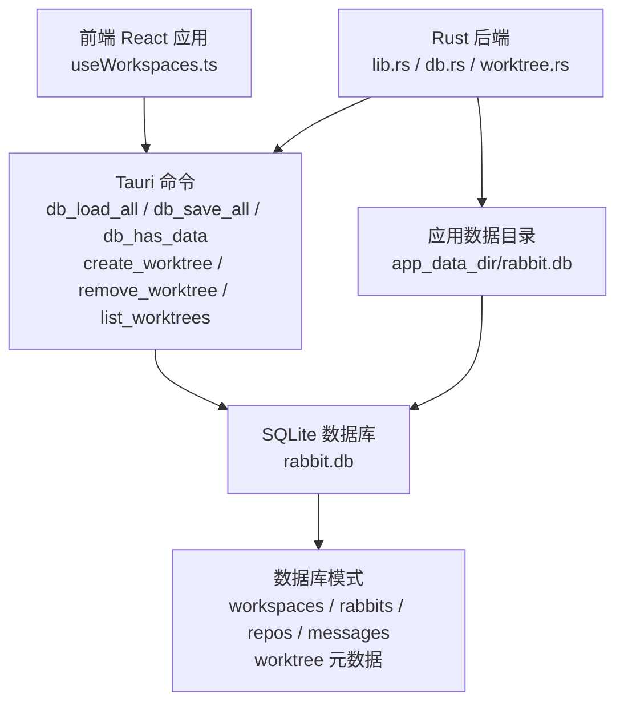
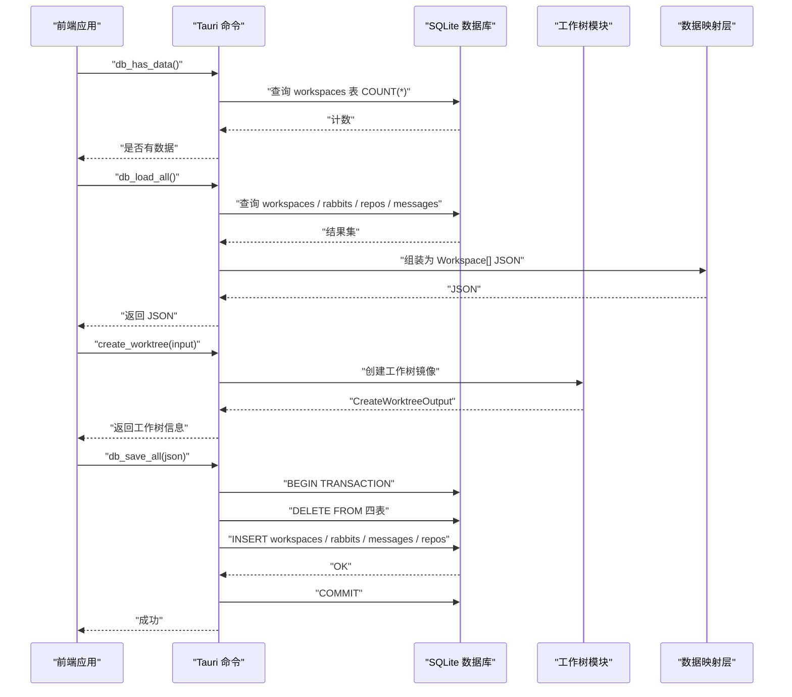
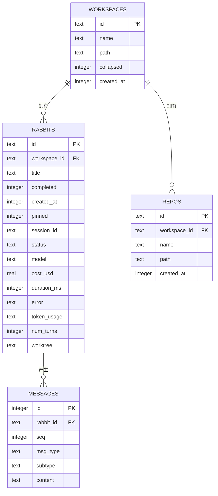
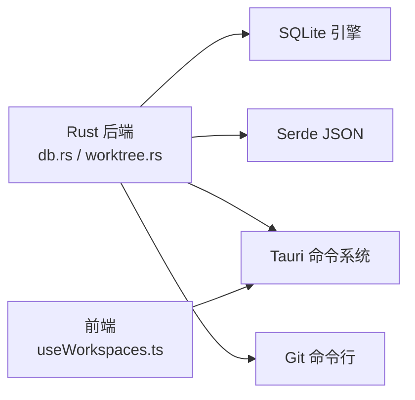

# 数据库设计

<cite>
**本文引用的文件**
- [src-tauri/src/db.rs](file://src-tauri/src/db.rs)
- [src-tauri/src/lib.rs](file://src-tauri/src/lib.rs)
- [src-tauri/src/main.rs](file://src-tauri/src/main.rs)
- [src-tauri/src/worktree.rs](file://src-tauri/src/worktree.rs)
- [src/hooks/useWorkspaces.ts](file://src/hooks/useWorkspaces.ts)
- [src/types/index.ts](file://src/types/index.ts)
- [src-tauri/Cargo.toml](file://src-tauri/Cargo.toml)
</cite>

## 更新摘要
**变更内容**
- 新增工作树元数据持久化支持，扩展兔子表以存储工作树信息
- 更新数据库模式以支持工作树相关数据结构
- 增强数据访问模式以处理工作树元数据的序列化和反序列化
- 完善工作树相关的命令接口和前端集成

## 目录
1. [简介](#简介)
2. [项目结构](#项目结构)
3. [核心组件](#核心组件)
4. [架构总览](#架构总览)
5. [详细组件分析](#详细组件分析)
6. [依赖分析](#依赖分析)
7. [性能考量](#性能考量)
8. [故障排查指南](#故障排查指南)
9. [结论](#结论)
10. [附录](#附录)

## 简介
本文件为 RabbitCoding 的数据库设计文档，聚焦于基于 SQLite 的本地数据存储方案。文档涵盖数据库结构、实体关系、字段定义与数据类型、主键/外键与索引设计、约束与完整性保障、数据访问模式与缓存策略、性能优化建议、数据生命周期与迁移路径、以及安全与隐私要求。**更新**：本次更新重点介绍了工作树元数据持久化的支持，包括工作树信息的存储、序列化和相关表结构扩展。

## 项目结构
RabbitCoding 的数据库位于 Tauri 后端模块中，采用 Rust + rusqlite 实现，SQLite 数据库存放在应用数据目录下的 rabbit.db。前端通过 Tauri 命令与后端交互，实现数据的全量加载与保存，并提供降级到 localStorage 的容错机制。**更新**：新增工作树相关命令支持，包括创建工作树镜像、删除工作树和列出工作树等功能。

**图表来源**
- [src-tauri/src/lib.rs:140-149](file://src-tauri/src/lib.rs#L140-L149)
- [src-tauri/src/db.rs:85-138](file://src-tauri/src/db.rs#L85-L138)
- [src-tauri/src/worktree.rs:163-280](file://src-tauri/src/worktree.rs#L163-L280)

**章节来源**
- [src-tauri/src/lib.rs:125-150](file://src-tauri/src/lib.rs#L125-L150)
- [src-tauri/src/db.rs:140-161](file://src-tauri/src/db.rs#L140-L161)
- [src-tauri/src/worktree.rs:163-280](file://src-tauri/src/worktree.rs#L163-L280)

## 核心组件
- 数据库结构体与连接管理：封装 SQLite 连接，提供建表、迁移与事务性保存。
- 数据模型映射：Serde 结构体与前端类型对齐，确保序列化/反序列化一致性。
- Tauri 命令接口：db_load_all、db_save_all、db_has_data，提供全量数据读写与可用性检查。
- **工作树命令接口**：create_worktree、remove_worktree、list_worktrees，支持工作树镜像的创建、删除和管理。
- 前端数据访问：useWorkspaces 钩子负责首次迁移、异步加载、双层防抖保存与降级策略。

**章节来源**
- [src-tauri/src/db.rs:80-161](file://src-tauri/src/db.rs#L80-L161)
- [src/hooks/useWorkspaces.ts:48-95](file://src/hooks/useWorkspaces.ts#L48-L95)
- [src-tauri/src/lib.rs:272-286](file://src-tauri/src/lib.rs#L272-L286)
- [src-tauri/src/worktree.rs:163-372](file://src-tauri/src/worktree.rs#L163-L372)

## 架构总览
数据库层通过 Tauri 命令暴露接口，前端在应用启动时优先尝试从 SQLite 加载数据；若数据库不可用，则回退到 localStorage。数据以 Workspace[] 形式在前后端之间传递，后端负责解析、校验与持久化。**更新**：新增工作树相关的命令处理，支持工作树镜像的创建和管理。

**图表来源**
- [src-tauri/src/db.rs:392-416](file://src-tauri/src/db.rs#L392-L416)
- [src-tauri/src/db.rs:290-386](file://src-tauri/src/db.rs#L290-L386)
- [src/hooks/useWorkspaces.ts:52-92](file://src/hooks/useWorkspaces.ts#L52-L92)
- [src-tauri/src/worktree.rs:163-280](file://src-tauri/src/worktree.rs#L163-L280)

## 详细组件分析

### 数据库模式与实体关系
- 工作区（workspaces）
  - 主键：id（TEXT）
  - 字段：name（TEXT）、path（TEXT）、collapsed（INTEGER）、created_at（INTEGER）
  - 约束：name 默认空字符串；collapsed 存储布尔值（0/1）
- 兔子（rabbits）
  - 主键：id（TEXT）
  - 外键：workspace_id → workspaces(id)（级联删除）
  - 字段：title（TEXT）、completed（INTEGER）、created_at（INTEGER）、pinned（INTEGER）、session_id（TEXT）、status（TEXT）、model（TEXT）、cost_usd（REAL）、duration_ms（INTEGER）、error（TEXT）、token_usage（TEXT，JSON）、num_turns（INTEGER）、**worktree（TEXT，JSON，新增）**
  - 约束：status 默认 idle；其他字段默认值见建表 SQL
- 仓库（repos）
  - 主键：id（TEXT）
  - 外键：workspace_id → workspaces(id)（级联删除）
  - 字段：name（TEXT）、path（TEXT）、created_at（INTEGER）
- 消息（messages）
  - 主键：id（INTEGER，自增）
  - 外键：rabbit_id → rabbits(id)（级联删除）
  - 字段：rabbit_id（TEXT）、seq（INTEGER）、msg_type（TEXT）、subtype（TEXT）、content（TEXT）

**更新**：在 rabbits 表中新增了 worktree 字段，用于存储工作树元数据的 JSON 序列化形式。

**图表来源**
- [src-tauri/src/db.rs:85-138](file://src-tauri/src/db.rs#L85-L138)

**章节来源**
- [src-tauri/src/db.rs:85-138](file://src-tauri/src/db.rs#L85-L138)
- [src-tauri/src/db.rs:182-188](file://src-tauri/src/db.rs#L182-L188)

### 索引设计
- idx_rabbits_workspace：在 rabbits.workspace_id 上建立索引，加速按工作区查询兔子列表。
- idx_repos_workspace：在 repos.workspace_id 上建立索引，加速按工作区查询仓库列表。
- idx_messages_rabbit：在 messages(rabbit_id, seq) 上建立复合索引，加速按兔子与序号检索消息流。

**章节来源**
- [src-tauri/src/db.rs:135-137](file://src-tauri/src/db.rs#L135-L137)

### 约束与完整性
- PRAGMA 设置
  - journal_mode=WAL：提升并发读写性能与崩溃恢复能力
  - foreign_keys=ON：启用外键约束，保证参照完整性
  - synchronous=NORMAL：平衡性能与安全性
- 外键级联删除：删除工作区时，其下兔子、仓库与消息将被级联删除，避免悬挂记录
- 字段默认值与类型：建表 SQL 明确各字段类型与默认值，减少空值歧义
- **列迁移支持**：通过 ALTER TABLE 语句为现有数据库添加 worktree 字段，支持向后兼容

**更新**：新增列迁移逻辑，确保现有数据库能够支持新的工作树功能。

**章节来源**
- [src-tauri/src/db.rs:85-89](file://src-tauri/src/db.rs#L85-L89)
- [src-tauri/src/db.rs:113-122](file://src-tauri/src/db.rs#L113-L122)
- [src-tauri/src/db.rs:182-188](file://src-tauri/src/db.rs#L182-L188)

### 数据访问模式与缓存策略
- 前端加载流程
  - 首次启动：调用 db_has_data 判断数据库是否已有数据
  - 若为空：尝试从 localStorage 迁移完整数据至 SQLite
  - 从 SQLite 全量加载：db_load_all 返回 Workspace[] JSON，前端解析并渲染
- 保存策略
  - 双层防抖：状态变更后 500ms 触发保存；每 3s 强制保存，覆盖流式输出中间态
  - 降级：当数据库不可用时，写入 localStorage
- 后端保存
  - 事务性：save_all_inner 开启事务，失败回滚，成功提交
  - 全量替换：先清空四表，再批量插入，保证与前端一致的最终状态
- **工作树数据处理**
  - 工作树信息以 JSON 字符串形式存储在 rabbits.worktree 字段
  - 加载时自动反序列化为 WorktreeInfoData 结构
  - 保存时自动序列化为 JSON 字符串

**更新**：增强了数据访问模式以支持工作树元数据的序列化和反序列化处理。

**章节来源**
- [src/hooks/useWorkspaces.ts:48-120](file://src/hooks/useWorkspaces.ts#L48-L120)
- [src-tauri/src/db.rs:290-386](file://src-tauri/src/db.rs#L290-L386)
- [src-tauri/src/db.rs:225-260](file://src-tauri/src/db.rs#L225-L260)

### 数据验证与业务规则
- 前端类型与后端结构对齐：Serde 结构体与前端类型定义保持字段名与语义一致（camelCase）
- 消息序列化：messages.content 以 JSON 字符串存储，后端加载时解析为前端消息对象
- 状态收敛：重启后将"进行中"状态收敛为"空闲"，避免 UI 永远处于加载态
- 兼容性：对旧字段（如 specFilePaths）进行向后兼容处理
- **工作树数据兼容性**：新增的 worktree 字段为可选，默认为空，确保与旧版本数据的兼容性

**更新**：增加了工作树数据的兼容性处理，确保新旧版本之间的平滑过渡。

**章节来源**
- [src-tauri/src/db.rs:10-74](file://src-tauri/src/db.rs#L10-L74)
- [src/types/index.ts:8-42](file://src/types/index.ts#L8-L42)
- [src/hooks/useWorkspaces.ts:14-26](file://src/hooks/useWorkspaces.ts#L14-L26)

### 工作树元数据结构
**新增**：工作树元数据的完整结构定义如下：

- WorktreeInfoData（后端存储结构）
  - base_path（String）：工作树镜像的根目录路径
  - branch（String）：工作树对应的分支名称
  - repos（Vec<WorktreeRepoEntryData>）：工作树中各个仓库的信息列表
  - created_at（i64）：工作树创建时间戳
- WorktreeRepoEntryData（后端存储结构）
  - repo_id（String）：原始仓库的 ID
  - repo_name（String）：原始仓库的名称
  - original_path（String）：原始仓库的路径
  - worktree_path（String）：工作树中的仓库路径
  - branch（String）：工作树分支
  - base_branch（String）：基础分支名称

**章节来源**
- [src-tauri/src/db.rs:80-106](file://src-tauri/src/db.rs#L80-L106)
- [src/types/index.ts:8-27](file://src/types/index.ts#L8-L27)

### 示例数据
以下为典型 Workspace[] 的结构示意（字段与类型依据建表与类型定义）：
- workspaces[].id/name/path/collapsed/createdAt
- workspaces[].rabbits[].id/title/completed/createdAt/pinned/sessionId/status/model/costUsd/durationMs/error/tokenUsage/numTurns/**worktree**/messages[]
- workspaces[].repos[].id/name/path/createdAt
- messages[].rabbit_id/seq/msg_type/subtype/content（content 为 JSON 字符串）
- **工作树示例**：workspaces[].rabbits[].worktree.basePath/worktree.branch/worktree.repos[].repoId/worktree.created_at

**更新**：增加了工作树元数据的示例展示。

**章节来源**
- [src-tauri/src/db.rs:85-138](file://src-tauri/src/db.rs#L85-L138)
- [src/types/index.ts:8-42](file://src/types/index.ts#L8-L42)

## 依赖分析
- rusqlite：SQLite 绑定，提供连接、事务与 SQL 执行能力
- serde/serde_json：结构体与 JSON 的序列化/反序列化
- Tauri：命令注册与跨语言桥接
- **git 命令**：工作树功能依赖系统 git 命令进行工作树镜像的创建和管理

**更新**：新增了对 git 命令的依赖，用于工作树功能的实现。

**图表来源**
- [src-tauri/Cargo.toml:20-39](file://src-tauri/Cargo.toml#L20-L39)
- [src-tauri/src/db.rs:1-4](file://src-tauri/src/db.rs#L1-L4)
- [src-tauri/src/worktree.rs:70-82](file://src-tauri/src/worktree.rs#L70-L82)

**章节来源**
- [src-tauri/Cargo.toml:20-39](file://src-tauri/Cargo.toml#L20-L39)

## 性能考量
- WAL 模式：提升并发读写与崩溃恢复能力，适合频繁读写的场景
- 索引优化：针对外键列与消息排序列建立索引，降低查询成本
- 事务批量写入：save_all_impl 使用事务，避免多次提交带来的开销
- 前端防抖与强制保存：减少不必要的写入频率，兼顾实时性与性能
- 降级策略：localStorage 作为后备，避免数据库异常导致的阻塞
- **工作树性能优化**：工作树信息以 JSON 字符串存储，避免复杂关联查询；定期清理不再使用的工作树镜像

**更新**：增加了工作树相关的性能优化建议。

**章节来源**
- [src-tauri/src/db.rs:85-89](file://src-tauri/src/db.rs#L85-L89)
- [src-tauri/src/db.rs:135-137](file://src-tauri/src/db.rs#L135-L137)
- [src-tauri/src/db.rs:290-305](file://src-tauri/src/db.rs#L290-L305)
- [src/hooks/useWorkspaces.ts:100-119](file://src/hooks/useWorkspaces.ts#L100-L119)

## 故障排查指南
- 数据库不可用
  - 现象：db_load_all/db_save_all 抛错，前端回退到 localStorage
  - 处理：检查应用数据目录权限与 rabbit.db 文件是否存在；查看后端初始化日志
- 数据迁移失败
  - 现象：首次启动从 localStorage 迁移失败
  - 处理：确认 localStorage 中数据格式正确；检查 db_save_all 的 JSON 解析错误
- 保存失败
  - 现象：db_save_all 抛错
  - 处理：查看事务回滚日志；确认消息 JSON 序列化是否合法；检查字段类型与默认值
- **工作树创建失败**
  - 现象：create_worktree 命令抛错
  - 处理：检查 git 命令是否可用；确认仓库路径有效；查看工作树目录权限
- **工作树删除失败**
  - 现象：remove_worktree 命令抛错
  - 处理：检查工作树目录是否存在；确认 git 工作树引用是否正确；查看删除日志

**更新**：增加了工作树相关的故障排查指南。

**章节来源**
- [src-tauri/src/lib.rs:140-149](file://src-tauri/src/lib.rs#L140-L149)
- [src/hooks/useWorkspaces.ts:52-92](file://src/hooks/useWorkspaces.ts#L52-L92)
- [src-tauri/src/db.rs:290-305](file://src-tauri/src/db.rs#L290-L305)
- [src-tauri/src/worktree.rs:163-280](file://src-tauri/src/worktree.rs#L163-L280)

## 结论
RabbitCoding 的数据库设计以 SQLite 为核心，结合 WAL、外键与索引，提供了良好的一致性与性能。通过 Tauri 命令与前端钩子配合，实现了全量加载与保存、双层防抖与强制保存策略，并具备完善的降级与迁移能力。**更新**：本次更新显著增强了数据库的功能，通过添加工作树元数据持久化支持，为用户提供隔离的开发环境和更好的工作流管理能力。建议在生产环境中进一步完善备份与审计日志，以满足更严格的数据治理需求。

## 附录

### 数据生命周期、保留策略与归档规则
- 生命周期
  - 工作区：由用户创建与删除，删除时级联清理相关兔子、仓库与消息
  - 兔子：会话结束后可标记完成或错误；前端状态在重启时收敛
  - 消息：按会话顺序存储，无自动清理逻辑
  - **工作树：按需创建，支持手动删除；建议定期清理长时间未使用的工作树镜像**
- 保留策略
  - 未设定自动清理；可通过业务规则在前端或后端增加过期清理
  - **工作树镜像建议设置保留期限，超过期限自动清理**
- 归档规则
  - 未实现自动归档；可在业务侧扩展"归档"状态与迁移流程
  - **工作树可以作为临时隔离环境，使用完毕后及时清理**

**更新**：增加了工作树相关的生命周期管理建议。

**章节来源**
- [src-tauri/src/db.rs:113-122](file://src-tauri/src/db.rs#L113-L122)
- [src/hooks/useWorkspaces.ts:14-26](file://src/hooks/useWorkspaces.ts#L14-L26)

### 数据迁移路径与版本管理
- 初始建表：执行 SCHEMA_SQL 完成表结构创建
- 列迁移：对既有数据库执行 ALTER TABLE 添加新列（幂等，忽略重复列错误）
- **工作树列迁移**：通过 ALTER TABLE rabbits ADD COLUMN worktree TEXT 为现有数据库添加工作树支持
- 版本演进：通过新增 ALTER 语句实现列级演进；建议在新版本中增加版本号字段以便统一迁移

**更新**：增加了工作树相关列迁移的具体实现。

**章节来源**
- [src-tauri/src/db.rs:140-161](file://src-tauri/src/db.rs#L140-L161)
- [src-tauri/src/db.rs:182-188](file://src-tauri/src/db.rs#L182-L188)

### 数据安全、隐私与访问控制
- 本地存储：数据库文件位于应用数据目录，受操作系统权限保护
- 前端访问：通过 Tauri 命令访问，避免直接暴露文件系统
- 隐私建议：若涉及敏感信息，建议在前端对消息内容进行脱敏或加密存储；后端可考虑对 token_usage 等字段进行最小化保留
- **工作树安全**：工作树镜像包含用户代码副本，应确保适当的文件系统权限控制；建议定期清理敏感数据

**更新**：增加了工作树相关的安全考虑。

**章节来源**
- [src-tauri/src/lib.rs:134-150](file://src-tauri/src/lib.rs#L134-L150)
- [src-tauri/src/db.rs:10-74](file://src-tauri/src/db.rs#L10-L74)

### 工作树功能使用指南
**新增**：工作树功能的使用说明

- 功能概述
  - 工作树功能允许为每个会话创建独立的 Git 工作树镜像
  - 支持多仓库并行开发，避免代码污染
  - 提供隔离的开发环境，便于实验性修改

- 核心命令
  - create_worktree：创建工作树镜像，返回工作树根目录和仓库映射
  - remove_worktree：删除工作树镜像，支持强制删除
  - list_worktrees：列出工作区下的所有工作树

- 使用场景
  - 并行开发多个功能分支
  - 实验性代码修改而不影响主分支
  - 多仓库协作开发

**章节来源**
- [src-tauri/src/worktree.rs:163-372](file://src-tauri/src/worktree.rs#L163-L372)
- [src/types/index.ts:29-48](file://src/types/index.ts#L29-L48)