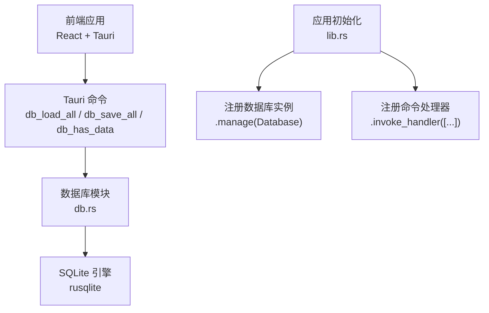
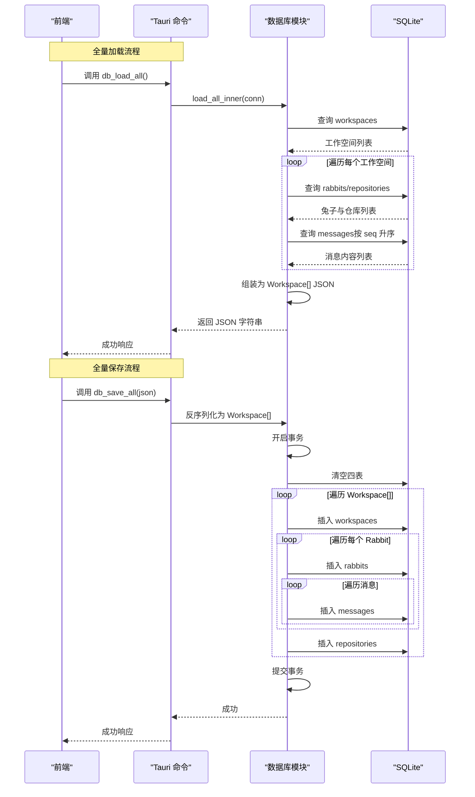
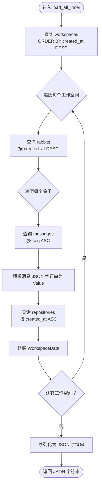
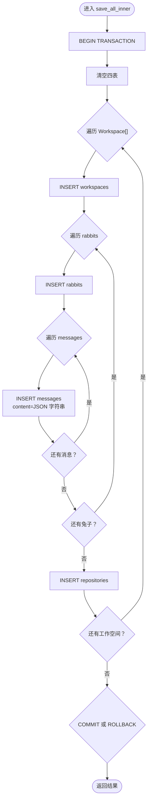
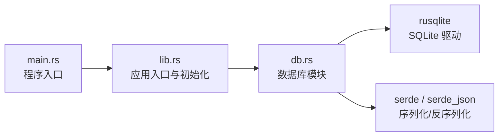

# 数据操作接口

<cite>
**本文引用的文件列表**
- [db.rs](file://src-tauri/src/db.rs)
- [lib.rs](file://src-tauri/src/lib.rs)
- [Cargo.toml](file://src-tauri/Cargo.toml)
- [main.rs](file://src-tauri/src/main.rs)
</cite>

## 目录
1. [简介](#简介)
2. [项目结构](#项目结构)
3. [核心组件](#核心组件)
4. [架构总览](#架构总览)
5. [详细组件分析](#详细组件分析)
6. [依赖关系分析](#依赖关系分析)
7. [性能考量](#性能考量)
8. [故障排查指南](#故障排查指南)
9. [结论](#结论)
10. [附录](#附录)

## 简介
本文件面向 RabbitCoding 的数据库操作接口，聚焦以下目标：
- 详细说明 load_all_inner 与 save_all_inner 的实现逻辑、参数规范、返回值格式
- 解释事务处理机制、错误处理策略、数据一致性保证
- 阐述全量加载与保存的流程、数据转换过程、JSON 序列化处理
- 定义 db_load_all、db_save_all、db_has_data 等 Tauri 命令的接口规范、调用方式、错误码说明
- 提供实际调用示例与最佳实践

## 项目结构
数据库相关的核心代码位于 Tauri 后端模块中，采用“命令层 + 数据访问层”的分层设计：
- 命令层：暴露给前端的 Tauri 命令，负责参数校验与错误包装
- 数据访问层：封装 SQLite 连接、SQL 执行、JSON 序列化/反序列化、事务控制
- 初始化：应用启动时注册数据库实例到全局状态

图表来源
- [lib.rs:357-359](file://src-tauri/src/lib.rs#L357-L359)
- [lib.rs:213-215](file://src-tauri/src/lib.rs#L213-L215)
- [db.rs:394-416](file://src-tauri/src/db.rs#L394-L416)

章节来源
- [lib.rs:197-390](file://src-tauri/src/lib.rs#L197-L390)
- [db.rs:167-416](file://src-tauri/src/db.rs#L167-L416)

## 核心组件
- 数据模型与序列化
  - WorkspaceData、RabbitData、RepoData、TokenUsageData 等结构体定义了数据库实体与消息内容的 JSON 映射，统一使用 camelCase 字段名，便于与前端保持一致
- 数据库连接与状态
  - Database 包装 rusqlite::Connection，并通过 Mutex 保护并发访问
- 内部函数
  - load_all_inner：查询所有工作空间及其兔子、仓库、消息，组装为 JSON 字符串
  - save_all_inner/save_all_impl：接收完整 JSON，解析为结构体，开启事务批量写入
- Tauri 命令
  - db_load_all：返回完整 JSON
  - db_save_all：接收完整 JSON，事务写入
  - db_has_data：检查是否存在数据，用于迁移判断

章节来源
- [db.rs:10-74](file://src-tauri/src/db.rs#L10-L74)
- [db.rs:80-161](file://src-tauri/src/db.rs#L80-L161)
- [db.rs:167-386](file://src-tauri/src/db.rs#L167-L386)
- [db.rs:394-416](file://src-tauri/src/db.rs#L394-L416)

## 架构总览
数据库模块围绕“读取-组装-序列化”和“反序列化-事务-写入”两条主线展开，配合索引与外键约束确保数据完整性与查询效率。

图表来源
- [db.rs:167-288](file://src-tauri/src/db.rs#L167-L288)
- [db.rs:290-386](file://src-tauri/src/db.rs#L290-L386)
- [db.rs:394-416](file://src-tauri/src/db.rs#L394-L416)

## 详细组件分析

### 数据模型与序列化
- 字段命名
  - 所有结构体使用 camelCase 字段名，与前端字段保持一致，减少映射成本
- 可选字段与默认值
  - 使用 Option<T> 表达可选字段，配合 serde 的 skip_serializing_if 与默认值，避免冗余数据
- JSON 处理
  - RabbitData.token_usage 以 JSON 字符串存储，反序列化为 TokenUsageData
  - Messages 以 JSON 字符串存储，加载时解析为 serde_json::Value
- 复杂度分析
  - 加载：O(N_ws + N_rabbits + N_messages + N_repos)，受索引影响，查询基本为 O(log N) 或 O(1) 辅助
  - 保存：O(N_ws + N_rabbits + N_messages + N_repos)，批量插入，事务提交一次

章节来源
- [db.rs:10-74](file://src-tauri/src/db.rs#L10-L74)
- [db.rs:167-288](file://src-tauri/src/db.rs#L167-L288)
- [db.rs:290-386](file://src-tauri/src/db.rs#L290-L386)

### load_all_inner 实现细节
- 查询顺序与依赖
  - 先查询 workspaces，再对每个工作空间查询 rabbits、messages、repos
  - messages 按 rabbit_id 与 seq 升序排列，确保消息顺序
- 数据转换
  - 将布尔字段从整型转换为 bool
  - 将 token_usage 字符串解析为结构体
  - 将消息内容字符串解析为 JSON 值
- 返回值
  - 返回完整的 Workspace[] JSON 字符串

图表来源
- [db.rs:167-288](file://src-tauri/src/db.rs#L167-L288)

章节来源
- [db.rs:167-288](file://src-tauri/src/db.rs#L167-L288)

### save_all_inner/save_all_impl 实现细节
- 事务控制
  - 开启事务后，若任一步骤失败则回滚，保证原子性
- 清空与重建
  - 先清空四表，再按传入的完整数据重建，实现“全量替换”
- 插入顺序
  - 先插入 workspaces，再插入 rabbits（含消息），最后插入 repositories
- JSON 处理
  - 将 TokenUsageData 序列化为字符串存入数据库
  - 将每条消息序列化为字符串存入 messages.content

图表来源
- [db.rs:290-386](file://src-tauri/src/db.rs#L290-L386)

章节来源
- [db.rs:290-386](file://src-tauri/src/db.rs#L290-L386)

### Tauri 命令接口规范

- db_load_all
  - 参数：无
  - 返回：字符串（完整 JSON）
  - 错误：数据库锁失败、SQL 查询失败、JSON 序列化失败
  - 调用方：前端在应用启动或切换工作空间时调用
- db_save_all
  - 参数：json（完整 Workspace[] JSON 字符串）
  - 返回：无（成功为空对象或约定的空值）
  - 错误：JSON 解析失败、SQL 插入失败、事务回滚
  - 调用方：前端在需要持久化完整状态时调用
- db_has_data
  - 参数：无
  - 返回：布尔值（是否存在数据）
  - 错误：数据库锁失败、COUNT 查询失败
  - 调用方：前端在初始化阶段判断是否需要迁移

章节来源
- [db.rs:394-416](file://src-tauri/src/db.rs#L394-L416)
- [lib.rs:357-359](file://src-tauri/src/lib.rs#L357-L359)

### 数据一致性与事务机制
- 事务边界
  - save_all_inner 明确开启事务，失败即回滚，确保全量替换的原子性
- 外键约束
  - rabbits 与 repos 的外键引用 workspaces，删除工作空间时级联删除其子项
  - messages 的外键引用 rabbits，保证消息归属正确
- 索引优化
  - 为 rabbits.workspace_id、repos.workspace_id、messages.rabbit_id+seq 建立索引，提升查询性能
- WAL 模式
  - 使用 WAL 模式提升并发读写性能，降低锁竞争

章节来源
- [db.rs:85-138](file://src-tauri/src/db.rs#L85-L138)
- [db.rs:290-305](file://src-tauri/src/db.rs#L290-L305)

### 错误处理策略
- 统一错误包装
  - 所有数据库操作错误均转换为字符串错误，便于跨语言传递
- 分层错误定位
  - 命令层：包装为 Result<String, String>，便于前端识别
  - 数据访问层：在具体步骤失败时尽早返回错误，避免部分写入
- 前端降级
  - 初始化阶段若数据库不可用，应用记录错误并允许前端降级到本地存储

章节来源
- [db.rs:142-160](file://src-tauri/src/db.rs#L142-L160)
- [lib.rs:213-221](file://src-tauri/src/lib.rs#L213-L221)

### JSON 序列化与转换
- 存储策略
  - TokenUsageData 以 JSON 字符串存储，读取时反序列化
  - Messages 以 JSON 字符串存储，读取时解析为 serde_json::Value
- 前后端一致性
  - 字段名统一为 camelCase，避免额外映射
- 性能考虑
  - 批量插入时避免逐条序列化，一次性序列化后再插入

章节来源
- [db.rs:204-206](file://src-tauri/src/db.rs#L204-L206)
- [db.rs:247-250](file://src-tauri/src/db.rs#L247-L250)
- [db.rs:329-332](file://src-tauri/src/db.rs#L329-L332)
- [db.rs:357-358](file://src-tauri/src/db.rs#L357-L358)

## 依赖关系分析
- 外部依赖
  - rusqlite：SQLite 驱动，提供连接、事务、SQL 执行能力
  - serde/serde_json：结构体与 JSON 的双向序列化
- 内部依赖
  - db.rs 作为命令实现与数据访问的核心模块
  - lib.rs 负责应用初始化、命令注册、数据库实例管理

图表来源
- [lib.rs:197-390](file://src-tauri/src/lib.rs#L197-L390)
- [db.rs:1-4](file://src-tauri/src/db.rs#L1-L4)
- [Cargo.toml:20-39](file://src-tauri/Cargo.toml#L20-L39)

章节来源
- [Cargo.toml:20-39](file://src-tauri/Cargo.toml#L20-L39)
- [lib.rs:197-390](file://src-tauri/src/lib.rs#L197-L390)
- [main.rs:4-6](file://src-tauri/src/main.rs#L4-L6)

## 性能考量
- 查询性能
  - 使用索引加速外键查询与排序
  - 按需排序：工作空间按创建时间倒序，仓库按创建时间正序，消息按序号正序
- 写入性能
  - 事务批量写入，减少磁盘同步次数
  - 批量插入减少 SQL 解析与编译开销
- 内存占用
  - 加载时按工作空间分步查询，避免一次性装载大量数据
- I/O 模式
  - WAL 模式提升并发读写吞吐

章节来源
- [db.rs:85-138](file://src-tauri/src/db.rs#L85-L138)
- [db.rs:290-305](file://src-tauri/src/db.rs#L290-L305)

## 故障排查指南
- 常见错误类型
  - 数据库锁失败：多线程并发访问导致，建议在命令层串行化调用
  - SQL 查询失败：检查表结构与索引是否存在
  - JSON 解析失败：确认前端传入的 JSON 格式与字段名符合 camelCase
  - 事务回滚：检查某一步插入失败的具体原因
- 排查步骤
  - 检查 db_has_data 是否返回 true，确认数据库是否已初始化
  - 使用 db_load_all 获取完整 JSON，验证结构是否正确
  - 若保存失败，先尝试最小化数据集，逐步定位问题
- 降级策略
  - 初始化失败时，应用会记录错误并允许前端降级到本地存储

章节来源
- [lib.rs:213-221](file://src-tauri/src/lib.rs#L213-L221)
- [db.rs:394-416](file://src-tauri/src/db.rs#L394-L416)

## 结论
本接口通过清晰的数据模型、严格的事务控制与完善的错误处理，实现了稳定可靠的全量加载与保存能力。前端可通过 db_load_all、db_save_all、db_has_data 三个命令完成数据的持久化与恢复，同时具备良好的扩展性与性能表现。

## 附录

### 命令调用示例（概念性）
- 全量加载
  - 调用：db_load_all()
  - 返回：完整 Workspace[] JSON 字符串
- 全量保存
  - 调用：db_save_all(json)
  - 参数：完整 Workspace[] JSON 字符串
  - 返回：成功
- 检查数据
  - 调用：db_has_data()
  - 返回：布尔值

章节来源
- [db.rs:394-416](file://src-tauri/src/db.rs#L394-L416)