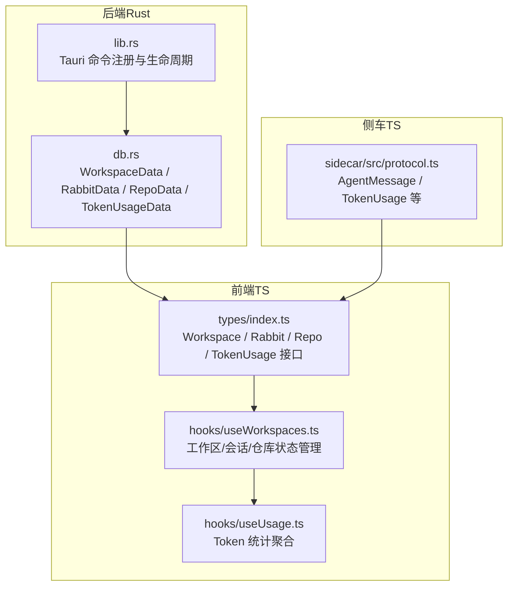
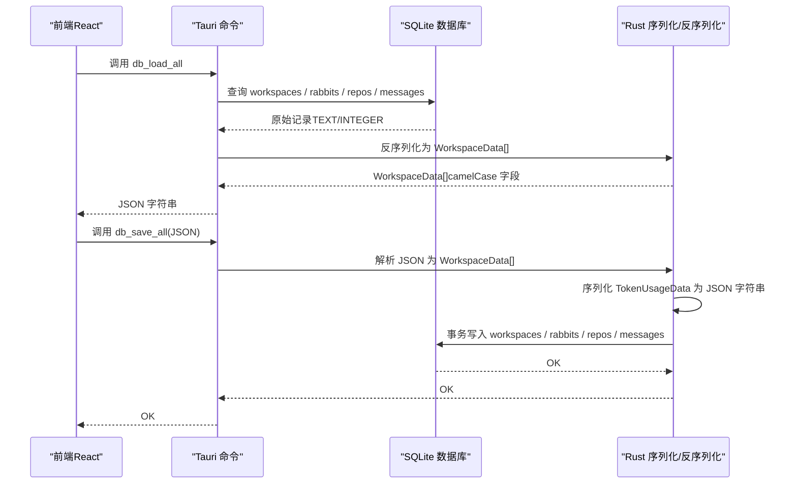
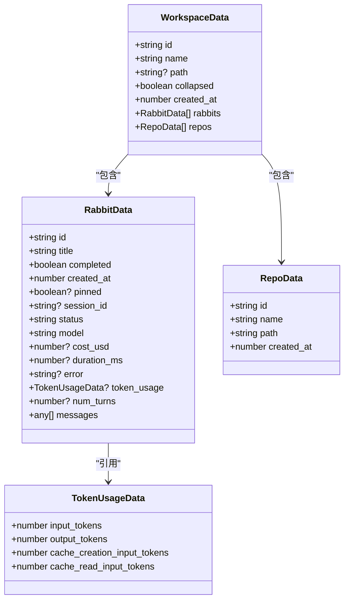
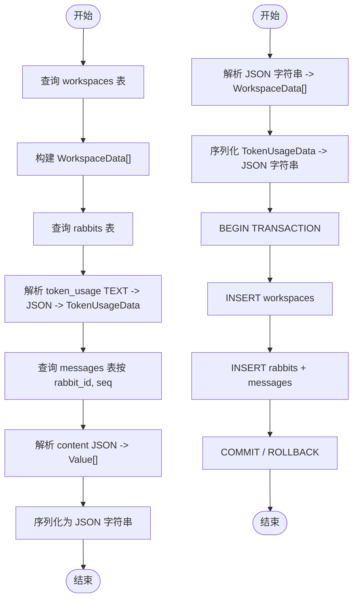
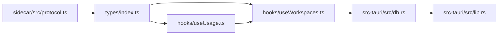

# 数据模型定义

<cite>
**本文引用的文件**
- [db.rs](file://src-tauri/src/db.rs)
- [lib.rs](file://src-tauri/src/lib.rs)
- [index.ts](file://src/types/index.ts)
- [useWorkspaces.ts](file://src/hooks/useWorkspaces.ts)
- [useUsage.ts](file://src/hooks/useUsage.ts)
- [protocol.ts](file://sidecar/src/protocol.ts)
</cite>

## 目录
1. [简介](#简介)
2. [项目结构](#项目结构)
3. [核心数据结构](#核心数据结构)
4. [架构总览](#架构总览)
5. [组件详细分析](#组件详细分析)
6. [依赖关系分析](#依赖关系分析)
7. [性能考量](#性能考量)
8. [故障排查指南](#故障排查指南)
9. [结论](#结论)

## 简介
本文面向 RabbitCoding 的数据模型，聚焦于后端 Rust 结构体与前端 TypeScript 接口之间的对齐与映射，系统性梳理 WorkspaceData、RabbitData、RepoData、TokenUsageData 等核心数据结构的字段定义、数据类型、序列化规则、命名约定与业务语义。同时说明前后端字段对齐策略（camelCase）、可选性处理、默认值策略、嵌套对象处理、JSON 序列化/反序列化机制以及典型使用场景与约束。

## 项目结构
RabbitCoding 的数据模型主要分布在以下位置：
- 后端（Tauri/Rust）：负责数据库建模、序列化/反序列化、与前端 JSON 的字段对齐
- 前端（TypeScript）：定义与后端对齐的接口，承载 UI 逻辑与状态管理
- 侧车（sidecar）：定义消息协议与 TokenUsage 等类型，与前端 AgentMessage 类型对齐

图表来源
- [db.rs:10-74](file://src-tauri/src/db.rs#L10-L74)
- [lib.rs:125-316](file://src-tauri/src/lib.rs#L125-L316)
- [index.ts:1-733](file://src/types/index.ts#L1-L733)
- [useWorkspaces.ts:1-541](file://src/hooks/useWorkspaces.ts#L1-L541)
- [useUsage.ts:1-89](file://src/hooks/useUsage.ts#L1-L89)
- [protocol.ts:167-229](file://sidecar/src/protocol.ts#L167-L229)

章节来源
- [db.rs:10-74](file://src-tauri/src/db.rs#L10-L74)
- [lib.rs:125-316](file://src-tauri/src/lib.rs#L125-L316)
- [index.ts:1-733](file://src/types/index.ts#L1-L733)
- [useWorkspaces.ts:1-541](file://src/hooks/useWorkspaces.ts#L1-L541)
- [useUsage.ts:1-89](file://src/hooks/useUsage.ts#L1-L89)
- [protocol.ts:167-229](file://sidecar/src/protocol.ts#L167-L229)

## 核心数据结构
本节对 WorkspaceData、RabbitData、RepoData、TokenUsageData 的字段定义、类型、默认值、可选性、序列化规则与业务含义进行逐项说明，并给出与前端字段的对齐关系。

- WorkspaceData（后端）
  - 字段
    - id: 字符串，唯一标识工作区
    - name: 字符串，工作区名称
    - path: 可选字符串，工作区根路径
    - collapsed: 布尔，是否折叠
    - created_at: 整数（毫秒时间戳），创建时间
    - rabbits: RabbitData 数组，默认空数组
    - repos: RepoData 数组，默认空数组
  - 序列化规则
    - 使用 #[serde(rename_all = "camelCase")]，字段名统一为 camelCase
    - rabbits/repos 默认序列化为空数组
  - 业务含义
    - 表示一个工作区容器，包含若干 Rabbit 会话与关联仓库
  - 默认值与可选性
    - path 可缺省（None），序列化时跳过或为空字符串（视调用方）
    - rabbits/repos 缺省时序列化为空数组
  - 关系映射
    - 一对多：WorkspaceData -> [RabbitData]，WorkspaceData -> [RepoData]
    - 外键约束：Rabbit/Repo 的 workspace_id 引用 WorkspaceData.id

- RabbitData（后端）
  - 字段
    - id: 字符串
    - title: 字符串
    - completed: 布尔
    - created_at: 整数（毫秒时间戳）
    - pinned: 可选布尔
    - session_id: 可选字符串
    - status: 字符串，默认 "idle"
    - model: 字符串，默认空
    - cost_usd: 可选浮点
    - duration_ms: 可选整数
    - error: 可选字符串
    - token_usage: 可选 TokenUsageData
    - num_turns: 可选整数
    - messages: JSON 值数组（Vec<serde_json::Value>）
  - 序列化规则
    - camelCase；可选字段在 None 时跳过序列化
    - token_usage 序列化为 JSON 字符串（TEXT 存储），反序列化时解析
    - messages 作为 JSON 字符串数组存储，加载时解析为 Value
  - 业务含义
    - 表示一次会话（Rabbit）的状态、统计与消息历史
  - 默认值与可选性
    - status 默认 "idle"；model 默认 ""；cost_usd/duration_ms/error/token_usage/num_turns 可缺省
  - 关系映射
    - RabbitData 属于 WorkspaceData（外键 workspace_id）

- RepoData（后端）
  - 字段
    - id: 字符串
    - name: 字符串
    - path: 字符串
    - created_at: 整数（毫秒时间戳）
  - 序列化规则
    - camelCase；无特殊跳过规则
  - 业务含义
    - 表示工作区内关联的代码仓库
  - 关系映射
    - RepoData 属于 WorkspaceData（外键 workspace_id）

- TokenUsageData（后端）
  - 字段
    - input_tokens: 整数，默认 0
    - output_tokens: 整数，默认 0
    - cache_creation_input_tokens: 整数，默认 0
    - cache_read_input_tokens: 整数，默认 0
  - 序列化规则
    - camelCase；默认值参与序列化
  - 业务含义
    - 表示一次会话的 Token 使用统计（输入/输出/缓存相关）

- 前端对齐接口（TypeScript）
  - Workspace / Rabbit / Repo / TokenUsage 接口与后端结构基本一一对应，字段名采用 camelCase 与后端对齐
  - Rabbit 接口新增了与 Agent SDK 对齐的字段（如 sessionId、status、messages、model、costUsd、durationMs、error、tokenUsage、currentUsage、numTurns、compactionPhase、specFilePaths 等）
  - TokenUsage 接口与后端 TokenUsageData 字段一致，均为 camelCase

章节来源
- [db.rs:10-74](file://src-tauri/src/db.rs#L10-L74)
- [index.ts:1-733](file://src/types/index.ts#L1-L733)

## 架构总览
RabbitCoding 的数据模型围绕“工作区-会话-仓库”三层组织，后端通过 Tauri 命令提供数据库读写能力，前端通过 hooks 管理状态并聚合统计。

图表来源
- [db.rs:167-288](file://src-tauri/src/db.rs#L167-L288)
- [db.rs:290-386](file://src-tauri/src/db.rs#L290-L386)
- [lib.rs:272-313](file://src-tauri/src/lib.rs#L272-L313)

章节来源
- [db.rs:167-288](file://src-tauri/src/db.rs#L167-L288)
- [db.rs:290-386](file://src-tauri/src/db.rs#L290-L386)
- [lib.rs:272-313](file://src-tauri/src/lib.rs#L272-L313)

## 组件详细分析

### 数据模型类图

图表来源
- [db.rs:10-74](file://src-tauri/src/db.rs#L10-L74)

章节来源
- [db.rs:10-74](file://src-tauri/src/db.rs#L10-L74)

### 序列化/反序列化流程
- 加载流程（db_load_all）
  - 从 workspaces 表读取记录，构建 WorkspaceData
  - 从 rabbits 表读取记录，解析 token_usage 字段（TEXT -> JSON -> TokenUsageData）
  - 从 messages 表按 rabbit_id 与 seq 顺序读取，将 content（JSON 字符串）解析为 serde_json::Value
  - 将 WorkspaceData[] 序列化为 JSON 字符串返回前端
- 保存流程（db_save_all）
  - 前端传入 JSON 字符串，Rust 反序列化为 WorkspaceData[]
  - 将 TokenUsageData 序列化为 JSON 字符串写入 rabbits.token_usage
  - 事务写入 workspaces / rabbits / repos / messages

图表来源
- [db.rs:167-288](file://src-tauri/src/db.rs#L167-L288)
- [db.rs:290-386](file://src-tauri/src/db.rs#L290-L386)

章节来源
- [db.rs:167-288](file://src-tauri/src/db.rs#L167-L288)
- [db.rs:290-386](file://src-tauri/src/db.rs#L290-L386)

### 前后端字段对齐与命名约定
- 命名约定
  - 后端结构体统一使用 #[serde(rename_all = "camelCase")]，保证 JSON 字段名为 camelCase
  - 前端接口与后端字段名完全对齐，便于无缝序列化/反序列化
- 可选性与默认值
  - 后端使用 #[serde(default)] 与 #[serde(skip_serializing_if = "Option::is_none")] 控制可选字段的序列化行为
  - 前端接口中可选字段以 ? 标识，配合 hooks 的默认值处理（如 status 默认 'idle'）
- 嵌套对象处理
  - TokenUsageData 作为嵌套对象，后端以 JSON 字符串形式存储，前端以对象形式消费
  - messages 作为 JSON 值数组，后端解析为 serde_json::Value，前端解析为具体 AgentMessage 类型

章节来源
- [db.rs:25-65](file://src-tauri/src/db.rs#L25-L65)
- [index.ts:1-733](file://src/types/index.ts#L1-L733)

### 数据关系与约束
- 数据库层面
  - workspaces.id 主键
  - rabbits.workspace_id 外键引用 workspaces.id（CASCADE 删除）
  - repos.workspace_id 外键引用 workspaces.id（CASCADE 删除）
  - messages.rabbit_id 外键引用 rabbits.id（CASCADE 删除）
- 业务层面
  - 一个 WorkspaceData 包含多个 RabbitData 与 RepoData
  - RabbitData 的 token_usage 与 num_turns 为可选统计字段
  - messages 为 RabbitData 的消息历史，按 seq 有序

章节来源
- [db.rs:85-138](file://src-tauri/src/db.rs#L85-L138)

## 依赖关系分析
- 前端依赖
  - useWorkspaces.ts 依赖 Workspace / Rabbit / Repo / TokenUsage 接口，负责状态管理与持久化
  - useUsage.ts 依赖 Workspace[] 与 TokenUsage，聚合统计
- 后端依赖
  - db.rs 依赖 rusqlite 与 serde，实现数据库访问与 JSON 序列化
  - lib.rs 注册 Tauri 命令，管理数据库实例
- 侧车依赖
  - protocol.ts 定义 AgentMessage 与 TokenUsage，与前端对齐

图表来源
- [index.ts:1-733](file://src/types/index.ts#L1-L733)
- [useWorkspaces.ts:1-541](file://src/hooks/useWorkspaces.ts#L1-L541)
- [useUsage.ts:1-89](file://src/hooks/useUsage.ts#L1-L89)
- [protocol.ts:167-229](file://sidecar/src/protocol.ts#L167-L229)
- [db.rs:10-74](file://src-tauri/src/db.rs#L10-L74)
- [lib.rs:125-316](file://src-tauri/src/lib.rs#L125-L316)

章节来源
- [index.ts:1-733](file://src/types/index.ts#L1-L733)
- [useWorkspaces.ts:1-541](file://src/hooks/useWorkspaces.ts#L1-L541)
- [useUsage.ts:1-89](file://src/hooks/useUsage.ts#L1-L89)
- [protocol.ts:167-229](file://sidecar/src/protocol.ts#L167-L229)
- [db.rs:10-74](file://src-tauri/src/db.rs#L10-L74)
- [lib.rs:125-316](file://src-tauri/src/lib.rs#L125-L316)

## 性能考量
- 序列化成本
  - TokenUsageData 作为嵌套对象，后端以 JSON 字符串存储，避免复杂嵌套字段的 SQL 列扩展
  - messages 以 JSON 字符串存储，便于灵活扩展消息类型
- 查询优化
  - 通过索引 idx_rabbits_workspace、idx_repos_workspace、idx_messages_rabbit 提升查询效率
- 写入一致性
  - 保存流程使用事务，保证工作区数据的一致性
- 前端渲染
  - useUsage.ts 聚合统计，避免在渲染路径中重复计算

[本节为通用性能建议，不直接分析具体文件]

## 故障排查指南
- 常见问题
  - token_usage 解析失败：检查 rabbits.token_usage 是否为合法 JSON 字符串
  - messages 解析异常：检查 messages.content 是否为合法 JSON 字符串
  - 数据库不可用：前端会降级到 localStorage，确认 db_has_data 命令是否成功
- 排查步骤
  - 后端日志：关注 db_load_all/db_save_all 的错误信息
  - 前端日志：useWorkspaces.ts 在加载/保存失败时会输出错误
  - 数据库状态：确认索引是否存在，表结构是否符合预期

章节来源
- [db.rs:167-288](file://src-tauri/src/db.rs#L167-L288)
- [db.rs:290-386](file://src-tauri/src/db.rs#L290-L386)
- [useWorkspaces.ts:48-95](file://src/hooks/useWorkspaces.ts#L48-L95)

## 结论
RabbitCoding 的数据模型通过后端 Rust 结构体与前端 TypeScript 接口的强对齐，实现了清晰的领域建模与高效的序列化/反序列化。WorkspaceData、RabbitData、RepoData、TokenUsageData 的设计兼顾了业务表达力与持久化性能，camelCase 命名约定与可选性/默认值策略提升了跨语言交互的稳定性。结合事务写入、索引优化与前端聚合统计，整体具备良好的可维护性与扩展性。