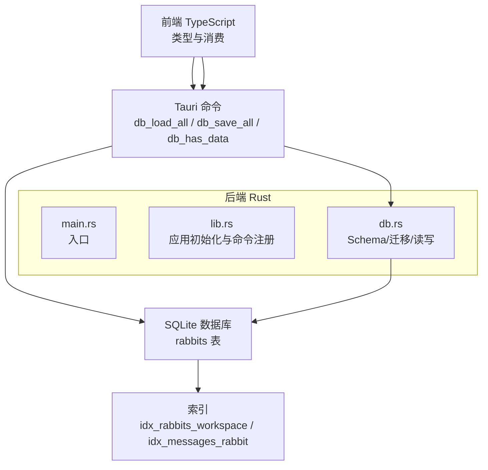
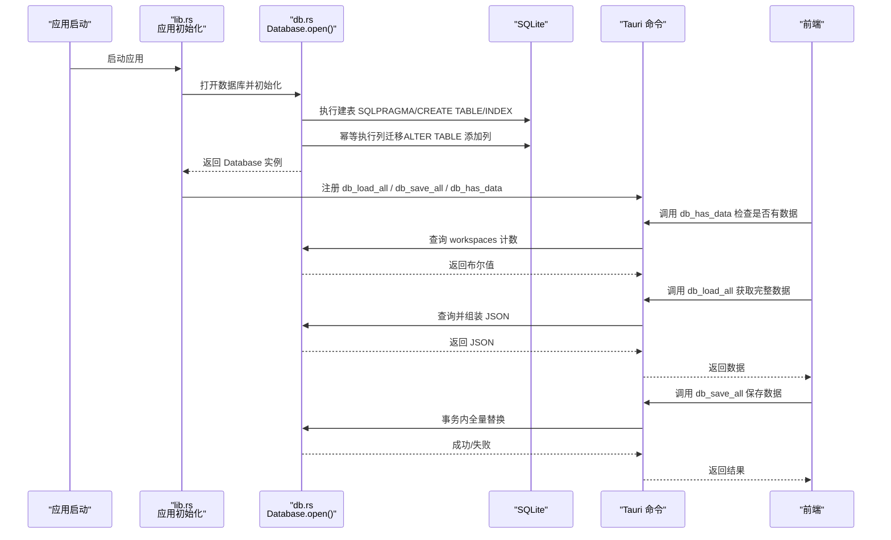
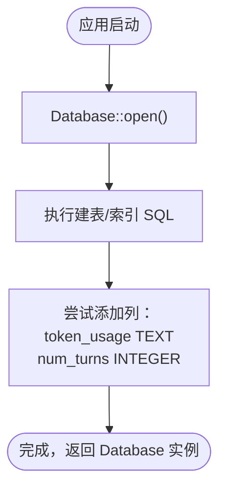
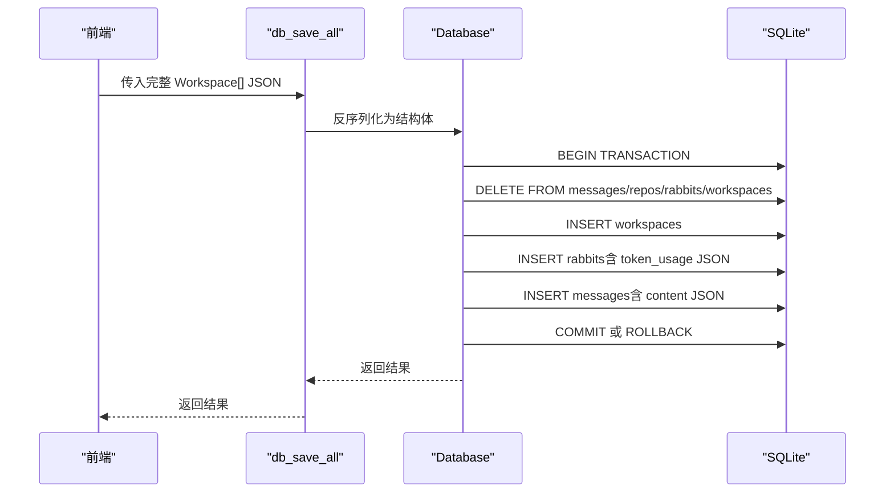
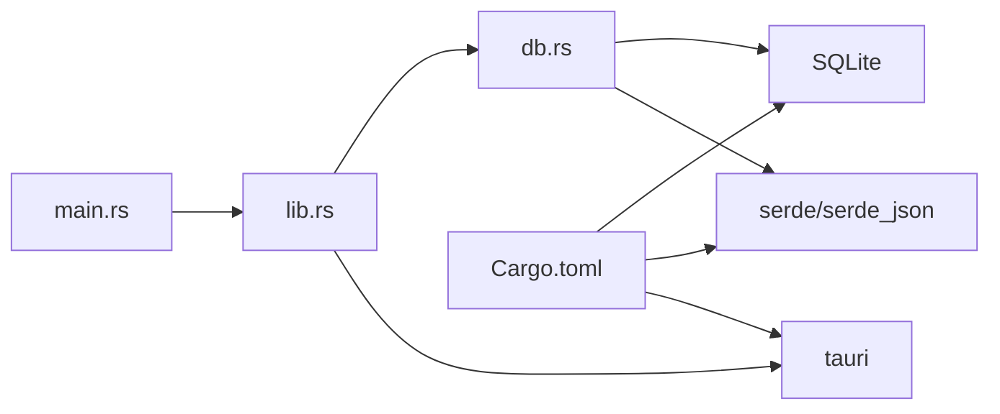
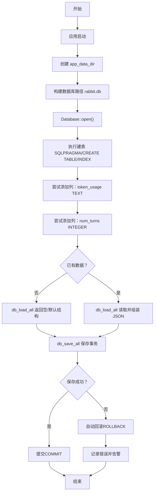

# 数据迁移

<cite>
**本文引用的文件**
- [main.rs](file://src-tauri/src/main.rs)
- [lib.rs](file://src-tauri/src/lib.rs)
- [db.rs](file://src-tauri/src/db.rs)
- [Cargo.toml](file://src-tauri/Cargo.toml)
- [index.ts](file://src/types/index.ts)
- [useUsage.ts](file://src/hooks/useUsage.ts)
- [protocol.ts](file://sidecar/src/protocol.ts)
</cite>

## 目录
1. [简介](#简介)
2. [项目结构](#项目结构)
3. [核心组件](#核心组件)
4. [架构总览](#架构总览)
5. [详细组件分析](#详细组件分析)
6. [依赖关系分析](#依赖关系分析)
7. [性能考量](#性能考量)
8. [故障排查指南](#故障排查指南)
9. [结论](#结论)
10. [附录](#附录)

## 简介
本文件面向 RabbitCoding 的数据库迁移场景，聚焦于“现有数据库升级的幂等性设计”、“列迁移处理（token_usage、num_turns 字段添加）”、“迁移脚本的执行时机与错误处理机制”、“回滚策略”、“向后兼容性保障”、“数据完整性验证”、“迁移状态跟踪”，以及“迁移测试方法、常见问题排查与手动修复步骤”。文档同时提供完整的迁移流程图与操作指南，帮助研发与运维人员安全、可控地推进数据库演进。

## 项目结构
RabbitCoding 的数据库逻辑集中在 Tauri 后端（Rust）侧，前端使用 TypeScript 类型定义与消费数据。数据库采用 SQLite（rusqlite），通过 Tauri 命令暴露读写接口。迁移策略的关键点包括：
- 初始化阶段执行建表与列迁移（幂等）
- 通过 Tauri 命令进行数据加载/保存
- 前端类型与后端序列化保持一致（camelCase）

图表来源
- [lib.rs:197-390](file://src-tauri/src/lib.rs#L197-L390)
- [db.rs:85-161](file://src-tauri/src/db.rs#L85-L161)
- [main.rs:1-7](file://src-tauri/src/main.rs#L1-L7)

章节来源
- [lib.rs:197-390](file://src-tauri/src/lib.rs#L197-L390)
- [db.rs:85-161](file://src-tauri/src/db.rs#L85-L161)
- [main.rs:1-7](file://src-tauri/src/main.rs#L1-L7)

## 核心组件
- 数据库初始化与迁移
  - 建表 SQL（PRAGMA、表结构、索引）
  - 列迁移：为 rabbits 表添加 token_usage（TEXT）、num_turns（INTEGER）两列
  - 幂等性：重复执行不会报错（忽略重复列错误）
- 数据读写命令
  - db_load_all：查询 workspaces、rabbits、messages、repos，组装为 JSON
  - db_save_all：事务内全量替换（清空四表后批量插入）
  - db_has_data：检查是否已有数据（用于判断是否需要迁移）
- 前端类型与序列化
  - Rust 结构体与 JSON 字段命名统一为 camelCase
  - Rabbit 类型包含 tokenUsage、numTurns 等字段
  - 前端 hook 与协议中也体现相同字段语义

章节来源
- [db.rs:85-161](file://src-tauri/src/db.rs#L85-L161)
- [db.rs:167-416](file://src-tauri/src/db.rs#L167-L416)
- [index.ts:8-42](file://src/types/index.ts#L8-L42)
- [useUsage.ts:1-89](file://src/hooks/useUsage.ts#L1-L89)
- [protocol.ts:175-222](file://sidecar/src/protocol.ts#L175-L222)

## 架构总览
数据库迁移与数据访问的整体流程如下：

图表来源
- [lib.rs:197-390](file://src-tauri/src/lib.rs#L197-L390)
- [db.rs:140-161](file://src-tauri/src/db.rs#L140-L161)
- [db.rs:392-416](file://src-tauri/src/db.rs#L392-L416)

## 详细组件分析

### 数据库初始化与列迁移（幂等）
- 建表与索引
  - 通过 SCHEMA_SQL 执行 PRAGMA 设置、建表与索引创建
  - 索引包括 rabbits 的 workspace_id、repos 的 workspace_id、messages 的 (rabbit_id, seq)
- 列迁移策略
  - 在建表之后，对 rabbits 表执行两次 ALTER TABLE 添加列
  - 采用“尝试执行，忽略重复列错误”的方式，保证幂等
- 执行时机
  - 在 Database::open() 中完成，应用启动时即执行
  - 通过 Tauri setup 阶段调用 Database::open()

图表来源
- [db.rs:140-161](file://src-tauri/src/db.rs#L140-L161)

章节来源
- [db.rs:85-161](file://src-tauri/src/db.rs#L85-L161)
- [lib.rs:206-222](file://src-tauri/src/lib.rs#L206-L222)

### 数据读取与保存（事务与完整性）
- 读取流程
  - 查询 workspaces（按 created_at 降序）
  - 针对每个 workspace 查询 rabbits（按 created_at 降序）
  - 针对每个 rabbit 查询 messages（按 seq 升序），并反序列化为 JSON
  - 查询 repos（按 created_at 升序）
  - 组装为 JSON 返回
- 保存流程
  - 事务内执行：删除四表数据，再批量插入
  - 插入 rabbits 时，将 token_usage 序列化为 JSON 字符串存入 TEXT 列
  - 插入 messages 时，将消息对象序列化为 JSON 字符串存入 content 列
- 完整性与一致性
  - 通过 BEGIN/COMMIT/ROLLBACK 保证原子性
  - 删除旧数据后再插入新数据，避免部分写入导致的数据不一致

图表来源
- [db.rs:290-386](file://src-tauri/src/db.rs#L290-L386)

章节来源
- [db.rs:167-288](file://src-tauri/src/db.rs#L167-L288)
- [db.rs:290-386](file://src-tauri/src/db.rs#L290-L386)

### 前端类型与序列化对齐
- Rust 结构体字段命名统一为 camelCase，与前端类型保持一致
- RabbitData 包含 token_usage（Option<TokenUsageData>）与 num_turns（Option<i64>）
- TokenUsageData 字段映射到前端 TokenUsage 接口
- 前端 hook useUsage 与协议中的 UsageUpdateMessage、ResultMessage 等体现相同字段语义

章节来源
- [db.rs:25-65](file://src-tauri/src/db.rs#L25-L65)
- [index.ts:8-42](file://src/types/index.ts#L8-L42)
- [useUsage.ts:1-89](file://src/hooks/useUsage.ts#L1-L89)
- [protocol.ts:175-222](file://sidecar/src/protocol.ts#L175-L222)

## 依赖关系分析
- 应用入口与初始化
  - main.rs 作为二进制入口，调用 rabbit_coding_lib::run()
  - lib.rs 中在 setup 阶段创建 app_data_dir，构建数据库路径，调用 Database::open()
- 依赖库
  - rusqlite：SQLite 驱动
  - serde/serde_json：结构体与 JSON 序列化/反序列化
  - tauri：命令注册与跨语言桥接

图表来源
- [main.rs:1-7](file://src-tauri/src/main.rs#L1-L7)
- [lib.rs:197-390](file://src-tauri/src/lib.rs#L197-L390)
- [db.rs:1-5](file://src-tauri/src/db.rs#L1-L5)
- [Cargo.toml:20-39](file://src-tauri/Cargo.toml#L20-L39)

章节来源
- [Cargo.toml:20-39](file://src-tauri/Cargo.toml#L20-L39)
- [lib.rs:197-390](file://src-tauri/src/lib.rs#L197-L390)
- [db.rs:1-5](file://src-tauri/src/db.rs#L1-L5)

## 性能考量
- 索引优化
  - rabbits/workspace_id、messages/rabbit_id+seq 索引提升查询效率
- 事务批处理
  - 保存时使用事务，批量删除与插入，降低写放大
- JSON 存储
  - token_usage 以 JSON 字符串形式存入 TEXT 列，便于扩展与兼容
- I/O 与并发
  - 数据库连接通过 Mutex 保护，避免并发写冲突

[本节为通用性能建议，不直接分析具体文件]

## 故障排查指南
- 常见问题与定位
  - 数据库打开失败：检查 app_data_dir 是否可写、路径是否存在
  - 列迁移失败：确认 SQLite 版本与 ALTER TABLE 支持情况
  - 读取/保存异常：查看命令返回的错误字符串，定位具体 SQL 语句
  - JSON 序列化失败：检查 token_usage 是否为空、messages 是否合法
- 错误处理机制
  - 所有数据库操作均返回 Result<String, String>，错误信息包含具体 SQL 与原因
  - 保存失败时自动回滚（ROLLBACK），保证数据一致性
- 回滚策略
  - 保存失败自动回滚，无需手动干预
  - 若需手动回滚，可备份数据库后重试；由于迁移是幂等的，再次执行不会产生副作用
- 数据完整性验证
  - 使用 db_has_data 检查 workspaces 表记录数，判断是否已有数据
  - 保存后再次读取，比对 JSON 结构与字段一致性
- 手动修复步骤
  - 备份数据库文件
  - 确认 rabbits 表已包含 token_usage 与 num_turns 列
  - 如需修复历史数据，可在前端或后端补全缺失字段后再保存

章节来源
- [db.rs:140-161](file://src-tauri/src/db.rs#L140-L161)
- [db.rs:290-305](file://src-tauri/src/db.rs#L290-L305)
- [db.rs:408-416](file://src-tauri/src/db.rs#L408-L416)

## 结论
RabbitCoding 的数据库迁移策略以“幂等、事务、JSON 序列化”为核心原则：
- 在应用启动时执行建表与列迁移，保证数据库结构演进的可控性
- 通过事务与索引保障数据完整性与查询性能
- 前后端字段命名统一，降低迁移带来的兼容性风险
- 提供完善的错误处理与回滚机制，确保迁移过程稳定可靠

[本节为总结性内容，不直接分析具体文件]

## 附录

### 迁移测试方法
- 单元/集成测试建议
  - 准备空数据库与已有数据两种场景，分别验证 db_has_data、db_load_all、db_save_all
  - 验证 token_usage JSON 正确序列化与反序列化
  - 验证 num_turns 字段在读写过程中的正确性
- 端到端测试建议
  - 启动应用，调用 db_has_data 判断是否需要迁移
  - 导出数据后清空数据库，重新导入，验证一致性
  - 观察前端统计（useUsage）是否正确聚合 tokenUsage 与 numTurns

[本节为通用测试建议，不直接分析具体文件]

### 迁移流程图（完整版）

图表来源
- [lib.rs:206-222](file://src-tauri/src/lib.rs#L206-L222)
- [db.rs:140-161](file://src-tauri/src/db.rs#L140-L161)
- [db.rs:167-288](file://src-tauri/src/db.rs#L167-L288)
- [db.rs:290-386](file://src-tauri/src/db.rs#L290-L386)
- [db.rs:408-416](file://src-tauri/src/db.rs#L408-L416)