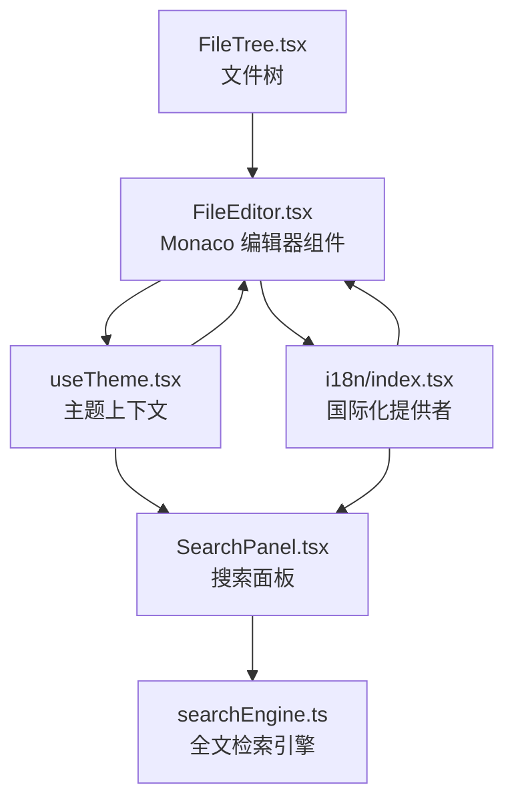
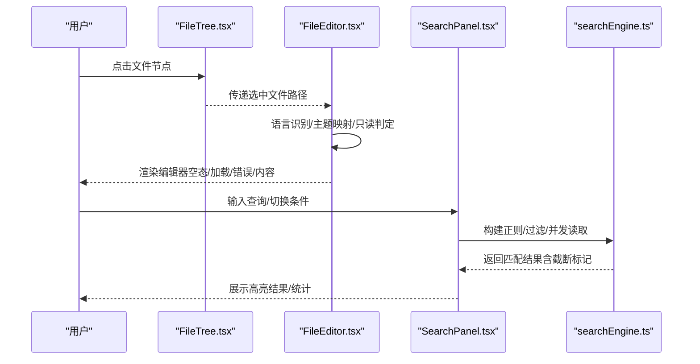
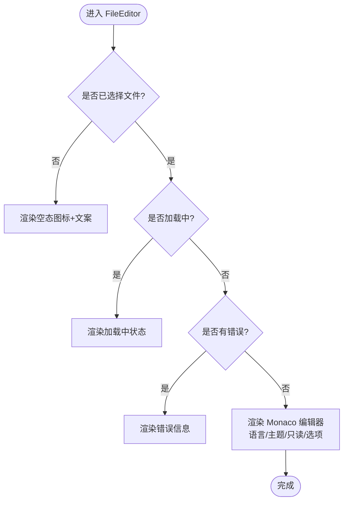
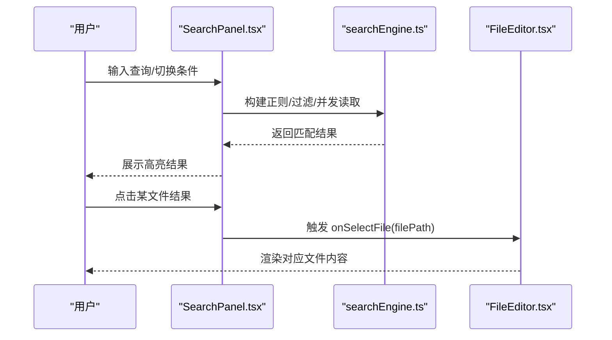
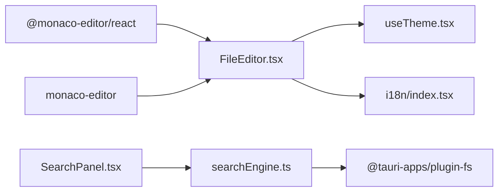

# 代码编辑器

<cite>
**本文引用的文件**
- [src/components/files/FileEditor.tsx](file://src/components/files/FileEditor.tsx)
- [src/hooks/useTheme.tsx](file://src/hooks/useTheme.tsx)
- [src/i18n/index.tsx](file://src/i18n/index.tsx)
- [src/i18n/locales/en.ts](file://src/i18n/locales/en.ts)
- [src/i18n/locales/zh.ts](file://src/i18n/locales/zh.ts)
- [src/components/files/SearchPanel.tsx](file://src/components/files/SearchPanel.tsx)
- [src/components/files/searchEngine.ts](file://src/components/files/searchEngine.ts)
- [src/components/files/FileTree.tsx](file://src/components/files/FileTree.tsx)
- [src/components/terminal/terminal-theme.ts](file://src/components/terminal/terminal-theme.ts)
- [pnpm-lock.yaml](file://pnpm-lock.yaml)
</cite>

## 目录
1. [简介](#简介)
2. [项目结构](#项目结构)
3. [核心组件](#核心组件)
4. [架构总览](#架构总览)
5. [详细组件分析](#详细组件分析)
6. [依赖关系分析](#依赖关系分析)
7. [性能考量](#性能考量)
8. [故障排查指南](#故障排查指南)
9. [结论](#结论)
10. [附录](#附录)

## 简介
本文件面向 RabbitCoding 代码编辑器组件，聚焦于 Monaco Editor 的集成方式、编辑器配置、语法高亮、文件内容加载、编辑模式切换、保存机制、主题配置、快捷键绑定、代码补全、性能优化、内存管理、错误处理策略，并提供定制化配置与使用示例。文档同时覆盖与编辑器协同的搜索面板与文件树组件，帮助读者理解完整的“文件浏览-编辑-搜索”工作流。

## 项目结构
与编辑器相关的核心文件组织如下：
- 编辑器组件：src/components/files/FileEditor.tsx
- 主题钩子：src/hooks/useTheme.tsx
- 国际化提供者与词条：src/i18n/index.tsx、src/i18n/locales/en.ts、src/i18n/locales/zh.ts
- 搜索面板与全文检索引擎：src/components/files/SearchPanel.tsx、src/components/files/searchEngine.ts
- 文件树组件：src/components/files/FileTree.tsx
- 终端主题（对比参考）：src/components/terminal/terminal-theme.ts
- 依赖锁定：pnpm-lock.yaml

图表来源
- [src/components/files/FileEditor.tsx:1-182](file://src/components/files/FileEditor.tsx#L1-L182)
- [src/hooks/useTheme.tsx:1-63](file://src/hooks/useTheme.tsx#L1-L63)
- [src/i18n/index.tsx:1-20](file://src/i18n/index.tsx#L1-L20)
- [src/components/files/SearchPanel.tsx:1-410](file://src/components/files/SearchPanel.tsx#L1-L410)
- [src/components/files/searchEngine.ts:1-330](file://src/components/files/searchEngine.ts#L1-L330)
- [src/components/files/FileTree.tsx:1-39](file://src/components/files/FileTree.tsx#L1-L39)

章节来源
- [src/components/files/FileEditor.tsx:1-182](file://src/components/files/FileEditor.tsx#L1-L182)
- [src/hooks/useTheme.tsx:1-63](file://src/hooks/useTheme.tsx#L1-L63)
- [src/i18n/index.tsx:1-20](file://src/i18n/index.tsx#L1-L20)
- [src/components/files/SearchPanel.tsx:1-410](file://src/components/files/SearchPanel.tsx#L1-L410)
- [src/components/files/searchEngine.ts:1-330](file://src/components/files/searchEngine.ts#L1-L330)
- [src/components/files/FileTree.tsx:1-39](file://src/components/files/FileTree.tsx#L1-L39)

## 核心组件
- FileEditor：基于 @monaco-editor/react 的编辑器容器，负责语言识别、主题映射、只读/可编辑切换、内容变更回调、空态/加载态/错误态渲染。
- useTheme：提供主题选择（系统/浅色/深色）与实际生效主题的解析，同步到 <html> 以驱动暗色变体与原生控件外观。
- I18nProvider：提供语言选择（持久化）与翻译函数，用于编辑器空态文案与搜索面板文案。
- SearchPanel + searchEngine：提供工作区范围的全文检索、高亮、并发读取、超时/截断控制。
- FileTree：文件树导航，配合编辑器实现“点击即打开”。

章节来源
- [src/components/files/FileEditor.tsx:121-181](file://src/components/files/FileEditor.tsx#L121-L181)
- [src/hooks/useTheme.tsx:10-62](file://src/hooks/useTheme.tsx#L10-L62)
- [src/i18n/index.tsx:7-19](file://src/i18n/index.tsx#L7-L19)
- [src/components/files/SearchPanel.tsx:129-409](file://src/components/files/SearchPanel.tsx#L129-L409)
- [src/components/files/searchEngine.ts:260-330](file://src/components/files/searchEngine.ts#L260-L330)
- [src/components/files/FileTree.tsx:13-38](file://src/components/files/FileTree.tsx#L13-L38)

## 架构总览
编辑器工作流从“文件选择”到“内容编辑”，再到“搜索与导航”的闭环：

图表来源
- [src/components/files/FileTree.tsx:13-38](file://src/components/files/FileTree.tsx#L13-L38)
- [src/components/files/FileEditor.tsx:121-181](file://src/components/files/FileEditor.tsx#L121-L181)
- [src/components/files/SearchPanel.tsx:152-198](file://src/components/files/SearchPanel.tsx#L152-L198)
- [src/components/files/searchEngine.ts:260-330](file://src/components/files/searchEngine.ts#L260-L330)

## 详细组件分析

### Monaco 编辑器集成与配置
- 离线本地化：通过 self.MonacoEnvironment 注入本地 Worker（editor/ts/json/css/html），避免 CDN 依赖，确保桌面应用离线可用与全语言支持。
- 初始化：loader.config({ monaco }) 注入本地实例，初始化时直接 resolve，不走 CDN 注入流程。
- 语言识别：根据文件扩展名映射到 Monaco 语言标识，覆盖常见语言与特殊场景（如 gradle.kts -> kotlin）。
- 主题映射：resolvedTheme 为 'dark' 时使用 'vs-dark'，否则 'vs'。
- 编辑行为：只读/可写、最小化滚动条、自动布局、行号、软换行、内边距、上下文菜单、DOM 只读等。
- 事件回调：onChange 仅在 editable 为真时触发，避免非编辑态误写。

图表来源
- [src/components/files/FileEditor.tsx:121-181](file://src/components/files/FileEditor.tsx#L121-L181)

章节来源
- [src/components/files/FileEditor.tsx:12-35](file://src/components/files/FileEditor.tsx#L12-L35)
- [src/components/files/FileEditor.tsx:46-119](file://src/components/files/FileEditor.tsx#L46-L119)
- [src/components/files/FileEditor.tsx:155-181](file://src/components/files/FileEditor.tsx#L155-L181)

### 语法高亮实现
- 语言映射：getLanguage(filePath) 将扩展名映射到 Monaco 语言标识，覆盖 JS/TS、CSS/SCSS/LESS、HTML、JSON、Python、Go、Rust、Shell、SQL、XML、Vue、Svelte、Java、C/C++、Ruby、PHP、Swift、Kotlin、Dart、Lua、R、Scala、Groovy、INI/TOML、GraphQL、ProtoBuf、Dockerfile、批处理、PowerShell、Diff、TXT 等。
- 语言选择逻辑：优先处理双扩展名（如 .gradle.kts -> kotlin；.gradle -> java；.properties/.env -> ini；dockerfile/makefile）。

章节来源
- [src/components/files/FileEditor.tsx:46-119](file://src/components/files/FileEditor.tsx#L46-L119)

### 文件内容加载、编辑模式切换与保存机制
- 内容加载：FileEditor 接收 content 字符串作为初始值，value={content ?? ''} 传入编辑器。
- 编辑模式切换：editable 控制只读/可写；onChange 仅在 editable 为真时回调父组件，便于统一保存。
- 保存机制：编辑器本身不直接写文件；保存通常由上层调用方在 onContentChange 回调中触发写入逻辑（例如通过 Tauri 插件 fs）。编辑器仅负责渲染与事件透传。

章节来源
- [src/components/files/FileEditor.tsx:37-44](file://src/components/files/FileEditor.tsx#L37-L44)
- [src/components/files/FileEditor.tsx:161-165](file://src/components/files/FileEditor.tsx#L161-L165)

### 主题配置与国际化
- 主题：useTheme 提供 theme/system、resolvedTheme/dark/light，自动同步到 <html>，驱动暗色变体与原生控件外观；编辑器 theme 映射遵循 resolvedTheme。
- 国际化：I18nProvider 持久化语言选择，FileEditor 中的空态文案来自 fileEditor.selectFile/fileEditor.loading；SearchPanel 的占位与按钮文案来自 i18n。

章节来源
- [src/hooks/useTheme.tsx:25-56](file://src/hooks/useTheme.tsx#L25-L56)
- [src/i18n/index.tsx:7-19](file://src/i18n/index.tsx#L7-L19)
- [src/i18n/locales/en.ts:174-177](file://src/i18n/locales/en.ts#L174-L177)
- [src/i18n/locales/zh.ts:174-177](file://src/i18n/locales/zh.ts#L174-L177)

### 快捷键绑定与代码补全
- 快捷键绑定：编辑器默认快捷键由 Monaco 提供，可在 options 中进一步微调（如禁用上下文菜单、调整行高/字号等），但未在组件中显式覆盖。
- 代码补全：编辑器默认启用语言感知的智能提示与补全；若需扩展 LSP 或自定义补全，可在初始化阶段注册语言服务（当前组件未显式注册）。

章节来源
- [src/components/files/FileEditor.tsx:166-178](file://src/components/files/FileEditor.tsx#L166-L178)

### 搜索与导航（与编辑器协同）
- SearchPanel：提供搜索/替换、大小写/整词/正则、包含/排除模式、展开/收起细节、替换全部/清空等。
- searchEngine：构建正则、glob 过滤、并发读取、大文件/二进制文件过滤、匹配上限与截断标记、AbortController 支持。
- 协同：点击搜索结果中的文件路径，SearchPanel 调用 onSelectFile，FileTree 与 FileEditor 协作打开对应文件。

图表来源
- [src/components/files/SearchPanel.tsx:152-198](file://src/components/files/SearchPanel.tsx#L152-L198)
- [src/components/files/searchEngine.ts:260-330](file://src/components/files/searchEngine.ts#L260-L330)
- [src/components/files/FileEditor.tsx:121-181](file://src/components/files/FileEditor.tsx#L121-L181)

章节来源
- [src/components/files/SearchPanel.tsx:129-409](file://src/components/files/SearchPanel.tsx#L129-L409)
- [src/components/files/searchEngine.ts:1-330](file://src/components/files/searchEngine.ts#L1-L330)

### 文件树与打开文件
- FileTree：遍历节点，支持展开/折叠目录、选中路径高亮、回调 onSelectFile。
- 协同：FileTree onSelectFile -> 上层路由/状态更新 -> FileEditor 获取新 filePath/content -> 渲染编辑器。

章节来源
- [src/components/files/FileTree.tsx:13-38](file://src/components/files/FileTree.tsx#L13-L38)

## 依赖关系分析
- 编辑器依赖：@monaco-editor/react、monaco-editor、lucide-react。
- 国际化：i18n 提供者与词条。
- 主题：useTheme 提供主题上下文。
- 搜索：SearchPanel 依赖 searchEngine；searchEngine 依赖 @tauri-apps/plugin-fs 进行文件系统读取。

图表来源
- [pnpm-lock.yaml:1719-1721](file://pnpm-lock.yaml#L1719-L1721)
- [pnpm-lock.yaml:2247-2252](file://pnpm-lock.yaml#L2247-L2252)
- [src/components/files/FileEditor.tsx:1-10](file://src/components/files/FileEditor.tsx#L1-L10)
- [src/components/files/SearchPanel.tsx:1-14](file://src/components/files/SearchPanel.tsx#L1-L14)
- [src/components/files/searchEngine.ts](file://src/components/files/searchEngine.ts#L1)

章节来源
- [pnpm-lock.yaml:1719-1721](file://pnpm-lock.yaml#L1719-L1721)
- [pnpm-lock.yaml:2247-2252](file://pnpm-lock.yaml#L2247-L2252)
- [src/components/files/FileEditor.tsx:1-10](file://src/components/files/FileEditor.tsx#L1-L10)
- [src/components/files/SearchPanel.tsx:1-14](file://src/components/files/SearchPanel.tsx#L1-L14)
- [src/components/files/searchEngine.ts](file://src/components/files/searchEngine.ts#L1)

## 性能考量
- 并发与限流：searchEngine 使用并发池（CONCURRENCY=12）读取文件，避免阻塞 UI。
- 大文件与二进制文件：MAX_FILE_SIZE=1MB、BINARY_EXTS 黑名单过滤，减少无效 IO。
- 匹配上限：MAX_MATCHES_PER_FILE=1000、MAX_FILES=5000，防止内存爆炸。
- 取消与防抖：AbortController 与 DEBOUNCE_MS=400，避免重复计算与资源浪费。
- 编辑器渲染：automaticLayout、minimap 关闭、行高/字号固定，降低重排成本。

章节来源
- [src/components/files/searchEngine.ts:55-62](file://src/components/files/searchEngine.ts#L55-L62)
- [src/components/files/searchEngine.ts:239-258](file://src/components/files/searchEngine.ts#L239-L258)
- [src/components/files/SearchPanel.tsx:22-22](file://src/components/files/SearchPanel.tsx#L22-L22)
- [src/components/files/FileEditor.tsx:166-178](file://src/components/files/FileEditor.tsx#L166-L178)

## 故障排查指南
- 编辑器空白或长时间加载
  - 检查 filePath 是否存在且 content 是否传入；确认 getLanguage 能正确识别扩展名。
  - 若为二进制/超大文件，编辑器会显示空态或错误态，需在上游过滤。
- 语言高亮异常
  - 检查扩展名映射是否覆盖目标文件；必要时扩展 getLanguage 映射表。
- 搜索无结果或卡顿
  - 确认 include/exclude 模式是否正确；检查忽略目录集合；观察 truncated 标记。
  - 调整并发与阈值（如 MAX_FILES、CONCURRENCY）以适配项目规模。
- 主题不生效
  - 确认 useTheme 的 resolvedTheme 计算逻辑与 <html> 的 dark 类同步；编辑器 theme 依赖 resolvedTheme。
- 保存未生效
  - 确认 editable 为真时才会触发 onChange；保存逻辑应在父组件中实现（如通过 Tauri fs 插件）。

章节来源
- [src/components/files/FileEditor.tsx:121-181](file://src/components/files/FileEditor.tsx#L121-L181)
- [src/components/files/FileEditor.tsx:46-119](file://src/components/files/FileEditor.tsx#L46-L119)
- [src/components/files/searchEngine.ts:52-62](file://src/components/files/searchEngine.ts#L52-L62)
- [src/components/files/SearchPanel.tsx:152-198](file://src/components/files/SearchPanel.tsx#L152-L198)
- [src/hooks/useTheme.tsx:41-49](file://src/hooks/useTheme.tsx#L41-L49)

## 结论
RabbitCoding 的编辑器组件以 @monaco-editor/react 为核心，结合本地化 Worker、主题与国际化上下文，提供了稳定、可定制的编辑体验。通过与搜索面板、文件树的协作，形成“浏览-编辑-检索”的高效工作流。性能方面通过并发、阈值与取消机制保障了大项目的流畅性。若需进一步增强（如 LSP 补全、自定义快捷键），可在现有初始化与选项基础上扩展。

## 附录

### 编辑器配置清单（关键项）
- 语言识别：getLanguage(filePath) 映射扩展名到 Monaco 语言标识
- 主题映射：resolvedTheme -> Monaco 主题（vs vs-dark）
- 只读/可写：editable 控制 DOM 只读与 onChange 触发
- 编辑器选项：只读、最小化缩放、自动布局、行号、软换行、内边距、上下文菜单
- Worker 注入：editor/ts/json/css/html 本地 Worker

章节来源
- [src/components/files/FileEditor.tsx:46-119](file://src/components/files/FileEditor.tsx#L46-L119)
- [src/components/files/FileEditor.tsx:155-181](file://src/components/files/FileEditor.tsx#L155-L181)
- [src/components/files/FileEditor.tsx:12-35](file://src/components/files/FileEditor.tsx#L12-L35)

### 搜索配置清单（关键项）
- 正则构建：大小写/整词/正则开关
- glob 过滤：包含/排除模式
- 并发读取：CONCURRENCY=12
- 大小限制：MAX_FILE_SIZE=1MB、MAX_MATCHES_PER_FILE=1000、MAX_FILES=5000
- 取消控制：AbortController

章节来源
- [src/components/files/searchEngine.ts:131-152](file://src/components/files/searchEngine.ts#L131-L152)
- [src/components/files/searchEngine.ts:68-120](file://src/components/files/searchEngine.ts#L68-L120)
- [src/components/files/searchEngine.ts:239-258](file://src/components/files/searchEngine.ts#L239-L258)
- [src/components/files/searchEngine.ts:52-62](file://src/components/files/searchEngine.ts#L52-L62)
- [src/components/files/SearchPanel.tsx:152-198](file://src/components/files/SearchPanel.tsx#L152-L198)

### 主题与终端对比参考
- 编辑器主题：resolvedTheme -> Monaco 主题（vs vs-dark）
- 终端主题：terminal-theme.ts 提供亮/暗两套颜色方案，可作为 UI 主题一致性参考

章节来源
- [src/hooks/useTheme.tsx:41-49](file://src/hooks/useTheme.tsx#L41-L49)
- [src/components/terminal/terminal-theme.ts:1-57](file://src/components/terminal/terminal-theme.ts#L1-L57)