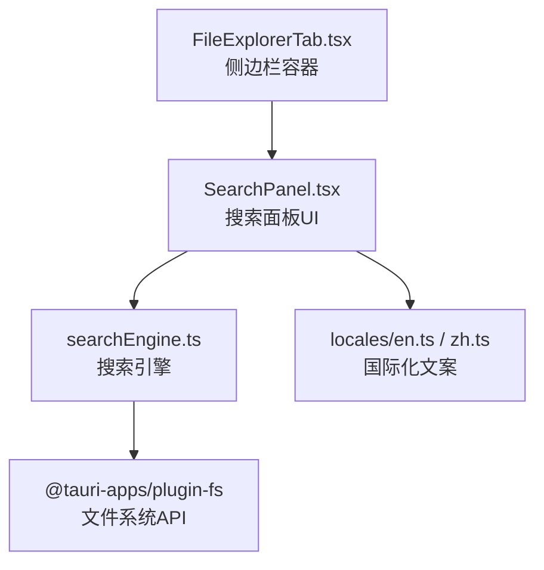
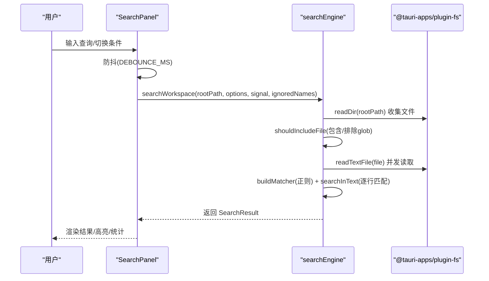
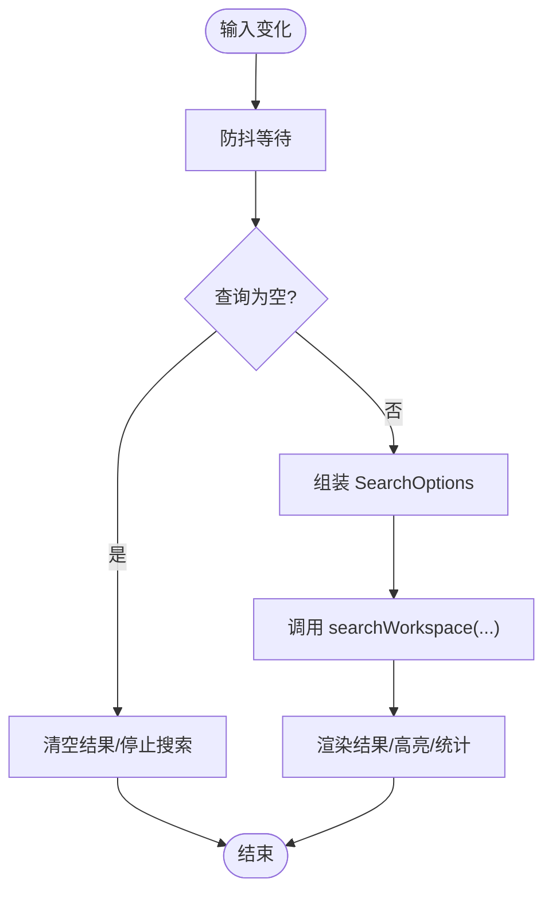
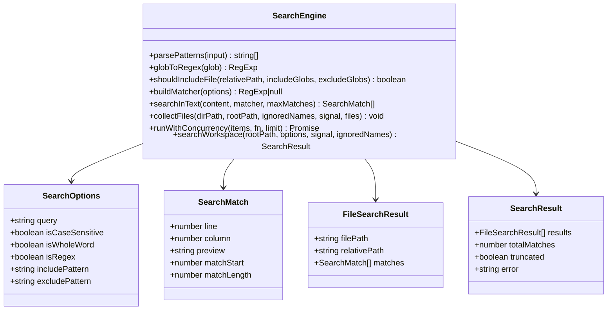
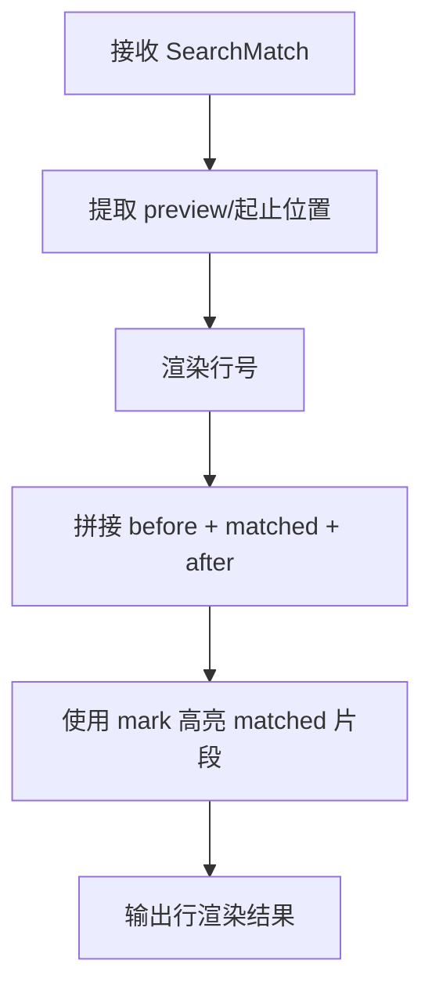
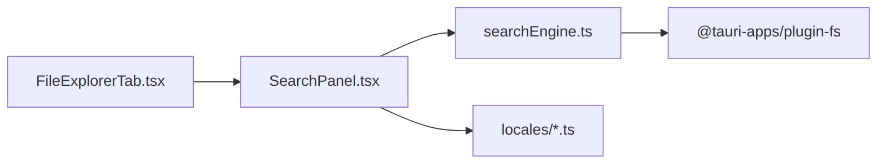

# 文件搜索

<cite>
**本文引用的文件**
- [SearchPanel.tsx](file://src/components/files/SearchPanel.tsx)
- [searchEngine.ts](file://src/components/files/searchEngine.ts)
- [types.ts](file://src/components/files/types.ts)
- [en.ts](file://src/i18n/locales/en.ts)
- [zh.ts](file://src/i18n/locales/zh.ts)
- [FileExplorerTab.tsx](file://src/components/files/FileExplorerTab.tsx)
</cite>

## 目录
1. [简介](#简介)
2. [项目结构](#项目结构)
3. [核心组件](#核心组件)
4. [架构总览](#架构总览)
5. [详细组件分析](#详细组件分析)
6. [依赖关系分析](#依赖关系分析)
7. [性能考量](#性能考量)
8. [故障排查指南](#故障排查指南)
9. [结论](#结论)
10. [附录](#附录)

## 简介
本文件面向 RabbitCoding 的“文件搜索”功能，提供从架构到实现细节的完整说明。重点覆盖：
- 搜索面板的 UI 架构与交互流程
- 搜索算法与匹配逻辑（正则/全文/单词边界）
- 文件匹配与过滤（glob 模式、忽略集合、二进制/大文件保护）
- 结果渲染与高亮机制
- 性能优化策略（并发、节流、截断、取消）
- 配置选项与使用示例
- 常见问题与优化建议

## 项目结构
搜索功能主要分布在以下文件中：
- UI 面板：SearchPanel.tsx
- 搜索引擎：searchEngine.ts
- 类型定义：types.ts
- 国际化文案：locales/en.ts、locales/zh.ts
- 集成入口：FileExplorerTab.tsx（将搜索面板挂载到文件树侧边栏）

图表来源
- [FileExplorerTab.tsx:389-406](file://src/components/files/FileExplorerTab.tsx#L389-L406)
- [SearchPanel.tsx:129-198](file://src/components/files/SearchPanel.tsx#L129-L198)
- [searchEngine.ts:261-330](file://src/components/files/searchEngine.ts#L261-L330)

章节来源
- [SearchPanel.tsx:129-198](file://src/components/files/SearchPanel.tsx#L129-L198)
- [searchEngine.ts:261-330](file://src/components/files/searchEngine.ts#L261-L330)
- [FileExplorerTab.tsx:389-406](file://src/components/files/FileExplorerTab.tsx#L389-L406)

## 核心组件
- 搜索面板（SearchPanel）
  - 负责输入、条件开关（大小写、整词、正则）、包含/排除模式、替换区域、结果展示与高亮
  - 使用防抖触发搜索，支持中断与错误提示
- 搜索引擎（searchEngine）
  - 实现文件收集、glob 过滤、并发读取、正则构建与匹配、结果聚合
  - 包含二进制文件与大文件保护、全局文件数上限、单文件匹配上限
- 类型定义（types）
  - 定义搜索选项、匹配结果、文件结果等接口
- 国际化（locales）
  - 提供搜索面板文案（占位符、按钮、状态提示等）
- 集成入口（FileExplorerTab）
  - 将搜索面板作为侧边栏的一个视图，与文件树联动

章节来源
- [SearchPanel.tsx:129-198](file://src/components/files/SearchPanel.tsx#L129-L198)
- [searchEngine.ts:7-35](file://src/components/files/searchEngine.ts#L7-L35)
- [types.ts:1-10](file://src/components/files/types.ts#L1-L10)
- [en.ts:178-196](file://src/i18n/locales/en.ts#L178-L196)
- [zh.ts:178-196](file://src/i18n/locales/zh.ts#L178-L196)
- [FileExplorerTab.tsx:389-406](file://src/components/files/FileExplorerTab.tsx#L389-L406)

## 架构总览
搜索从 UI 输入出发，经由防抖与条件组合，调用引擎进行文件扫描与匹配，最终在 UI 中渲染结果并高亮命中片段。

图表来源
- [SearchPanel.tsx:153-198](file://src/components/files/SearchPanel.tsx#L153-L198)
- [searchEngine.ts:261-330](file://src/components/files/searchEngine.ts#L261-L330)

## 详细组件分析

### 搜索面板（SearchPanel）
- 输入与条件
  - 查询文本、大小写、整词、正则、包含/排除模式、替换区域
  - 使用防抖（DEBOUNCE_MS）减少频繁搜索
- 控制流
  - 空查询时清空结果；每次触发前取消上一次搜索（AbortController）
  - 将选项打包为 SearchOptions 传递给引擎
- 结果渲染
  - 文件分组展开/收起
  - 行内高亮：使用 mark 标签突出匹配片段，左侧显示行号
  - 统计与截断提示
- 国际化
  - 所有文案来自 i18n，支持中英双语

图表来源
- [SearchPanel.tsx:153-198](file://src/components/files/SearchPanel.tsx#L153-L198)
- [SearchPanel.tsx:61-76](file://src/components/files/SearchPanel.tsx#L61-L76)

章节来源
- [SearchPanel.tsx:129-198](file://src/components/files/SearchPanel.tsx#L129-L198)
- [SearchPanel.tsx:61-76](file://src/components/files/SearchPanel.tsx#L61-L76)
- [en.ts:178-196](file://src/i18n/locales/en.ts#L178-L196)
- [zh.ts:178-196](file://src/i18n/locales/zh.ts#L178-L196)

### 搜索引擎（searchEngine）
- 数据结构
  - SearchOptions：查询、大小写、整词、正则、包含/排除模式
  - SearchMatch：行号、列号、预览片段、匹配起始与长度
  - FileSearchResult：文件绝对路径、相对路径、匹配集合
  - SearchResult：结果数组、总数、是否截断、错误信息
- 关键常量
  - 二进制文件扩展黑名单、最大文件大小、全局文件上限、单文件匹配上限、并发读取上限
- glob 过滤
  - parsePatterns：逗号分隔的模式解析
  - globToRegex：将 glob 转为正则（支持 * 通配符，? 转为 .）
  - shouldIncludeFile：先排除再包含，支持完整路径与文件名匹配
- 正则构建
  - buildMatcher：根据 isRegex/isWholeWord/isCaseSensitive 构造正则
- 文本搜索
  - searchInText：逐行 exec，避免零宽匹配死循环，限制单文件匹配数
- 文件遍历与并发
  - collectFiles：递归收集文件，跳过隐藏目录与二进制文件
  - runWithConcurrency：简单并发池，限制同时读取数量
- 主入口
  - searchWorkspace：构建匹配器、收集/过滤文件、并发读取与搜索、聚合结果与统计

图表来源
- [searchEngine.ts:7-35](file://src/components/files/searchEngine.ts#L7-L35)
- [searchEngine.ts:68-120](file://src/components/files/searchEngine.ts#L68-L120)
- [searchEngine.ts:132-152](file://src/components/files/searchEngine.ts#L132-L152)
- [searchEngine.ts:159-191](file://src/components/files/searchEngine.ts#L159-L191)
- [searchEngine.ts:203-237](file://src/components/files/searchEngine.ts#L203-L237)
- [searchEngine.ts:240-258](file://src/components/files/searchEngine.ts#L240-L258)
- [searchEngine.ts:261-330](file://src/components/files/searchEngine.ts#L261-L330)

章节来源
- [searchEngine.ts:7-35](file://src/components/files/searchEngine.ts#L7-L35)
- [searchEngine.ts:68-120](file://src/components/files/searchEngine.ts#L68-L120)
- [searchEngine.ts:132-152](file://src/components/files/searchEngine.ts#L132-L152)
- [searchEngine.ts:159-191](file://src/components/files/searchEngine.ts#L159-L191)
- [searchEngine.ts:203-237](file://src/components/files/searchEngine.ts#L203-L237)
- [searchEngine.ts:240-258](file://src/components/files/searchEngine.ts#L240-L258)
- [searchEngine.ts:261-330](file://src/components/files/searchEngine.ts#L261-L330)

### 高亮渲染机制
- renderHighlight：将一行文本拆分为“匹配前/匹配片段/匹配后”，并在匹配片段处使用 mark 标签高亮
- 行号与预览：左侧显示行号，右侧显示预览片段（限制长度）

图表来源
- [SearchPanel.tsx:61-76](file://src/components/files/SearchPanel.tsx#L61-L76)

章节来源
- [SearchPanel.tsx:61-76](file://src/components/files/SearchPanel.tsx#L61-L76)

### 集成入口（FileExplorerTab）
- 将 SearchPanel 作为侧边栏视图之一，与文件树互斥显示
- 通过 onSelectFile 回调将搜索结果点击映射到文件编辑器

章节来源
- [FileExplorerTab.tsx:389-406](file://src/components/files/FileExplorerTab.tsx#L389-L406)

## 依赖关系分析
- UI 依赖
  - SearchPanel 依赖 searchEngine 的 searchWorkspace 与类型定义
  - SearchPanel 依赖 i18n 提供的文案
- 引擎依赖
  - searchEngine 依赖 @tauri-apps/plugin-fs 的 readDir/readTextFile
  - searchEngine 依赖浏览器原生正则能力
- 集成依赖
  - FileExplorerTab 将 SearchPanel 作为懒加载组件挂载到侧边栏

图表来源
- [SearchPanel.tsx:12-13](file://src/components/files/SearchPanel.tsx#L12-L13)
- [searchEngine.ts:1](file://src/components/files/searchEngine.ts#L1)
- [FileExplorerTab.tsx:389-406](file://src/components/files/FileExplorerTab.tsx#L389-L406)

章节来源
- [SearchPanel.tsx:12-13](file://src/components/files/SearchPanel.tsx#L12-L13)
- [searchEngine.ts:1](file://src/components/files/searchEngine.ts#L1)
- [FileExplorerTab.tsx:389-406](file://src/components/files/FileExplorerTab.tsx#L389-L406)

## 性能考量
- 并发控制
  - 并发读取上限（CONCURRENCY），避免大量 IO 并发导致卡顿
- 文件规模与数量限制
  - 单文件最大大小保护（MAX_FILE_SIZE）
  - 全局文件数上限（MAX_FILES），超过时标记 truncated
  - 单文件匹配上限（MAX_MATCHES_PER_FILE），避免超大文件拖慢 UI
- 正则与匹配
  - 逐行匹配，exec 循环，lastIndex 重置，防止零宽匹配死循环
  - 为每个文件复制正则实例，避免共享 lastIndex 影响
- 取消与中断
  - AbortController 支持取消上一次搜索，避免旧结果覆盖新结果
- 防抖
  - DEBOUNCE_MS 减少高频输入带来的搜索压力
- glob 过滤
  - 先排除再包含，减少后续读取与匹配成本

章节来源
- [searchEngine.ts:52-62](file://src/components/files/searchEngine.ts#L52-L62)
- [searchEngine.ts:240-258](file://src/components/files/searchEngine.ts#L240-L258)
- [searchEngine.ts:159-191](file://src/components/files/searchEngine.ts#L159-L191)
- [searchEngine.ts:261-330](file://src/components/files/searchEngine.ts#L261-L330)
- [SearchPanel.tsx:22](file://src/components/files/SearchPanel.tsx#L22)
- [SearchPanel.tsx:153-198](file://src/components/files/SearchPanel.tsx#L153-L198)

## 故障排查指南
- 无结果
  - 检查查询是否为空；确认包含/排除模式是否过于严格
  - 查看是否因文件过大或二进制文件被跳过
- 搜索卡顿
  - 减少包含/排除模式复杂度；适当放宽包含条件
  - 避免使用过长的查询；关闭整词/正则可能更快
- 结果被截断
  - 系统提示 truncated，表示达到全局文件数上限（MAX_FILES）
- 正则报错
  - buildMatcher 对非法正则返回 null，面板会显示错误信息
- 取消搜索
  - 输入变化会自动取消上一次搜索；若长时间无响应，可继续输入或清理查询

章节来源
- [searchEngine.ts:271-274](file://src/components/files/searchEngine.ts#L271-L274)
- [SearchPanel.tsx:183-196](file://src/components/files/SearchPanel.tsx#L183-L196)
- [searchEngine.ts:285](file://src/components/files/searchEngine.ts#L285)

## 结论
RabbitCoding 的文件搜索以简洁高效的架构实现了：
- 易用的 UI 与丰富的搜索条件
- 稳健的文件过滤与并发读取
- 精准的行内高亮与统计信息
- 完善的性能保护与中断机制

通过合理配置包含/排除模式与搜索条件，可在大型工程中快速定位目标内容。

## 附录

### 配置选项与使用示例
- 查询文本
  - 支持普通字符串或正则（取决于 isRegex）
- 大小写敏感
  - isCaseSensitive 控制正则标志
- 整词匹配
  - isWholeWord 在模式两侧添加单词边界
- 正则表达式
  - isRegex=true 时直接使用输入作为正则
- 包含/排除模式
  - 支持逗号分隔的 glob 模式（如 *.ts, dist/**）
  - 先排除再包含，支持完整路径与文件名
- 替换功能
  - UI 提供替换输入与批量替换入口（当前未实现后端替换逻辑，仅 UI）

章节来源
- [SearchPanel.tsx:136-141](file://src/components/files/SearchPanel.tsx#L136-L141)
- [searchEngine.ts:132-152](file://src/components/files/searchEngine.ts#L132-L152)
- [searchEngine.ts:68-120](file://src/components/files/searchEngine.ts#L68-L120)

### 国际化与文案
- 搜索面板文案位于 locales/en.ts 与 locales/zh.ts 的 searchPanel 节点
- 支持占位符、按钮、状态提示、截断提示等

章节来源
- [en.ts:178-196](file://src/i18n/locales/en.ts#L178-L196)
- [zh.ts:178-196](file://src/i18n/locales/zh.ts#L178-L196)